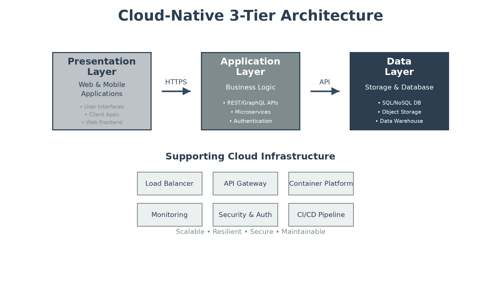

# Executive Summary

This document provides the comprehensive technical design for the Sample Solution implementation. It covers the target-state architecture, security controls, data design, integration patterns, and implementation approach required for successful deployment.

## Purpose

Define the technical architecture and design specifications that will guide the implementation team through deployment, configuration, and validation of the solution.

## Scope

**In-scope:**
- Core application components and services
- Data storage and processing pipelines
- Integration with external systems
- Security controls and compliance requirements
- Monitoring and operational procedures

**Out-of-scope:**
- End-user training (covered in Implementation Guide)
- Ongoing support procedures (covered in Operations Runbook)

## Assumptions & Constraints

The following assumptions underpin the design and must be validated during implementation.

- Cloud provider account with appropriate permissions established
- Network connectivity between on-premises and cloud environments available
- Security team has approved the proposed architecture
- 4-hour RTO, 1-hour RPO requirements apply

## References

This document should be read in conjunction with the following related materials.

- Statement of Work (SOW)
- Discovery Questionnaire responses
- Vendor best practices documentation
- Client security standards

# Business Context

This section establishes the business drivers, success criteria, and compliance requirements that shape the technical design decisions.

## Business Drivers

The solution addresses the following key business objectives identified during discovery.

- **Operational Efficiency:** Reduce manual processes through automation
- **Scalability:** Support 3x growth in transaction volume without re-architecture
- **Cost Optimization:** Achieve 25% reduction in infrastructure costs
- **Security Enhancement:** Meet compliance requirements for data protection

## Workload Criticality & SLA Expectations

The following service level targets define the operational requirements for the production environment and guide infrastructure sizing decisions.

<!-- TABLE_CONFIG: widths=[25, 25, 25, 25] -->
| Metric | Target | Measurement | Priority |
|--------|--------|-------------|----------|
| Availability | 99.9% | Uptime monitoring | Critical |
| Response Time | < 2 seconds | APM p95 latency | High |
| RTO | 4 hours | DR testing | Critical |
| RPO | 1 hour | Backup verification | Critical |

## Compliance & Regulatory Factors

The solution must adhere to the following regulatory and compliance requirements.

- SOC 2 Type II compliance required for all components handling customer data
- Data residency requirements mandate primary storage in designated region
- Audit logging required for all administrative actions
- Encryption at rest and in transit mandatory

## Success Criteria

Project success will be measured against the following criteria at go-live.

- All functional requirements from SOW implemented and validated
- Performance targets met under load testing conditions
- Security controls pass third-party assessment
- Operations team trained and capable of independent support

# Current-State Assessment

This section documents the existing environment that the solution will integrate with or replace. For greenfield implementations, this section may be marked N/A.

## Application Landscape

The current environment consists of legacy applications that will be modernized or integrated with the new solution.

<!-- TABLE_CONFIG: widths=[25, 30, 25, 20] -->
| Application | Purpose | Technology | Status |
|-------------|---------|------------|--------|
| Legacy CRM | Customer management | On-premises SQL Server | To be integrated |
| File Server | Document storage | Windows File Services | To be migrated |
| Email System | Communications | Exchange Online | Integration point |

## Infrastructure Inventory

The current infrastructure consists of the following components that will be migrated or integrated with the new solution.

<!-- TABLE_CONFIG: widths=[20, 15, 35, 30] -->
| Component | Quantity | Specifications | Notes |
|-----------|----------|----------------|-------|
| Application Servers | 3 | 16 vCPU, 64GB RAM | Windows Server 2019 |
| Database Servers | 2 | 32 vCPU, 128GB RAM | SQL Server 2019 |
| Storage | 1 | 50TB NAS | NetApp FAS series |

## Dependencies & Integration Points

The current environment has the following external dependencies that must be considered during migration.

- Active Directory for user authentication
- SMTP relay for email notifications
- External API for third-party data enrichment
- VPN connectivity for remote access

## Network Topology

Current network uses traditional hub-and-spoke topology with:
- DMZ for public-facing services
- Internal network segments for application and database tiers
- Site-to-site VPN for branch office connectivity

## Security Posture

The current security controls provide a baseline that will be enhanced in the target architecture.

- Perimeter firewall with IDS/IPS
- Endpoint protection on all servers
- Annual penetration testing
- Security awareness training program

## Performance Baseline

Current system performance metrics establish the baseline for improvement targets.

- Average response time: 3.5 seconds
- Peak concurrent users: 500
- Daily transaction volume: 50,000
- Database size: 2TB

# Solution Architecture

The target architecture leverages cloud-native services to deliver scalability, reliability, and security while minimizing operational overhead.

## Architecture Principles

The following principles guide all architectural decisions throughout the solution design.

- **Cloud-Native Design:** Leverage managed services to reduce operational burden
- **Security by Design:** Implement defense in depth with least privilege access
- **Scalability First:** Design for horizontal scaling from day one
- **Infrastructure as Code:** All infrastructure defined and version-controlled
- **Observability:** Comprehensive monitoring, logging, and tracing

## Architecture Patterns

The solution implements the following architectural patterns to address scalability and reliability requirements.

- **Primary Pattern:** Microservices with API Gateway
- **Data Pattern:** Event-driven with eventual consistency
- **Integration Pattern:** Async messaging with dead-letter queues
- **Deployment Pattern:** Blue-green with automated rollback

## Component Design

The solution comprises the following logical components, each with specific responsibilities and scaling characteristics.

<!-- TABLE_CONFIG: widths=[18, 25, 22, 18, 17] -->
| Component | Purpose | Technology | Dependencies | Scaling |
|-----------|---------|------------|--------------|---------|
| API Gateway | Request routing, rate limiting | Managed API Gateway | Auth Service | Managed |
| Auth Service | Authentication, authorization | OAuth 2.0 / OIDC | Identity Provider | Horizontal |
| Core Service | Business logic processing | Container runtime | Database, Cache | Horizontal |
| Data Service | Data persistence, queries | Managed SQL Database | None | Vertical |
| Message Broker | Async event processing | Managed Queue Service | None | Managed |
| Cache Layer | Session and data caching | Managed Redis | None | Horizontal |

## Technology Stack

The technology stack has been selected based on requirements for scalability, maintainability, and alignment with organizational standards.

<!-- TABLE_CONFIG: widths=[25, 35, 40] -->
| Layer | Technology | Rationale |
|-------|------------|-----------|
| Compute | Containers on managed orchestration | Portability, scaling, cost optimization |
| Database | Managed relational database | High availability, automated backups |
| Storage | Object storage with lifecycle policies | Cost optimization, durability |
| Networking | Virtual private cloud with subnets | Isolation, security controls |
| Monitoring | Cloud-native monitoring suite | Integrated metrics, logs, traces |

# Security & Compliance

This section details the security controls, compliance mappings, and governance mechanisms implemented in the solution.

## Identity & Access Management

Access control follows a zero-trust model with centralized identity management.

- **Authentication:** OAuth 2.0 with OpenID Connect for user authentication
- **Authorization:** Role-based access control (RBAC) with least privilege
- **MFA:** Required for all administrative access and sensitive operations
- **Service Accounts:** Managed identities with automatic credential rotation

### Role Definitions

The following roles define access levels within the system, following the principle of least privilege.

<!-- TABLE_CONFIG: widths=[20, 40, 40] -->
| Role | Permissions | Scope |
|------|-------------|-------|
| Administrator | Full system access | All resources |
| Operator | Read access, limited write | Production environment |
| Developer | Full access to non-production | Development, staging |
| Auditor | Read-only access | All environments |

## Secrets Management

All sensitive credentials are managed through a centralized secrets management solution.

- Centralized secrets manager for all credentials
- Automatic rotation for database credentials (90-day cycle)
- API keys stored with versioning and access logging
- No secrets in code repositories or configuration files

## Network Security

Network security implements defense-in-depth with multiple layers of protection.

- **Segmentation:** Separate subnets for web, application, and data tiers
- **Firewall:** Network security groups with deny-by-default rules
- **WAF:** Web application firewall for public endpoints
- **DDoS Protection:** Cloud provider DDoS mitigation service

## Data Protection

Data protection controls ensure confidentiality and integrity throughout the data lifecycle.

- **Encryption at Rest:** AES-256 for all data stores
- **Encryption in Transit:** TLS 1.3 for all communications
- **Key Management:** Cloud-managed keys with customer-controlled rotation
- **Data Masking:** PII masked in non-production environments

## Compliance Mappings

The following table maps compliance requirements to specific implementation controls.

<!-- TABLE_CONFIG: widths=[25, 35, 40] -->
| Framework | Requirement | Implementation |
|-----------|-------------|----------------|
| SOC 2 | Access control | RBAC, MFA, audit logging |
| SOC 2 | Encryption | AES-256 at rest, TLS 1.3 in transit |
| GDPR | Data residency | Primary region deployment |
| GDPR | Right to erasure | Automated data deletion workflows |

## Audit Logging & SIEM Integration

Comprehensive audit logging supports security monitoring and compliance requirements.

- All authentication events logged with user context
- Administrative actions captured with before/after state
- Log retention: 90 days hot, 1 year cold storage
- SIEM integration via standard log forwarding

# Data Architecture

This section defines the data model, storage strategy, migration approach, and governance controls for the solution.

## Data Model

### Conceptual Model

The solution manages the following core entities:
- **Users:** System users with roles and permissions
- **Transactions:** Business transactions with full audit trail
- **Documents:** Uploaded and generated documents
- **Configurations:** System settings and preferences

### Logical Model

The logical data model defines the primary entities and their relationships within the system.

<!-- TABLE_CONFIG: widths=[20, 25, 30, 25] -->
| Entity | Key Attributes | Relationships | Volume |
|--------|----------------|---------------|--------|
| User | ID, email, role, status | Has many Transactions | 10,000 |
| Transaction | ID, user_id, type, amount, status | Belongs to User | 1M/year |
| Document | ID, transaction_id, type, path | Belongs to Transaction | 500K/year |
| AuditLog | ID, entity, action, user_id, timestamp | References all entities | 10M/year |

## Data Flow Design

1. **Ingestion:** Data enters via API Gateway or batch file upload
2. **Validation:** Input validation and business rules applied
3. **Processing:** Business logic transforms and enriches data
4. **Storage:** Persisted to appropriate data store
5. **Distribution:** Events published for downstream consumers

## Data Migration Strategy

Data migration follows a phased approach to minimize risk and ensure data integrity.

- **Approach:** Phased migration with parallel run period
- **Validation:** Row counts, checksums, and business rule validation
- **Rollback:** Full rollback capability during parallel run
- **Cutover:** Big-bang cutover after validation complete

## Data Governance

Data governance policies ensure proper handling, retention, and quality management.

- **Classification:** Public, Internal, Confidential, Restricted
- **Retention:** 7 years for financial data, 90 days for logs
- **Quality:** Automated validation rules, data quality dashboards
- **Access:** Role-based with audit logging

# Integration Design

This section documents the integration patterns, APIs, and external system connections.

## External System Integrations

The solution integrates with the following external systems using standardized protocols and error handling.

<!-- TABLE_CONFIG: widths=[18, 15, 15, 15, 22, 15] -->
| System | Type | Protocol | Format | Error Handling | SLA |
|--------|------|----------|--------|----------------|-----|
| CRM System | Real-time | REST | JSON | Retry with backoff | 99.9% |
| ERP System | Batch | SFTP | CSV | Dead letter queue | 99.5% |
| Email Service | Real-time | SMTP | MIME | Circuit breaker | 99.9% |
| Identity Provider | Real-time | OIDC | JWT | Failover to cache | 99.99% |

## API Design

APIs follow REST principles with standardized security and documentation practices.

- **Style:** RESTful with OpenAPI 3.0 specification
- **Versioning:** URL path versioning (v1, v2)
- **Authentication:** OAuth 2.0 bearer tokens
- **Rate Limiting:** 1000 requests/minute per client

### API Endpoints

The following REST API endpoints provide programmatic access to core system functionality.

<!-- TABLE_CONFIG: widths=[15, 30, 20, 35] -->
| Method | Endpoint | Auth | Description |
|--------|----------|------|-------------|
| GET | /api/v1/transactions | Bearer | List transactions with filtering |
| POST | /api/v1/transactions | Bearer | Create new transaction |
| GET | /api/v1/transactions/{id} | Bearer | Get transaction details |
| PUT | /api/v1/transactions/{id} | Bearer | Update transaction |

## Authentication & SSO Flows

Single sign-on provides seamless authentication across all solution components.

- SAML 2.0 federation with enterprise identity provider
- OAuth 2.0 authorization code flow for web applications
- Client credentials flow for service-to-service communication
- JWT tokens with 1-hour expiry and refresh token rotation

## Messaging & Event Patterns

Asynchronous messaging enables loose coupling and reliable event processing.

- **Queue Service:** Asynchronous processing with guaranteed delivery
- **Event Bus:** Pub/sub for cross-service notifications
- **Dead Letter Queue:** Failed messages retained for analysis
- **Retry Policy:** Exponential backoff with maximum 5 attempts

# Infrastructure & Operations

This section covers the infrastructure design, deployment architecture, and operational procedures.

## Network Design

The virtual network architecture provides isolation and security through segmentation.

- **VPC CIDR:** 10.0.0.0/16
- **Public Subnets:** 10.0.1.0/24, 10.0.2.0/24 (load balancers)
- **Private Subnets:** 10.0.10.0/24, 10.0.11.0/24 (application)
- **Database Subnets:** 10.0.20.0/24, 10.0.21.0/24 (data tier)

## Compute Sizing

Instance sizing has been determined based on performance testing results and anticipated workload requirements.

<!-- TABLE_CONFIG: widths=[25, 20, 20, 20, 15] -->
| Component | Instance Type | vCPU | Memory | Count |
|-----------|---------------|------|--------|-------|
| Web Tier | Medium | 2 | 4 GB | 2-10 (auto) |
| API Tier | Large | 4 | 8 GB | 2-20 (auto) |
| Worker Tier | Medium | 2 | 4 GB | 1-5 (auto) |
| Database | XLarge | 8 | 32 GB | 2 (primary + replica) |

## High Availability Design

The solution eliminates single points of failure through redundancy at every tier.

- Multi-availability zone deployment for all tiers
- Automated failover for database tier
- Health checks with automatic instance replacement
- Cross-region replication for disaster recovery

## Disaster Recovery

Disaster recovery capabilities ensure business continuity in the event of regional failure.

- **RPO:** 1 hour (continuous replication)
- **RTO:** 4 hours (automated recovery procedures)
- **Backup:** Daily full, hourly incremental
- **DR Site:** Warm standby in secondary region

## Monitoring & Alerting

Comprehensive monitoring provides visibility across infrastructure, applications, and business metrics.

- **Infrastructure:** CPU, memory, disk, network metrics
- **Application:** Response times, error rates, throughput
- **Business:** Transaction volumes, success rates, SLA compliance
- **Alerting:** PagerDuty integration with escalation policies

### Alert Definitions

The following alerts have been configured to ensure proactive incident detection and response.

<!-- TABLE_CONFIG: widths=[25, 25, 25, 25] -->
| Alert | Condition | Severity | Response |
|-------|-----------|----------|----------|
| High CPU | > 80% for 5 min | Warning | Auto-scale |
| Error Rate | > 5% for 5 min | Critical | Page on-call |
| Database Latency | > 100ms p95 | Warning | Investigate |
| Disk Space | < 20% free | Critical | Expand storage |

## Logging & Observability

Centralized logging and distributed tracing enable rapid troubleshooting and analysis.

- Centralized log aggregation with 90-day retention
- Distributed tracing for request flow analysis
- Custom dashboards for each service
- Log-based metrics for business KPIs

## Cost Model

The estimated monthly infrastructure costs are based on production workload requirements with identified optimization opportunities.

<!-- TABLE_CONFIG: widths=[30, 25, 25, 20] -->
| Category | Monthly Estimate | Optimization | Savings |
|----------|------------------|--------------|---------|
| Compute | $2,500 | Reserved instances | 30% |
| Database | $1,500 | Reserved capacity | 25% |
| Storage | $500 | Lifecycle policies | 40% |
| Networking | $300 | NAT optimization | 20% |

# Implementation Approach

This section outlines the deployment strategy, tooling, and sequencing for the implementation.

## Migration/Deployment Strategy

The deployment strategy minimizes risk through phased rollout with validation gates.

- **Approach:** Phased deployment with pilot rollout
- **Pattern:** Blue-green deployment for zero-downtime updates
- **Validation:** Automated testing at each phase gate
- **Rollback:** One-click rollback to previous version

## Sequencing & Wave Planning

The implementation follows a phased approach with clear exit criteria to ensure quality and minimize risk.

<!-- TABLE_CONFIG: widths=[15, 30, 25, 30] -->
| Phase | Activities | Duration | Exit Criteria |
|-------|------------|----------|---------------|
| 1 | Foundation (IAM, networking, monitoring) | 2 weeks | Infrastructure validated |
| 2 | Core services deployment | 3 weeks | Services operational |
| 3 | Data migration | 2 weeks | Data validated |
| 4 | Integration & testing | 2 weeks | UAT complete |
| 5 | Cutover & go-live | 1 week | Production stable |

## Tooling & Automation

The following tools provide the automation foundation for infrastructure provisioning, deployment, and operations.

<!-- TABLE_CONFIG: widths=[25, 35, 40] -->
| Category | Tool | Purpose |
|----------|------|---------|
| Infrastructure as Code | Terraform | Cloud resource provisioning |
| Configuration Management | Ansible | Server configuration |
| CI/CD | GitHub Actions | Build, test, deploy automation |
| Container Registry | Cloud container registry | Image storage and scanning |
| Secrets Management | Cloud secrets manager | Credential storage |

## Cutover Approach

The cutover strategy balances risk mitigation with project timeline requirements.

- **Type:** Phased cutover with parallel run
- **Duration:** 2-week parallel run period
- **Validation:** Daily reconciliation reports
- **Decision Point:** Go/no-go 48 hours before final cutover

## Downtime Expectations

Service availability impacts during implementation have been minimized through careful planning.

- **Planned Downtime:** 4-hour maintenance window for final cutover
- **Unplanned Downtime:** Target < 4 hours MTTR
- **Mitigation:** Pre-staged rollback, on-call support during cutover

## Rollback Strategy

Rollback procedures are documented and tested to enable rapid recovery if issues arise.

- Infrastructure rollback via Terraform state
- Application rollback via container image tags
- Database rollback via point-in-time recovery
- Maximum rollback window: 24 hours post-deployment

# Appendices

## Architecture Diagrams

The following diagrams provide visual representation of the solution architecture.

- Solution Architecture Diagram (included in Solution Architecture section)
- Network Topology Diagram
- Data Flow Diagram
- Security Architecture Diagram

## Naming Conventions

All cloud resources follow standardized naming conventions to ensure consistency and enable automated resource management.

<!-- TABLE_CONFIG: widths=[25, 35, 40] -->
| Resource Type | Pattern | Example |
|---------------|---------|---------|
| Resource Group | `{env}-{app}-{region}-rg` | `prod-sample-eastus-rg` |
| Virtual Network | `{env}-{app}-vnet` | `prod-sample-vnet` |
| Subnet | `{env}-{app}-{tier}-subnet` | `prod-sample-web-subnet` |
| Storage Account | `{env}{app}storage` | `prodsamplestorage` |

## Tagging Standards

Resource tagging enables cost allocation, operational automation, and compliance reporting across the environment.

<!-- TABLE_CONFIG: widths=[25, 35, 40] -->
| Tag | Required | Example Values |
|-----|----------|----------------|
| Environment | Yes | dev, staging, prod |
| Application | Yes | sample-solution |
| Owner | Yes | platform-team |
| CostCenter | Yes | CC-12345 |
| DataClassification | Yes | public, internal, confidential |

## Risk Register

The following risks have been identified during the design phase with corresponding mitigation strategies.

<!-- TABLE_CONFIG: widths=[25, 15, 15, 45] -->
| Risk | Likelihood | Impact | Mitigation |
|------|------------|--------|------------|
| Data loss during migration | Low | High | Parallel run, validated backups, rollback plan |
| Performance degradation | Medium | Medium | Load testing, capacity planning, auto-scaling |
| Integration failures | Medium | High | Circuit breakers, retry logic, monitoring |
| Security breach | Low | Critical | Defense in depth, monitoring, incident response |
| Cost overrun | Medium | Medium | Budget alerts, reserved capacity, optimization |

## Glossary

The following terms and acronyms are used throughout this document.

<!-- TABLE_CONFIG: widths=[25, 75] -->
| Term | Definition |
|------|------------|
| API | Application Programming Interface |
| CIDR | Classless Inter-Domain Routing |
| HA | High Availability |
| IAM | Identity and Access Management |
| IaC | Infrastructure as Code |
| MTTR | Mean Time to Recovery |
| RBAC | Role-Based Access Control |
| RPO | Recovery Point Objective |
| RTO | Recovery Time Objective |
| SLA | Service Level Agreement |
| VPC | Virtual Private Cloud |
