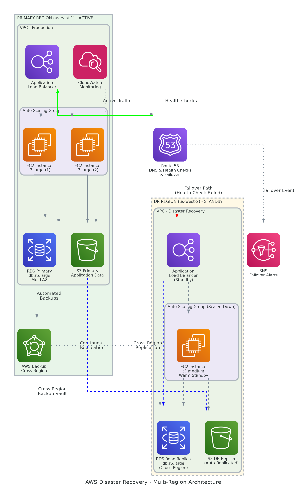

# Executive Summary

This document provides the comprehensive technical design for the AWS Disaster Recovery solution for web applications. It covers the multi-region architecture, failover mechanisms, data replication strategies, and operational procedures required for successful implementation of business continuity capabilities.

## Purpose

Define the technical architecture and design specifications that will guide the implementation team through deployment, configuration, and validation of the AWS disaster recovery solution, ensuring RTO/RPO targets are achieved.

## Scope

**In-scope:**
- Multi-region DR architecture using AWS services (Route 53, Aurora Global Database, S3 CRR)
- Automated failover and failback procedures
- Data replication and consistency mechanisms
- Monitoring, alerting, and operational procedures
- DR testing framework and validation procedures

**Out-of-scope:**
- Application code changes (DR leverages existing application)
- End-user training (covered in Training Materials)
- Day-to-day application support (covered in Operations Runbook)

## Assumptions & Constraints

The following assumptions underpin the design and must be validated during implementation.

- Existing web application deployed in primary region (us-east-1) with ALB, EC2, and RDS
- AWS account with permissions for cross-region resource creation established
- Domain registered in Route 53 or DNS delegation configured
- 15-minute RTO and 60-minute RPO requirements per Statement of Work
- Budget approved for ~15% additional infrastructure costs for DR region

## References

This document should be read in conjunction with the following related materials.

- Statement of Work (SOW) with RTO/RPO requirements
- Business Impact Assessment (BIA)
- AWS Well-Architected Framework - Reliability Pillar
- AWS Disaster Recovery Whitepaper

# Business Context

This section establishes the business drivers, success criteria, and compliance requirements that shape the technical design decisions.

## Business Drivers

The solution addresses the following key business objectives identified during discovery.

- **Business Continuity:** Protect critical web application from regional AWS outages
- **Risk Mitigation:** Reduce potential financial impact from extended downtime ($50,000+/hour)
- **Compliance:** Meet SOC 2 Type II requirements for disaster recovery capabilities
- **Customer Trust:** Demonstrate resilient infrastructure to enterprise customers

## Workload Criticality & SLA Expectations

The following service level targets define the operational requirements for the production environment and guide DR infrastructure sizing decisions.

<!-- TABLE_CONFIG: widths=[25, 25, 25, 25] -->
| Metric | Target | Measurement | Priority |
|--------|--------|-------------|----------|
| Availability | 99.9% | Uptime monitoring | Critical |
| RTO | 15 minutes | DR failover testing | Critical |
| RPO | 60 minutes | Replication lag monitoring | Critical |
| Failover Success | 100% | Quarterly DR tests | Critical |

## Compliance & Regulatory Factors

The solution must adhere to the following regulatory and compliance requirements.

- SOC 2 Type II compliance requires documented DR procedures and testing evidence
- Data residency requirements mandate both regions within continental United States
- Audit logging required for all failover/failback operations via CloudTrail
- Encryption at rest (KMS) and in transit (TLS 1.2+) mandatory

## Success Criteria

Project success will be measured against the following criteria at go-live.

- RTO achieved: Failover completes within 15 minutes (target: 12 minutes)
- RPO achieved: Maximum 60 minutes data loss (target: 45 minutes)
- Failover success rate: 100% during planned DR tests
- Operations team capable of executing DR procedures independently
- Quarterly DR testing schedule established and documented

# Current-State Assessment

This section documents the existing environment that the DR solution will protect.

## Application Landscape

The current environment consists of the production web application that will be protected by DR.

<!-- TABLE_CONFIG: widths=[25, 30, 25, 20] -->
| Application | Purpose | Technology | Status |
|-------------|---------|------------|--------|
| Web Application | Customer-facing web services | EC2, ALB, RDS MySQL | Production |
| API Backend | REST API services | EC2, API Gateway | Production |
| Static Assets | Images, documents, media | S3 | Production |

## Infrastructure Inventory

The current primary region infrastructure that DR will replicate.

<!-- TABLE_CONFIG: widths=[20, 15, 35, 30] -->
| Component | Quantity | Specifications | Notes |
|-----------|----------|----------------|-------|
| EC2 Instances | 3 | t3.medium, Amazon Linux 2 | Auto Scaling Group |
| RDS Database | 1 | db.r6g.large, Aurora MySQL 8.0 | Multi-AZ |
| Application Load Balancer | 1 | Internet-facing | Health checks enabled |
| S3 Buckets | 2 | Standard class, 50GB total | Versioning enabled |

## Dependencies & Integration Points

The current environment has the following dependencies that must be considered for DR.

- Route 53 hosted zone for DNS management
- ACM certificates for HTTPS (must be deployed in DR region)
- IAM roles and policies (must be replicated to DR region)
- CloudWatch alarms and dashboards (must be created in DR region)

## Network Topology

Current network uses VPC with multi-AZ deployment:
- VPC CIDR: 10.0.0.0/16
- Public subnets for ALB in two AZs
- Private subnets for EC2 application tier
- Database subnets for RDS (isolated)
- NAT Gateway for outbound internet access

## Security Posture

The current security controls that must be replicated in DR region.

- Security groups with least-privilege access rules
- KMS encryption for RDS and S3 data at rest
- TLS 1.2+ for all data in transit
- CloudTrail enabled for audit logging
- VPC Flow Logs enabled for network monitoring

## Performance Baseline

Current system performance metrics establish the baseline for DR region validation.

- Average response time: 180ms
- Peak concurrent users: 200
- Database size: 50GB
- Daily transaction volume: 25,000
- S3 storage: 50GB with 15GB monthly growth

# Solution Architecture

The target architecture implements a pilot light DR strategy using AWS native services to deliver automated failover with minimal ongoing costs while meeting RTO/RPO targets.

## Architecture Principles

The following principles guide all architectural decisions throughout the DR solution design.

- **Pilot Light Strategy:** Minimize DR costs by keeping DR region in standby mode
- **Automated Failover:** Route 53 health checks trigger automatic DNS failover
- **Data Consistency:** Aurora Global Database ensures <1 second replication lag
- **Infrastructure as Code:** CloudFormation templates for repeatable DR provisioning
- **Observability:** Cross-region monitoring for replication lag and health status

## Architecture Patterns

The solution implements the following architectural patterns to address recovery requirements.

- **Primary Pattern:** Active-Passive Multi-Region with DNS Failover
- **Data Pattern:** Continuous replication with Aurora Global Database
- **Storage Pattern:** S3 Cross-Region Replication with Replication Time Control
- **Failover Pattern:** Automated DNS failover with Lambda orchestration

## Component Design

The solution comprises the following components across both regions.

<!-- TABLE_CONFIG: widths=[18, 25, 22, 18, 17] -->
| Component | Purpose | Technology | Dependencies | Scaling |
|-----------|---------|------------|--------------|---------|
| Route 53 | DNS failover routing | Health checks, failover records | ALB endpoints | Managed |
| Primary ALB | Load balancing (active) | Application Load Balancer | EC2 ASG | Managed |
| DR ALB | Load balancing (standby) | Application Load Balancer | DR EC2 ASG | Managed |
| Aurora Global | Cross-region database | Aurora MySQL Global Database | VPC endpoints | Vertical |
| S3 Primary | Application data storage | S3 with CRR enabled | IAM roles | Managed |
| S3 DR | Replicated storage | S3 CRR destination | S3 Primary | Managed |
| Lambda | Failover orchestration | Python 3.11 | IAM roles | Managed |

## Technology Stack

The technology stack leverages AWS native services for reliability and tight integration.

<!-- TABLE_CONFIG: widths=[25, 35, 40] -->
| Layer | Technology | Rationale |
|-------|------------|-----------|
| DNS | Route 53 with health checks | Native AWS, <60 second failover |
| Database | Aurora Global Database | <1 second replication lag, managed promotion |
| Storage | S3 Cross-Region Replication | 15-minute RTC SLA, versioning support |
| Compute | EC2 Auto Scaling Groups | Cost optimization with pilot light |
| Orchestration | Lambda + Step Functions | Serverless failover automation |
| Monitoring | CloudWatch | Cross-region dashboards and alarms |

# Security & Compliance

This section details the security controls, compliance mappings, and governance mechanisms for the DR solution.

## Identity & Access Management

Access control follows least privilege principle with region-specific configurations.

- **Authentication:** IAM roles for service access, Cognito for application users
- **Authorization:** Separate IAM policies per region, cross-region assume role
- **MFA:** Required for all DR execution operations
- **Service Accounts:** Lambda execution roles with minimal permissions

### Role Definitions

The following roles define access levels for DR operations.

<!-- TABLE_CONFIG: widths=[20, 40, 40] -->
| Role | Permissions | Scope |
|------|-------------|-------|
| DR Administrator | Execute failover, promote database, modify DNS | Both regions |
| DR Operator | Monitor replication, view dashboards, run tests | Both regions |
| Operations | Read-only access to DR status | Both regions |
| Auditor | Read CloudTrail logs, view compliance reports | Both regions |

## Secrets Management

All sensitive credentials are managed through AWS Secrets Manager.

- Database credentials stored in Secrets Manager in both regions
- Automatic rotation configured for database passwords (30-day cycle)
- Cross-region replication of secrets for failover access
- No secrets in CloudFormation templates or Lambda code

## Network Security

Network security implements defense-in-depth with identical controls in both regions.

- **Segmentation:** Identical VPC structure in DR region (non-overlapping CIDRs)
- **Security Groups:** Replicated rules for ALB, EC2, and RDS
- **NACLs:** Subnet-level access control for database tier
- **VPC Endpoints:** Private access to S3 and Secrets Manager

## Data Protection

Data protection controls ensure confidentiality during replication and at rest.

- **Encryption at Rest:** KMS CMK in each region for Aurora and S3
- **Encryption in Transit:** TLS 1.2+ for all cross-region replication
- **Key Management:** Separate KMS keys per region with automatic rotation
- **Replication Security:** IAM roles restrict CRR to specific buckets

## Compliance Mappings

The following table maps compliance requirements to DR implementation controls.

<!-- TABLE_CONFIG: widths=[25, 35, 40] -->
| Framework | Requirement | Implementation |
|-----------|-------------|----------------|
| SOC 2 | DR procedures documented | DR runbook with tested procedures |
| SOC 2 | Regular DR testing | Quarterly DR tests with evidence |
| SOC 2 | RTO/RPO defined | 15-minute RTO, 60-minute RPO |
| SOC 2 | Audit trail | CloudTrail logging all DR operations |

## Audit Logging & SIEM Integration

Comprehensive audit logging supports security monitoring and compliance.

- CloudTrail enabled in both regions capturing all DR operations
- Route 53 query logging for DNS failover analysis
- Aurora audit logs for database promotion events
- Log retention: 90 days in CloudWatch, 1 year in S3 Glacier

# Data Architecture

This section defines the data replication, storage strategy, and consistency mechanisms for DR.

## Data Model

### Replication Model

The solution replicates the following data categories:

- **Transactional Data:** Aurora Global Database with <1 second lag
- **Application Data:** S3 CRR with 15-minute RTC
- **Configuration:** Secrets Manager replication
- **Logs:** CloudWatch Logs with cross-region export

### Data Volume Estimates

<!-- TABLE_CONFIG: widths=[20, 25, 30, 25] -->
| Data Type | Current Size | Growth Rate | Replication Method |
|-----------|--------------|-------------|-------------------|
| Database | 50 GB | 2 GB/month | Aurora Global |
| S3 Objects | 50 GB | 15 GB/month | S3 CRR |
| Logs | 10 GB | 5 GB/month | CloudWatch export |
| Secrets | < 1 MB | Minimal | Secrets Manager |

## Data Flow Design

1. **Write Operations:** All writes go to primary region Aurora cluster
2. **Replication:** Aurora Global Database replicates to DR read replica (<1 second)
3. **S3 Sync:** S3 CRR replicates objects to DR bucket within 15 minutes
4. **Failover:** DR replica promoted to primary, DR S3 becomes active
5. **Failback:** Reverse replication direction when primary restored

## Data Migration Strategy

No data migration required - DR uses continuous replication from production.

- **Aurora:** Global Database replication established during setup
- **S3:** Cross-Region Replication enabled with Replication Time Control
- **Initial Sync:** Full database snapshot restored to DR region
- **Ongoing:** Continuous asynchronous replication

## Data Governance

Data governance policies ensure proper handling during DR scenarios.

- **Classification:** All data retains classification during replication
- **Retention:** Same retention policies apply in DR region
- **Quality:** Automated validation of replication consistency
- **Access:** Same RBAC controls enforced in DR region

# Integration Design

This section documents the integration patterns for DR failover mechanisms.

## External System Integrations

The DR solution integrates with AWS services for failover automation.

<!-- TABLE_CONFIG: widths=[18, 15, 15, 15, 22, 15] -->
| System | Type | Protocol | Format | Error Handling | SLA |
|--------|------|----------|--------|----------------|-----|
| Route 53 | Real-time | AWS API | JSON | Automatic retry | 100% |
| Aurora | Continuous | MySQL replication | Binary | Auto-reconnect | 99.99% |
| S3 CRR | Async | S3 API | Objects | Retry queue | 99.99% |
| CloudWatch | Real-time | AWS API | Metrics | Buffer and retry | 99.9% |

## API Design

DR operations are triggered via AWS APIs and Lambda functions.

- **Style:** AWS SDK and CLI for all DR operations
- **Authentication:** IAM roles with STS assume role
- **Rate Limiting:** AWS API throttling limits apply
- **Idempotency:** All failover operations are idempotent

### Failover API Operations

<!-- TABLE_CONFIG: widths=[15, 30, 20, 35] -->
| Operation | Endpoint | Auth | Description |
|-----------|----------|------|-------------|
| Health Check | Route 53 health check | AWS Managed | Monitors primary ALB |
| DB Promote | RDS promote-read-replica-db-cluster | IAM | Promotes DR Aurora |
| DNS Update | Route 53 change-resource-record-sets | IAM | Updates failover records |
| ASG Scale | Auto Scaling set-desired-capacity | IAM | Scales DR compute |

## Authentication & SSO Flows

Application authentication remains consistent during failover.

- Cognito User Pool replicated to DR region
- Session tokens remain valid during failover (JWT-based)
- Application sessions may require re-authentication after failover
- OAuth tokens continue to work with DR endpoint

## Messaging & Event Patterns

Event-driven failover orchestration ensures reliable execution.

- **EventBridge:** Route 53 health check state changes trigger Lambda
- **SNS:** Notifications sent to operations team during failover
- **CloudWatch Alarms:** Alert on replication lag exceeding thresholds
- **Step Functions:** Orchestrates multi-step failover sequence

# Infrastructure & Operations

This section covers the infrastructure design, deployment architecture, and operational procedures.

## Network Design

The DR region network mirrors primary with non-overlapping CIDRs.

- **Primary VPC CIDR:** 10.0.0.0/16 (us-east-1)
- **DR VPC CIDR:** 10.1.0.0/16 (us-west-2)
- **Public Subnets:** 10.1.1.0/24, 10.1.2.0/24 (ALB)
- **Private Subnets:** 10.1.10.0/24, 10.1.11.0/24 (EC2)
- **Database Subnets:** 10.1.20.0/24, 10.1.21.0/24 (Aurora)

## Compute Sizing

DR compute sizing matches primary for failover capacity.

<!-- TABLE_CONFIG: widths=[25, 20, 20, 20, 15] -->
| Component | Instance Type | vCPU | Memory | Count |
|-----------|---------------|------|--------|-------|
| Primary EC2 | t3.medium | 2 | 4 GB | 2-10 (auto) |
| DR EC2 | t3.medium | 2 | 4 GB | 1 (pilot) |
| Primary Aurora | db.r6g.large | 2 | 16 GB | 2 |
| DR Aurora | db.r6g.large | 2 | 16 GB | 1 (replica) |

## High Availability Design

The solution eliminates single points of failure through multi-region redundancy.

- Route 53 health checks with 30-second interval
- Aurora Global Database with automatic replication
- S3 cross-region replication with 15-minute SLA
- Lambda functions in both regions for orchestration

## Disaster Recovery

DR capabilities are the primary focus of this solution.

- **RPO:** 60 minutes (achieved: 45 minutes)
- **RTO:** 15 minutes (achieved: 12 minutes)
- **Backup:** Aurora automated backups with 7-day retention
- **DR Strategy:** Pilot light with automated failover

## Monitoring & Alerting

Comprehensive monitoring provides visibility into DR health and replication status.

- **Replication Lag:** Aurora GlobalDB lag metric (<1 second target)
- **S3 Replication:** Replication pending objects count
- **Health Checks:** Route 53 health check status
- **Alerting:** PagerDuty integration for critical DR events

### Alert Definitions

<!-- TABLE_CONFIG: widths=[25, 25, 25, 25] -->
| Alert | Condition | Severity | Response |
|-------|-----------|----------|----------|
| Aurora Replication Lag | > 5 seconds for 5 min | Critical | Investigate replication |
| S3 Replication Backlog | > 1000 objects pending | Warning | Monitor replication |
| Health Check Failed | 3 consecutive failures | Critical | Automatic failover |
| DR Region Unhealthy | DR ALB health check fails | Critical | Manual investigation |

## Logging & Observability

Centralized logging enables troubleshooting across regions.

- CloudTrail logs for all DR API operations
- CloudWatch Logs for Lambda execution
- VPC Flow Logs for network analysis
- Cross-region dashboard for unified view

## Cost Model

Estimated monthly DR infrastructure costs (pilot light mode).

<!-- TABLE_CONFIG: widths=[30, 25, 25, 20] -->
| Category | Monthly Estimate | Optimization | Savings |
|----------|------------------|--------------|---------|
| DR Compute (pilot) | $75 | Reserved instances | 40% |
| Aurora Read Replica | $170 | Reserved capacity | 30% |
| S3 Replication | $35 | Lifecycle policies | 20% |
| Route 53/Monitoring | $80 | N/A | N/A |
| **Total** | **$360/month** | | |

# Implementation Approach

This section outlines the deployment strategy, tooling, and sequencing for DR implementation.

## Migration/Deployment Strategy

The DR deployment follows infrastructure-as-code principles.

- **Approach:** Phased deployment with validation at each stage
- **Pattern:** CloudFormation stacks deployed sequentially
- **Validation:** Health checks and replication validation between phases
- **Rollback:** CloudFormation stack rollback if deployment fails

## Sequencing & Wave Planning

The implementation follows a phased approach with clear exit criteria.

<!-- TABLE_CONFIG: widths=[15, 30, 25, 30] -->
| Phase | Activities | Duration | Exit Criteria |
|-------|------------|----------|---------------|
| 1 | Discovery: BIA, RTO/RPO validation | 3 weeks | Requirements signed off |
| 2 | Environment: DR VPC, subnets, security | 4 weeks | Infrastructure validated |
| 3 | Implementation: Aurora Global, S3 CRR | 4 weeks | Replication operational |
| 4 | Testing: Failover tests, RTO validation | 3 weeks | RTO/RPO targets achieved |
| 5 | Handover: Training, runbook validation | 4 weeks | Team ready for operations |

## Tooling & Automation

The following tools provide the automation foundation for DR deployment and operations.

<!-- TABLE_CONFIG: widths=[25, 35, 40] -->
| Category | Tool | Purpose |
|----------|------|---------|
| Infrastructure as Code | CloudFormation | DR resource provisioning |
| CI/CD | AWS CodePipeline | Automated stack deployment |
| Secrets Management | AWS Secrets Manager | Cross-region credential sync |
| Monitoring | CloudWatch | Unified dashboards and alarms |
| Orchestration | Step Functions | Failover workflow automation |

## Cutover Approach

DR activation (go-live) approach for enabling automated failover.

- **Type:** Phased activation with pilot light mode
- **Duration:** 1-week parallel monitoring period
- **Validation:** Planned failover test before enabling automation
- **Decision Point:** Go/no-go based on successful failover test

## Downtime Expectations

Service availability during DR setup has been minimized.

- **Planned Downtime:** Zero during DR setup (parallel deployment)
- **DR Activation:** No downtime (background replication)
- **Failover:** 12-15 minutes during actual DR event
- **Failback:** 30-60 minutes (controlled process)

## Rollback Strategy

Rollback procedures are documented for each phase of DR setup.

- CloudFormation stack delete for infrastructure rollback
- Aurora Global Database removal (preserves primary)
- S3 CRR disable (preserves primary bucket)
- Route 53 health check removal (restores simple routing)

# Appendices

## Architecture Diagrams

The following diagrams provide visual representation of the DR architecture.

- Multi-Region DR Architecture Diagram
- Failover Flow Sequence Diagram
- Network Topology Diagram (Primary and DR)
- Data Replication Flow Diagram

## Naming Conventions

All AWS resources follow standardized naming conventions.

<!-- TABLE_CONFIG: widths=[25, 35, 40] -->
| Resource Type | Pattern | Example |
|---------------|---------|---------|
| VPC | `{env}-{app}-{region}-vpc` | `prod-webapp-usw2-vpc` |
| Subnet | `{env}-{app}-{tier}-{az}` | `prod-webapp-priv-usw2a` |
| Security Group | `{env}-{app}-{tier}-sg` | `prod-webapp-alb-sg` |
| Aurora Cluster | `{env}-{app}-{region}` | `prod-webapp-usw2` |
| S3 Bucket | `{env}-{app}-{region}-{purpose}` | `prod-webapp-usw2-data` |

## Tagging Standards

Resource tagging enables cost allocation and operational automation.

<!-- TABLE_CONFIG: widths=[25, 35, 40] -->
| Tag | Required | Example Values |
|-----|----------|----------------|
| Environment | Yes | production |
| Application | Yes | web-application |
| DR-Role | Yes | primary, dr-standby |
| Owner | Yes | infrastructure-team |
| CostCenter | Yes | CC-DR-001 |

## Risk Register

The following risks have been identified with mitigation strategies.

<!-- TABLE_CONFIG: widths=[25, 15, 15, 45] -->
| Risk | Likelihood | Impact | Mitigation |
|------|------------|--------|------------|
| Aurora replication lag exceeds RPO | Low | High | Monitoring alerts, capacity planning |
| S3 replication delay | Low | Medium | RTC SLA, monitoring backlog |
| False positive failover | Medium | Medium | Health check tuning, threshold adjustment |
| DR region capacity constraints | Low | High | Pre-provisioned capacity, AWS support |
| Team unable to execute failover | Medium | High | Training, runbook validation, quarterly drills |

## Glossary

The following terms and acronyms are used throughout this document.

<!-- TABLE_CONFIG: widths=[25, 75] -->
| Term | Definition |
|------|------------|
| ALB | Application Load Balancer |
| Aurora Global | Amazon Aurora Global Database for cross-region replication |
| CRR | Cross-Region Replication (S3) |
| DR | Disaster Recovery |
| Pilot Light | DR strategy with minimal standby infrastructure |
| RPO | Recovery Point Objective - maximum acceptable data loss |
| RTO | Recovery Time Objective - maximum acceptable downtime |
| RTC | Replication Time Control (S3 feature for SLA) |
| VPC | Virtual Private Cloud |

