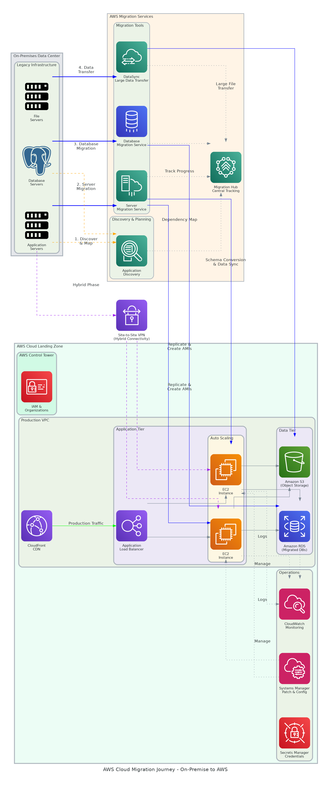

# Executive Summary

This document provides the comprehensive technical design for the AWS Cloud Migration solution. It covers the landing zone architecture, migration methodology, target infrastructure design, and operational procedures required for successful migration of on-premise workloads to AWS.

## Purpose

Define the technical architecture and design specifications that will guide the implementation team through the discovery, migration, and optimization phases of the AWS cloud migration project.

## Scope

**In-scope:**
- AWS multi-account landing zone architecture with Control Tower
- Migration patterns for 5-10 applications using AWS MGN and DMS
- Target state VPC design with multi-AZ high availability
- Security controls and compliance framework implementation
- Monitoring, logging, and operational procedures

**Out-of-scope:**
- Application refactoring or re-architecture (lift-and-shift focus)
- Third-party application licensing
- End-user device management

## Assumptions & Constraints

The following assumptions underpin the design and must be validated during implementation.

- Source applications are virtualized and compatible with AWS MGN replication
- Database workloads are supported by AWS DMS for migration
- Network bandwidth sufficient for data transfer within project timeline
- Client IT team available for application testing and validation
- AWS account with appropriate service limits established

## References

This document should be read in conjunction with the following related materials.

- Statement of Work (SOW) with migration scope parameters
- AWS Migration Acceleration Program (MAP) methodology
- AWS Well-Architected Framework
- AWS Landing Zone reference architecture

# Business Context

This section establishes the business drivers, success criteria, and compliance requirements that shape the technical design decisions.

## Business Drivers

The solution addresses the following key business objectives identified during discovery.

- **Infrastructure Modernization:** Replace aging on-premise hardware with modern cloud infrastructure
- **Cost Optimization:** Achieve 30-40% infrastructure cost reduction through cloud economics
- **Operational Agility:** Enable rapid provisioning and scaling for business growth
- **Business Continuity:** Implement multi-AZ architecture for improved availability
- **IT Transformation:** Free IT resources from maintenance to focus on innovation

## Workload Criticality & SLA Expectations

The following service level targets define the operational requirements for the migrated environment.

<!-- TABLE_CONFIG: widths=[25, 25, 25, 25] -->
| Metric | Target | Measurement | Priority |
|--------|--------|-------------|----------|
| Availability | 99.9% | CloudWatch uptime monitoring | Critical |
| Response Time | <200ms | Application Performance Monitoring | High |
| Migration Downtime | 4-8 hours | Per application cutover | High |
| Data Loss | Zero | Checksum validation | Critical |

## Compliance & Regulatory Factors

The solution must adhere to the following regulatory and compliance requirements.

- SOC 2 Type II compliance for cloud infrastructure controls
- Data residency requirements within continental United States
- Audit logging for all administrative actions via CloudTrail
- Encryption at rest (KMS) and in transit (TLS 1.2+) for all data

## Success Criteria

Project success will be measured against the following criteria at go-live.

- All in-scope applications migrated with zero data loss
- Application performance meets or exceeds on-premise baseline
- 30-40% infrastructure cost reduction achieved within 12 months
- Operations team capable of managing AWS environment independently
- No critical security findings in post-migration assessment

# Current-State Assessment

This section documents the existing on-premise environment that will be migrated to AWS.

## Application Landscape

The current environment consists of applications assessed for migration using 6Rs methodology.

<!-- TABLE_CONFIG: widths=[25, 30, 25, 20] -->
| Application | Purpose | Migration Strategy | Priority |
|-------------|---------|-------------------|----------|
| Web Portal | Customer-facing website | Rehost (MGN) | Wave 1 |
| Document Management | Internal document storage | Rehost (MGN) | Wave 1 |
| CRM System | Customer relationship management | Rehost (MGN) | Wave 2 |
| ERP Application | Enterprise resource planning | Rehost (MGN) | Wave 2 |
| HR System | Human resources management | Rehost (MGN) | Wave 2 |
| Email Archive | Historical email storage | Replatform (S3) | Wave 2 |
| Legacy Reporting | Business intelligence reports | Replatform (RDS) | Wave 3 |
| Manufacturing App | Custom production system | Rehost (MGN) | Wave 3 |

## Infrastructure Inventory

The current on-premise infrastructure to be migrated.

<!-- TABLE_CONFIG: widths=[20, 15, 35, 30] -->
| Component | Quantity | Specifications | Notes |
|-----------|----------|----------------|-------|
| Physical Servers | 15 | Various ages, VMware virtualized | Aging hardware |
| Virtual Machines | 32 | Windows Server 2016/2019, Linux | Application servers |
| Databases | 4 | MySQL 5.7, PostgreSQL 12, SQL Server | Total 450 GB |
| File Storage | 1 | NAS with 300 GB application data | CIFS/NFS shares |
| Network | 1 | Cisco switching/routing | 1Gbps backbone |

## Dependencies & Integration Points

The current environment has the following dependencies that must be addressed during migration.

- Active Directory for authentication (retain on-premise initially)
- Line-of-business applications with database dependencies
- File share access from desktop clients
- Email integration with Exchange server
- External vendor API connections

## Network Topology

Current network uses flat topology with basic segmentation:
- Production VLAN: 10.10.0.0/24
- Database VLAN: 10.10.1.0/24
- Management VLAN: 10.10.2.0/24
- Internet egress via single firewall
- No redundant WAN connectivity

## Security Posture

The current security controls that will be enhanced in AWS.

- Perimeter firewall with basic rule set
- Antivirus on all Windows servers
- Annual penetration testing
- Manual patching process (monthly cycle)
- Limited audit logging capabilities

## Performance Baseline

Current system performance metrics establish the baseline for post-migration validation.

- Web application response time: 2.3 seconds average
- Database query time: 150ms average
- Peak concurrent users: 200
- Daily transaction volume: 25,000
- Storage growth rate: 15 GB/month

# Solution Architecture

The target architecture implements an AWS landing zone with multi-account structure and migrated workloads following the AWS Well-Architected Framework.

## Architecture Principles

The following principles guide all architectural decisions throughout the migration.

- **Landing Zone Foundation:** AWS Control Tower for multi-account governance
- **Network Isolation:** VPC design with proper segmentation and security
- **Lift-and-Shift First:** Minimize application changes during initial migration
- **Infrastructure as Code:** CloudFormation for repeatable deployments
- **Operational Excellence:** CloudWatch monitoring and automated remediation

## Architecture Patterns

The solution implements the following architectural patterns for migration.

- **Primary Pattern:** Multi-account landing zone with centralized logging
- **Compute Pattern:** EC2-based workloads with Auto Scaling Groups
- **Database Pattern:** Replatform to RDS where beneficial
- **Network Pattern:** Hub-spoke VPC with Transit Gateway (future)

## Component Design

The solution comprises the following components in the AWS environment.

<!-- TABLE_CONFIG: widths=[18, 25, 22, 18, 17] -->
| Component | Purpose | Technology | Dependencies | Scaling |
|-----------|---------|------------|--------------|---------|
| Control Tower | Multi-account governance | AWS Organizations, SCPs | AWS Account | N/A |
| Production VPC | Workload networking | VPC, Subnets, NAT GW | Account | N/A |
| EC2 Instances | Application compute | EC2, AMI, Auto Scaling | VPC | Horizontal |
| RDS Databases | Managed databases | RDS MySQL, PostgreSQL | VPC | Vertical |
| S3 Storage | Object storage | S3 Standard, Glacier | IAM Roles | Managed |
| Direct Connect | Hybrid connectivity | 1Gbps dedicated | On-prem | N/A |

## Technology Stack

The technology stack leverages AWS native services for reliability and manageability.

<!-- TABLE_CONFIG: widths=[25, 35, 40] -->
| Layer | Technology | Rationale |
|-------|------------|-----------|
| Account Management | AWS Control Tower | Multi-account governance and guardrails |
| Compute | Amazon EC2 | Compatible with existing workloads |
| Database | Amazon RDS | Managed database with Multi-AZ |
| Storage | Amazon S3, EBS | Scalable storage with lifecycle management |
| Network | VPC, Direct Connect | Secure connectivity and isolation |
| Monitoring | CloudWatch, CloudTrail | Comprehensive observability |

# Security & Compliance

This section details the security controls, compliance mappings, and governance mechanisms for the migrated environment.

## Identity & Access Management

Access control follows least privilege principle with centralized identity management.

- **Authentication:** AWS IAM for service accounts, federation for users
- **Authorization:** IAM policies with least privilege
- **MFA:** Required for all console access
- **Service Accounts:** IAM roles for EC2 instances

### Role Definitions

The following roles define access levels for cloud operations.

<!-- TABLE_CONFIG: widths=[20, 40, 40] -->
| Role | Permissions | Scope |
|------|-------------|-------|
| Cloud Administrator | Full access to AWS services | All accounts |
| Network Administrator | VPC and connectivity management | Production account |
| Database Administrator | RDS management and access | Production account |
| Operations | Read access, basic troubleshooting | Production account |
| Auditor | Read-only for compliance review | All accounts |

## Secrets Management

All sensitive credentials are managed through AWS Secrets Manager.

- Database credentials stored in Secrets Manager
- Automatic rotation configured (30-day cycle)
- No hardcoded credentials in applications or scripts
- Application retrieval via IAM role-based access

## Network Security

Network security implements defense-in-depth with multiple control layers.

- **VPC Design:** Isolated VPC with public/private subnet tiers
- **Security Groups:** Stateful firewall rules per application tier
- **NACLs:** Subnet-level access control for database tier
- **VPC Endpoints:** Private access to S3 and other AWS services

## Data Protection

Data protection controls ensure confidentiality at rest and in transit.

- **Encryption at Rest:** KMS CMK for EBS, RDS, and S3
- **Encryption in Transit:** TLS 1.2+ for all communications
- **Key Management:** AWS KMS with automatic rotation
- **Backup Encryption:** All backups encrypted with KMS

## Compliance Mappings

The following table maps compliance requirements to AWS implementation controls.

<!-- TABLE_CONFIG: widths=[25, 35, 40] -->
| Framework | Requirement | Implementation |
|-----------|-------------|----------------|
| SOC 2 | Access control | IAM policies with MFA, CloudTrail logging |
| SOC 2 | Change management | CloudFormation, Config rules |
| SOC 2 | Data protection | KMS encryption, Secrets Manager |
| SOC 2 | Monitoring | CloudWatch, Security Hub |

## Audit Logging & SIEM Integration

Comprehensive audit logging supports security monitoring and compliance.

- CloudTrail enabled in all accounts capturing API activity
- CloudWatch Logs for application and system logs
- VPC Flow Logs for network traffic analysis
- Log retention: 90 days in CloudWatch, 1 year in S3

# Data Architecture

This section defines the data migration strategy and storage design for the target environment.

## Data Model

### Migration Strategy by Data Type

The solution migrates the following data categories:

- **Database:** AWS DMS for continuous replication during migration
- **File Storage:** AWS DataSync for bulk file transfer
- **Application Data:** Migrated with application via AWS MGN
- **Archive Data:** S3 for long-term storage with Glacier lifecycle

### Data Volume Estimates

<!-- TABLE_CONFIG: widths=[20, 25, 30, 25] -->
| Data Type | Current Size | Growth Rate | Target Service |
|-----------|--------------|-------------|----------------|
| Databases | 450 GB | 10 GB/month | Amazon RDS |
| File Storage | 300 GB | 15 GB/month | Amazon S3 |
| Application Data | 50 GB | 5 GB/month | Amazon EBS |
| Total | 800 GB | 30 GB/month | Various |

## Data Flow Design

1. **Initial Replication:** Full data sync during migration window
2. **Continuous Sync:** DMS CDC for databases until cutover
3. **Cutover:** Final sync and DNS cutover
4. **Validation:** Checksum verification post-migration

## Data Migration Strategy

Migration approach for each data type.

- **Databases:** AWS DMS with continuous replication
- **Files:** AWS DataSync with scheduled sync
- **Application State:** Captured in MGN replication
- **Historical Data:** Bulk transfer to S3

## Data Governance

Data governance policies ensure proper handling during and after migration.

- **Classification:** Maintain existing data classification
- **Retention:** Apply retention policies via S3 lifecycle
- **Quality:** Validation testing post-migration
- **Access:** IAM-based access control

# Integration Design

This section documents the integration patterns for hybrid connectivity and application dependencies.

## External System Integrations

The migrated environment maintains integration with external systems.

<!-- TABLE_CONFIG: widths=[18, 15, 15, 15, 22, 15] -->
| System | Type | Protocol | Format | Error Handling | SLA |
|--------|------|----------|--------|----------------|-----|
| Active Directory | Real-time | LDAP | N/A | Retry | 99.9% |
| Vendor API | API | HTTPS | JSON | Circuit breaker | 99% |
| Email Server | Async | SMTP | N/A | Queue | 99% |
| Backup System | Scheduled | Agent | Binary | Retry | N/A |

## API Design

Applications maintain existing interfaces post-migration.

- **Style:** REST APIs remain unchanged
- **Authentication:** Token-based, transitioned to Cognito (future)
- **Rate Limiting:** ALB connection limits
- **Idempotency:** Application-level handling

## Authentication & SSO Flows

Application authentication during hybrid period.

- Active Directory remains on-premise initially
- Site-to-site VPN or Direct Connect for AD traffic
- AWS Managed Microsoft AD as future option
- Application sessions via existing mechanisms

## Messaging & Event Patterns

Event-driven patterns where applicable.

- **SNS:** Alerting and notification
- **SQS:** Message queuing for decoupled processing
- **EventBridge:** Future event-driven architecture

# Infrastructure & Operations

This section covers the infrastructure design, deployment architecture, and operational procedures.

## Network Design

The AWS network architecture provides secure, scalable connectivity.

- **Production VPC CIDR:** 10.0.0.0/16 (us-east-1)
- **Public Subnets:** 10.0.1.0/24, 10.0.2.0/24 (ALB, NAT)
- **Private Subnets:** 10.0.10.0/24, 10.0.11.0/24 (EC2)
- **Database Subnets:** 10.0.20.0/24, 10.0.21.0/24 (RDS)
- **Availability Zones:** us-east-1a, us-east-1b

## Compute Sizing

Compute sizing based on current utilization and growth projections.

<!-- TABLE_CONFIG: widths=[25, 20, 20, 20, 15] -->
| Workload Type | Instance Type | vCPU | Memory | Count |
|---------------|---------------|------|--------|-------|
| Web Application | t3.medium | 2 | 4 GB | 4 |
| Application Server | m5.large | 2 | 8 GB | 8 |
| Database (RDS) | db.r5.large | 2 | 16 GB | 4 |
| Batch Processing | c5.xlarge | 4 | 8 GB | 2 |

## High Availability Design

The solution eliminates single points of failure through AWS availability features.

- Multi-AZ deployment for all production workloads
- Auto Scaling Groups for application tier
- RDS Multi-AZ for automatic database failover
- S3 with 99.999999999% durability

## Disaster Recovery

DR capabilities built into the AWS architecture.

- **RPO:** 1 hour (continuous database replication)
- **RTO:** 4 hours (Multi-AZ failover + restore)
- **Backup:** Daily snapshots with 7-day retention
- **DR Strategy:** Multi-AZ within region (pilot light)

## Monitoring & Alerting

Comprehensive monitoring provides visibility into the migrated environment.

- **CloudWatch:** Metrics, logs, and dashboards
- **CloudTrail:** API activity logging
- **AWS Config:** Configuration compliance
- **Alerting:** SNS notifications to operations team

### Alert Definitions

<!-- TABLE_CONFIG: widths=[25, 25, 25, 25] -->
| Alert | Condition | Severity | Response |
|-------|-----------|----------|----------|
| High CPU | > 80% for 5 min | Warning | Review workload |
| Instance Unhealthy | Health check fail | Critical | Auto-replace |
| RDS Storage | > 80% utilized | Warning | Add storage |
| Cost Anomaly | > 20% daily increase | Warning | Investigate |

## Logging & Observability

Centralized logging enables troubleshooting and compliance.

- CloudWatch Logs for all application logging
- VPC Flow Logs for network analysis
- CloudTrail for security audit
- Cross-account log aggregation

## Cost Model

Estimated monthly AWS infrastructure costs post-migration.

<!-- TABLE_CONFIG: widths=[30, 25, 25, 20] -->
| Category | Monthly Estimate | Optimization | Savings |
|----------|------------------|--------------|---------|
| Compute (EC2) | $8,500 | Reserved Instances | 40% |
| Database (RDS) | $3,200 | Reserved capacity | 30% |
| Storage (S3/EBS) | $1,500 | Lifecycle policies | 20% |
| Network/Other | $2,000 | N/A | N/A |
| **Total** | **$15,200/month** | | |

# Implementation Approach

This section outlines the migration methodology, sequencing, and tooling.

## Migration/Deployment Strategy

The migration follows AWS MAP methodology with phased approach.

- **Approach:** Wave-based migration with increasing complexity
- **Pattern:** Lift-and-shift (rehost) primary strategy
- **Validation:** Testing at each wave before proceeding
- **Rollback:** Maintained rollback capability until decommission

## Sequencing & Wave Planning

The migration follows dependency-ordered waves.

<!-- TABLE_CONFIG: widths=[15, 30, 25, 30] -->
| Wave | Applications | Duration | Exit Criteria |
|------|--------------|----------|---------------|
| 0 | Pilot (Web Portal, Doc Mgmt) | 2 weeks | Pattern validated |
| 1 | CRM, ERP, HR System | 3 weeks | Business-critical apps live |
| 2 | Email Archive, Reporting | 2 weeks | All apps migrated |
| 3 | Manufacturing App, cleanup | 2 weeks | Migration complete |

## Tooling & Automation

The following tools provide the automation foundation for migration.

<!-- TABLE_CONFIG: widths=[25, 35, 40] -->
| Category | Tool | Purpose |
|----------|------|---------|
| Server Migration | AWS MGN | Lift-and-shift replication |
| Database Migration | AWS DMS | Database migration with CDC |
| File Migration | AWS DataSync | Bulk file transfer |
| Infrastructure | CloudFormation | Infrastructure as Code |
| Monitoring | CloudWatch | Operational visibility |

## Cutover Approach

Application cutover approach during migration events.

- **Type:** Weekend cutover windows (4-8 hours)
- **Duration:** Per application, based on data volume
- **Validation:** Application testing and smoke tests
- **Decision Point:** Go/no-go based on validation results

## Downtime Expectations

Service availability during migration has been minimized.

- **Planned Downtime:** 4-8 hours per application cutover
- **Data Sync:** Zero downtime (continuous replication)
- **DNS Cutover:** <5 minutes with TTL management
- **Rollback:** Available until decommission complete

## Rollback Strategy

Rollback procedures are documented for each migration wave.

- Source systems remain operational until validation complete
- AWS MGN maintains continuous replication until cutover
- DNS can be reverted within minutes
- Database restore from pre-cutover snapshot

# Appendices

## Architecture Diagrams

The following diagrams provide visual representation of the target architecture.

- AWS Landing Zone Multi-Account Structure
- VPC Network Architecture
- Application Migration Flow
- Security Control Mapping

## Naming Conventions

All AWS resources follow standardized naming conventions.

<!-- TABLE_CONFIG: widths=[25, 35, 40] -->
| Resource Type | Pattern | Example |
|---------------|---------|---------|
| VPC | `{env}-{app}-{region}-vpc` | `prod-migration-use1-vpc` |
| Subnet | `{env}-{tier}-{az}` | `prod-priv-use1a` |
| EC2 Instance | `{env}-{app}-{number}` | `prod-crm-01` |
| RDS Cluster | `{env}-{app}-{db}` | `prod-crm-mysql` |
| S3 Bucket | `{company}-{env}-{purpose}` | `acme-prod-documents` |

## Tagging Standards

Resource tagging enables cost allocation and operational automation.

<!-- TABLE_CONFIG: widths=[25, 35, 40] -->
| Tag | Required | Example Values |
|-----|----------|----------------|
| Environment | Yes | production, staging, dev |
| Application | Yes | crm, erp, web-portal |
| Owner | Yes | cloud-ops@company.com |
| CostCenter | Yes | IT-INFRASTRUCTURE |
| MigrationWave | Yes | wave-1, wave-2, wave-3 |

## Risk Register

The following risks have been identified with mitigation strategies.

<!-- TABLE_CONFIG: widths=[25, 15, 15, 45] -->
| Risk | Likelihood | Impact | Mitigation |
|------|------------|--------|------------|
| Data loss during migration | Low | Critical | Continuous replication, validation checksums |
| Extended cutover window | Medium | Medium | Rehearsal cutovers, rollback procedures |
| Application incompatibility | Low | High | Pre-migration assessment, pilot testing |
| Network bandwidth constraints | Medium | Medium | Off-hours data transfer, throttling |
| User adoption issues | Low | Medium | Training, communication plan |

## Glossary

The following terms and acronyms are used throughout this document.

<!-- TABLE_CONFIG: widths=[25, 75] -->
| Term | Definition |
|------|------------|
| AWS MGN | AWS Application Migration Service for lift-and-shift |
| AWS DMS | AWS Database Migration Service |
| CDC | Change Data Capture for continuous replication |
| Control Tower | AWS service for multi-account landing zone |
| MAP | AWS Migration Acceleration Program |
| VPC | Virtual Private Cloud |
| 6Rs | Migration strategies: Rehost, Replatform, Repurchase, Refactor, Retire, Retain |

