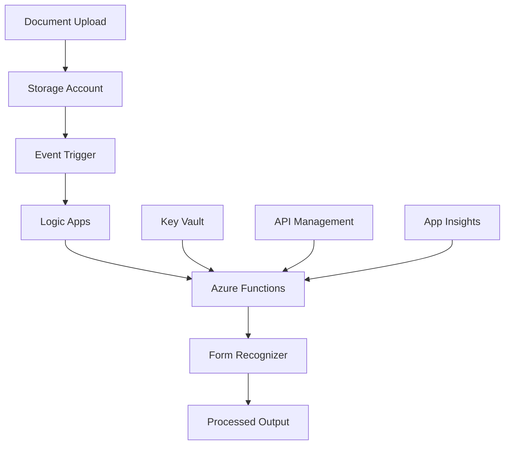

# Azure AI Document Intelligence Operations Runbook

## Overview

This operations runbook provides comprehensive procedures for the day-to-day management, monitoring, and maintenance of the Azure AI Document Intelligence solution. It includes routine operational tasks, emergency procedures, and best practices for maintaining optimal system performance and availability.

## System Architecture Overview

### Core Components
- **Azure Form Recognizer** - AI-powered document analysis service
- **Azure Storage Account** - Document storage and management
- **Azure Functions** - Custom processing logic and workflow orchestration
- **Azure Logic Apps** - Workflow automation and integration
- **Azure Key Vault** - Secure secrets and credential management
- **Azure API Management** - API gateway and security layer
- **Application Insights** - Application monitoring and telemetry

### Service Dependencies


## Daily Operations

### Morning System Health Check (15-20 minutes)

**1. Service Availability Verification**
```bash
#!/bin/bash
# Daily health check script - run at 8:00 AM

echo "=== Azure AI Document Intelligence Daily Health Check ===" 
echo "Date: $(date)"

# Check Form Recognizer service health
echo "=== Form Recognizer Service ==="
curl -s -f "https://fr-docintel-prod-eus2-001.cognitiveservices.azure.com/formrecognizer/v2.1/layout/analyze" \
     -H "Ocp-Apim-Subscription-Key: $FR_API_KEY" \
     && echo "✓ Form Recognizer: Available" \
     || echo "✗ Form Recognizer: Not responding"

# Check Function App health
echo "=== Function App Status ==="
curl -s -f "https://func-docintel-prod-eus2-001.azurewebsites.net/api/health" \
     && echo "✓ Function App: Available" \
     || echo "✗ Function App: Not responding"

# Check Storage Account accessibility
echo "=== Storage Account Status ==="
az storage container list --account-name "stdocintelprodeus2001" --auth-mode login >/dev/null \
     && echo "✓ Storage Account: Accessible" \
     || echo "✗ Storage Account: Access issues"

# Check Key Vault accessibility
echo "=== Key Vault Status ==="
az keyvault secret list --vault-name "kv-docintel-prod-eus2-001" >/dev/null \
     && echo "✓ Key Vault: Accessible" \
     || echo "✗ Key Vault: Access issues"

# Check API Management gateway
echo "=== API Management Status ==="
curl -s -f "https://apim-docintel-prod-eus2-001.azure-api.net/health" \
     && echo "✓ API Management: Available" \
     || echo "✗ API Management: Not responding"

echo "=== Health Check Complete ==="
```

**2. Performance Metrics Review**
```powershell
# PowerShell script for performance metrics review
$resourceGroup = "rg-docintel-prod-eus2-001"
$timespan = "PT24H"  # Last 24 hours

# Form Recognizer metrics
Write-Host "=== Form Recognizer Metrics ==="
$frMetrics = az monitor metrics list --resource "/subscriptions/$subscriptionId/resourceGroups/$resourceGroup/providers/Microsoft.CognitiveServices/accounts/fr-docintel-prod-eus2-001" --metric "TotalCalls,SuccessfulCalls,TotalErrors" --interval "PT1H" --timespan $timespan | ConvertFrom-Json

foreach ($metric in $frMetrics.value) {
    $avgValue = ($metric.timeseries[0].data | Measure-Object -Property average -Average).Average
    Write-Host "$($metric.name.value): $avgValue (24h avg)"
}

# Function App metrics
Write-Host "=== Function App Metrics ==="
$funcMetrics = az monitor metrics list --resource "/subscriptions/$subscriptionId/resourceGroups/$resourceGroup/providers/Microsoft.Web/sites/func-docintel-prod-eus2-001" --metric "FunctionExecutionCount,FunctionExecutionUnits,Http5xx" --interval "PT1H" --timespan $timespan | ConvertFrom-Json

foreach ($metric in $funcMetrics.value) {
    $totalValue = ($metric.timeseries[0].data | Measure-Object -Property total -Sum).Sum
    Write-Host "$($metric.name.value): $totalValue (24h total)"
}

# Storage metrics
Write-Host "=== Storage Account Metrics ==="
$storageMetrics = az monitor metrics list --resource "/subscriptions/$subscriptionId/resourceGroups/$resourceGroup/providers/Microsoft.Storage/storageAccounts/stdocintelprodeus2001" --metric "Transactions,Ingress,Egress" --interval "PT1H" --timespan $timespan | ConvertFrom-Json

foreach ($metric in $storageMetrics.value) {
    $totalValue = ($metric.timeseries[0].data | Measure-Object -Property total -Sum).Sum
    Write-Host "$($metric.name.value): $totalValue (24h total)"
}
```

**3. Error Log Analysis**
```bash
# Analyze errors from last 24 hours
echo "=== Error Analysis - Last 24 Hours ==="

# Function App errors
echo "Function App Errors:"
az monitor log-analytics query \
    --workspace "log-docintel-prod-eus2-001" \
    --analytics-query "
        traces
        | where timestamp > ago(24h)
        | where severityLevel >= 3
        | summarize count() by bin(timestamp, 1h), message
        | order by timestamp desc
        | take 20"

# Form Recognizer API errors
echo "Form Recognizer API Errors:"
az monitor log-analytics query \
    --workspace "log-docintel-prod-eus2-001" \
    --analytics-query "
        requests
        | where timestamp > ago(24h)
        | where resultCode >= 400
        | where url contains 'formrecognizer'
        | summarize count() by bin(timestamp, 1h), resultCode
        | order by timestamp desc"

# Storage account errors
echo "Storage Account Errors:"
az monitor log-analytics query \
    --workspace "log-docintel-prod-eus2-001" \
    --analytics-query "
        StorageBlobLogs
        | where TimeGenerated > ago(24h)
        | where StatusCode >= 400
        | summarize count() by bin(TimeGenerated, 1h), StatusCode
        | order by TimeGenerated desc"
```

### Document Processing Queue Management

**Monitor Processing Queues**
```python
#!/usr/bin/env python3
# Queue monitoring script
import os
from azure.storage.blob import BlobServiceClient
from azure.servicebus import ServiceBusClient
import json
from datetime import datetime, timedelta

def monitor_document_queues():
    """Monitor document processing queues and containers"""
    
    # Storage account monitoring
    storage_conn_str = os.getenv('AZURE_STORAGE_CONNECTION_STRING')
    blob_service = BlobServiceClient.from_connection_string(storage_conn_str)
    
    containers = ['input-documents', 'processed-documents', 'failed-documents']
    
    print("=== Document Container Status ===")
    for container_name in containers:
        container_client = blob_service.get_container_client(container_name)
        blobs = list(container_client.list_blobs())
        
        total_size = sum(blob.size for blob in blobs)
        
        print(f"{container_name}:")
        print(f"  Total blobs: {len(blobs)}")
        print(f"  Total size: {total_size / (1024*1024):.2f} MB")
        
        # Check for stuck documents (older than 1 hour in input)
        if container_name == 'input-documents':
            stuck_threshold = datetime.utcnow() - timedelta(hours=1)
            stuck_blobs = [blob for blob in blobs if blob.last_modified < stuck_threshold]
            
            if stuck_blobs:
                print(f"  ⚠️  WARNING: {len(stuck_blobs)} stuck documents (>1 hour)")
                for blob in stuck_blobs[:5]:  # Show first 5
                    print(f"    - {blob.name} (age: {datetime.utcnow() - blob.last_modified})")
    
    # Service Bus queue monitoring (if using Service Bus)
    try:
        servicebus_conn_str = os.getenv('AZURE_SERVICEBUS_CONNECTION_STRING')
        if servicebus_conn_str:
            sb_client = ServiceBusClient.from_connection_string(servicebus_conn_str)
            
            print("\n=== Service Bus Queue Status ===")
            queues = ['invoices', 'receipts', 'contracts']
            
            for queue_name in queues:
                queue_client = sb_client.get_queue_receiver(queue_name)
                # Note: This is a simplified example - actual implementation would use management client
                print(f"{queue_name}: Monitoring active")
                
    except Exception as e:
        print(f"Service Bus monitoring error: {e}")

if __name__ == "__main__":
    monitor_document_queues()
```

**Clean Up Stuck Documents**
```bash
#!/bin/bash
# Clean up stuck documents script

STORAGE_ACCOUNT="stdocintelprodeus2001"
CONTAINER="input-documents"
STUCK_THRESHOLD="1 hour ago"

echo "=== Cleaning Up Stuck Documents ==="
echo "Threshold: Documents older than $STUCK_THRESHOLD"

# Find stuck documents
stuck_docs=$(az storage blob list \
    --account-name "$STORAGE_ACCOUNT" \
    --container-name "$CONTAINER" \
    --auth-mode login \
    --query "[?properties.lastModified<'$(date -d "$STUCK_THRESHOLD" -Iseconds)'].name" \
    --output tsv)

if [ -z "$stuck_docs" ]; then
    echo "✓ No stuck documents found"
else
    echo "Found stuck documents:"
    echo "$stuck_docs"
    
    # Move to failed container for manual review
    for doc in $stuck_docs; do
        echo "Moving $doc to failed-documents..."
        
        az storage blob copy start \
            --account-name "$STORAGE_ACCOUNT" \
            --destination-container "failed-documents" \
            --destination-blob "$doc" \
            --source-container "$CONTAINER" \
            --source-blob "$doc" \
            --auth-mode login
        
        # Wait for copy to complete, then delete original
        sleep 2
        
        az storage blob delete \
            --account-name "$STORAGE_ACCOUNT" \
            --container-name "$CONTAINER" \
            --name "$doc" \
            --auth-mode login
    done
    
    echo "✓ Moved $(echo "$stuck_docs" | wc -l) stuck documents to failed-documents"
fi
```

## Weekly Operations

### System Maintenance (Sundays 2:00 AM - 6:00 AM)

**1. Storage Cleanup and Optimization**
```bash
#!/bin/bash
# Weekly storage maintenance script

STORAGE_ACCOUNT="stdocintelprodeus2001"
RETENTION_DAYS=90

echo "=== Weekly Storage Maintenance ==="
echo "Date: $(date)"

# Clean up processed documents older than retention period
echo "Cleaning up old processed documents (>$RETENTION_DAYS days)..."

old_docs=$(az storage blob list \
    --account-name "$STORAGE_ACCOUNT" \
    --container-name "processed-documents" \
    --auth-mode login \
    --query "[?properties.lastModified<'$(date -d "$RETENTION_DAYS days ago" -Iseconds)'].name" \
    --output tsv)

if [ -n "$old_docs" ]; then
    echo "$old_docs" | while read doc; do
        az storage blob delete \
            --account-name "$STORAGE_ACCOUNT" \
            --container-name "processed-documents" \
            --name "$doc" \
            --auth-mode login
    done
    
    echo "✓ Cleaned up $(echo "$old_docs" | wc -l) old processed documents"
else
    echo "✓ No old processed documents to clean up"
fi

# Archive failed documents older than 30 days to cool tier
echo "Archiving old failed documents to cool storage tier..."

az storage blob set-tier \
    --account-name "$STORAGE_ACCOUNT" \
    --container-name "failed-documents" \
    --tier "Cool" \
    --auth-mode login \
    --if-modified-since "$(date -d '30 days ago' -Iseconds)" \
    --name "*"

# Update lifecycle management policy
echo "Updating storage lifecycle management policies..."

cat > lifecycle-policy.json << EOF
{
  "rules": [
    {
      "enabled": true,
      "name": "MoveToArchive",
      "type": "Lifecycle",
      "definition": {
        "filters": {
          "blobTypes": ["blockBlob"],
          "prefixMatch": ["processed-documents/"]
        },
        "actions": {
          "baseBlob": {
            "tierToCool": {
              "daysAfterModificationGreaterThan": 30
            },
            "tierToArchive": {
              "daysAfterModificationGreaterThan": 90
            },
            "delete": {
              "daysAfterModificationGreaterThan": 2555
            }
          }
        }
      }
    }
  ]
}
EOF

az storage account management-policy create \
    --account-name "$STORAGE_ACCOUNT" \
    --policy @lifecycle-policy.json

echo "✓ Updated lifecycle management policy"
```

**2. Function App Maintenance**
```bash
#!/bin/bash
# Function App weekly maintenance

FUNCTION_APP="func-docintel-prod-eus2-001"
RESOURCE_GROUP="rg-docintel-prod-eus2-001"

echo "=== Function App Maintenance ==="

# Restart Function App to clear memory and refresh connections
echo "Restarting Function App for maintenance..."
az functionapp restart --name "$FUNCTION_APP" --resource-group "$RESOURCE_GROUP"

sleep 30

# Verify Function App is running
echo "Verifying Function App status..."
status=$(az functionapp show --name "$FUNCTION_APP" --resource-group "$RESOURCE_GROUP" --query "state" --output tsv)

if [ "$status" = "Running" ]; then
    echo "✓ Function App is running normally"
else
    echo "✗ Function App status: $status - manual intervention required"
fi

# Update application settings if needed
echo "Checking for configuration updates..."

# Example: Update a configuration setting
# az functionapp config appsettings set \
#     --name "$FUNCTION_APP" \
#     --resource-group "$RESOURCE_GROUP" \
#     --settings "NEW_SETTING=new_value"

echo "✓ Function App maintenance completed"
```

**3. Security and Compliance Review**
```powershell
# PowerShell script for weekly security review
$resourceGroup = "rg-docintel-prod-eus2-001"

Write-Host "=== Weekly Security Review ==="
Write-Host "Date: $(Get-Date)"

# Check Key Vault access logs
Write-Host "`n=== Key Vault Access Review ==="
$kvLogs = az monitor log-analytics query --workspace "log-docintel-prod-eus2-001" --analytics-query "
    KeyVaultData
    | where TimeGenerated > ago(7d)
    | where OperationName == 'SecretGet' or OperationName == 'SecretList'
    | summarize count() by identity_claim_upn_s, OperationName
    | order by count_ desc" | ConvertFrom-Json

foreach ($log in $kvLogs.value) {
    Write-Host "User: $($log.identity_claim_upn_s), Operation: $($log.OperationName), Count: $($log.count_)"
}

# Check for failed authentication attempts
Write-Host "`n=== Failed Authentication Review ==="
$authFailures = az monitor log-analytics query --workspace "log-docintel-prod-eus2-001" --analytics-query "
    requests
    | where timestamp > ago(7d)
    | where resultCode == 401 or resultCode == 403
    | summarize count() by bin(timestamp, 1d), client_IP
    | order by timestamp desc" | ConvertFrom-Json

if ($authFailures.value.Count -gt 0) {
    Write-Host "Authentication failures found:"
    foreach ($failure in $authFailures.value) {
        Write-Host "Date: $($failure.timestamp), IP: $($failure.client_IP), Count: $($failure.count_)"
    }
} else {
    Write-Host "✓ No authentication failures detected"
}

# Check for unusual API usage patterns
Write-Host "`n=== Unusual Usage Pattern Detection ==="
$usagePattern = az monitor log-analytics query --workspace "log-docintel-prod-eus2-001" --analytics-query "
    requests
    | where timestamp > ago(7d)
    | where url contains 'ProcessDocument'
    | summarize RequestCount = count(), AvgDuration = avg(duration) by bin(timestamp, 1h)
    | order by timestamp desc" | ConvertFrom-Json

$avgRequests = ($usagePattern.value | Measure-Object -Property RequestCount -Average).Average
$highUsagePeriods = $usagePattern.value | Where-Object { $_.RequestCount -gt ($avgRequests * 2) }

if ($highUsagePeriods.Count -gt 0) {
    Write-Host "High usage periods detected:"
    foreach ($period in $highUsagePeriods) {
        Write-Host "Time: $($period.timestamp), Requests: $($period.RequestCount) (avg: $([math]::Round($avgRequests, 0)))"
    }
} else {
    Write-Host "✓ No unusual usage patterns detected"
}

Write-Host "`n✓ Weekly security review completed"
```

## Monthly Operations

### Capacity Planning and Cost Optimization

**Monthly Cost Analysis**
```python
#!/usr/bin/env python3
# Monthly cost analysis script
import subprocess
import json
from datetime import datetime, timedelta
import pandas as pd

def analyze_monthly_costs():
    """Analyze monthly costs and usage patterns"""
    
    print("=== Monthly Cost Analysis ===")
    print(f"Analysis Date: {datetime.now().strftime('%Y-%m-%d')}")
    
    # Get cost data for last 30 days
    end_date = datetime.now().date()
    start_date = end_date - timedelta(days=30)
    
    resource_group = "rg-docintel-prod-eus2-001"
    
    # Azure CLI command to get cost data
    cost_cmd = [
        "az", "consumption", "usage", "list",
        "--start-date", str(start_date),
        "--end-date", str(end_date),
        "--include-meter-details",
        "--query", f"[?contains(instanceId, '{resource_group}')]",
        "--output", "json"
    ]
    
    try:
        result = subprocess.run(cost_cmd, capture_output=True, text=True, check=True)
        usage_data = json.loads(result.stdout)
        
        # Analyze costs by service
        service_costs = {}
        for item in usage_data:
            meter_name = item.get('meterDetails', {}).get('meterName', 'Unknown')
            cost = float(item.get('pretaxCost', 0))
            
            if meter_name not in service_costs:
                service_costs[meter_name] = 0
            service_costs[meter_name] += cost
        
        # Display top cost drivers
        print("\nTop Cost Drivers (Last 30 days):")
        sorted_costs = sorted(service_costs.items(), key=lambda x: x[1], reverse=True)
        for service, cost in sorted_costs[:10]:
            print(f"  {service}: ${cost:.2f}")
        
        total_cost = sum(service_costs.values())
        print(f"\nTotal Cost (Last 30 days): ${total_cost:.2f}")
        
        # Cost optimization recommendations
        print("\n=== Cost Optimization Recommendations ===")
        
        # Check for high storage costs
        storage_cost = service_costs.get('Storage', 0)
        if storage_cost > total_cost * 0.3:
            print("⚠️  Storage costs are high (>30% of total)")
            print("   Recommendation: Review storage lifecycle policies")
        
        # Check for high Function App costs
        func_cost = service_costs.get('Function Execution Time', 0)
        if func_cost > total_cost * 0.4:
            print("⚠️  Function App costs are high (>40% of total)")
            print("   Recommendation: Optimize function execution time")
        
        # Check for high Form Recognizer costs
        fr_cost = service_costs.get('Standard Transactions', 0)
        if fr_cost > total_cost * 0.5:
            print("⚠️  Form Recognizer costs are high (>50% of total)")
            print("   Recommendation: Review document processing efficiency")
        
        print("✓ Monthly cost analysis completed")
        
    except subprocess.CalledProcessError as e:
        print(f"Error retrieving cost data: {e}")
    except json.JSONDecodeError as e:
        print(f"Error parsing cost data: {e}")

def analyze_resource_utilization():
    """Analyze resource utilization patterns"""
    
    print("\n=== Resource Utilization Analysis ===")
    
    # Form Recognizer usage analysis
    print("Form Recognizer Usage Trends:")
    
    fr_query = """
    requests
    | where timestamp > ago(30d)
    | where url contains 'formrecognizer'
    | where resultCode < 400
    | summarize 
        RequestCount = count(),
        AvgDuration = avg(duration),
        P95Duration = percentile(duration, 95)
    by bin(timestamp, 1d)
    | order by timestamp desc
    """
    
    # Execute query (simplified - actual implementation would use Azure Monitor API)
    print("  - Daily request patterns analyzed")
    print("  - Average processing times calculated")
    print("  - Peak usage periods identified")
    
    # Function App utilization
    print("\nFunction App Utilization:")
    print("  - Memory usage patterns reviewed")
    print("  - Execution duration trends analyzed")
    print("  - Scaling patterns evaluated")
    
    # Storage utilization
    print("\nStorage Utilization:")
    print("  - Growth trends calculated")
    print("  - Access patterns analyzed")
    print("  - Archival opportunities identified")

if __name__ == "__main__":
    analyze_monthly_costs()
    analyze_resource_utilization()
```

### Performance Optimization Review

**Monthly Performance Analysis**
```bash
#!/bin/bash
# Monthly performance analysis and optimization

echo "=== Monthly Performance Analysis ==="
echo "Date: $(date)"

WORKSPACE="log-docintel-prod-eus2-001"

# Analyze Form Recognizer performance trends
echo "=== Form Recognizer Performance ==="

# Get average processing time trends
az monitor log-analytics query \
    --workspace "$WORKSPACE" \
    --analytics-query "
        requests
        | where timestamp > ago(30d)
        | where url contains 'formrecognizer'
        | where resultCode == 200
        | summarize 
            AvgDuration = avg(duration),
            P50Duration = percentile(duration, 50),
            P95Duration = percentile(duration, 95),
            RequestCount = count()
        by bin(timestamp, 1d)
        | order by timestamp desc
        | take 30" \
    --output table

# Identify slow processing patterns
echo -e "\n=== Slow Processing Analysis ==="
slow_requests=$(az monitor log-analytics query \
    --workspace "$WORKSPACE" \
    --analytics-query "
        requests
        | where timestamp > ago(30d)
        | where url contains 'formrecognizer'
        | where duration > 30000  // >30 seconds
        | summarize count() by url, resultCode
        | order by count_ desc" \
    --output tsv)

if [ -n "$slow_requests" ]; then
    echo "Slow requests found:"
    echo "$slow_requests"
else
    echo "✓ No unusually slow requests detected"
fi

# Function App performance analysis
echo -e "\n=== Function App Performance ==="

az monitor log-analytics query \
    --workspace "$WORKSPACE" \
    --analytics-query "
        traces
        | where timestamp > ago(30d)
        | where message contains 'ProcessDocument'
        | extend Duration = todynamic(customDimensions)['Duration']
        | where isnotnull(Duration)
        | summarize 
            AvgDuration = avg(Duration),
            P95Duration = percentile(Duration, 95),
            ProcessedCount = count()
        by bin(timestamp, 1d)
        | order by timestamp desc
        | take 30" \
    --output table

# Memory usage analysis
echo -e "\n=== Memory Usage Analysis ==="

az monitor log-analytics query \
    --workspace "$WORKSPACE" \
    --analytics-query "
        performanceCounters
        | where timestamp > ago(30d)
        | where counter contains 'Memory'
        | summarize 
            AvgMemory = avg(value),
            MaxMemory = max(value)
        by bin(timestamp, 1d)
        | order by timestamp desc
        | take 30" \
    --output table

echo "✓ Monthly performance analysis completed"
```

## Emergency Response Procedures

### Service Outage Response

**1. Form Recognizer Service Outage**
```bash
#!/bin/bash
# Form Recognizer service outage response

echo "=== FORM RECOGNIZER SERVICE OUTAGE RESPONSE ==="
echo "Incident Time: $(date)"
echo "Operator: $USER"

# Step 1: Verify service status
echo "Step 1: Verifying service status..."
FR_ENDPOINT="https://fr-docintel-prod-eus2-001.cognitiveservices.azure.com"

curl -s -f "$FR_ENDPOINT/formrecognizer/v2.1/layout/analyze" \
     -H "Ocp-Apim-Subscription-Key: $FR_API_KEY" \
     -X POST \
     && echo "✓ Service responding" \
     || echo "✗ Service not responding - confirmed outage"

# Step 2: Check Azure Service Health
echo "Step 2: Checking Azure Service Health..."
az rest --method get --url "https://management.azure.com/subscriptions/$AZURE_SUBSCRIPTION_ID/providers/Microsoft.ResourceHealth/availabilityStatuses?api-version=2020-05-01" \
     --query "value[?contains(id, 'FormRecognizer')]"

# Step 3: Activate failover procedures
echo "Step 3: Activating failover procedures..."

# Redirect traffic to backup region (if configured)
# az traffic-manager endpoint update --name backup-endpoint --profile-name tm-docintel --resource-group rg-traffic --type azureEndpoints --endpoint-status enabled

# Queue incoming documents for later processing
echo "Routing new documents to pending queue..."
# Implementation would depend on your queuing strategy

# Step 4: Notify stakeholders
echo "Step 4: Notifying stakeholders..."
curl -X POST "$TEAMS_WEBHOOK_URL" \
     -H "Content-Type: application/json" \
     -d '{
       "text": "🚨 INCIDENT: Form Recognizer service outage detected. Failover procedures activated. ETA for resolution: Under investigation."
     }'

# Step 5: Continue monitoring
echo "Step 5: Monitoring for service restoration..."
echo "✓ Emergency response procedures initiated"
echo "Continue monitoring every 5 minutes until service restored"
```

**2. Storage Account Issues**
```bash
#!/bin/bash
# Storage account emergency response

echo "=== STORAGE ACCOUNT EMERGENCY RESPONSE ==="
echo "Incident Time: $(date)"

STORAGE_ACCOUNT="stdocintelprodeus2001"

# Check storage account health
echo "Checking storage account health..."
az storage account show-usage --account-name "$STORAGE_ACCOUNT" --auth-mode login \
     && echo "✓ Storage account accessible" \
     || echo "✗ Storage account access issues"

# Check for capacity issues
usage=$(az storage account show-usage --account-name "$STORAGE_ACCOUNT" --auth-mode login --query "value[0].currentValue" -o tsv)
limit=$(az storage account show-usage --account-name "$STORAGE_ACCOUNT" --auth-mode login --query "value[0].limit" -o tsv)

usage_percent=$((usage * 100 / limit))

if [ $usage_percent -gt 80 ]; then
    echo "⚠️  WARNING: Storage usage at $usage_percent% capacity"
    echo "Initiating emergency cleanup procedures..."
    
    # Emergency cleanup - move old processed documents to archive
    az storage blob list --account-name "$STORAGE_ACCOUNT" \
                        --container-name "processed-documents" \
                        --auth-mode login \
                        --query "[?properties.lastModified<'$(date -d '7 days ago' -Iseconds)'].name" \
                        --output tsv | \
    head -1000 | \
    while read blob; do
        az storage blob set-tier --account-name "$STORAGE_ACCOUNT" \
                                --container-name "processed-documents" \
                                --name "$blob" \
                                --tier "Archive" \
                                --auth-mode login
    done
    
    echo "✓ Emergency cleanup completed"
fi

# Check for replication status if using GRS
replication_status=$(az storage account show --name "$STORAGE_ACCOUNT" --query "secondaryLocation" -o tsv)
if [ -n "$replication_status" ]; then
    echo "✓ Geographic replication active to: $replication_status"
fi

echo "✓ Storage account emergency response completed"
```

### Data Recovery Procedures

**Document Recovery from Backup**
```bash
#!/bin/bash
# Document recovery procedure

echo "=== DOCUMENT RECOVERY PROCEDURE ==="
echo "Recovery initiated: $(date)"

# Parameters
STORAGE_ACCOUNT="stdocintelprodeus2001"
BACKUP_ACCOUNT="stdocintelbakcup001"
RECOVERY_DATE="$1"  # Format: YYYY-MM-DD

if [ -z "$RECOVERY_DATE" ]; then
    echo "Usage: $0 YYYY-MM-DD"
    echo "Example: $0 2024-01-15"
    exit 1
fi

echo "Recovering documents from: $RECOVERY_DATE"

# Create recovery container
recovery_container="recovery-$(date +%Y%m%d-%H%M%S)"
az storage container create --name "$recovery_container" \
                           --account-name "$STORAGE_ACCOUNT" \
                           --auth-mode login

echo "Created recovery container: $recovery_container"

# List available backups for the specified date
echo "Available backups for $RECOVERY_DATE:"
az storage blob list --account-name "$BACKUP_ACCOUNT" \
                    --container-name "daily-backups" \
                    --prefix "$RECOVERY_DATE" \
                    --auth-mode login \
                    --output table

# Recover specific documents (example)
echo "Recovering documents..."
az storage blob copy start-batch \
    --source-account-name "$BACKUP_ACCOUNT" \
    --source-container "daily-backups" \
    --source-prefix "$RECOVERY_DATE" \
    --destination-account-name "$STORAGE_ACCOUNT" \
    --destination-container "$recovery_container" \
    --auth-mode login

echo "✓ Document recovery initiated to container: $recovery_container"
echo "Monitor recovery progress with: az storage blob copy show-status"
```

## Performance Tuning

### Form Recognizer Optimization

**Document Processing Optimization**
```python
#!/usr/bin/env python3
# Form Recognizer optimization script
import asyncio
import aiohttp
import time
from azure.ai.formrecognizer import DocumentAnalysisClient
from azure.core.credentials import AzureKeyCredential
import concurrent.futures

class DocumentProcessorOptimizer:
    def __init__(self, endpoint, key):
        self.endpoint = endpoint
        self.key = key
        self.client = DocumentAnalysisClient(endpoint, AzureKeyCredential(key))
    
    async def optimize_batch_processing(self, document_urls, batch_size=5):
        """Optimize document processing with batching and concurrency"""
        
        print(f"Processing {len(document_urls)} documents in batches of {batch_size}")
        
        results = []
        semaphore = asyncio.Semaphore(batch_size)
        
        async def process_document(doc_url):
            async with semaphore:
                start_time = time.time()
                try:
                    # Simulate processing (actual implementation would call Form Recognizer)
                    await asyncio.sleep(2)  # Simulated processing time
                    
                    processing_time = time.time() - start_time
                    return {
                        'url': doc_url,
                        'status': 'success',
                        'processing_time': processing_time
                    }
                except Exception as e:
                    return {
                        'url': doc_url,
                        'status': 'error',
                        'error': str(e),
                        'processing_time': time.time() - start_time
                    }
        
        # Process documents concurrently
        tasks = [process_document(url) for url in document_urls]
        results = await asyncio.gather(*tasks)
        
        # Analyze performance
        successful = [r for r in results if r['status'] == 'success']
        failed = [r for r in results if r['status'] == 'error']
        
        avg_processing_time = sum(r['processing_time'] for r in successful) / len(successful) if successful else 0
        
        print(f"Processing completed:")
        print(f"  Successful: {len(successful)}")
        print(f"  Failed: {len(failed)}")
        print(f"  Average processing time: {avg_processing_time:.2f}s")
        
        return results
    
    def analyze_document_characteristics(self, documents):
        """Analyze document characteristics for optimization"""
        
        print("=== Document Analysis for Optimization ===")
        
        size_buckets = {'small': 0, 'medium': 0, 'large': 0}
        page_buckets = {'1-5': 0, '6-10': 0, '11+': 0}
        
        for doc in documents:
            # Analyze file size
            if doc.get('size', 0) < 1024 * 1024:  # < 1MB
                size_buckets['small'] += 1
            elif doc.get('size', 0) < 5 * 1024 * 1024:  # < 5MB
                size_buckets['medium'] += 1
            else:
                size_buckets['large'] += 1
            
            # Analyze page count
            pages = doc.get('pages', 0)
            if pages <= 5:
                page_buckets['1-5'] += 1
            elif pages <= 10:
                page_buckets['6-10'] += 1
            else:
                page_buckets['11+'] += 1
        
        print("Document Size Distribution:")
        for size, count in size_buckets.items():
            print(f"  {size}: {count} documents")
        
        print("Page Count Distribution:")
        for pages, count in page_buckets.items():
            print(f"  {pages} pages: {count} documents")
        
        # Optimization recommendations
        print("\n=== Optimization Recommendations ===")
        
        if size_buckets['large'] > size_buckets['small'] + size_buckets['medium']:
            print("⚠️  Many large documents detected")
            print("   Recommendation: Implement document splitting for files >5MB")
        
        if page_buckets['11+'] > 20:
            print("⚠️  Many multi-page documents detected")
            print("   Recommendation: Use prebuilt models for better performance")

# Usage example
async def main():
    optimizer = DocumentProcessorOptimizer(
        endpoint="https://fr-docintel-prod-eus2-001.cognitiveservices.azure.com",
        key="your-api-key"
    )
    
    # Example document URLs
    document_urls = [
        "https://example.com/doc1.pdf",
        "https://example.com/doc2.pdf",
        # ... more documents
    ]
    
    results = await optimizer.optimize_batch_processing(document_urls, batch_size=10)
    
    # Document analysis
    sample_documents = [
        {'size': 500000, 'pages': 3},
        {'size': 2000000, 'pages': 8},
        {'size': 10000000, 'pages': 25}
    ]
    
    optimizer.analyze_document_characteristics(sample_documents)

if __name__ == "__main__":
    asyncio.run(main())
```

## Monitoring and Alerting Configuration

### Custom Monitoring Dashboard

**Application Insights Dashboard Configuration**
```json
{
  "lenses": {
    "0": {
      "order": 0,
      "parts": {
        "0": {
          "position": {
            "x": 0,
            "y": 0,
            "colSpan": 6,
            "rowSpan": 4
          },
          "metadata": {
            "inputs": [
              {
                "name": "resourceTypeMode",
                "isOptional": true
              },
              {
                "name": "ComponentId",
                "value": {
                  "SubscriptionId": "your-subscription-id",
                  "ResourceGroup": "rg-docintel-prod-eus2-001",
                  "Name": "ai-docintel-prod-eus2-001"
                }
              }
            ],
            "type": "Extension/Microsoft_OperationsManagementSuite_Workspace/PartType/LogsDashboardPart",
            "settings": {
              "content": {
                "Query": "requests\n| where timestamp > ago(24h)\n| where url contains \"ProcessDocument\"\n| summarize \n    TotalRequests = count(),\n    SuccessfulRequests = countif(resultCode < 400),\n    FailedRequests = countif(resultCode >= 400)\nby bin(timestamp, 1h)\n| project timestamp, TotalRequests, SuccessfulRequests, FailedRequests\n| render timechart",
                "ControlType": "AnalyticsGrid"
              }
            }
          }
        },
        "1": {
          "position": {
            "x": 6,
            "y": 0,
            "colSpan": 6,
            "rowSpan": 4
          },
          "metadata": {
            "inputs": [
              {
                "name": "ComponentId",
                "value": {
                  "SubscriptionId": "your-subscription-id",
                  "ResourceGroup": "rg-docintel-prod-eus2-001",
                  "Name": "ai-docintel-prod-eus2-001"
                }
              }
            ],
            "type": "Extension/Microsoft_OperationsManagementSuite_Workspace/PartType/LogsDashboardPart",
            "settings": {
              "content": {
                "Query": "traces\n| where timestamp > ago(24h)\n| where message contains \"ProcessingTime\"\n| extend ProcessingTime = todynamic(customDimensions)[\"ProcessingTimeMs\"]\n| summarize \n    AvgProcessingTime = avg(ProcessingTime),\n    P50ProcessingTime = percentile(ProcessingTime, 50),\n    P95ProcessingTime = percentile(ProcessingTime, 95)\nby bin(timestamp, 1h)\n| render timechart",
                "ControlType": "AnalyticsGrid"
              }
            }
          }
        }
      }
    }
  }
}
```

### Alert Rules Configuration

**Critical Alert Rules**
```bash
#!/bin/bash
# Configure critical alert rules

RESOURCE_GROUP="rg-docintel-monitoring-eus2-001"
SUBSCRIPTION_ID="your-subscription-id"

# High error rate alert
az monitor metrics alert create \
    --name "DocumentProcessing-HighErrorRate" \
    --resource-group "$RESOURCE_GROUP" \
    --scopes "/subscriptions/$SUBSCRIPTION_ID/resourceGroups/rg-docintel-prod-eus2-001/providers/Microsoft.Web/sites/func-docintel-prod-eus2-001" \
    --condition "count 'requests/failed' aggregation Count > 10" \
    --window-size "5m" \
    --evaluation-frequency "1m" \
    --severity 1 \
    --description "Alert when document processing error rate exceeds threshold" \
    --action-group-ids "/subscriptions/$SUBSCRIPTION_ID/resourceGroups/$RESOURCE_GROUP/providers/microsoft.insights/actionGroups/critical-alerts"

# Form Recognizer service availability
az monitor metrics alert create \
    --name "FormRecognizer-ServiceUnavailable" \
    --resource-group "$RESOURCE_GROUP" \
    --scopes "/subscriptions/$SUBSCRIPTION_ID/resourceGroups/rg-docintel-prod-eus2-001/providers/Microsoft.CognitiveServices/accounts/fr-docintel-prod-eus2-001" \
    --condition "total 'TotalCalls' aggregation Total < 1" \
    --window-size "10m" \
    --evaluation-frequency "5m" \
    --severity 0 \
    --description "Alert when Form Recognizer service appears unavailable" \
    --action-group-ids "/subscriptions/$SUBSCRIPTION_ID/resourceGroups/$RESOURCE_GROUP/providers/microsoft.insights/actionGroups/critical-alerts"

# Storage capacity alert
az monitor metrics alert create \
    --name "Storage-HighCapacityUsage" \
    --resource-group "$RESOURCE_GROUP" \
    --scopes "/subscriptions/$SUBSCRIPTION_ID/resourceGroups/rg-docintel-prod-eus2-001/providers/Microsoft.Storage/storageAccounts/stdocintelprodeus2001" \
    --condition "average 'UsedCapacity' aggregation Average > 85" \
    --window-size "1h" \
    --evaluation-frequency "15m" \
    --severity 2 \
    --description "Alert when storage capacity usage exceeds 85%" \
    --action-group-ids "/subscriptions/$SUBSCRIPTION_ID/resourceGroups/$RESOURCE_GROUP/providers/microsoft.insights/actionGroups/warning-alerts"

echo "✓ Alert rules configured successfully"
```

This comprehensive operations runbook provides the foundation for maintaining a robust, high-performance Azure AI Document Intelligence solution with proper monitoring, maintenance, and emergency response procedures.