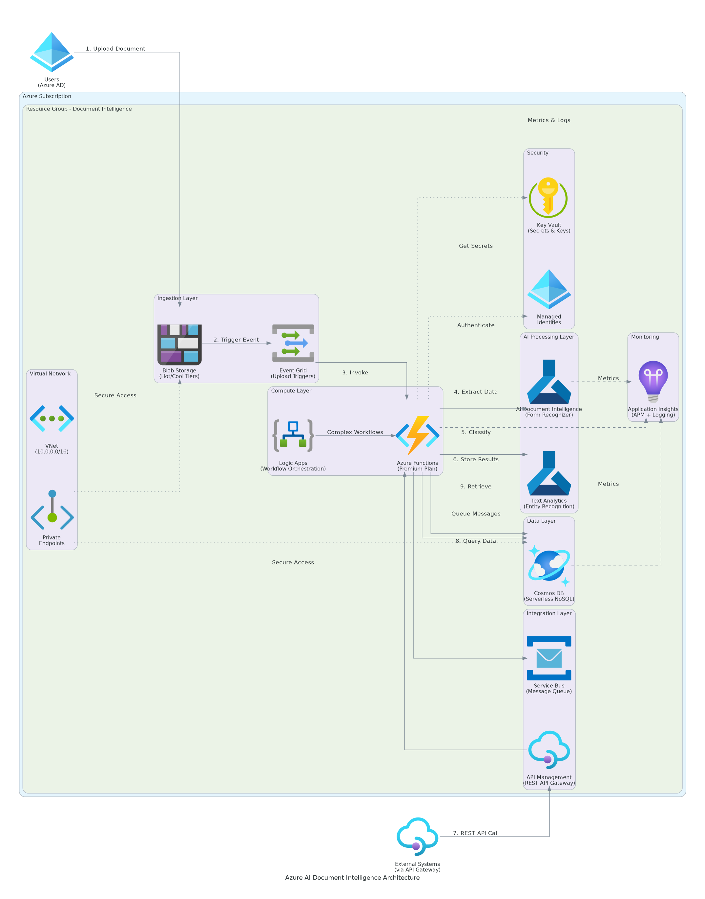

# Executive Summary

This document provides the comprehensive technical design for the Azure Document Intelligence implementation. It covers the target-state architecture, security controls, data design, integration patterns, and implementation approach required for successful deployment of intelligent document processing capabilities.

## Purpose

Define the technical architecture and design specifications that will guide the implementation team through deployment, configuration, and validation of the Azure Document Intelligence solution for automated document extraction and processing.

## Scope

**In-scope:**
- Azure Document Intelligence service configuration and model training
- Document processing pipeline with Azure Functions
- Integration with ERP and CRM systems via REST APIs
- Security controls including private endpoints and managed identities
- Monitoring and operational procedures with Azure Monitor

**Out-of-scope:**
- End-user training (covered in Implementation Guide)
- Ongoing support procedures (covered in Operations Runbook)
- Custom application development beyond processing pipeline

## Assumptions & Constraints

The following assumptions underpin the design and must be validated during implementation.

- Azure subscription with Contributor access available and configured
- Network connectivity to client ERP and CRM systems established
- Document types (invoices, receipts, forms) confirmed during discovery
- 4-hour RTO, 1-hour RPO requirements apply per SOW
- Single region deployment (East US) as specified in Statement of Work

## References

This document should be read in conjunction with the following related materials.

- Statement of Work (SOW) - Azure Document Intelligence Implementation
- Discovery Questionnaire responses
- Azure Document Intelligence best practices documentation
- Client security standards and compliance requirements

# Business Context

This section establishes the business drivers, success criteria, and compliance requirements that shape the technical design decisions.

## Business Drivers

The solution addresses the following key business objectives identified during discovery.

- **Processing Efficiency:** Reduce manual document processing time by 80-90%
- **Extraction Accuracy:** Achieve 95%+ accuracy in data extraction from documents
- **Cost Optimization:** Reduce document processing costs by 70% through automation
- **Scalability:** Support 4x growth in document volume without re-architecture
- **Compliance:** Maintain full audit trail and SOC 2 compliance

## Workload Criticality & SLA Expectations

The following service level targets define the operational requirements for the production environment and guide infrastructure sizing decisions.

<!-- TABLE_CONFIG: widths=[25, 25, 25, 25] -->
| Metric | Target | Measurement | Priority |
|--------|--------|-------------|----------|
| Availability | 99.5% | Azure Monitor uptime | Critical |
| Processing Time | < 5 minutes | End-to-end latency | High |
| Extraction Accuracy | 95%+ | Field-level validation | Critical |
| RTO | 4 hours | DR testing | Critical |
| RPO | 1 hour | Backup verification | Critical |

## Compliance & Regulatory Factors

The solution must adhere to the following regulatory and compliance requirements.

- SOC 2 Type II compliance required for all components handling document data
- Data residency requirements mandate primary storage in East US region
- Audit logging required for all document processing and administrative actions
- Encryption at rest and in transit mandatory for all data flows
- 7-year document retention policy with lifecycle management

## Success Criteria

Project success will be measured against the following criteria at go-live.

- All functional requirements from SOW implemented and validated
- 95%+ extraction accuracy achieved across invoice, receipt, and form document types
- Performance targets met under load testing conditions (2,000 docs/month capacity)
- Security controls pass client security review
- Operations team trained and capable of independent support

# Current-State Assessment

This section documents the existing environment that the solution will integrate with or replace.

## Application Landscape

The current environment consists of manual document processing workflows that will be automated with the new solution.

<!-- TABLE_CONFIG: widths=[25, 30, 25, 20] -->
| Application | Purpose | Technology | Status |
|-------------|---------|------------|--------|
| ERP System | Invoice and payment processing | REST API | Integration point |
| CRM System | Customer and document records | REST API | Integration point |
| Manual Processing | Document data entry | Manual workflow | To be automated |

## Infrastructure Inventory

The current infrastructure consists of manual processes that will be replaced by cloud-native Azure services.

<!-- TABLE_CONFIG: widths=[20, 15, 35, 30] -->
| Component | Quantity | Specifications | Notes |
|-----------|----------|----------------|-------|
| Document Processing Staff | 3 | Manual data entry operators | To be reallocated |
| File Storage | 1 | On-premises file shares | To be migrated |
| ERP Integration | 1 | Existing API endpoints | Integration target |

## Dependencies & Integration Points

The current environment has the following external dependencies that must be considered during implementation.

- ERP system REST API for invoice data transmission
- CRM system REST API for document metadata storage
- Azure Active Directory for user authentication
- Network connectivity between Azure and client systems

## Network Topology

Current network topology includes:
- Client corporate network with VPN connectivity
- Azure subscription in East US region
- Private endpoint connectivity for Azure services
- Network security groups for traffic control

## Security Posture

The current security controls provide a baseline that will be enhanced in the target architecture.

- Azure AD for identity management with conditional access
- Network security groups for perimeter control
- TLS encryption for data in transit
- Regular security assessments and penetration testing

## Performance Baseline

Current system performance metrics establish the baseline for improvement targets.

- Manual processing time: 12-15 minutes per document average
- Manual accuracy rate: 92-95% with human error
- Monthly document volume: 500-1,000 documents
- Error correction rate: 8-12% of documents require rework

# Solution Architecture

The target architecture leverages Azure cognitive services and serverless compute to deliver scalable, reliable document processing with minimal operational overhead.

## Architecture Principles

The following principles guide all architectural decisions throughout the solution design.

- **Cloud-Native Design:** Leverage Azure managed services to reduce operational burden
- **Security by Design:** Implement defense in depth with Zero Trust principles
- **Serverless First:** Use Azure Functions for event-driven, scalable processing
- **Infrastructure as Code:** All infrastructure defined in Bicep templates and version-controlled
- **Observability:** Comprehensive monitoring, logging, and alerting with Azure Monitor

## Architecture Patterns

The solution implements the following architectural patterns to address scalability and reliability requirements.

- **Primary Pattern:** Event-driven serverless processing with Azure Functions
- **Data Pattern:** Document storage with metadata in Cosmos DB
- **Integration Pattern:** REST APIs with retry logic and dead-letter queues
- **Deployment Pattern:** Blue-green with Infrastructure as Code automation

## Component Design

The solution comprises the following logical components, each with specific responsibilities and scaling characteristics.

<!-- TABLE_CONFIG: widths=[18, 25, 22, 18, 17] -->
| Component | Purpose | Technology | Dependencies | Scaling |
|-----------|---------|------------|--------------|---------|
| API Management | Request routing, authentication | Azure API Management | Azure AD | Managed |
| Processing Engine | Document orchestration | Azure Functions Premium | Doc Intelligence | Horizontal |
| AI/ML Services | OCR and extraction | Azure Document Intelligence | None | Managed |
| Document Storage | Input and processed docs | Azure Blob Storage | Key Vault | Managed |
| Metadata Store | Processing state, results | Azure Cosmos DB | Key Vault | Serverless |
| Secrets Management | API keys, connection strings | Azure Key Vault | Azure AD | Managed |

## Technology Stack

The technology stack has been selected based on requirements for scalability, maintainability, and alignment with Azure best practices.

<!-- TABLE_CONFIG: widths=[25, 35, 40] -->
| Layer | Technology | Rationale |
|-------|------------|-----------|
| AI/ML | Azure Document Intelligence | Pre-built and custom models for document extraction |
| Compute | Azure Functions Premium (EP1) | Serverless with VNet integration support |
| Storage | Azure Blob Storage | Scalable document storage with lifecycle policies |
| Database | Azure Cosmos DB Serverless | Flexible schema for metadata with auto-scaling |
| Monitoring | Azure Monitor + App Insights | Integrated monitoring, logging, and alerting |
| Security | Azure Key Vault + Managed Identity | Centralized secrets with passwordless auth |

# Security & Compliance

This section details the security controls, compliance mappings, and governance mechanisms implemented in the solution.

## Identity & Access Management

Access control follows a zero-trust model with Azure AD integration and managed identities.

- **Authentication:** Azure AD with OAuth 2.0 for user and service authentication
- **Authorization:** Role-based access control (RBAC) with least privilege
- **MFA:** Required for all administrative access via Azure AD conditional access
- **Service Accounts:** User-assigned managed identities for all Azure service authentication

### Role Definitions

The following roles define access levels within the system, following the principle of least privilege.

<!-- TABLE_CONFIG: widths=[20, 40, 40] -->
| Role | Permissions | Scope |
|------|-------------|-------|
| Administrator | Full system access, configuration changes | All Azure resources |
| Operator | Monitor dashboards, basic troubleshooting | Production environment |
| Reviewer | Human review queue access, correction submission | Review application |
| User | Document submission only | API and upload interface |

## Secrets Management

All sensitive credentials are managed through Azure Key Vault with managed identity access.

- Azure Key Vault for all API keys, connection strings, and certificates
- Automatic rotation for Document Intelligence API keys (90-day cycle)
- Managed identity access eliminates stored credentials in code
- No secrets in code repositories or configuration files

## Network Security

Network security implements defense-in-depth with private endpoints and network isolation.

- **VNet Integration:** Azure Functions deployed with VNet integration
- **Private Endpoints:** All Azure services accessed via private endpoints
- **Network Security Groups:** Deny-by-default with explicit allow rules
- **No Public Access:** Storage and Cosmos DB public access disabled

## Data Protection

Data protection controls ensure confidentiality and integrity throughout the document lifecycle.

- **Encryption at Rest:** Azure Storage Service Encryption with customer-managed keys
- **Encryption in Transit:** TLS 1.2+ for all communications
- **Key Management:** Azure Key Vault with customer-controlled key rotation
- **Data Classification:** Documents tagged with sensitivity levels

## Compliance Mappings

The following table maps compliance requirements to specific implementation controls.

<!-- TABLE_CONFIG: widths=[25, 35, 40] -->
| Framework | Requirement | Implementation |
|-----------|-------------|----------------|
| SOC 2 | Access control | Azure AD RBAC, MFA, audit logging |
| SOC 2 | Encryption | AES-256 at rest, TLS 1.2 in transit |
| SOC 2 | Audit logging | Azure Monitor, Log Analytics retention |
| GDPR | Data residency | East US region deployment only |
| GDPR | Right to erasure | Automated data deletion workflows |

## Audit Logging & SIEM Integration

Comprehensive audit logging supports security monitoring and compliance requirements.

- All authentication events logged to Log Analytics workspace
- Document processing events captured with full metadata
- Administrative actions logged with user context and timestamp
- Log retention: 90 days hot storage, 365 days archive
- Azure Monitor alerts for security-relevant events

# Data Architecture

This section defines the data model, storage strategy, migration approach, and governance controls for the solution.

## Data Model

### Conceptual Model

The solution manages the following core entities:
- **Documents:** Uploaded documents with metadata and processing state
- **Extraction Results:** Structured data extracted from documents
- **Processing Events:** Audit trail of all processing activities
- **Configurations:** System settings and model configurations

### Logical Model

The logical data model defines the primary entities and their relationships within the system.

<!-- TABLE_CONFIG: widths=[20, 25, 30, 25] -->
| Entity | Key Attributes | Relationships | Volume |
|--------|----------------|---------------|--------|
| Document | ID, type, status, uploaded_at | Has many ExtractionResults | 2,000/month |
| ExtractionResult | ID, document_id, fields, confidence | Belongs to Document | 2,000/month |
| ProcessingEvent | ID, document_id, event_type, timestamp | References Document | 10,000/month |
| Configuration | ID, model_id, threshold, updated_at | None | < 100 |

## Data Flow Design

1. **Ingestion:** Documents uploaded to input Blob Storage container via API or direct upload
2. **Trigger:** Blob trigger fires Azure Function for document processing
3. **Analysis:** Document Intelligence service extracts text and structured data
4. **Routing:** Confidence check determines automatic approval or human review
5. **Integration:** Approved data transmitted to ERP/CRM via REST APIs
6. **Archive:** Processed documents moved to archive container with lifecycle policies

## Data Migration Strategy

Data migration follows a phased approach to minimize risk and ensure data integrity.

- **Approach:** Net-new implementation with no historical document migration required
- **Validation:** Sample document testing during UAT phase
- **Rollback:** Manual fallback available throughout transition period
- **Cutover:** Phased cutover with parallel processing during transition

## Data Governance

Data governance policies ensure proper handling, retention, and quality management.

- **Classification:** Documents classified by type (invoice, receipt, form)
- **Retention:** 7 years in archive storage with lifecycle policies
- **Quality:** Automated validation rules with confidence thresholds
- **Access:** Role-based with full audit logging

# Integration Design

This section documents the integration patterns, APIs, and external system connections.

## External System Integrations

The solution integrates with the following external systems using standardized protocols and error handling.

<!-- TABLE_CONFIG: widths=[18, 15, 15, 15, 22, 15] -->
| System | Type | Protocol | Format | Error Handling | SLA |
|--------|------|----------|--------|----------------|-----|
| ERP System | Real-time | REST/HTTPS | JSON | Retry with backoff | 99.5% |
| CRM System | Batch | REST/HTTPS | JSON | Dead letter queue | 99.5% |
| Human Review | Real-time | Internal API | JSON | Queue persistence | 99.9% |
| Azure AD | Real-time | OAuth 2.0 | JWT | Failover to cache | 99.99% |

## API Design

### API Standards

All APIs follow RESTful design principles with OpenAPI 3.0 documentation.

- **Authentication:** OAuth 2.0 bearer tokens via Azure AD
- **Versioning:** URL path versioning (v1, v2)
- **Rate Limiting:** 1,000 requests per minute per client
- **Error Handling:** Standard HTTP status codes with JSON error bodies

### API Endpoints

The following endpoints are exposed for document processing operations.

<!-- TABLE_CONFIG: widths=[25, 15, 35, 25] -->
| Endpoint | Method | Purpose | Response |
|----------|--------|---------|----------|
| /api/v1/documents | POST | Submit document for processing | Document ID, status |
| /api/v1/documents/{id} | GET | Get document processing status | Status, metadata |
| /api/v1/documents/{id}/results | GET | Get extraction results | Extracted data |
| /api/v1/documents | GET | List documents with filters | Document list |

## Integration Error Handling

Integration error handling ensures resilience and data consistency.

- **Retry Policy:** Exponential backoff with 3 retries (1s, 5s, 30s)
- **Circuit Breaker:** Open after 5 consecutive failures, half-open after 60s
- **Dead Letter Queue:** Failed messages retained for 7 days for analysis
- **Alerting:** Immediate notification on integration failure patterns

# Infrastructure & Operations

This section defines the infrastructure components, deployment approach, and operational procedures.

## Infrastructure Components

### Compute Resources

<!-- TABLE_CONFIG: widths=[25, 25, 25, 25] -->
| Resource | SKU | Configuration | Purpose |
|----------|-----|---------------|---------|
| Azure Functions | Premium EP1 | VNet integrated, 1-10 instances | Document processing |
| App Service Plan | Premium V3 | Reserved capacity for Functions | Compute hosting |

### Storage Resources

<!-- TABLE_CONFIG: widths=[25, 25, 25, 25] -->
| Resource | SKU | Configuration | Purpose |
|----------|-----|---------------|---------|
| Blob Storage | Standard GRS | Hot/Cool/Archive tiers | Document storage |
| Cosmos DB | Serverless | Point-in-time recovery | Metadata storage |
| Key Vault | Standard | Soft delete enabled | Secrets management |

### AI/ML Resources

<!-- TABLE_CONFIG: widths=[25, 25, 25, 25] -->
| Resource | SKU | Configuration | Purpose |
|----------|-----|---------------|---------|
| Document Intelligence | S0 | Standard tier | OCR and extraction |
| Custom Models | Included | 3 document types trained | Form processing |

## High Availability Design

The solution implements high availability through Azure managed service capabilities.

- **Azure Functions:** Auto-scaling with health probes
- **Storage:** GRS replication with automatic failover
- **Cosmos DB:** Multi-region write capability (single region per SOW)
- **Document Intelligence:** Azure-managed high availability

## Disaster Recovery

Disaster recovery procedures ensure business continuity in the event of regional failure.

- **RTO:** 4 hours for full service restoration
- **RPO:** 1 hour for data consistency
- **Backup:** Daily automated backups with 30-day retention
- **Recovery:** Infrastructure as Code enables rapid rebuild from Bicep templates

## Monitoring Strategy

Comprehensive monitoring ensures operational visibility and proactive issue detection.

- **Azure Monitor:** Infrastructure metrics, alerts, and dashboards
- **Application Insights:** Application performance monitoring
- **Log Analytics:** Centralized logging with KQL queries
- **Alerting:** Email and Teams notifications for critical events

# Implementation Approach

This section outlines the phased implementation strategy for the solution.

## Implementation Phases

The implementation follows a phased approach with validation gates at each stage.

<!-- TABLE_CONFIG: widths=[15, 35, 25, 25] -->
| Phase | Activities | Duration | Exit Criteria |
|-------|------------|----------|---------------|
| Phase 1 | Foundation and model training | 6 weeks | AI models trained with 90%+ accuracy |
| Phase 2 | Pipeline development and integration | 5 weeks | End-to-end processing working |
| Phase 3 | Optimization and production deployment | 5 weeks | Go-live with 95%+ accuracy |

## Deployment Strategy

Deployment follows Infrastructure as Code principles with Bicep templates.

- **Environment Promotion:** Dev to staging to production with same templates
- **Feature Flags:** Controlled feature activation during rollout
- **Rollback:** Quick recovery via Bicep redeployment
- **Validation:** Automated testing at each promotion stage

## Migration Approach

Migration follows a phased cutover strategy to minimize risk.

- **Parallel Processing:** Run manual and automated in parallel during transition
- **Gradual Shift:** 25% to 75% to 100% automated over 3 weeks
- **Fallback:** Manual processing available throughout transition
- **Validation:** Daily accuracy checks during cutover period

# Appendices

## Appendix A: Azure Resource Naming Convention

All Azure resources follow the naming convention: `{resource-type}-{solution}-{environment}-{region}-{instance}`

Example: `func-docintel-prod-eus-001`

## Appendix B: Network Architecture Details

### IP Address Allocation

<!-- TABLE_CONFIG: widths=[30, 30, 40] -->
| Subnet | CIDR | Purpose |
|--------|------|---------|
| Functions | 10.0.1.0/24 | Azure Functions VNet integration |
| Private Endpoints | 10.0.2.0/24 | Private endpoint connections |

## Appendix C: Glossary

- **Document Intelligence:** Azure AI service for document OCR and extraction
- **Pre-built Model:** Microsoft-trained model for common document types
- **Custom Model:** Client-trained model for organization-specific documents
- **Confidence Score:** AI certainty level for extracted field values (0-100%)
- **Human Review:** Manual verification process for low-confidence extractions
