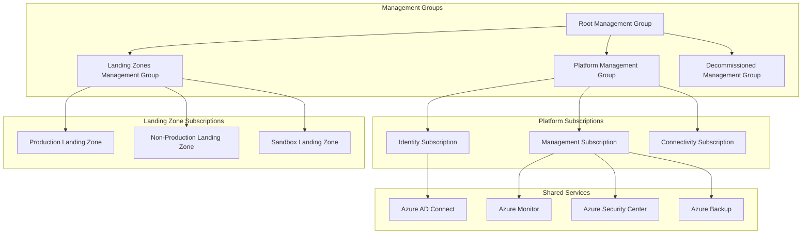

# Azure Enterprise Landing Zone - Delivery Guide

## Overview

The Azure Enterprise Landing Zone solution provides a comprehensive foundation for large-scale Azure deployments following Microsoft's Cloud Adoption Framework (CAF) and Well-Architected Framework principles. This solution establishes secure, scalable, and governable cloud infrastructure that enables enterprise digital transformation initiatives.

**Solution Type:** Cloud Infrastructure Foundation  
**Deployment Model:** Azure-native with hybrid connectivity  
**Target Audience:** Enterprise IT, Cloud Architects, Security Teams  
**Complexity Level:** Advanced (Enterprise-grade)

## Key Capabilities

### Core Infrastructure Services
- **Management Groups**: Hierarchical organization aligned with business units
- **Subscriptions**: Automated subscription provisioning and governance
- **Networking**: Hub-spoke topology with hybrid connectivity
- **Identity & Access**: Azure AD integration with RBAC and PIM
- **Security**: Azure Security Center, Sentinel, and Key Vault integration
- **Governance**: Policy enforcement, compliance monitoring, and cost management

### Advanced Features
- **Landing Zone Automation**: Terraform-based infrastructure as code
- **Network Segmentation**: Zero-trust network architecture implementation
- **Monitoring & Logging**: Centralized logging with Azure Monitor and Log Analytics
- **Backup & Recovery**: Enterprise backup strategies with Azure Backup
- **DevOps Integration**: CI/CD pipelines for infrastructure deployment
- **Multi-Region Support**: Global deployment with disaster recovery capabilities

## Architecture Overview

### Core Components



### Network Architecture

**Hub-Spoke Topology**
- **Hub VNet**: Centralized connectivity and shared services
- **Spoke VNets**: Workload-specific virtual networks
- **Hybrid Connectivity**: ExpressRoute and VPN Gateway integration
- **Network Security Groups**: Micro-segmentation and traffic filtering
- **Azure Firewall**: Centralized network security and filtering

**Global Network Design**
- **Primary Region**: Production workloads and shared services
- **Secondary Region**: Disaster recovery and backup services
- **Edge Locations**: CDN and application acceleration
- **On-Premises Integration**: Seamless hybrid connectivity

## Deployment Options

### Option 1: Greenfield Deployment
**Recommended for:** New Azure implementations  
**Timeline:** 8-12 weeks  
**Resources Required:** 3-4 cloud architects, 2-3 network engineers

**Deployment Approach:**
1. Management group structure creation
2. Core platform services deployment
3. Network foundation establishment
4. Security and compliance configuration
5. Landing zone provisioning
6. Workload onboarding preparation

### Option 2: Brownfield Migration
**Recommended for:** Existing Azure environments requiring restructuring  
**Timeline:** 12-16 weeks  
**Resources Required:** 4-5 cloud architects, 2-3 network engineers, 1-2 migration specialists

**Migration Strategy:**
1. Current state assessment and gap analysis
2. Migration planning and dependency mapping
3. Parallel environment setup
4. Phased workload migration
5. Legacy environment decommissioning
6. Optimization and governance implementation

### Option 3: Hybrid Integration
**Recommended for:** Organizations with significant on-premises infrastructure  
**Timeline:** 6-10 weeks  
**Resources Required:** 2-3 cloud architects, 3-4 network engineers, 1-2 security specialists

**Integration Approach:**
1. Hybrid connectivity assessment
2. Identity federation planning
3. Network architecture design
4. Security boundary definition
5. Data synchronization strategy
6. Governance model alignment

## Quick Start Guide

### Prerequisites Checklist
- [ ] Azure Active Directory tenant with Global Administrator access
- [ ] Enterprise Agreement or CSP subscription model
- [ ] Network architecture documentation and IP address planning
- [ ] Security and compliance requirements documentation
- [ ] Identity management strategy definition

### Rapid Deployment (4-6 weeks)

#### Week 1-2: Foundation Setup
```bash
# Clone repository and prepare environment
git clone [repository-url]
cd azure-enterprise-landing-zone
terraform init

# Configure management groups
terraform plan -target=module.management_groups
terraform apply -target=module.management_groups

# Deploy platform subscriptions
terraform plan -target=module.platform_subscriptions
terraform apply -target=module.platform_subscriptions
```

#### Week 3-4: Network and Security
```bash
# Deploy hub network infrastructure
terraform plan -target=module.hub_network
terraform apply -target=module.hub_network

# Configure security services
terraform plan -target=module.security_services
terraform apply -target=module.security_services

# Implement governance policies
terraform plan -target=module.governance
terraform apply -target=module.governance
```

#### Week 5-6: Landing Zones and Integration
```bash
# Deploy landing zones
terraform plan -target=module.landing_zones
terraform apply -target=module.landing_zones

# Configure monitoring and logging
terraform plan -target=module.monitoring
terraform apply -target=module.monitoring

# Validate and test connectivity
./scripts/test-connectivity.sh
./scripts/validate-deployment.sh
```

## Implementation Approach

### Phase 1: Planning and Design (Week 1-2)
**Deliverables:**
- Current state assessment report
- Future state architecture design
- Migration/deployment plan
- Risk assessment and mitigation plan
- Resource requirements and timeline

**Key Activities:**
1. **Requirements Gathering**: Stakeholder workshops and documentation review
2. **Architecture Design**: Solution design aligned with CAF principles
3. **Planning**: Detailed project plan with milestones and dependencies
4. **Team Preparation**: Skills assessment and training plan development

### Phase 2: Core Foundation (Week 3-6)
**Deliverables:**
- Management group hierarchy
- Platform subscriptions and governance
- Core networking infrastructure
- Identity and access management framework
- Basic security and compliance configuration

**Key Activities:**
1. **Management Groups**: Create organizational hierarchy and policies
2. **Platform Services**: Deploy identity, management, and connectivity subscriptions
3. **Network Foundation**: Implement hub-spoke architecture with hybrid connectivity
4. **Security Baseline**: Configure Azure Security Center and basic policies
5. **Identity Integration**: Set up Azure AD Connect and hybrid identity

### Phase 3: Landing Zones (Week 7-10)
**Deliverables:**
- Production landing zone environment
- Non-production landing zone environment
- Sandbox landing zone environment
- Automated deployment pipelines
- Monitoring and alerting configuration

**Key Activities:**
1. **Landing Zone Deployment**: Create workload-ready environments
2. **Network Segmentation**: Implement spoke networks with proper isolation
3. **Security Hardening**: Apply security controls and monitoring
4. **Automation Setup**: Configure CI/CD pipelines for infrastructure
5. **Testing and Validation**: Comprehensive testing of all components

### Phase 4: Advanced Services (Week 11-12)
**Deliverables:**
- Advanced monitoring and analytics
- Backup and disaster recovery
- Cost optimization framework
- Advanced security services
- Documentation and runbooks

**Key Activities:**
1. **Monitoring Enhancement**: Advanced Azure Monitor and Log Analytics setup
2. **Backup Strategy**: Enterprise backup and recovery implementation
3. **Security Services**: Advanced threat protection and compliance tools
4. **Optimization**: Cost management and performance optimization
5. **Documentation**: Comprehensive operational documentation

## Success Criteria

### Technical Success Metrics
- **Infrastructure Availability**: 99.9% uptime for platform services
- **Network Performance**: <50ms latency between hub and spoke VNets
- **Security Compliance**: 100% compliance with organizational security policies
- **Automation Coverage**: 90% of infrastructure provisioned via Infrastructure as Code
- **Disaster Recovery**: <4 hour RTO and <1 hour RPO for critical systems

### Business Success Metrics
- **Deployment Speed**: 80% faster application deployment to landing zones
- **Cost Optimization**: 25-40% reduction in infrastructure costs
- **Security Posture**: 90% reduction in security incidents and compliance gaps
- **Operational Efficiency**: 60% reduction in infrastructure management overhead
- **Innovation Acceleration**: 50% faster time-to-market for new applications

### User Experience Metrics
- **Self-Service Adoption**: 80% of development teams using automated provisioning
- **Support Ticket Reduction**: 70% reduction in infrastructure-related support tickets
- **Training Effectiveness**: 95% of administrators successfully completing training
- **Documentation Quality**: 4.5/5 satisfaction score for technical documentation

## Support and Resources

### Documentation Structure
```
delivery/
├── README.md (this file)
├── implementation-guide.md         # Step-by-step deployment instructions
├── configuration-templates.md      # Terraform and ARM templates
├── operations-runbook.md          # Day-to-day operational procedures
├── testing-procedures.md          # Testing frameworks and validation
└── training-materials.md          # Comprehensive training curriculum
```

### Professional Services
- **Architecture Review**: Expert validation of design decisions
- **Implementation Support**: Hands-on deployment assistance
- **Training Delivery**: Customized training programs for technical teams
- **Operational Support**: Ongoing support and optimization services

### Community Resources
- **Technical Forum**: Access to Microsoft and partner technical experts
- **Best Practices**: Regular updates on CAF and Well-Architected Framework
- **Reference Architectures**: Industry-specific implementation examples
- **Tool Updates**: Latest versions of deployment and management tools

### Next Steps
1. Review the **implementation-guide.md** for detailed deployment procedures
2. Examine **configuration-templates.md** for Infrastructure as Code templates
3. Study **operations-runbook.md** for operational procedures and maintenance
4. Follow **testing-procedures.md** for validation and quality assurance
5. Complete **training-materials.md** curriculum for team enablement

This Azure Enterprise Landing Zone solution provides the foundation for scalable, secure, and governable cloud operations that accelerate digital transformation while maintaining enterprise controls and compliance requirements.