# Azure Enterprise Landing Zone - Solution Design Template

## Overview

This comprehensive solution design template provides detailed architectural guidance, technical specifications, and implementation patterns for Azure Enterprise Landing Zone deployments. The design follows Microsoft's Cloud Adoption Framework (CAF) and Well-Architected Framework principles to ensure enterprise-grade scalability, security, and operational excellence.

**Architecture Pattern:** Hub-spoke with centralized governance  
**Target Audience:** Solution architects, cloud engineers, technical stakeholders  
**Compliance Framework:** CAF Enterprise-Scale with industry standards  
**Deployment Model:** Infrastructure as Code with automated governance

## Architecture Principles and Design Decisions

### Foundational Principles

**1. Security by Design**
- Zero-trust network architecture with micro-segmentation
- Identity-based access control with least-privilege principles
- Comprehensive threat detection and automated response
- Data protection with encryption at rest and in transit

**2. Governance and Compliance**
- Policy-driven automation with Azure Policy framework
- Centralized logging and monitoring across all resources
- Cost management with automated budget controls and alerting
- Audit trail with immutable compliance documentation

**3. Operational Excellence**
- Infrastructure as Code (IaC) for consistent deployments
- Self-healing infrastructure with automated remediation
- Comprehensive monitoring with predictive analytics
- Disaster recovery with automated failover capabilities

**4. Performance and Scalability**
- Auto-scaling based on demand with predictive algorithms
- Optimized network routing with global load balancing
- High-availability architecture with 99.9%+ uptime targets
- Performance monitoring with automated optimization

### Key Design Decisions

| Decision Area | Selected Approach | Rationale |
|---------------|------------------|-----------|
| **Network Topology** | Hub-spoke architecture | Centralized security and connectivity management |
| **Subscription Strategy** | Management group hierarchy | Organizational alignment and policy inheritance |
| **Identity Architecture** | Azure AD with hybrid integration | Single identity plane with on-premises federation |
| **Security Model** | Zero-trust with conditional access | Modern security approach with comprehensive protection |
| **Deployment Method** | Terraform with CI/CD pipelines | Infrastructure as Code with version control |
| **Monitoring Strategy** | Centralized Log Analytics workspace | Unified observability and compliance reporting |

---

## Solution Architecture

### High-Level Architecture Diagram


### Management Group Structure

**Root Management Group (Enterprise-Root)**
```
Enterprise-Root
├── Platform
│   ├── Identity
│   ├── Management
│   └── Connectivity
├── Landing-Zones
│   ├── Corporate
│   │   ├── Production
│   │   └── Non-Production
│   ├── Online
│   │   ├── Production
│   │   └── Non-Production
│   └── Sandbox
├── Decommissioned
└── Quarantine
```

**Policy Inheritance Model**
- Root-level policies apply to all subscriptions
- Platform-specific policies for infrastructure subscriptions
- Landing zone policies for application workloads
- Exception handling through policy exemptions

### Network Architecture Design

#### Hub Network (Connectivity Subscription)

**Hub Virtual Network: 10.10.0.0/16**
```
Subnet Allocation:
├── GatewaySubnet: 10.10.0.0/24 (VPN/ExpressRoute Gateway)
├── AzureFirewallSubnet: 10.10.1.0/24 (Azure Firewall)
├── AzureBastionSubnet: 10.10.2.0/24 (Azure Bastion)
├── SharedServicesSubnet: 10.10.3.0/24 (DNS, monitoring)
├── ManagementSubnet: 10.10.4.0/24 (Management tools)
└── Reserved: 10.10.5.0/24 - 10.10.255.0/24 (Future expansion)
```

**Hub Components**
- **Azure Firewall**: Centralized network security and filtering
- **VPN Gateway**: Site-to-site connectivity with on-premises
- **ExpressRoute Gateway**: Private connectivity for high-bandwidth requirements
- **Azure Bastion**: Secure RDP/SSH access without public IP exposure
- **Network Virtual Appliances**: Optional third-party security appliances

#### Spoke Networks

**Corporate Landing Zone: 10.20.0.0/16**
```
Subnet Design:
├── ApplicationSubnet: 10.20.1.0/24 (Application tier)
├── DatabaseSubnet: 10.20.2.0/24 (Database tier)
├── IntegrationSubnet: 10.20.3.0/24 (Integration services)
├── ManagementSubnet: 10.20.4.0/24 (Management and monitoring)
└── Reserved: 10.20.5.0/24 - 10.20.255.0/24 (Growth and expansion)
```

**Online Landing Zone: 10.30.0.0/16**
```
Subnet Design:
├── WebTierSubnet: 10.30.1.0/24 (Web applications)
├── ApplicationTierSubnet: 10.30.2.0/24 (Application services)
├── DataTierSubnet: 10.30.3.0/24 (Databases and storage)
├── ApplicationGatewaySubnet: 10.30.0.0/24 (Application Gateway)
├── IntegrationSubnet: 10.30.4.0/24 (API management and integration)
└── Reserved: 10.30.5.0/24 - 10.30.255.0/24 (Future requirements)
```

#### Network Security Architecture

**Network Segmentation Strategy**
- Hub-spoke topology with centralized security enforcement
- Network Security Groups (NSGs) for subnet-level microsegmentation
- Azure Firewall for application and network rule enforcement
- Application Security Groups (ASGs) for workload-based security

**Traffic Flow Design**
```
Internet Traffic Flow:
Internet → Application Gateway (WAF) → Load Balancer → Application VMs

Internal Traffic Flow:
Spoke → Hub (Azure Firewall) → Destination Spoke

On-Premises Traffic Flow:
On-Premises → VPN/ExpressRoute Gateway → Hub → Spoke Networks

Management Traffic Flow:
Azure Bastion → Hub → Spoke Networks (secure RDP/SSH)
```

### Identity and Access Management Architecture

#### Azure Active Directory Integration

**Hybrid Identity Architecture**
```
On-Premises AD ←→ Azure AD Connect ←→ Azure Active Directory
                                    ↓
                              Conditional Access
                                    ↓
                              Azure Resources (RBAC)
```

**Authentication Flow**
- Primary authentication through Azure AD
- Multi-factor authentication (MFA) enforcement
- Conditional access policies based on risk assessment
- Privileged Identity Management (PIM) for elevated access

**Access Control Model**
- Role-Based Access Control (RBAC) with custom roles
- Attribute-Based Access Control (ABAC) for fine-grained permissions
- Just-In-Time (JIT) access for administrative operations
- Azure AD Application Proxy for on-premises application access

#### RBAC Design Pattern

**Management Group Level Roles**
```yaml
Enterprise-Root:
  - Global Reader: Enterprise architects, auditors
  - Billing Reader: Finance team
  - Policy Contributor: Governance team

Platform:
  - Contributor: Platform engineering team
  - Network Contributor: Network operations team
  - Security Admin: Security operations center

Landing-Zones:
  - Contributor: Application teams (scoped to their landing zones)
  - Reader: Business stakeholders
  - Backup Operator: Backup administrators
```

**Subscription Level Roles**
```yaml
Connectivity:
  - Network Contributor: Network engineers
  - Firewall Contributor: Security team
  - Gateway Contributor: Connectivity specialists

Management:
  - Log Analytics Contributor: Operations team
  - Monitoring Contributor: Application teams
  - Automation Contributor: DevOps engineers

Identity:
  - Identity Contributor: Identity administrators
  - Key Vault Administrator: Security operations
```

### Security Architecture

#### Defense in Depth Strategy

**Network Security Layer**
- Azure Firewall with threat intelligence and IDPS
- Network Security Groups with micro-segmentation
- DDoS Protection Standard for internet-facing resources
- Azure Front Door with Web Application Firewall (WAF)

**Identity Security Layer**
- Azure AD with conditional access and risk-based authentication
- Privileged Identity Management (PIM) for administrative access
- Multi-factor authentication (MFA) enforcement
- Identity Protection with automated threat response

**Application Security Layer**
- Application Security Groups for workload-based policies
- Azure Security Center with Just-In-Time VM access
- Azure Sentinel for security information and event management
- Key Vault for secrets, keys, and certificate management

**Data Security Layer**
- Encryption at rest using Azure Storage Service Encryption
- Encryption in transit with TLS 1.2+ enforcement
- Azure Information Protection for data classification
- Database-level encryption with Transparent Data Encryption (TDE)

#### Security Monitoring and Response

**Security Operations Center (SOC) Design**


**Automated Security Response**
- Logic Apps for automated incident response
- Azure Automation runbooks for remediation tasks
- Security Center recommendations with automatic implementation
- Sentinel playbooks for threat hunting and response

### Data Architecture and Management

#### Data Classification and Protection

**Data Classification Levels**
```yaml
Public:
  - Marketing materials and public documentation
  - No encryption requirements
  - Standard access controls

Internal:
  - Business operations data and internal communications
  - Encryption in transit required
  - Role-based access control

Confidential:
  - Customer data and financial information
  - Encryption at rest and in transit required
  - Multi-factor authentication required

Restricted:
  - Personal identifiable information and trade secrets
  - Advanced encryption and key management
  - Privileged access with approval workflow
```

**Data Storage Architecture**
- Azure Storage with hierarchical namespace and lifecycle management
- Azure SQL Database with Advanced Data Security
- Azure Cosmos DB for global distributed applications
- Azure Data Factory for data integration and ETL processes

#### Backup and Disaster Recovery

**Backup Strategy**
```yaml
Recovery Services Vault Configuration:
  Location: Primary region with cross-region restore capability
  Backup Policies:
    Daily: 
      Retention: 30 days
      Backup Time: 2:00 AM local time
    Weekly:
      Retention: 12 weeks
      Backup Day: Sunday
    Monthly:
      Retention: 12 months
      Backup Day: First Sunday of month
    Yearly:
      Retention: 10 years
      Backup Month: January
```

**Disaster Recovery Design**
- Active-passive configuration with secondary region
- Azure Site Recovery for VM replication and orchestration
- Database geo-replication with automatic failover groups
- Network configuration replication with Infrastructure as Code

### Monitoring and Observability

#### Centralized Monitoring Architecture

**Log Analytics Workspace Design**
```yaml
Workspace Structure:
  Primary Workspace:
    Location: East US 2
    Retention: 90 days
    Data Sources:
      - Azure Activity Logs
      - Resource Diagnostic Logs
      - Security Logs
      - Application Logs
      - Custom Metrics

  Long-term Retention:
    Storage Account: Archive tier
    Retention: 7 years
    Access: Cold storage with retrieval SLA
```

**Monitoring Stack**
- Azure Monitor for platform metrics and logs
- Application Insights for application performance monitoring
- Network Watcher for network diagnostics and monitoring
- Azure Service Health for platform health notifications

#### Alerting and Notification Framework

**Alert Categories**
```yaml
Critical Alerts (P1):
  - Infrastructure failures and outages
  - Security incidents and breaches
  - Application performance degradation >50%
  - Notification: Immediate via phone and email

High Alerts (P2):
  - Resource utilization >80%
  - Application errors >10% increase
  - Network connectivity issues
  - Notification: 15 minutes via email and teams

Medium Alerts (P3):
  - Budget threshold warnings
  - Compliance policy violations
  - Performance degradation <25%
  - Notification: 1 hour via email

Low Alerts (P4):
  - Informational status changes
  - Scheduled maintenance notifications
  - Usage optimization recommendations
  - Notification: Daily digest via email
```

---

## Deployment Specifications

### Infrastructure as Code Architecture

#### Terraform Module Structure

```
terraform-modules/
├── foundation/
│   ├── management-groups/
│   ├── policy-definitions/
│   └── role-definitions/
├── platform/
│   ├── connectivity/
│   │   ├── hub-network/
│   │   ├── vpn-gateway/
│   │   ├── expressroute/
│   │   └── azure-firewall/
│   ├── management/
│   │   ├── log-analytics/
│   │   ├── automation-account/
│   │   └── recovery-vault/
│   └── identity/
│       ├── key-vault/
│       └── managed-identity/
└── landing-zones/
    ├── corporate/
    │   ├── spoke-network/
    │   ├── virtual-machines/
    │   └── application-services/
    ├── online/
    │   ├── spoke-network/
    │   ├── application-gateway/
    │   └── web-applications/
    └── sandbox/
        ├── spoke-network/
        └── development-resources/
```

#### Deployment Pipeline Architecture

```yaml
CI/CD Pipeline Stages:
  1. Code Validation:
     - Terraform syntax validation
     - Security scanning with Checkov
     - Policy compliance checking
     - Code review and approval

  2. Plan and Review:
     - Terraform plan generation
     - Cost estimation and approval
     - Architecture review
     - Change advisory board approval

  3. Deployment:
     - Terraform apply with state locking
     - Configuration drift detection
     - Compliance validation
     - Deployment notification

  4. Post-Deployment:
     - Infrastructure testing
     - Performance validation
     - Security posture assessment
     - Documentation updates
```

### Configuration Management

#### Azure Policy Framework

**Policy Categories and Enforcement**
```yaml
Security Policies:
  - Require encryption for storage accounts
  - Enforce HTTPS for web applications
  - Require network security groups on subnets
  - Enable Azure Security Center monitoring

Governance Policies:
  - Require specific resource tags
  - Enforce resource naming conventions
  - Restrict resource types and sizes
  - Require approval for high-cost resources

Compliance Policies:
  - Enable audit logging for all resources
  - Require backup for virtual machines
  - Enforce network access restrictions
  - Enable advanced threat protection

Operational Policies:
  - Enable diagnostic settings for all resources
  - Require monitoring and alerting configuration
  - Enforce resource lifecycle management
  - Enable automatic patching for VMs
```

#### Resource Naming Conventions

**Naming Pattern: `{resourceType}-{workload}-{environment}-{region}-{instance}`**

```yaml
Examples:
  Virtual Networks:
    - vnet-hub-prod-eus2-001
    - vnet-corp-prod-eus2-001
    - vnet-online-dev-eus2-001

  Virtual Machines:
    - vm-web-prod-eus2-001
    - vm-sql-prod-eus2-002
    - vm-app-dev-eus2-001

  Storage Accounts:
    - sthubprodeus2001
    - stcorpprodeus2001
    - stonlinedeveus2001

  Key Vaults:
    - kv-platform-prod-eus2-001
    - kv-corp-prod-eus2-001
    - kv-online-dev-eus2-001
```

#### Resource Tagging Strategy

**Mandatory Tags**
```yaml
Environment:
  Values: [Production, Staging, Development, Testing, Sandbox]
  Purpose: Environment identification and policy application

Owner:
  Values: [Business unit or team name]
  Purpose: Accountability and contact information

CostCenter:
  Values: [Cost center code or budget allocation]
  Purpose: Financial tracking and chargeback

Application:
  Values: [Application name or workload identifier]
  Purpose: Workload grouping and dependency mapping

Criticality:
  Values: [Critical, High, Medium, Low]
  Purpose: SLA and support priority determination

DataClassification:
  Values: [Public, Internal, Confidential, Restricted]
  Purpose: Data protection and compliance requirements
```

---

## Sizing and Capacity Planning

### Compute Sizing Guidelines

#### Virtual Machine Sizing Matrix

| Workload Type | VM Series | Size Range | vCPUs | RAM | Use Cases |
|---------------|-----------|------------|-------|-----|-----------|
| **Web Tier** | D-series | D2s_v4 - D8s_v4 | 2-8 | 8-32 GB | Web servers, APIs |
| **Application Tier** | D-series | D4s_v4 - D16s_v4 | 4-16 | 16-64 GB | Application servers |
| **Database Tier** | E-series | E4s_v4 - E32s_v4 | 4-32 | 32-256 GB | SQL Server, Oracle |
| **Analytics** | F-series | F8s_v2 - F32s_v2 | 8-32 | 16-64 GB | Compute-intensive |
| **Development** | B-series | B2s - B4ms | 2-4 | 4-16 GB | Dev/test environments |

#### Storage Performance Tiers

```yaml
Storage Account Types:
  Standard_LRS:
    Performance: Standard
    Replication: Locally redundant
    Use Case: Development and testing
    IOPS: Up to 500

  Standard_ZRS:
    Performance: Standard  
    Replication: Zone redundant
    Use Case: High availability applications
    IOPS: Up to 500

  Premium_LRS:
    Performance: Premium
    Replication: Locally redundant
    Use Case: Production databases
    IOPS: Up to 20,000

  Premium_ZRS:
    Performance: Premium
    Replication: Zone redundant
    Use Case: Mission-critical workloads
    IOPS: Up to 20,000
```

### Network Capacity Planning

#### Bandwidth Allocation Guidelines

```yaml
Hub Network:
  VPN Gateway:
    Basic: 100 Mbps
    VpnGw1: 650 Mbps
    VpnGw2: 1 Gbps
    VpnGw3: 1.25 Gbps
    
  ExpressRoute:
    50 Mbps: Development and testing
    100 Mbps: Small production workloads
    200 Mbps: Medium production workloads
    500 Mbps: Large production workloads
    1 Gbps+: Enterprise production workloads

Spoke Networks:
  Corporate Spoke:
    Expected traffic: 500 Mbps peak
    Growth factor: 100% over 3 years
    Recommended: 1 Gbps capacity
    
  Online Spoke:
    Expected traffic: 2 Gbps peak
    Growth factor: 200% over 3 years
    Recommended: 5 Gbps capacity
```

### Monitoring and Log Retention Sizing

#### Log Analytics Workspace Sizing

```yaml
Data Ingestion Estimates:
  Per VM (Windows):
    Security Events: 1-5 GB/day
    Performance Counters: 100-500 MB/day
    System Logs: 50-200 MB/day
    
  Per VM (Linux):
    Syslog: 100-500 MB/day
    Performance Counters: 100-500 MB/day
    Security Logs: 500 MB-2 GB/day
    
  Per Application:
    Application Logs: 1-10 GB/day
    Traces and Metrics: 500 MB-5 GB/day
    Dependency Tracking: 100-500 MB/day

Total Workspace Sizing:
  50 VMs + 10 Applications = 150-500 GB/day
  With 90-day retention = 13.5-45 TB storage
  Recommended workspace pricing: Per GB (Pay-as-you-go)
```

---

## Security and Compliance Specifications

### Security Controls Matrix

#### Network Security Controls

| Control Category | Implementation | Configuration | Monitoring |
|-----------------|----------------|---------------|------------|
| **Perimeter Security** | Azure Firewall | IDPS enabled, threat intel | Log Analytics alerts |
| **Network Segmentation** | NSGs + ASGs | Micro-segmentation rules | Flow logs analysis |
| **Access Control** | Azure Bastion | JIT VM access enabled | Access audit logs |
| **DDoS Protection** | DDoS Protection Standard | Auto-mitigation enabled | Attack metrics dashboard |
| **SSL/TLS Termination** | Application Gateway | WAF enabled with OWASP | Security Center integration |

#### Identity Security Controls

```yaml
Authentication Controls:
  Multi-Factor Authentication:
    Enforcement: Required for all users
    Methods: [App notification, Phone call, SMS, Hardware token]
    Backup methods: Minimum 2 methods required
    
  Conditional Access:
    Device compliance: Required for corporate resources
    Location-based access: Block access from high-risk locations
    Risk-based authentication: Additional MFA for high-risk sign-ins
    
  Privileged Identity Management:
    Just-in-time access: Maximum 8-hour assignments
    Approval workflow: Required for privileged roles
    Access reviews: Quarterly for all privileged access
    
Authorization Controls:
  Role-Based Access Control:
    Principle: Least privilege access
    Custom roles: Application-specific permissions
    Regular reviews: Monthly access certification
    
  Resource Access:
    Managed identities: Preferred for service-to-service authentication
    Service principals: Temporary access with expiration
    Resource-level RBAC: Granular permission assignment
```

### Compliance Framework Implementation

#### Regulatory Compliance Mapping

**SOC 2 Type II Controls**
```yaml
Security Controls:
  - Network firewalls and intrusion detection (CC6.1)
  - Logical and physical access restrictions (CC6.2)
  - Multi-factor authentication requirements (CC6.3)
  - Encryption of data in transit and at rest (CC6.7)

Availability Controls:
  - System monitoring and capacity management (A1.1)
  - Incident response and recovery procedures (A1.2)
  - Backup and recovery testing (A1.3)

Processing Integrity Controls:
  - Data validation and error handling (PI1.1)
  - System processing accuracy (PI1.2)
  - Completeness of data processing (PI1.3)

Confidentiality Controls:
  - Data classification and handling (C1.1)
  - Confidential information access controls (C1.2)
```

**GDPR Compliance Implementation**
```yaml
Data Protection Controls:
  Data Minimization:
    - Collect only necessary personal data
    - Implement data retention policies
    - Regular data purging procedures
    
  Consent Management:
    - Explicit consent tracking
    - Consent withdrawal mechanisms
    - Purpose limitation enforcement
    
  Data Subject Rights:
    - Right to access implementation
    - Right to rectification procedures
    - Right to erasure (right to be forgotten)
    - Data portability capabilities
    
  Breach Notification:
    - 72-hour breach notification procedures
    - Data Protection Impact Assessments (DPIA)
    - Privacy by design implementation
```

---

## Integration Specifications

### Enterprise System Integration Patterns

#### API Management and Integration

**Azure API Management Configuration**
```yaml
API Management Instance:
  Tier: Premium (for multi-region deployment)
  Virtual Network: Integrated with hub network
  Custom Domain: api.company.com with SSL certificate
  
Security Policies:
  Authentication: OAuth 2.0 and API keys
  Rate Limiting: 1000 requests/minute per subscription
  IP Filtering: Whitelist trusted IP ranges
  
Monitoring:
  Application Insights: Enabled for all APIs
  Log Analytics: Integration for centralized logging
  Azure Monitor: Custom metrics and alerting
```

#### Message Queuing and Event Streaming

**Service Bus Configuration**
```yaml
Service Bus Namespace:
  Tier: Premium (for VNet integration)
  Capacity: Auto-scale enabled
  Availability Zones: Enabled for high availability
  
Queues and Topics:
  Dead Letter Queue: Enabled with TTL policies
  Duplicate Detection: Enabled for message deduplication  
  Partitioning: Enabled for high throughput scenarios
  
Security:
  Shared Access Signatures: Scoped permissions
  Azure AD Integration: Managed identity authentication
  VNet Integration: Private endpoint connectivity
```

#### Data Integration Patterns

**Azure Data Factory Configuration**
```yaml
Data Factory Instance:
  Version: V2 with managed virtual network
  Integration Runtime: Azure, Self-hosted, SSIS
  Git Integration: Azure DevOps for source control
  
Pipeline Patterns:
  ETL Workflows: Schedule-based and event-triggered
  Data Movement: Copy activities with incremental loading
  Data Transformation: Mapping data flows
  
Monitoring:
  Pipeline Monitoring: Built-in monitoring dashboard
  Alerts: Integration with Azure Monitor
  Logging: Diagnostic logs to Log Analytics
```

### Hybrid Connectivity Architecture

#### ExpressRoute Implementation

**ExpressRoute Configuration**
```yaml
ExpressRoute Circuit:
  Service Provider: [Provider name]
  Bandwidth: 1 Gbps (with ability to scale to 10 Gbps)
  Peering Location: [Peering location]
  Redundancy: Dual circuits for high availability
  
BGP Configuration:
  Primary Link: AS 65515 (Azure) <-> AS 65001 (Customer)
  Secondary Link: AS 65515 (Azure) <-> AS 65001 (Customer)
  Route Filtering: Azure public services and private networks
  
Virtual Network Gateway:
  SKU: ErGw3AZ (zone-redundant)
  FastPath: Enabled for improved performance
  Connection Monitoring: Enabled with alerting
```

#### Site-to-Site VPN Backup

**VPN Gateway Configuration**
```yaml
VPN Gateway:
  SKU: VpnGw3 (for high performance and availability)
  Active-Active: Enabled for redundancy
  BGP: Enabled for dynamic routing
  
IPSec Configuration:
  IKE Version: IKEv2
  Encryption: AES256
  Authentication: SHA256
  PFS Group: Group 14 (2048-bit)
  
Connection Monitoring:
  Connection Status: Continuous monitoring
  Bandwidth Utilization: Threshold-based alerting
  Latency Monitoring: Performance tracking
```

---

## Operational Procedures

### Change Management Process

#### Infrastructure Change Workflow

```mermaid
graph TD
    A[Change Request] --> B{Change Type}
    B -->|Standard| C[Automated Approval]
    B -->|Normal| D[Change Advisory Board]
    B -->|Emergency| E[Emergency Process]
    
    C --> F[Terraform Plan]
    D --> G[Impact Assessment]
    E --> H[Immediate Implementation]
    
    F --> I[Automated Testing]
    G --> J[Approval Decision]
    H --> K[Post-Implementation Review]
    
    I --> L{Tests Pass?}
    J -->|Approved| M[Scheduled Deployment]
    J -->|Rejected| N[Change Rejection]
    
    L -->|Yes| O[Production Deployment]
    L -->|No| P[Fix and Retry]
    
    M --> O
    O --> Q[Validation Testing]
    Q --> R[Change Closure]
    
    P --> F
    N --> S[Change Documentation]
    K --> T[Emergency Review]
    T --> R
    S --> R
```



#### Change Categories and Approval Requirements

```yaml
Standard Changes:
  Definition: Pre-approved, low-risk, routine changes
  Examples: VM patching, certificate renewal, routine configuration
  Approval: Automated approval with documentation
  Timeline: Immediate implementation during maintenance window
  
Normal Changes:
  Definition: Changes requiring assessment and approval
  Examples: Infrastructure deployment, application updates
  Approval: Change Advisory Board (CAB) approval required
  Timeline: 5-10 business days for assessment and approval
  
Emergency Changes:
  Definition: Urgent changes to restore service or security
  Examples: Security patches, service restoration, incident response
  Approval: Emergency Change Advisory Board (eCAB)
  Timeline: Immediate implementation with post-change review

High-Risk Changes:
  Definition: Changes with significant business or technical impact
  Examples: Network architecture changes, major application releases
  Approval: Executive approval and extended CAB review
  Timeline: 15-30 business days with extensive testing
```

### Incident Response Procedures

#### Incident Classification and Response

```yaml
Severity Levels:
  P1 - Critical:
    Definition: Complete service outage or security breach
    Response Time: 15 minutes
    Resolution Target: 4 hours
    Notification: Immediate to all stakeholders
    
  P2 - High:
    Definition: Significant service degradation affecting multiple users
    Response Time: 1 hour
    Resolution Target: 24 hours
    Notification: Operations team and business stakeholders
    
  P3 - Medium:
    Definition: Service issues affecting limited users or functionality
    Response Time: 4 hours
    Resolution Target: 72 hours
    Notification: Operations team
    
  P4 - Low:
    Definition: Minor issues or feature requests
    Response Time: Next business day
    Resolution Target: 2 weeks
    Notification: Assigned team member
```

#### Incident Response Team Structure

```yaml
Incident Commander:
  Role: Overall incident coordination and decision-making
  Responsibilities: Stakeholder communication, resource allocation
  Authority: Full authority to make decisions and allocate resources
  
Technical Lead:
  Role: Technical investigation and resolution coordination  
  Responsibilities: Root cause analysis, technical solution implementation
  Escalation: Subject matter experts and vendor support
  
Communications Lead:
  Role: Stakeholder communication and status updates
  Responsibilities: Status page updates, executive briefings
  Tools: Teams, email, status dashboard
  
Business Liaison:
  Role: Business impact assessment and priority setting
  Responsibilities: Business continuity planning, workaround identification
  Authority: Business priority and resource allocation decisions
```

### Performance Monitoring and Optimization

#### Performance Baseline and Targets

```yaml
Infrastructure Performance Targets:
  Network Latency:
    Hub to Spoke: <5ms average
    Spoke to Spoke: <10ms average  
    Internet egress: <50ms average
    
  Compute Performance:
    CPU Utilization: 60-80% average (healthy range)
    Memory Utilization: 70-85% average (healthy range)
    Disk IOPS: <80% of provisioned IOPS
    
  Application Performance:
    Response Time: <2 seconds for web applications
    Throughput: Handle 1000+ concurrent users
    Availability: 99.9% uptime target
    
Storage Performance:
  Latency: <10ms for premium storage
  Throughput: 80% of provisioned throughput
  IOPS: 80% of provisioned IOPS
```

#### Automated Optimization Procedures

```yaml
Auto-Scaling Configuration:
  Virtual Machine Scale Sets:
    Scale-out trigger: CPU > 75% for 5 minutes
    Scale-in trigger: CPU < 25% for 10 minutes
    Minimum instances: 2
    Maximum instances: 20
    
  Application Services:
    Scale-out trigger: Requests > 1000/minute
    Scale-in trigger: Requests < 200/minute  
    Scale-out cooldown: 10 minutes
    Scale-in cooldown: 20 minutes
    
Cost Optimization:
  Reserved Instances: Automatic recommendations
  VM Right-sizing: Monthly analysis and recommendations
  Storage Tiering: Automated lifecycle management
  Resource Cleanup: Automated deletion of unused resources
```

This comprehensive solution design template provides the technical foundation for implementing enterprise-grade Azure Landing Zone deployments that are secure, scalable, and operationally excellent.