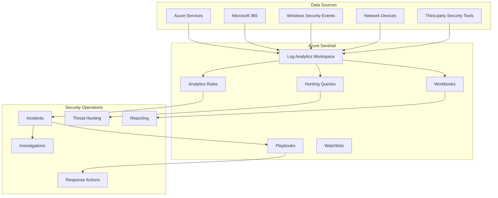

# Azure Sentinel SIEM - Delivery Guide

## Overview

The Azure Sentinel SIEM solution provides comprehensive security information and event management (SIEM) capabilities with cloud-native scalability, AI-powered threat detection, and automated incident response. This solution establishes enterprise-grade security operations center (SOC) capabilities that protect against modern cyber threats and enable rapid threat detection and response.

**Solution Type:** Cloud-native SIEM and SOAR platform  
**Deployment Model:** Azure-native with hybrid data source connectivity  
**Target Audience:** Security teams, SOC analysts, CISO office  
**Complexity Level:** Advanced (Enterprise security operations)

## Key Capabilities

### Core SIEM Services
- **Data Ingestion**: Collect security data from 100+ data sources and connectors
- **Threat Detection**: AI-powered analytics with machine learning models
- **Incident Management**: Automated case creation and workflow orchestration
- **Threat Hunting**: Interactive KQL-based investigation and exploration
- **Compliance Reporting**: Built-in compliance dashboards and reporting
- **SOAR Integration**: Security orchestration with automated playbook responses

### Advanced Security Features
- **User and Entity Behavior Analytics (UEBA)**: Detect anomalous behavior patterns
- **Threat Intelligence**: Integration with global threat intelligence feeds
- **Custom Analytics**: Purpose-built detection rules and machine learning models
- **Multi-workspace Management**: Centralized management across environments
- **API Integration**: RESTful APIs for third-party tool integration
- **Mobile Access**: iOS and Android apps for SOC team mobility

## Architecture Overview

### Core Components



### Security Data Flow

**Data Collection Architecture**
- **Azure Services**: Native integration with Azure Activity, Security Center, and resource logs
- **Microsoft 365**: Email security, identity events, and collaboration platform logs
- **Windows Endpoints**: Security events via Azure Monitor Agent or Log Analytics Agent
- **Network Infrastructure**: Firewall, proxy, and network device logs via Syslog or CEF
- **Third-party Tools**: API connectors for popular security tools and threat intelligence

**Analytics and Detection**
- **Built-in Analytics**: Pre-configured rules for common attack patterns
- **Custom Rules**: KQL-based detection logic for organization-specific threats
- **Machine Learning**: Anomaly detection for user behavior and network traffic
- **Threat Intelligence**: Indicator matching and enrichment from multiple feeds

## Deployment Options

### Option 1: Rapid Security Operations Center (4-6 weeks)
**Recommended for:** Organizations needing immediate SIEM capabilities  
**Timeline:** 4-6 weeks  
**Resources Required:** 2-3 security architects, 1-2 SOC analysts

**Deployment Approach:**
1. Log Analytics workspace setup and configuration
2. Essential data source connections (Azure, Microsoft 365, endpoints)
3. Built-in analytics rules activation and tuning
4. Basic incident response workflows
5. SOC analyst training and handover

### Option 2: Comprehensive SIEM with Advanced Analytics (8-12 weeks)
**Recommended for:** Enterprise environments with complex security requirements  
**Timeline:** 8-12 weeks  
**Resources Required:** 3-4 security architects, 2-3 SOC analysts, 1-2 threat hunters

**Implementation Strategy:**
1. Detailed requirements analysis and architecture design
2. Multi-source data ingestion and normalization
3. Custom analytics rules and machine learning models
4. SOAR playbooks for automated response
5. Threat hunting queries and investigation procedures
6. Comprehensive SOC training and certification

### Option 3: Multi-Tenant Global SOC (12-16 weeks)
**Recommended for:** Large enterprises with multiple business units or regions  
**Timeline:** 12-16 weeks  
**Resources Required:** 4-5 security architects, 3-4 SOC analysts, 1-2 compliance specialists

**Multi-Tenant Approach:**
1. Cross-workspace architecture design and deployment
2. Global and regional data source integration
3. Centralized analytics with distributed incident management
4. Multi-language support and regional compliance
5. Advanced threat intelligence and hunting capabilities
6. 24/7 SOC operations model and procedures

## Quick Start Guide

### Prerequisites Checklist
- [ ] Azure subscription with appropriate permissions (Security Admin, Contributor)
- [ ] Log Analytics workspace or permission to create one
- [ ] Data source inventory and access credentials
- [ ] Security team roles and responsibilities defined
- [ ] Compliance and data retention requirements documented

### Rapid Deployment (1-2 weeks)

#### Week 1: Foundation Setup
```bash
# Create resource group for Sentinel
az group create --name "rg-security-prod-eus2-001" --location "East US 2"

# Create Log Analytics workspace
az monitor log-analytics workspace create \
  --resource-group "rg-security-prod-eus2-001" \
  --workspace-name "law-security-prod-eus2-001" \
  --location "East US 2" \
  --sku "PerGB2018" \
  --retention-time 90

# Enable Azure Sentinel
az sentinel workspace create \
  --resource-group "rg-security-prod-eus2-001" \
  --workspace-name "law-security-prod-eus2-001"
```

```powershell
# Configure data connectors using PowerShell
Import-Module Az.SecurityInsights

# Enable Azure Activity connector
New-AzSentinelDataConnector -ResourceGroupName "rg-security-prod-eus2-001" `
  -WorkspaceName "law-security-prod-eus2-001" `
  -Kind "AzureActivity" `
  -SubscriptionId (Get-AzContext).Subscription.Id

# Enable Security Center connector  
New-AzSentinelDataConnector -ResourceGroupName "rg-security-prod-eus2-001" `
  -WorkspaceName "law-security-prod-eus2-001" `
  -Kind "AzureSecurityCenter" `
  -SubscriptionId (Get-AzContext).Subscription.Id

# Enable Microsoft 365 Defender connector
New-AzSentinelDataConnector -ResourceGroupName "rg-security-prod-eus2-001" `
  -WorkspaceName "law-security-prod-eus2-001" `
  -Kind "MicrosoftThreatProtection"
```

#### Week 2: Analytics and Detection
```powershell
# Import built-in analytics rules
$ruleTemplates = Get-AzSentinelAlertRuleTemplate -ResourceGroupName "rg-security-prod-eus2-001" -WorkspaceName "law-security-prod-eus2-001"

# Enable high-confidence detection rules
$criticalRules = $ruleTemplates | Where-Object { $_.Severity -eq "High" -and $_.Confidence -eq "High" }

foreach ($rule in $criticalRules) {
    New-AzSentinelAlertRule -ResourceGroupName "rg-security-prod-eus2-001" `
      -WorkspaceName "law-security-prod-eus2-001" `
      -RuleId $rule.Name `
      -TemplateId $rule.Id `
      -Enabled $true
}
```

## Implementation Approach

### Phase 1: Foundation and Data Sources (Weeks 1-3)

**Deliverables:**
- Log Analytics workspace configuration
- Essential data source connections
- Basic security monitoring dashboard
- Initial threat detection rules
- SOC team access and permissions

**Key Activities:**
1. **Workspace Setup**: Configure Log Analytics workspace with appropriate retention and access controls
2. **Data Source Integration**: Connect Azure services, Microsoft 365, and critical endpoints
3. **Basic Analytics**: Enable built-in detection rules for common attack patterns
4. **Dashboard Configuration**: Set up security operations overview and key metrics
5. **User Access**: Configure RBAC and SOC analyst permissions

### Phase 2: Advanced Analytics and Detection (Weeks 4-6)

**Deliverables:**
- Custom detection rules and queries
- Machine learning model deployment
- Threat intelligence integration
- Investigation and hunting queries
- Automated alert triage

**Key Activities:**
1. **Custom Analytics**: Develop organization-specific detection rules using KQL
2. **ML Models**: Deploy and tune machine learning models for anomaly detection
3. **Threat Intelligence**: Integrate external threat intelligence feeds and indicators
4. **Hunting Queries**: Create proactive threat hunting queries and notebooks
5. **Alert Tuning**: Optimize detection rules to reduce false positives

### Phase 3: Incident Response and Automation (Weeks 7-9)

**Deliverables:**
- Incident response workflows
- Automated response playbooks
- Case management procedures
- Escalation and notification processes
- Response time optimization

**Key Activities:**
1. **Workflow Design**: Create incident classification and assignment workflows
2. **Playbook Development**: Build automated response playbooks for common scenarios
3. **Integration Setup**: Connect with IT service management and communication tools
4. **Procedure Documentation**: Document incident response procedures and runbooks
5. **Response Testing**: Validate automated responses and escalation procedures

### Phase 4: Advanced Capabilities and Optimization (Weeks 10-12)

**Deliverables:**
- Advanced threat hunting capabilities
- UEBA implementation and tuning
- Compliance reporting and dashboards
- Performance optimization
- SOC maturity assessment

**Key Activities:**
1. **Threat Hunting**: Implement advanced hunting techniques and hypothesis testing
2. **UEBA Configuration**: Deploy and tune user and entity behavior analytics
3. **Compliance Tools**: Set up regulatory compliance monitoring and reporting
4. **Performance Tuning**: Optimize query performance and workspace efficiency
5. **Maturity Assessment**: Evaluate SOC capabilities and improvement recommendations

## Success Criteria

### Technical Success Metrics
- **Data Ingestion**: 95% successful ingestion rate from all connected data sources
- **Query Performance**: <30 second average response time for security queries
- **Detection Coverage**: 90% coverage of MITRE ATT&CK framework techniques
- **False Positive Rate**: <5% false positive rate for high-confidence alerts
- **System Availability**: 99.9% uptime for Sentinel workspace and analytics

### Operational Success Metrics
- **Mean Time to Detection (MTTD)**: <30 minutes for critical security incidents
- **Mean Time to Response (MTTR)**: <2 hours for high-priority incidents
- **Incident Volume**: 80% reduction in noise through effective alert tuning
- **Automation Rate**: 60% of incidents handled with automated triage and response
- **SOC Efficiency**: 40% improvement in analyst productivity and case closure

### Business Success Metrics
- **Compliance Score**: 95% compliance with applicable security frameworks
- **Risk Reduction**: 70% reduction in security risk exposure metrics
- **Cost Optimization**: 50% reduction in security operations costs vs. traditional SIEM
- **Skill Development**: 90% of SOC analysts certified on Azure Sentinel platform
- **Stakeholder Satisfaction**: 4.5/5 rating from business stakeholders on security posture

## Support and Resources

### Documentation Structure
```
delivery/
├── README.md (this file)
├── implementation-guide.md       # Detailed deployment procedures
├── configuration-templates.md    # KQL queries, playbooks, and workbooks
├── operations-runbook.md         # SOC operational procedures
├── testing-procedures.md         # Security testing and validation
└── training-materials.md         # SOC analyst training curriculum
```

### Professional Services
- **Security Architecture Review**: Expert validation of security design and configuration
- **SOC Development**: Hands-on assistance building security operations capabilities
- **Training Delivery**: Specialized training programs for security teams
- **Managed Services**: Ongoing SOC operations and threat hunting services

### Community Resources
- **Security Community**: Access to Microsoft security community and best practices
- **Threat Intelligence**: Regular updates on threat landscapes and indicators
- **Analytics Exchange**: Shared detection rules and hunting queries
- **Tool Integration**: Latest connectors and integration capabilities

### Next Steps
1. Review the **implementation-guide.md** for step-by-step deployment procedures
2. Examine **configuration-templates.md** for KQL queries and automation templates
3. Study **operations-runbook.md** for SOC operational procedures
4. Follow **testing-procedures.md** for security validation and testing
5. Complete **training-materials.md** curriculum for SOC team enablement

This Azure Sentinel SIEM solution provides comprehensive security operations capabilities that protect against modern cyber threats while enabling efficient and effective security operations at enterprise scale.