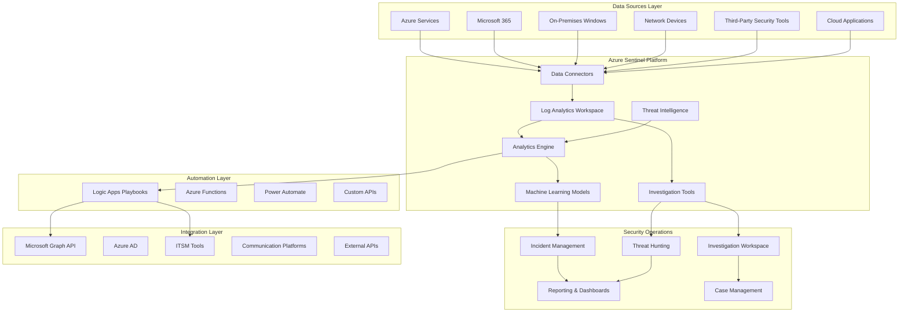
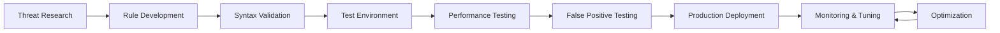

# Azure Sentinel SIEM - Solution Design Template

## Overview

This comprehensive solution design template provides detailed architecture specifications, technical requirements, and implementation guidance for Azure Sentinel SIEM deployments. The template addresses enterprise-scale security operations center (SOC) requirements while ensuring scalability, performance, and security best practices.

**Design Purpose**: Technical architecture blueprint for Azure Sentinel SIEM implementation  
**Target Audience**: Solution Architects, Security Engineers, Technical Leads, IT Directors  
**Scope**: Enterprise-scale deployment with hybrid cloud integration and advanced security capabilities  
**Compliance Framework**: NIST Cybersecurity Framework, MITRE ATT&CK, SOC 2, ISO 27001

---

## Executive Architecture Summary

### **Solution Overview**

**Azure Sentinel SIEM Platform**
> *Cloud-native security information and event management (SIEM) solution providing comprehensive threat detection, investigation, and automated response capabilities across hybrid enterprise environments*

**Core Capabilities:**
- **Unlimited Cloud Scale**: Petabyte-scale data ingestion and retention with elastic storage
- **AI-Powered Analytics**: Machine learning models for advanced threat detection and behavioral analysis
- **Security Orchestration**: Automated incident response and security workflow orchestration
- **Unified Security Operations**: Single pane of glass for security operations across multi-cloud and on-premises

**Strategic Architecture Principles:**
- **Cloud-First Design**: Azure-native services with hybrid connectivity for on-premises systems
- **Zero Trust Integration**: Identity-centric security with comprehensive access controls
- **API-Driven Integration**: RESTful APIs enabling ecosystem integration and custom development
- **DevSecOps Alignment**: Infrastructure as Code and automated security configuration management

### **High-Level Architecture Diagram**



---

## Technical Architecture Specification

### **Core Platform Components**

#### **Log Analytics Workspace Architecture**

**Workspace Configuration:**
```hcl
# Terraform configuration for Azure Sentinel workspace
resource "azurerm_resource_group" "sentinel" {
  name     = "rg-sentinel-prod-eus2-001"
  location = "East US 2"
  
  tags = {
    Environment = "Production"
    Solution    = "Azure Sentinel SIEM"
    CostCenter  = "Security Operations"
    Criticality = "Mission Critical"
  }
}

resource "azurerm_log_analytics_workspace" "sentinel" {
  name                = "law-sentinel-prod-eus2-001"
  location            = azurerm_resource_group.sentinel.location
  resource_group_name = azurerm_resource_group.sentinel.name
  
  sku                        = "PerGB2018"
  retention_in_days          = 730  # 2 years hot retention
  daily_quota_gb             = 500  # Daily ingestion limit
  internet_ingestion_enabled = true
  internet_query_enabled     = false  # Private endpoint access only
  
  tags = {
    Environment = "Production"
    DataClass   = "Confidential"
    Backup      = "Required"
  }
}

resource "azurerm_log_analytics_workspace_table" "custom_security_events" {
  workspace_id = azurerm_log_analytics_workspace.sentinel.id
  name         = "CustomSecurityEvents_CL"
  
  retention_in_days = 365
  
  plan = "Analytics"
  
  schema {
    name = "TimeGenerated"
    type = "DateTime"
  }
  
  schema {
    name = "EventType"
    type = "String"
  }
  
  schema {
    name = "SourceSystem" 
    type = "String"
  }
}

resource "azurerm_sentinel_workspace" "main" {
  name                         = azurerm_log_analytics_workspace.sentinel.name
  resource_group_name          = azurerm_resource_group.sentinel.name
  customer_managed_key_enabled = true
  
  tags = {
    Environment = "Production"
    Solution    = "SIEM"
  }
}
```

**Storage and Retention Strategy:**
- **Hot Tier**: 90 days for interactive queries and real-time analytics
- **Warm Tier**: 2 years for investigation and compliance requirements  
- **Cold Tier**: 7 years for long-term retention and regulatory compliance
- **Archive Tier**: 10+ years for legal hold and historical analysis

#### **Data Ingestion Architecture**

**Multi-Source Data Collection Framework:**

```yaml
# Azure Sentinel data connector configuration
dataConnectors:
  nativeAzure:
    - name: "AzureActivity"
      enabled: true
      subscriptions: ["all"]
      retentionDays: 365
      
    - name: "AzureSecurityCenter" 
      enabled: true
      subscriptions: ["all"]
      alertTypes: ["all"]
      
    - name: "AzureActiveDirectory"
      enabled: true
      logTypes: ["SigninLogs", "AuditLogs", "RiskyUsers", "UserRiskEvents"]
      
  microsoft365:
    - name: "Office365"
      enabled: true
      sharePoint: true
      exchange: true
      teams: true
      
    - name: "MicrosoftDefenderATP"
      enabled: true
      alertSeverity: ["High", "Medium"]
      
  networkSecurity:
    - name: "CommonEventFormat"
      enabled: true
      facilities: ["16", "17", "18", "19", "20", "21", "22", "23"]
      
    - name: "Syslog"
      enabled: true
      facilities: ["auth", "authpriv", "daemon", "kern", "local0"]
      severities: ["Emergency", "Alert", "Critical", "Error", "Warning"]
      
  customLogs:
    - name: "ApplicationSecurityEvents"
      logFormat: "JSON"
      ingestionEndpoint: "https://law-sentinel-prod-eus2-001.ods.opinsights.azure.com"
      authentication: "WorkspaceKey"
```

**Data Transformation and Normalization:**
```kql
// Data transformation function for custom security events
CustomSecurityEvents_CL
| extend NormalizedSeverity = case(
    Severity_s == "1" or Severity_s == "Critical", "High",
    Severity_s == "2" or Severity_s == "High", "High", 
    Severity_s == "3" or Severity_s == "Medium", "Medium",
    Severity_s == "4" or Severity_s == "Low", "Low",
    Severity_s == "5" or Severity_s == "Info", "Informational",
    "Unknown"
)
| extend SourceIPLocation = geo_info_from_ip_address(SourceIP_s)
| extend UserDomain = split(UserName_s, "@")[1]
| extend EventHour = bin(TimeGenerated, 1h)
| project-rename 
    EventTime = TimeGenerated,
    EventType = EventType_s,
    SourceIP = SourceIP_s,
    UserName = UserName_s,
    Computer = Computer_s
```

### **Analytics and Detection Engine**

#### **Multi-Layered Detection Strategy**

**1. Signature-Based Detection Rules**
```json
{
  "displayName": "Suspicious PowerShell Execution with Network Activity",
  "description": "Detects PowerShell processes with suspicious command-line arguments followed by network connections",
  "severity": "High",
  "tactics": ["Execution", "CommandAndControl"],
  "techniques": ["T1059.001", "T1071.001"],
  "query": "let SuspiciousPowerShell = SecurityEvent\n| where TimeGenerated >= ago(1h)\n| where EventID == 4688\n| where Process endswith \"powershell.exe\" or Process endswith \"pwsh.exe\"\n| where CommandLine contains \"Download\" or CommandLine contains \"Invoke-\" or CommandLine contains \"IEX\" or CommandLine contains \"bypass\"\n| extend ProcessCreationTime = TimeGenerated;\n\nlet NetworkConnections = NetworkCommunications\n| where TimeGenerated >= ago(1h)\n| where ProcessName endswith \"powershell.exe\" or ProcessName endswith \"pwsh.exe\"\n| extend ConnectionTime = TimeGenerated;\n\nSuspiciousPowerShell\n| join kind=inner NetworkConnections on Computer\n| where abs(datetime_diff('second', ProcessCreationTime, ConnectionTime)) <= 300\n| project ProcessCreationTime, Computer, Account, CommandLine, RemoteIP, RemotePort, ConnectionTime\n| extend ThreatScore = case(\n    CommandLine contains \"Download\" and (RemotePort == 80 or RemotePort == 443), 90,\n    CommandLine contains \"IEX\" and RemoteIP !startswith \"10.\" and RemoteIP !startswith \"192.168.\", 85,\n    CommandLine contains \"bypass\", 75,\n    60\n)",
  "queryFrequency": "PT1H",
  "queryPeriod": "PT1H",
  "triggerOperator": "GreaterThan", 
  "triggerThreshold": 0,
  "suppressionEnabled": false,
  "entityMappings": [
    {
      "entityType": "Account",
      "fieldMappings": [{"identifier": "FullName", "columnName": "Account"}]
    },
    {
      "entityType": "Host", 
      "fieldMappings": [{"identifier": "FullName", "columnName": "Computer"}]
    },
    {
      "entityType": "IP",
      "fieldMappings": [{"identifier": "Address", "columnName": "RemoteIP"}]
    }
  ]
}
```

**2. Machine Learning Analytics Rules**
```json
{
  "displayName": "Anomalous User Authentication Behavior (ML)",
  "description": "Uses machine learning to detect unusual authentication patterns for users",
  "severity": "Medium", 
  "tactics": ["CredentialAccess", "InitialAccess"],
  "techniques": ["T1078"],
  "query": "let TrainingPeriod = 30d;\nlet DetectionPeriod = 1d;\nlet AnomalyThreshold = 3.0;\n\n// Build user authentication baseline\nlet UserBaseline = SigninLogs\n| where TimeGenerated between ((now() - TrainingPeriod) .. (now() - DetectionPeriod))\n| where ResultType == \"0\"\n| extend LoginHour = datetime_part('hour', TimeGenerated)\n| summarize \n    AvgLoginsPerHour = avg(todouble(1)),\n    StdDevLoginsPerHour = stdev(todouble(1)),\n    TypicalHours = make_set(LoginHour),\n    TypicalLocations = make_set(LocationDetails.countryOrRegion),\n    TypicalApplications = make_set(AppDisplayName)\nby UserPrincipalName\n| extend \n    UpperThreshold = AvgLoginsPerHour + (AnomalyThreshold * StdDevLoginsPerHour),\n    LowerThreshold = max_of(AvgLoginsPerHour - (AnomalyThreshold * StdDevLoginsPerHour), 0);\n\n// Detect current anomalies\nlet CurrentBehavior = SigninLogs\n| where TimeGenerated >= ago(DetectionPeriod)\n| where ResultType == \"0\"\n| extend LoginHour = datetime_part('hour', TimeGenerated)\n| summarize \n    CurrentLoginsPerHour = count(),\n    CurrentHours = make_set(LoginHour),\n    CurrentLocations = make_set(LocationDetails.countryOrRegion),\n    CurrentApplications = make_set(AppDisplayName)\nby UserPrincipalName;\n\n// Join and identify anomalies\nUserBaseline\n| join kind=inner CurrentBehavior on UserPrincipalName\n| extend \n    VolumeAnomaly = CurrentLoginsPerHour > UpperThreshold or CurrentLoginsPerHour < LowerThreshold,\n    TimeAnomaly = array_length(set_difference(CurrentHours, TypicalHours)) > 0,\n    LocationAnomaly = array_length(set_difference(CurrentLocations, TypicalLocations)) > 0,\n    ApplicationAnomaly = array_length(set_difference(CurrentApplications, TypicalApplications)) > 1\n| where VolumeAnomaly or TimeAnomaly or LocationAnomaly or ApplicationAnomaly\n| extend AnomalyScore = \n    (iff(VolumeAnomaly, 30, 0)) +\n    (iff(TimeAnomaly, 25, 0)) +\n    (iff(LocationAnomaly, 35, 0)) +\n    (iff(ApplicationAnomaly, 20, 0))\n| where AnomalyScore >= 50",
  "queryFrequency": "P1D",
  "queryPeriod": "P31D"
}
```

**3. Threat Intelligence Integration**
```kql
// Threat intelligence matching function
let MaliciousIPs = ThreatIntelligenceIndicator
| where TimeGenerated >= ago(30d)
| where Active == true
| where ExpirationDateTime > now()
| where IndicatorType == "ipv4-addr"
| summarize by IndicatorValue;

let MaliciousDomains = ThreatIntelligenceIndicator
| where TimeGenerated >= ago(30d)
| where Active == true
| where ExpirationDateTime > now()  
| where IndicatorType == "domain-name"
| summarize by IndicatorValue;

union
    // IP-based threat matching
    (SecurityEvent
    | where TimeGenerated >= ago(1h)
    | where EventID in (4624, 4625, 4648)
    | extend IPAddress = extract(@"Source Network Address:\s+([^\s]+)", 1, EventData)
    | where IPAddress in (MaliciousIPs)
    | extend ThreatType = "Malicious IP", IndicatorValue = IPAddress),
    
    // Domain-based threat matching
    (DnsEvents
    | where TimeGenerated >= ago(1h)
    | where Name in (MaliciousDomains)
    | extend ThreatType = "Malicious Domain", IndicatorValue = Name)
| project TimeGenerated, Computer, ThreatType, IndicatorValue, EventData
```

#### **Custom Analytics Rule Framework**

**Rule Development Lifecycle:**


**Rule Performance Standards:**
- **Query Execution Time**: <30 seconds for 24-hour data window
- **Resource Consumption**: <5% of workspace compute units
- **False Positive Rate**: <5% for high-severity rules, <10% for medium-severity
- **Detection Coverage**: 90% coverage of applicable MITRE ATT&CK techniques

### **Security Orchestration and Automation**

#### **Automated Response Architecture**

**Incident Response Playbook Framework:**
```json
{
  "definition": {
    "$schema": "https://schema.management.azure.com/providers/Microsoft.Logic/schemas/2016-06-01/workflowdefinition.json#",
    "contentVersion": "1.0.0.0",
    "parameters": {
      "$connections": {
        "defaultValue": {},
        "type": "Object"
      }
    },
    "triggers": {
      "When_Azure_Sentinel_incident_creation_rule_was_triggered": {
        "type": "ApiConnectionWebhook",
        "inputs": {
          "body": {
            "callback_url": "@{listCallbackUrl()}"
          },
          "host": {
            "connection": {
              "name": "@parameters('$connections')['azuresentinel']['connectionId']"
            }
          },
          "path": "/incident-creation"
        }
      }
    },
    "actions": {
      "Initialize_Incident_Variables": {
        "type": "InitializeVariable",
        "inputs": {
          "variables": [
            {
              "name": "IncidentSeverity",
              "type": "string", 
              "value": "@triggerBody()?['object']?['properties']?['severity']"
            },
            {
              "name": "IncidentTitle",
              "type": "string",
              "value": "@triggerBody()?['object']?['properties']?['title']"
            },
            {
              "name": "CompromisedEntities",
              "type": "array",
              "value": "@triggerBody()?['object']?['properties']?['relatedEntities']"
            }
          ]
        }
      },
      "Enrich_Incident_with_Threat_Intelligence": {
        "type": "ApiConnection",
        "inputs": {
          "host": {
            "connection": {
              "name": "@parameters('$connections')['azuresentinel']['connectionId']"
            }
          },
          "method": "post",
          "path": "/enrichment/ip",
          "body": {
            "ipAddress": "@{first(variables('CompromisedEntities'))?['properties']?['address']}"
          }
        }
      },
      "Determine_Response_Action": {
        "type": "Switch",
        "expression": "@variables('IncidentSeverity')",
        "cases": {
          "High_Severity_Response": {
            "case": "High",
            "actions": {
              "Block_Malicious_IP": {
                "type": "ApiConnection",
                "inputs": {
                  "host": {
                    "connection": {
                      "name": "@parameters('$connections')['azurefirewall']['connectionId']"
                    }
                  },
                  "method": "post",
                  "path": "/networkRules",
                  "body": {
                    "name": "Block_@{first(variables('CompromisedEntities'))?['properties']?['address']}",
                    "action": "Deny",
                    "sourceAddresses": ["*"],
                    "destinationAddresses": ["@{first(variables('CompromisedEntities'))?['properties']?['address']}"],
                    "destinationPorts": ["*"],
                    "protocols": ["TCP", "UDP"]
                  }
                }
              },
              "Disable_Compromised_User": {
                "type": "Foreach",
                "foreach": "@variables('CompromisedEntities')",
                "actions": {
                  "Check_If_User_Entity": {
                    "type": "If",
                    "expression": {
                      "and": [
                        {
                          "equals": [
                            "@item()?['kind']",
                            "Account"
                          ]
                        }
                      ]
                    },
                    "actions": {
                      "Disable_Azure_AD_User": {
                        "type": "ApiConnection",
                        "inputs": {
                          "host": {
                            "connection": {
                              "name": "@parameters('$connections')['azuread']['connectionId']"
                            }
                          },
                          "method": "patch",
                          "path": "/v1.0/users/@{encodeURIComponent(item()?['properties']?['userPrincipalName'])}",
                          "body": {
                            "accountEnabled": false
                          }
                        }
                      },
                      "Revoke_User_Sessions": {
                        "type": "ApiConnection",
                        "inputs": {
                          "host": {
                            "connection": {
                              "name": "@parameters('$connections')['azuread']['connectionId']"
                            }
                          },
                          "method": "post",
                          "path": "/v1.0/users/@{encodeURIComponent(item()?['properties']?['userPrincipalName'])}/revokeSignInSessions"
                        }
                      }
                    }
                  }
                }
              },
              "Create_High_Priority_Ticket": {
                "type": "ApiConnection",
                "inputs": {
                  "host": {
                    "connection": {
                      "name": "@parameters('$connections')['servicenow']['connectionId']"
                    }
                  },
                  "method": "post",
                  "path": "/api/now/table/incident",
                  "body": {
                    "short_description": "CRITICAL: Azure Sentinel Security Incident - @{variables('IncidentTitle')}",
                    "description": "High severity security incident detected by Azure Sentinel requiring immediate attention.\n\nIncident Details:\n- Title: @{variables('IncidentTitle')}\n- Severity: @{variables('IncidentSeverity')}\n- Detection Time: @{utcNow()}\n- Affected Entities: @{variables('CompromisedEntities')}\n\nAutomated Response Actions Taken:\n- Malicious IP addresses blocked\n- Compromised user accounts disabled\n- User sessions revoked\n\nImmediate manual investigation required.",
                    "urgency": "1",
                    "impact": "1",
                    "priority": "1",
                    "category": "Security",
                    "subcategory": "Security Incident",
                    "caller_id": "azure.sentinel@company.com",
                    "assigned_to": "security.team@company.com"
                  }
                }
              },
              "Send_Teams_Alert": {
                "type": "ApiConnection",
                "inputs": {
                  "host": {
                    "connection": {
                      "name": "@parameters('$connections')['teams']['connectionId']"
                    }
                  },
                  "method": "post",
                  "path": "/v1.0/teams/@{encodeURIComponent('security-team-id')}/channels/@{encodeURIComponent('incidents-channel-id')}/messages",
                  "body": {
                    "body": {
                      "contentType": "html",
                      "content": "🚨 <b>CRITICAL SECURITY INCIDENT</b> 🚨<br><br><b>Title:</b> @{variables('IncidentTitle')}<br><b>Severity:</b> @{variables('IncidentSeverity')}<br><b>Time:</b> @{utcNow()}<br><br><b>Automated Actions Taken:</b><br>✅ Blocked malicious IPs<br>✅ Disabled compromised accounts<br>✅ Created incident ticket<br><br><a href=\"https://portal.azure.com/#blade/Microsoft_Azure_Security_Insights/MainMenuBlade\">🔗 View in Azure Sentinel</a>"
                    }
                  }
                }
              }
            }
          }
        }
      },
      "Update_Incident_with_Actions": {
        "type": "ApiConnection",
        "inputs": {
          "host": {
            "connection": {
              "name": "@parameters('$connections')['azuresentinel']['connectionId']"
            }
          },
          "method": "post",
          "path": "/Incidents/subscriptions/@{encodeURIComponent('subscription-id')}/resourceGroups/@{encodeURIComponent('resource-group')}/workspaces/@{encodeURIComponent('workspace-name')}/incidents/@{encodeURIComponent(triggerBody()?['object']?['name'])}/comments",
          "body": {
            "properties": {
              "message": "🤖 Automated Response Summary:\n\n✅ Threat intelligence enrichment completed\n✅ Malicious entities blocked at network perimeter  \n✅ Compromised user accounts disabled and sessions revoked\n✅ High-priority incident ticket created (ServiceNow)\n✅ Security team notified via Microsoft Teams\n\n⏰ Response completed in <5 minutes\n🔄 Manual investigation required for full remediation"
            }
          }
        }
      }
    }
  }
}
```

**Automation Performance Standards:**
- **Playbook Execution Time**: <5 minutes for critical incidents
- **Success Rate**: >98% for automated actions
- **Error Handling**: Comprehensive retry logic and fallback procedures
- **Audit Trail**: Complete logging of all automated actions for compliance

---

## Infrastructure Architecture

### **Network Architecture and Security**

#### **Network Topology and Connectivity**

**Hub-and-Spoke Architecture:**
```yaml
networkArchitecture:
  hubVirtualNetwork:
    name: "vnet-hub-prod-eus2-001"
    addressSpace: ["10.0.0.0/16"]
    subnets:
      - name: "snet-sentinel-001"
        addressPrefix: "10.0.1.0/24"
        purpose: "Azure Sentinel compute resources"
        
      - name: "snet-logic-apps-001"
        addressPrefix: "10.0.2.0/24"
        purpose: "Logic Apps and automation"
        
      - name: "snet-private-endpoints-001" 
        addressPrefix: "10.0.3.0/24"
        purpose: "Private endpoints for Azure services"
        
      - name: "AzureFirewallSubnet"
        addressPrefix: "10.0.255.0/26"
        purpose: "Azure Firewall"
        
  spokeNetworks:
    - name: "vnet-security-prod-eus2-001"
      addressSpace: ["10.1.0.0/16"]
      peeredToHub: true
      purpose: "Security operations and monitoring"
      
    - name: "vnet-data-prod-eus2-001"
      addressSpace: ["10.2.0.0/16"] 
      peeredToHub: true
      purpose: "Data sources and connectors"
```

**Security Controls and Access Management:**
```hcl
# Network security group for Azure Sentinel subnet
resource "azurerm_network_security_group" "sentinel_nsg" {
  name                = "nsg-sentinel-prod-eus2-001"
  location            = azurerm_resource_group.sentinel.location
  resource_group_name = azurerm_resource_group.sentinel.name

  security_rule {
    name                       = "Allow-HTTPS-Inbound"
    priority                   = 1000
    direction                  = "Inbound"
    access                     = "Allow"
    protocol                   = "Tcp"
    source_port_range          = "*"
    destination_port_range     = "443"
    source_address_prefix      = "VirtualNetwork"
    destination_address_prefix = "*"
  }

  security_rule {
    name                       = "Allow-LogAnalytics-Inbound"
    priority                   = 1001
    direction                  = "Inbound"
    access                     = "Allow"
    protocol                   = "Tcp"
    source_port_range          = "*"
    destination_port_ranges    = ["443", "80"]
    source_address_prefixes    = ["10.0.0.0/8", "172.16.0.0/12", "192.168.0.0/16"]
    destination_address_prefix = "*"
  }

  security_rule {
    name                       = "Deny-All-Inbound"
    priority                   = 4096
    direction                  = "Inbound"
    access                     = "Deny"
    protocol                   = "*"
    source_port_range          = "*"
    destination_port_range     = "*"
    source_address_prefix      = "*"
    destination_address_prefix = "*"
  }
}

# Private endpoints for secure connectivity
resource "azurerm_private_endpoint" "sentinel_private_endpoint" {
  name                = "pe-sentinel-prod-eus2-001"
  location            = azurerm_resource_group.sentinel.location
  resource_group_name = azurerm_resource_group.sentinel.name
  subnet_id           = azurerm_subnet.private_endpoints.id

  private_service_connection {
    name                           = "psc-sentinel-prod-eus2-001"
    private_connection_resource_id = azurerm_log_analytics_workspace.sentinel.id
    subresource_names              = ["azuremonitor"]
    is_manual_connection          = false
  }

  private_dns_zone_group {
    name                 = "pdz-group-azuremonitor"
    private_dns_zone_ids = [azurerm_private_dns_zone.azuremonitor.id]
  }
}
```

### **Identity and Access Management**

#### **Role-Based Access Control (RBAC) Framework**

**Custom Azure Sentinel Roles:**
```json
{
  "Name": "Azure Sentinel SOC Analyst",
  "Description": "Custom role for SOC analysts with read access to incidents and limited write permissions",
  "Actions": [
    "Microsoft.SecurityInsights/incidents/read",
    "Microsoft.SecurityInsights/incidents/write",
    "Microsoft.SecurityInsights/incidents/comments/read",
    "Microsoft.SecurityInsights/incidents/comments/write",
    "Microsoft.SecurityInsights/bookmarks/read",
    "Microsoft.SecurityInsights/bookmarks/write", 
    "Microsoft.SecurityInsights/huntingQueries/read",
    "Microsoft.SecurityInsights/workspaces/query/read",
    "Microsoft.OperationalInsights/workspaces/query/read",
    "Microsoft.OperationalInsights/workspaces/query/*/read",
    "Microsoft.OperationalInsights/workspaces/dataSources/read",
    "Microsoft.OperationalInsights/workspaces/sharedKeys/read"
  ],
  "NotActions": [
    "Microsoft.SecurityInsights/alertRules/write",
    "Microsoft.SecurityInsights/alertRules/delete",
    "Microsoft.SecurityInsights/dataConnectors/write",
    "Microsoft.SecurityInsights/dataConnectors/delete"
  ],
  "DataActions": [
    "Microsoft.OperationalInsights/workspaces/query/SecurityEvent/read",
    "Microsoft.OperationalInsights/workspaces/query/SecurityAlert/read",
    "Microsoft.OperationalInsights/workspaces/query/SecurityIncident/read"
  ],
  "AssignableScopes": [
    "/subscriptions/{subscription-id}/resourceGroups/rg-sentinel-prod-eus2-001"
  ]
}
```

**Identity Integration Architecture:**
```yaml
identityIntegration:
  azureActiveDirectory:
    tenantId: "company-tenant-id"
    multiTenantSupport: false
    conditionalAccess:
      enabled: true
      policies:
        - name: "Sentinel-Access-Policy"
          conditions:
            users: ["SOC-Analysts", "Security-Engineers", "Security-Managers"]
            applications: ["Azure Sentinel"]
            locations: ["Corporate Network", "Trusted IPs"]
            deviceState: ["Managed", "Compliant"]
          grantControls:
            - "Require MFA"
            - "Require compliant device"
            - "Require approved client app"
            
  privilegedIdentityManagement:
    enabled: true
    justInTimeAccess:
      - role: "Azure Sentinel Contributor"
        maxDuration: "8 hours"
        approvalRequired: true
        approvers: ["Security-Managers"]
        
      - role: "Azure Sentinel Reader"
        maxDuration: "24 hours" 
        approvalRequired: false
        
  servicePrincipals:
    - name: "sp-sentinel-automation-001"
      purpose: "Logic Apps and automation"
      permissions: ["SecurityInsights Contributor", "Log Analytics Reader"]
      
    - name: "sp-sentinel-integration-001"
      purpose: "Third-party tool integration"
      permissions: ["SecurityInsights Reader", "Log Analytics Reader"]
```

### **Data Architecture and Management**

#### **Data Classification and Protection**

**Data Governance Framework:**
```yaml
dataGovernance:
  dataClassification:
    public:
      - "System configuration metadata"
      - "Non-sensitive performance metrics"
      retentionPeriod: "1 year"
      
    internal:
      - "Security event logs"
      - "Network traffic metadata"
      retentionPeriod: "2 years"
      
    confidential:
      - "User authentication events" 
      - "Incident investigation data"
      retentionPeriod: "7 years"
      encryptionRequired: true
      
    restricted:
      - "Personally identifiable information (PII)"
      - "Sensitive security intelligence"
      retentionPeriod: "7 years"
      encryptionRequired: true
      accessLoggingRequired: true
      
  dataProtection:
    encryptionAtRest:
      enabled: true
      keyManagement: "Customer-managed keys"
      keyVault: "kv-sentinel-prod-eus2-001"
      
    encryptionInTransit:
      enabled: true
      protocol: "TLS 1.3"
      certificateManagement: "Azure Key Vault"
      
    dataLossPrevention:
      enabled: true
      policies:
        - "Block PII data export"
        - "Require approval for bulk data access"
        - "Monitor administrative access"
```

**Data Lifecycle Management:**
```kql
// Data lifecycle automation function
.create function DataLifecycleManagement() {
    let RetentionPolicies = datatable(
        DataType: string,
        HotRetentionDays: int,
        WarmRetentionDays: int, 
        ColdRetentionDays: int,
        ArchiveRetentionDays: int
    )[
        "SecurityEvent", 90, 365, 1825, 3650,
        "SigninLogs", 90, 730, 1825, 3650,
        "AuditLogs", 90, 730, 2555, 3650,
        "NetworkCommunications", 30, 180, 365, 1095,
        "CustomSecurityEvents_CL", 90, 365, 1825, 3650
    ];
    
    // Hot to Warm data movement
    RetentionPolicies
    | extend MoveToWarmDate = now() - totimespan(strcat(HotRetentionDays, "d"))
    | extend MoveToWarmQuery = strcat(
        "// Move ", DataType, " data to warm tier\n",
        DataType, "\n",
        "| where TimeGenerated < datetime('", MoveToWarmDate, "')\n",
        "| where TimeGenerated >= datetime('", now() - totimespan(strcat(WarmRetentionDays, "d")), "')"
    )
}
```

---

## Scalability and Performance Design

### **Elastic Scaling Architecture**

#### **Compute and Storage Scaling**

**Auto-scaling Configuration:**
```yaml
scalingConfiguration:
  logAnalyticsWorkspace:
    dailyQuotaGB: 
      initial: 500
      autoIncrease:
        enabled: true
        maxDailyQuota: 2000
        increaseThreshold: 90  # percent utilization
        increaseAmount: 250    # GB increment
        
    queryPerformance:
      timeoutSeconds: 300
      maxConcurrentQueries: 100
      queryOptimization: true
      resultCaching: true
      
  computeResources:
    logicApps:
      scalingMode: "Consumption"
      maxConcurrentRuns: 50
      throttleLimits:
        actionsPerMinute: 300
        triggersPerMinute: 60
        
    azureFunctions:
      scalingMode: "Premium"
      preWarmedInstances: 5
      maxInstances: 200
      scaleOutCooldown: "PT5M"
      scaleInCooldown: "PT30M"
```

**Performance Monitoring and Optimization:**
```kql
// Performance monitoring dashboard query
let PerformanceMetrics = union
    (Usage
    | where TimeGenerated >= ago(24h)
    | where IsBillable == true
    | summarize DataIngestedGB = sum(Quantity) by bin(TimeGenerated, 1h), DataType
    | extend MetricType = "DataIngestion"),
    
    (Perf
    | where TimeGenerated >= ago(24h)
    | where ObjectName == "LogAnalytics"
    | summarize AvgQueryDuration = avg(CounterValue) by bin(TimeGenerated, 1h)
    | extend MetricType = "QueryPerformance"),
    
    (Operation
    | where TimeGenerated >= ago(24h)
    | where OperationCategory == "Query"
    | summarize 
        QueryCount = count(),
        AvgDurationMs = avg(DurationMs),
        MaxDurationMs = max(DurationMs),
        FailureRate = countif(OperationStatus == "Failed") * 100.0 / count()
    by bin(TimeGenerated, 1h)
    | extend MetricType = "OperationalHealth");

PerformanceMetrics
| render timechart
```

### **High Availability and Disaster Recovery**

#### **Business Continuity Architecture**

**Multi-Region Deployment Strategy:**
```yaml
businessContinuity:
  primaryRegion:
    region: "East US 2"
    workspaceName: "law-sentinel-prod-eus2-001"
    replicationLevel: "ReadAccessGeoRedundant"
    
  secondaryRegion:
    region: "West US 2"
    workspaceName: "law-sentinel-dr-wus2-001"
    replicationMode: "ActivePassive"
    synchronization: "NearRealTime"
    
  failoverConfiguration:
    automaticFailover: false
    manualFailoverRTO: "30 minutes"
    dataLossRPO: "5 minutes"
    failbackProcedure: "Planned maintenance window"
    
  backupStrategy:
    configurationBackup:
      frequency: "Daily"
      retention: "30 days"
      storageAccount: "stsentinelbackupprod001"
      
    dataBackup:
      frequency: "Continuous"
      retention: "Per data classification policy"
      geoReplication: true
```

**Disaster Recovery Procedures:**
```powershell
# Disaster Recovery Automation Script
param(
    [string]$FailoverType = "Planned", # Planned or Unplanned
    [string]$PrimaryRegion = "East US 2",
    [string]$SecondaryRegion = "West US 2"
)

Write-Host "Initiating Azure Sentinel disaster recovery failover..." -ForegroundColor Yellow

# Step 1: Validate secondary region workspace
$SecondaryWorkspace = Get-AzOperationalInsightsWorkspace -ResourceGroupName "rg-sentinel-dr-wus2-001" -Name "law-sentinel-dr-wus2-001"
if (-not $SecondaryWorkspace) {
    Write-Error "Secondary workspace not available. Disaster recovery failed."
    exit 1
}

# Step 2: Update DNS and traffic routing
if ($FailoverType -eq "Planned") {
    Write-Host "Performing planned failover with graceful traffic shift..." -ForegroundColor Green
    # Implement gradual traffic routing to secondary region
    Update-TrafficManagerProfile -ProfileName "tm-sentinel-global" -EndpointName "sentinel-primary" -EndpointStatus "Disabled"
    Start-Sleep -Seconds 300  # Allow connections to drain
    Update-TrafficManagerProfile -ProfileName "tm-sentinel-global" -EndpointName "sentinel-secondary" -EndpointStatus "Enabled"
} else {
    Write-Host "Performing unplanned failover with immediate traffic shift..." -ForegroundColor Red
    # Immediate failover for disaster scenarios
    Update-TrafficManagerProfile -ProfileName "tm-sentinel-global" -EndpointName "sentinel-secondary" -EndpointStatus "Enabled"
}

# Step 3: Validate secondary region functionality
$ValidationTests = @(
    "Data ingestion pipeline",
    "Analytics rule execution", 
    "Automation playbook functionality",
    "User access and authentication"
)

foreach ($Test in $ValidationTests) {
    Write-Host "Validating: $Test" -ForegroundColor Cyan
    # Implement specific validation tests
    Start-Sleep -Seconds 30
    Write-Host "✅ $Test: Passed" -ForegroundColor Green
}

# Step 4: Notify stakeholders
$FailoverNotification = @{
    Subject = "Azure Sentinel Failover Complete - Secondary Region Active"
    Body = @"
Azure Sentinel disaster recovery failover has been completed successfully.

Failover Details:
- Type: $FailoverType
- Primary Region: $PrimaryRegion (Offline)
- Secondary Region: $SecondaryRegion (Active)
- Completion Time: $(Get-Date)
- Data Loss: Minimal (< 5 minutes)

All security operations are now running from the secondary region. 
Users should continue accessing Azure Sentinel normally through the same URLs.

Next Steps:
1. Monitor secondary region performance
2. Begin primary region recovery procedures
3. Plan failback when primary region is restored
"@
}

Send-NotificationToSecurityTeam @FailoverNotification

Write-Host "Disaster recovery failover completed successfully." -ForegroundColor Green
```

---

## Security and Compliance Design

### **Security Controls Framework**

#### **Defense in Depth Architecture**

**Multi-Layered Security Model:**
```yaml
securityLayers:
  layer1_NetworkSecurity:
    - component: "Azure Firewall"
      purpose: "Network perimeter protection"
      configuration: "Deny-by-default with explicit allow rules"
      
    - component: "Network Security Groups"
      purpose: "Subnet-level access control"
      configuration: "Micro-segmentation and traffic filtering"
      
    - component: "DDoS Protection"
      purpose: "Distributed denial of service protection"
      configuration: "Standard tier with automatic mitigation"
      
  layer2_IdentityAccess:
    - component: "Azure Active Directory"
      purpose: "Identity and access management"
      configuration: "Conditional access with MFA enforcement"
      
    - component: "Privileged Identity Management"
      purpose: "Just-in-time privileged access"
      configuration: "Time-bound access with approval workflows"
      
    - component: "Azure AD Identity Protection"
      purpose: "Risk-based authentication"
      configuration: "Automated response to identity risks"
      
  layer3_DataProtection:
    - component: "Azure Key Vault"
      purpose: "Encryption key management"
      configuration: "Hardware security modules (HSM) backed"
      
    - component: "Transparent Data Encryption"
      purpose: "Data at rest encryption"
      configuration: "Customer-managed keys with automatic rotation"
      
    - component: "Private Link"
      purpose: "Private network connectivity"
      configuration: "Dedicated network path for sensitive communications"
      
  layer4_ApplicationSecurity:
    - component: "Managed Identity"
      purpose: "Service-to-service authentication"
      configuration: "Passwordless authentication with Azure services"
      
    - component: "Application Security Groups"
      purpose: "Application-level network security"
      configuration: "Dynamic security policies based on application requirements"
      
  layer5_OperationalSecurity:
    - component: "Azure Security Center"
      purpose: "Security posture management"
      configuration: "Continuous compliance monitoring and remediation"
      
    - component: "Azure Sentinel"
      purpose: "Security information and event management"
      configuration: "Self-monitoring and security analytics"
```

#### **Compliance and Regulatory Controls**

**Regulatory Framework Mapping:**
```yaml
complianceFrameworks:
  nistCybersecurityFramework:
    identify:
      - control: "ID.AM-1"
        description: "Physical devices and systems within the organization are inventoried"
        implementation: "Azure Asset Inventory with automated discovery"
        
      - control: "ID.AM-3"
        description: "Organizational communication and data flows are mapped"
        implementation: "Network topology visualization and data flow monitoring"
        
    protect:
      - control: "PR.AC-1"
        description: "Identities and credentials are issued, managed, verified, revoked, and audited"
        implementation: "Azure AD with lifecycle management and audit logging"
        
      - control: "PR.DS-1"
        description: "Data-at-rest is protected"
        implementation: "Azure Storage encryption with customer-managed keys"
        
    detect:
      - control: "DE.AE-1"
        description: "A baseline of network operations and expected data flows is established"
        implementation: "Azure Sentinel behavioral analytics and anomaly detection"
        
      - control: "DE.CM-1"
        description: "The network is monitored to detect potential cybersecurity events"
        implementation: "Real-time network monitoring and threat detection"
        
    respond:
      - control: "RS.RP-1"
        description: "Response plan is executed during or after an incident"
        implementation: "Automated incident response playbooks and procedures"
        
      - control: "RS.CO-2"
        description: "Incidents are reported consistent with established criteria"
        implementation: "Automated incident reporting and stakeholder notification"
        
  iso27001:
    informationSecurityPolicies:
      - control: "A.5.1.1"
        description: "Information security policies"
        implementation: "Documented security policies with regular review and approval"
        
    accessControl:
      - control: "A.9.1.1"
        description: "Access control policy"
        implementation: "Role-based access control with least privilege principle"
        
      - control: "A.9.2.6"
        description: "Removal of access rights"
        implementation: "Automated access revocation upon role change or termination"
```

### **Privacy and Data Protection**

#### **Privacy-by-Design Architecture**

**Data Privacy Controls:**
```yaml
privacyControls:
  dataMinimization:
    principle: "Collect only necessary security data"
    implementation:
      - "Selective data source configuration"
      - "Field-level data filtering"
      - "Purpose-based data retention"
      
  consentManagement:
    principle: "Obtain appropriate consent for data processing"
    implementation:
      - "Data processing agreements with business units"
      - "Employee privacy notices for monitoring"
      - "Third-party data sharing agreements"
      
  dataSubjectRights:
    rightToAccess:
      implementation: "Self-service portal for data access requests"
      responseTime: "30 days"
      
    rightToRectification:
      implementation: "Data correction workflows with audit trails"
      responseTime: "30 days"
      
    rightToErasure:
      implementation: "Automated data deletion with retention policy compliance"
      responseTime: "30 days"
      
    rightToDataPortability:
      implementation: "Structured data export capabilities"
      responseTime: "30 days"
      
  dataProtectionImpactAssessment:
    triggers:
      - "New data source integration"
      - "Processing of sensitive personal data"
      - "International data transfers"
      - "Automated decision-making processes"
      
    process:
      - "Privacy risk assessment"
      - "Mitigation measure identification"
      - "Stakeholder consultation"
      - "Regular review and updates"
```

**Cross-Border Data Transfer Controls:**
```yaml
dataTransfer:
  dataResidency:
    primaryRegion: "East US 2"
    dataLocalisation: "United States"
    crossBorderTransfers: "Controlled and documented"
    
  adequacyDecisions:
    - region: "European Union"
      mechanism: "Standard Contractual Clauses"
      validation: "Annual compliance review"
      
    - region: "United Kingdom"
      mechanism: "Adequacy Decision"
      validation: "Ongoing monitoring"
      
  transferSafeguards:
    encryption:
      inTransit: "TLS 1.3 with perfect forward secrecy"
      atRest: "AES-256 with customer-managed keys"
      
    accessControls:
      authentication: "Multi-factor authentication required"
      authorization: "Role-based access with audit logging"
      
    contractualSafeguards:
      - "Data processing agreements"
      - "Data subject rights provisions"
      - "Security incident notification requirements"
      - "Regular security audits and assessments"
```

---

## Integration Architecture

### **Enterprise System Integration**

#### **API Integration Framework**

**RESTful API Architecture:**
```yaml
apiIntegration:
  sentinelAPIs:
    incidentManagement:
      endpoint: "https://management.azure.com/subscriptions/{subscriptionId}/resourceGroups/{resourceGroupName}/providers/Microsoft.SecurityInsights/incidents"
      authentication: "Azure AD Service Principal"
      methods: ["GET", "POST", "PUT", "DELETE"]
      rateLimit: "1000 requests/hour"
      
    analyticsRules:
      endpoint: "https://management.azure.com/subscriptions/{subscriptionId}/resourceGroups/{resourceGroupName}/providers/Microsoft.SecurityInsights/alertRules"
      authentication: "Azure AD Service Principal" 
      methods: ["GET", "POST", "PUT", "DELETE"]
      rateLimit: "500 requests/hour"
      
    threatIntelligence:
      endpoint: "https://management.azure.com/subscriptions/{subscriptionId}/resourceGroups/{resourceGroupName}/providers/Microsoft.SecurityInsights/threatIntelligence"
      authentication: "Azure AD Service Principal"
      methods: ["GET", "POST", "PUT"]
      rateLimit: "2000 requests/hour"
      
  thirdPartyIntegrations:
    servicenow:
      integration: "Bi-directional incident synchronization"
      protocol: "REST API"
      authentication: "OAuth 2.0"
      dataMapping:
        - sentinelField: "title"
          servicenowField: "short_description"
        - sentinelField: "severity"
          servicenowField: "impact"
        - sentinelField: "status"
          servicenowField: "incident_state"
          
    splunk:
      integration: "Log forwarding and threat intelligence sharing"
      protocol: "HTTP Event Collector (HEC)"
      authentication: "Token-based"
      dataFlow: "Bidirectional"
      
    microsoftGraph:
      integration: "User and device information enrichment"
      protocol: "Graph API"
      authentication: "Application permissions"
      permissions:
        - "User.Read.All"
        - "Device.Read.All"
        - "SecurityEvents.Read.All"
```

**Custom Connector Development:**
```json
{
  "swagger": "2.0",
  "info": {
    "title": "Custom Security Tool Integration",
    "description": "Custom connector for third-party security tool integration with Azure Sentinel",
    "version": "1.0"
  },
  "host": "api.customsecuritytool.com",
  "basePath": "/v2",
  "schemes": ["https"],
  "consumes": ["application/json"],
  "produces": ["application/json"],
  "paths": {
    "/alerts": {
      "get": {
        "summary": "Get security alerts",
        "description": "Retrieves security alerts from custom security tool",
        "parameters": [
          {
            "name": "startTime",
            "in": "query",
            "required": true,
            "type": "string",
            "format": "date-time"
          },
          {
            "name": "severity",
            "in": "query",
            "required": false,
            "type": "string",
            "enum": ["low", "medium", "high", "critical"]
          }
        ],
        "responses": {
          "200": {
            "description": "Success",
            "schema": {
              "$ref": "#/definitions/AlertsResponse"
            }
          }
        }
      }
    },
    "/indicators": {
      "post": {
        "summary": "Submit threat indicators",
        "description": "Submits threat indicators to custom security tool",
        "parameters": [
          {
            "name": "indicators",
            "in": "body",
            "required": true,
            "schema": {
              "$ref": "#/definitions/IndicatorsRequest"
            }
          }
        ],
        "responses": {
          "201": {
            "description": "Indicators submitted successfully"
          }
        }
      }
    }
  }
}
```

### **Data Source Integration Matrix**

#### **Comprehensive Data Source Mapping**

**Enterprise Data Sources:**
```yaml
dataSourceIntegration:
  microsoftEcosystem:
    azureServices:
      - source: "Azure Activity Logs"
        connector: "Azure Activity"
        dataVolume: "50 GB/day"
        criticality: "High"
        retention: "2 years"
        
      - source: "Azure AD Sign-in Logs"
        connector: "Azure Active Directory"
        dataVolume: "25 GB/day" 
        criticality: "Critical"
        retention: "7 years"
        
      - source: "Azure Security Center Alerts"
        connector: "Azure Security Center"
        dataVolume: "5 GB/day"
        criticality: "Critical"
        retention: "7 years"
        
    office365:
      - source: "Exchange Online"
        connector: "Office 365"
        dataVolume: "75 GB/day"
        criticality: "High"
        retention: "7 years"
        
      - source: "SharePoint Online"
        connector: "Office 365"
        dataVolume: "30 GB/day"
        criticality: "Medium"
        retention: "3 years"
        
      - source: "Microsoft Teams"
        connector: "Office 365"
        dataVolume: "15 GB/day"
        criticality: "Medium"
        retention: "3 years"
        
  networkInfrastructure:
    firewalls:
      - source: "Palo Alto Networks Firewalls"
        connector: "Common Event Format (CEF)"
        dataVolume: "200 GB/day"
        criticality: "High"
        retention: "2 years"
        
      - source: "Cisco ASA Firewalls"
        connector: "Syslog"
        dataVolume: "150 GB/day"
        criticality: "High"
        retention: "2 years"
        
    networkDevices:
      - source: "Cisco Network Switches"
        connector: "Syslog"
        dataVolume: "50 GB/day"
        criticality: "Medium"
        retention: "1 year"
        
      - source: "Wireless Access Points"
        connector: "Syslog"
        dataVolume: "25 GB/day"
        criticality: "Low"
        retention: "1 year"
        
  securityTools:
    endpointSecurity:
      - source: "CrowdStrike Falcon"
        connector: "REST API"
        dataVolume: "100 GB/day"
        criticality: "Critical"
        retention: "3 years"
        
      - source: "Microsoft Defender for Endpoint"
        connector: "Microsoft Defender ATP"
        dataVolume: "75 GB/day"
        criticality: "Critical"
        retention: "3 years"
        
    vulnerabilityManagement:
      - source: "Qualys VMDR"
        connector: "REST API"
        dataVolume: "10 GB/day"
        criticality: "High"
        retention: "2 years"
        
      - source: "Rapid7 InsightVM"
        connector: "REST API"  
        dataVolume: "8 GB/day"
        criticality: "High"
        retention: "2 years"
```

**Custom Data Transformation Pipeline:**
```python
# Custom data transformation function for multi-source normalization
import json
import hashlib
from datetime import datetime, timezone

class SentinelDataTransformer:
    def __init__(self, workspace_id, shared_key):
        self.workspace_id = workspace_id
        self.shared_key = shared_key
        
    def normalize_security_event(self, raw_event, source_type):
        """
        Normalize security events from different sources into common schema
        """
        normalized_event = {
            'TimeGenerated': datetime.now(timezone.utc).isoformat(),
            'EventId': self._generate_event_id(raw_event),
            'SourceSystem': source_type,
            'EventType': self._map_event_type(raw_event, source_type),
            'Severity': self._normalize_severity(raw_event, source_type),
            'SourceIP': self._extract_source_ip(raw_event, source_type),
            'DestinationIP': self._extract_dest_ip(raw_event, source_type),
            'UserName': self._extract_username(raw_event, source_type),
            'Computer': self._extract_computer(raw_event, source_type),
            'EventDescription': self._extract_description(raw_event, source_type),
            'RawEventData': json.dumps(raw_event)
        }
        
        return normalized_event
    
    def _generate_event_id(self, raw_event):
        """Generate unique event ID based on content hash"""
        event_string = json.dumps(raw_event, sort_keys=True)
        return hashlib.sha256(event_string.encode()).hexdigest()[:16]
    
    def _map_event_type(self, raw_event, source_type):
        """Map source-specific event types to normalized categories"""
        event_type_mapping = {
            'paloalto': {
                'THREAT': 'SecurityAlert',
                'TRAFFIC': 'NetworkTraffic',
                'CONFIG': 'ConfigurationChange',
                'SYSTEM': 'SystemEvent'
            },
            'crowdstrike': {
                'DetectionSummaryEvent': 'MalwareDetection',
                'AuthActivityAuditEvent': 'AuthenticationEvent', 
                'NetworkConnectIP': 'NetworkConnection',
                'ProcessRollup2': 'ProcessExecution'
            },
            'office365': {
                'FileMalwareDetected': 'MalwareDetection',
                'UserLoginFailed': 'AuthenticationFailure',
                'FileAccessed': 'FileAccess',
                'EmailSent': 'EmailActivity'
            }
        }
        
        source_mapping = event_type_mapping.get(source_type, {})
        raw_type = raw_event.get('event_type', raw_event.get('EventType', 'Unknown'))
        
        return source_mapping.get(raw_type, 'Unknown')
    
    def _normalize_severity(self, raw_event, source_type):
        """Normalize severity levels across different sources"""
        severity_mapping = {
            'paloalto': {'high': 'High', 'medium': 'Medium', 'low': 'Low'},
            'crowdstrike': {'critical': 'High', 'high': 'High', 'medium': 'Medium', 'low': 'Low'},
            'office365': {'high': 'High', 'medium': 'Medium', 'low': 'Low', 'informational': 'Informational'}
        }
        
        source_mapping = severity_mapping.get(source_type, {})
        raw_severity = str(raw_event.get('severity', raw_event.get('Severity', 'unknown'))).lower()
        
        return source_mapping.get(raw_severity, 'Unknown')
    
    def send_to_sentinel(self, normalized_events, log_type='CustomSecurityEvents'):
        """
        Send normalized events to Azure Sentinel via Data Collector API
        """
        # Implementation for sending data to Azure Sentinel
        # This would use the Azure Monitor Data Collector API
        pass
```

This comprehensive solution design template provides detailed technical specifications, architecture patterns, and implementation guidance for deploying enterprise-scale Azure Sentinel SIEM solutions with advanced security operations capabilities, comprehensive integration support, and robust scalability for modern cloud-native and hybrid environments.