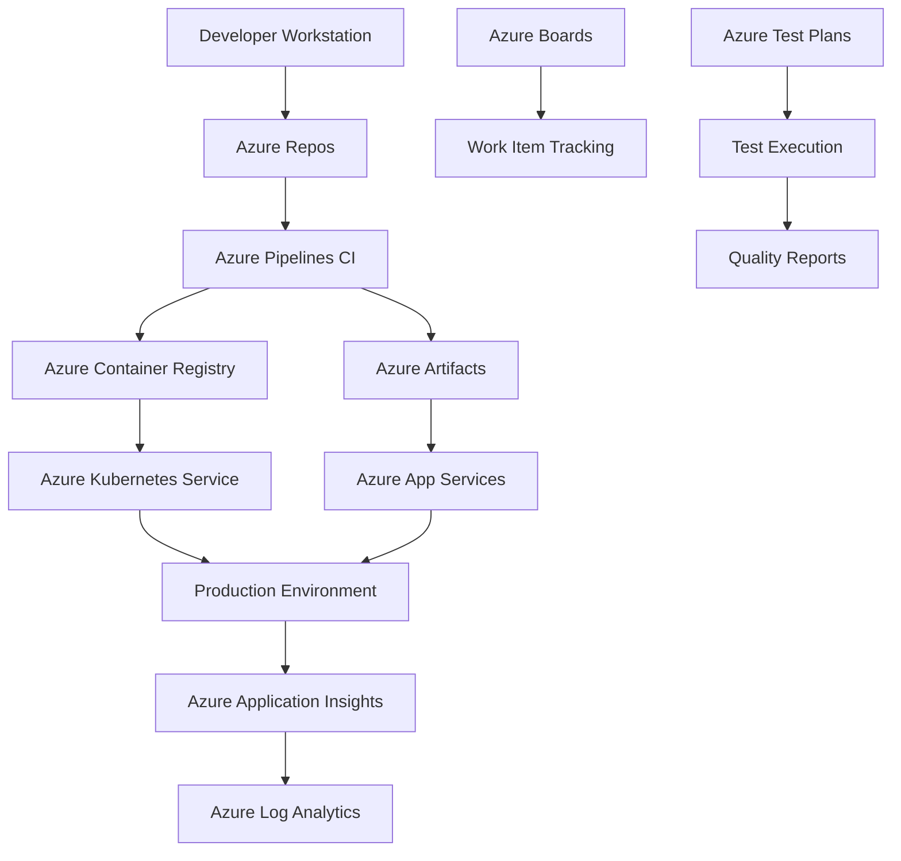

# Azure DevOps Enterprise Platform - Detailed Design

## 📐 **Architecture Overview**

Comprehensive DevOps platform with CI/CD pipelines, testing, and deployment automation for enterprise software development organizations.

### 🎯 **Design Principles**
- **🔒 Security First**: Defense-in-depth security architecture
- **📈 Scalability**: Horizontal and vertical scaling capabilities
- **🔄 Reliability**: High availability and disaster recovery
- **⚡ Performance**: Optimized for production workloads
- **🛡️ Compliance**: Industry standard compliance frameworks
- **💡 Innovation**: Modern cloud-native design patterns

## 🏗️ **Core Architecture Components**

### **Azure DevOps Services**
- **Azure Repos**: Git repositories with advanced branching strategies
- **Azure Pipelines**: CI/CD automation with YAML-based definitions
- **Azure Boards**: Agile project management and work item tracking
- **Azure Test Plans**: Comprehensive test management and execution
- **Azure Artifacts**: Package management and artifact storage

### **Supporting Azure Services**
- **Azure Container Registry**: Container image storage and scanning
- **Azure Kubernetes Service**: Container orchestration platform
- **Azure Key Vault**: Secrets and certificate management
- **Azure Application Insights**: Application performance monitoring
- **Azure Log Analytics**: Centralized logging and analytics

### **Integration Components**
- **Service Connections**: Secure connections to Azure subscriptions
- **Variable Groups**: Centralized configuration management
- **Environments**: Deployment target management with approvals
- **Extensions**: Third-party integrations and custom tasks

## 🔄 **Data Flow Architecture**

### **Development Workflow**
1. **Code Commit**: Developers commit code to feature branches
2. **Pull Request**: Code review process with automated quality gates
3. **CI Pipeline**: Automated build, test, and security scanning
4. **Artifact Creation**: Build artifacts stored in Azure Artifacts
5. **CD Pipeline**: Multi-stage deployment with approval gates
6. **Monitoring**: Application performance and health monitoring

### **Enterprise Data Flow**

## 🔐 **Security Architecture**

### **Security Layers**
- **🌐 Network Security**: Virtual network isolation and NSG controls
- **🔑 Identity & Access**: Azure AD integration with RBAC
- **🛡️ Application Security**: Static and dynamic security testing
- **💾 Data Protection**: Encryption at rest and in transit
- **🔍 Monitoring**: Security information and event management

### **DevSecOps Integration**
- **Static Application Security Testing (SAST)**: SonarCloud integration
- **Dynamic Application Security Testing (DAST)**: OWASP ZAP scanning
- **Dependency Scanning**: WhiteSource vulnerability detection
- **Container Scanning**: Azure Security Center integration
- **Infrastructure as Code Security**: Terraform and ARM template scanning

### **Compliance Framework**
- **SOC 2 Type II**: Security, availability, processing integrity
- **ISO 27001**: Information security management system
- **PCI DSS**: Payment card industry data security (where applicable)
- **GDPR**: Data protection and privacy regulations
- **NIST Cybersecurity Framework**: Comprehensive security controls

## 📊 **Scalability Design**

### **Horizontal Scaling**
- **Pipeline Agents**: Microsoft-hosted and self-hosted agent pools
- **Parallel Execution**: Concurrent build and deployment jobs
- **Geographic Distribution**: Multi-region deployment capabilities
- **Load Distribution**: Traffic management across multiple instances

### **Vertical Scaling**
- **Agent Pool Sizing**: Dynamic scaling based on queue depth
- **Resource Optimization**: Right-sizing based on workload demands
- **Performance Tuning**: Optimized build and deployment processes
- **Capacity Planning**: Proactive scaling based on growth projections

## 🔄 **High Availability & Disaster Recovery**

### **Availability Design**
- **Multi-Region Deployment**: Resources distributed across regions
- **Service Redundancy**: Elimination of single points of failure
- **Health Monitoring**: Automated health checks and failover
- **SLA Targets**: 99.9% uptime for critical services

### **Disaster Recovery Strategy**
- **RTO Target**: Recovery Time Objective < 4 hours
- **RPO Target**: Recovery Point Objective < 1 hour
- **Backup Strategy**: Automated backups with point-in-time recovery
- **Failover Procedures**: Documented and tested failover processes

## 🔗 **Integration Architecture**

### **Internal Integrations**
- **API-First Design**: RESTful APIs for service communication
- **Event-Driven Architecture**: Azure Event Grid for loose coupling
- **Service Mesh**: Istio integration for microservices communication
- **Data Integration**: Azure Data Factory for data pipeline orchestration

### **External Integrations**
- **Identity Providers**: Azure AD, ADFS, SAML integration
- **Monitoring Tools**: DataDog, New Relic, Splunk connectors
- **ITSM Systems**: ServiceNow, Jira Service Management
- **Communication Platforms**: Microsoft Teams, Slack notifications

### **API Management**
- **Azure API Management**: Centralized API gateway
- **Authentication**: OAuth 2.0 and OpenID Connect
- **Rate Limiting**: Throttling and quota management
- **Documentation**: Automated API documentation generation

## 📈 **Performance Architecture**

### **Performance Optimization**
- **Caching Strategies**: Azure Redis Cache implementation
- **Content Delivery**: Azure CDN for global distribution
- **Database Optimization**: Query optimization and indexing strategies
- **Build Optimization**: Incremental builds and caching

### **Performance Monitoring**
- **Application Performance Monitoring**: Azure Application Insights
- **Infrastructure Monitoring**: Azure Monitor and Log Analytics
- **User Experience Monitoring**: Real User Monitoring (RUM)
- **Synthetic Monitoring**: Availability and performance testing

### **Performance Targets**
- **Build Time**: < 10 minutes for standard applications
- **Deployment Time**: < 5 minutes for blue-green deployments
- **Pipeline Queue Time**: < 2 minutes during peak hours
- **API Response Time**: < 500ms for 95th percentile

## 🛠️ **Operational Architecture**

### **DevOps Integration**
- **Infrastructure as Code**: Terraform and ARM templates
- **Configuration Management**: Azure Resource Manager
- **Pipeline as Code**: YAML-based pipeline definitions
- **GitOps**: Git-driven deployment and configuration management

### **Monitoring & Observability**
- **Distributed Tracing**: Application Map and dependency tracking
- **Metrics Collection**: Custom metrics and KPIs
- **Log Aggregation**: Centralized logging with correlation IDs
- **Alerting**: Proactive monitoring with intelligent alerts

### **Automation Framework**
- **Automated Testing**: Unit, integration, and end-to-end tests
- **Automated Deployment**: Multi-environment deployment pipelines
- **Automated Scaling**: Horizontal Pod Autoscaler (HPA) integration
- **Automated Recovery**: Self-healing capabilities and circuit breakers

## 💰 **Cost Optimization**

### **Cost Management Strategies**
- **Resource Right-Sizing**: Automated scaling based on usage patterns
- **Reserved Capacity**: Azure Reserved Instances for predictable workloads
- **Spot Instances**: Azure Spot VMs for development and testing
- **Lifecycle Management**: Automated resource cleanup and tagging

### **FinOps Implementation**
- **Cost Monitoring**: Azure Cost Management integration
- **Budget Alerts**: Proactive cost monitoring and notifications
- **Chargeback Models**: Department and project-based cost allocation
- **Cost Optimization Reports**: Regular cost analysis and recommendations

## 🏛️ **Enterprise Architecture Patterns**

### **Microservices Architecture**
- **Service Decomposition**: Domain-driven design principles
- **Container Strategy**: Docker containerization with Kubernetes
- **Service Communication**: gRPC and REST API patterns
- **Data Management**: Database per service pattern

### **Event-Driven Architecture**
- **Message Queuing**: Azure Service Bus integration
- **Event Sourcing**: Immutable event logs for audit trails
- **CQRS Pattern**: Command Query Responsibility Segregation
- **Saga Pattern**: Distributed transaction management

### **API-First Design**
- **Contract-First Development**: OpenAPI specification
- **Version Management**: Semantic versioning strategy
- **Backward Compatibility**: API evolution guidelines
- **Consumer-Driven Contracts**: Pact testing framework

## 🔄 **Migration Architecture**

### **Migration Strategy**
- **Assessment Phase**: Current state analysis and gap identification
- **Wave Planning**: Risk-based migration sequence
- **Pilot Programs**: Proof of concept with selected teams
- **Gradual Rollout**: Phased migration with parallel running

### **Migration Patterns**
- **Lift and Shift**: Direct migration of existing pipelines
- **Re-platforming**: Modernization during migration
- **Re-architecting**: Complete redesign for cloud-native patterns
- **Hybrid Approach**: Gradual transformation over time

### **Data Migration**
- **Repository Migration**: Git history preservation
- **Work Item Migration**: Complete history and relationships
- **Pipeline Migration**: YAML conversion and optimization
- **Artifact Migration**: Package and container image transfer

## 📚 **Architecture Standards**

### **Coding Standards**
- **Pipeline YAML**: Standardized templates and structures
- **Infrastructure Code**: Terraform modules and ARM templates
- **Application Code**: Language-specific coding standards
- **Documentation**: Architecture Decision Records (ADRs)

### **Security Standards**
- **Secure Coding**: OWASP Top 10 compliance
- **Secret Management**: Azure Key Vault integration
- **Access Control**: Principle of least privilege
- **Audit Logging**: Comprehensive audit trail requirements

### **Operational Standards**
- **Monitoring**: Standard dashboards and alerting
- **Logging**: Structured logging with correlation IDs
- **Error Handling**: Consistent error response patterns
- **Performance**: SLA-based performance requirements

## 📋 **Architecture Validation**

### **Design Validation Criteria**
- [ ] Security requirements met and validated
- [ ] Performance targets achieved and tested
- [ ] Scalability requirements demonstrated
- [ ] Disaster recovery procedures tested
- [ ] Compliance requirements verified
- [ ] Integration points validated
- [ ] Cost projections within budget
- [ ] Operational procedures documented

### **Architecture Review Process**
1. **Technical Review**: Architecture design validation
2. **Security Review**: Security controls and compliance
3. **Performance Review**: Performance and scalability testing
4. **Operations Review**: Operational procedures and runbooks
5. **Cost Review**: Budget validation and optimization
6. **Stakeholder Approval**: Final architecture sign-off

## 📊 **Success Metrics**

### **Technical Metrics**
- **Deployment Frequency**: Daily deployments across teams
- **Lead Time**: < 4 hours from commit to production
- **Change Failure Rate**: < 5% of deployments cause incidents
- **Mean Time to Recovery**: < 1 hour for critical issues

### **Business Metrics**
- **Developer Productivity**: 30% increase in feature delivery
- **Quality Improvement**: 70% reduction in production defects
- **Cost Optimization**: 40% reduction in infrastructure costs
- **Time to Market**: 50% faster feature delivery

### **Platform Metrics**
- **System Availability**: 99.9% uptime SLA
- **Performance**: < 500ms API response time
- **Scalability**: Support for 1000+ concurrent users
- **Security**: Zero critical security vulnerabilities

---

**📍 Detailed Design Version**: 3.0
**Last Updated**: January 2025
**Review Status**: ✅ Validated by Solution Architecture Team

**Next Steps**: Review [Implementation Guide](implementation-guide.md) for deployment procedures or [Configuration Templates](configuration-templates.md) for infrastructure setup.