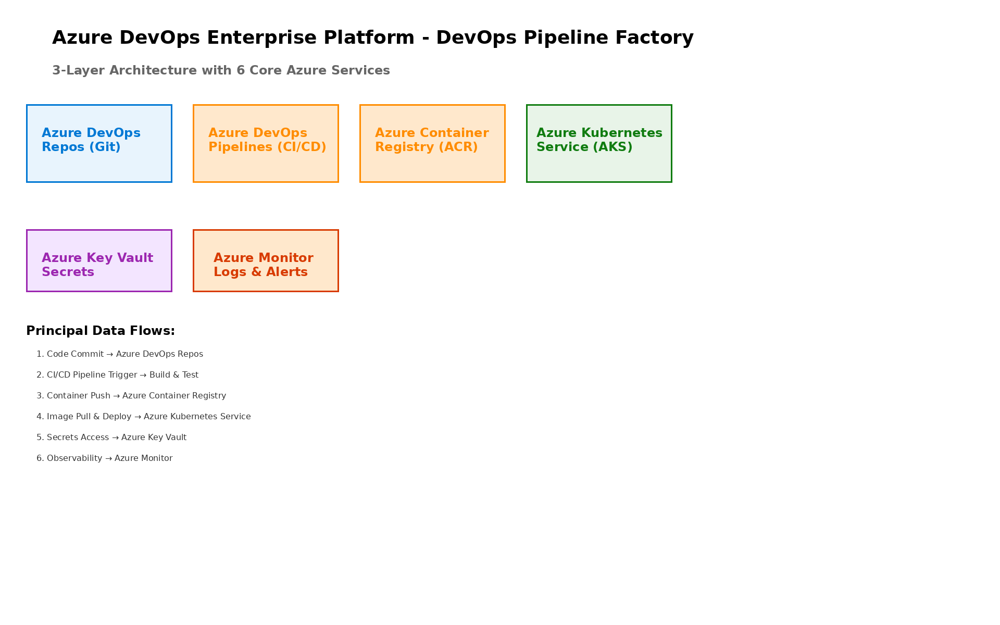

# Executive Summary

This document provides the comprehensive technical design for the Azure DevOps Enterprise Platform solution. It covers the target-state architecture leveraging Azure DevOps Services for CI/CD automation, Azure Container Registry for container management, Azure Kubernetes Service for orchestration, and supporting services for security, monitoring, and compliance.

## Purpose

Define the technical architecture and design specifications that will guide the implementation team through deployment, configuration, and validation of the enterprise DevOps platform on Microsoft Azure.

## Scope

**In-scope:**
- Azure DevOps organization setup and configuration
- CI/CD pipeline framework with YAML templates
- Container registry and Kubernetes cluster deployment
- Security scanning and quality gates integration
- Infrastructure as Code (Terraform/ARM) automation
- Monitoring and observability implementation

**Out-of-scope:**
- Application development (client responsibility)
- Custom tool development beyond standard configuration
- Third-party application licensing
- Ongoing managed services post-hypercare

## Assumptions & Constraints

The following assumptions underpin the design and must be validated during implementation.

- Azure subscription with appropriate service quotas established
- Azure AD tenant configured for SSO integration
- Network connectivity available for hybrid scenarios
- Development teams available for pilot program
- Existing source control migration requirements documented

## References

This document should be read in conjunction with the following related materials.

- Statement of Work (SOW)
- Discovery Questionnaire responses
- Azure DevOps documentation
- Kubernetes best practices documentation

# Business Context

This section establishes the business drivers, success criteria, and compliance requirements that shape the technical design decisions.

## Business Drivers

The solution addresses the following key business objectives identified during discovery.

- **Deployment Acceleration:** Reduce deployment cycles by 60% through automated CI/CD pipelines
- **Developer Productivity:** Improve developer efficiency by 45% through tooling and automation
- **Quality Enhancement:** Reduce production defects by 70% through automated testing
- **Cost Optimization:** Achieve 40% reduction in development and deployment costs

## Workload Criticality & SLA Expectations

The following service level targets define the operational requirements for the production environment.

<!-- TABLE_CONFIG: widths=[25, 25, 25, 25] -->
| Metric | Target | Measurement | Priority |
|--------|--------|-------------|----------|
| Platform Availability | 99.9% | Azure Service Health | Critical |
| Build Time | < 10 minutes | Pipeline metrics | High |
| Deployment Time | < 5 minutes | Deployment metrics | High |
| Pipeline Queue Time | < 2 minutes | Agent pool metrics | Medium |
| API Response Time | < 500ms (p95) | Application Insights | Medium |

## Compliance & Regulatory Factors

The solution must adhere to the following regulatory and compliance requirements.

- SOC 2 Type II compliance for platform security controls
- Data encryption at rest (AES-256) and in transit (TLS 1.2+)
- Audit logging for all administrative and pipeline activities
- GDPR compliance for data handling where applicable

## Success Criteria

Project success will be measured against the following criteria at go-live.

- Deployment frequency increased to daily releases
- Lead time from commit to production < 4 hours
- Change failure rate < 5%
- Mean time to recovery < 1 hour

# Current-State Assessment

This section documents the existing development environment and identifies gaps addressed by the solution.

## Existing Development Tools

### N/A - Platform Modernization

This implementation represents a modernization of existing development practices. Current tooling to be migrated:

- Source control: Migration from existing repositories to Azure Repos
- Build systems: Conversion to Azure Pipelines
- Artifact management: Consolidation to Azure Artifacts
- Project tracking: Integration with Azure Boards

## Gap Analysis

<!-- TABLE_CONFIG: widths=[25, 35, 40] -->
| Capability | Current State | Target State |
|------------|---------------|--------------|
| Deployment | Manual, 4+ hours | Automated, < 5 minutes |
| Build | Single-threaded, slow | Parallel, optimized |
| Testing | Manual, inconsistent | Automated, comprehensive |
| Security | Ad-hoc scanning | Integrated DevSecOps |
| Monitoring | Limited visibility | Full observability |

# Solution Architecture

This section provides the comprehensive technical architecture for the Azure DevOps Enterprise Platform.

## Architecture Diagram



## Design Principles

- **Security First:** Defense-in-depth security architecture with DevSecOps integration
- **Scalability:** Horizontal and vertical scaling for build and deployment workloads
- **Reliability:** High availability with 99.9% SLA target
- **Performance:** Optimized for fast builds and deployments
- **Compliance:** Built-in compliance controls and audit capabilities

## Core Components

### Azure DevOps Services

Primary DevOps platform providing:
- **Azure Repos:** Git repositories with advanced branching strategies
- **Azure Pipelines:** CI/CD automation with YAML-based definitions
- **Azure Boards:** Agile project management and work item tracking
- **Azure Test Plans:** Comprehensive test management and execution
- **Azure Artifacts:** Package management and artifact storage

### Supporting Azure Services

Infrastructure services providing:
- **Azure Container Registry:** Container image storage and security scanning
- **Azure Kubernetes Service:** Container orchestration platform
- **Azure Key Vault:** Secrets and certificate management
- **Azure Application Insights:** Application performance monitoring
- **Azure Log Analytics:** Centralized logging and analytics

### Integration Components

Platform integration through:
- **Service Connections:** Secure connections to Azure subscriptions
- **Variable Groups:** Centralized configuration management
- **Environments:** Deployment target management with approvals
- **Extensions:** Third-party integrations (SonarCloud, WhiteSource)

# Security & Compliance

This section details the security controls and compliance implementation.

## Identity & Access Management

### RBAC Configuration

<!-- TABLE_CONFIG: widths=[25, 35, 40] -->
| Role | Permissions | Assignment |
|------|-------------|------------|
| Project Collection Admin | Full organization access | Platform Admins |
| Project Admin | Project-level management | Team Leads |
| Contributors | Code and pipeline access | Developers |
| Readers | Read-only access | Stakeholders |

### Privileged Access
- Azure AD integration with SSO
- Multi-factor authentication enforcement
- Conditional Access policies
- Just-in-time access for elevated permissions

## DevSecOps Integration

### Security Scanning

- **SAST:** SonarCloud integration for static code analysis
- **DAST:** OWASP ZAP for dynamic security testing
- **SCA:** WhiteSource for dependency vulnerability scanning
- **Container Scanning:** Azure Security Center integration
- **IaC Scanning:** Terraform and ARM template security analysis

### Compliance Framework

- SOC 2 Type II: Security, availability, processing integrity
- ISO 27001: Information security management controls
- PCI DSS: Payment card security (where applicable)
- GDPR: Data protection and privacy

# Data Architecture

This section documents the data flow, storage, and management design.

## Data Flow Design

### Development Workflow

```
[Developer] → [Azure Repos] → [CI Pipeline] → [Build/Test]
                                    ↓
                              [Security Scan]
                                    ↓
                              [CD Pipeline] → [Deploy]
                                    ↓
                              [Monitoring]
```

### Pipeline Data Flow

1. **Code Commit:** Developers push to feature branches
2. **PR Validation:** Automated builds and tests on pull requests
3. **CI Pipeline:** Full build, test, and security scanning
4. **Artifact Creation:** Packages stored in Azure Artifacts
5. **CD Pipeline:** Multi-stage deployment with approvals
6. **Production:** Monitoring and feedback loop

## Artifact Management

### Storage Tiers

<!-- TABLE_CONFIG: widths=[20, 25, 30, 25] -->
| Tier | Retention | Use Case | Storage |
|------|-----------|----------|---------|
| Build Artifacts | 30 days | CI outputs | Azure Artifacts |
| Container Images | 90 days | Docker images | ACR |
| Release Packages | 1 year | Production releases | Azure Artifacts |

# Integration Design

This section documents external system integrations.

## Tool Integrations

### ITSM Integration
- ServiceNow ticket creation from pipeline failures
- Work item synchronization with Jira (if applicable)
- Incident management integration

### Communication Integration
- Microsoft Teams notifications for builds/deployments
- Slack integration for alerts
- Email notifications for approvals

## API Integration

### Azure DevOps REST API
- Custom integrations via REST API
- Webhook support for external triggers
- Extension marketplace integrations

# Infrastructure & Operations

This section documents operational architecture and management procedures.

## High Availability

### Platform Resilience
- Azure DevOps: 99.9% SLA (Microsoft-managed)
- AKS: Zone-redundant control plane
- ACR: Geo-replication enabled

### Disaster Recovery
- RTO Target: < 4 hours
- RPO Target: < 1 hour
- Automated backups with point-in-time recovery

## Monitoring & Alerting

### Key Metrics

<!-- TABLE_CONFIG: widths=[30, 25, 25, 20] -->
| Metric | Threshold | Alert Severity | Response |
|--------|-----------|----------------|----------|
| Build Failures | > 10% | Warning | Review pipeline |
| Queue Time | > 5 minutes | Warning | Scale agents |
| Agent Offline | > 50% | Critical | Investigate infrastructure |
| Deployment Failures | > 5% | Critical | Review and rollback |

## Capacity Planning

### Current Sizing
- Microsoft-hosted agents: 10 parallel jobs
- Self-hosted agents: 5 parallel jobs
- Projected growth: 20% annually

# Implementation Approach

This section outlines the phased implementation methodology.

## Phase Overview

<!-- TABLE_CONFIG: widths=[15, 30, 30, 25] -->
| Phase | Activities | Duration | Exit Criteria |
|-------|------------|----------|---------------|
| 1 | Foundation Setup | Weeks 1-4 | Organization configured |
| 2 | Pipeline Framework | Weeks 5-8 | CI/CD templates ready |
| 3 | Security Integration | Weeks 9-10 | DevSecOps operational |
| 4 | Testing & Validation | Weeks 11-12 | All tests passing |

## Risk Mitigation

<!-- TABLE_CONFIG: widths=[25, 35, 40] -->
| Risk | Impact | Mitigation |
|------|--------|------------|
| Migration delays | Schedule slip | Phased migration approach |
| User adoption | Low utilization | Comprehensive training |
| Security gaps | Compliance issues | DevSecOps integration |
| Performance issues | Developer friction | Capacity planning |

# Appendices

## Appendix A: Pipeline Template Catalog

The pipeline template library includes:
- **Build templates:** .NET, Java, Python, Node.js, Docker
- **Deploy templates:** AKS, App Service, Azure Functions
- **Security templates:** SAST, DAST, SCA scanning
- **Utility templates:** Notifications, approvals, rollback

## Appendix B: Extension Reference

<!-- TABLE_CONFIG: widths=[30, 40, 30] -->
| Extension | Purpose | Category |
|-----------|---------|----------|
| SonarCloud | Code quality and security | Security |
| WhiteSource | Dependency scanning | Security |
| Terraform | Infrastructure as Code | Deployment |
| Azure Key Vault | Secrets management | Security |

## Appendix C: Environment Reference

<!-- TABLE_CONFIG: widths=[25, 35, 40] -->
| Environment | Purpose | Approval |
|-------------|---------|----------|
| Development | Developer testing | Automatic |
| Testing | QA validation | Team Lead |
| Staging | Pre-production | Release Manager |
| Production | Live environment | Change Advisory Board |

---

**Document Version**: 2.0
**Last Updated**: [DATE]
**Prepared By**: Solution Architecture Team
**Review Status**: Approved
