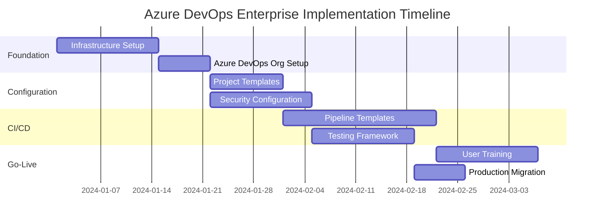

# Azure DevOps Enterprise Platform - Implementation Guide

This comprehensive guide provides step-by-step procedures for implementing Azure DevOps at enterprise scale, covering infrastructure setup, configuration, security, and operational readiness.

## Table of Contents

- [Pre-Implementation Planning](#pre-implementation-planning)
- [Phase 1: Foundation Setup](#phase-1-foundation-setup)
- [Phase 2: Core Configuration](#phase-2-core-configuration)
- [Phase 3: CI/CD Implementation](#phase-3-cicd-implementation)
- [Phase 4: Security & Compliance](#phase-4-security--compliance)
- [Phase 5: Advanced Features](#phase-5-advanced-features)
- [Phase 6: Go-Live & Optimization](#phase-6-go-live--optimization)
- [Post-Implementation Tasks](#post-implementation-tasks)

## Pre-Implementation Planning

### Prerequisites Validation

#### Technical Prerequisites
1. **Azure Subscription Setup**
   - Verify subscription permissions and quotas
   - Ensure billing account configuration
   - Set up resource groups and naming conventions

2. **Active Directory Integration**
   - Configure Azure AD tenant
   - Set up security groups and user accounts
   - Plan identity synchronization if using hybrid identity

3. **Network Configuration**
   - Plan virtual network topology
   - Configure firewall rules and security groups
   - Set up VPN or ExpressRoute for hybrid scenarios

#### Organizational Prerequisites
1. **Stakeholder Alignment**
   - Obtain executive sponsorship
   - Define success criteria and KPIs
   - Establish change management processes

2. **Team Preparation**
   - Identify implementation team members
   - Plan training schedules
   - Define roles and responsibilities

### Implementation Planning



## Phase 1: Foundation Setup

### 1.1 Azure Infrastructure Preparation

#### Azure Subscription Configuration
```bash
# Login to Azure CLI
az login

# Set default subscription
az account set --subscription "your-subscription-id"

# Create resource groups
az group create --name "rg-devops-prod" --location "East US"
az group create --name "rg-devops-dev" --location "East US"
az group create --name "rg-devops-shared" --location "East US"
```

#### Key Vault Setup
```bash
# Create Key Vault for secrets management
az keyvault create \
  --name "kv-devops-enterprise" \
  --resource-group "rg-devops-shared" \
  --location "East US" \
  --enable-rbac-authorization true

# Set Key Vault policies
az keyvault set-policy \
  --name "kv-devops-enterprise" \
  --upn "admin@contoso.com" \
  --secret-permissions get list set delete
```

#### Storage Account for Terraform State
```bash
# Create storage account for Terraform state
az storage account create \
  --name "sadevopstfstate" \
  --resource-group "rg-devops-shared" \
  --location "East US" \
  --sku "Standard_LRS" \
  --kind "StorageV2"

# Create container for state files
az storage container create \
  --name "tfstate" \
  --account-name "sadevopstfstate"
```

### 1.2 Azure DevOps Organization Setup

#### Organization Creation
1. Navigate to https://dev.azure.com
2. Click "Create new organization"
3. Choose organization name: `contoso-enterprise-devops`
4. Select region: `Central US`
5. Configure initial settings:
   - Privacy: Private
   - Version Control: Git
   - Work Item Process: Agile

#### Initial User Configuration
```powershell
# PowerShell script for bulk user addition
$users = @(
    @{Email="john.doe@contoso.com"; AccessLevel="Basic"},
    @{Email="jane.smith@contoso.com"; AccessLevel="Basic+TestPlans"},
    @{Email="admin@contoso.com"; AccessLevel="Basic+TestPlans"}
)

foreach ($user in $users) {
    az devops user add --email-id $user.Email --license-type $user.AccessLevel
}
```

### 1.3 Extensions and Marketplace Apps

#### Required Extensions Installation
```bash
# Install required extensions
az devops extension install --extension-id "sonarqube.sonarqube-quality-gate-extension"
az devops extension install --extension-id "whitesource.ws-bolt"
az devops extension install --extension-id "ms-devlabs.custom-terraform-tasks"
az devops extension install --extension-id "ms-azuretools.vscode-azure-repos"
```

## Phase 2: Core Configuration

### 2.1 Process Template Customization

#### Create Custom Process Template
1. Navigate to Organization Settings → Process
2. Create inherited process from Agile
3. Name: "Enterprise Agile Process"
4. Add custom fields:

```yaml
# Custom fields configuration
custom_fields:
  epic:
    - name: "Business Value"
      type: "Integer"
      required: true
    - name: "ROI Score"
      type: "Integer"
      
  user_story:
    - name: "Acceptance Criteria"
      type: "Text"
      required: true
    - name: "Definition of Done"
      type: "Text"
      required: true
      
  bug:
    - name: "Severity Level"
      type: "Picklist"
      values: ["Critical", "High", "Medium", "Low"]
      required: true
```

### 2.2 Project Structure Implementation

#### Create Project Template
```bash
# Create main application project
az devops project create \
  --name "Enterprise-App-Platform" \
  --description "Main enterprise application platform" \
  --process "Enterprise Agile Process" \
  --source-control "git" \
  --visibility "private"

# Set default project
az devops configure --defaults project="Enterprise-App-Platform"
```

#### Repository Setup
```bash
# Create repositories
az repos create --name "frontend-application"
az repos create --name "backend-services" 
az repos create --name "infrastructure-as-code"
az repos create --name "shared-libraries"
az repos create --name "documentation"

# Initialize repositories with templates
git clone https://dev.azure.com/contoso-enterprise-devops/Enterprise-App-Platform/_git/frontend-application
cd frontend-application
# Copy template files
git add .
git commit -m "Initial template setup"
git push origin main
```

### 2.3 Security Groups Configuration

#### Create Security Groups
```powershell
# Create security groups via Azure DevOps REST API
$headers = @{
    'Authorization' = "Basic $([Convert]::ToBase64String([Text.Encoding]::ASCII.GetBytes(":$env:AZURE_DEVOPS_PAT")))"
    'Content-Type' = 'application/json'
}

$groups = @(
    @{displayName="Enterprise Architects"; description="Solution architects and technical leads"},
    @{displayName="Senior Developers"; description="Senior development team members"},
    @{displayName="QA Engineers"; description="Quality assurance team"},
    @{displayName="DevOps Engineers"; description="DevOps and infrastructure team"},
    @{displayName="Security Team"; description="Security and compliance team"}
)

foreach ($group in $groups) {
    $body = $group | ConvertTo-Json
    Invoke-RestMethod -Uri "$orgUrl/_apis/graph/groups?api-version=6.0-preview.1" -Method POST -Headers $headers -Body $body
}
```

## Phase 3: CI/CD Implementation

### 3.1 Build Pipeline Setup

#### Create Build Pipeline YAML
```yaml
# azure-pipelines-ci.yml
trigger:
  branches:
    include:
    - main
    - develop
  paths:
    exclude:
    - docs/*
    - README.md

pool:
  vmImage: 'ubuntu-latest'

variables:
  buildConfiguration: 'Release'
  dotNetFramework: '6.0.x'
  dotNetVersion: '6.0.x'

stages:
- stage: Build
  displayName: 'Build and Test'
  jobs:
  - job: Build
    displayName: 'Build job'
    steps:
    
    - task: UseDotNet@2
      displayName: 'Use .NET Core SDK $(dotNetVersion)'
      inputs:
        version: '$(dotNetVersion)'

    - task: NuGetAuthenticate@1
      displayName: 'NuGet Authenticate'

    - task: DotNetCoreCLI@2
      displayName: 'Restore packages'
      inputs:
        command: 'restore'
        projects: '**/*.csproj'
        feedsToUse: 'select'
        vstsFeed: 'Enterprise-Packages'

    - task: SonarCloudPrepare@1
      displayName: 'Prepare SonarCloud analysis'
      inputs:
        SonarCloud: 'SonarCloud-Connection'
        organization: 'contoso-enterprise'
        scannerMode: 'MSBuild'
        projectKey: 'enterprise-app-platform'

    - task: DotNetCoreCLI@2
      displayName: 'Build solution'
      inputs:
        command: 'build'
        projects: '**/*.sln'
        arguments: '--configuration $(buildConfiguration) --no-restore'

    - task: DotNetCoreCLI@2
      displayName: 'Run unit tests'
      inputs:
        command: 'test'
        projects: '**/*Tests.csproj'
        arguments: '--configuration $(buildConfiguration) --no-build --collect "Code coverage" --logger trx'
        publishTestResults: true

    - task: SonarCloudAnalyze@1
      displayName: 'Run SonarCloud analysis'

    - task: SonarCloudPublish@1
      displayName: 'Publish SonarCloud results'

    - task: DotNetCoreCLI@2
      displayName: 'Publish application'
      inputs:
        command: 'publish'
        publishWebProjects: true
        arguments: '--configuration $(buildConfiguration) --output $(Build.ArtifactStagingDirectory)'
        zipAfterPublish: true

    - task: PublishPipelineArtifact@1
      displayName: 'Publish build artifacts'
      inputs:
        targetPath: '$(Build.ArtifactStagingDirectory)'
        artifactName: 'drop'
```

### 3.2 Release Pipeline Configuration

#### Multi-Stage Deployment Pipeline
```yaml
# azure-pipelines-cd.yml
trigger: none

resources:
  pipelines:
  - pipeline: build
    source: 'Enterprise-App-CI'
    trigger:
      branches:
        include:
        - main

variables:
- group: 'Global-Variables'

stages:
- stage: Deploy_Development
  displayName: 'Deploy to Development'
  condition: succeeded()
  jobs:
  - deployment: Deploy_Dev
    displayName: 'Deploy to Development'
    environment: 'Development'
    strategy:
      runOnce:
        deploy:
          steps:
          - template: templates/deploy-template.yml
            parameters:
              azureSubscription: 'Azure-Development'
              resourceGroupName: 'rg-app-dev'
              webAppName: 'app-enterprise-dev'

- stage: Deploy_Staging
  displayName: 'Deploy to Staging'
  dependsOn: Deploy_Development
  condition: succeeded()
  jobs:
  - deployment: Deploy_Staging
    displayName: 'Deploy to Staging'
    environment: 'Staging'
    strategy:
      runOnce:
        deploy:
          steps:
          - template: templates/deploy-template.yml
            parameters:
              azureSubscription: 'Azure-Staging'
              resourceGroupName: 'rg-app-staging'
              webAppName: 'app-enterprise-staging'

- stage: Deploy_Production
  displayName: 'Deploy to Production'
  dependsOn: Deploy_Staging
  condition: and(succeeded(), eq(variables['Build.SourceBranch'], 'refs/heads/main'))
  jobs:
  - deployment: Deploy_Prod
    displayName: 'Deploy to Production'
    environment: 'Production'
    strategy:
      runOnce:
        deploy:
          steps:
          - template: templates/deploy-template.yml
            parameters:
              azureSubscription: 'Azure-Production'
              resourceGroupName: 'rg-app-prod'
              webAppName: 'app-enterprise-prod'
```

### 3.3 Infrastructure as Code Pipeline

#### Terraform Deployment Pipeline
```yaml
# terraform-pipeline.yml
trigger:
  branches:
    include:
    - main
  paths:
    include:
    - infrastructure/*

pool:
  vmImage: 'ubuntu-latest'

variables:
- group: 'Terraform-Variables'

stages:
- stage: Plan
  displayName: 'Terraform Plan'
  jobs:
  - job: Plan
    steps:
    - task: TerraformInstaller@0
      displayName: 'Install Terraform'
      inputs:
        terraformVersion: '1.5.7'

    - task: TerraformTaskV3@3
      displayName: 'Terraform Init'
      inputs:
        provider: 'azurerm'
        command: 'init'
        workingDirectory: '$(System.DefaultWorkingDirectory)/infrastructure'
        backendServiceArm: 'Azure-Terraform'
        backendAzureRmResourceGroupName: 'rg-devops-shared'
        backendAzureRmStorageAccountName: 'sadevopstfstate'
        backendAzureRmContainerName: 'tfstate'
        backendAzureRmKey: 'enterprise-platform.tfstate'

    - task: TerraformTaskV3@3
      displayName: 'Terraform Plan'
      inputs:
        provider: 'azurerm'
        command: 'plan'
        workingDirectory: '$(System.DefaultWorkingDirectory)/infrastructure'
        environmentServiceNameAzureRM: 'Azure-Terraform'
        commandOptions: '-out=tfplan'

- stage: Apply
  displayName: 'Terraform Apply'
  dependsOn: Plan
  condition: and(succeeded(), eq(variables['Build.SourceBranch'], 'refs/heads/main'))
  jobs:
  - deployment: Apply
    displayName: 'Apply Infrastructure Changes'
    environment: 'Infrastructure'
    strategy:
      runOnce:
        deploy:
          steps:
          - task: TerraformTaskV3@3
            displayName: 'Terraform Apply'
            inputs:
              provider: 'azurerm'
              command: 'apply'
              workingDirectory: '$(System.DefaultWorkingDirectory)/infrastructure'
              environmentServiceNameAzureRM: 'Azure-Terraform'
              commandOptions: 'tfplan'
```

## Phase 4: Security & Compliance

### 4.1 Branch Protection Policies

#### Implement Branch Policies via REST API
```powershell
# Branch policy configuration script
$orgUrl = "https://dev.azure.com/contoso-enterprise-devops"
$projectName = "Enterprise-App-Platform"
$repoId = (az repos show --repository "backend-services" --query id -o tsv)

# Minimum reviewer policy
$reviewerPolicy = @{
    type = @{
        id = "fa4e907d-c16b-4a4c-9dfa-4906e5d171dd"
    }
    settings = @{
        minimumApproverCount = 2
        creatorVoteCounts = $false
        allowDownvotes = $false
        resetOnSourcePush = $true
    }
} | ConvertTo-Json -Depth 5

Invoke-RestMethod -Uri "$orgUrl/$projectName/_apis/policy/configurations?api-version=6.0" -Method POST -Headers $headers -Body $reviewerPolicy
```

### 4.2 Security Scanning Integration

#### Configure Security Scanning Tasks
```yaml
# Add to build pipeline
- task: WhiteSource@21
  displayName: 'WhiteSource Security Scan'
  inputs:
    cwd: '$(System.DefaultWorkingDirectory)'
    projectName: 'Enterprise-App-Platform'

- task: SonarCloudPrepare@1
  displayName: 'Prepare SonarCloud Security Analysis'
  inputs:
    SonarCloud: 'SonarCloud-Connection'
    organization: 'contoso-enterprise'
    scannerMode: 'MSBuild'
    projectKey: 'enterprise-security-scan'
    extraProperties: |
      sonar.cs.opencover.reportsPaths=$(Agent.TempDirectory)/**/coverage.opencover.xml
      sonar.coverage.exclusions=**/*Tests.cs,**/*Test.cs
```

### 4.3 Secrets Management

#### Azure Key Vault Integration
```bash
# Create service principal for Key Vault access
az ad sp create-for-rbac --name "sp-devops-keyvault" --role "Key Vault Secrets User" --scopes "/subscriptions/$SUBSCRIPTION_ID/resourceGroups/rg-devops-shared/providers/Microsoft.KeyVault/vaults/kv-devops-enterprise"

# Store secrets in Key Vault
az keyvault secret set --vault-name "kv-devops-enterprise" --name "DatabaseConnectionString" --value "Server=...;Database=...;"
az keyvault secret set --vault-name "kv-devops-enterprise" --name "ApiKey" --value "your-api-key"
```

#### Variable Group with Key Vault Integration
```yaml
# Variable group linking to Key Vault
variable_groups:
  production_secrets:
    name: "Production-Secrets"
    description: "Production secrets from Key Vault"
    type: "AzureKeyVault"
    key_vault:
      name: "kv-devops-enterprise"
      service_connection: "Azure-KeyVault"
    secrets:
      - "DatabaseConnectionString"
      - "ApiKey"
      - "StorageAccountKey"
```

## Phase 5: Advanced Features

### 5.1 Test Plans Integration

#### Automated Test Plan Creation
```powershell
# Create test plans via REST API
$testPlan = @{
    name = "Enterprise Application Test Plan"
    description = "Comprehensive test plan for enterprise application"
    areaPath = "Enterprise-App-Platform"
    iterationPath = "Enterprise-App-Platform\Sprint 1"
} | ConvertTo-Json

Invoke-RestMethod -Uri "$orgUrl/$projectName/_apis/testplan/plans?api-version=6.0" -Method POST -Headers $headers -Body $testPlan
```

### 5.2 Artifacts and Package Management

#### Set up Package Feeds
```bash
# Create package feed
az artifacts universal publish \
  --organization "https://dev.azure.com/contoso-enterprise-devops" \
  --project "Enterprise-App-Platform" \
  --scope project \
  --feed "enterprise-packages" \
  --name "shared-libraries" \
  --version "1.0.0" \
  --description "Shared enterprise libraries"
```

### 5.3 Monitoring and Analytics

#### Application Insights Integration
```yaml
# Add to deployment template
- task: AzureResourceManagerTemplateDeployment@3
  displayName: 'Deploy Application Insights'
  inputs:
    deploymentScope: 'Resource Group'
    azureResourceManagerConnection: '$(azureSubscription)'
    subscriptionId: '$(subscriptionId)'
    action: 'Create Or Update Resource Group'
    resourceGroupName: '$(resourceGroupName)'
    location: 'East US'
    templateLocation: 'Linked artifact'
    csmFile: '$(System.DefaultWorkingDirectory)/infrastructure/appinsights.json'
    overrideParameters: '-appName "$(webAppName)" -location "East US"'
```

## Phase 6: Go-Live & Optimization

### 6.1 Production Readiness Checklist

#### Pre-Go-Live Validation
- [ ] All security scans passing
- [ ] Performance benchmarks met
- [ ] Backup and recovery procedures tested
- [ ] Monitoring and alerting configured
- [ ] Documentation complete and reviewed
- [ ] Team training completed
- [ ] Support procedures defined

#### Go-Live Activities
1. **Final Production Deployment**
   ```bash
   # Trigger production deployment
   az pipelines run --name "Enterprise-App-CD" --branch main
   ```

2. **Post-Deployment Verification**
   ```bash
   # Health check script
   curl -f https://app-enterprise-prod.azurewebsites.net/health || exit 1
   ```

3. **Performance Baseline**
   - Run load tests
   - Capture performance metrics
   - Validate SLA compliance

### 6.2 Optimization Phase

#### Performance Tuning
- Review pipeline execution times
- Optimize build and test processes
- Implement parallel job execution
- Configure appropriate agent pools

#### Process Improvements
- Gather user feedback
- Identify bottlenecks and pain points
- Implement process automation
- Establish continuous improvement cycles

## Post-Implementation Tasks

### 6.3 Knowledge Transfer

#### Documentation Updates
- Update architecture documentation
- Create operational procedures
- Document troubleshooting guides
- Maintain configuration references

#### Team Enablement
- Conduct hands-on training sessions
- Create self-service resources
- Establish support channels
- Schedule regular review meetings

### 6.4 Maintenance Planning

#### Regular Maintenance Tasks
- Security updates and patches
- Performance monitoring and optimization
- Backup verification and testing
- Capacity planning and scaling

#### Long-term Evolution
- Plan for Azure DevOps updates
- Evaluate new features and capabilities
- Assess integration opportunities
- Continuous improvement initiatives

## Troubleshooting Common Issues

### Build Failures
```bash
# Common build troubleshooting
az pipelines build list --status failed --top 10
az pipelines runs artifact download --artifact-name "drop" --path ./artifacts
```

### Permission Issues
```bash
# Check user permissions
az devops security permission show --id "2e9eb7ed-3c0a-47d4-87c1-0ffdd275fd87" --subject "user@contoso.com"
```

### Service Connection Problems
```bash
# Validate service connections
az devops service-endpoint list --query "[].{Name:name, Status:isReady}" -o table
```

## Success Metrics and KPIs

### Technical Metrics
- Deployment frequency: Target 10+ per day
- Lead time: Target <4 hours
- Change failure rate: Target <5%
- Mean time to recovery: Target <1 hour

### Business Metrics
- Developer productivity: 25% improvement
- Time to market: 40% reduction
- Quality improvements: 60% defect reduction
- Cost optimization: 30% infrastructure savings

---

## Prerequisites

### 📋 **Implementation Requirements Overview**

This section provides comprehensive prerequisites for successfully implementing the **Azure DevOps Enterprise Platform** solution. All requirements must be validated before beginning implementation.

#### ⏱️ **Quick Reference Summary**
- **Implementation Timeline**: 6-10 weeks
- **Complexity Level**: Advanced
- **Budget Category**: Medium to High
- **Team Size**: 3-6 technical resources (depending on scope)

### 🛠️ **Technical Prerequisites**

#### **☁️ Azure Platform Requirements**
- Administrative access to Azure with appropriate permissions
- Required service quotas and resource limits validated
- Network connectivity with sufficient bandwidth
- Security access controls and firewall configurations

#### **📦 Required Services Access**
- **Azure DevOps**: Service enabled with appropriate permissions
- **Azure Container Registry**: Service enabled with appropriate permissions
- **Azure Kubernetes Service**: Service enabled with appropriate permissions
- **Azure Key Vault**: Service enabled with appropriate permissions

#### **🔧 Infrastructure Requirements**
- Compute resources sized for expected workloads
- Storage capacity for data and backup requirements
- Load balancing and traffic management capabilities
- Monitoring and alerting infrastructure

### 👥 **Skills and Expertise Requirements**

#### **🎯 Required Technical Skills**
- **DevOps Practices**: Hands-on experience and proven competency
- **Container Technologies**: Hands-on experience and proven competency
- **CI/CD Design**: Hands-on experience and proven competency
- **Infrastructure as Code**: Hands-on experience and proven competency

#### **📈 Experience Levels**
- **Lead Architect**: 5+ years cloud architecture experience
- **Implementation Engineers**: 3+ years relevant technology experience
- **Security Specialist**: 3+ years security and compliance experience
- **Operations Team**: 2+ years production support experience

### 📊 **Planning and Preparation Requirements**

#### **📅 Project Planning**
- **Timeline Planning**: 6-10 weeks typical implementation
- **Resource Allocation**: Dedicated project team with defined roles
- **Budget Planning**: Infrastructure, licensing, and professional services costs
- **Risk Assessment**: Identified risks with mitigation strategies

#### **📋 Documentation Requirements**
- Current state architecture documentation
- Network topology and security diagrams
- Integration requirements and dependencies
- Compliance and governance requirements
- Change management and approval processes

#### **🧪 Testing and Validation**
- Development/testing environment availability
- User acceptance testing procedures and criteria
- Performance testing requirements and tools
- Security testing and validation procedures
- Rollback and disaster recovery procedures

### 🔐 **Security and Compliance Prerequisites**

#### **🛡️ Security Requirements**
- Security policies and procedures documentation
- Identity and access management frameworks
- Network security controls and monitoring
- Data classification and protection requirements
- Incident response and security operations procedures

#### **📜 Compliance Requirements**
- Regulatory compliance frameworks (SOC 2, ISO 27001, etc.)
- Data privacy and protection requirements (GDPR, CCPA, etc.)
- Industry-specific compliance requirements
- Audit and reporting requirements
- Change control and approval processes

### 💰 **Budget and Resource Planning**

#### **💵 Cost Categories**
- **Infrastructure Costs**: $10,000 - $50,000+ monthly (based on scale)
- **Licensing Fees**: $5,000 - $25,000+ monthly (service-dependent)
- **Professional Services**: $75,000 - $200,000 (implementation)
- **Training and Certification**: $15,000 - $30,000 (team preparation)
- **Ongoing Support**: 15-20% of infrastructure costs annually

#### **👨‍💼 Human Resources**
- **Project Manager**: Overall project coordination and management
- **Solution Architect**: Architecture design and technical leadership
- **Implementation Engineers**: 2-3 technical implementation specialists
- **Security Specialist**: Security design and validation
- **Operations Team**: Day-2 operations and support readiness

### 📚 **Knowledge and Training Prerequisites**

#### **🎓 Required Training**
- **Azure Fundamentals**: Core Azure concepts and services
- **Azure Solutions Architect**: Architecture design and implementation
- **Azure Security Engineer**: Security and compliance implementation
- **Service-Specific Training**: Specialized training for solution components

#### **📖 Recommended Certifications**
- **Microsoft Certified: Azure Solutions Architect Expert**
- **Microsoft Certified: Azure Security Engineer Associate**
- **Microsoft Certified: DevOps Engineer Expert**
- **Service-specific certifications as applicable**

### ✅ **Prerequisites Validation Checklist**

#### **📋 Technical Validation**
- [ ] All required cloud services available and accessible
- [ ] Compute and storage resources properly sized
- [ ] Network connectivity and security controls tested
- [ ] Integration endpoints and APIs validated
- [ ] Monitoring and logging capabilities confirmed

#### **👥 Team Readiness**
- [ ] Project team roles and responsibilities defined
- [ ] Required skills and certifications verified
- [ ] Training plans completed or scheduled
- [ ] Escalation and support procedures established
- [ ] Change management processes agreed upon

#### **📊 Planning Completion**
- [ ] Project timeline and milestones defined
- [ ] Budget approved and resources allocated
- [ ] Risk assessment completed with mitigation plans
- [ ] Testing strategy and acceptance criteria defined
- [ ] Go-live and rollback procedures documented

#### **🔐 Security and Compliance**
- [ ] Security requirements documented and approved
- [ ] Compliance frameworks identified and validated
- [ ] Access controls and permissions configured
- [ ] Security testing procedures defined
- [ ] Incident response procedures established

---

## Troubleshooting

### 🔧 **Troubleshooting Overview**

This comprehensive troubleshooting section provides systematic approaches to diagnosing and resolving common issues with the **Azure DevOps Enterprise Platform** solution.

#### 🎯 **Quick Resolution Index**
| Issue Category | Typical Resolution Time | Complexity Level |
|----------------|------------------------|------------------|
| **Configuration Issues** | 15-30 minutes | Low to Medium |
| **Connectivity Problems** | 30-60 minutes | Medium |
| **Performance Issues** | 1-3 hours | Medium to High |
| **Security and Access** | 30-90 minutes | Medium |
| **Integration Problems** | 1-4 hours | High |

### 🚨 **Common Issues and Solutions**

#### **🔧 Configuration Issues**

**Issue: Service Configuration Errors**
**Symptoms:**
- Configuration validation failures
- Service startup errors
- Parameter validation messages
- Deployment failures

**Diagnostic Steps:**
1. Validate configuration against provided templates
2. Check parameter formats and required values
3. Verify service dependencies and prerequisites
4. Review deployment logs for specific error messages

**Resolution:**
```bash
# Validate configuration syntax
# Check service status and logs
# Compare with working configuration templates
# Apply corrected configuration parameters
```

**Prevention:**
- Use provided configuration templates as baseline
- Validate configurations before deployment
- Implement configuration version control
- Regular configuration audits and reviews

#### **Issue: Resource Naming and Tagging Problems**
**Symptoms:**
- Resource creation failures
- Naming convention violations
- Missing or incorrect tags
- Policy compliance failures

**Resolution:**
- Apply correct naming conventions per solution standards
- Add required tags using provided tag templates
- Resolve naming conflicts through systematic renaming
- Update policies to match organizational requirements

#### **🌐 Connectivity and Network Issues**

**Issue: Network Connectivity Problems**
**Symptoms:**
- Connection timeouts
- DNS resolution failures
- Port accessibility issues
- Certificate errors

**Diagnostic Steps:**
1. **Network Layer Testing:**
   ```bash
   # Test basic connectivity
   ping target-endpoint
   telnet target-host target-port
   nslookup target-domain
   ```

2. **Security Group/Firewall Validation:**
   - Verify security group rules
   - Check firewall configurations
   - Validate port accessibility
   - Review network ACL settings

**Resolution:**
- Configure security groups and firewall rules
- Update DNS settings and records
- Renew or replace expired certificates
- Adjust network access control lists

#### **⚡ Performance Issues**

**Issue: High Latency and Slow Response Times**
**Symptoms:**
- Response times exceeding SLA targets
- User experience degradation
- Timeout errors
- Performance monitoring alerts

**Diagnostic Steps:**
1. **Performance Metrics Analysis:**
   - CPU and memory utilization
   - Database query performance
   - Network latency measurements
   - Application response times

**Resolution:**
- Scale compute resources horizontally or vertically
- Optimize database queries and indexes
- Implement caching strategies
- Adjust resource allocation and limits

#### **🔐 Security and Access Issues**

**Issue: Authentication and Authorization Problems**
**Symptoms:**
- Login failures
- Access denied errors
- Permission-related issues
- Multi-factor authentication problems

**Resolution:**
- Reset user credentials and passwords
- Update role assignments and permissions
- Fix authentication provider configurations
- Reconfigure multi-factor authentication

### 🔍 **Advanced Diagnostics**

#### **📊 Monitoring and Logging Analysis**

**Log Analysis Procedures**
1. **Application Logs:**
   ```bash
   # Filter and analyze application logs
   grep -i "error" application.log | tail -50
   awk '/ERROR/ {print $1, $2, $NF}' application.log
   ```

2. **System Logs:**
   ```bash
   # Check system events and errors
   journalctl -u service-name --since "1 hour ago"
   dmesg | grep -i error
   ```

#### **🛠️ Diagnostic Tools and Commands**

**Network Diagnostics**
```bash
# Network connectivity testing
ping -c 4 target-host
traceroute target-host
nmap -p port-range target-host
curl -v https://target-endpoint

# DNS resolution testing
nslookup domain-name
dig domain-name
host domain-name
```

**Performance Analysis**
```bash
# System performance monitoring
top -p process-id
iotop -o
netstat -an | grep LISTEN
ss -tuln

# Application performance
curl -w "@curl-format.txt" -o /dev/null -s "http://target-url"
ab -n 100 -c 10 http://target-url/
```

### 📞 **Escalation Procedures**

#### **🆘 When to Escalate**
- Issue resolution exceeds 4 hours of troubleshooting
- Multiple system components affected
- Security incidents or potential breaches
- Data loss or corruption suspected
- Business-critical operations impacted

#### **📋 Escalation Information Required**
1. **Problem Description:**
   - Detailed symptoms and error messages
   - Timeline of issue occurrence
   - Impact assessment and affected users
   - Previous troubleshooting attempts

2. **System Information:**
   - Environment details (production, staging, etc.)
   - Software versions and configurations
   - Recent changes or deployments
   - Current system status and metrics

#### **📧 Escalation Contacts**
- **Level 2 Support**: Technical specialists for complex issues
- **Architecture Team**: Design and integration problems
- **Security Team**: Security incidents and vulnerabilities
- **Vendor Support**: Third-party service and licensing issues

### 🔄 **Prevention and Maintenance**

#### **🛡️ Preventive Measures**
1. **Regular Health Checks:**
   - Automated monitoring and alerting
   - Periodic system health assessments
   - Performance baseline monitoring
   - Security vulnerability scanning

2. **Maintenance Procedures:**
   - Regular backup verification and testing
   - Software updates and patch management
   - Configuration management and audits
   - Disaster recovery procedure testing

---

*This implementation guide provides comprehensive procedures for Azure DevOps enterprise deployment. Follow the phases sequentially and validate each step before proceeding to ensure successful implementation.*