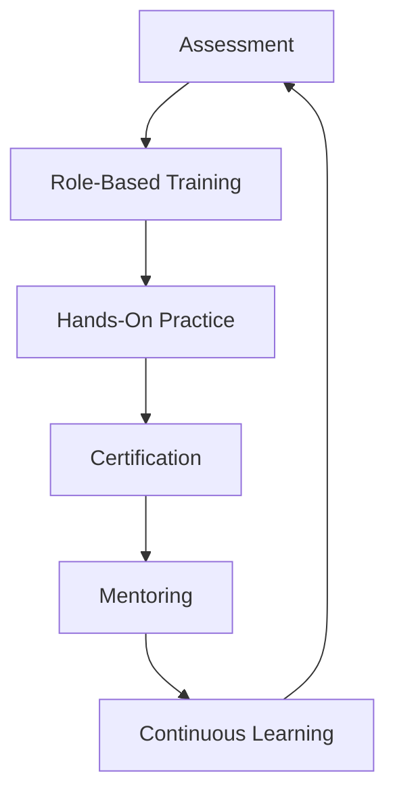

# Azure DevOps Enterprise Platform - Training Materials

This document outlines comprehensive training programs, materials, and knowledge transfer plans for Azure DevOps enterprise platform implementations.

## Table of Contents

- [Training Strategy](#training-strategy)
- [Role-Based Training Programs](#role-based-training-programs)
- [Training Curriculum](#training-curriculum)
- [Hands-On Labs](#hands-on-labs)
- [Certification Paths](#certification-paths)
- [Knowledge Transfer](#knowledge-transfer)
- [Training Resources](#training-resources)
- [Assessment and Evaluation](#assessment-and-evaluation)
- [Ongoing Learning](#ongoing-learning)

## Training Strategy

### Training Objectives
- Enable teams to effectively use Azure DevOps enterprise platform
- Establish DevOps best practices and culture
- Ensure security and compliance understanding
- Build internal expertise and self-sufficiency
- Accelerate adoption and reduce time-to-value

### Training Approach


### Success Metrics
- **Training Completion Rate**: >95% of target audience
- **Certification Achievement**: >80% of participants
- **Platform Adoption Rate**: >90% active usage within 30 days
- **Support Ticket Reduction**: >60% decrease in basic support requests
- **User Satisfaction**: >4.5/5.0 rating on training effectiveness

## Role-Based Training Programs

### Program 1: Developer Training

#### Target Audience
- Software developers
- Application engineers
- DevOps engineers
- Technical leads

#### Duration: 3 Days (24 hours)

#### Learning Objectives
- Master Git version control workflows
- Implement CI/CD pipelines
- Understand testing and quality gates
- Apply security best practices
- Utilize Azure DevOps APIs and extensions

#### Training Modules

**Day 1: Foundation**
```yaml
module_1_1:
  title: "Azure DevOps Overview"
  duration: "2 hours"
  topics:
    - "Platform architecture and services"
    - "Organizations, projects, and teams"
    - "Integration with Azure services"
    - "Security and permissions model"
  
module_1_2:
  title: "Git Version Control Mastery"
  duration: "4 hours"
  topics:
    - "Git fundamentals and advanced concepts"
    - "Branching strategies (GitFlow, GitHub Flow)"
    - "Pull request workflows"
    - "Code review best practices"
    - "Branch policies and protection rules"
  
module_1_3:
  title: "Hands-On Lab: Repository Setup"
  duration: "2 hours"
  activities:
    - "Create repository with proper structure"
    - "Configure branch policies"
    - "Practice pull request workflow"
    - "Set up code review templates"
```

**Day 2: CI/CD Pipelines**
```yaml
module_2_1:
  title: "Build Pipelines"
  duration: "3 hours"
  topics:
    - "YAML pipeline syntax and structure"
    - "Build agents and agent pools"
    - "Pipeline templates and reusability"
    - "Variables and variable groups"
    - "Service connections"
  
module_2_2:
  title: "Testing and Quality Gates"
  duration: "2 hours"
  topics:
    - "Automated testing integration"
    - "Code coverage and quality metrics"
    - "SonarQube integration"
    - "Security scanning (SAST/DAST)"
  
module_2_3:
  title: "Hands-On Lab: Build Pipeline Creation"
  duration: "3 hours"
  activities:
    - "Create multi-stage build pipeline"
    - "Implement automated testing"
    - "Configure quality gates"
    - "Set up notifications and approvals"
```

**Day 3: Deployment and Advanced Topics**
```yaml
module_3_1:
  title: "Release Pipelines"
  duration: "3 hours"
  topics:
    - "Deployment strategies (blue-green, canary)"
    - "Environment management"
    - "Infrastructure as Code (Terraform, ARM)"
    - "Configuration management"
  
module_3_2:
  title: "Monitoring and Troubleshooting"
  duration: "2 hours"
  topics:
    - "Pipeline debugging techniques"
    - "Logs and diagnostics"
    - "Performance optimization"
    - "Common issues and solutions"
  
module_3_3:
  title: "Hands-On Lab: End-to-End Deployment"
  duration: "3 hours"
  activities:
    - "Create release pipeline"
    - "Deploy to multiple environments"
    - "Implement rollback procedures"
    - "Monitor deployment health"
```

### Program 2: Project Manager Training

#### Target Audience
- Project managers
- Scrum masters
- Product owners
- Team leads

#### Duration: 2 Days (16 hours)

#### Learning Objectives
- Manage projects using Azure DevOps work items
- Implement Agile/Scrum processes
- Generate reports and track progress
- Coordinate with development teams
- Understand DevOps metrics and KPIs

#### Training Modules

**Day 1: Project Management Fundamentals**
```yaml
module_pm_1:
  title: "Work Item Management"
  duration: "4 hours"
  topics:
    - "Work item types (Epic, Feature, User Story, Bug)"
    - "Work item states and workflows"
    - "Area and iteration paths"
    - "Query creation and management"
    - "Customizing work item forms"
  
module_pm_2:
  title: "Agile Planning and Tracking"
  duration: "4 hours"
  topics:
    - "Sprint planning and backlog management"
    - "Capacity planning and velocity tracking"
    - "Burndown and burnup charts"
    - "Team retrospectives"
    - "Agile metrics and reporting"
```

**Day 2: Reporting and Integration**
```yaml
module_pm_3:
  title: "Reporting and Dashboards"
  duration: "4 hours"
  topics:
    - "Built-in reports and widgets"
    - "Custom dashboard creation"
    - "Power BI integration"
    - "Analytics and insights"
    - "Stakeholder communication"
  
module_pm_4:
  title: "Integration and Collaboration"
  duration: "4 hours"
  topics:
    - "Integration with Microsoft Teams"
    - "Test plan management"
    - "Requirements traceability"
    - "Cross-project dependencies"
    - "Portfolio management"
```

### Program 3: Administrator Training

#### Target Audience
- Azure DevOps administrators
- IT operations teams
- Platform engineers
- Security administrators

#### Duration: 3 Days (24 hours)

#### Learning Objectives
- Configure and manage Azure DevOps organizations
- Implement security and compliance policies
- Monitor system health and performance
- Manage users, teams, and permissions
- Implement backup and disaster recovery

#### Training Modules

**Day 1: Organization Management**
```yaml
module_admin_1:
  title: "Organization Setup and Configuration"
  duration: "4 hours"
  topics:
    - "Organization creation and settings"
    - "Project administration"
    - "Process template customization"
    - "Extension management"
    - "Billing and licensing"
  
module_admin_2:
  title: "User and Permission Management"
  duration: "4 hours"
  topics:
    - "User lifecycle management"
    - "Security groups and permissions"
    - "Access control and inheritance"
    - "Service accounts and service principals"
    - "Multi-factor authentication"
```

**Day 2: Security and Compliance**
```yaml
module_admin_3:
  title: "Security Configuration"
  duration: "4 hours"
  topics:
    - "Security policies and governance"
    - "Branch protection and code policies"
    - "Secret management and Key Vault integration"
    - "Audit logs and compliance reporting"
    - "Threat detection and response"
  
module_admin_4:
  title: "Infrastructure and Scaling"
  duration: "4 hours"
  topics:
    - "Agent pool management"
    - "Self-hosted agents deployment"
    - "Network security and firewalls"
    - "Performance monitoring"
    - "Capacity planning"
```

**Day 3: Operations and Maintenance**
```yaml
module_admin_5:
  title: "Backup and Disaster Recovery"
  duration: "4 hours"
  topics:
    - "Backup strategies and procedures"
    - "Disaster recovery planning"
    - "Data migration and portability"
    - "Business continuity planning"
    - "Recovery testing"
  
module_admin_6:
  title: "Troubleshooting and Support"
  duration: "4 hours"
  topics:
    - "Common issues and solutions"
    - "Log analysis and diagnostics"
    - "Performance troubleshooting"
    - "Support escalation procedures"
    - "Documentation and knowledge base"
```

## Training Curriculum

### Prerequisite Knowledge Assessment

#### Pre-Training Survey
```yaml
prerequisites:
  basic_requirements:
    - "Basic understanding of software development"
    - "Familiarity with web browsers and cloud concepts"
    - "Active Azure DevOps account"
  
  role_specific:
    developer:
      - "Programming experience (any language)"
      - "Basic Git knowledge"
      - "Understanding of CI/CD concepts"
    
    project_manager:
      - "Project management experience"
      - "Agile/Scrum knowledge"
      - "Requirements gathering skills"
    
    administrator:
      - "System administration experience"
      - "Active Directory knowledge"
      - "Network and security concepts"
```

### Learning Paths

#### Beginner Path (New to DevOps)
1. **DevOps Fundamentals** (4 hours)
2. **Azure DevOps Overview** (4 hours)
3. **Role-Specific Training** (16-24 hours)
4. **Hands-On Practice** (8 hours)
5. **Assessment and Certification** (2 hours)

#### Intermediate Path (Some DevOps Experience)
1. **Azure DevOps Platform Deep Dive** (8 hours)
2. **Advanced Role-Specific Training** (12-16 hours)
3. **Best Practices and Optimization** (4 hours)
4. **Hands-On Projects** (8 hours)
5. **Advanced Certification** (2 hours)

#### Advanced Path (DevOps Experts)
1. **Enterprise Architecture Patterns** (8 hours)
2. **Custom Extensions and APIs** (8 hours)
3. **Platform Optimization** (4 hours)
4. **Mentoring and Knowledge Transfer** (4 hours)
5. **Expert Certification** (2 hours)

## Hands-On Labs

### Lab Environment Setup

#### Lab Infrastructure
```yaml
lab_environment:
  azure_subscription: "Training Subscription"
  resource_group: "rg-devops-training"
  
  services:
    - azure_devops_organization: "contoso-training"
    - azure_app_services: "lab-app-[user-id]"
    - azure_sql_database: "lab-db-[user-id]"
    - azure_key_vault: "kv-training-[user-id]"
    
  access:
    duration: "30 days post-training"
    cleanup: "Automated after expiration"
```

### Lab 1: Repository and Branch Management

#### Objective
Learn Git workflows, branch policies, and pull request processes

#### Duration: 2 hours

#### Prerequisites
- Azure DevOps account
- Git client installed
- Visual Studio Code or preferred IDE

#### Lab Steps

**Step 1: Repository Setup**
```bash
# Clone the training repository
git clone https://dev.azure.com/contoso-training/Lab-Repository/_git/sample-app
cd sample-app

# Create feature branch
git checkout -b feature/add-user-management

# Make changes to code
echo "// New user management feature" >> src/UserService.cs

# Commit changes
git add .
git commit -m "Add user management feature skeleton"

# Push branch
git push origin feature/add-user-management
```

**Step 2: Pull Request Creation**
1. Navigate to Azure DevOps web interface
2. Create pull request from feature branch to main
3. Add reviewers and set auto-complete options
4. Review branch policy requirements

**Step 3: Code Review Process**
1. Review pull request changes
2. Add comments and suggestions
3. Request changes if necessary
4. Approve when ready

### Lab 2: CI/CD Pipeline Creation

#### Objective
Build complete CI/CD pipeline with quality gates

#### Duration: 3 hours

#### Lab Steps

**Step 1: Create Build Pipeline**
```yaml
# azure-pipelines.yml
trigger:
  branches:
    include:
    - main
    - feature/*

pool:
  vmImage: 'ubuntu-latest'

variables:
  buildConfiguration: 'Release'

stages:
- stage: Build
  jobs:
  - job: BuildAndTest
    steps:
    - task: DotNetCoreCLI@2
      displayName: 'Restore packages'
      inputs:
        command: 'restore'
        projects: '**/*.csproj'

    - task: DotNetCoreCLI@2
      displayName: 'Build application'
      inputs:
        command: 'build'
        projects: '**/*.csproj'
        arguments: '--configuration $(buildConfiguration)'

    - task: DotNetCoreCLI@2
      displayName: 'Run tests'
      inputs:
        command: 'test'
        projects: '**/*Tests.csproj'
        arguments: '--configuration $(buildConfiguration) --collect "Code coverage"'

    - task: PublishTestResults@2
      displayName: 'Publish test results'
      inputs:
        testResultsFormat: 'VSTest'
        testResultsFiles: '**/*.trx'

    - task: DotNetCoreCLI@2
      displayName: 'Publish application'
      inputs:
        command: 'publish'
        publishWebProjects: true
        arguments: '--configuration $(buildConfiguration) --output $(Build.ArtifactStagingDirectory)'

    - task: PublishPipelineArtifact@1
      displayName: 'Publish artifacts'
      inputs:
        targetPath: '$(Build.ArtifactStagingDirectory)'
        artifactName: 'drop'
```

**Step 2: Create Release Pipeline**
1. Create new release pipeline
2. Add artifact source
3. Configure development environment
4. Add approval gates
5. Configure staging environment
6. Set up production deployment

### Lab 3: Infrastructure as Code

#### Objective
Deploy infrastructure using Terraform and Azure DevOps pipelines

#### Duration: 2 hours

#### Lab Steps

**Step 1: Terraform Configuration**
```hcl
# main.tf
terraform {
  required_providers {
    azurerm = {
      source  = "hashicorp/azurerm"
      version = "~>3.0"
    }
  }
  
  backend "azurerm" {
    resource_group_name  = "rg-terraform-state"
    storage_account_name = "terraformstatelab"
    container_name       = "tfstate"
    key                  = "lab.tfstate"
  }
}

provider "azurerm" {
  features {}
}

resource "azurerm_resource_group" "lab" {
  name     = "rg-lab-${var.student_id}"
  location = var.location
}

resource "azurerm_app_service_plan" "lab" {
  name                = "plan-lab-${var.student_id}"
  location            = azurerm_resource_group.lab.location
  resource_group_name = azurerm_resource_group.lab.name
  
  sku {
    tier = "Standard"
    size = "S1"
  }
}

resource "azurerm_app_service" "lab" {
  name                = "app-lab-${var.student_id}"
  location            = azurerm_resource_group.lab.location
  resource_group_name = azurerm_resource_group.lab.name
  app_service_plan_id = azurerm_app_service_plan.lab.id
}
```

**Step 2: Infrastructure Pipeline**
```yaml
# terraform-pipeline.yml
trigger:
  paths:
    include:
    - infrastructure/*

pool:
  vmImage: 'ubuntu-latest'

steps:
- task: TerraformInstaller@0
  displayName: 'Install Terraform'
  inputs:
    terraformVersion: '1.5.7'

- task: TerraformTaskV3@3
  displayName: 'Terraform Init'
  inputs:
    provider: 'azurerm'
    command: 'init'
    workingDirectory: '$(System.DefaultWorkingDirectory)/infrastructure'
    backendServiceArm: 'Azure-Lab-Connection'

- task: TerraformTaskV3@3
  displayName: 'Terraform Plan'
  inputs:
    provider: 'azurerm'
    command: 'plan'
    workingDirectory: '$(System.DefaultWorkingDirectory)/infrastructure'
    environmentServiceNameAzureRM: 'Azure-Lab-Connection'
    commandOptions: '-var="student_id=$(Build.RequestedFor)" -out=tfplan'

- task: TerraformTaskV3@3
  displayName: 'Terraform Apply'
  inputs:
    provider: 'azurerm'
    command: 'apply'
    workingDirectory: '$(System.DefaultWorkingDirectory)/infrastructure'
    environmentServiceNameAzureRM: 'Azure-Lab-Connection'
    commandOptions: 'tfplan'
```

## Certification Paths

### Internal Certification Program

#### Azure DevOps Certified Developer
```yaml
certification:
  name: "Azure DevOps Certified Developer"
  duration: "3 months"
  requirements:
    - "Complete Developer Training Program"
    - "Pass written examination (80% minimum)"
    - "Complete hands-on project"
    - "Demonstrate 3 months active usage"
  
  exam_topics:
    - "Git version control (20%)"
    - "CI/CD pipeline design (30%)"
    - "Testing and quality gates (20%)"
    - "Security best practices (15%)"
    - "Troubleshooting and optimization (15%)"
  
  renewal:
    frequency: "Annual"
    requirements: "Complete 8 hours continuing education"
```

#### Azure DevOps Certified Administrator
```yaml
certification:
  name: "Azure DevOps Certified Administrator"
  duration: "4 months"
  requirements:
    - "Complete Administrator Training Program"
    - "Pass written examination (85% minimum)"
    - "Complete infrastructure project"
    - "Demonstrate 6 months administration experience"
  
  exam_topics:
    - "Organization and project management (25%)"
    - "Security and permissions (25%)"
    - "Agent and infrastructure management (20%)"
    - "Backup and disaster recovery (15%)"
    - "Performance and troubleshooting (15%)"
  
  renewal:
    frequency: "Annual"
    requirements: "Complete 12 hours continuing education"
```

### Microsoft Official Certifications

#### Recommended Certifications
1. **AZ-400: Designing and Implementing Microsoft DevOps Solutions**
   - Prerequisites: AZ-104 or AZ-204
   - Validity: 2 years
   - Renewal: Online assessment

2. **AZ-104: Microsoft Azure Administrator Associate**
   - Foundation for DevOps administration
   - Prerequisites: Basic Azure knowledge
   - Validity: 2 years

3. **AZ-204: Developing Solutions for Microsoft Azure**
   - Recommended for developers
   - Prerequisites: Programming experience
   - Validity: 2 years

#### Certification Support
- Study groups and practice sessions
- Exam vouchers for team members
- Preparation materials and practice tests
- Mentoring from certified team members

## Knowledge Transfer

### Knowledge Transfer Plan

#### Phase 1: Documentation Transfer
```yaml
documentation_transfer:
  duration: "2 weeks"
  activities:
    - "Review all implementation documentation"
    - "Update operational procedures"
    - "Create knowledge base articles"
    - "Record video walkthroughs"
  
  deliverables:
    - "Updated architecture documentation"
    - "Operational runbooks"
    - "Troubleshooting guides"
    - "Video tutorial library"
```

#### Phase 2: Hands-On Training
```yaml
hands_on_training:
  duration: "4 weeks"
  activities:
    - "Shadow implementation team"
    - "Practice common procedures"
    - "Simulate incident responses"
    - "Perform backup and recovery drills"
  
  deliverables:
    - "Trained support team"
    - "Validated procedures"
    - "Updated emergency contacts"
    - "Support escalation matrix"
```

#### Phase 3: Transition Period
```yaml
transition_period:
  duration: "4 weeks"
  activities:
    - "Gradual handover of responsibilities"
    - "Joint incident handling"
    - "Regular check-in meetings"
    - "Performance monitoring review"
  
  deliverables:
    - "Full operational handover"
    - "Support metrics baseline"
    - "Lessons learned document"
    - "Continuous improvement plan"
```

### Mentoring Program

#### Mentor Assignment
- Senior team members paired with newcomers
- Cross-functional mentoring (Dev ↔ Ops ↔ QA)
- Regular one-on-one sessions
- Project-based learning opportunities

#### Mentoring Topics
```yaml
mentoring_topics:
  technical:
    - "Platform deep dive sessions"
    - "Code review best practices"
    - "Troubleshooting techniques"
    - "Performance optimization"
  
  process:
    - "DevOps culture and principles"
    - "Agile practices"
    - "Communication skills"
    - "Leadership development"
  
  career:
    - "Skill development planning"
    - "Certification roadmaps"
    - "Career progression paths"
    - "Industry trends and insights"
```

## Training Resources

### Documentation Library

#### User Guides
- **Getting Started Guide**: Step-by-step platform introduction
- **Feature Reference**: Comprehensive feature documentation
- **Best Practices Guide**: Proven patterns and approaches
- **Troubleshooting Guide**: Common issues and solutions
- **API Reference**: Complete API documentation

#### Video Library
```yaml
video_categories:
  fundamentals:
    - "Azure DevOps Platform Overview (30 min)"
    - "Git Workflows Explained (45 min)"
    - "CI/CD Pipeline Basics (60 min)"
  
  advanced:
    - "Security Best Practices (45 min)"
    - "Performance Optimization (30 min)"
    - "Custom Extensions Development (90 min)"
  
  tutorials:
    - "Creating Your First Pipeline (20 min)"
    - "Setting Up Branch Policies (15 min)"
    - "Configuring Test Plans (25 min)"
```

### Interactive Learning

#### Online Learning Platform
- Role-based learning paths
- Interactive simulations
- Progress tracking and badges
- Discussion forums and Q&A

#### Practice Environments
- Sandbox environments for experimentation
- Pre-configured scenarios
- Reset capabilities for repeated practice
- Collaborative spaces for team exercises

### External Resources

#### Microsoft Learn Modules
1. **Introduction to Azure DevOps**
2. **Implement CI with Azure Pipelines**
3. **Design a container build strategy**
4. **Implement dependency management**
5. **Implement application infrastructure**

#### Community Resources
- Azure DevOps Community forums
- GitHub repositories with examples
- Industry blogs and best practices
- Conference talks and presentations

## Assessment and Evaluation

### Training Effectiveness Measurement

#### Kirkpatrick Model Implementation
```yaml
level_1_reaction:
  metrics:
    - "Training satisfaction scores"
    - "Content relevance ratings"
    - "Instructor effectiveness"
    - "Facility and materials quality"
  
  target: "4.5/5.0 average satisfaction"

level_2_learning:
  metrics:
    - "Knowledge retention tests"
    - "Skill demonstrations"
    - "Certification exam results"
    - "Hands-on lab completion"
  
  target: "85% pass rate on assessments"

level_3_behavior:
  metrics:
    - "Platform adoption rates"
    - "Best practices implementation"
    - "Productivity improvements"
    - "Collaboration increases"
  
  target: "90% active platform usage"

level_4_results:
  metrics:
    - "Deployment frequency improvements"
    - "Lead time reductions"
    - "Quality improvements"
    - "Support ticket reductions"
  
  target: "Meet defined DevOps KPIs"
```

### Continuous Improvement

#### Feedback Collection
```yaml
feedback_mechanisms:
  immediate:
    - "End-of-session feedback forms"
    - "Real-time polling during sessions"
    - "Instructor observation notes"
  
  periodic:
    - "30-day follow-up surveys"
    - "Quarterly effectiveness reviews"
    - "Annual training needs assessment"
  
  continuous:
    - "Suggestion box and feedback portal"
    - "Focus group sessions"
    - "Peer review and recommendations"
```

#### Training Content Updates
- Quarterly content reviews
- Integration of new platform features
- Industry best practices incorporation
- Learner feedback integration

## Ongoing Learning

### Continuous Learning Program

#### Monthly Learning Sessions
```yaml
monthly_sessions:
  format: "1-hour lunch and learn"
  frequency: "Last Friday of each month"
  
  topics:
    - "New Azure DevOps features"
    - "Industry case studies"
    - "Advanced techniques and tips"
    - "Guest expert presentations"
    - "Team knowledge sharing"
```

#### Quarterly Deep Dives
- Emerging technologies integration
- Advanced configuration workshops
- Performance optimization sessions
- Security update training
- Platform roadmap discussions

### Knowledge Sharing Culture

#### Community of Practice
```yaml
community_activities:
  internal_forums:
    - "Technical discussion boards"
    - "Best practices sharing"
    - "Problem-solving collaboration"
    - "Innovation showcases"
  
  regular_events:
    - "Weekly tech talks (30 min)"
    - "Monthly demo sessions"
    - "Quarterly hackathons"
    - "Annual DevOps conference"
  
  recognition:
    - "Knowledge sharing awards"
    - "Innovation recognition"
    - "Mentorship appreciation"
    - "Certification achievements"
```

### External Learning Opportunities

#### Conference and Event Participation
- Microsoft Build and Ignite conferences
- DevOps industry conferences
- Regional user groups and meetups
- Vendor training and workshops

#### Professional Development Budget
- Annual learning budget per team member
- Conference attendance support
- External training course funding
- Certification exam reimbursement

---

*This training materials document provides comprehensive guidance for enabling teams to successfully adopt and utilize the Azure DevOps enterprise platform. Regular updates ensure training content remains current with platform evolution and industry best practices.*