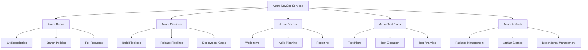

# Azure DevOps Enterprise Platform - Business Case Template

This template provides a comprehensive framework for developing compelling business cases for Azure DevOps enterprise platform implementations, including financial analysis, risk assessment, and strategic alignment.

---

## Executive Summary

### Business Opportunity
[Organization Name] is embarking on a digital transformation initiative to modernize software development practices, accelerate delivery capabilities, and improve operational efficiency. The implementation of Azure DevOps Enterprise Platform represents a strategic investment in development toolchain modernization that will enable the organization to achieve significant competitive advantages.

### Proposed Solution
Implementation of Microsoft Azure DevOps as the unified DevOps platform for enterprise software development, testing, and deployment operations. The solution encompasses source control, CI/CD pipelines, work item tracking, test management, and analytics across [X] development teams and [Y] applications.

### Financial Summary
| Metric | 3-Year Value |
|--------|-------------|
| **Total Investment** | $[X,XXX,XXX] |
| **Total Benefits** | $[X,XXX,XXX] |
| **Net Present Value** | $[X,XXX,XXX] |
| **ROI** | [XXX]% |
| **Payback Period** | [XX] months |

### Strategic Impact
- **Delivery Acceleration**: 10x improvement in deployment frequency
- **Quality Enhancement**: 70% reduction in production defects
- **Cost Optimization**: 40% reduction in development infrastructure costs
- **Developer Productivity**: 30% improvement in development velocity

---

## Current State Analysis

### Existing Technology Landscape

#### Development Tools Inventory
```yaml
current_tools:
  version_control:
    primary: "Git (on-premises)"
    secondary: "SVN (legacy systems)"
    challenges:
      - "Multiple disconnected repositories"
      - "Limited collaboration capabilities"
      - "No unified access control"
  
  ci_cd:
    primary: "Jenkins (self-managed)"
    secondary: "Custom scripts"
    challenges:
      - "Complex maintenance overhead"
      - "Limited scalability"
      - "Inconsistent deployment processes"
  
  project_management:
    primary: "Jira"
    secondary: "Excel/SharePoint"
    challenges:
      - "Disconnected from development tools"
      - "Manual reporting and tracking"
      - "Limited visibility into progress"
  
  testing:
    primary: "Manual testing processes"
    secondary: "Various automated tools"
    challenges:
      - "Inconsistent test execution"
      - "Limited test coverage visibility"
      - "Manual test case management"
```

#### Current State Metrics
| Metric | Current Performance | Industry Benchmark |
|--------|-------------------|-------------------|
| **Deployment Frequency** | Weekly | Daily |
| **Lead Time** | 4-6 weeks | 2-4 days |
| **Change Failure Rate** | 25% | <5% |
| **Mean Time to Recovery** | 4-8 hours | <1 hour |
| **Developer Productivity** | 60% coding time | 80% coding time |

### Pain Points and Challenges

#### Operational Challenges
1. **Tool Fragmentation**
   - Multiple disconnected tools requiring manual integration
   - Inconsistent processes across teams and projects
   - High administrative overhead for tool management

2. **Manual Processes**
   - Manual deployment procedures prone to errors
   - Time-intensive testing and quality assurance
   - Manual reporting and status updates

3. **Limited Visibility**
   - Lack of end-to-end visibility into development pipeline
   - Difficult to track progress and identify bottlenecks
   - Limited metrics and analytics for optimization

4. **Scalability Constraints**
   - Current tools struggle with enterprise scale
   - Performance issues with large codebases
   - Limited concurrent user support

#### Financial Impact of Current State
```yaml
annual_costs:
  tool_licensing: "$XXX,XXX"
  infrastructure: "$XXX,XXX"
  maintenance_support: "$XXX,XXX"
  productivity_loss: "$X,XXX,XXX"
  quality_issues: "$XXX,XXX"
  
total_annual_cost: "$X,XXX,XXX"
```

#### Risk Assessment of Status Quo
- **Technical Debt**: Accumulating maintenance burden of legacy tools
- **Competitive Risk**: Slower time-to-market compared to competitors
- **Talent Retention**: Difficulty attracting developers with outdated toolchain
- **Security Risk**: Limited security scanning and vulnerability management
- **Compliance Risk**: Manual processes increase audit and compliance risks

---

## Proposed Solution

### Azure DevOps Enterprise Platform Overview

#### Solution Components


#### Key Capabilities
1. **Unified Development Platform**
   - Integrated source control, CI/CD, and project management
   - Single sign-on and unified security model
   - Consistent user experience across all development activities

2. **Enterprise Scale and Performance**
   - Support for thousands of developers and repositories
   - High availability and disaster recovery capabilities
   - Global distribution and performance optimization

3. **Security and Compliance**
   - Built-in security scanning and vulnerability management
   - Compliance frameworks and audit trails
   - Integration with enterprise identity systems

4. **Extensibility and Integration**
   - 1000+ marketplace extensions and integrations
   - REST APIs for custom integrations
   - Support for existing tools and processes

### Implementation Approach

#### Phase 1: Foundation (Months 1-3)
- Azure DevOps organization setup and configuration
- Initial team onboarding and training
- Migration of critical repositories and projects
- Basic CI/CD pipeline implementation

#### Phase 2: Expansion (Months 4-6)
- Rollout to additional teams and projects
- Advanced pipeline features and integrations
- Test management and quality gates
- Monitoring and analytics implementation

#### Phase 3: Optimization (Months 7-12)
- Performance optimization and scaling
- Advanced security and compliance features
- Custom extensions and integrations
- Center of excellence establishment

#### Phase 4: Maturation (Months 13-18)
- Full enterprise rollout completion
- Advanced DevOps practices and culture
- Continuous improvement processes
- Knowledge transfer and self-sufficiency

---

## Financial Analysis

### Investment Summary

#### Implementation Costs
```yaml
implementation_costs:
  year_1:
    azure_devops_licensing: "$XXX,XXX"
    professional_services: "$XXX,XXX"
    training_certification: "$XX,XXX"
    infrastructure_setup: "$XX,XXX"
    change_management: "$XX,XXX"
    total_year_1: "$X,XXX,XXX"
  
  year_2:
    azure_devops_licensing: "$XXX,XXX"
    additional_services: "$XX,XXX"
    training_expansion: "$XX,XXX"
    optimization_services: "$XX,XXX"
    total_year_2: "$XXX,XXX"
  
  year_3:
    azure_devops_licensing: "$XXX,XXX"
    maintenance_support: "$XX,XXX"
    continuous_improvement: "$XX,XXX"
    total_year_3: "$XXX,XXX"
  
  three_year_total: "$X,XXX,XXX"
```

#### Operational Costs (Annual)
| Category | Current State | Future State | Savings |
|----------|--------------|-------------|---------|
| **Tool Licensing** | $XXX,XXX | $XXX,XXX | $XXX,XXX |
| **Infrastructure** | $XXX,XXX | $XX,XXX | $XXX,XXX |
| **Maintenance** | $XXX,XXX | $XX,XXX | $XXX,XXX |
| **Support** | $XXX,XXX | $XX,XXX | $XXX,XXX |
| **Total Annual** | $X,XXX,XXX | $XXX,XXX | $XXX,XXX |

### Benefit Quantification

#### Productivity Improvements
```yaml
productivity_benefits:
  developer_efficiency:
    metric: "Developer productivity improvement"
    improvement: "30%"
    annual_value: "$X,XXX,XXX"
    calculation: "[Number of developers] × [Average salary] × [30% improvement]"
  
  deployment_frequency:
    metric: "Deployment frequency increase"
    improvement: "10x (weekly to daily)"
    annual_value: "$XXX,XXX"
    calculation: "Reduced deployment overhead × [Number of deployments]"
  
  defect_reduction:
    metric: "Production defect reduction"
    improvement: "70%"
    annual_value: "$XXX,XXX"
    calculation: "[Current defect cost] × [70% reduction]"
  
  lead_time_reduction:
    metric: "Feature delivery lead time"
    improvement: "80% reduction"
    annual_value: "$XXX,XXX"
    calculation: "Time-to-market value × [Lead time improvement]"
```

#### Cost Avoidance
```yaml
cost_avoidance:
  infrastructure_consolidation:
    description: "Reduced infrastructure maintenance"
    annual_value: "$XXX,XXX"
  
  tool_consolidation:
    description: "Elimination of redundant tools"
    annual_value: "$XXX,XXX"
  
  manual_process_automation:
    description: "Automation of manual processes"
    annual_value: "$XXX,XXX"
  
  reduced_downtime:
    description: "Improved system reliability"
    annual_value: "$XX,XXX"
```

#### Revenue Impact
```yaml
revenue_benefits:
  faster_time_to_market:
    description: "Earlier revenue from new features"
    annual_value: "$X,XXX,XXX"
    
  improved_customer_satisfaction:
    description: "Reduced churn and increased retention"
    annual_value: "$XXX,XXX"
    
  new_market_opportunities:
    description: "Ability to enter new markets faster"
    annual_value: "$XXX,XXX"
```

### ROI Calculation

#### Financial Model (3-Year NPV Analysis)
| Year | Investment | Benefits | Net Cash Flow | Cumulative |
|------|------------|----------|---------------|------------|
| **Year 0** | $(X,XXX,XXX) | $0 | $(X,XXX,XXX) | $(X,XXX,XXX) |
| **Year 1** | $(XXX,XXX) | $X,XXX,XXX | $XXX,XXX | $(XXX,XXX) |
| **Year 2** | $(XXX,XXX) | $X,XXX,XXX | $X,XXX,XXX | $XXX,XXX |
| **Year 3** | $(XXX,XXX) | $X,XXX,XXX | $X,XXX,XXX | $X,XXX,XXX |

#### Key Financial Metrics
```yaml
financial_metrics:
  total_investment: "$X,XXX,XXX"
  total_benefits: "$X,XXX,XXX"
  net_present_value: "$X,XXX,XXX"
  roi_percentage: "XXX%"
  payback_period: "XX months"
  irr: "XX%"
```

#### Sensitivity Analysis
| Scenario | NPV | ROI | Payback Period |
|----------|-----|-----|----------------|
| **Conservative** | $X,XXX,XXX | XXX% | XX months |
| **Most Likely** | $X,XXX,XXX | XXX% | XX months |
| **Optimistic** | $X,XXX,XXX | XXX% | XX months |

---

## Risk Analysis

### Implementation Risks

#### Technical Risks
```yaml
technical_risks:
  integration_complexity:
    probability: "Medium"
    impact: "High"
    mitigation:
      - "Comprehensive integration testing"
      - "Phased rollout approach"
      - "Experienced integration partners"
  
  data_migration:
    probability: "Medium"
    impact: "Medium"
    mitigation:
      - "Detailed migration planning"
      - "Pilot migration testing"
      - "Rollback procedures"
  
  performance_issues:
    probability: "Low"
    impact: "Medium"
    mitigation:
      - "Performance testing and optimization"
      - "Scalable architecture design"
      - "Monitoring and alerting"
```

#### Organizational Risks
```yaml
organizational_risks:
  user_adoption:
    probability: "Medium"
    impact: "High"
    mitigation:
      - "Comprehensive change management"
      - "User training and support"
      - "Champion network establishment"
  
  skill_gaps:
    probability: "High"
    impact: "Medium"
    mitigation:
      - "Skills assessment and training"
      - "External expertise and mentoring"
      - "Gradual capability building"
  
  project_scope_creep:
    probability: "Medium"
    impact: "Medium"
    mitigation:
      - "Clear scope definition"
      - "Change control processes"
      - "Regular stakeholder communication"
```

#### Business Risks
```yaml
business_risks:
  benefit_realization:
    probability: "Low"
    impact: "High"
    mitigation:
      - "Clear success metrics and tracking"
      - "Regular benefit reviews"
      - "Course correction processes"
  
  competitive_response:
    probability: "Low"
    impact: "Low"
    mitigation:
      - "Market monitoring"
      - "Continuous innovation"
      - "Customer relationship management"
```

### Risk Mitigation Strategies

#### Technical Mitigation
- Proof of concept development and validation
- Comprehensive testing strategies and environments
- Experienced implementation partners and expertise
- Rollback plans and recovery procedures

#### Organizational Mitigation
- Executive sponsorship and governance
- Comprehensive change management program
- Training and certification programs
- Success metrics and regular reviews

#### Financial Mitigation
- Phased investment approach
- Success-based payment models
- Performance guarantees and warranties
- Regular financial reviews and adjustments

---

## Strategic Alignment

### Digital Transformation Objectives

#### Technology Modernization
- **Legacy System Modernization**: Replace outdated development tools with modern cloud-native platform
- **Cloud-First Strategy**: Align with enterprise cloud adoption initiative
- **API and Microservices**: Enable modern application architectures
- **DevOps Culture**: Foster collaboration and continuous improvement

#### Business Capability Enhancement
- **Agility and Speed**: Increase ability to respond to market changes
- **Innovation Enablement**: Provide platform for rapid experimentation
- **Scalability**: Support business growth and expansion
- **Competitive Advantage**: Gain edge through technology excellence

#### Operational Excellence
- **Process Standardization**: Establish consistent development practices
- **Quality Improvement**: Reduce defects and improve reliability
- **Efficiency Gains**: Eliminate waste and optimize resources
- **Visibility and Control**: Improve management oversight and governance

### Alignment with Corporate Strategy

#### Strategic Initiative Mapping
| Corporate Initiative | Azure DevOps Contribution |
|---------------------|---------------------------|
| **Digital Transformation** | Modern development platform and practices |
| **Cloud Adoption** | Cloud-native DevOps platform |
| **Operational Excellence** | Automated processes and quality gates |
| **Innovation Acceleration** | Rapid development and deployment capabilities |
| **Cost Optimization** | Tool consolidation and efficiency gains |
| **Risk Management** | Security scanning and compliance automation |

#### Success Metrics Alignment
```yaml
success_metrics:
  financial:
    - "Reduce development costs by 20%"
    - "Achieve ROI of 300% within 3 years"
    - "Avoid $X,XXX,XXX in legacy system maintenance"
  
  operational:
    - "Increase deployment frequency by 10x"
    - "Reduce lead time by 80%"
    - "Achieve 99.9% platform availability"
  
  strategic:
    - "Enable entry into new market segments"
    - "Improve customer satisfaction by 25%"
    - "Increase developer retention by 15%"
```

---

## Implementation Considerations

### Organizational Readiness

#### Change Management Requirements
```yaml
change_management:
  leadership_alignment:
    - "Executive sponsorship and commitment"
    - "Clear communication of vision and benefits"
    - "Resource allocation and prioritization"
  
  stakeholder_engagement:
    - "Development team buy-in and participation"
    - "IT operations collaboration"
    - "Business stakeholder support"
  
  culture_transformation:
    - "DevOps mindset and practices"
    - "Collaboration and shared responsibility"
    - "Continuous learning and improvement"
```

#### Skills and Capability Building
- **Technical Skills**: Azure DevOps platform expertise, CI/CD practices
- **Process Skills**: Agile development, DevOps methodologies
- **Leadership Skills**: Change management, transformation leadership
- **Governance Skills**: Compliance, security, risk management

### Technical Prerequisites

#### Infrastructure Requirements
```yaml
infrastructure:
  network:
    - "Reliable internet connectivity"
    - "Appropriate firewall configurations"
    - "VPN or ExpressRoute for hybrid scenarios"
  
  identity:
    - "Azure Active Directory integration"
    - "Single sign-on configuration"
    - "Multi-factor authentication setup"
  
  security:
    - "Security policies and procedures"
    - "Compliance framework alignment"
    - "Audit and monitoring capabilities"
```

#### Integration Considerations
- **Existing Tool Integration**: Plan for integration with current enterprise systems
- **Data Migration**: Develop strategies for migrating existing data and configurations
- **API Integration**: Leverage APIs for custom integrations and extensions
- **Third-Party Tools**: Evaluate and plan for third-party tool integrations

---

## Success Factors and KPIs

### Critical Success Factors

#### Technical Success Factors
1. **Platform Stability**: Achieve 99.9% uptime and performance targets
2. **Integration Success**: Successful integration with existing enterprise systems
3. **Security Compliance**: Meet all security and compliance requirements
4. **Scalability Achievement**: Support planned user growth and usage patterns

#### Organizational Success Factors
1. **User Adoption**: Achieve 95% active user adoption within 6 months
2. **Skill Development**: Certify 80% of development team on Azure DevOps
3. **Process Maturity**: Implement mature DevOps practices across all teams
4. **Culture Change**: Foster collaborative DevOps culture and mindset

### Key Performance Indicators

#### Operational KPIs
```yaml
operational_kpis:
  deployment_frequency:
    baseline: "Weekly"
    target: "Daily"
    measurement: "Number of deployments per week"
  
  lead_time:
    baseline: "4-6 weeks"
    target: "2-4 days"
    measurement: "Time from code commit to production"
  
  change_failure_rate:
    baseline: "25%"
    target: "<5%"
    measurement: "Percentage of deployments causing incidents"
  
  mean_time_to_recovery:
    baseline: "4-8 hours"
    target: "<1 hour"
    measurement: "Time to recover from incidents"
```

#### Business KPIs
```yaml
business_kpis:
  developer_productivity:
    baseline: "60% coding time"
    target: "80% coding time"
    measurement: "Percentage of time spent on value-added activities"
  
  defect_rate:
    baseline: "Current production defect rate"
    target: "70% reduction"
    measurement: "Number of production defects per release"
  
  customer_satisfaction:
    baseline: "Current satisfaction score"
    target: "25% improvement"
    measurement: "Customer satisfaction survey scores"
```

#### Financial KPIs
```yaml
financial_kpis:
  cost_savings:
    target: "$XXX,XXX annual savings"
    measurement: "Operational cost reduction vs. baseline"
  
  roi_achievement:
    target: "300% ROI over 3 years"
    measurement: "Return on investment calculation"
  
  time_to_value:
    target: "Break-even within 18 months"
    measurement: "Cumulative benefits vs. cumulative costs"
```

---

## Recommendations and Next Steps

### Recommendation Summary

Based on the comprehensive analysis of current state challenges, solution capabilities, financial benefits, and strategic alignment, we recommend proceeding with the Azure DevOps Enterprise Platform implementation. The investment will deliver significant returns through:

1. **Immediate Operational Benefits**: Improved efficiency, reduced manual processes, enhanced collaboration
2. **Strategic Competitive Advantages**: Faster time-to-market, higher quality, better customer satisfaction
3. **Financial Returns**: Strong ROI of XXX% with payback period of XX months
4. **Risk Mitigation**: Reduced technical debt, improved security, better compliance

### Implementation Roadmap

#### Phase 1: Foundation (Months 1-3)
- **Week 1-2**: Project initiation and team formation
- **Week 3-6**: Infrastructure setup and initial configuration
- **Week 7-10**: Pilot team onboarding and initial migration
- **Week 11-12**: Pilot evaluation and lessons learned

#### Phase 2: Expansion (Months 4-6)
- **Month 4**: Additional team rollout (25% of organization)
- **Month 5**: Advanced feature implementation
- **Month 6**: Integration completion and testing

#### Phase 3: Full Rollout (Months 7-12)
- **Months 7-9**: Remaining team rollout (100% of organization)
- **Months 10-12**: Optimization and maturation

### Immediate Next Steps

1. **Secure Executive Approval**: Present business case to executive committee
2. **Establish Project Governance**: Form steering committee and project team
3. **Initiate Procurement Process**: Begin vendor engagement and contracting
4. **Develop Detailed Project Plan**: Create comprehensive implementation plan
5. **Prepare Organization**: Begin change management and communication activities

### Decision Points

#### Go/No-Go Criteria
- **Executive Approval**: Commitment from C-level leadership
- **Budget Approval**: Funding availability for full 3-year investment
- **Resource Commitment**: Availability of required project team members
- **Timeline Alignment**: Alignment with business priorities and schedules

#### Success Measurement
- **30-Day Check**: Initial pilot success and user feedback
- **90-Day Review**: Phase 1 completion and metrics achievement
- **6-Month Assessment**: Major rollout completion and benefit realization
- **Annual Review**: Full ROI analysis and continuous improvement planning

---

## Appendices

### Appendix A: Detailed Cost Breakdown
[Detailed financial calculations and assumptions]

### Appendix B: Technical Architecture
[Comprehensive technical architecture diagrams and specifications]

### Appendix C: Risk Register
[Complete risk assessment with probabilities, impacts, and mitigation plans]

### Appendix D: Implementation Timeline
[Detailed project timeline with milestones, dependencies, and resource requirements]

### Appendix E: Success Stories
[Relevant customer case studies and industry benchmarks]

### Appendix F: Competitive Analysis
[Detailed comparison with alternative solutions]

---

*This business case template provides a comprehensive framework for justifying Azure DevOps enterprise platform investments. Customize all sections with specific organizational data, requirements, and financial projections for maximum impact and credibility.*