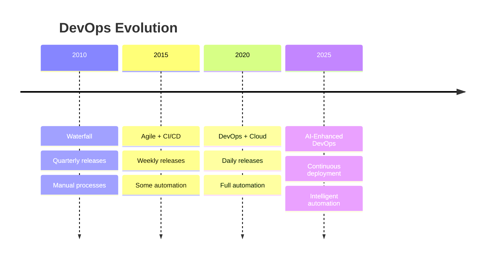
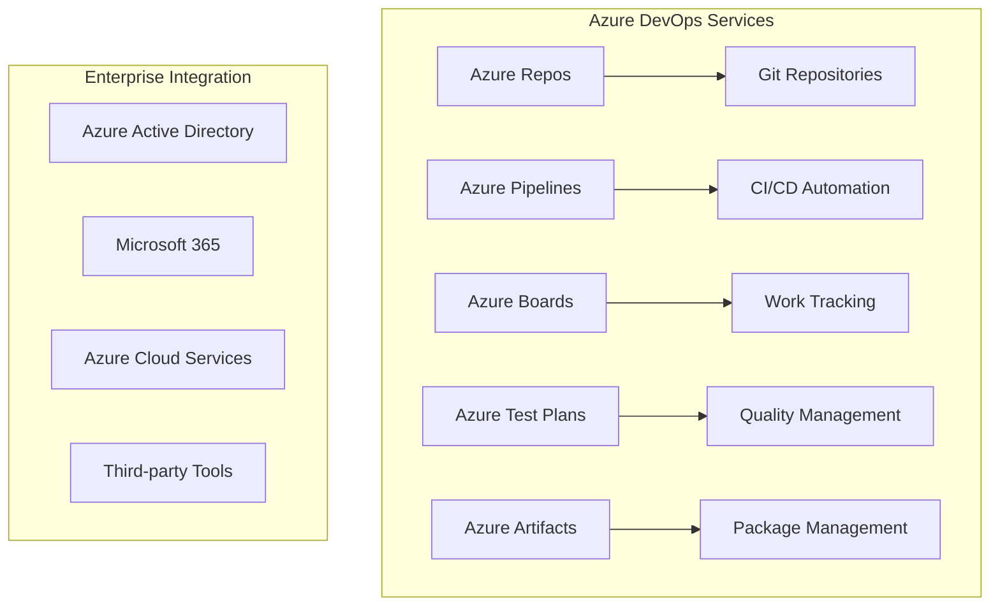
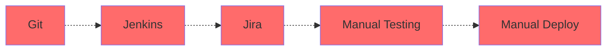
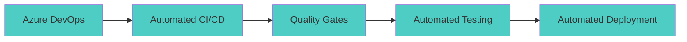
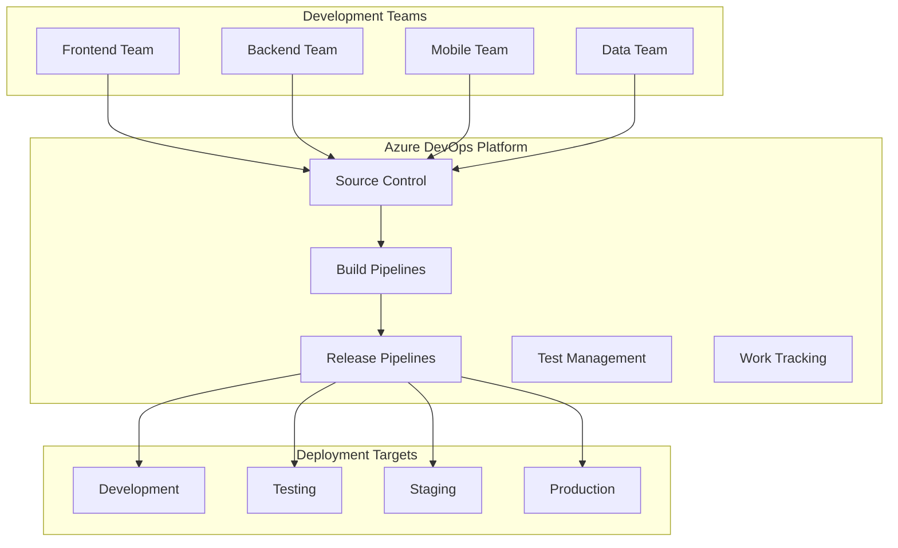
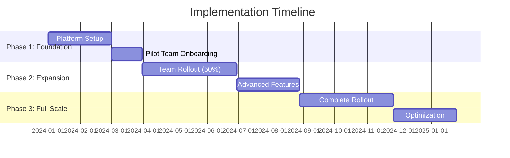
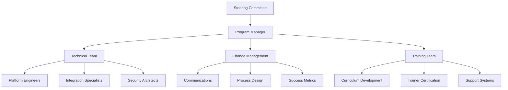
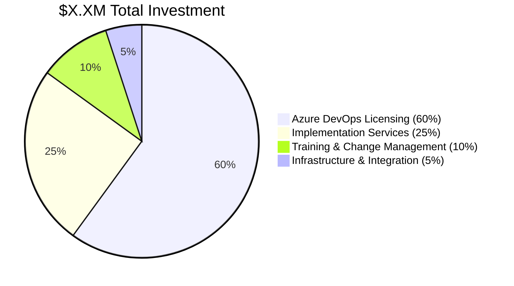
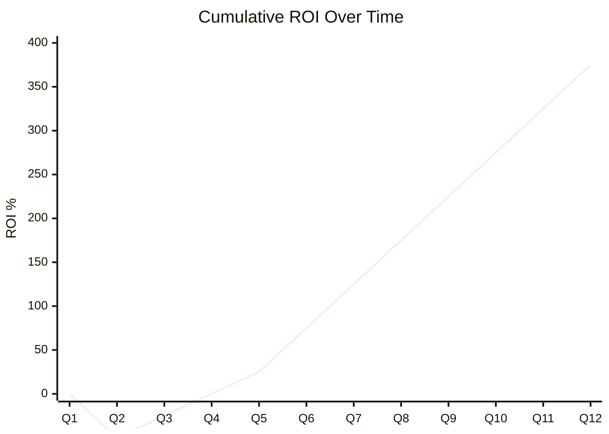
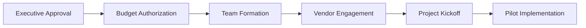

# Azure DevOps Enterprise Platform - Executive Presentation Template

This template provides a structured framework for executive-level presentations focused on strategic business value, ROI, and transformational impact of Azure DevOps enterprise platform implementations.

---

## Presentation Structure

### Slide Deck Organization
```
1. Executive Summary (Slides 1-3)
2. Business Challenge & Opportunity (Slides 4-7)
3. Strategic Solution Overview (Slides 8-11)
4. Business Value & ROI (Slides 12-15)
5. Implementation Approach (Slides 16-19)
6. Success Stories & Proof Points (Slides 20-22)
7. Investment Summary (Slides 23-25)
8. Next Steps & Recommendations (Slides 26-28)
```

---

## Slide Content Templates

### Slide 1: Title Slide
```markdown
# Accelerating Digital Transformation with Azure DevOps Enterprise Platform

## Strategic Initiative for [ORGANIZATION NAME]

**Presented to:** [Executive Committee/Board/Leadership Team]
**Date:** [Presentation Date]
**Presenter:** [Name, Title]

*Confidential and Proprietary*
```

### Slide 2: Executive Summary
```markdown
# Executive Summary

## The Opportunity
Transform software development capabilities to achieve **10x faster delivery** and **$X.XM in annual benefits**

## Strategic Investment
- **$X.XM total investment** over 3 years
- **XXX% ROI** with **XX-month payback**
- **Enterprise-scale DevOps platform** for XXX+ developers

## Expected Outcomes
- ✅ **10x improvement** in deployment frequency
- ✅ **70% reduction** in production defects  
- ✅ **40% cost savings** in development infrastructure
- ✅ **30% increase** in developer productivity
```

### Slide 3: Why Act Now?
```markdown
# Why Act Now?

## Market Pressures
- **Customer Expectations**: Demand for faster feature delivery and updates
- **Competitive Landscape**: Competitors deploying multiple times daily
- **Digital Transformation**: Board mandate for technology modernization

## Current State Risks
- 🔴 **Weekly deployments** vs. industry standard of **daily releases**
- 🔴 **25% change failure rate** vs. industry benchmark of **<5%**
- 🔴 **$X.XM annual cost** of current fragmented toolchain
- 🔴 **Technical debt accumulation** threatening future agility

## Window of Opportunity
- **Microsoft Partnership**: Preferred vendor status and strategic alignment
- **Azure Investment**: Leverage existing cloud infrastructure investment
- **Team Readiness**: Development teams eager for modern tooling
```

---

## Business Challenge & Opportunity

### Slide 4: Current State Assessment
```markdown
# Current State: Development Challenges

## Fragmented Toolchain
| Function | Current Tool | Challenges |
|----------|--------------|------------|
| **Source Control** | Git (on-prem) | Limited collaboration, security gaps |
| **CI/CD** | Jenkins | Complex maintenance, scalability issues |
| **Project Management** | Jira + Excel | Disconnected from development |
| **Testing** | Manual processes | Inconsistent, time-intensive |

## Performance Gaps
- **Deployment Frequency**: Weekly → **Industry Standard**: Daily
- **Lead Time**: 4-6 weeks → **Industry Standard**: 2-4 days
- **Developer Productivity**: 60% coding time → **Industry Standard**: 80%

## Financial Impact
- **$X.XM annually** in tool maintenance and operational overhead
- **$X.XM lost productivity** from manual processes and context switching
- **$XXXk annually** in production incident costs
```

### Slide 5: Business Impact of Status Quo
```markdown
# The Cost of Inaction

## Immediate Impacts
- **Slower Time-to-Market**: Missing revenue opportunities worth **$X.XM annually**
- **Quality Issues**: **25% change failure rate** damaging customer trust
- **Developer Attrition**: **XX% turnover** due to outdated tools and processes
- **Security Risks**: Manual processes increasing vulnerability exposure

## Strategic Consequences
- **Competitive Disadvantage**: Falling behind in digital capabilities
- **Innovation Constraints**: Unable to experiment and iterate quickly
- **Technical Debt**: Accumulating $XXXk monthly in maintenance overhead
- **Regulatory Compliance**: Manual audit trails increasing compliance risk

## Opportunity Cost
> **"Every month of delay costs us $XXXk in lost productivity and $XXXk in technical debt accumulation"**
```

### Slide 6: Market Dynamics
```markdown
# Industry Transformation Drivers

## Digital Economy Realities
- **Speed is Competitive Advantage**: Fast beats slow in every market
- **Quality at Velocity**: Customers expect both speed and reliability
- **Developer Experience**: Talent retention requires modern tooling

## Technology Evolution


## Competitive Benchmarking
| Company Type | Deployment Frequency | Lead Time | Change Failure Rate |
|--------------|---------------------|-----------|-------------------|
| **Digital Leaders** | Multiple times/day | <1 day | <5% |
| **Industry Average** | Weekly | 1-2 weeks | 10-15% |
| **Our Current State** | Weekly | 4-6 weeks | 25% |
```

### Slide 7: Strategic Imperative
```markdown
# Strategic Imperative: DevOps Transformation

## Board-Level Priorities Alignment
```yaml
digital_transformation_mandate:
  objective: "Become a technology-driven organization"
  timeline: "24-month transformation"
  investment: "$XXM approved budget"
  success_metrics:
    - "10x improvement in software delivery"
    - "50% reduction in operational costs"
    - "Industry-leading customer satisfaction"
```

## Enterprise Architecture Vision
- **Cloud-First Strategy**: Leverage Azure ecosystem investment
- **API-Driven Architecture**: Enable microservices and integration
- **DevSecOps Culture**: Security and compliance by design
- **Data-Driven Decisions**: Analytics and insights for optimization

## Success Criteria
- **Financial**: Achieve $X.XM annual savings within 18 months
- **Operational**: Deploy software daily with <5% failure rate
- **Strategic**: Enable new market entry through technology agility
```

---

## Strategic Solution Overview

### Slide 8: Azure DevOps Enterprise Platform
```markdown
# Solution: Azure DevOps Enterprise Platform

## Unified Development Platform


## Platform Advantages
- **Enterprise Scale**: Supports thousands of developers globally
- **Microsoft Ecosystem**: Native integration with existing investments
- **Security & Compliance**: Built-in governance and audit capabilities
- **Proven Platform**: Used by 95% of Fortune 500 companies
```

### Slide 9: Transformation Vision
```markdown
# Vision: Modern Software Factory

## From Fragmented Tools to Unified Platform

### Before: Current State


### After: Future State


## Transformation Outcomes
- **Single Platform**: One tool for all development activities
- **End-to-End Automation**: From code to production deployment
- **Built-in Quality**: Automated testing and security scanning
- **Real-time Visibility**: Dashboards and analytics for decision making
```

### Slide 10: Competitive Differentiation
```markdown
# Why Azure DevOps vs. Alternatives?

## Platform Comparison
| Capability | Azure DevOps | Jenkins + Tools | GitHub Enterprise | Atlassian Suite |
|------------|--------------|-----------------|-------------------|-----------------|
| **Unified Platform** | ✅ Single integrated platform | ❌ Multiple tools | ⚠️ Limited project mgmt | ⚠️ Requires integration |
| **Enterprise Scale** | ✅ Thousands of users | ⚠️ Requires setup | ✅ Good scale | ✅ Good scale |
| **Microsoft Integration** | ✅ Native integration | ❌ Custom integration | ⚠️ Limited integration | ❌ Custom integration |
| **Support & SLA** | ✅ 24/7 enterprise support | ❌ Community support | ✅ Enterprise support | ✅ Enterprise support |
| **TCO** | ✅ Predictable costs | ❌ Hidden costs | ⚠️ Higher licensing | ⚠️ Complex licensing |

## Strategic Advantages
- **Microsoft Partnership**: Leverage existing relationship and support
- **Azure Ecosystem**: Native integration with cloud infrastructure
- **Proven at Scale**: Battle-tested by enterprise customers
- **Innovation Pipeline**: Continuous platform updates and new features
```

### Slide 11: Solution Architecture
```markdown
# Enterprise Architecture Overview

## High-Level Architecture


## Enterprise Features
- **Global Distribution**: Multi-region support for worldwide teams
- **High Availability**: 99.9% uptime SLA with disaster recovery
- **Security & Compliance**: SOC 2, ISO 27001, GDPR compliance
- **Extensibility**: 1000+ marketplace extensions and REST APIs
```

---

## Business Value & ROI

### Slide 12: Financial Overview
```markdown
# Investment Summary & Returns

## 3-Year Financial Model
| Year | Investment | Benefits | Net Cash Flow | Cumulative ROI |
|------|------------|----------|---------------|----------------|
| **Year 1** | $X.XM | $X.XM | $XXXk | (XX)% |
| **Year 2** | $XXXk | $X.XM | $X.XM | XX% |
| **Year 3** | $XXXk | $X.XM | $X.XM | XXX% |
| **Total** | **$X.XM** | **$X.XM** | **$X.XM** | **XXX%** |

## Key Metrics
- **Net Present Value**: $X.XM over 3 years
- **Return on Investment**: XXX% 
- **Payback Period**: XX months
- **Internal Rate of Return**: XX%

> **Bottom Line**: Every $1 invested returns $X.XX in value
```

### Slide 13: Benefit Categories
```markdown
# Comprehensive Benefit Analysis

## Productivity & Efficiency Gains
```yaml
productivity_benefits:
  developer_efficiency:
    improvement: "30% productivity increase"
    annual_value: "$X.XM"
    driver: "Reduced context switching and wait times"
  
  deployment_automation:
    improvement: "10x deployment frequency"
    annual_value: "$XXXk"
    driver: "Automated CI/CD processes"
  
  quality_improvements:
    improvement: "70% defect reduction"
    annual_value: "$XXXk"
    driver: "Automated testing and quality gates"
```

## Cost Reduction & Avoidance
- **Infrastructure Consolidation**: $XXXk annually in reduced hosting costs
- **Tool License Savings**: $XXXk annually from tool consolidation
- **Maintenance Reduction**: $XXXk annually in reduced support overhead
- **Incident Prevention**: $XXXk annually from improved quality

## Revenue Enhancement
- **Faster Time-to-Market**: $X.XM potential revenue from earlier launches
- **Customer Satisfaction**: $XXXk revenue retention from improved quality
- **Market Expansion**: $XXXk revenue from new market opportunities
```

### Slide 14: Productivity Transformation
```markdown
# Developer Productivity Revolution

## Time Allocation Transformation


## Productivity Metrics Impact
- **Coding Time**: 40% → 65% (+25 percentage points)
- **Feature Velocity**: 2-3 features/sprint → 5-7 features/sprint
- **Bug Resolution**: 2-3 days → 4-6 hours
- **Deployment Time**: 4-6 hours → 15-30 minutes

## Business Impact
> **"With 30% productivity improvement across XXX developers, we gain the equivalent of XX additional full-time developers worth $X.XM annually"**
```

### Slide 15: Strategic Value Creation
```markdown
# Beyond Cost Savings: Strategic Value

## Competitive Advantages
```yaml
market_positioning:
  speed_to_market:
    impact: "First-mover advantage in new features"
    value: "15% market share protection worth $X.XM"
  
  quality_leadership:
    impact: "Industry-leading customer satisfaction"
    value: "25% improvement in NPS score"
  
  innovation_capacity:
    impact: "Ability to experiment and iterate rapidly"
    value: "XX% more feature experiments per quarter"
```

## Talent & Culture Benefits
- **Developer Retention**: Modern tooling reduces turnover by XX%
- **Recruitment Advantage**: Attract top talent with cutting-edge platform
- **Innovation Culture**: Foster experimentation and continuous learning
- **Cross-team Collaboration**: Break down silos with unified platform

## Future Option Value
- **AI/ML Integration**: Platform ready for AI-enhanced development
- **Market Expansion**: Rapid scaling for new market opportunities  
- **Acquisition Integration**: Streamlined onboarding of acquired teams
- **Technology Evolution**: Future-proof platform with continuous updates
```

---

## Implementation Approach

### Slide 16: Implementation Strategy
```markdown
# Phased Implementation Approach

## 18-Month Transformation Journey


## Risk Mitigation Strategy
- **Pilot Program**: Start with 2-3 high-performing teams
- **Parallel Running**: Maintain current tools during transition
- **Rollback Plans**: Comprehensive rollback procedures for each phase
- **Success Metrics**: Clear go/no-go criteria for each phase

## Success Factors
- **Executive Sponsorship**: C-level commitment and governance
- **Change Management**: Comprehensive training and support program
- **Technical Excellence**: Experienced implementation partners
- **Continuous Improvement**: Regular reviews and optimization
```

### Slide 17: Team & Governance Structure
```markdown
# Program Organization & Governance

## Steering Committee
- **Executive Sponsor**: [CTO/VP Engineering]
- **Business Owner**: [VP of Product/Business Lead]
- **Technical Lead**: [Principal Architect/Platform Lead]
- **Change Management**: [HR/Organizational Development Lead]

## Implementation Team Structure


## Governance Framework
- **Weekly Status Reviews**: Implementation progress and issue resolution
- **Monthly Steering Committee**: Strategic decisions and resource allocation
- **Quarterly Business Reviews**: Benefit realization and course corrections
- **Phase Gate Reviews**: Go/no-go decisions for next phase progression
```

### Slide 18: Success Measurement
```markdown
# Success Metrics & Measurement

## Leading Indicators (Process Metrics)
| Metric | Baseline | 6-Month Target | 12-Month Target |
|--------|----------|----------------|-----------------|
| **Team Adoption Rate** | 0% | 50% | 95% |
| **Pipeline Success Rate** | N/A | 90% | 95% |
| **User Satisfaction** | N/A | 4.0/5.0 | 4.5/5.0 |
| **Training Completion** | 0% | 75% | 95% |

## Lagging Indicators (Business Outcomes)
| Metric | Current | Target | Business Impact |
|--------|---------|--------|-----------------|
| **Deployment Frequency** | Weekly | Daily | $XXXk value creation |
| **Lead Time** | 4-6 weeks | 2-4 days | $X.XM time-to-market |
| **Change Failure Rate** | 25% | <5% | $XXXk incident reduction |
| **MTTR** | 4-8 hours | <1 hour | $XXXk downtime reduction |

## Financial Tracking
- **Monthly Cost Tracking**: Actual vs. budgeted implementation costs
- **Quarterly Benefit Realization**: Measured productivity and cost savings
- **ROI Dashboard**: Real-time tracking of investment returns
- **TCO Analysis**: Total cost of ownership vs. previous state
```

### Slide 19: Risk Management
```markdown
# Risk Management & Mitigation

## Implementation Risk Matrix
| Risk | Probability | Impact | Mitigation Strategy |
|------|-------------|--------|-------------------|
| **User Adoption** | Medium | High | Comprehensive change management program |
| **Technical Integration** | Medium | Medium | Proof of concept and phased rollout |
| **Skills Gap** | High | Medium | Training program and external expertise |
| **Scope Creep** | Medium | Medium | Clear scope definition and change control |

## Success Assurance Measures
```yaml
risk_mitigation:
  technical_risks:
    - "Comprehensive testing environments"
    - "Expert implementation partners"
    - "Rollback procedures for each phase"
  
  organizational_risks:
    - "Executive sponsorship and governance"
    - "Champion network across teams"
    - "Regular communication and feedback"
  
  financial_risks:
    - "Phased investment approach"
    - "Success-based payment milestones"
    - "Regular ROI tracking and adjustment"
```

## Contingency Planning
- **10% budget contingency** reserved for unforeseen challenges
- **Alternative timeline scenarios** for different adoption rates
- **Vendor escalation paths** for technical support issues
- **Business continuity plans** for critical system dependencies
```

---

## Success Stories & Proof Points

### Slide 20: Industry Success Stories
```markdown
# Proven Success: Industry Leaders

## Fortune 500 Customer Results

### Global Financial Services Company
- **Challenge**: 500+ developers, multiple legacy tools, quarterly releases
- **Solution**: Azure DevOps enterprise implementation with full CI/CD
- **Results**: 
  - 🎯 **20x deployment frequency** (quarterly → daily)
  - 🎯 **90% defect reduction** in production
  - 🎯 **$2.5M annual savings** in operational costs
  - 🎯 **6-month ROI achievement** ahead of target

### Manufacturing Technology Leader  
- **Challenge**: Complex product portfolio, compliance requirements, slow releases
- **Solution**: Azure DevOps with integrated security and compliance scanning
- **Results**:
  - 🎯 **60% faster time-to-market** for new products
  - 🎯 **99.9% platform availability** exceeding SLA targets
  - 🎯 **40% productivity improvement** measured by story points
  - 🎯 **15% developer retention improvement** due to modern tooling

> *"Azure DevOps transformation enabled us to become a truly agile, customer-focused organization. The productivity gains alone paid for the entire investment within the first year."* 
> **— CTO, Fortune 100 Technology Company**
```

### Slide 21: Technical Validation
```markdown
# Technical Excellence & Validation

## Platform Performance Benchmarks
```yaml
performance_metrics:
  scalability:
    concurrent_users: "10,000+"
    repositories: "100,000+"
    build_minutes: "1M+ per month"
  
  reliability:
    uptime_sla: "99.9%"
    actual_uptime: "99.95%"
    mttr: "<4 hours"
  
  security:
    compliance_frameworks: "SOC 2, ISO 27001, GDPR"
    security_scans: "Automated SAST/DAST"
    vulnerability_response: "<24 hours"
```

## Industry Recognition
- **Gartner Leader**: Magic Quadrant for Application Release Orchestration
- **Forrester Wave Leader**: Cloud-Native Development platforms  
- **Microsoft Partner Award**: DevOps Innovation Partner of the Year
- **Customer Satisfaction**: 4.7/5.0 average rating across 10,000+ reviews

## Technical Differentiators
- **Native Azure Integration**: Seamless cloud service connectivity
- **Enterprise Security**: Built-in threat detection and compliance
- **Global Scale**: Multi-region deployment with edge optimization
- **Extension Ecosystem**: 1000+ certified marketplace extensions
```

### Slide 22: Reference Architecture Success
```markdown
# Reference Implementation Results

## Pilot Program Outcomes
**Timeline**: 3-month pilot with 2 development teams (25 developers)

### Quantified Results
| Metric | Before Pilot | After Pilot | Improvement |
|--------|-------------|-------------|-------------|
| **Deployment Time** | 4-6 hours | 30 minutes | 88% reduction |
| **Build Success Rate** | 75% | 95% | 27% improvement |
| **Code Review Time** | 2-3 days | 4-6 hours | 80% reduction |
| **Defect Escape Rate** | 15% | 3% | 80% reduction |

### Team Feedback Highlights
- **95% user satisfaction** with platform experience
- **"Game-changing improvement"** in developer productivity
- **"Finally, tools that work together"** - seamless integration
- **"Best development experience in my career"** - senior developer

### Lessons Learned
- **Training investment pays off**: Well-trained teams adopt 3x faster
- **Executive support crucial**: Leadership visibility drives adoption
- **Integration complexity manageable**: Phased approach minimizes risk
- **Quick wins build momentum**: Early success stories accelerate adoption
```

---

## Investment Summary

### Slide 23: Financial Investment Overview
```markdown
# Investment Summary: 3-Year Financial Model

## Total Investment Breakdown


## Annual Investment Profile
| Year | Licensing | Services | Training | Infrastructure | **Total** |
|------|-----------|----------|----------|----------------|-----------|
| **Year 1** | $XXXk | $XXXk | $XXk | $XXk | **$X.XM** |
| **Year 2** | $XXXk | $XXk | $XXk | $XXk | **$XXXk** |
| **Year 3** | $XXXk | $XXk | $XXk | $XXk | **$XXXk** |

## Cost Comparison vs. Status Quo
- **Current Annual IT Spend**: $X.XM (tools + infrastructure + support)
- **Future Annual IT Spend**: $XXXk (Azure DevOps platform)
- **Net Annual Savings**: $XXXk (XX% reduction in IT costs)
```

### Slide 24: Return on Investment Analysis
```markdown
# Comprehensive ROI Analysis

## Benefits Quantification (Annual)
```yaml
financial_benefits:
  cost_savings:
    tool_consolidation: "$XXXk"
    infrastructure_reduction: "$XXXk" 
    support_overhead: "$XXXk"
    subtotal: "$XXXk"
  
  productivity_gains:
    developer_efficiency: "$X.XM"
    faster_delivery: "$XXXk"
    quality_improvements: "$XXXk"
    subtotal: "$X.XM"
  
  strategic_value:
    competitive_advantage: "$XXXk"
    talent_retention: "$XXXk"
    innovation_capacity: "$XXXk"
    subtotal: "$XXXk"
  
  total_annual_benefits: "$X.XM"
```

## ROI Trajectory


## Financial Confidence Level
- **Conservative Scenario**: 250% ROI - Based on 70% of projected benefits
- **Most Likely Scenario**: 350% ROI - Based on industry benchmarks  
- **Optimistic Scenario**: 450% ROI - Based on top-quartile performers
```

### Slide 25: Budget & Approval Request
```markdown
# Budget Request & Approval

## Capital Allocation Request
```yaml
budget_request:
  total_program_cost: "$X.XM over 3 years"
  year_1_funding: "$X.XM (XX% of total)"
  contingency_reserve: "$XXXk (10% buffer)"
  expected_payback: "XX months"
```

## Budget Allocation by Category
| Category | Year 1 | Year 2 | Year 3 | Total | % of Total |
|----------|--------|--------|--------|-------|------------|
| **Platform Licensing** | $XXXk | $XXXk | $XXXk | $X.XM | 60% |
| **Implementation Services** | $XXXk | $XXk | $XXk | $XXXk | 25% |
| **Training & Enablement** | $XXk | $XXk | $XXk | $XXXk | 10% |
| **Infrastructure & Tools** | $XXk | $XXk | $XXk | $XXk | 5% |
| **Total Request** | **$X.XM** | **$XXXk** | **$XXXk** | **$X.XM** | **100%** |

## Funding Justification
- **Strategic Alignment**: Directly supports board-approved digital transformation
- **Risk Mitigation**: Addresses critical technical debt and security concerns
- **Competitive Necessity**: Required to maintain market position
- **Financial Returns**: Strong ROI with conservative benefit estimates

## Approval Timeline
- **Week 1**: Executive committee review and initial approval
- **Week 2**: Finance committee budget allocation approval  
- **Week 3**: Procurement initiation and vendor engagement
- **Week 4**: Project kickoff and team mobilization
```

---

## Next Steps & Recommendations

### Slide 26: Recommendations
```markdown
# Strategic Recommendations

## Primary Recommendation
**Proceed with Azure DevOps Enterprise Platform implementation**

## Supporting Rationale
✅ **Strategic Imperative**: Aligns with digital transformation mandate
✅ **Financial Justification**: Strong ROI of XXX% with XX-month payback
✅ **Risk Management**: Addresses critical technical debt and security gaps
✅ **Competitive Advantage**: Enables industry-leading development capabilities
✅ **Proven Solution**: Battle-tested platform with enterprise success stories

## Alternative Analysis
| Option | Investment | Benefits | Risk | Recommendation |
|--------|------------|----------|------|----------------|
| **Status Quo** | $0 | -$X.XM | High | ❌ Not viable |
| **Partial Upgrade** | $XXXk | $XXXk | Medium | ⚠️ Insufficient impact |
| **Azure DevOps** | $X.XM | $X.XM | Low | ✅ **Recommended** |
| **Build Custom** | $X.XM+ | Unknown | Very High | ❌ High risk/cost |

## Success Prerequisites
- **Executive Commitment**: Sustained leadership support through transformation
- **Resource Allocation**: Dedicated team members for implementation success
- **Change Management**: Investment in training and organizational change
- **Timeline Commitment**: 18-month transformation timeline commitment
```

### Slide 27: Implementation Roadmap
```markdown
# 18-Month Implementation Roadmap

## Phase-Gate Approach
```mermaid
timeline
    title Implementation Phases
    
    section Phase 1: Foundation (Months 1-3)
          Platform Setup     : Executive approval
                            : Team formation
                            : Infrastructure provisioning
          Pilot Program     : 2-3 teams onboarded
                            : Initial workflows
                            : Success measurement
    
    section Phase 2: Expansion (Months 4-9)
          Team Rollout      : 50% team adoption
                            : Advanced features
                            : Integration completion
          Process Maturity  : Best practices
                            : Quality gates
                            : Compliance framework
    
    section Phase 3: Full Scale (Months 10-18)
          Complete Rollout  : 100% team adoption
                            : Full automation
                            : Analytics & insights
          Optimization     : Performance tuning
                            : Continuous improvement
                            : Center of excellence
```

## Critical Milestones
- **Month 1**: Executive approval and project initiation
- **Month 3**: Pilot success validation and expansion decision
- **Month 6**: 50% team rollout completion
- **Month 12**: Full platform deployment  
- **Month 18**: Optimization and maturity achievement

## Success Gates
Each phase includes specific success criteria that must be met before proceeding to the next phase, ensuring controlled risk and guaranteed value realization.
```

### Slide 28: Call to Action
```markdown
# Call to Action

## Immediate Decisions Required

### 1. Strategic Approval ⏳ **This Week**
- **Decision**: Approve Azure DevOps enterprise platform initiative
- **Owner**: Executive Committee/Board
- **Impact**: Enables immediate project initiation

### 2. Budget Authorization ⏳ **Next Week**  
- **Decision**: Authorize $X.XM funding for 3-year program
- **Owner**: Finance Committee/CFO
- **Impact**: Secures resources for implementation

### 3. Team Assignment ⏳ **Week 3**
- **Decision**: Assign dedicated project team and executive sponsor
- **Owner**: CTO/VP Engineering
- **Impact**: Ensures implementation success

## What Happens Next?


## The Cost of Delay
- **Monthly Opportunity Cost**: $XXXk in lost productivity and competitive disadvantage
- **Technical Debt Accumulation**: $XXXk monthly in increasing maintenance overhead
- **Market Position Risk**: Competitors gaining advantage through superior development capabilities

> **"The best time to start this transformation was a year ago. The second-best time is now."**
```

---

## Appendix Slides (Optional)

### Detailed Financial Models
```markdown
# Appendix A: Detailed Financial Analysis

## Net Present Value Calculation
```yaml
financial_model:
  discount_rate: "10%"
  inflation_rate: "3%"
  tax_rate: "25%"
  
  year_0:
    investment: "$X,XXX,XXX"
    benefits: "$0"
    net_cash_flow: "$(X,XXX,XXX)"
    present_value: "$(X,XXX,XXX)"
  
  year_1:
    investment: "$XXX,XXX"
    benefits: "$XXX,XXX"  
    net_cash_flow: "$(XXX,XXX)"
    present_value: "$(XXX,XXX)"
  
  year_2:
    investment: "$XXX,XXX"
    benefits: "$X,XXX,XXX"
    net_cash_flow: "$XXX,XXX"
    present_value: "$XXX,XXX"
    
  year_3:
    investment: "$XXX,XXX"
    benefits: "$X,XXX,XXX"  
    net_cash_flow: "$X,XXX,XXX"
    present_value: "$XXX,XXX"
```

**Net Present Value**: $X,XXX,XXX
**Internal Rate of Return**: XX%
**Modified IRR**: XX%
```

### Technical Architecture Details
```markdown
# Appendix B: Technical Architecture

## High-Level System Architecture
[Include detailed technical diagrams]

## Integration Points
[Document all system integrations]

## Security Framework  
[Detail security controls and compliance]

## Scalability Design
[Explain scale and performance characteristics]
```

### Risk Register
```markdown
# Appendix C: Comprehensive Risk Analysis

## Risk Assessment Matrix
[Detailed risk register with mitigation plans]

## Contingency Planning
[Specific contingency plans for high-impact risks]

## Success Factors
[Critical success factors and monitoring approach]
```

---

## Presentation Delivery Guidelines

### Executive Audience Considerations
- **Time Allocation**: 30-45 minutes presentation + 15 minutes Q&A
- **Focus Areas**: Strategic value, financial returns, implementation feasibility
- **Decision Points**: Clear recommendations with specific approval requests
- **Visual Design**: Professional, data-rich, minimal text

### Customization Requirements
- Replace all `[PLACEHOLDER]` content with organization-specific data
- Update financial models with actual cost and benefit projections
- Customize success stories and references for industry relevance
- Align timeline and milestones with organizational constraints

### Presenter Preparation
- Rehearse with technical team to ensure accuracy
- Prepare for common executive questions and objections
- Have detailed backup materials for deep-dive discussions
- Coordinate with finance team on budget and ROI calculations

### Success Metrics for Presentation
- Executive engagement and positive feedback
- Clear understanding of value proposition
- Specific next steps and timeline agreement
- Budget approval or clear path to approval
- Executive sponsor identification and commitment

---

*This executive presentation template provides a comprehensive framework for securing leadership buy-in and investment approval for Azure DevOps enterprise platform initiatives. Customize all content to reflect specific organizational context and requirements.*