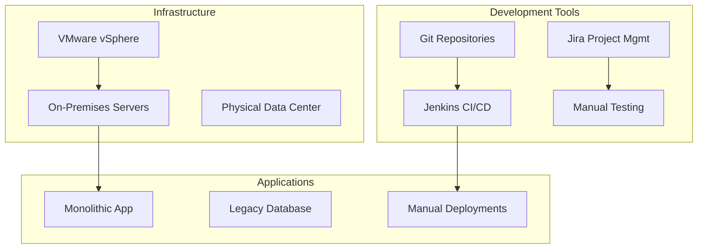
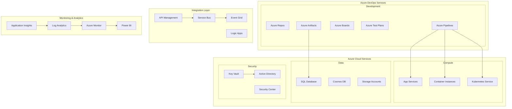
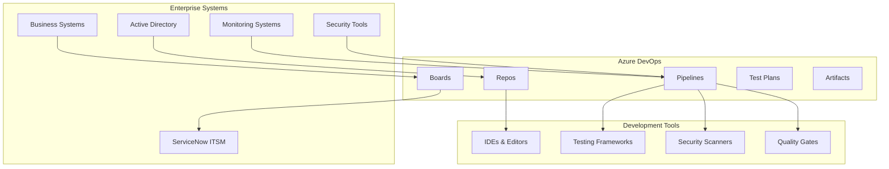
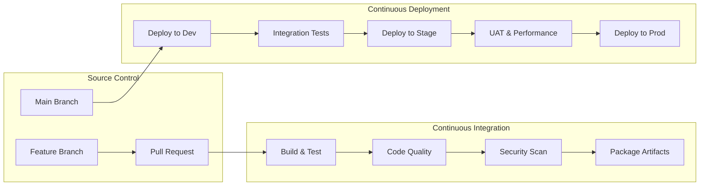
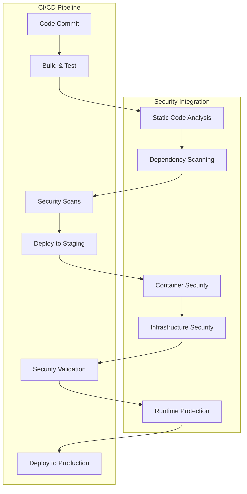
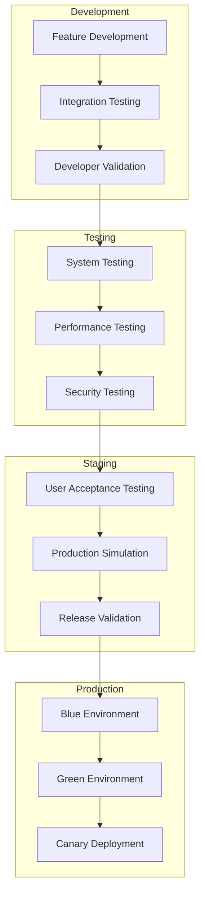

# Azure DevOps Enterprise Platform - Solution Design Template

This template provides a comprehensive framework for designing technical solutions for Azure DevOps enterprise platform implementations, covering architecture, integration patterns, security design, and deployment strategies.

## Solution Design Overview

### Purpose
- Define comprehensive technical architecture for Azure DevOps implementation
- Specify integration patterns and data flows
- Document security and compliance design
- Establish deployment and operational strategies
- Provide blueprint for implementation teams

### Design Principles
```yaml
design_principles:
  architectural:
    - "Cloud-first with hybrid capabilities"
    - "Microservices-oriented integration"
    - "Event-driven automation workflows"
    - "API-first design for extensibility"
  
  security:
    - "Zero-trust security model"
    - "Defense in depth approach"
    - "Least privilege access control"
    - "Continuous security monitoring"
  
  operational:
    - "Infrastructure as code"
    - "Immutable deployments"
    - "Observability by design"
    - "Self-healing systems"
  
  business:
    - "Business value optimization"
    - "User experience focus"
    - "Scalability and performance"
    - "Cost optimization"
```

---

## Executive Summary

### Solution Overview

**Organization**: [CLIENT_ORGANIZATION]
**Project**: Azure DevOps Enterprise Platform Implementation
**Solution Architect**: [ARCHITECT_NAME]
**Date**: [DESIGN_DATE]

#### Business Drivers
- Accelerate software delivery from [CURRENT_FREQUENCY] to [TARGET_FREQUENCY]
- Improve developer productivity by [PRODUCTIVITY_IMPROVEMENT]%
- Reduce operational costs by $[COST_REDUCTION] annually
- Enhance security posture and compliance automation

#### Technical Scope
- **Users**: [USER_COUNT] developers across [TEAM_COUNT] teams
- **Applications**: [APPLICATION_COUNT] applications and [SERVICE_COUNT] microservices
- **Repositories**: [REPOSITORY_COUNT] source repositories
- **Environments**: Development, Testing, Staging, Production
- **Integrations**: [INTEGRATION_COUNT] enterprise system integrations

#### Key Outcomes
```yaml
expected_outcomes:
  performance_improvements:
    - "10x deployment frequency increase"
    - "80% lead time reduction"
    - "95% deployment success rate"
    - "Sub-hour mean time to recovery"
  
  business_benefits:
    - "$[PRODUCTIVITY_VALUE] annual productivity gain"
    - "$[COST_SAVINGS] operational cost reduction"
    - "[QUALITY_IMPROVEMENT]% defect reduction"
    - "[TTM_IMPROVEMENT]% faster time-to-market"
```

---

## Current State Architecture

### Existing Technology Landscape

#### Current Development Toolchain


#### Current State Challenges
```yaml
challenges:
  technical:
    - "Fragmented toolchain with limited integration"
    - "Manual deployment processes prone to errors"
    - "Limited scalability and performance"
    - "Inconsistent environments and configurations"
  
  operational:
    - "High maintenance overhead for infrastructure"
    - "Manual monitoring and alerting"
    - "Limited visibility into development pipeline"
    - "Inconsistent security and compliance"
  
  business:
    - "Slow feature delivery and market response"
    - "High operational costs and inefficiencies"
    - "Quality issues and customer impact"
    - "Developer productivity constraints"
```

#### Current State Metrics
```yaml
baseline_metrics:
  performance:
    deployment_frequency: "[CURRENT_DEPLOYMENT_FREQ]"
    lead_time: "[CURRENT_LEAD_TIME] days"
    change_failure_rate: "[CURRENT_FAILURE_RATE]%"
    mean_time_to_recovery: "[CURRENT_MTTR] hours"
  
  productivity:
    developer_coding_time: "[CURRENT_CODING_TIME]%"
    manual_effort_hours: "[MANUAL_HOURS] hours/month"
    context_switching_time: "[SWITCHING_TIME] minutes/day"
  
  costs:
    infrastructure_costs: "$[INFRA_COSTS]/month"
    tool_licensing: "$[TOOL_COSTS]/year"
    operational_overhead: "$[OPS_COSTS]/year"
```

---

## Future State Architecture

### Target Architecture Overview

#### High-Level Solution Architecture


#### Azure DevOps Service Configuration
```yaml
azure_devops_configuration:
  organization:
    name: "[ORG_NAME]-devops"
    region: "[AZURE_REGION]"
    security_policies:
      - "Require 2FA for all users"
      - "Enforce conditional access policies"
      - "Enable audit logging"
      - "Restrict anonymous access"
  
  projects:
    enterprise_platform:
      work_item_process: "Custom Agile"
      repositories: "[REPO_COUNT] Git repositories"
      pipelines: "[PIPELINE_COUNT] CI/CD pipelines"
      environments: "Dev, Test, Stage, Prod"
      
    microservices_platform:
      work_item_process: "Custom Scrum"
      repositories: "[MS_REPO_COUNT] service repositories"
      pipelines: "[MS_PIPELINE_COUNT] service pipelines"
      environments: "Dev, Test, Stage, Prod"
```

#### Integration Architecture


---

## Technical Architecture Design

### Platform Components

#### Azure DevOps Services Configuration
```yaml
platform_configuration:
  azure_repos:
    repository_structure:
      - "Monorepo for shared libraries"
      - "Service-specific repositories for microservices"
      - "Infrastructure as code repositories"
      - "Documentation and policy repositories"
    
    branch_policies:
      main_branch:
        - "Minimum 2 reviewers required"
        - "Require successful CI build"
        - "Enforce work item linking"
        - "Reset votes on source push"
      
      feature_branches:
        - "Minimum 1 reviewer required"
        - "Require successful build"
        - "Optional work item linking"
  
  azure_pipelines:
    build_agents:
      microsoft_hosted: "[MS_HOSTED_COUNT] parallel jobs"
      self_hosted: "[SELF_HOSTED_COUNT] agent pools"
      
    pipeline_templates:
      - "Standardized CI/CD templates"
      - "Security scanning integration"
      - "Quality gate enforcement"
      - "Deployment automation"
      
    environments:
      development:
        approvals: "None"
        checks: "Automated testing"
        deployment_strategy: "Rolling update"
        
      staging:
        approvals: "QA team approval"
        checks: "Security scan + performance test"
        deployment_strategy: "Blue-green"
        
      production:
        approvals: "Release manager + security team"
        checks: "All quality gates + manual approval"
        deployment_strategy: "Canary deployment"
```

#### Infrastructure as Code Design
```yaml
infrastructure_design:
  terraform_modules:
    networking:
      - "Virtual networks and subnets"
      - "Network security groups"
      - "Load balancers and traffic managers"
      - "VPN and ExpressRoute connectivity"
    
    compute:
      - "App Service plans and web apps"
      - "Container registry and instances"  
      - "Virtual machine scale sets"
      - "Kubernetes clusters"
    
    data:
      - "SQL databases and elastic pools"
      - "Storage accounts and blob containers"
      - "Cosmos DB instances"
      - "Data factory pipelines"
    
    security:
      - "Key vaults and certificates"
      - "Managed identities"
      - "Role-based access control"
      - "Security policies and compliance"
```

### CI/CD Pipeline Design

#### Pipeline Architecture


#### Pipeline Configuration Templates
```yaml
ci_pipeline_template:
  trigger:
    branches: ["main", "develop", "feature/*"]
    paths: 
      include: ["src/**", "tests/**"]
      exclude: ["docs/**", "*.md"]
  
  variables:
    - group: "Build-Variables"
    - name: "BuildConfiguration"
      value: "Release"
  
  stages:
    - stage: "Build"
      jobs:
        - job: "Build_and_Test"
          steps:
            - task: "DotNetCoreCLI@2"
              displayName: "Restore packages"
            - task: "DotNetCoreCLI@2"
              displayName: "Build solution"
            - task: "DotNetCoreCLI@2"
              displayName: "Run unit tests"
            - task: "SonarCloudAnalyze@1"
              displayName: "Code quality analysis"
            - task: "WhiteSource@21"
              displayName: "Security vulnerability scan"
            - task: "PublishPipelineArtifact@1"
              displayName: "Publish build artifacts"
```

#### Quality Gates and Approvals
```yaml
quality_gates:
  automated_gates:
    code_coverage: "> 80%"
    unit_test_pass_rate: "100%"
    security_scan: "No high/critical vulnerabilities"
    code_quality: "SonarQube quality gate passed"
    performance_test: "Response time < 2 seconds"
  
  manual_approvals:
    staging_deployment:
      approvers: ["QA Lead", "Product Manager"]
      timeout: "24 hours"
      instructions: "Verify all acceptance criteria met"
    
    production_deployment:
      approvers: ["Release Manager", "Security Lead"]
      timeout: "4 hours"
      instructions: "Confirm production readiness checklist"
```

### Microservices Architecture Support

#### Service-Oriented Pipeline Design
```yaml
microservices_support:
  service_discovery:
    - "Automated service registration"
    - "Health check integration"
    - "Load balancer configuration"
    - "Service mesh integration"
  
  deployment_strategies:
    canary_deployment:
      initial_percentage: "10%"
      increment_percentage: "20%"
      success_criteria: "Error rate < 0.1%"
      rollback_threshold: "Error rate > 1%"
    
    blue_green_deployment:
      warm_up_time: "5 minutes"
      validation_tests: "Health checks + smoke tests"
      traffic_switch: "Instant cutover"
      rollback_capability: "Instant rollback"
  
  monitoring_integration:
    - "Distributed tracing (Application Insights)"
    - "Service-level metrics collection"
    - "Automated alerting and notifications"
    - "Dashboard creation and maintenance"
```

---

## Security and Compliance Design

### Security Architecture

#### Zero Trust Security Model
```yaml
zero_trust_implementation:
  identity_and_access:
    azure_ad_integration:
      - "Single sign-on (SSO) configuration"
      - "Multi-factor authentication (MFA)"
      - "Conditional access policies"
      - "Privileged identity management (PIM)"
    
    role_based_access:
      - "Least privilege access control"
      - "Just-in-time (JIT) access"
      - "Regular access reviews"
      - "Automated access provisioning"
  
  network_security:
    - "Virtual network isolation"
    - "Network security groups"
    - "Private endpoints for services"
    - "Web application firewall"
  
  data_protection:
    - "Encryption at rest and in transit"
    - "Azure Key Vault for secrets"
    - "Managed identity for service authentication"
    - "Data loss prevention (DLP) policies"
```

#### DevSecOps Integration


#### Compliance Framework
```yaml
compliance_design:
  frameworks:
    sox_compliance:
      - "Segregation of duties enforcement"
      - "Audit trail for all changes"
      - "Automated compliance reporting"
      - "Change approval workflows"
    
    iso_27001:
      - "Information security management"
      - "Risk assessment processes"
      - "Security incident response"
      - "Continuous monitoring"
    
    gdpr_compliance:
      - "Data privacy by design"
      - "Personal data inventory"
      - "Consent management"
      - "Data breach notification"
  
  automated_controls:
    - "Policy as code implementation"
    - "Continuous compliance monitoring"
    - "Automated remediation"
    - "Compliance dashboard and reporting"
```

### Secret Management Strategy

#### Azure Key Vault Integration
```yaml
secret_management:
  key_vault_configuration:
    access_policies:
      - "Service principal access for pipelines"
      - "Managed identity for applications"
      - "Developer access for debugging"
      - "Audit logging for all access"
    
    secret_types:
      application_secrets:
        - "Database connection strings"
        - "API keys and tokens"
        - "Third-party service credentials"
        - "Encryption keys"
      
      infrastructure_secrets:
        - "Service principal credentials"
        - "Certificate private keys"
        - "SSH keys for agents"
        - "Registry credentials"
  
  secret_rotation:
    automated_rotation:
      - "30-day rotation for high-privilege secrets"
      - "90-day rotation for application secrets"
      - "Annual rotation for certificates"
      - "Pipeline integration for seamless updates"
```

---

## Integration Architecture

### Enterprise System Integrations

#### Identity and Authentication
```yaml
identity_integration:
  azure_active_directory:
    synchronization:
      - "Azure AD Connect for hybrid identity"
      - "User and group synchronization"
      - "Seamless single sign-on"
      - "Password hash synchronization"
    
    conditional_access:
      - "Device-based access policies"
      - "Location-based restrictions"
      - "Risk-based authentication"
      - "Application-specific policies"
  
  federation_setup:
    - "SAML 2.0 identity provider"
    - "OAuth 2.0 / OpenID Connect"
    - "Claims-based authorization"
    - "Multi-tenant support"
```

#### ITSM Integration (ServiceNow)
```yaml
itsm_integration:
  servicenow_connector:
    work_item_sync:
      - "Incident creation from build failures"
      - "Change request automation"
      - "Problem record linking"
      - "Release coordination"
    
    approval_workflows:
      - "Change advisory board (CAB) integration"
      - "Automated approval routing"
      - "Emergency change procedures"
      - "Compliance documentation"
  
  automation_capabilities:
    - "Ticket creation from pipeline failures"
    - "Status updates for deployment progress"
    - "Automated closure for successful deployments"
    - "Metrics and reporting integration"
```

#### Monitoring and Observability
```yaml
monitoring_integration:
  application_insights:
    - "Application performance monitoring"
    - "Distributed tracing"
    - "Custom telemetry collection"
    - "Real-user monitoring"
  
  azure_monitor:
    - "Infrastructure monitoring"
    - "Log aggregation and analysis"
    - "Alert rule configuration"
    - "Dashboard creation"
  
  third_party_tools:
    datadog_integration:
      - "Custom metrics forwarding"
      - "Log correlation"
      - "Alert synchronization"
      - "Dashboard embedding"
```

### API Management and Gateway

#### Azure API Management
```yaml
api_management:
  gateway_configuration:
    policies:
      - "Rate limiting and throttling"
      - "Authentication and authorization"
      - "Request/response transformation"
      - "Caching and optimization"
    
    security:
      - "OAuth 2.0 / JWT validation"
      - "IP restriction policies"
      - "Certificate-based authentication"
      - "CORS configuration"
  
  developer_portal:
    - "API documentation generation"
    - "Interactive API testing"
    - "Developer onboarding"
    - "Analytics and usage metrics"
```

---

## Deployment and Operations Design

### Environment Strategy

#### Environment Architecture


#### Environment Configuration
```yaml
environment_configuration:
  development:
    infrastructure: "Shared development cluster"
    data: "Synthetic test data"
    access: "All developers"
    monitoring: "Basic application insights"
    retention: "7 days for logs and artifacts"
  
  testing:
    infrastructure: "Dedicated testing environment"
    data: "Anonymized production data subset"
    access: "QA team and developers"
    monitoring: "Full monitoring with alerts"
    retention: "30 days for logs and artifacts"
  
  staging:
    infrastructure: "Production-like environment"
    data: "Production data replica (anonymized)"
    access: "Release team and stakeholders"
    monitoring: "Production-grade monitoring"
    retention: "90 days for logs and artifacts"
  
  production:
    infrastructure: "High-availability cluster"
    data: "Live production data"
    access: "Operations team only"
    monitoring: "Comprehensive monitoring and alerting"
    retention: "1 year for logs, indefinite for artifacts"
```

### Monitoring and Observability

#### Comprehensive Monitoring Strategy
```yaml
monitoring_strategy:
  application_monitoring:
    performance_metrics:
      - "Response time and throughput"
      - "Error rates and exceptions"
      - "Database query performance"
      - "Cache hit ratios"
    
    business_metrics:
      - "User engagement metrics"
      - "Feature usage analytics"
      - "Conversion rates"
      - "Customer satisfaction scores"
  
  infrastructure_monitoring:
    system_metrics:
      - "CPU, memory, and disk utilization"
      - "Network throughput and latency"
      - "Container resource usage"
      - "Kubernetes cluster health"
    
    platform_metrics:
      - "Pipeline execution times"
      - "Build success/failure rates"
      - "Deployment frequency"
      - "Test execution metrics"
  
  security_monitoring:
    - "Authentication and authorization events"
    - "Suspicious activity detection"
    - "Compliance policy violations"
    - "Security scan results"
```

#### Alerting and Incident Response
```yaml
alerting_strategy:
  alert_categories:
    critical_alerts:
      - "Service availability < 99%"
      - "Error rate > 5%"
      - "Security incidents"
      - "Data corruption detected"
    
    warning_alerts:
      - "Performance degradation > 20%"
      - "Capacity utilization > 80%"
      - "Failed deployments"
      - "Quality gate failures"
  
  notification_channels:
    - "PagerDuty for critical incidents"
    - "Microsoft Teams for warnings"
    - "Email for informational alerts"
    - "SMS for escalation procedures"
  
  incident_response:
    - "Automated incident creation"
    - "Escalation matrix and procedures"
    - "War room setup for critical issues"
    - "Post-incident review process"
```

---

## Scalability and Performance Design

### Horizontal Scaling Strategy

#### Auto-Scaling Configuration
```yaml
scaling_strategy:
  application_scaling:
    web_applications:
      - "CPU-based scaling (target: 70%)"
      - "Memory-based scaling (target: 80%)"
      - "Request queue depth scaling"
      - "Custom metric scaling"
    
    microservices:
      - "Service-specific scaling policies"
      - "Horizontal pod autoscaler (HPA)"
      - "Cluster autoscaler for nodes"
      - "Predictive scaling based on patterns"
  
  infrastructure_scaling:
    build_agents:
      - "Dynamic agent provisioning"
      - "Scale-to-zero for cost optimization"
      - "Queue-based scaling triggers"
      - "Geographic distribution"
    
    storage_scaling:
      - "Automatic storage expansion"
      - "Tiered storage optimization"
      - "CDN for global content delivery"
      - "Database read replica scaling"
```

### Performance Optimization

#### Performance Testing Strategy
```yaml
performance_testing:
  load_testing:
    - "Baseline performance benchmarks"
    - "Stress testing for peak loads"
    - "Endurance testing for stability"
    - "Spike testing for sudden load increases"
  
  testing_tools:
    - "Azure Load Testing for web applications"
    - "JMeter for API load testing"
    - "NBomber for .NET applications"
    - "Artillery for Node.js applications"
  
  performance_targets:
    response_time: "< 2 seconds for 95th percentile"
    throughput: "> 1000 requests per second"
    availability: "> 99.9% uptime"
    error_rate: "< 0.1% error rate"
```

---

## Migration and Implementation Strategy

### Migration Approach

#### Phased Migration Plan
```mermaid
timeline
    title Migration Timeline
    
    section Phase 1: Foundation (Months 1-3)
        Platform Setup    : Azure DevOps organization
                          : Initial team onboarding
                          : Basic CI/CD pipelines
        Pilot Projects    : 2-3 small projects
                          : Success validation
                          : Process refinement
    
    section Phase 2: Expansion (Months 4-6)
        Team Rollout     : 25% of development teams
                         : Advanced pipeline features
                         : Integration completion
        Process Maturity : Quality gates
                         : Security integration
                         : Monitoring setup
    
    section Phase 3: Full Deployment (Months 7-12)
        Complete Rollout : Remaining teams
                         : All applications
                         : Full feature utilization
        Optimization    : Performance tuning
                        : Cost optimization
                        : Process improvements
```

#### Data Migration Strategy
```yaml
migration_strategy:
  source_control_migration:
    approach: "Git repository migration with history preservation"
    tools: "Azure DevOps Migration Tools"
    timeline: "2 weeks per 100 repositories"
    validation: "Automated comparison scripts"
  
  work_item_migration:
    approach: "Incremental migration with mapping"
    tools: "Custom migration scripts + Azure DevOps REST API"
    timeline: "1 week per 10,000 work items"
    validation: "Data integrity checks"
  
  build_pipeline_migration:
    approach: "Parallel development and cutover"
    tools: "YAML pipeline conversion tools"
    timeline: "1 week per 20 pipelines"
    validation: "Side-by-side execution testing"
```

### Risk Mitigation

#### Implementation Risks and Mitigations
```yaml
risk_mitigation:
  technical_risks:
    integration_complexity:
      probability: "Medium"
      impact: "High"
      mitigation:
        - "Comprehensive integration testing"
        - "Proof of concept development"
        - "Experienced integration specialists"
        - "Fallback integration options"
    
    performance_issues:
      probability: "Low"
      impact: "Medium"
      mitigation:
        - "Performance testing in all phases"
        - "Scalable architecture design"
        - "Monitoring and alerting"
        - "Performance optimization team"
  
  organizational_risks:
    user_adoption:
      probability: "Medium"
      impact: "High"
      mitigation:
        - "Comprehensive training program"
        - "Champion network establishment"
        - "Change management support"
        - "Success story communication"
  
  business_risks:
    timeline_delays:
      probability: "Medium"
      impact: "Medium"
      mitigation:
        - "Phased implementation approach"
        - "Contingency planning"
        - "Resource buffer allocation"
        - "Parallel execution strategies"
```

---

## Cost Optimization and Management

### Cost Management Strategy

#### Azure Cost Optimization
```yaml
cost_optimization:
  licensing_optimization:
    user_optimization:
      - "Regular license usage reviews"
      - "Stakeholder license optimization"
      - "Seasonal license scaling"
      - "Academic/nonprofit discounts"
    
    compute_optimization:
      - "Right-sizing build agents"
      - "Auto-scaling for variable workloads"
      - "Reserved instances for predictable usage"
      - "Spot instances for non-critical workloads"
  
  resource_optimization:
    storage_optimization:
      - "Automated artifact cleanup"
      - "Tiered storage for long-term retention"
      - "Compression for large artifacts"
      - "CDN for global distribution"
    
    network_optimization:
      - "Regional deployment optimization"
      - "Bandwidth usage monitoring"
      - "CDN for static content"
      - "Peering connections for high-volume"
```

#### Cost Monitoring and Governance
```yaml
cost_governance:
  monitoring:
    - "Real-time cost tracking dashboards"
    - "Budget alerts and notifications"
    - "Resource utilization analysis"
    - "Cost allocation by team/project"
  
  controls:
    - "Resource tagging policies"
    - "Spending limits and approval workflows"
    - "Regular cost review meetings"
    - "Cost optimization recommendations"
```

---

## Success Metrics and KPIs

### Technical Metrics

#### DevOps Performance Metrics
```yaml
devops_metrics:
  deployment_frequency:
    current: "[CURRENT_FREQ]"
    target: "Daily deployments"
    measurement: "Number of deployments per day/week"
    
  lead_time:
    current: "[CURRENT_LEAD_TIME]"
    target: "< 2 days"
    measurement: "Time from commit to production"
    
  change_failure_rate:
    current: "[CURRENT_FAILURE_RATE]"
    target: "< 5%"
    measurement: "Percentage of deployments causing incidents"
    
  mean_time_to_recovery:
    current: "[CURRENT_MTTR]"
    target: "< 1 hour"
    measurement: "Time to recover from incidents"
```

#### Quality and Security Metrics
```yaml
quality_metrics:
  code_quality:
    - "Code coverage > 80%"
    - "Technical debt ratio < 5%"
    - "Code duplication < 3%"
    - "Maintainability rating A"
  
  security_metrics:
    - "Zero high/critical vulnerabilities in production"
    - "100% security scan coverage"
    - "Mean time to patch < 24 hours"
    - "Security incident reduction"
```

### Business Metrics

#### Productivity and Efficiency
```yaml
business_metrics:
  productivity:
    developer_productivity: "+30% improvement in coding time"
    feature_velocity: "+50% increase in features delivered"
    bug_resolution_time: "-70% reduction in resolution time"
    
  cost_metrics:
    operational_cost_reduction: "-40% infrastructure costs"
    tool_consolidation_savings: "$[SAVINGS] annual savings"
    maintenance_overhead: "-60% reduction in maintenance"
    
  customer_satisfaction:
    application_availability: "> 99.9% uptime"
    performance_improvement: "< 2 second response times"
    defect_reduction: "-80% production defects"
```

---

## Solution Validation and Testing

### Validation Framework

#### Technical Validation
```yaml
validation_framework:
  functional_testing:
    - "End-to-end workflow validation"
    - "Integration point testing"
    - "Security control verification"
    - "Performance benchmark validation"
  
  non_functional_testing:
    - "Load and stress testing"
    - "Security penetration testing"
    - "Disaster recovery testing"
    - "Backup and restore validation"
  
  user_acceptance_testing:
    - "Developer workflow validation"
    - "Administrator task verification"
    - "Stakeholder approval processes"
    - "End-user satisfaction surveys"
```

#### Success Criteria
```yaml
success_criteria:
  technical_criteria:
    - "All integrations functioning correctly"
    - "Performance targets met or exceeded"
    - "Security controls validated"
    - "High availability demonstrated"
  
  business_criteria:
    - "User adoption > 90% within 3 months"
    - "Productivity improvements measurable"
    - "Cost savings realized"
    - "ROI targets achieved"
  
  operational_criteria:
    - "Support processes established"
    - "Monitoring and alerting operational"
    - "Documentation complete and current"
    - "Team training completed"
```

---

## Appendices

### Appendix A: Technical Specifications
[Detailed technical specifications, API documentation, configuration files]

### Appendix B: Integration Details
[Comprehensive integration specifications, data flows, API contracts]

### Appendix C: Security Requirements
[Detailed security requirements, threat models, compliance mappings]

### Appendix D: Performance Requirements
[Performance benchmarks, scalability requirements, testing procedures]

### Appendix E: Implementation Timeline
[Detailed project timeline, milestones, dependencies, resource requirements]

---

*This solution design template provides comprehensive technical architecture and implementation guidance for Azure DevOps enterprise platform deployments. Customize all sections with specific organizational requirements, constraints, and technical specifications.*