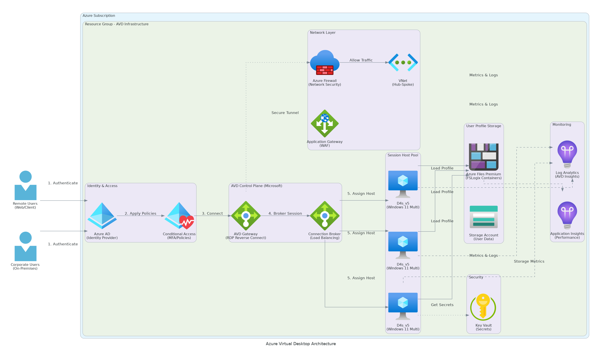

# Executive Summary

This Detailed Design Document provides comprehensive technical specifications for the Azure Virtual Desktop (AVD) implementation. The solution delivers a modern, cloud-based virtual desktop infrastructure enabling secure remote and hybrid work while reducing infrastructure costs by 50% compared to traditional VDI solutions.

## Solution Overview

Azure Virtual Desktop provides Windows 11 multi-session desktops and applications delivered from Azure, supporting 100+ concurrent users with high availability, security, and performance. The architecture leverages Azure-native services including Azure AD, Azure Files, Azure Monitor, and Azure Networking to deliver an enterprise-grade virtual desktop experience.

## Key Design Principles

- **Cloud-Native Architecture:** Leverage Azure managed services to minimize operational overhead
- **Zero Trust Security:** Implement identity-based access controls with Conditional Access and MFA
- **Performance Optimization:** Design for sub-30 second login times and responsive application delivery
- **Cost Efficiency:** Utilize auto-scaling and optimized VM sizing to minimize Azure consumption
- **Operational Excellence:** Automate deployment, monitoring, and maintenance for consistent operations

## Business Value

- **Cost Reduction:** 50-60% lower infrastructure costs vs. traditional VDI through shared resources
- **Enhanced Security:** Cloud-based security controls with continuous compliance monitoring
- **User Flexibility:** Access from any device, anywhere with consistent experience
- **IT Efficiency:** Centralized management reducing desktop administration time by 70%
- **Scalability:** Rapid deployment of new desktops without hardware procurement

# Business Context

## Business Drivers

The organization requires a modern desktop infrastructure to support hybrid and remote workforce models while maintaining security, performance, and user experience. Key business drivers include:

- **Remote Work Enablement:** Support 100% remote work capability for business continuity
- **Cost Optimization:** Reduce capital expenditure on desktop hardware and VDI infrastructure
- **Security Enhancement:** Implement zero-trust security model with centralized controls
- **IT Modernization:** Transition from on-premises VDI to cloud-based desktop services
- **User Experience:** Provide consistent desktop experience across devices and locations

## Current State Challenges

- High costs associated with traditional VDI infrastructure and hardware refresh cycles
- Limited scalability requiring significant lead time for capacity expansion
- Complex management of on-premises VDI servers and desktop images
- Inconsistent user experience across different device types and network conditions
- Security concerns with legacy authentication and access control mechanisms

## Target State Objectives

- Cloud-based virtual desktop infrastructure with pay-as-you-go consumption model
- Auto-scaling to match capacity with demand and optimize costs
- Simplified management through Azure-native tools and automation
- Superior user experience with optimized login times and application performance
- Enhanced security through Azure AD integration and conditional access policies

# Current-State Assessment

## Existing Infrastructure

### Desktop Environment
- Traditional thick-client desktops with 3-5 year refresh cycles
- Legacy on-premises VDI infrastructure (VMware Horizon) supporting 50 users
- Windows 10 Enterprise operating system with quarterly feature updates
- Mixture of company-owned and BYOD devices with inconsistent management

### Application Landscape
- 45+ business applications including Microsoft 365, line-of-business apps, and web applications
- Mix of installed applications and web-based SaaS solutions
- User-specific application requirements varying by department and role
- Some legacy applications requiring specific Windows versions or configurations

### Network Infrastructure
- Corporate network with 1 Gbps internet connectivity
- VPN access for remote users with capacity constraints
- ExpressRoute circuit to Azure (1 Gbps) for cloud connectivity
- Multiple office locations requiring consistent desktop access

### Identity and Access
- On-premises Active Directory with Azure AD Connect synchronization
- Basic authentication without multi-factor authentication
- Limited conditional access controls
- Manual user provisioning and access management processes

## Gap Analysis

| Requirement | Current State | Target State | Gap |
|-------------|---------------|--------------|-----|
| Concurrent Users | 50 VDI users | 100+ concurrent users | Capacity expansion required |
| Login Time | 45-60 seconds | <30 seconds | Performance optimization needed |
| Remote Access | VPN-based | Direct cloud access | Network architecture redesign |
| Authentication | AD passwords only | Azure AD with MFA | Identity modernization required |
| Application Delivery | Installed apps | MSIX app attach | Application packaging needed |
| Profile Management | Roaming profiles | FSLogix containers | Profile solution migration |
| Monitoring | Limited visibility | Comprehensive insights | Monitoring implementation needed |
| Scalability | Manual provisioning | Auto-scaling | Automation required |

# Solution Architecture

## Architecture Overview

The Azure Virtual Desktop solution implements a hub-spoke network topology with centralized security and monitoring. Session hosts are deployed across availability zones for high availability, with Azure Files Premium providing high-performance storage for FSLogix profile containers.



```
Architecture Components:
- AVD Control Plane (Microsoft-managed)
- Session Host Pools (Customer-managed VMs)
- Azure Virtual Network (Hub-Spoke topology)
- Azure Files Premium (FSLogix profiles)
- Azure AD (Identity and authentication)
- Azure Monitor (Monitoring and diagnostics)
```

## Host Pool Architecture

### Host Pool Configuration
- **Pooled Multi-Session:** Windows 11 Enterprise multi-session for standard users
- **Personal Persistent:** Dedicated VMs for power users requiring customization
- **Load Balancing:** Breadth-first algorithm distributing users across session hosts
- **Session Limits:** 10 concurrent sessions per session host for optimal performance

### Session Host Specifications
- **VM Size:** Standard_D4s_v5 (4 vCPU, 16 GB RAM)
- **Operating System:** Windows 11 Enterprise multi-session (22H2)
- **Storage:** Premium SSD managed disks (P10 - 128 GB OS disk)
- **Availability:** Deployed across Azure Availability Zones 1 and 2
- **Auto-Scaling:** Scale out at 80% capacity, scale in at 20% capacity

### Host Pool Sizing
- **Production Pool:** 15 session hosts supporting 150 concurrent sessions (10 per host)
- **Developer Pool:** 3 session hosts supporting 15 developer users
- **Executive Pool:** 2 session hosts providing dedicated resources for executives
- **Total Capacity:** 20 session hosts supporting 180 concurrent sessions

## Application Architecture

### Application Delivery Methods
- **MSIX App Attach:** Dynamic application delivery for 35+ business applications
- **Pre-Installed Applications:** Critical system tools and utilities in golden image
- **RemoteApp:** Individual application publishing for specific user groups
- **Web Applications:** Browser-based SaaS applications requiring no deployment

### Application Groups
- **Desktop Application Group:** Full desktop access for all users
- **Office Apps Group:** Microsoft 365 applications (Word, Excel, PowerPoint, Outlook)
- **LOB Apps Group:** Line-of-business applications by department
- **Developer Tools Group:** Development tools for engineering team

### Application Packaging Strategy
- Use MSIX app attach for applications supporting the format
- Leverage App-V for legacy applications requiring virtualization
- Install directly in image for applications requiring system-level integration
- Provide web access for SaaS applications requiring no installation

## Storage Architecture

### FSLogix Profile Containers
- **Storage Account:** Azure Files Premium with ZRS (zone-redundant storage)
- **File Share:** Dedicated share for FSLogix profiles with 10 TB capacity
- **Container Size:** Dynamic VHD sizing with 30 GB default, expanding to 50 GB maximum
- **Performance:** Premium tier providing 100,000 IOPS and 10 GB/s throughput
- **Backup:** Azure Backup with daily backups retained for 30 days

### Data Storage
- **User Data:** OneDrive for Business for personal files and folder redirection
- **Shared Data:** Azure Files Standard for departmental shared folders
- **Application Data:** Separate storage accounts for application-specific data
- **Temporary Files:** Local session host storage for cache and temp files

## Network Architecture

### Virtual Network Design
- **Hub VNet:** Central connectivity and shared services (10.0.0.0/16)
  - Management Subnet: 10.0.1.0/24 (Azure Bastion, management VMs)
  - Shared Services Subnet: 10.0.2.0/24 (DNS, monitoring)
- **AVD Spoke VNet:** Session host infrastructure (10.1.0.0/16)
  - Session Hosts Subnet: 10.1.1.0/24 (AVD session host VMs)
  - Storage Subnet: 10.1.2.0/24 (Private endpoints for Azure Files)

### Network Security
- **Network Security Groups:** Applied to session host subnets restricting traffic
- **Azure Firewall:** Centralized outbound internet filtering and logging
- **Private Endpoints:** Secure connectivity to Azure Files and Key Vault
- **ExpressRoute:** Dedicated connectivity from on-premises to Azure (1 Gbps)

### Connectivity
- **ExpressRoute:** Primary connectivity for on-premises users
- **VPN Gateway:** Backup connectivity for site-to-site failover
- **Public Internet:** Direct access for remote users via Azure Front Door
- **Service Endpoints:** Optimized routing for Azure PaaS services

# Security & Compliance

## Identity and Access Management

### Azure AD Integration
- **Hybrid Identity:** Azure AD Connect synchronizing on-premises AD to Azure AD
- **Authentication:** Azure AD authentication for AVD access with pass-through authentication
- **Conditional Access:** Policies enforcing MFA, device compliance, and location-based access
- **Privileged Identity Management:** Just-in-time access for administrative operations

### Multi-Factor Authentication
- **User MFA:** Required for all AVD access using Microsoft Authenticator app
- **Administrator MFA:** Required for all privileged access with additional controls
- **MFA Methods:** Push notification, phone call, and authenticator app code
- **Trusted Locations:** Office networks defined as trusted, bypassing MFA for internal access

### Role-Based Access Control
- **User Access:** Desktop Virtualization User role for AVD session access
- **Application Publishing:** Desktop Virtualization Application Group Contributor for app publishing
- **Administrative Access:** Desktop Virtualization Contributor for host pool management
- **Security Access:** Security Reader for compliance and audit access

## Data Protection

### Encryption
- **Data at Rest:** Azure Storage Service Encryption (SSE) with Microsoft-managed keys
- **Data in Transit:** TLS 1.2 for all Azure service communication
- **RDP Encryption:** 128-bit encryption for Remote Desktop Protocol sessions
- **Profile Encryption:** FSLogix profiles encrypted at rest on Azure Files

### Data Loss Prevention
- **Microsoft Purview:** DLP policies preventing sensitive data exfiltration
- **Clipboard Restrictions:** Controlled clipboard redirection based on data classification
- **File Download Controls:** Restrictions on downloading files to local devices
- **Print Controls:** Managed printing with audit logging and restrictions

### Backup and Recovery
- **Profile Backups:** Daily Azure Backup of FSLogix file share
- **VM Backups:** Weekly backups of golden images and critical session hosts
- **Retention:** 30-day retention for operational recovery, 1-year for compliance
- **Disaster Recovery:** Geo-redundant backup storage for cross-region recovery

## Network Security

### Perimeter Security
- **Azure Firewall:** Application-aware filtering for outbound internet traffic
- **NSG Rules:** Granular network access controls at subnet and NIC level
- **DDoS Protection:** Azure DDoS Protection Standard for public endpoints
- **Web Application Firewall:** Protection for web-based access portals

### Micro-Segmentation
- **Subnet Isolation:** Separate subnets for session hosts, storage, and management
- **Application Security Groups:** Logical grouping for policy application
- **Service Endpoints:** Direct routing to Azure services bypassing public internet
- **Private Link:** Private connectivity to PaaS services within VNet

### Threat Protection
- **Microsoft Defender for Cloud:** Continuous security posture assessment
- **Microsoft Defender for Endpoint:** Endpoint detection and response on session hosts
- **Azure Sentinel:** SIEM solution for security event correlation and threat hunting
- **Threat Intelligence:** Integration with Microsoft threat intelligence feeds

## Compliance and Governance

### Compliance Frameworks
- **SOC 2 Type II:** Service Organization Control compliance for data security
- **ISO 27001:** Information security management system certification
- **HIPAA:** Healthcare data protection (if applicable)
- **GDPR:** European data protection regulation compliance (if applicable)

### Audit and Logging
- **Azure Monitor Logs:** Centralized logging for all AVD resources
- **Diagnostic Settings:** Enabled for host pools, workspaces, and application groups
- **Activity Logs:** Azure Resource Manager operations auditing
- **Sign-in Logs:** Azure AD authentication and access logs
- **Retention:** 90-day retention for operational logs, 1-year for compliance logs

### Policy Enforcement
- **Azure Policy:** Enforcing compliance with organizational standards
- **Tagging Policy:** Required tags for cost allocation and governance
- **Location Restrictions:** Limiting resource deployment to approved regions
- **SKU Restrictions:** Preventing deployment of non-approved VM sizes
- **Compliance Dashboard:** Real-time visibility into policy compliance status

# Data Architecture

## Data Flow

### User Profile Data
1. User authenticates to Azure AD via Remote Desktop client
2. AVD service directs user to available session host
3. FSLogix agent mounts user profile VHD from Azure Files
4. User session established with personalized profile and settings
5. Profile changes written back to VHD on Azure Files
6. VHD unmounted and session closed on logout

### Application Data
1. Applications access data via standard file paths and APIs
2. OneDrive for Business synchronizes personal files
3. Azure Files provides access to departmental shared folders
4. Line-of-business applications connect to backend databases
5. Application state and cache stored in user profile
6. Temporary files stored on local session host storage

## Data Storage Tiers

| Data Type | Storage Solution | Performance Tier | Redundancy | Backup |
|-----------|------------------|------------------|------------|---------|
| User Profiles | Azure Files Premium | Premium | ZRS | Daily |
| User Files | OneDrive for Business | Premium | Geo-redundant | Continuous |
| Shared Folders | Azure Files Standard | Transaction optimized | LRS | Weekly |
| Application Data | Azure SQL Database | General Purpose | Geo-redundant | Automated |
| Temporary Files | Local SSD | Premium | None | None |

## Data Lifecycle Management

### Profile Management
- **New User:** Profile created on first login with default settings
- **Active User:** Profile mounted on each session and updated continuously
- **Inactive User:** Profile archived after 90 days of no login
- **Terminated User:** Profile retained for 30 days then deleted

### File Retention
- **Active Files:** Retained indefinitely while user remains active
- **Deleted Files:** Moved to recycle bin with 30-day retention
- **Archived Files:** Moved to cool tier after 90 days without access
- **Compliance Files:** Retained per retention policy (typically 7 years)

# Integration Design

## Identity Integration

### Azure AD Connect
- **Synchronization:** Bidirectional sync between on-premises AD and Azure AD
- **Password Hash Sync:** Enabled as backup authentication method
- **Pass-Through Authentication:** Primary authentication method validating against on-premises AD
- **Seamless SSO:** Automatic sign-in for domain-joined devices
- **Sync Frequency:** 30-minute sync cycle for user and group changes

### Federation Services
- **ADFS Integration:** Optional federation for advanced authentication scenarios
- **SAML SSO:** Integration with third-party identity providers
- **OAuth/OpenID Connect:** Modern authentication for cloud applications

## Application Integration

### Microsoft 365 Integration
- **Exchange Online:** Outlook configured for email access within sessions
- **SharePoint Online:** Document libraries accessible via OneDrive and browser
- **Microsoft Teams:** Optimized Teams client with media redirection
- **Office Applications:** Microsoft 365 Apps for Enterprise deployed via MSIX

### Line-of-Business Applications
- **Database Connectivity:** Direct connections to on-premises SQL Server via ExpressRoute
- **File Server Access:** DFS namespaces providing access to on-premises file shares
- **Print Services:** Universal print drivers connecting to Azure Universal Print
- **Web Applications:** Browser-based access to internal and external web apps

## Monitoring Integration

### Azure Monitor Integration
- **Log Analytics Workspace:** Centralized logging for all AVD resources
- **Workbooks:** Pre-built dashboards for AVD performance and usage
- **Alerts:** Proactive notifications for performance and availability issues
- **Metrics:** Real-time performance metrics for session hosts and applications

### Service Integration
- **ServiceNow Integration:** Automated incident creation from Azure alerts
- **Microsoft Teams:** Alert notifications to operations channel
- **Power BI:** Custom dashboards for executive reporting
- **Email Notifications:** Critical alerts sent to on-call administrators

# Infrastructure & Operations

## Compute Infrastructure

### Session Host Management
- **Image Management:** Golden image updated monthly with latest patches and applications
- **Deployment Automation:** ARM templates and PowerShell scripts for consistent deployment
- **Configuration Management:** Azure Automation State Configuration for drift prevention
- **Patching Strategy:** Monthly patching during maintenance windows with staged rollout

### Capacity Management
- **Monitoring:** Continuous monitoring of CPU, memory, and session density
- **Scaling Rules:** Auto-scale based on session count and resource utilization
- **Peak Planning:** Capacity planning for peak usage periods (mornings, Monday)
- **Growth Planning:** Quarterly capacity review and expansion planning

## Operations Model

### Service Management
- **L1 Support:** Help desk handling user access and basic troubleshooting
- **L2 Support:** Desktop team managing session hosts and applications
- **L3 Support:** Cloud architects for complex issues and optimization
- **Vendor Support:** Microsoft support for platform and service issues

### Monitoring and Alerting
- **Availability Monitoring:** 5-minute health checks for session host availability
- **Performance Monitoring:** Real-time metrics for CPU, memory, and disk utilization
- **User Experience Monitoring:** Session login times and application responsiveness
- **Capacity Monitoring:** Trending analysis for capacity planning

### Incident Management
- **Critical Incidents:** Service outage affecting all users (15-minute response)
- **High Priority:** Performance degradation or access issues (1-hour response)
- **Medium Priority:** Individual user issues or minor bugs (4-hour response)
- **Low Priority:** Enhancement requests and non-critical issues (next business day)

## Backup and Disaster Recovery

### Backup Strategy
- **Profile Backups:** Daily backups of FSLogix file share at 2:00 AM
- **Image Backups:** Weekly backups of golden image VMs
- **Configuration Backups:** Daily exports of ARM templates and PowerShell scripts
- **Documentation Backups:** Weekly backups of runbooks and procedures

### Disaster Recovery
- **Recovery Time Objective (RTO):** 4 hours for full service restoration
- **Recovery Point Objective (RPO):** 24 hours for data loss
- **DR Site:** Secondary Azure region for failover capability
- **DR Testing:** Quarterly disaster recovery tests validating procedures

## Maintenance Windows

### Scheduled Maintenance
- **Monthly Patching:** Second Tuesday 10 PM - 2 AM (following Patch Tuesday)
- **Quarterly Updates:** Feature updates deployed over 4-week period
- **Emergency Maintenance:** As needed with 24-hour notice when possible
- **Maintenance Communication:** 5-day advance notice to users

### Change Management
- **Standard Changes:** Pre-approved changes following documented procedures
- **Normal Changes:** Require CAB approval with impact assessment
- **Emergency Changes:** Expedited approval for critical security or availability issues
- **Change Windows:** Tuesday/Wednesday/Thursday 10 PM - 2 AM

# Implementation Approach

## Implementation Phases

### Phase 1: Discovery & Planning (Weeks 1-2)
- Requirements gathering and stakeholder interviews
- Current state infrastructure and application assessment
- Network and connectivity planning
- Solution architecture design and validation
- Project plan and resource allocation

### Phase 2: Infrastructure Deployment (Weeks 3-5)
- Azure subscription and governance setup
- Virtual network and ExpressRoute configuration
- Session host deployment and configuration
- FSLogix profile storage deployment
- Monitoring and alerting configuration

### Phase 3: Application & Migration (Weeks 6-10)
- Golden image creation with applications
- MSIX application packaging and testing
- User profile migration from legacy VDI
- Pilot user group deployment and validation
- Phased production migration by department

### Phase 4: Hypercare & Transition (Weeks 11-12)
- 30-day hypercare support for production users
- Performance optimization and tuning
- Knowledge transfer to operations team
- Documentation finalization
- Project closeout and lessons learned

## Deployment Strategy

### Pilot Deployment
- **Pilot Group:** 20 users from IT and early adopter departments
- **Duration:** 2 weeks with daily feedback collection
- **Success Criteria:** Login time <30 seconds, no critical issues, 80% user satisfaction
- **Optimization:** Address feedback before broader rollout

### Phased Rollout
- **Wave 1:** IT and administrative staff (50 users, Week 7)
- **Wave 2:** Finance and HR departments (100 users, Week 8)
- **Wave 3:** Sales and operations teams (150 users, Week 9)
- **Wave 4:** Remaining users and contractors (200 users, Week 10)

### Migration Approach
- **User Communication:** 2-week advance notice with training schedule
- **Profile Migration:** Automated migration of roaming profiles to FSLogix
- **Application Validation:** User testing of critical applications before migration
- **Cutover:** Planned cutover during weekend to minimize disruption
- **Rollback Plan:** Ability to revert users to legacy VDI if critical issues arise

## Testing Strategy

### Test Phases
- **Unit Testing:** Individual component testing (VNet, storage, authentication)
- **Integration Testing:** End-to-end workflow testing (login, application access)
- **Performance Testing:** Load testing with simulated user sessions
- **Security Testing:** Vulnerability scanning and penetration testing
- **User Acceptance Testing:** Business user validation of workflows

### Test Scenarios
- User authentication and session establishment
- Application launch and functionality
- Profile creation and roaming
- Network performance and connectivity
- Printing and peripheral redirection
- Security controls and compliance

# Appendices

## Appendix A: Architecture Diagrams

### High-Level Architecture
- Overall solution architecture showing Azure services and connectivity
- Network topology with hub-spoke VNet design
- Data flow diagrams for user sessions and application access

### Detailed Component Diagrams
- Session host pool architecture with availability zones
- Storage architecture for FSLogix and user data
- Network security architecture with NSGs and Azure Firewall
- Identity and authentication flow

## Appendix B: Configuration Standards

### Naming Conventions
- Resource Groups: rg-[workload]-[environment]-[region]
- Virtual Networks: vnet-[workload]-[environment]-[region]
- Subnets: snet-[purpose]-[sequence]
- Virtual Machines: vm-[workload]-[sequence]
- Storage Accounts: st[workload][environment][sequence]

### Tagging Standards
- Environment: Production, Development, Test
- CostCenter: Department cost allocation code
- Owner: Technical owner email address
- Application: Application or service name
- Compliance: Compliance requirements (SOC2, HIPAA, etc.)

## Appendix C: Capacity Planning

### User Sizing Assumptions
- Standard User: 2 vCPU, 4 GB RAM, 10 GB profile
- Power User: 4 vCPU, 8 GB RAM, 20 GB profile
- Developer: 8 vCPU, 16 GB RAM, 30 GB profile
- Executive: 4 vCPU, 8 GB RAM (dedicated session host)

### Growth Projections
- Year 1: 200 concurrent users
- Year 2: 300 concurrent users (50% growth)
- Year 3: 400 concurrent users (33% growth)
- Scaling: Auto-scaling handles growth without manual intervention

## Appendix D: Security Controls

### Technical Controls
- Multi-factor authentication for all access
- Conditional Access policies based on risk
- Encryption at rest and in transit
- Network segmentation and micro-segmentation
- Endpoint detection and response
- Security information and event management

### Administrative Controls
- Access reviews and recertification
- Privileged access management
- Security awareness training
- Incident response procedures
- Change management processes
- Vendor risk management

### Physical Controls
- Azure datacenter physical security
- Environmental controls and redundancy
- Hardware lifecycle management
- Media disposal procedures

## Appendix E: Service Level Agreements

### Availability Targets
- **Service Availability:** 99.9% uptime (measured monthly)
- **Planned Downtime:** Monthly maintenance window excluded from SLA
- **Measurement:** Uptime calculated from Azure Monitor availability data

### Performance Targets
- **Login Time:** 95% of logins complete within 30 seconds
- **Application Launch:** 95% of app launches complete within 5 seconds
- **Session Responsiveness:** 95% of sessions meet responsiveness SLA
- **Support Response:** Response times based on incident severity

### Support Commitments
- **Critical (P1):** 15-minute response, 4-hour resolution target
- **High (P2):** 1-hour response, 8-hour resolution target
- **Medium (P3):** 4-hour response, 24-hour resolution target
- **Low (P4):** Next business day response, best effort resolution
