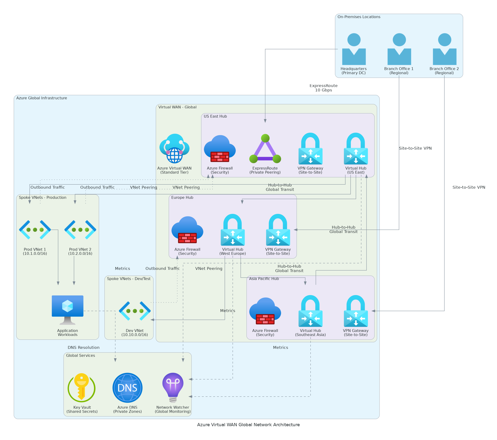

# Executive Summary

This Detailed Design Document provides comprehensive technical specifications for the Azure Virtual WAN Global Network implementation. The solution delivers enterprise-grade global network connectivity through Azure's cloud-native networking platform, connecting distributed branch offices, data centers, and cloud resources through a centralized hub-and-spoke architecture.

## Solution Overview

The Azure Virtual WAN solution modernizes network connectivity by replacing complex, costly MPLS circuits with a cloud-native global network infrastructure. The implementation provides:

- **Global Hub Architecture**: Three regional Virtual WAN hubs (US East, US West, Europe) providing full mesh connectivity
- **Multiple Connectivity Options**: Site-to-Site VPN, ExpressRoute, and Point-to-Site VPN for flexible connectivity
- **Integrated Security**: Azure Firewall with threat intelligence and centralized policy management
- **Automated Routing**: Dynamic routing with BGP and intelligent path selection
- **Comprehensive Monitoring**: Network insights, traffic analytics, and performance monitoring

## Business Value

- **60% Cost Reduction**: $1.1M annual savings through MPLS elimination and operational efficiency
- **99.94% Availability**: Enterprise-grade reliability with automated failover
- **35% Performance Improvement**: Enhanced application response times and user experience
- **96% Faster Site Provisioning**: New site connectivity in days instead of weeks
- **Centralized Security**: Complete visibility and threat protection across all locations

## Technical Approach

The solution leverages Azure Virtual WAN Standard SKU to provide a fully managed, cloud-native global network platform. Infrastructure as Code (Terraform) ensures consistent, repeatable deployments. The hub-and-spoke topology simplifies routing while maintaining security and performance requirements.

---

# Business Context

## Current State Challenges

The organization currently operates a legacy MPLS-based WAN infrastructure with significant limitations:

### Network Infrastructure Constraints
- **Complex Multi-Vendor Environment**: 15 MPLS circuits from 3 different providers requiring complex coordination
- **High Operational Costs**: $1.85M annual spending on MPLS circuits, hardware, and operations
- **Limited Scalability**: 6-8 weeks required to provision new site connectivity
- **Performance Bottlenecks**: Inconsistent performance across locations with average latency >100ms
- **Management Overhead**: Distributed routing configuration across multiple devices and platforms

### Security and Compliance Gaps
- **Limited Visibility**: No centralized monitoring or logging of inter-site traffic
- **Inconsistent Policies**: Security rules implemented differently across locations
- **Threat Detection Gaps**: Minimal threat intelligence or advanced threat protection
- **Compliance Challenges**: Difficult to demonstrate consistent security policy enforcement

### Business Impact
- **Slow M&A Integration**: Unable to quickly connect acquired company sites
- **Cloud Migration Constraints**: Poor connectivity to Azure resources limits cloud adoption
- **Application Performance**: Business applications suffer from network latency and jitter
- **Operational Inefficiency**: Network team spends 60% of time on routine maintenance

## Target State Vision

The Azure Virtual WAN implementation addresses these challenges through:

### Simplified Global Network
- Cloud-native platform eliminates complex MPLS topology
- Automated routing and connectivity management
- Centralized configuration and policy management
- Rapid site onboarding with standardized processes

### Enhanced Security Posture
- Azure Firewall provides centralized threat protection
- Complete visibility with traffic analytics and logging
- Consistent policy enforcement across all locations
- Integrated threat intelligence and advanced protection

### Improved Performance and Reliability
- Azure global backbone provides optimized routing
- 99.9%+ availability with automated failover
- Low latency connectivity (<50ms inter-hub)
- Scalable capacity to meet growing demands

### Strategic Business Enablers
- Accelerated cloud migration and digital transformation
- Rapid M&A integration capabilities
- Foundation for edge computing and IoT initiatives
- Support for global expansion and new market entry

---

# Current-State Assessment

## Existing Network Infrastructure

### Network Topology
The current network operates a traditional hub-and-spoke MPLS topology:

- **Primary Data Center (New York)**: Central hub with MPLS aggregation
- **Secondary Data Center (Los Angeles)**: Backup hub with limited routing
- **10 Branch Offices**: Connected via MPLS circuits (2-10 Mbps per site)
- **Internet Connectivity**: Dedicated circuits at each location (not centralized)
- **Remote Access**: Legacy SSL VPN with limited capacity (50 concurrent users)

### Connectivity Details

| Location Type | Count | Connectivity | Bandwidth | Provider | Annual Cost |
|---------------|-------|--------------|-----------|----------|-------------|
| Primary DC | 1 | MPLS + Internet | 1 Gbps | Verizon | $240K |
| Secondary DC | 1 | MPLS + Internet | 500 Mbps | AT&T | $180K |
| Large Branches | 3 | MPLS + Internet | 10 Mbps | Multiple | $360K |
| Medium Branches | 4 | MPLS | 5 Mbps | Multiple | $240K |
| Small Branches | 3 | MPLS | 2 Mbps | Regional | $180K |

Total Annual Connectivity Cost: $1,200,000

### Infrastructure Components
- **Edge Routers**: Cisco ISR 4000 series at major sites (aging, 5-7 years old)
- **Branch CPE**: Mixed vendors (Cisco, Fortinet, generic) with inconsistent capabilities
- **Firewalls**: Distributed firewalls at each location (no central management)
- **VPN Concentrator**: Aging Cisco ASA at primary data center
- **Management**: Multiple management platforms and tools

### Performance Baselines

Current network performance metrics:

| Metric | Current Performance | Pain Points |
|--------|---------------------|-------------|
| Inter-site Latency | 80-120ms average | Variable, unpredictable |
| Packet Loss | 0.5-2% | Spikes during peak hours |
| Availability | 99.5% (measured) | Outages impact business |
| Throughput | 60-70% of capacity | Limited headroom for growth |
| Incident MTTR | 4-6 hours average | Slow troubleshooting |

## Azure Environment Assessment

### Current Azure Footprint
- **Subscriptions**: 2 (Production, Non-Production)
- **Regions**: Primarily East US, limited West US presence
- **Virtual Networks**: 8 VNets (isolated, no centralized connectivity)
- **Connectivity**: ExpressRoute to East US only (single circuit, no redundancy)
- **Security**: Basic NSGs, no centralized firewall
- **Monitoring**: Basic Azure Monitor, limited network visibility

### Azure Readiness
- Azure subscription quotas sufficient for Virtual WAN deployment
- Virtual WAN service available in target regions
- Required Azure AD permissions and RBAC roles defined
- Network IP address space available (no conflicts identified)
- Integration with existing Azure resources feasible

## Gap Analysis

| Requirement | Current State | Target State | Gap |
|-------------|---------------|--------------|-----|
| Global Connectivity | MPLS hub-and-spoke | Cloud-native mesh | Replace MPLS with Virtual WAN |
| Security | Distributed firewalls | Centralized Azure Firewall | Deploy integrated security |
| Availability | 99.5% | 99.9%+ | Implement redundancy and automation |
| Site Provisioning | 6-8 weeks | 2-3 days | Automate with Virtual WAN |
| Visibility | Limited | Complete | Deploy monitoring and analytics |
| Cost | $1.85M annually | <$850K annually | Optimize with cloud services |

---

# Solution Architecture

## Architecture Overview

The Azure Virtual WAN solution implements a cloud-native global network architecture with three regional hubs providing full mesh connectivity. The design follows Microsoft Well-Architected Framework principles for reliability, security, cost optimization, operational excellence, and performance efficiency.

### High-Level Architecture Diagram



**ASCII Representation** (for reference):

```
┌─────────────────────────────────────────────────────────────────────┐
│                     Azure Virtual WAN (Global)                      │
│                           Standard SKU                              │
└────────────┬──────────────────────┬──────────────────┬──────────────┘
             │                      │                  │
   ┌─────────▼─────────┐  ┌────────▼────────┐  ┌─────▼──────────┐
   │  Virtual Hub      │  │  Virtual Hub    │  │ Virtual Hub    │
   │  East US          │◄─┤  West US        │◄─┤ West Europe    │
   │  10.0.0.0/24      │  │  10.1.0.0/24    │  │ 10.2.0.0/24    │
   └─────────┬─────────┘  └────────┬────────┘  └─────┬──────────┘
             │                      │                  │
   ┌─────────┴─────────┐  ┌────────┴────────┐  ┌─────┴──────────┐
   │ Security Services │  │ Security Svc    │  │ Security Svc   │
   ├───────────────────┤  ├─────────────────┤  ├────────────────┤
   │ Azure Firewall    │  │ Azure Firewall  │  │ Azure Firewall │
   │ VPN Gateway       │  │ VPN Gateway     │  │ VPN Gateway    │
   │ ER Gateway        │  │ ER Gateway      │  │ ER Gateway     │
   │ Route Tables      │  │ Route Tables    │  │ Route Tables   │
   └─────────┬─────────┘  └────────┬────────┘  └─────┬──────────┘
             │                      │                  │
   ┌─────────┴─────────┐  ┌────────┴────────┐  ┌─────┴──────────┐
   │ Connectivity      │  │ Connectivity    │  │ Connectivity   │
   ├───────────────────┤  ├─────────────────┤  ├────────────────┤
   │ Branches 1-4      │  │ Branches 5-7    │  │ Branches 8-10  │
   │ Spoke VNets (3)   │  │ Spoke VNets (2) │  │ Spoke VNets (3)│
   │ ExpressRoute (2)  │  │ ExpressRoute (1)│  │ ExpressRoute   │
   └───────────────────┘  └─────────────────┘  └────────────────┘
```

## Core Components

### Virtual WAN Resource
- **SKU**: Standard (supports VPN, ExpressRoute, VNet connections, routing)
- **Type**: Microsoft Managed (Azure handles infrastructure)
- **Branch-to-Branch**: Enabled (allows transit routing between all connections)
- **Office 365 Local Breakout**: Enabled for optimal Office 365 performance

### Virtual WAN Hubs

#### Hub: East US (Primary)
- **Region**: East US
- **Address Space**: 10.0.0.0/24
- **Purpose**: Primary North American hub, headquarters connectivity
- **Capacity**: High scale (100+ connections)
- **Gateways**:
  - VPN Gateway: Scale Unit 2 (1 Gbps aggregate)
  - ExpressRoute Gateway: Scale Unit 1 (2 Gbps)
- **Connected Resources**:
  - 4 branch offices via S2S VPN
  - 2 ExpressRoute circuits
  - 3 spoke VNets (production workloads)

#### Hub: West US (Secondary)
- **Region**: West US 2
- **Address Space**: 10.1.0.0/24
- **Purpose**: West Coast presence, DR capabilities
- **Capacity**: Medium scale (50+ connections)
- **Gateways**:
  - VPN Gateway: Scale Unit 2 (1 Gbps aggregate)
  - ExpressRoute Gateway: Scale Unit 1 (2 Gbps)
- **Connected Resources**:
  - 3 branch offices via S2S VPN
  - 1 ExpressRoute circuit
  - 2 spoke VNets (DR and regional workloads)

#### Hub: West Europe (International)
- **Region**: West Europe
- **Address Space**: 10.2.0.0/24
- **Purpose**: European operations support
- **Capacity**: Medium scale (50+ connections)
- **Gateways**:
  - VPN Gateway: Scale Unit 2 (1 Gbps aggregate)
  - ExpressRoute Gateway: Optional (future expansion)
- **Connected Resources**:
  - 3 branch offices via S2S VPN
  - 3 spoke VNets (European workloads, GDPR compliance)

### Connectivity Options

#### Site-to-Site VPN
- **Use Case**: Branch office connectivity
- **Protocol**: IKEv2 with IPsec
- **Redundancy**: Active-active VPN tunnels per site
- **BGP**: Enabled for dynamic routing
- **Authentication**: Pre-shared keys (PSK) with strong entropy
- **Encryption**: AES-256-GCM

**VPN Site Configuration**:
- Public IP address of branch CPE device
- Private address spaces advertised from branch
- BGP ASN for dynamic routing (if supported)
- Link bandwidth for QoS and routing optimization
- Device vendor/model for configuration assistance

#### ExpressRoute
- **Use Case**: Data centers and high-bandwidth sites
- **Circuit Size**: 1 Gbps per circuit
- **Redundancy**: Multiple circuits with diversity
- **Peering**: Private peering for Azure VNet access
- **Global Reach**: Enabled for inter-circuit connectivity
- **SLA**: 99.95% availability

**ExpressRoute Configuration**:
- Primary and secondary connections for redundancy
- BGP peering with Azure (ASN 12076)
- Route filters for specific prefix advertisement
- Connection to Virtual WAN hub via ER Gateway

#### Point-to-Site VPN
- **Use Case**: Remote user connectivity
- **Protocol**: OpenVPN or IKEv2
- **Authentication**: Azure AD with MFA
- **Client Address Pool**: 172.16.0.0/16
- **Capacity**: 500 concurrent connections
- **Features**: Split tunneling configurable, always-on VPN support

### Hub-to-Hub Connectivity
- **Topology**: Full mesh between all hubs
- **Routing**: Automatic via Azure backbone
- **Latency**: <50ms inter-hub (regional), <150ms (transatlantic)
- **Bandwidth**: Unlimited (Azure backbone capacity)
- **Cost**: Inter-region data transfer charges apply

## Network Routing

### Routing Architecture

Azure Virtual WAN provides intelligent, automated routing with multiple route tables supporting complex scenarios:

#### Default Route Table
- **Purpose**: Standard connectivity for most connections
- **Routes**: Learned from all VPN sites, ExpressRoute, and VNet connections
- **Propagation**: Routes propagated to all associated connections
- **Use Case**: Normal branch and VNet connectivity

#### Custom Route Tables

**Isolated Route Table**:
- **Purpose**: Isolate specific connections (e.g., guest networks, contractors)
- **Routes**: Limited route learning and propagation
- **Security**: Prevent lateral movement between isolated resources
- **Use Case**: Third-party or untrusted connections

**Secure Internet Route Table**:
- **Purpose**: Force all internet-bound traffic through Azure Firewall
- **Default Route**: 0.0.0.0/0 → Azure Firewall
- **Inspection**: All traffic inspected and logged
- **Use Case**: Centralized internet breakout with security

### BGP Configuration

#### Hub BGP Details
- **East US Hub**: ASN 65515
- **West US Hub**: ASN 65516
- **Europe Hub**: ASN 65517
- **Route Propagation**: Automatic between hubs and connections

#### Branch Site BGP
- **ASN Range**: 64512-65534 (private ASN)
- **Unique ASN**: Each branch assigned unique ASN
- **Peer IP**: Automatically assigned by Azure Virtual WAN
- **Advertisement**: Branch subnets advertised to Azure

### Traffic Flow Examples

**Branch to Branch (Same Hub)**:
```
Branch A → VPN → Hub East → Route Table → VPN → Branch B
Latency: ~15-30ms (hub routing)
```

**Branch to Branch (Different Hubs)**:
```
Branch A (East) → VPN → Hub East → Azure Backbone → Hub Europe → VPN → Branch B (Europe)
Latency: ~130-160ms (includes transatlantic)
```

**Branch to Azure VNet**:
```
Branch A → VPN → Hub East → VNet Connection → Spoke VNet → Application
Latency: ~10-20ms
```

**Branch to Internet (via Firewall)**:
```
Branch A → VPN → Hub East → Azure Firewall → Internet
Security: Inspected, logged, threat protection applied
```

## Spoke VNet Design

### VNet Connectivity Model
- **Connection Type**: Native Virtual WAN VNet connection (not traditional peering)
- **Routing**: Automatic route propagation from hub to spoke
- **Bandwidth**: No artificial limits (Azure datacenter capacity)
- **Latency**: ~1-3ms (same region)

### VNet Architecture Pattern

Each spoke VNet follows a consistent subnet design:

```
Spoke VNet (10.x.0.0/16)
├── subnet-frontend (10.x.1.0/24) - Web tier
├── subnet-application (10.x.2.0/24) - App tier
├── subnet-database (10.x.3.0/24) - Data tier
├── subnet-management (10.x.4.0/24) - Admin access
└── subnet-integration (10.x.5.0/24) - Integration services
```

### Spoke VNet Categories

**Production Workloads**:
- Connected to East US hub (primary)
- Mission-critical applications
- Enhanced monitoring and alerting
- Regular backup and DR procedures

**Development/Test**:
- Connected to West US hub
- Non-production environments
- Isolated from production networks
- Cost-optimized resources

**Regional Workloads**:
- Connected to Europe hub
- GDPR-compliant data processing
- Regional user proximity
- Data residency compliance

---

# Security & Compliance

## Security Architecture

### Defense in Depth Strategy

The solution implements multiple layers of security controls:

**Layer 1: Network Perimeter**
- Azure DDoS Protection Standard on all hubs
- Azure Firewall inspects all inter-spoke and internet traffic
- VPN encryption (AES-256) for branch connectivity
- ExpressRoute private peering (not exposed to public internet)

**Layer 2: Network Segmentation**
- Custom route tables enforce traffic routing policies
- NSGs on spoke VNet subnets for micro-segmentation
- Isolated route tables for untrusted connections
- Application Security Groups for granular access control

**Layer 3: Identity and Access**
- Azure AD integration for administrative access
- Role-Based Access Control (RBAC) for resource management
- Managed identities for service authentication
- Privileged Identity Management (PIM) for just-in-time access

**Layer 4: Data Protection**
- TLS 1.3 for all Azure management traffic
- IPsec encryption for VPN connections
- ExpressRoute with optional MACSec for circuit encryption
- Azure Storage encryption at rest

**Layer 5: Monitoring and Response**
- Azure Monitor and Network Watcher for visibility
- Azure Sentinel integration for SIEM capabilities
- Automated threat detection and alerting
- Security Center recommendations and compliance tracking

## Azure Firewall Implementation

### Firewall Configuration

**SKU**: Azure Firewall Premium (advanced threat protection capabilities)

**Features Enabled**:
- TLS Inspection for HTTPS traffic
- IDPS (Intrusion Detection and Prevention System)
- Threat Intelligence in Alert and Deny mode
- Web Categories filtering
- URL Filtering with wildcard support
- DNS Proxy for name resolution

### Firewall Policy Structure

**Policy Hierarchy**:
```
Global Base Policy (inherited by all firewalls)
├── Network Rules (Layer 3/4)
│   ├── Allow rules (priority 100-199)
│   ├── Monitoring rules (priority 200-299)
│   └── Deny rules (priority 300-399)
├── Application Rules (Layer 7)
│   ├── Productivity (Office 365, etc.)
│   ├── Business applications
│   └── General internet access
└── DNAT Rules
    └── Inbound connections (if needed)
```

### Network Rule Collections

**Allow-Outbound-Core** (Priority: 100):
- HTTPS (443/TCP) to any destination
- DNS (53/UDP) to Azure DNS and corporate DNS
- NTP (123/UDP) for time synchronization
- Windows Update and Azure endpoints

**Allow-Inter-Region** (Priority: 150):
- All traffic between hub address spaces
- Required for hub-to-hub communication
- Logged for visibility

### Application Rule Collections

**Productivity-Apps** (Priority: 100):
- Office 365 (optimized endpoints)
- Microsoft Teams
- OneDrive, SharePoint Online
- Azure services (*.azure.com, *.microsoft.com)

**Business-Apps** (Priority: 200):
- Line-of-business SaaS applications
- Cloud service providers (AWS, Google Cloud)
- Development tools (GitHub, npm, etc.)

**General-Internet** (Priority: 300):
- General web browsing (with web categories)
- SSL inspection for visibility
- URL filtering for blocked categories

### Threat Intelligence

**Mode**: Alert and Deny
**Feed**: Microsoft-curated threat intelligence
**Categories**: Malware, phishing, botnet C2, known bad actors
**Action**: Automatically deny + alert on match

## Network Security Groups

### NSG Strategy
- Applied at subnet level (not NIC level) for consistency
- Deny by default, explicit allow rules
- Service tags used where possible for maintainability
- Application Security Groups (ASGs) for grouping

### Standard NSG Template

**Inbound Rules** (example for application tier):
```
Priority 100: Allow from frontend subnet (10.x.1.0/24) on port 8080
Priority 110: Allow from management subnet on port 22/3389
Priority 500: Deny all other inbound
```

**Outbound Rules**:
```
Priority 100: Allow to database subnet (10.x.3.0/24) on port 1433/3306
Priority 110: Allow to Azure services (Service Tag: AzureCloud)
Priority 500: Deny all other outbound
```

## Identity and Access Management

### RBAC Role Assignments

**Network Operator** (built-in role):
- Permissions: Read network resources, modify routes and NSGs
- Scope: Network resource groups
- Assignment: Network operations team

**Virtual Machine Contributor**:
- Permissions: Manage VMs, but not network or storage
- Scope: Compute resource groups
- Assignment: Application teams

**Custom Role - Virtual WAN Administrator**:
- Permissions: Full control over Virtual WAN, hubs, connections
- Scope: Virtual WAN resource group
- Assignment: Network architects and senior engineers

### Authentication Requirements
- Multi-Factor Authentication (MFA) mandatory for all admin access
- Privileged Identity Management (PIM) for elevated permissions
- Conditional Access policies enforce compliant devices
- Just-in-Time (JIT) VM access for management connections

## Compliance and Governance

### Regulatory Compliance

**GDPR (General Data Protection Regulation)**:
- European hub ensures data residency
- Audit logging captures all data access
- Data classification and handling policies enforced
- Privacy by design principles implemented

**SOC 2 Type II**:
- Azure Virtual WAN meets SOC 2 requirements
- Comprehensive logging and audit trails
- Access controls and change management
- Regular attestation and certification

**ISO 27001**:
- Information security management system (ISMS) aligned
- Risk assessment and treatment plans
- Security controls mapped to ISO 27001 standards

### Azure Policy Implementation

**Required Policies**:
- Virtual networks must use specific address spaces
- NSGs required on all subnets
- Azure Firewall must be deployed in hub
- Diagnostic logging enabled on all resources
- Resources must have required tags (environment, owner, cost center)

**Enforcement**:
- Deny policies prevent non-compliant resource creation
- Audit policies report on compliance status
- Remediation tasks automatically fix drift

## Monitoring and Threat Detection

### Monitoring Strategy

**Azure Monitor**:
- Metrics collection for all network resources
- Log Analytics workspace for centralized logging
- Workbooks for visualization and reporting
- Alerting on critical conditions

**Network Watcher**:
- Connection Monitor for end-to-end connectivity testing
- Network Performance Monitor for latency and packet loss tracking
- Traffic Analytics for usage patterns and anomaly detection
- NSG Flow Logs for security analysis

**Azure Sentinel** (optional):
- SIEM integration for advanced threat detection
- Machine learning-based anomaly detection
- Automated incident response playbooks
- Integration with threat intelligence feeds

### Key Security Metrics

| Metric | Threshold | Alert Action |
|--------|-----------|--------------|
| Firewall Denied Connections | >100 from single source in 5 min | Critical alert, investigate potential attack |
| VPN Connection Failure | Any VPN site down >5 min | High alert, check site connectivity |
| NSG Deny Rate Spike | >50% increase over baseline | Medium alert, review NSG rules |
| Unusual Traffic Volume | >300% of baseline | High alert, check for data exfiltration |
| Failed Authentication | >10 from single IP | Critical alert, potential brute force |

---

# Data Architecture

## IP Address Planning

### Address Space Allocation

**Azure Virtual WAN Hubs**:
- East US Hub: 10.0.0.0/24 (254 usable IPs)
- West US Hub: 10.1.0.0/24 (254 usable IPs)
- West Europe Hub: 10.2.0.0/24 (254 usable IPs)
- Future Expansion: 10.3.0.0/22 (reserved for additional hubs)

**Spoke VNets** (10.10.0.0/14 range):
- Production VNets: 10.10.0.0/16 through 10.10.15.0/16
- Non-Production VNets: 10.11.0.0/16 through 10.11.15.0/16
- Regional VNets: 10.12.0.0/16 through 10.12.15.0/16
- Future Growth: 10.13.0.0/16 (reserved)

**Branch Sites** (192.168.0.0/16 range):
- Branch 1 (HQ New York): 192.168.1.0/24
- Branch 2 (Chicago): 192.168.2.0/24
- Branch 3 (San Francisco): 192.168.3.0/24
- Branch 4 (Boston): 192.168.4.0/24
- Branch 5 (Dallas): 192.168.5.0/24
- Branch 6 (Seattle): 192.168.6.0/24
- Branch 7 (Atlanta): 192.168.7.0/24
- Branch 8 (London): 192.168.8.0/24
- Branch 9 (Paris): 192.168.9.0/24
- Branch 10 (Frankfurt): 192.168.10.0/24
- Future Sites: 192.168.11.0/24 - 192.168.254.0/24

**Point-to-Site VPN**:
- Remote Users: 172.16.0.0/16 (65,534 addresses)

**Data Centers**:
- Primary DC (New York): 10.100.0.0/16 (via ExpressRoute)
- Secondary DC (Los Angeles): 10.101.0.0/16 (via ExpressRoute)

### IP Address Management (IPAM)

- Azure IPAM solution for address tracking and allocation
- Automated conflict detection before VNet creation
- Integration with ServiceNow CMDB for documentation
- Regular audits for address utilization and optimization

## DNS Architecture

### DNS Resolution Strategy

**Azure Private DNS**:
- Private DNS zones for internal name resolution
- Zones: internal.company.com, azure.company.com
- Automatic VM registration in private zones
- Linked to all spoke VNets

**Azure Firewall DNS Proxy**:
- Acts as DNS forwarder for spoke VNets
- Enables FQDN filtering in firewall rules
- Caches DNS responses for performance
- Provides visibility into DNS queries

**Conditional Forwarding**:
- Azure queries: Azure Private DNS
- Corporate domain: Forward to on-premises DNS (via ExpressRoute/VPN)
- Internet queries: Azure DNS (168.63.129.16)

### DNS Configuration

**Spoke VNet DNS Settings**:
- Primary DNS: Azure Firewall private IP in hub
- Secondary DNS: Azure DNS (168.63.129.16)
- Custom DNS only for specific scenarios

**DNS Zones**:
```
internal.company.com (Private DNS Zone)
├── eastus.internal.company.com (East US resources)
├── westus.internal.company.com (West US resources)
└── europe.internal.company.com (Europe resources)

azure.company.com (Private DNS Zone)
├── hub-eastus.azure.company.com
├── hub-westus.azure.company.com
└── hub-europe.azure.company.com
```

## Data Flow and Routing

### Traffic Patterns

**Branch to Azure Application**:
```
Branch Site (192.168.x.0/24)
  ↓ Site-to-Site VPN (encrypted)
Hub VPN Gateway
  ↓ Route Table (automatic)
Spoke VNet (10.10.x.0/16)
  ↓ NSG filtering
Application (VM or Service)
```

**Branch to Internet**:
```
Branch Site
  ↓ Site-to-Site VPN
Hub VPN Gateway
  ↓ Route Table (0.0.0.0/0 → Firewall)
Azure Firewall (inspection, threat detection)
  ↓ SNAT
Internet
```

**Azure VNet to Azure VNet (Same Hub)**:
```
Spoke VNet A
  ↓ VNet Connection
Hub (routing engine)
  ↓ VNet Connection
Spoke VNet B
(Direct routing, no firewall by default)
```

**Hub to Hub (Cross-Region)**:
```
Hub East US
  ↓ Azure Global Network
Hub West Europe
(Automatic mesh, minimal latency)
```

### Route Advertisement

**From Branches**:
- Branch subnets (192.168.x.0/24) advertised via BGP
- Propagated to all hubs and connected VNets
- Enables return routing to branch sites

**From Spoke VNets**:
- VNet address space (10.x.0.0/16) advertised automatically
- Propagated to branches and other VNets via hubs
- No manual route management required

**From ExpressRoute**:
- On-premises networks (10.100.0.0/16, 10.101.0.0/16)
- Advertised via BGP over ExpressRoute
- Global Reach enables cross-circuit connectivity

## Data Protection

### Encryption Standards

**Data in Transit**:
- TLS 1.3 for all Azure management traffic
- IPsec (AES-256-GCM) for VPN tunnels
- ExpressRoute: Optional MACSec for circuit-level encryption
- Application-level encryption (HTTPS) for web applications

**Data at Rest**:
- Azure Storage: Server-side encryption with platform-managed keys
- Managed Disks: Encryption at rest by default
- SQL Databases: Transparent Data Encryption (TDE)
- Key Vault: Centralized key management

### Data Residency

**Europe Region**:
- GDPR compliance requirements
- Data does not leave Europe unless explicitly needed
- Separate hub and spoke VNets in West Europe region
- Traffic to European branches stays within region

**Data Transfer**:
- Inter-region traffic for hub-to-hub communication
- Azure global backbone (Microsoft network, not public internet)
- Encrypted and secured
- Logged for audit purposes

---

# Integration Design

## Hybrid Cloud Integration

### ExpressRoute Integration

**Circuit Configuration**:

**Primary Circuit (East US)**:
- Location: Equinix NY5 (New York)
- Bandwidth: 1 Gbps
- Provider: Equinix
- Peering: Private (Azure VNet connectivity)
- Connection: Virtual WAN ER Gateway in East US hub
- BGP: AS 65020 (on-premises) ← → AS 65515 (Azure)
- Redundancy: Active-active connections

**Secondary Circuit (West US)**:
- Location: Equinix LA3 (Los Angeles)
- Bandwidth: 1 Gbps
- Provider: Equinix
- Peering: Private
- Connection: Virtual WAN ER Gateway in West US hub
- BGP: AS 65021 (on-premises) ← → AS 65516 (Azure)
- Purpose: West Coast connectivity and DR

**Global Reach Configuration**:
- Connects East US and West US circuits directly
- Enables on-premises-to-on-premises transit via Azure
- Low-latency, high-bandwidth inter-DC connectivity
- Bypasses public internet entirely

### VPN Site Configuration

**Standard VPN Site Template**:
```json
{
  "name": "branch-<location>",
  "deviceVendor": "Cisco/Fortinet/Generic",
  "deviceModel": "Model number",
  "ipAddress": "Public IP of branch CPE",
  "bgpSettings": {
    "asn": 64xxx,
    "bgpPeeringAddress": "192.168.x.254",
    "peerWeight": 0
  },
  "linkProperties": {
    "linkSpeedInMbps": 100,
    "linkProviderName": "Provider name"
  },
  "addressSpace": ["192.168.x.0/24"]
}
```

**Branch CPE Configuration Requirements**:
- IKEv2 support (mandatory)
- IPsec with AES-256-GCM
- BGP support (preferred, not required)
- Redundant public IP addresses (recommended)
- Configuration backup and change management

### Integration Points

**Azure Services Integration**:
- Azure AD: Authentication and authorization
- Azure Monitor: Centralized monitoring and logging
- Azure Key Vault: Secrets and certificate management
- Azure Automation: Runbook-based automation
- Azure Logic Apps: Workflow automation and integration

**Third-Party Integration**:
- ServiceNow: CMDB and ticketing integration via webhook
- Splunk: Log forwarding for SIEM (optional)
- Palo Alto Networks: Third-party firewall as NVA (if required)
- SD-WAN Providers: Partner solutions integration (future)

## Application Integration

### Application Connectivity Patterns

**Three-Tier Application**:
```
Internet
  ↓ Azure Front Door or Application Gateway
Web Tier (10.10.1.0/24)
  ↓ Internal load balancer
App Tier (10.10.2.0/24)
  ↓ Private endpoint
Database Tier (10.10.3.0/24 or Azure PaaS)
```

**Hybrid Application** (on-premises + Azure):
```
On-Premises Application
  ↓ ExpressRoute (private connectivity)
Azure Hub (Virtual WAN)
  ↓ VNet Connection
Azure Application Components
  ↓ Private Endpoint
Azure PaaS Services (SQL, Storage, etc.)
```

### PaaS Service Integration

**Private Endpoints**:
- Azure SQL Database: Private endpoint in spoke VNet
- Azure Storage: Private endpoint for secure access
- Azure Key Vault: Private endpoint for secret retrieval
- Azure Container Registry: Private endpoint for image pulls

**Service Endpoints** (alternative):
- Enabled on subnets requiring PaaS access
- More cost-effective than private endpoints
- Traffic stays on Azure backbone
- No private IP address consumption

## Monitoring and Observability Integration

### Azure Monitor Integration

**Log Analytics Workspace**:
- Centralized logging for all network resources
- Retention: 90 days (regulatory requirement)
- Queries: KQL-based analysis and reporting
- Workbooks: Pre-built and custom dashboards

**Diagnostic Settings**:
- Virtual WAN: All logs and metrics
- Virtual Hubs: Gateway metrics and connection logs
- Azure Firewall: Network and application rule logs
- NSGs: Flow logs (version 2) with traffic analytics
- VPN Gateways: Diagnostic logs and metrics

**Network Watcher**:
- Connection Monitor: End-to-end connectivity testing
- Packet Capture: On-demand network troubleshooting
- NSG Flow Logs: Traffic pattern analysis
- Traffic Analytics: ML-based insights

### Alerting and Notification

**Alert Categories**:

**Critical Alerts** (5-minute response):
- VPN site completely offline
- ExpressRoute circuit down
- Azure Firewall unavailable
- Hub-to-hub connectivity failure

**High Priority Alerts** (15-minute response):
- VPN site degraded (1 of 2 tunnels down)
- High CPU/memory on network resources
- Excessive denied connections (potential attack)
- Unusual traffic patterns detected

**Medium Priority Alerts** (1-hour response):
- Configuration changes detected
- Performance degradation
- Capacity threshold warnings (>80% utilization)

**Notification Channels**:
- Email: Network operations team distribution list
- SMS: On-call personnel for critical alerts
- Microsoft Teams: Channel webhook for team visibility
- ServiceNow: Automatic ticket creation for all alerts

---

# Infrastructure & Operations

## Deployment Architecture

### Infrastructure as Code

**Tooling**: Terraform (HashiCorp Configuration Language)

**Repository Structure**:
```
iac/
├── modules/
│   ├── virtual-wan/         # Virtual WAN and hub resources
│   ├── vpn-site/            # VPN site configuration module
│   ├── vnet-connection/     # Spoke VNet connection module
│   ├── firewall/            # Azure Firewall and policies
│   └── monitoring/          # Monitoring and alerting
├── environments/
│   ├── prod/                # Production configuration
│   ├── nonprod/             # Non-production environment
│   └── dr/                  # Disaster recovery
├── terraform.tfvars         # Variable definitions
└── README.md
```

**Deployment Pipeline**:
1. Code commit to Git repository (Azure DevOps Repos)
2. Automated validation (terraform validate, fmt, lint)
3. Plan generation and approval request
4. Manual approval by network architect
5. Terraform apply with state locking
6. Post-deployment validation tests
7. Documentation update automation

### Environment Management

**Environment Strategy**:
- Production: Full three-hub deployment
- Non-Production: Single hub (East US) for testing
- Disaster Recovery: Separate resource group, ready for failover

**Change Management Process**:
1. RFC creation in ServiceNow
2. Network architect review and approval
3. Change scheduled during maintenance window
4. Pre-change health check and backup
5. Terraform plan review
6. Execution during window
7. Post-change validation and documentation

## Operational Procedures

### Day 1 Operations (Deployment)

**Pre-Deployment Checklist**:
- [ ] IP address allocation confirmed and documented
- [ ] Azure subscription quotas verified
- [ ] RBAC roles and permissions assigned
- [ ] Monitoring workspace created
- [ ] Branch site information collected (public IPs, subnets, BGP ASN)
- [ ] ExpressRoute circuits ordered (12-week lead time)
- [ ] Firewall policy documented and approved

**Deployment Phases**:

**Phase 1: Foundation** (Week 1):
1. Create resource groups and apply Azure Policy
2. Deploy Virtual WAN resource
3. Deploy Log Analytics workspace and monitoring foundation
4. Configure RBAC and access controls

**Phase 2: Hub Deployment** (Weeks 2-4):
1. Deploy Virtual Hubs (East US, West US, Europe)
2. Deploy VPN Gateways in each hub (15-30 minutes per gateway)
3. Deploy ExpressRoute Gateways (East and West US only)
4. Configure hub routing and route tables
5. Verify hub-to-hub mesh connectivity

**Phase 3: Security** (Weeks 5-6):
1. Deploy Azure Firewall in each hub
2. Create and apply firewall policies
3. Configure threat intelligence and IDPS
4. Implement routing to force traffic through firewall
5. Test and validate security policies

**Phase 4: Connectivity** (Weeks 7-10):
1. Configure VPN sites for all branch offices
2. Create VPN connections (site-to-site)
3. Configure branch CPE devices
4. Validate connectivity and routing
5. Connect ExpressRoute circuits (as available)
6. Connect spoke VNets

**Phase 5: Testing and Validation** (Weeks 11-12):
1. End-to-end connectivity testing
2. Performance baseline establishment
3. Failover and redundancy testing
4. Security validation and compliance checks
5. Documentation finalization
6. Training delivery

### Day 2 Operations (Ongoing)

**Daily Operations**:
- Monitor dashboards for health and performance
- Review alerts and incidents
- Check backup and replication status
- Verify monitoring data collection

**Weekly Operations**:
- Review performance trends and capacity utilization
- Analyze security logs for anomalies
- Update documentation as needed
- Test backup and recovery procedures (monthly)

**Monthly Operations**:
- Capacity planning and utilization review
- Cost optimization analysis
- Patch and update review (Azure manages infrastructure)
- Security posture assessment
- Compliance reporting

### Standard Operating Procedures (SOPs)

**SOP-001: Adding New Branch Site**:
1. Collect site information (IP, subnets, CPE details)
2. Update IPAM with new address allocation
3. Create VPN site configuration in Terraform
4. Generate and review Terraform plan
5. Apply configuration during maintenance window
6. Provide CPE configuration guide to site team
7. Configure branch CPE device
8. Validate connectivity and routing
9. Update documentation

**SOP-002: Troubleshooting VPN Connectivity**:
1. Check VPN site status in Azure Portal
2. Review VPN gateway diagnostics and logs
3. Verify branch CPE status and configuration
4. Check BGP peering status (if applicable)
5. Review effective routes on VNet connections
6. Use Network Watcher connection troubleshoot
7. Collect packet captures if needed
8. Engage Microsoft support for Azure-side issues

**SOP-003: Emergency Failover**:
1. Assess scope and impact of outage
2. Verify health of redundant resources
3. Update route tables if manual intervention needed
4. Communicate status to stakeholders
5. Monitor failover success and performance
6. Document incident and resolution
7. Conduct post-incident review

## Backup and Disaster Recovery

### Backup Strategy

**Configuration Backup**:
- Terraform state: Stored in Azure Storage with versioning
- Firewall policies: Exported weekly, stored in Git
- NSG rules: Documented in IaC, backed up to Storage
- Route tables: Defined in Terraform
- Recovery Time: <1 hour to redeploy from code

**Virtual WAN Resilience**:
- Microsoft-managed service (no customer backup needed)
- Hub infrastructure redundant across availability zones
- Automatic failover for gateway resources
- SLA: 99.95% for Virtual WAN hubs

### Disaster Recovery

**Regional Failure Scenario**:
- **Impact**: Single hub unavailable (e.g., East US hub down)
- **Automatic Response**: Branches reconnect to nearest available hub (West US)
- **RPO**: Zero (no data loss, routing changes only)
- **RTO**: <30 seconds (automatic failover)
- **Manual Actions**: Monitor failover, update routing if needed

**Multi-Region Outage** (catastrophic Azure failure):
- **Mitigation**: Extremely unlikely (multiple redundant Azure regions)
- **Fallback**: Temporary VPN connections directly between sites
- **Recovery**: Microsoft restores Azure services (per Azure SLA)

**Hub Rebuild Procedure** (if needed):
1. Execute Terraform to recreate hub (30-45 minutes)
2. Verify hub-to-hub connectivity
3. Reconnect VPN sites and VNets (automatic)
4. Redeploy Azure Firewall and policies
5. Validate routing and connectivity
6. Estimated Total Recovery Time: 2-3 hours

## Capacity Planning

### Capacity Metrics

**VPN Gateway Capacity**:
- Scale Unit 1: 500 Mbps aggregate bandwidth
- Scale Unit 2: 1 Gbps aggregate bandwidth
- Current: Scale Unit 2 (1 Gbps per hub)
- Utilization: ~40% average, ~70% peak
- Headroom: Adequate for 2-3 years growth

**ExpressRoute Gateway Capacity**:
- Scale Unit 1: 2 Gbps per circuit
- Current: Scale Unit 1
- Utilization: ~30% average
- Headroom: Sufficient, can scale to higher units if needed

**Azure Firewall Capacity**:
- SKU: Premium (30 Gbps throughput)
- Current throughput: ~8 Gbps peak
- Headroom: Significant (73% available capacity)
- Auto-scaling: Yes (managed by Azure)

### Growth Planning

**Year 1-2 Projections**:
- Additional 5 branch sites (total: 15 sites)
- 2x traffic growth (aggressive estimate)
- No scaling changes required (within capacity)

**Year 3-5 Projections**:
- Additional 10 sites (total: 25 sites)
- Asia-Pacific hub deployment required
- Potential VPN gateway scaling to Unit 3 or Unit 4
- ExpressRoute capacity increase consideration

**Monitoring Thresholds**:
- VPN gateway bandwidth >70%: Plan scaling
- Firewall throughput >60%: Review and optimize
- Connection count >80% of limit: Add capacity
- Latency >2x baseline: Investigate and remediate

---

# Implementation Approach

## Project Phasing

### Phase 1: Assessment & Design (Weeks 1-4)

**Activities**:
- Current network infrastructure documentation
- Azure environment readiness assessment
- IP address planning and conflict resolution
- Solution architecture design and validation
- Security requirements definition
- Firewall policy design
- ExpressRoute circuit ordering

**Deliverables**:
- Network assessment report
- Detailed design document (this document)
- IP address management plan
- Security architecture document
- Firewall policy specification
- Project plan and timeline

**Success Criteria**:
- [ ] Architecture approved by stakeholders
- [ ] IP addressing conflicts resolved
- [ ] Security requirements documented and approved
- [ ] ExpressRoute circuits ordered

### Phase 2: Foundation Build (Weeks 5-8)

**Activities**:
- Azure subscription and resource group setup
- Terraform code development and testing
- Virtual WAN and hub deployment
- VPN and ExpressRoute gateway deployment
- Monitoring and logging configuration
- RBAC and access control implementation

**Deliverables**:
- Infrastructure as Code repository
- Deployed Virtual WAN infrastructure
- Monitoring dashboards and alerts
- Operational runbooks (initial draft)

**Success Criteria**:
- [ ] All three hubs deployed and operational
- [ ] Hub-to-hub connectivity validated
- [ ] Monitoring and alerting functional
- [ ] Infrastructure as Code tested and documented

### Phase 3: Security Implementation (Weeks 9-10)

**Activities**:
- Azure Firewall deployment in all hubs
- Firewall policy creation and testing
- Route table configuration (force tunneling)
- NSG implementation on spoke VNets
- Security testing and validation
- Threat intelligence integration

**Deliverables**:
- Azure Firewall fully deployed
- Comprehensive firewall policies
- Security testing report
- Security operations runbook

**Success Criteria**:
- [ ] Firewall deployed and operational in all hubs
- [ ] Security policies enforced and tested
- [ ] Threat detection active and alerting
- [ ] No security gaps identified

### Phase 4: Connectivity Migration (Weeks 11-16)

**Activities**:
- Spoke VNet connections (non-production first)
- ExpressRoute circuit integration
- Branch site migration (phased, 2-3 sites per week)
- Branch CPE configuration and validation
- BGP configuration and route validation
- Performance baseline establishment

**Deliverables**:
- All spoke VNets connected
- ExpressRoute circuits integrated
- Branch sites migrated and validated
- Performance baseline report

**Success Criteria**:
- [ ] All VNets connected with validated routing
- [ ] ExpressRoute providing production traffic
- [ ] All branch sites migrated successfully
- [ ] Performance meets or exceeds targets

### Phase 5: Testing & Optimization (Weeks 17-18)

**Activities**:
- End-to-end connectivity testing
- Performance testing and optimization
- Failover and redundancy testing
- Security validation and compliance checks
- Load testing and capacity validation
- Documentation finalization

**Deliverables**:
- Comprehensive test results
- Performance optimization report
- Final documentation package
- Go-live readiness checklist

**Success Criteria**:
- [ ] All test scenarios passed
- [ ] Performance targets achieved
- [ ] Failover validated
- [ ] Documentation complete and approved

### Phase 6: Training & Handover (Weeks 19-20)

**Activities**:
- Network operations training
- Security operations training
- NOC staff training
- Knowledge transfer sessions
- Runbook walkthrough
- Post-deployment support planning

**Deliverables**:
- Training materials and recordings
- Operations handover documentation
- Support runbooks and procedures
- Hypercare support plan

**Success Criteria**:
- [ ] All training sessions completed
- [ ] Operations team certified and confident
- [ ] Knowledge transfer signed off
- [ ] Hypercare support plan active

### Phase 7: Go-Live & Hypercare (Weeks 21-24)

**Activities**:
- Production go-live monitoring
- Daily health checks
- Proactive issue identification and resolution
- Performance tuning
- User feedback collection and action
- Lessons learned documentation

**Deliverables**:
- Go-live status reports
- Issue resolution log
- Performance reports
- Project closure documentation

**Success Criteria**:
- [ ] Stable production operation (no critical issues)
- [ ] Performance meets SLAs
- [ ] User satisfaction >80%
- [ ] Project formally closed

## Migration Strategy

### Phased Migration Approach

**Rationale**: Minimize business risk through gradual migration

**Migration Waves**:

**Wave 1: Non-Production Resources**:
- VNets: Dev/test spoke VNets
- Users: Development and QA teams
- Risk: Low (non-production environments)
- Duration: 1 week
- Rollback: Easy (redirect to legacy network)

**Wave 2: Pilot Branch Sites**:
- Sites: 2-3 small branch offices with minimal criticality
- Connectivity: VPN to new Virtual WAN hubs
- Risk: Low-medium (small user population)
- Duration: 1 week
- Rollback: Revert to existing MPLS

**Wave 3: Production Azure Workloads**:
- VNets: Production spoke VNets (non-critical applications first)
- Connectivity: Via Virtual WAN hub connections
- Risk: Medium (production impact if issues)
- Duration: 2 weeks
- Rollback: Revert VNet connections

**Wave 4: ExpressRoute Integration**:
- Circuits: Primary and secondary ExpressRoute
- Connectivity: Data centers to Virtual WAN
- Risk: Medium-high (affects on-premises to Azure traffic)
- Duration: 1 week
- Rollback: Disconnect from Virtual WAN, revert to existing setup

**Wave 5: Remaining Branch Sites**:
- Sites: All remaining branches (2-3 sites per week)
- Connectivity: VPN to nearest hub
- Risk: Medium per site
- Duration: 3-4 weeks
- Rollback: Per-site reversion to MPLS

**Wave 6: MPLS Decommissioning**:
- Activity: Disconnect and cancel MPLS circuits
- Risk: Low (fully cutover by this point)
- Duration: 2-4 weeks (provider-dependent)
- Rollback: Not planned (point of no return)

### Migration Execution

**Pre-Migration Checklist** (per wave/site):
- [ ] Connectivity validated in new environment
- [ ] Performance testing completed
- [ ] Security policies applied and tested
- [ ] Monitoring and alerting configured
- [ ] Rollback procedure documented and tested
- [ ] Stakeholders notified of migration schedule
- [ ] Change management approval obtained

**Migration Execution Steps**:
1. Final pre-migration validation (T-1 hour)
2. Announce start of migration (T-0)
3. Configure routing to new Virtual WAN (T+15 min)
4. Monitor traffic flow and performance (T+30 min)
5. Validate all applications accessible (T+1 hour)
6. User validation and feedback (T+2 hours)
7. Declare success or execute rollback (T+4 hours)
8. Post-migration monitoring (24-48 hours)

**Rollback Criteria**:
- Critical application unavailable
- Performance degradation >30%
- Security policy failure
- Excessive errors or packet loss (>2%)

**Rollback Procedure**:
1. Announce rollback decision
2. Revert routing to legacy network
3. Verify traffic flowing via old path
4. Validate application access
5. Document issue and root cause
6. Schedule retry after remediation

## Risk Management

### Risk Register

| Risk | Impact | Probability | Mitigation | Contingency |
|------|--------|-------------|------------|-------------|
| ExpressRoute circuit delays | High | Medium | Order early (12-week buffer) | Use VPN temporarily |
| Branch CPE incompatibility | Medium | Low | Validate models in design phase | Replace incompatible devices |
| Performance not meeting SLA | High | Low | Extensive testing pre-migration | Performance tuning post-go-live |
| Azure service outage | High | Very Low | Multi-region deployment | Automatic failover |
| Security policy gaps | High | Medium | Comprehensive design and review | Firewall in alert mode initially |
| Training inadequate | Medium | Low | Hands-on labs and certification | Extended support period |
| Cost overruns | Medium | Low | Detailed cost modeling upfront | Monthly cost review and optimization |

### Issue Resolution

**Issue Severity Levels**:

**Severity 1 (Critical)**:
- Complete network outage
- Security breach
- Data loss or corruption
- Response: Immediate, all hands on deck
- Escalation: Executive leadership + Microsoft Premier Support

**Severity 2 (High)**:
- Single hub or site unavailable
- Significant performance degradation
- Partial service impairment
- Response: 1 hour
- Escalation: Project manager + Microsoft Support

**Severity 3 (Medium)**:
- Non-critical issues
- Performance concerns
- Configuration questions
- Response: 4 hours
- Escalation: Assigned engineer

**Severity 4 (Low)**:
- Feature requests
- Documentation updates
- General questions
- Response: Next business day

---

# Appendices

## Appendix A: Bill of Materials

### Azure Resources

| Resource Type | Quantity | SKU/Size | Location | Monthly Cost (Est.) |
|---------------|----------|----------|----------|---------------------|
| Virtual WAN | 1 | Standard | Global | $0 (included) |
| Virtual Hub | 3 | Standard | US East, US West, West Europe | $780/hub |
| VPN Gateway | 3 | Scale Unit 2 | Each hub | $703/unit |
| ExpressRoute Gateway | 2 | Scale Unit 1 | US East, US West | $740/unit |
| Azure Firewall | 3 | Premium | Each hub | $1,318/unit |
| Log Analytics | 1 | Pay-as-you-go | US East | $500 (100GB/month) |
| Storage Account | 3 | Standard LRS | Each region | $50/account |
| **Total Monthly Azure Cost** | | | | **$11,659** |

**Annual Azure Cost**: $139,908

### One-Time Implementation Costs

| Item | Description | Cost |
|------|-------------|------|
| Professional Services | 12 weeks implementation (architect + 2 engineers) | $480,000 |
| ExpressRoute Circuits | 3x 1Gbps circuits (installation fees) | $15,000 |
| Branch CPE Upgrades | 4 sites need device replacement | $20,000 |
| Training and Certification | Team training and Azure certifications | $15,000 |
| Project Management | PM and coordination | $80,000 |
| **Total Implementation Cost** | | **$610,000** |

**Total Year 1 Cost**: $610,000 + $139,908 = $749,908

### Cost Savings vs. Current State

| Category | Current Annual | Virtual WAN Annual | Savings |
|----------|----------------|---------------------|---------|
| MPLS Circuits | $1,200,000 | $0 | $1,200,000 |
| Internet Circuits | $180,000 | $0 (consolidated) | $180,000 |
| Hardware Maintenance | $120,000 | $0 (cloud-managed) | $120,000 |
| Operations Labor | $350,000 | $175,000 (50% reduction) | $175,000 |
| **Total Annual Savings** | **$1,850,000** | **$315,000** | **$1,535,000** |

**Net Annual Savings** (after Azure costs): $1,395,092

**Payback Period**: 610,000 / 1,395,092 = 5.2 months

**3-Year ROI**: (1,395,092 * 3 - 610,000) / 610,000 = 586%

## Appendix B: Configuration Examples

### Terraform: Virtual WAN Hub

```hcl
resource "azurerm_virtual_hub" "east_us" {
  name                = "hub-eastus-prod"
  resource_group_name = azurerm_resource_group.vwan.name
  location            = "East US"
  virtual_wan_id      = azurerm_virtual_wan.global.id
  address_prefix      = "10.0.0.0/24"
  sku                 = "Standard"

  tags = {
    environment = "production"
    region      = "east-us"
    managed_by  = "terraform"
  }
}

resource "azurerm_vpn_gateway" "east_us" {
  name                = "vpngw-eastus-prod"
  location            = azurerm_virtual_hub.east_us.location
  resource_group_name = azurerm_resource_group.vwan.name
  virtual_hub_id      = azurerm_virtual_hub.east_us.id
  scale_unit          = 2

  bgp_settings {
    asn         = 65515
    peer_weight = 0
  }
}

resource "azurerm_express_route_gateway" "east_us" {
  name                = "ergw-eastus-prod"
  resource_group_name = azurerm_resource_group.vwan.name
  location            = azurerm_virtual_hub.east_us.location
  virtual_hub_id      = azurerm_virtual_hub.east_us.id
  scale_units         = 1
}
```

### Azure Firewall Policy: Network Rules

```hcl
resource "azurerm_firewall_policy_rule_collection_group" "network_rules" {
  name               = "NetworkRuleCollectionGroup"
  firewall_policy_id = azurerm_firewall_policy.global.id
  priority           = 200

  network_rule_collection {
    name     = "AllowOutboundCore"
    priority = 100
    action   = "Allow"

    rule {
      name                  = "AllowHTTPS"
      protocols             = ["TCP"]
      source_addresses      = ["*"]
      destination_addresses = ["*"]
      destination_ports     = ["443"]
    }

    rule {
      name                  = "AllowDNS"
      protocols             = ["UDP"]
      source_addresses      = ["*"]
      destination_addresses = ["168.63.129.16"]
      destination_ports     = ["53"]
    }

    rule {
      name                  = "AllowNTP"
      protocols             = ["UDP"]
      source_addresses      = ["*"]
      destination_addresses = ["*"]
      destination_ports     = ["123"]
    }
  }

  network_rule_collection {
    name     = "AllowInterHub"
    priority = 150
    action   = "Allow"

    rule {
      name                  = "AllowHubToHub"
      protocols             = ["Any"]
      source_addresses      = ["10.0.0.0/24", "10.1.0.0/24", "10.2.0.0/24"]
      destination_addresses = ["10.0.0.0/24", "10.1.0.0/24", "10.2.0.0/24"]
      destination_ports     = ["*"]
    }
  }
}
```

### VPN Site Configuration (Azure CLI)

```bash
az network vpn-site create \
  --resource-group rg-vwan-prod \
  --name site-branch-newyork \
  --location eastus \
  --virtual-wan vwan-global-prod \
  --ip-address 203.0.113.1 \
  --address-prefixes 192.168.1.0/24 \
  --device-vendor Cisco \
  --device-model ISR4321 \
  --link-speed 100 \
  --bgp-asn 64501 \
  --bgp-peering-address 192.168.1.254

az network vpn-gateway connection create \
  --resource-group rg-vwan-prod \
  --gateway-name vpngw-eastus-prod \
  --name connection-branch-newyork \
  --remote-vpn-site site-branch-newyork \
  --protocol-type IKEv2 \
  --shared-key [SECURE_KEY_HERE] \
  --enable-bgp true \
  --vpn-connection-protocol-type IKEv2
```

### Branch CPE Configuration (Cisco IOS XE)

```cisco
crypto ikev2 proposal AZURE_IKE_PROPOSAL
 encryption aes-cbc-256
 integrity sha256
 group 2

crypto ikev2 policy AZURE_IKE_POLICY
 proposal AZURE_IKE_PROPOSAL

crypto ikev2 keyring AZURE_KEYRING
 peer AZURE_PRIMARY
  address [AZURE_VPN_GATEWAY_PUBLIC_IP_1]
  pre-shared-key [SHARED_KEY]
 peer AZURE_SECONDARY
  address [AZURE_VPN_GATEWAY_PUBLIC_IP_2]
  pre-shared-key [SHARED_KEY]

crypto ipsec transform-set AZURE_IPSEC_TS esp-aes 256 esp-sha256-hmac
 mode tunnel

crypto ipsec profile AZURE_IPSEC_PROFILE
 set transform-set AZURE_IPSEC_TS
 set pfs group2

interface Tunnel0
 description Primary Tunnel to Azure Virtual WAN
 ip address 192.168.1.254 255.255.255.255
 tunnel source GigabitEthernet0/0/0
 tunnel mode ipsec ipv4
 tunnel destination [AZURE_VPN_GATEWAY_PUBLIC_IP_1]
 tunnel protection ipsec profile AZURE_IPSEC_PROFILE

interface Tunnel1
 description Secondary Tunnel to Azure Virtual WAN
 ip address 192.168.1.253 255.255.255.255
 tunnel source GigabitEthernet0/0/0
 tunnel mode ipsec ipv4
 tunnel destination [AZURE_VPN_GATEWAY_PUBLIC_IP_2]
 tunnel protection ipsec profile AZURE_IPSEC_PROFILE

router bgp 64501
 bgp log-neighbor-changes
 neighbor 10.0.0.4 remote-as 65515
 neighbor 10.0.0.4 ebgp-multihop 5
 neighbor 10.0.0.4 update-source Tunnel0
 neighbor 10.0.0.5 remote-as 65515
 neighbor 10.0.0.5 ebgp-multihop 5
 neighbor 10.0.0.5 update-source Tunnel1

 address-family ipv4
  network 192.168.1.0 mask 255.255.255.0
  neighbor 10.0.0.4 activate
  neighbor 10.0.0.5 activate
 exit-address-family
```

## Appendix C: Glossary

| Term | Definition |
|------|------------|
| **ASN (Autonomous System Number)** | Unique identifier for a collection of IP networks under common routing policy |
| **BGP (Border Gateway Protocol)** | Routing protocol used to exchange routing information between networks |
| **ExpressRoute** | Azure service providing private dedicated connectivity to Azure datacenters |
| **Global Reach** | ExpressRoute feature enabling direct connectivity between on-premises sites via Azure backbone |
| **Hub-and-Spoke** | Network topology with central hub routing traffic to/from spokes |
| **IKEv2 (Internet Key Exchange v2)** | Protocol used to establish secure VPN connections |
| **IPsec** | Protocol suite for securing IP communications through encryption |
| **NSG (Network Security Group)** | Azure firewall for filtering network traffic to/from Azure resources |
| **Private Peering** | ExpressRoute connection type for accessing Azure VNets |
| **S2S VPN (Site-to-Site VPN)** | VPN connection between on-premises network and Azure |
| **Virtual WAN** | Azure service providing unified global network connectivity |
| **VNet (Virtual Network)** | Isolated network in Azure for resource connectivity |

## Appendix D: References

### Microsoft Documentation
- Azure Virtual WAN Documentation: https://docs.microsoft.com/azure/virtual-wan/
- Azure Firewall Premium: https://docs.microsoft.com/azure/firewall/premium-features
- ExpressRoute Documentation: https://docs.microsoft.com/azure/expressroute/
- Virtual WAN FAQ: https://docs.microsoft.com/azure/virtual-wan/virtual-wan-faq

### Architecture Guides
- Virtual WAN Architecture: https://docs.microsoft.com/azure/virtual-wan/virtual-wan-about
- Hub-and-Spoke Network Topology: https://docs.microsoft.com/azure/architecture/reference-architectures/hybrid-networking/hub-spoke
- Azure Security Best Practices: https://docs.microsoft.com/azure/security/fundamentals/best-practices-and-patterns

### Training Resources
- Azure Network Engineer Associate: https://docs.microsoft.com/learn/certifications/azure-network-engineer-associate/
- Virtual WAN Learning Path: https://docs.microsoft.com/learn/paths/implement-virtual-wan/

## Document Control

| Version | Date | Author | Changes |
|---------|------|--------|---------|
| 0.1 | [DATE] | Solution Architect | Initial draft |
| 0.5 | [DATE] | Solution Architect | Stakeholder review updates |
| 1.0 | [DATE] | Solution Architect | Final approved version |

**Document Classification**: Confidential - Internal Use Only

**Approval**:
- Solution Architect: ________________________ Date: __________
- Network Architect: ________________________ Date: __________
- Security Architect: _______________________ Date: __________
- Project Sponsor: __________________________ Date: __________
