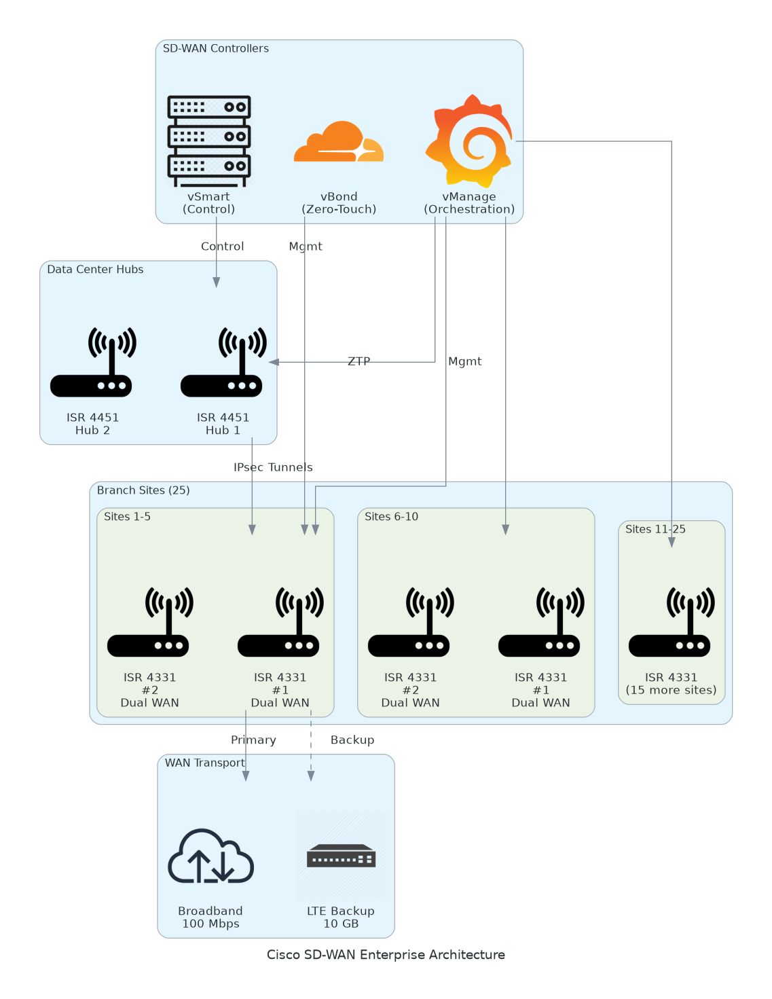

# Executive Summary

This Statement of Work (SOW) defines the scope, deliverables, roles, and terms for the Cisco DNA Center Network Analytics project for [Client Name]. This engagement will deliver an AI-powered network management platform to transform network operations, reduce troubleshooting time by 75%, and achieve 99.9% network uptime with predictive analytics and automation.

**Project Duration:** 16 weeks

---

# Background & Objectives

## Current State

[Client Name] currently operates a traditional network infrastructure with manual configuration and reactive troubleshooting. Key challenges include:
- **Reactive Troubleshooting:** Network issues diagnosed manually taking 4-6 hours per incident
- **Limited Visibility:** No centralized visibility into application performance and network health
- **Manual Provisioning:** New switch deployments take 4 hours per device with CLI configuration
- **Compliance Gaps:** Difficulty maintaining consistent security policies across 200+ devices
- **Unplanned Downtime:** Network failures detected after user complaints rather than proactively

## Business Objectives

The following objectives define the key business outcomes this engagement will deliver:

- **Transform to Proactive Operations:** Deploy AI-powered analytics to predict network failures 14 days in advance, reducing unplanned downtime by 90%
- **Reduce Troubleshooting Time:** Achieve 75% reduction in mean time to repair (MTTR) from 4-6 hours to under 1 hour through AI root cause analysis
- **Automate Device Provisioning:** Enable zero-touch provisioning reducing switch deployment time from 4 hours to 15 minutes
- **Improve Network Uptime:** Achieve 99.9% network availability SLA through predictive insights and automated remediation
- **Application Experience:** Monitor Office 365, Webex, and SAP performance with real-time SLA tracking and optimization
- **Operational Efficiency:** Reduce network management overhead by 60% through centralized DNA Center orchestration

## Success Metrics

Success will be measured against the following quantifiable metrics:

- 75% reduction in network troubleshooting time (MTTR < 1 hour)
- 99.9% network uptime SLA achievement
- Zero-touch provisioning for new sites (deployment in hours vs weeks)
- 85% reduction in configuration errors through automation
- 14-day advance warning for device failures

---

# Scope of Work

## In Scope

The following items are included within the scope of this engagement:

- Network discovery and assessment of 200 devices
- DNA Center appliance deployment with HA configuration
- AI Network Analytics and assurance configuration
- Zero-touch provisioning and automation workflows
- Application experience monitoring for critical business apps
- Integration with Active Directory, ServiceNow, and NetBox
- SD-Access fabric deployment for 100 devices (optional)
- Testing and validation across campus, branch, and data center
- Knowledge transfer and documentation
- 4-week hypercare support period

### Scope Parameters

This engagement is sized based on the following parameters:

<!-- BEGIN SCOPE_PARAMETERS_TABLE -->
<!-- TABLE_CONFIG: widths=[25, 35, 40] -->
| Category | Parameter | Scope |
|----------|-----------|-------|
| Solution Scope | Primary Features/Capabilities | DNA Center for 200 devices |
| Solution Scope | Customization Level | Standard DNA Center deployment |
| Integration | External System Integrations | 2 systems (AD + ITSM) |
| Integration | Data Sources | Network devices only |
| User Base | Total Users | 10 network administrators |
| User Base | User Roles | 2 roles (admin + viewer) |
| Data Volume | Data Processing Volume | 200 devices telemetry |
| Data Volume | Data Storage Requirements | 500 GB (90-day retention) |
| Technical Environment | Deployment Regions | Single data center |
| Technical Environment | Availability Requirements | Standard (99.5%) |
| Technical Environment | Infrastructure Complexity | Basic campus network |
| Security & Compliance | Security Requirements | Basic 802.1X and encryption |
| Security & Compliance | Compliance Frameworks | Basic logging |
| Performance | Performance Requirements | Standard telemetry |
| Environment | Deployment Environments | Production only |
<!-- END SCOPE_PARAMETERS_TABLE -->

Table: Engagement Scope Parameters

*Note: Changes to these parameters may require scope adjustment and additional investment.*

## Out of Scope

These items are not in scope unless added via change control:
- Hardware procurement beyond DNA Center appliances
- Network device hardware upgrades or replacements
- Wireless LAN controller upgrades or replacements
- End-user training (network team only)
- Managed services post-hypercare period
- Network redesign or re-architecture
- Third-party software licenses (NetBox, ServiceNow)

## Activities

### Phase 1 – Foundation (Weeks 1-4)

During this initial phase, the Vendor will perform comprehensive network discovery and deploy DNA Center infrastructure.

Key activities:
- Network discovery and assessment of 200 devices
- Capacity analysis and device compatibility validation
- DNA Center appliance deployment (primary + secondary HA)
- Initial device onboarding for 50 pilot devices
- Policy framework design for automation and analytics

**Deliverable:** Network Assessment Report

### Phase 2 – Automation & Analytics (Weeks 5-8)

In this phase, remaining devices are onboarded and automation workflows configured.

Key activities:
- Remaining device onboarding (150 devices) with automated discovery
- Network policies and automation workflows (VLAN, ACL, compliance)
- AI analytics and assurance configuration with anomaly detection
- Predictive insights enablement for proactive failure detection
- Dashboard and reporting configuration

**Deliverable:** Automation Playbook and Analytics Configuration Guide

### Phase 3 – Advanced Features (Weeks 9-12)

Implementation of advanced capabilities including application monitoring and integrations.

Key activities:
- Application experience monitoring for Office 365, Webex, SAP
- ServiceNow integration with automated ticket creation
- NetBox IPAM integration for inventory management
- SD-Access fabric design and deployment for 100 devices (optional)
- TrustSec micro-segmentation policies (optional)

**Deliverable:** Integration Documentation and SD-Access Design

### Phase 4 – Optimization (Weeks 13-16)

The solution undergoes validation, fine-tuning, and operational handoff.

Key activities:
- Validation testing and policy fine-tuning
- Performance baseline establishment
- Team training (32 hours) with hands-on labs
- Runbooks and operational documentation
- Hypercare support activation

**Deliverable:** As-Built Documentation and Operational Runbooks

---

# Deliverables & Timeline

This section outlines the key deliverables, project milestones, and timeline for the DNA Center Network Analytics implementation. All deliverables are subject to formal acceptance by designated client stakeholders before proceeding to subsequent phases.

## Deliverables

The following deliverables will be produced throughout the project lifecycle, with formal acceptance required from designated client stakeholders:

<!-- TABLE_CONFIG: widths=[8, 40, 12, 20, 20] -->
| # | Deliverable | Type | Due Date | Acceptance By |
|---|-------------|------|----------|---------------|
| 1 | Network Assessment Report | Document | Week 4 | Client IT Lead |
| 2 | Automation Playbook | Document | Week 8 | Network Lead |
| 3 | Integration Documentation | Document | Week 12 | Operations Lead |
| 4 | As-Built Documentation | Document | Week 16 | Client IT Lead |
| 5 | Knowledge Transfer Sessions | Live/Recorded | Week 16 | Network Team |

## Project Milestones

The project will be tracked against the following key milestones, representing major completion points and readiness gates for the next phase:

<!-- TABLE_CONFIG: widths=[20, 55, 25] -->
| Milestone | Description | Target Date |
|-----------|-------------|-------------|
| M1 - Foundation Complete | DNA Center deployed with 50 devices onboarded | Week 4 |
| M2 - Analytics Operational | All 200 devices onboarded with analytics enabled | Week 8 |
| M3 - Integrations Complete | ServiceNow NetBox and app monitoring live | Week 12 |
| M4 - Go-Live | Production operational handoff | Week 16 |
| Hypercare End | Support period complete | Week 20 |

---

# Roles & Responsibilities

This section defines the roles, responsibilities, and accountabilities for both Vendor and Client teams throughout the project lifecycle using a RACI matrix framework.

## RACI Matrix

The following RACI matrix defines responsibility assignments for key project activities across Vendor and Client roles:

<!-- TABLE_CONFIG: widths=[28, 11, 11, 11, 11, 9, 9, 10] -->
| Task/Role | EO PM | EO Quarterback | EO Network Eng | EO Automation | Client Net | Client Ops | SME |
|-----------|-------|----------------|----------------|---------------|------------|------------|-----|
| Discovery & Requirements | A | R | R | C | C | I | C |
| DNA Center Deployment | C | A | R | C | C | I | I |
| Device Onboarding | C | R | A | C | C | I | I |
| Analytics Configuration | C | A | R | R | I | C | I |
| Integration Setup | C | R | C | A | I | A | I |
| Testing & Validation | R | R | C | R | A | C | I |
| Knowledge Transfer | A | R | R | C | C | I | I |

**Legend:** R = Responsible | A = Accountable | C = Consulted | I = Informed

## Key Personnel

The following personnel will be assigned to this engagement:

**Vendor Team:**
- EO Project Manager: Overall delivery accountability
- EO Quarterback: Technical design and architecture oversight
- EO Network Engineer: DNA Center deployment and configuration
- EO Automation Engineer: Policy automation and integration

**Client Team:**
- Network Lead: Primary technical contact
- Operations Lead: Day-to-day operations and monitoring
- Security Lead: Security policy and compliance approval
- Application SME: Application experience requirements

---

# Architecture & Design

## Architecture Overview

The following diagram illustrates the high-level architecture for the proposed solution:

**Figure 1: DNA Center Network Analytics Architecture** - AI-powered network management platform

The proposed architecture provides centralized network management, AI-driven analytics, and automation for 200 devices. Key components include:

- **Management Tier:** Cisco DNA Center appliances (primary + secondary HA)
- **Analytics Tier:** AI Network Analytics with predictive insights and anomaly detection
- **Integration Tier:** ServiceNow ITSM, NetBox IPAM, Active Directory identity
- **Network Infrastructure:** Catalyst switches, ISR routers, wireless controllers

## Architecture Type

This solution follows a **centralized orchestration** architecture pattern. Key characteristics:

- **Scaling Approach:** Horizontal scaling with additional DNA Center nodes for capacity
- **Deployment Model:** On-premises DNA Center appliances with cloud integration (Cisco Intersight)
- **Management Paradigm:** Intent-based networking with policy-driven automation
- **Communication Patterns:** Controller-based with NETCONF/RESTCONF to network devices

The architecture is designed to support the 200-device scope with capacity to scale to 500+ devices.

## Scope Specifications

This engagement is scoped for a **Medium (200-device)** deployment:

**DNA Center Infrastructure:**
- Medium (200 devices): Primary DN2-HW-APL + Secondary HA, 32 vCPU, 256 GB RAM
- Large (500 devices): DN2-HW-APL-L with clustered nodes, 64 vCPU, 512 GB RAM

**Software Licensing:**
- Medium (200 devices): DNA Advantage + AI Analytics (200 device licenses)
- Large (500 devices): DNA Premier with advanced security and analytics

**Network Scope:**
- Medium (200 devices): Campus + branch + data center (2-3 sites)
- Large (500 devices): Multi-site distributed deployment (5+ locations)

**Integration Complexity:**
- Medium (200 devices): 3 integrations (AD, ServiceNow, NetBox)
- Large (500 devices): 6+ integrations including SIEM, APM, cloud orchestration

Changes to scope level will require adjustment to infrastructure resources, timeline, and investment.

## Application Hosting

DNA Center appliances will be hosted in the client data center:

**Compute Services:**
- Primary DN2-HW-APL appliance (200-device capacity)
- Secondary DN2-HW-APL for high availability
- Hosted on dedicated hardware appliances (not virtualized)

**Deployment Approach:**
- Rack-mounted appliances with redundant power and network
- HA configuration with automatic failover
- Integration with existing network infrastructure

## Networking

The networking architecture follows Cisco SD-Access and traditional campus best practices:

**Network Topology:**
- Campus core with distribution and access layers
- Branch offices with direct WAN connectivity
- Data center with redundant uplinks

**Connectivity:**
- DNA Center management network connectivity
- NETCONF/RESTCONF to managed devices
- SNMP, syslog, and NetFlow telemetry collection

**Security Controls:**
- 802.1X authentication for user and device access
- TrustSec micro-segmentation (optional)
- Encrypted management protocols (SSH, HTTPS)
- Role-based access control (RBAC) for DNA Center

## Observability

Comprehensive observability ensures proactive network management:

**Logging:**
- Centralized syslog collection from all 200 devices
- 90-day log retention for troubleshooting and compliance
- Automated log correlation and anomaly detection

**Monitoring:**
- Real-time device health monitoring (CPU, memory, interfaces)
- Application performance monitoring (Office 365, Webex, SAP)
- Network path analysis and hop-by-hop visibility
- Wireless client connectivity and roaming analytics

**Alerting:**
- Predictive alerts for device failures (14-day advance warning)
- Performance threshold alerts for SLA violations
- Automated ticket creation in ServiceNow for critical issues

## Backup & Disaster Recovery

All configurations and data are protected:

**Backup Strategy:**
- Automated nightly backups of DNA Center configuration
- Device configuration backups stored in DNA Center
- Cross-site replication to secondary HA node
- 30-day backup retention

**Disaster Recovery:**
- Recovery Time Objective (RTO): 4 hours
- Recovery Point Objective (RPO): 24 hours
- HA failover for DNA Center (automatic)
- Documented recovery procedures

## Technical Implementation Strategy

The deployment follows a phased approach with pilot validation:

**Migration Patterns:**
- Pilot with 50 devices to validate automation workflows
- Incremental onboarding in waves (50 → 100 → 200 devices)
- Policy enforcement phased rollout (monitor → enforce)

**Infrastructure as Code:**
- DNA Center templates for device configurations
- Policy as code for automation workflows
- Version control for templates and policies

---

# Security & Compliance

## Identity & Access Management

Identity and access controls ensure secure operations:

- Role-based access control (RBAC) for DNA Center administrators
- Active Directory integration with LDAP for authentication
- Multi-factor authentication (MFA) for privileged access
- Audit logging for all administrative actions

## Monitoring & Threat Detection

Comprehensive monitoring ensures security visibility across the infrastructure:

- Real-time security monitoring through DNA Center assurance
- Encrypted management protocols (SSH, HTTPS, NETCONF/TLS)
- Anomaly detection for unusual device or network behavior
- Integration with SIEM for security analytics (optional)

## Compliance & Auditing

The solution addresses the following compliance and audit requirements:

- Configuration compliance validation against baselines
- Automated drift detection and remediation
- Audit trails for all configuration changes
- Compliance reporting for PCI DSS or HIPAA requirements

**Audit Capabilities:**
- Change tracking with who/what/when/why
- Policy compliance scoring
- Security posture dashboards
- Automated compliance remediation

## Encryption & Key Management

Data protection is ensured through comprehensive encryption controls:

- TLS 1.2+ for all DNA Center communications
- SSH for device management
- 802.1X with EAP-TLS for network access (optional)
- Certificate management for device authentication

---

# Testing & Validation

## Functional Validation

Comprehensive testing ensures all features work as designed:

**End-to-End Testing:**
- Device discovery and onboarding workflows
- Zero-touch provisioning for new switches
- Policy automation and template application
- AI analytics and predictive insights validation

**Integration Testing:**
- Active Directory authentication
- ServiceNow ticket creation and closure
- NetBox inventory synchronization
- Application experience data collection

## Performance & Load Testing

Performance validation ensures the solution meets requirements:

**Load Testing:**
- 200-device telemetry ingestion and processing
- Dashboard and reporting performance
- Concurrent administrator access (10 users)

**Benchmarking:**
- Telemetry latency (target: < 5 minutes)
- Dashboard response time (target: < 3 seconds)
- Policy deployment time (target: < 5 minutes for 200 devices)

## Security Testing

Security validation to ensure compliance:

**Vulnerability Assessment:**
- DNA Center appliance security hardening verification
- Role-based access control (RBAC) validation
- Encrypted communication verification

**Compliance Validation:**
- Configuration compliance against organizational standards
- Audit logging completeness
- Access control verification

## User Acceptance Testing (UAT)

UAT is performed in coordination with Client network team:

**UAT Approach:**
- Lab environment for hands-on testing
- Operational workflow validation
- Dashboard and reporting validation
- Knowledge transfer during UAT

**Acceptance Criteria:**
- All devices successfully onboarded
- Analytics and assurance operational
- Integrations functional
- Team trained and confident

---

# Handover & Support

## Handover Artifacts

Upon successful implementation, the following artifacts will be delivered:

**Documentation Deliverables:**
- As-built architecture diagrams
- DNA Center configuration documentation
- Policy templates and automation workflows
- Integration configuration guides
- Network topology and device inventory

**Operational Deliverables:**
- Operations runbooks and SOPs
- Troubleshooting guides
- Monitoring and alerting procedures
- Escalation and incident response playbooks

**Knowledge Assets:**
- Recorded training sessions
- DNA Center administrator credentials
- Integration API keys and credentials
- Vendor support contacts

## Knowledge Transfer

Knowledge transfer ensures the Client team can operate DNA Center:

**Training Sessions:**
- 32 hours of hands-on training (live and recorded)
- DNA Center operations and monitoring
- Policy automation and template management
- Troubleshooting and incident response
- Application experience analytics

**Documentation Package:**
- As-built architecture documentation
- Configuration management guide
- Operational runbooks and SOPs
- Troubleshooting and optimization guide

## Hypercare Support

Post-implementation support for smooth transition:

**Duration:** 4 weeks post-go-live

**Coverage:**
- Business hours support (8 AM - 6 PM local time)
- 4-hour response time for critical issues
- Daily health check calls (first 2 weeks)
- Weekly status meetings

**Scope:**
- Issue investigation and resolution
- Performance tuning and optimization
- Policy adjustments and fine-tuning
- Knowledge transfer continuation

## Assumptions

### General Assumptions

This engagement is based on the following assumptions:

**Client Responsibilities:**
- Client will provide timely access to network devices and DNA Center appliances
- Client network team will be available for requirements validation and testing
- Client will provide Active Directory, ServiceNow, and NetBox integration credentials
- Client will handle internal change management and stakeholder communication

**Technical Environment:**
- Network devices are IOS-XE 16.12+ or NX-OS compatible with DNA Center
- Network connectivity and bandwidth sufficient for telemetry collection
- Data center rack space, power, and network available for DNA Center appliances
- Active Directory, ServiceNow, and NetBox systems are operational

**Project Execution:**
- Project scope and requirements will remain stable during implementation
- Resources (both Vendor and Client) will be available per project plan
- No major network changes during pilot and deployment phases
- Security and compliance approvals will not delay critical path activities

## Dependencies

### Project Dependencies

Critical dependencies for successful project execution:

**Access & Infrastructure:**
- Data center rack space and power for DNA Center appliances (Week 1)
- Network management connectivity to all 200 devices
- DNS and NTP services for DNA Center
- SMTP for email notifications

**Data & Integration:**
- Active Directory LDAP integration credentials (Week 2)
- ServiceNow API credentials and ITSM instance access (Week 6)
- NetBox API credentials and IPAM data (Week 6)
- Application monitoring requirements documented (Week 6)

**Resources & Expertise:**
- Client network team available for device onboarding validation
- Security team available for policy approval and compliance sign-off
- Operations team available for knowledge transfer
- Application SMEs for performance monitoring requirements

---

# Investment Summary

## Total Investment

This section provides a comprehensive overview of the total investment required for this engagement.

<!-- BEGIN COST_SUMMARY_TABLE -->
<!-- TABLE_CONFIG: widths=[25, 15, 12, 15, 11, 11, 11] -->
| Cost Category | Year 1 List | AWS/Partner Credits | Year 1 Net | Year 2 | Year 3 | 3-Year Total |
|---------------|-------------|---------------------|------------|--------|--------|--------------|
| Professional Services | $0 | $0 | $0 | $0 | $0 | $0 |
| Hardware | $120,000 | $0 | $120,000 | $0 | $0 | $120,000 |
| Software Licenses | $110,000 | ($20,000) | $90,000 | $110,000 | $110,000 | $310,000 |
| Support & Maintenance | $18,000 | $0 | $18,000 | $18,000 | $18,000 | $54,000 |
| **TOTAL INVESTMENT** | **$248,000** | **($20,000)** | **$228,000** | **$128,000** | **$128,000** | **$484,000** |
<!-- END COST_SUMMARY_TABLE -->

## Partner Credits

**Year 1 Credits Applied:** $20,000 (DNA license promotion)

**Annual Recurring Cost:** $128,000/year (software licenses and support)

## Payment Terms

This section outlines the pricing model and payment schedule for the engagement:

**Pricing Model:** Fixed price with milestone-based payments

**Payment Schedule:**
- 30% upon SOW execution and project kickoff ($93,930)
- 30% upon completion of Phase 2 - Analytics Operational ($93,930)
- 25% upon completion of Phase 3 - Integrations Complete ($78,275)
- 15% upon successful go-live and project acceptance ($46,965)

**Invoicing:** Monthly invoicing based on milestones completed. Net 30 payment terms.

---

# Terms & Conditions

## General Terms

All services will be delivered in accordance with the executed Master Services Agreement (MSA) between Vendor and Client.

## Scope Changes

Any changes to scope, schedule, or cost require a formal Change Request approved by both parties. Impact assessment will be provided within 5 business days.

## Intellectual Property

Intellectual property rights are allocated as follows:

- Client retains ownership of all deliverables, configurations, and documentation
- Vendor retains proprietary methodologies, tools, and accelerators
- Pre-existing IP remains with original owner

## Confidentiality

Confidentiality obligations govern information exchanged during this engagement:

- All exchanged artifacts under NDA protection
- Client data handled per security requirements
- No disclosure to third parties without consent

---

# Sign-Off

By signing below, both parties agree to the scope, approach, and terms outlined in this Statement of Work.

**Client Authorized Signatory:**

Name: ______________________________

Title: ______________________________

Signature: __________________________

Date: ______________________________

**Service Provider Authorized Signatory:**

Name: ______________________________

Title: ______________________________

Signature: __________________________

Date: ______________________________

---
