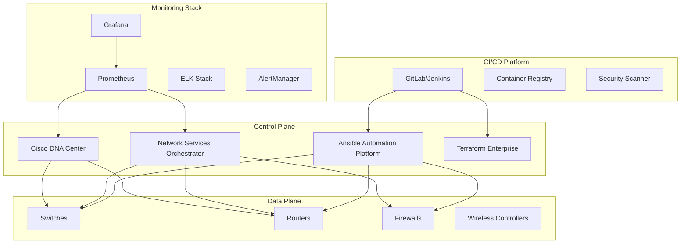
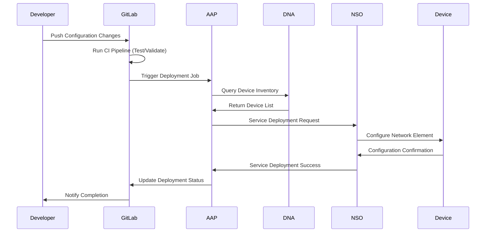
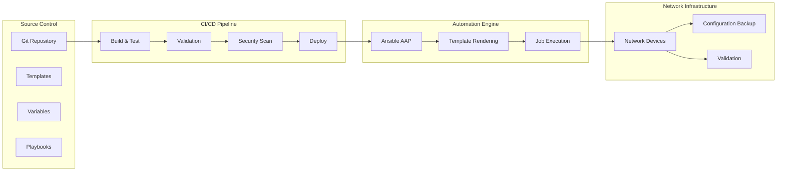
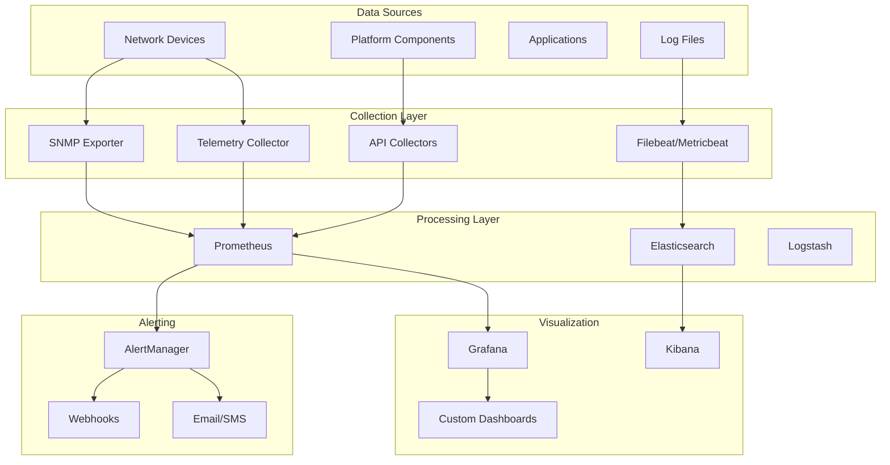
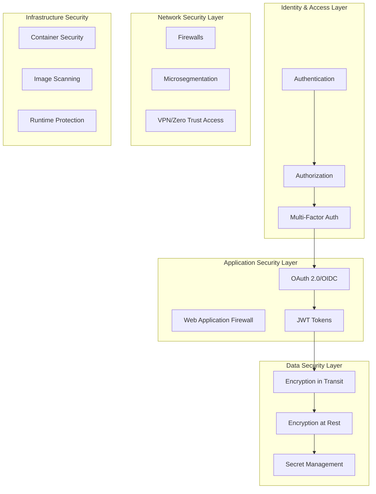
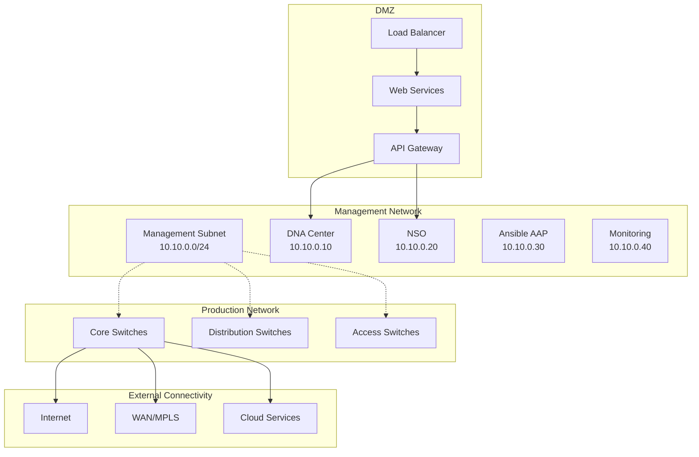
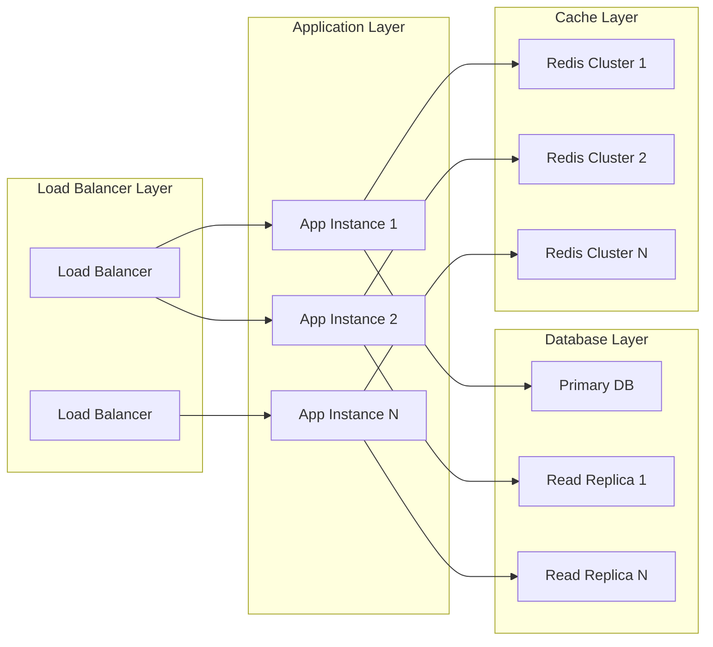

# Cisco CI/CD Automation Solution Architecture

## Table of Contents

1. [Overview](#overview)
2. [Architecture Principles](#architecture-principles)
3. [Solution Components](#solution-components)
4. [Integration Architecture](#integration-architecture)
5. [Data Flow Architecture](#data-flow-architecture)
6. [Security Architecture](#security-architecture)
7. [Network Architecture](#network-architecture)
8. [Deployment Architecture](#deployment-architecture)
9. [Scalability and Performance](#scalability-and-performance)
10. [High Availability Design](#high-availability-design)

## Overview

The Cisco CI/CD Automation solution provides a comprehensive platform for automating network infrastructure management through intent-based networking, Infrastructure as Code (IaC), and DevOps practices. The architecture is designed to support enterprise-scale deployments with high availability, security, and scalability requirements.

### Architecture Goals

- **Scalability**: Support 100 to 10,000+ network devices
- **Reliability**: 99.9% uptime with automated failover
- **Security**: End-to-end security with zero-trust principles
- **Performance**: Sub-second response times for API operations
- **Flexibility**: Multi-vendor and multi-cloud support
- **Automation**: Zero-touch operations and self-healing capabilities

### Key Features

- Intent-based network automation with Cisco DNA Center
- Multi-vendor network orchestration with NSO
- Infrastructure as Code with Terraform and Ansible
- Continuous Integration/Continuous Deployment pipelines
- Comprehensive monitoring and observability
- Enterprise security and compliance controls

## Architecture Principles

### 1. Microservices Architecture
The solution follows microservices principles with loosely coupled, independently deployable components that communicate through well-defined APIs.

### 2. API-First Design
All components expose RESTful APIs enabling integration, automation, and third-party extensions while maintaining backward compatibility.

### 3. Infrastructure as Code
All infrastructure, configurations, and policies are defined as code, version-controlled, and deployed through automated pipelines.

### 4. Zero Trust Security
Comprehensive security model with authentication, authorization, encryption, and auditing at every layer of the architecture.

### 5. Cloud-Native Patterns
Leverages containerization, orchestration, and cloud-native patterns for portability and scalability across deployment environments.

### 6. Event-Driven Architecture
Implements event-driven patterns for real-time responses, monitoring, and integration between components.

## Solution Components

### Core Platform Components



### Cisco DNA Center
**Role**: Intent-based network controller and policy engine
**Components**:
- **DNA Center Platform**: Core orchestration and management platform
- **Intent API**: Northbound API for intent-based automation
- **Assurance**: Network monitoring and analytics
- **Policy Engine**: Network policy automation and enforcement

**Key Capabilities**:
- Device discovery and onboarding
- Template-based configuration management
- Policy automation and compliance
- Network assurance and analytics
- Software image management

### Network Services Orchestrator (NSO)
**Role**: Multi-vendor service orchestration and lifecycle management
**Components**:
- **NSO Core**: Service orchestration engine
- **NEDs (Network Element Drivers)**: Device-specific communication modules
- **Service Models**: YANG-based service definitions
- **CDB (Configuration Database)**: Centralized configuration management

**Key Capabilities**:
- Multi-vendor device support
- Service lifecycle management
- Transaction-based operations
- Configuration rollback and validation
- Real-time synchronization

### Ansible Automation Platform (AAP)
**Role**: Configuration management and workflow automation
**Components**:
- **Automation Controller**: Job scheduling and execution engine
- **Automation Hub**: Content repository and distribution
- **Event-Driven Ansible**: Real-time automation triggers
- **Automation Analytics**: Performance and usage analytics

**Key Capabilities**:
- Playbook execution and scheduling
- Inventory and credential management
- Workflow orchestration
- Role-based access control
- API and webhook integration

### Terraform Enterprise
**Role**: Infrastructure as Code provisioning and management
**Components**:
- **Terraform Cloud/Enterprise**: Remote state management and execution
- **Workspaces**: Environment isolation and organization
- **Policy as Code**: Sentinel policy enforcement
- **VCS Integration**: Version control system integration

**Key Capabilities**:
- Infrastructure provisioning
- State management and locking
- Policy enforcement
- Cost estimation and management
- Collaborative workflows

### CI/CD Pipeline Platform
**Role**: Continuous integration and deployment automation
**Components**:
- **GitLab/Jenkins**: Pipeline orchestration and management
- **Container Registry**: Container image storage and distribution
- **Security Scanner**: Vulnerability assessment and compliance
- **Artifact Repository**: Build artifact storage and management

**Key Capabilities**:
- Source code management
- Automated testing and validation
- Security scanning and compliance
- Deployment automation
- Environment promotion

## Integration Architecture

### API Integration Layer



### Integration Patterns

#### 1. Event-Driven Integration
```python
# Event-driven integration example
class NetworkEventHandler:
    def __init__(self):
        self.event_bus = EventBus()
        self.subscribers = []
    
    def handle_device_down_event(self, event):
        """Handle device down events"""
        device_id = event.get('device_id')
        
        # Trigger automated response
        self.trigger_failover(device_id)
        
        # Send notifications
        self.send_alert(event)
        
        # Update monitoring dashboards
        self.update_metrics(event)
    
    def trigger_failover(self, device_id):
        """Trigger automated failover procedures"""
        failover_playbook = "playbooks/device-failover.yml"
        extra_vars = {"failed_device": device_id}
        
        # Execute failover automation
        ansible_api.run_playbook(failover_playbook, extra_vars)
```

#### 2. API Gateway Pattern
```yaml
# API Gateway configuration
apiVersion: networking.istio.io/v1beta1
kind: Gateway
metadata:
  name: network-automation-gateway
spec:
  selector:
    istio: ingressgateway
  servers:
  - port:
      number: 443
      name: https
      protocol: HTTPS
    tls:
      mode: SIMPLE
      credentialName: api-gateway-cert
    hosts:
    - api.network-automation.company.com
  
  # Route definitions
  routes:
  - match:
    - uri:
        prefix: "/dnac/"
    route:
    - destination:
        host: dna-center-service
        port:
          number: 443
  - match:
    - uri:
        prefix: "/nso/"
    route:
    - destination:
        host: nso-service
        port:
          number: 8080
```

#### 3. Message Queue Integration
```python
# RabbitMQ integration for async operations
import pika
import json

class NetworkMessageQueue:
    def __init__(self, rabbitmq_url):
        self.connection = pika.BlockingConnection(
            pika.URLParameters(rabbitmq_url)
        )
        self.channel = self.connection.channel()
        self.setup_queues()
    
    def setup_queues(self):
        """Setup message queues for network operations"""
        queues = [
            'config_deployment',
            'device_monitoring', 
            'compliance_check',
            'backup_operations'
        ]
        
        for queue in queues:
            self.channel.queue_declare(queue=queue, durable=True)
    
    def publish_config_job(self, device_list, config_template):
        """Publish configuration deployment job"""
        message = {
            'job_type': 'config_deployment',
            'devices': device_list,
            'template': config_template,
            'timestamp': datetime.now().isoformat()
        }
        
        self.channel.basic_publish(
            exchange='',
            routing_key='config_deployment',
            body=json.dumps(message),
            properties=pika.BasicProperties(delivery_mode=2)  # Persistent
        )
```

## Data Flow Architecture

### Configuration Management Flow



### Monitoring Data Flow



## Security Architecture

### Zero Trust Security Model



### Security Controls Implementation

#### 1. Authentication and Authorization
```yaml
# RBAC Configuration Example
apiVersion: rbac.authorization.k8s.io/v1
kind: Role
metadata:
  namespace: network-automation
  name: network-engineer
rules:
- apiGroups: [""]
  resources: ["configmaps", "secrets"]
  verbs: ["get", "list"]
- apiGroups: ["batch"]
  resources: ["jobs"]
  verbs: ["create", "get", "list", "watch"]

---
apiVersion: rbac.authorization.k8s.io/v1
kind: RoleBinding
metadata:
  name: network-engineer-binding
  namespace: network-automation
subjects:
- kind: User
  name: john.doe@company.com
  apiGroup: rbac.authorization.k8s.io
roleRef:
  kind: Role
  name: network-engineer
  apiGroup: rbac.authorization.k8s.io
```

#### 2. Secret Management
```python
# HashiCorp Vault integration
import hvac

class SecretManager:
    def __init__(self, vault_url, vault_token):
        self.client = hvac.Client(url=vault_url, token=vault_token)
    
    def get_network_credentials(self, device_group):
        """Retrieve network device credentials from Vault"""
        secret_path = f"secret/network/{device_group}"
        
        try:
            response = self.client.secrets.kv.v2.read_secret_version(
                path=secret_path
            )
            return response['data']['data']
        except Exception as e:
            raise Exception(f"Failed to retrieve credentials: {str(e)}")
    
    def rotate_credentials(self, device_group, new_credentials):
        """Rotate network device credentials"""
        secret_path = f"secret/network/{device_group}"
        
        # Store new credentials
        self.client.secrets.kv.v2.create_or_update_secret(
            path=secret_path,
            secret=new_credentials
        )
        
        # Trigger credential update on devices
        self.update_device_credentials(device_group, new_credentials)
```

#### 3. Network Segmentation
```yaml
# Network Policy for Microsegmentation
apiVersion: networking.k8s.io/v1
kind: NetworkPolicy
metadata:
  name: network-automation-policy
  namespace: network-automation
spec:
  podSelector:
    matchLabels:
      app: network-automation
  policyTypes:
  - Ingress
  - Egress
  ingress:
  - from:
    - namespaceSelector:
        matchLabels:
          name: network-automation
    - podSelector:
        matchLabels:
          role: automation-controller
    ports:
    - protocol: TCP
      port: 8080
  egress:
  - to:
    - namespaceSelector:
        matchLabels:
          name: network-infrastructure
    ports:
    - protocol: TCP
      port: 22
    - protocol: TCP
      port: 443
```

## Network Architecture

### Physical Network Topology



### Logical Network Architecture

#### Network Segmentation
- **Management VLAN**: 10.10.0.0/24 - Automation platform components
- **Production VLAN**: 10.1.0.0/16 - Production network devices
- **DMZ VLAN**: 10.20.0.0/24 - External-facing services
- **Backup VLAN**: 10.30.0.0/24 - Backup and replication traffic

#### Security Zones
1. **Trusted Zone**: Automation platform components
2. **Management Zone**: Network device management interfaces
3. **Production Zone**: Production network traffic
4. **DMZ Zone**: External-facing applications
5. **External Zone**: Internet and external services

## Deployment Architecture

### Container Orchestration

```yaml
# Kubernetes Deployment Example
apiVersion: apps/v1
kind: Deployment
metadata:
  name: network-automation-controller
  namespace: network-automation
spec:
  replicas: 3
  selector:
    matchLabels:
      app: automation-controller
  template:
    metadata:
      labels:
        app: automation-controller
    spec:
      containers:
      - name: controller
        image: automation-controller:v2.4
        ports:
        - containerPort: 8080
        env:
        - name: DATABASE_URL
          valueFrom:
            secretKeyRef:
              name: db-credentials
              key: url
        resources:
          requests:
            memory: "2Gi"
            cpu: "1"
          limits:
            memory: "4Gi"
            cpu: "2"
        livenessProbe:
          httpGet:
            path: /health
            port: 8080
          initialDelaySeconds: 30
          periodSeconds: 10
```

### Infrastructure as Code Deployment

```hcl
# Terraform deployment configuration
module "network_automation_platform" {
  source = "./modules/network-automation"
  
  # Platform Configuration
  environment     = var.environment
  region         = var.aws_region
  vpc_cidr       = "10.10.0.0/16"
  
  # Component Configuration
  dna_center_config = {
    instance_type = "c5.4xlarge"
    storage_size  = "3000"
    backup_enabled = true
  }
  
  ansible_aap_config = {
    instance_type = "c5.2xlarge"
    replica_count = 3
    storage_size  = "500"
  }
  
  monitoring_config = {
    prometheus_storage = "1000"
    grafana_enabled   = true
    alertmanager_enabled = true
  }
  
  # Security Configuration
  enable_encryption = true
  enable_backup     = true
  ssl_certificate   = var.ssl_certificate
  
  tags = {
    Environment = var.environment
    Project     = "Network Automation"
    Owner       = "Infrastructure Team"
  }
}
```

## Scalability and Performance

### Horizontal Scaling Strategy



### Performance Optimization

#### 1. Database Optimization
```sql
-- PostgreSQL optimization for Ansible AAP
-- Connection pooling
ALTER SYSTEM SET max_connections = 200;
ALTER SYSTEM SET shared_buffers = '2GB';
ALTER SYSTEM SET effective_cache_size = '6GB';

-- Query optimization
CREATE INDEX CONCURRENTLY idx_job_status ON main_job(status);
CREATE INDEX CONCURRENTLY idx_job_created ON main_job(created);
CREATE INDEX CONCURRENTLY idx_jobevent_job_id ON main_jobevent(job_id);

-- Partitioning for large tables
CREATE TABLE main_job_events_y2024m01 PARTITION OF main_jobevent
FOR VALUES FROM ('2024-01-01') TO ('2024-02-01');
```

#### 2. Application Performance
```python
# Async operations for improved performance
import asyncio
import aiohttp
from concurrent.futures import ThreadPoolExecutor

class NetworkAutomationAPI:
    def __init__(self):
        self.executor = ThreadPoolExecutor(max_workers=50)
        self.session = None
    
    async def __aenter__(self):
        self.session = aiohttp.ClientSession()
        return self
    
    async def __aexit__(self, exc_type, exc_val, exc_tb):
        await self.session.close()
    
    async def deploy_configurations(self, devices, config_template):
        """Deploy configurations to multiple devices concurrently"""
        tasks = []
        
        async with aiohttp.ClientSession() as session:
            for device in devices:
                task = self.deploy_to_device(session, device, config_template)
                tasks.append(task)
            
            results = await asyncio.gather(*tasks, return_exceptions=True)
            return self.process_results(results)
    
    async def deploy_to_device(self, session, device, config):
        """Deploy configuration to individual device"""
        url = f"https://{device['ip']}/restconf/data/cisco-config"
        headers = {'Content-Type': 'application/yang-data+json'}
        
        async with session.post(url, json=config, headers=headers) as response:
            return {
                'device': device['hostname'],
                'status': response.status,
                'result': await response.json()
            }
```

## High Availability Design

### Multi-Region Deployment

```yaml
# Multi-region HA configuration
apiVersion: v1
kind: ConfigMap
metadata:
  name: ha-config
data:
  primary_region: "us-west-2"
  secondary_region: "us-east-1"
  replication_mode: "async"
  failover_threshold: "30s"
  
  components:
    dna_center:
      ha_mode: "active-passive"
      backup_schedule: "0 2 * * *"
      
    ansible_aap:
      ha_mode: "active-active"
      cluster_nodes: 3
      
    database:
      ha_mode: "master-slave"
      replication: "streaming"
      
    monitoring:
      ha_mode: "clustered"
      retention: "30d"
```

### Disaster Recovery

```python
# Automated disaster recovery procedures
class DisasterRecovery:
    def __init__(self, config):
        self.config = config
        self.backup_manager = BackupManager()
        self.monitoring = MonitoringService()
    
    def monitor_health(self):
        """Continuous health monitoring"""
        while True:
            health_status = self.check_system_health()
            
            if health_status['critical_failures'] > 0:
                self.trigger_failover()
            elif health_status['warnings'] > self.config['warning_threshold']:
                self.send_alert(health_status)
            
            time.sleep(30)  # Check every 30 seconds
    
    def trigger_failover(self):
        """Trigger automated failover to secondary region"""
        logger.critical("Triggering disaster recovery failover")
        
        # Stop services in primary region
        self.stop_primary_services()
        
        # Restore from latest backup in secondary region
        self.restore_secondary_region()
        
        # Update DNS to point to secondary region
        self.update_dns_records()
        
        # Verify services in secondary region
        self.verify_secondary_services()
        
        # Send notifications
        self.notify_stakeholders("DR_ACTIVATED")
```

### Backup and Recovery Strategy

#### Backup Types and Schedules
- **Full Backup**: Weekly (Sunday 2:00 AM)
- **Incremental Backup**: Daily (2:00 AM)
- **Configuration Backup**: Hourly
- **Transaction Log Backup**: Every 15 minutes

#### Recovery Time Objectives (RTO) and Recovery Point Objectives (RPO)
- **RTO**: Maximum 4 hours for full service restoration
- **RPO**: Maximum 15 minutes of data loss
- **Service Availability**: 99.9% uptime target

---

## Technology Stack Summary

### Core Technologies
- **Orchestration**: Cisco DNA Center, NSO
- **Automation**: Ansible Automation Platform
- **Infrastructure as Code**: Terraform Enterprise
- **CI/CD**: GitLab/Jenkins
- **Containers**: Docker, Kubernetes
- **Monitoring**: Prometheus, Grafana, ELK Stack
- **Security**: HashiCorp Vault, OAuth 2.0, TLS 1.3

### Supporting Technologies
- **Message Queue**: RabbitMQ/Apache Kafka
- **Database**: PostgreSQL, Redis
- **Load Balancing**: HAProxy, NGINX
- **Service Mesh**: Istio
- **Certificate Management**: Let's Encrypt, Internal CA
- **Backup**: Velero, Custom Scripts

---

**Document Version:** 1.0  
**Architecture Review Date:** [Date]  
**Next Review Date:** [Date + 6 months]  
**Architecture Owner:** Solution Architecture Team