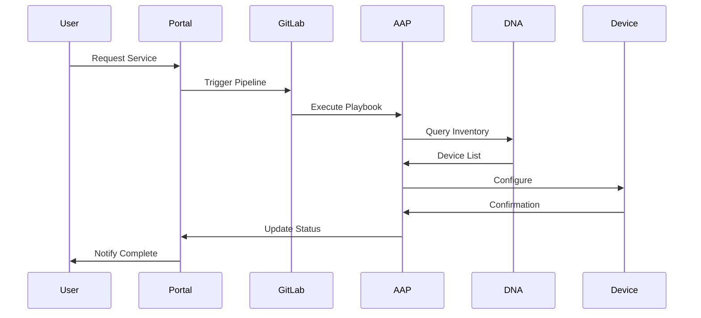

# Cisco CI/CD Automation Solution Design Document

## Document Information

**Project Name**: [Customer Name] - Cisco CI/CD Automation Implementation  
**Document Version**: 1.0  
**Date**: [Date]  
**Prepared By**: [Solution Architect Name]  
**Reviewed By**: [Technical Review Team]  
**Approved By**: [Customer Technical Lead]  

**Document Status**: [ ] Draft [ ] Under Review [ ] Approved [ ] Final

---

## Executive Summary

### Project Overview
This document presents the technical solution design for implementing Cisco CI/CD automation capabilities for [Customer Name]. The solution addresses the organization's requirements for network automation, operational efficiency, and digital transformation initiatives.

### Key Business Drivers
- **Operational Efficiency**: Reduce manual network operations by 80%
- **Service Velocity**: Achieve 10x faster service deployment
- **Risk Mitigation**: Eliminate 95% of configuration errors
- **Scalability**: Support unlimited business growth
- **Compliance**: Automate 100% of compliance reporting

### Solution Scope
- **Devices**: [Number] network devices across [Number] locations
- **Technologies**: Intent-based networking, Infrastructure as Code, CI/CD automation
- **Integration**: ITSM, monitoring, security, and cloud platforms
- **Timeline**: [Timeline] months implementation

### Investment and ROI
- **Total Investment**: $[Amount] over 3 years
- **Expected ROI**: [Percentage]% within [Timeline] months
- **Annual Savings**: $[Amount] in operational costs

---

## Section 1: Requirements Analysis

### 1.1 Business Requirements

#### Strategic Objectives
| Objective | Current State | Target State | Success Criteria |
|-----------|---------------|--------------|------------------|
| **Service Deployment Speed** | [Current time] | [Target time] | [Criteria] |
| **Operational Efficiency** | [Current FTE] | [Target FTE] | [Criteria] |
| **Network Reliability** | [Current uptime] | [Target uptime] | [Criteria] |
| **Configuration Accuracy** | [Current errors] | [Target errors] | [Criteria] |
| **Compliance Coverage** | [Current %] | [Target %] | [Criteria] |

#### Key Performance Indicators (KPIs)
- **Mean Time to Deploy**: Reduce from [X] hours to [Y] minutes
- **Change Success Rate**: Improve from [X]% to 99.5%
- **Mean Time to Repair**: Reduce from [X] hours to [Y] minutes
- **Automation Coverage**: Achieve [X]% of all network operations

### 1.2 Technical Requirements

#### Functional Requirements
| Requirement | Priority | Description | Acceptance Criteria |
|-------------|----------|-------------|---------------------|
| **Device Automation** | High | Automate configuration of all network devices | 100% device coverage |
| **Policy Enforcement** | High | Automated policy deployment and compliance | Real-time policy validation |
| **Service Orchestration** | Medium | End-to-end service provisioning | Zero-touch deployment |
| **Integration APIs** | High | Integration with existing systems | All specified integrations |
| **Monitoring and Alerting** | High | Comprehensive visibility and alerting | 360-degree visibility |

#### Non-Functional Requirements
| Requirement | Specification | Rationale |
|-------------|---------------|-----------|
| **Performance** | Sub-second API response times | User experience requirements |
| **Scalability** | Support [X] concurrent operations | Growth projection requirements |
| **Availability** | 99.9% uptime SLA | Business continuity requirements |
| **Security** | Zero-trust architecture | Regulatory and security requirements |
| **Backup/Recovery** | 4-hour RTO, 15-minute RPO | Business continuity requirements |

### 1.3 Constraints and Assumptions

#### Technical Constraints
- Must integrate with existing [System] infrastructure
- Limited to current network vendor platforms
- Must comply with [Regulatory] requirements
- Available implementation window: [Timeframe]

#### Business Constraints
- Budget limit: $[Amount]
- Resource availability: [Number] FTE
- No disruption to production services
- Phased implementation required

#### Assumptions
- Existing network devices support automation APIs
- Staff will be available for training and transition
- Current network documentation is accurate
- Management support for organizational change

---

## Section 2: Solution Architecture

### 2.1 Architecture Overview

#### High-Level Architecture Diagram
```
                    ┌─────────────────────────────────┐
                    │         Management Layer        │
                    │  ┌─────────┐    ┌─────────┐     │
                    │  │   DNA   │    │   NSO   │     │
                    │  │ Center  │    │ Platform│     │
                    │  └─────────┘    └─────────┘     │
                    └─────────────┬───────────────────┘
                                  │
                    ┌─────────────────────────────────┐
                    │      Automation Layer          │
                    │  ┌─────────┐    ┌─────────┐     │
                    │  │ Ansible │    │ GitLab  │     │
                    │  │   AAP   │    │ CI/CD   │     │
                    │  └─────────┘    └─────────┘     │
                    └─────────────┬───────────────────┘
                                  │
                    ┌─────────────────────────────────┐
                    │      Infrastructure Layer      │
                    │  Switches | Routers | Firewalls │
                    └─────────────────────────────────┘
```

#### Architecture Principles
1. **API-First Design**: All components expose and consume REST APIs
2. **Microservices Architecture**: Loosely coupled, independently deployable services
3. **Infrastructure as Code**: All configurations managed as versioned code
4. **Zero Trust Security**: Comprehensive security controls at every layer
5. **Cloud-Native Patterns**: Containerized, orchestrated, and scalable

### 2.2 Component Architecture

#### Cisco DNA Center
**Role**: Intent-based network controller and policy engine
**Deployment**: [Physical/Virtual] appliance in [Location]
**Specifications**:
- **CPU**: [Specification]
- **Memory**: [Specification]
- **Storage**: [Specification]
- **Network**: [Specification]

**Key Capabilities**:
- Device discovery and onboarding
- Template-based configuration management
- Policy automation and compliance
- Network assurance and analytics
- Software image management

#### Network Services Orchestrator (NSO)
**Role**: Multi-vendor service orchestration
**Deployment**: [Virtual machines/Containers] in [Location]
**Specifications**:
- **Instances**: [Number] for high availability
- **CPU**: [Specification] per instance
- **Memory**: [Specification] per instance
- **Storage**: [Specification] per instance

**Key Capabilities**:
- Multi-vendor device support
- Service lifecycle management
- Transaction-based operations
- Configuration rollback and validation

#### Ansible Automation Platform (AAP)
**Role**: Configuration management and workflow automation
**Deployment**: [Kubernetes cluster/VMs] in [Location]
**Specifications**:
- **Controller Nodes**: [Number] nodes
- **Execution Nodes**: [Number] nodes
- **Database**: [Specification]
- **Storage**: [Specification]

**Key Capabilities**:
- Playbook execution and scheduling
- Inventory and credential management
- Workflow orchestration
- API and webhook integration

### 2.3 Integration Architecture

#### Integration Points
| System | Integration Method | Data Flow | Frequency |
|--------|-------------------|-----------|-----------|
| **ITSM** | REST API | Bi-directional | Real-time |
| **Monitoring** | SNMP/API | Inbound | Continuous |
| **Identity Management** | LDAP/SAML | Authentication | Per session |
| **SIEM** | Syslog/API | Outbound | Real-time |
| **CMDB** | REST API | Bi-directional | Scheduled |

#### Data Flow Architecture


---

## Section 3: Detailed Design

### 3.1 Network Infrastructure Design

#### Physical Network Topology
```
Internet
    │
[Firewall]
    │
[Core Switches] ── [Data Center]
    │
[Distribution Switches]
    │
[Access Switches] ── [End Devices]
    │
[Management Network] ── [Automation Platform]
```

#### Network Segmentation
| Segment | VLAN | Subnet | Purpose |
|---------|------|---------|---------|
| **Management** | 10 | 10.10.0.0/24 | Device management |
| **Automation** | 20 | 10.20.0.0/24 | Automation platform |
| **Production** | 100-199 | 10.100.0.0/16 | Production traffic |
| **Development** | 200-299 | 10.200.0.0/16 | Development/testing |

#### Device Inventory and Grouping
| Location | Device Type | Count | Model | OS Version | Group |
|----------|-------------|-------|-------|------------|-------|
| **Headquarters** | Switches | [X] | [Model] | [Version] | HQ-SW |
| **Headquarters** | Routers | [X] | [Model] | [Version] | HQ-RTR |
| **Branch Sites** | Switches | [X] | [Model] | [Version] | BRANCH-SW |
| **Data Center** | Switches | [X] | [Model] | [Version] | DC-SW |

### 3.2 Automation Workflow Design

#### Service Request Workflow
1. **Request Initiation**: User submits service request via self-service portal
2. **Approval Process**: Automated approval based on business rules
3. **Resource Allocation**: System identifies and reserves required resources
4. **Configuration Generation**: Templates populated with service parameters
5. **Validation**: Pre-deployment validation and testing
6. **Deployment**: Automated deployment to target devices
7. **Verification**: Post-deployment validation and testing
8. **Documentation**: Automatic update of configuration management database

#### Change Management Integration
```yaml
# Example GitLab CI pipeline integration
stages:
  - validate
  - test
  - approve
  - deploy
  - verify

variables:
  ANSIBLE_HOST_KEY_CHECKING: "False"
  
validate_configuration:
  stage: validate
  script:
    - ansible-playbook --syntax-check playbooks/deploy.yml
    - yamllint inventories/
  
test_deployment:
  stage: test
  script:
    - ansible-playbook --check playbooks/deploy.yml
  
request_approval:
  stage: approve
  script:
    - create_change_request.py
  when: manual
  
deploy_configuration:
  stage: deploy
  script:
    - ansible-playbook playbooks/deploy.yml
  environment: production
  
verify_deployment:
  stage: verify
  script:
    - ansible-playbook playbooks/verify.yml
```

### 3.3 Security Design

#### Security Architecture
- **Authentication**: Multi-factor authentication for all administrative access
- **Authorization**: Role-based access control with principle of least privilege
- **Encryption**: TLS 1.3 for all communications, AES-256 for data at rest
- **Network Security**: Microsegmentation and zero-trust network access
- **Audit Logging**: Comprehensive logging and monitoring of all activities

#### Security Controls Implementation
| Control | Implementation | Monitoring |
|---------|---------------|------------|
| **Access Control** | RBAC with MFA | Real-time access logs |
| **Data Protection** | Encryption at rest/transit | Key management audit |
| **Network Security** | Firewalls, segmentation | Traffic analysis |
| **Vulnerability Management** | Automated scanning | Vulnerability reports |
| **Compliance** | Policy automation | Compliance dashboards |

---

## Section 4: Implementation Plan

### 4.1 Phased Implementation Approach

#### Phase 1: Foundation (Months 1-3)
**Scope**: Core platform deployment and basic automation

**Deliverables**:
- Cisco DNA Center deployment and configuration
- NSO platform installation and setup
- Ansible Automation Platform deployment
- Basic device onboarding and management
- Initial automation workflows

**Success Criteria**:
- All platforms operational and integrated
- 50% of devices under management
- Basic automation workflows deployed
- Team trained on platform operations

#### Phase 2: Integration (Months 4-6)
**Scope**: CI/CD pipeline development and systems integration

**Deliverables**:
- GitLab CI/CD pipeline implementation
- ITSM and monitoring system integration
- Advanced automation workflows
- Self-service portal deployment
- Comprehensive testing framework

**Success Criteria**:
- Full CI/CD pipeline operational
- All system integrations complete
- 80% automation coverage achieved
- Self-service capabilities available

#### Phase 3: Optimization (Months 7-9)
**Scope**: Advanced features and enterprise-wide deployment

**Deliverables**:
- Advanced analytics and reporting
- Compliance automation
- Performance optimization
- Enterprise-wide rollout
- Knowledge transfer and documentation

**Success Criteria**:
- 100% device coverage achieved
- Advanced features operational
- Performance targets met
- Team fully self-sufficient

### 4.2 Risk Mitigation Strategy

#### Implementation Risks and Mitigation
| Risk | Impact | Probability | Mitigation Strategy |
|------|--------|-------------|-------------------|
| **Technical Integration** | High | Medium | Proof of concept, expert resources |
| **Skills Gap** | Medium | High | Comprehensive training program |
| **Schedule Delays** | High | Medium | Phased approach, buffer time |
| **Budget Overruns** | High | Low | Fixed-price contracts, scope control |
| **Change Resistance** | Medium | Medium | Change management, communication |

### 4.3 Success Metrics and KPIs

#### Technical Metrics
| Metric | Baseline | Target | Measurement Method |
|--------|----------|--------|-------------------|
| **Deployment Time** | [X] hours | [Y] minutes | Automation logs |
| **Error Rate** | [X] per month | [Y] per month | Incident tracking |
| **Availability** | [X]% | 99.9% | Monitoring system |
| **Automation Coverage** | 0% | 90% | Platform metrics |

#### Business Metrics
| Metric | Baseline | Target | Measurement Method |
|--------|----------|--------|-------------------|
| **Cost per Change** | $[X] | $[Y] | Financial analysis |
| **Time to Market** | [X] days | [Y] hours | Business tracking |
| **Customer Satisfaction** | [X]/10 | [Y]/10 | Survey results |
| **ROI** | 0% | [X]% | Financial analysis |

---

## Section 5: Operational Model

### 5.1 Organization and Roles

#### Team Structure
| Role | Responsibilities | Skills Required | FTE |
|------|-----------------|----------------|-----|
| **Automation Architect** | Solution design, standards | Architecture, automation | 1.0 |
| **Network Automation Engineer** | Playbook development, testing | Ansible, Python, networking | 2.0 |
| **DevOps Engineer** | CI/CD pipelines, integration | DevOps, containers, APIs | 1.0 |
| **Operations Analyst** | Monitoring, reporting | Analytics, dashboards | 1.0 |

#### RACI Matrix
| Activity | Automation Architect | Network Engineer | DevOps Engineer | Operations Analyst |
|----------|---------------------|------------------|------------------|-------------------|
| **Solution Design** | A/R | C | C | I |
| **Playbook Development** | A | R | C | I |
| **Pipeline Management** | A | C | R | I |
| **Monitoring & Reporting** | A | I | C | R |

### 5.2 Service Management

#### Service Level Agreements (SLAs)
| Service | Availability | Performance | Response Time |
|---------|-------------|-------------|---------------|
| **Automation Platform** | 99.9% | <1 sec API response | 15 min |
| **Service Provisioning** | N/A | <30 min deployment | 4 hours |
| **Change Management** | N/A | <2 hour approval | 2 hours |
| **Incident Response** | N/A | N/A | 30 min |

#### Operating Procedures
- **Daily Operations**: Health checks, monitoring review, queue management
- **Weekly Operations**: Performance review, capacity planning, reporting
- **Monthly Operations**: Service review, process improvement, training
- **Quarterly Operations**: Architecture review, technology updates, planning

### 5.3 Change Management

#### Change Control Process
1. **Request Submission**: Automated via self-service portal or API
2. **Impact Assessment**: Automated risk and impact analysis
3. **Approval Workflow**: Risk-based approval routing
4. **Testing Validation**: Automated testing in non-production environments
5. **Deployment**: Automated deployment with rollback capability
6. **Verification**: Automated post-deployment validation
7. **Documentation**: Automatic configuration management database updates

#### Change Categories
| Category | Approval Required | Testing Required | Deployment Method |
|----------|------------------|------------------|-------------------|
| **Standard** | Automated | Automated | Fully automated |
| **Normal** | Manager approval | Full testing | Automated with approval |
| **Emergency** | Post-implementation | Minimal | Manual with automation support |
| **Major** | CAB approval | Comprehensive | Phased with validation gates |

---

## Section 6: Technology Specifications

### 6.1 Hardware Requirements

#### Compute Infrastructure
| Component | Quantity | Specification | Purpose |
|-----------|----------|---------------|---------|
| **DNA Center Appliance** | [X] | [Specification] | Network controller |
| **Compute Servers** | [X] | [Specification] | Automation platform |
| **Database Servers** | [X] | [Specification] | Data persistence |
| **Storage Array** | [X] | [Specification] | Shared storage |
| **Network Equipment** | [X] | [Specification] | Infrastructure connectivity |

#### Network Requirements
- **Management Network**: Dedicated VLAN with redundant connectivity
- **Bandwidth**: Minimum 1 Gbps between automation components
- **Latency**: <10ms between automation platform and managed devices
- **Redundancy**: Dual-path connectivity with automatic failover

### 6.2 Software Specifications

#### Platform Software
| Software | Version | License Type | Quantity |
|----------|---------|--------------|----------|
| **Cisco DNA Center** | [Version] | [License type] | [Quantity] |
| **NSO** | [Version] | [License type] | [Quantity] |
| **Ansible Automation Platform** | [Version] | [License type] | [Quantity] |
| **GitLab** | [Version] | [License type] | [Quantity] |

#### Integration Software
| Software | Version | Purpose | Integration Method |
|----------|---------|---------|-------------------|
| **Monitoring System** | [Version] | Performance monitoring | SNMP/REST API |
| **ITSM Platform** | [Version] | Service management | REST API |
| **Identity Management** | [Version] | Authentication/authorization | LDAP/SAML |
| **Security Tools** | [Version] | Vulnerability management | API integration |

### 6.3 Performance and Scalability

#### Performance Specifications
| Metric | Specification | Measurement Method |
|--------|---------------|-------------------|
| **API Response Time** | <1 second | Application monitoring |
| **Concurrent Users** | [X] users | Load testing |
| **Device Operations** | [X] concurrent | Platform metrics |
| **Data Processing** | [X] TPS | Database monitoring |

#### Scalability Design
- **Horizontal Scaling**: Add compute nodes to increase capacity
- **Database Scaling**: Read replicas and sharding for performance
- **Load Balancing**: Distribute traffic across multiple instances
- **Caching**: Redis clusters for improved response times

---

## Section 7: Security Design

### 7.1 Security Architecture

#### Defense in Depth Strategy
```
┌─────────────────────────────────────────────┐
│               Security Layers                │
├─────────────────────────────────────────────┤
│ 1. Perimeter Security (Firewalls, IPS)      │
│ 2. Network Security (Segmentation, ACLs)    │
│ 3. Platform Security (Hardening, Patching)  │
│ 4. Application Security (Authentication)     │
│ 5. Data Security (Encryption, Access)       │
│ 6. Monitoring & Response (SIEM, SOC)        │
└─────────────────────────────────────────────┘
```

#### Security Controls Framework
| Control Domain | Implementation | Monitoring |
|----------------|----------------|------------|
| **Identity & Access** | MFA, RBAC, PAM | Access analytics |
| **Network Security** | Segmentation, firewalls | Traffic analysis |
| **Data Protection** | Encryption, DLP | Data loss monitoring |
| **Application Security** | Secure coding, scanning | Vulnerability assessment |
| **Infrastructure Security** | Hardening, patching | Configuration monitoring |

### 7.2 Compliance and Governance

#### Regulatory Compliance
- **[Applicable Regulations]**: [SOX, PCI DSS, HIPAA, etc.]
- **Control Framework**: [NIST, ISO 27001, etc.]
- **Audit Requirements**: [Quarterly, annual, etc.]
- **Reporting**: Automated compliance reporting and dashboards

#### Data Governance
- **Data Classification**: [Public, Internal, Confidential, Restricted]
- **Data Handling**: Encryption, access controls, retention policies
- **Privacy Protection**: [GDPR, CCPA] compliance measures
- **Cross-Border**: Data residency and transfer restrictions

---

## Section 8: Testing Strategy

### 8.1 Testing Approach

#### Testing Phases
1. **Unit Testing**: Individual component functionality
2. **Integration Testing**: Component interactions and data flow
3. **System Testing**: End-to-end workflow validation
4. **Performance Testing**: Load and scalability validation
5. **Security Testing**: Vulnerability assessment and penetration testing
6. **User Acceptance Testing**: Business process validation

#### Testing Environments
| Environment | Purpose | Configuration |
|-------------|---------|---------------|
| **Development** | Development and unit testing | [Specification] |
| **Integration** | Integration and system testing | [Specification] |
| **Staging** | Pre-production validation | [Specification] |
| **Production** | Live environment | [Specification] |

### 8.2 Test Cases and Scenarios

#### Functional Test Cases
| Test Case | Description | Expected Result |
|-----------|-------------|-----------------|
| **Device Onboarding** | Automated device discovery and onboarding | Device appears in inventory |
| **Configuration Deployment** | Deploy configuration via automation | Configuration applied successfully |
| **Policy Enforcement** | Automated policy validation and enforcement | Policy violations detected and corrected |
| **Service Provisioning** | End-to-end service deployment | Service operational and validated |

#### Non-Functional Test Cases
| Test Case | Description | Success Criteria |
|-----------|-------------|------------------|
| **Performance** | Load testing with [X] concurrent users | Response time <1 second |
| **Scalability** | Testing with [X] devices | System remains stable |
| **Availability** | Failover and recovery testing | <5 minute recovery time |
| **Security** | Penetration testing and vulnerability assessment | No critical vulnerabilities |

---

## Section 9: Migration and Cutover Plan

### 9.1 Migration Strategy

#### Migration Approach
- **Parallel Operation**: Run new and old systems in parallel
- **Phased Cutover**: Migrate devices/sites in controlled phases  
- **Risk Mitigation**: Immediate rollback capability at each phase
- **Validation**: Comprehensive testing before each cutover

#### Migration Sequence
1. **Phase 1**: Non-critical devices and development environments
2. **Phase 2**: Staging and test environments
3. **Phase 3**: Critical but non-production devices
4. **Phase 4**: Production devices (low-risk sites)
5. **Phase 5**: Production devices (high-risk sites)

### 9.2 Cutover Procedures

#### Pre-Cutover Activities
- [ ] Backup all current configurations
- [ ] Validate automation platform readiness
- [ ] Confirm rollback procedures
- [ ] Notify stakeholders of cutover schedule
- [ ] Prepare support teams

#### Cutover Execution
- [ ] Execute device migration scripts
- [ ] Validate device connectivity and functionality
- [ ] Update monitoring and alerting systems
- [ ] Verify automation workflows
- [ ] Update documentation and inventory

#### Post-Cutover Activities
- [ ] Monitor system performance and stability
- [ ] Validate all automated processes
- [ ] Conduct user acceptance testing
- [ ] Update operational procedures
- [ ] Decommission legacy systems

---

## Section 10: Support and Maintenance

### 10.1 Support Model

#### Support Tiers
| Tier | Responsibility | Response Time | Escalation |
|------|---------------|---------------|------------|
| **Tier 1** | Basic troubleshooting, monitoring | 15 minutes | To Tier 2 after 30 minutes |
| **Tier 2** | Advanced technical support | 1 hour | To Tier 3 after 4 hours |
| **Tier 3** | Expert technical support, vendor escalation | 4 hours | Vendor support |

#### Support Services
- **24/7 Monitoring**: Proactive monitoring and alerting
- **Incident Response**: Rapid response to service disruptions
- **Problem Management**: Root cause analysis and resolution
- **Change Management**: Support for planned changes and updates

### 10.2 Maintenance Procedures

#### Preventive Maintenance
- **Daily**: Health checks, log review, performance monitoring
- **Weekly**: Backup validation, security updates, capacity review
- **Monthly**: Performance analysis, optimization, reporting
- **Quarterly**: Platform updates, security assessment, disaster recovery testing

#### Corrective Maintenance
- **Incident Response**: Immediate response to service disruptions
- **Problem Resolution**: Investigation and resolution of recurring issues
- **Emergency Changes**: Rapid deployment of critical fixes
- **Root Cause Analysis**: Analysis and prevention of future incidents

---

## Section 11: Project Governance

### 11.1 Project Organization

#### Governance Structure
```
Executive Sponsor
        │
  Steering Committee
        │
  Project Manager
        │
┌───────┴────────┐
│   Technical    │    Business
│     Team       │     Team
└────────────────┘
```

#### Roles and Responsibilities
| Role | Name | Responsibility |
|------|------|---------------|
| **Executive Sponsor** | [Name] | Overall project accountability |
| **Steering Committee** | [Names] | Strategic direction and issue resolution |
| **Project Manager** | [Name] | Day-to-day project management |
| **Technical Lead** | [Name] | Technical architecture and implementation |
| **Business Lead** | [Name] | Business requirements and acceptance |

### 11.2 Project Controls

#### Progress Monitoring
- **Weekly Status Reports**: Progress against plan, issues, risks
- **Monthly Steering Committee**: Strategic review and decision making
- **Quarterly Business Reviews**: Value realization and benefits tracking
- **Risk and Issue Management**: Proactive identification and mitigation

#### Quality Assurance
- **Design Reviews**: Architecture and technical design validation
- **Code Reviews**: Automation code quality and standards compliance
- **Testing Reviews**: Test coverage and results validation
- **Documentation Reviews**: Accuracy and completeness verification

---

## Section 12: Assumptions and Dependencies

### 12.1 Key Assumptions

#### Technical Assumptions
- Current network devices support required automation APIs
- Existing network infrastructure is stable and well-documented
- Network bandwidth is sufficient for automation traffic
- Current monitoring and management tools can be integrated

#### Business Assumptions
- Executive sponsorship and organizational support will continue
- Required budget and resources will be available as planned
- Business requirements will remain stable during implementation
- Staff will be available for training and knowledge transfer

#### External Assumptions
- Vendor support and professional services will be available
- Required software licenses can be procured as needed
- Third-party integrations can be implemented as designed
- Regulatory and compliance requirements will not change significantly

### 12.2 Critical Dependencies

#### Internal Dependencies
| Dependency | Owner | Target Date | Risk Level |
|------------|-------|-------------|------------|
| **Network Documentation** | [Owner] | [Date] | Medium |
| **Infrastructure Readiness** | [Owner] | [Date] | High |
| **Staff Availability** | [Owner] | [Date] | Medium |
| **Budget Approval** | [Owner] | [Date] | High |

#### External Dependencies
| Dependency | Vendor | Target Date | Risk Level |
|------------|--------|-------------|------------|
| **Software Licensing** | Cisco | [Date] | Low |
| **Professional Services** | [Partner] | [Date] | Medium |
| **Hardware Delivery** | [Vendor] | [Date] | Medium |
| **Third-Party Integration** | [Vendor] | [Date] | High |

---

## Section 13: Acceptance Criteria

### 13.1 Technical Acceptance Criteria

#### Platform Functionality
- [ ] All specified platforms deployed and operational
- [ ] Integration between all components working correctly
- [ ] API functionality validated and performing within specifications
- [ ] Security controls implemented and validated
- [ ] Monitoring and alerting systems operational

#### Automation Capabilities
- [ ] Device discovery and onboarding working automatically
- [ ] Configuration deployment achieving <5 minute deployment times
- [ ] Policy enforcement working automatically with validation
- [ ] Service provisioning workflows operational end-to-end
- [ ] Rollback capabilities tested and validated

### 13.2 Business Acceptance Criteria

#### Operational Benefits
- [ ] 80% reduction in manual configuration tasks achieved
- [ ] 10x improvement in service deployment time demonstrated
- [ ] 95% reduction in configuration errors validated
- [ ] 99.9% platform availability achieved over 30-day period
- [ ] All defined KPIs met or exceeded

#### User Acceptance
- [ ] Operations team trained and certified on new platform
- [ ] Self-service portal accessible and functional for end users
- [ ] Documentation complete and approved by stakeholders
- [ ] Support processes defined and tested
- [ ] Knowledge transfer completed successfully

---

## Section 14: Next Steps and Recommendations

### 14.1 Immediate Actions

#### Pre-Implementation Activities
1. **Secure Executive Approval**: Finalize business case and secure funding
2. **Assemble Project Team**: Identify and assign key project resources  
3. **Vendor Engagement**: Execute contracts and service agreements
4. **Infrastructure Preparation**: Prepare hosting environment and networks

#### Implementation Kickoff
1. **Project Kickoff Meeting**: Align team on objectives, timeline, and approach
2. **Detailed Planning**: Develop detailed project plan and work breakdown structure
3. **Risk Assessment**: Complete comprehensive risk analysis and mitigation planning
4. **Communications Plan**: Develop stakeholder communication and change management plan

### 14.2 Success Factors

#### Critical Success Factors
- **Executive Sponsorship**: Visible and consistent leadership support
- **Technical Expertise**: Access to skilled resources and vendor support  
- **Change Management**: Effective organizational change management
- **Phased Approach**: Incremental implementation with validation gates
- **Continuous Communication**: Regular stakeholder updates and feedback

#### Risk Mitigation
- **Proof of Concept**: Validate technical approach before full implementation
- **Training Investment**: Ensure team has required skills and knowledge
- **Vendor Partnership**: Leverage vendor expertise and best practices
- **Parallel Operations**: Maintain existing processes during transition
- **Contingency Planning**: Prepare rollback and alternative approaches

### 14.3 Long-Term Vision

#### Future Enhancements
- **AI/ML Integration**: Predictive analytics and self-healing networks
- **Multi-Cloud Support**: Extension to cloud and hybrid environments
- **Advanced Analytics**: Enhanced reporting and business intelligence
- **IoT Integration**: Support for IoT device management and automation
- **Edge Computing**: Distributed automation capabilities

#### Strategic Benefits
- **Competitive Advantage**: First-mover advantage in network automation
- **Foundation for Innovation**: Platform for future digital initiatives  
- **Organizational Transformation**: Cultural shift to automation-first operations
- **Scalability**: Unlimited capacity for business growth and expansion

---

## Appendices

### Appendix A: Technical Specifications

#### Detailed Hardware Specifications
[Detailed specifications for all hardware components]

#### Software Versions and Compatibility
[Complete software version matrix and compatibility information]

#### Network Diagrams
[Detailed network topology and connectivity diagrams]

### Appendix B: Integration Specifications

#### API Documentation
[Detailed API specifications for all integrations]

#### Data Flow Diagrams
[Complete data flow diagrams for all integration points]

#### Security Protocols
[Detailed security specifications and protocols]

### Appendix C: Implementation Plans

#### Detailed Project Schedule
[Complete project schedule with tasks, dependencies, and resources]

#### Resource Requirements
[Detailed resource requirements by phase and activity]

#### Budget and Cost Analysis
[Complete budget breakdown and cost analysis]

### Appendix D: Risk Register

#### Complete Risk Analysis
[Detailed risk register with mitigation strategies and owners]

#### Contingency Plans
[Detailed contingency plans for high-risk scenarios]

### Appendix E: Vendor Information

#### Product Datasheets
[Vendor product information and specifications]

#### Support Contacts
[Vendor support contacts and escalation procedures]

#### Licensing Information
[Detailed licensing requirements and costs]

---

## Document Approval

### Technical Review
| Reviewer | Role | Date | Signature |
|----------|------|------|-----------|
| [Name] | Solution Architect | [Date] | [Signature] |
| [Name] | Network Lead | [Date] | [Signature] |
| [Name] | Security Lead | [Date] | [Signature] |

### Business Review
| Reviewer | Role | Date | Signature |
|----------|------|------|-----------|
| [Name] | IT Director | [Date] | [Signature] |
| [Name] | Operations Manager | [Date] | [Signature] |
| [Name] | Project Sponsor | [Date] | [Signature] |

### Final Approval
| Approver | Role | Date | Signature |
|----------|------|------|-----------|
| [Name] | Executive Sponsor | [Date] | [Signature] |

---

**Document Version Control**

| Version | Date | Changes | Author |
|---------|------|---------|--------|
| 0.1 | [Date] | Initial draft | [Author] |
| 0.2 | [Date] | Technical review updates | [Author] |
| 1.0 | [Date] | Final approved version | [Author] |

**Distribution List**

| Name | Role | Organization |
|------|------|--------------|
| [Name] | [Role] | [Organization] |
| [Name] | [Role] | [Organization] |
| [Name] | [Role] | [Organization] |

---

**Copyright Notice**: This document contains proprietary and confidential information. Distribution is restricted to authorized personnel only.