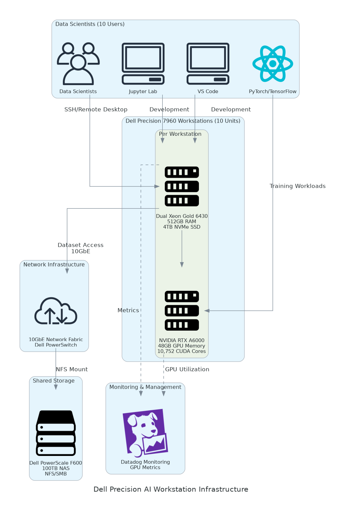

# Executive Summary

This document provides the comprehensive technical design for the Dell Precision AI Workstation Infrastructure implementation. It covers the target-state architecture for on-premises AI/ML computing using Dell Precision 7960 workstations with NVIDIA RTX A6000 GPUs and Dell PowerScale shared storage.

## Purpose

Define the technical architecture and design specifications that will guide the implementation team through deployment, configuration, and validation of the AI workstation infrastructure to replace cloud GPU compute with cost-effective on-premises resources.

## Scope

**In-scope:**

The following components and services are covered by this design document.

- 10 Dell Precision 7960 tower workstations with NVIDIA RTX A6000 GPUs
- Dell PowerScale F600 NAS for shared dataset storage (100TB)
- Ubuntu 22.04 LTS operating system with NVIDIA drivers
- CUDA 12.2 toolkit and cuDNN for GPU computing
- ML frameworks: PyTorch, TensorFlow, Jupyter Lab
- Datadog infrastructure monitoring with GPU metrics
- Network design for 10GbE storage connectivity

**Out-of-scope:**

The following items are excluded from this design.

- End-user training (covered in Implementation Guide)
- Distributed training configuration (Phase 2 enhancement)
- MLOps pipeline setup (future enhancement)
- Custom model development

## Assumptions & Constraints

The following assumptions underpin the design and must be validated during implementation.

- Data center has adequate power (1.4kW per workstation at 208V)
- Cooling capacity supports 15kW+ heat load
- 10GbE network infrastructure available or will be installed
- Client IT team has Linux administration experience
- Data scientists are familiar with Python and ML frameworks

## References

This document should be read in conjunction with the following related materials.

- Statement of Work (SOW) - Project scope and commercial terms
- Solution Briefing - Architecture overview and business value
- Discovery Questionnaire - Current state assessment

# Business Context

This section establishes the business drivers, success criteria, and compliance requirements that shape the technical design decisions.

## Business Drivers

The solution addresses the following key business objectives identified during discovery.

- **Cost Reduction:** Eliminate $696K annual cloud GPU spend through on-premises infrastructure achieving 60-70% cost reduction
- **Performance Improvement:** Reduce model training time by 50% through local NVMe storage and dedicated GPU resources
- **Data Sovereignty:** Enable AI training on sensitive datasets by keeping all data on-premises
- **Team Productivity:** Provide dedicated high-performance workstations for 10 data scientists eliminating cloud quota limitations
- **Scalability:** Establish infrastructure foundation supporting growth to 25+ data scientists

## Workload Criticality & SLA Expectations

The following service level targets define the operational requirements for the production environment and guide infrastructure sizing decisions.

<!-- TABLE_CONFIG: widths=[25, 25, 25, 25] -->
| Metric | Target | Measurement | Priority |
|--------|--------|-------------|----------|
| GPU Utilization | 80%+ average | Datadog GPU metrics | High |
| NVMe Performance | 7,000 MB/s read | fio benchmark | Critical |
| NAS Throughput | 1 GB/s aggregate | iperf3/fio tests | High |
| System Availability | 99.5% | Datadog uptime | High |

## Compliance & Regulatory Factors

The solution must adhere to the following regulatory and compliance requirements.

- Data sovereignty: All training datasets must remain on-premises
- Access control: Role-based access with SSH key authentication
- Audit logging: SSH access logs retained for 90 days
- Encryption: LUKS encryption on local NVMe drives

## Success Criteria

Project success will be measured against the following criteria at go-live.

- All 10 workstations operational with GPU, CUDA, and ML frameworks
- GPU utilization achieves 80%+ during training workloads
- Storage performance validated (7,000 MB/s NVMe, 1 GB/s NAS)
- Data scientists trained and executing training workloads independently
- Dataset migration from cloud to PowerScale complete

# Current-State Assessment

This section documents the existing environment that the solution will integrate with or replace.

## Application Landscape

The current environment consists of cloud-based AI/ML infrastructure that will be replaced with on-premises resources.

<!-- TABLE_CONFIG: widths=[25, 30, 25, 20] -->
| Application | Purpose | Technology | Status |
|-------------|---------|------------|--------|
| AWS EC2 p4d.24xlarge | GPU training compute | Cloud instances | To be replaced |
| AWS S3 | Dataset storage | Object storage | To be migrated |
| AWS SageMaker | Notebook environment | Managed service | To be replaced |

## Infrastructure Inventory

The current cloud infrastructure consists of the following components that will be replaced.

<!-- TABLE_CONFIG: widths=[20, 15, 35, 30] -->
| Component | Quantity | Specifications | Notes |
|-----------|----------|----------------|-------|
| GPU Instances | 10 (variable) | p4d.24xlarge (8x A100 40GB) | $32.77/hour |
| S3 Storage | 50 TB | Standard storage class | Training datasets |
| SageMaker | 10 users | Notebook instances | Development environment |

## Dependencies & Integration Points

The current environment has the following external dependencies that must be considered during migration.

- Active Directory/LDAP for user authentication (will integrate with PowerScale)
- AWS CLI for dataset migration during transition
- Existing network infrastructure for 10GbE connectivity

## Network Topology

Current data center network provides foundation for AI workstation deployment with the following characteristics.

- Core switches with 10GbE uplink capacity
- Available VLAN ranges for storage and management networks
- Firewall rules allowing SSH access from corporate network

## Security Posture

The current security controls provide a baseline that will be maintained in the on-premises architecture.

- SSH key-based authentication (no password access)
- File-level permissions on shared storage
- Centralized logging for audit compliance
- Network segmentation via VLANs

## Performance Baseline

Current cloud system performance metrics establish the baseline for improvement targets.

- Average training time (ResNet-152 on ImageNet): 9.5 hours
- Dataset transfer time to cloud: 2-4 hours for 5TB
- GPU utilization: 70% average (limited by data loading)
- Monthly cloud cost: $58,000

# Solution Architecture

The target architecture leverages Dell Precision workstations with NVIDIA GPUs and PowerScale shared storage to deliver high-performance on-premises AI/ML computing.

## Architecture Principles

The following principles guide all architectural decisions throughout the solution design.

- **On-Premises First:** All compute and storage resources deployed in client data center
- **Performance Optimized:** Local NVMe for training, NAS for dataset sharing
- **Security by Design:** SSH key authentication, LUKS encryption, VLAN isolation
- **Scalability Ready:** Architecture supports 25+ workstations without redesign
- **Operational Simplicity:** Standard Linux administration, familiar ML tools

## Architecture Patterns

The solution implements the following architectural patterns to address performance and data sovereignty requirements.

- **Primary Pattern:** Dedicated workstations with local GPU compute
- **Storage Pattern:** Tiered storage (local NVMe for training, NAS for sharing)
- **Network Pattern:** Dedicated storage VLAN with jumbo frames
- **Security Pattern:** Zero-trust SSH access with key authentication

## Component Design

The solution comprises the following logical components, each with specific responsibilities and scaling characteristics.

<!-- TABLE_CONFIG: widths=[20, 25, 22, 15, 18] -->
| Component | Purpose | Technology | Quantity | Scaling |
|-----------|---------|------------|----------|---------|
| AI Workstation | GPU compute for training | Dell Precision 7960 | 10 | Add workstations |
| GPU | Deep learning acceleration | NVIDIA RTX A6000 48GB | 10 | Add GPUs |
| Local Storage | Training data cache | 4TB NVMe SSD | 10 | Per workstation |
| Shared Storage | Dataset repository | PowerScale F600 100TB | 1 | Add nodes |
| Monitoring | GPU and system metrics | Datadog agents | 10 | Automatic |

## Technology Stack

The technology stack has been selected based on requirements for ML performance, maintainability, and alignment with industry standards.

<!-- TABLE_CONFIG: widths=[25, 35, 40] -->
| Layer | Technology | Rationale |
|-------|------------|-----------|
| Compute | Dell Precision 7960 | Enterprise workstation with GPU support and ProSupport |
| GPU | NVIDIA RTX A6000 48GB | Professional GPU with 48GB memory for large models |
| Operating System | Ubuntu 22.04 LTS | Best CUDA/cuDNN support, long-term maintenance |
| GPU Framework | CUDA 12.2, cuDNN 8.9 | Latest stable versions with PyTorch/TensorFlow support |
| ML Frameworks | PyTorch 2.1, TensorFlow 2.14 | Industry-standard deep learning frameworks |
| Development | Jupyter Lab, VS Code | Familiar data science development environments |
| Storage | Dell PowerScale F600 | High-performance NFS with enterprise features |
| Monitoring | Datadog | GPU metrics, alerting, dashboards |

## Network Design

The network architecture includes the following components providing high-speed connectivity between workstations and shared storage.

<!-- TABLE_CONFIG: widths=[25, 25, 25, 25] -->
| Network | VLAN | Purpose | Speed |
|---------|------|---------|-------|
| Storage Network | 200 | NFS traffic to PowerScale | 10GbE |
| Management Network | 100 | SSH access and monitoring | 1GbE |
| Corporate Network | Client VLAN | Internet and LDAP access | 1GbE |

Network design specifications include the following requirements.

- 10GbE NICs in each workstation connected to storage switch
- Jumbo frames (MTU 9000) enabled on storage network
- Network switch with sufficient 10GbE ports (10 workstations + PowerScale)
- VLAN trunking between access and core switches

## Data Flow

Data flows through the solution as follows during typical training operations.

1. Data scientist connects to workstation via SSH with key authentication
2. Training script loads dataset from PowerScale NAS via NFS mount
3. Dataset cached to local NVMe for training iteration performance
4. GPU executes training computation with CUDA acceleration
5. Model checkpoints saved to PowerScale for team access
6. Datadog agent collects GPU metrics and reports to cloud dashboard

# Security & Compliance

This section defines the security controls and compliance measures implemented in the solution.

## Identity & Access Management

The following access control mechanisms are implemented to protect the infrastructure.

- **Authentication:** SSH key-based authentication (ed25519 algorithm)
- **Authorization:** Linux user/group permissions with sudo for admins
- **User Management:** LDAP integration via PowerScale for centralized accounts
- **Session Control:** SSH session timeout after 30 minutes idle

## Data Protection

Data protection measures include encryption and access controls at multiple layers.

- **Encryption at Rest:** LUKS encryption on workstation NVMe drives
- **Encryption in Transit:** NFS over TLS for PowerScale connections
- **Data Classification:** All training data treated as confidential
- **Backup:** PowerScale snapshots every 4 hours, 30-day retention

## Network Security

Network security controls provide isolation and monitoring capabilities.

- **Network Segmentation:** Storage traffic isolated on dedicated VLAN
- **Firewall Rules:** SSH access restricted to corporate network ranges
- **Port Security:** Only required ports open (SSH 22, Jupyter 8888 via tunnel)
- **Monitoring:** Datadog network traffic monitoring

## Compliance Mapping

The solution addresses the following compliance requirements.

<!-- TABLE_CONFIG: widths=[30, 40, 30] -->
| Requirement | Implementation | Validation |
|-------------|----------------|------------|
| Data Sovereignty | All data on-premises, no cloud transfer | Network monitoring |
| Access Logging | SSH access logs to syslog | Log review |
| Encryption | LUKS at rest, TLS in transit | Audit verification |
| User Access Control | LDAP groups, sudo restrictions | Permission audit |

# Data Architecture

This section defines the data storage, organization, and lifecycle management approach.

## Storage Tiers

The solution implements a two-tier storage architecture optimized for ML workloads.

<!-- TABLE_CONFIG: widths=[20, 25, 25, 30] -->
| Tier | Technology | Capacity | Use Case |
|------|------------|----------|----------|
| Hot (Local) | NVMe SSD | 4TB per workstation | Active training datasets |
| Warm (Shared) | PowerScale NAS | 100TB total | Team dataset repository |

## Data Organization

PowerScale NAS is organized with the following share structure for team collaboration.

- `/datasets/` - Shared training datasets (read-only for users)
- `/projects/` - Project-specific working directories
- `/checkpoints/` - Model checkpoints and artifacts
- `/home/` - User home directories with quotas

## Storage Performance

Storage performance targets and achieved specifications are documented below.

<!-- TABLE_CONFIG: widths=[25, 25, 25, 25] -->
| Storage Type | Target | Specification | Notes |
|--------------|--------|---------------|-------|
| Local NVMe | 7,000 MB/s read | Samsung 990 Pro 4TB | Per workstation |
| PowerScale Aggregate | 1 GB/s | F600 10GbE | 10 concurrent streams |
| Random IOPS | 1M+ | NVMe 4K random | Local storage only |

## Data Lifecycle

Data lifecycle policies manage storage capacity and compliance requirements.

- **Active Data:** Training datasets on PowerScale, cached to local NVMe
- **Checkpoints:** 30-day retention on PowerScale, archive to cold storage
- **Logs:** 90-day retention on workstations, forwarded to syslog
- **Snapshots:** 4-hour intervals, 30-day retention on PowerScale

# Integration Design

This section defines the integration points between solution components and external systems.

## Internal Integrations

The following internal integrations connect solution components.

<!-- TABLE_CONFIG: widths=[25, 25, 25, 25] -->
| Source | Target | Protocol | Purpose |
|--------|--------|----------|---------|
| Workstations | PowerScale | NFS v4.1 | Dataset access |
| Datadog Agent | Datadog Cloud | HTTPS | Metrics reporting |
| Workstations | LDAP | LDAPS | User authentication |

## External Integrations

External system integrations support migration and ongoing operations.

<!-- TABLE_CONFIG: widths=[25, 25, 25, 25] -->
| System | Integration Type | Purpose | Phase |
|--------|-----------------|---------|-------|
| AWS S3 | AWS CLI | Dataset migration | Deployment |
| Active Directory | LDAP | User authentication | Production |
| SMTP Relay | Email | Alert notifications | Production |

## Integration Security

All integrations implement the following security controls.

- LDAPS (LDAP over TLS) for user authentication
- HTTPS for Datadog agent communication
- VPN or direct connect for AWS S3 migration

# Infrastructure & Operations

This section defines the compute, storage, and operational requirements for the solution.

## Compute Specifications

Each Dell Precision 7960 workstation is configured with the following specifications.

<!-- TABLE_CONFIG: widths=[25, 40, 35] -->
| Component | Specification | Notes |
|-----------|---------------|-------|
| Processor | Dual Intel Xeon Gold 6430 | 64 cores total, 2.1GHz base |
| Memory | 512GB DDR5 | 8x 64GB DIMMs |
| GPU | NVIDIA RTX A6000 48GB | 10,752 CUDA cores |
| Local Storage | 4TB NVMe SSD | 7,000 MB/s read |
| Network | Dual 10GbE + 1GbE | Storage, management, corporate |
| Power | 1,400W PSU | 208V circuit required |

## Data Center Requirements

The data center must meet the following requirements for the workstation deployment.

<!-- TABLE_CONFIG: widths=[25, 35, 40] -->
| Requirement | Specification | Notes |
|-------------|---------------|-------|
| Power | 15kW total (208V) | 10 workstations + PowerScale |
| Cooling | 15kW heat dissipation | 51,000 BTU/hour |
| Space | 10 desk/floor positions | Tower workstations |
| Network | 12+ 10GbE ports | 10 workstations + 2 PowerScale |

## Monitoring & Alerting

Datadog provides comprehensive monitoring with the following metrics and alerts.

<!-- TABLE_CONFIG: widths=[25, 35, 40] -->
| Metric | Threshold | Alert Action |
|--------|-----------|--------------|
| GPU Temperature | > 80C | Email to IT team |
| GPU Utilization | < 50% for 1 hour | Info notification |
| NVMe Space | > 90% used | Warning to user |
| PowerScale Capacity | > 80% used | Email to storage team |

## High Availability & Disaster Recovery

The solution implements the following availability and recovery measures.

- **Workstation Availability:** Dell ProSupport Plus with 4-hour on-site response
- **Storage Availability:** PowerScale data protection with snapshots
- **RTO:** 4 hours for workstation hardware replacement
- **RPO:** 4 hours (snapshot interval)

# Implementation Approach

This section outlines the implementation strategy, phases, and migration approach.

## Implementation Phases

The implementation follows a three-phase approach over 6 weeks.

<!-- TABLE_CONFIG: widths=[15, 25, 30, 30] -->
| Phase | Duration | Activities | Deliverables |
|-------|----------|------------|--------------|
| 1 | Weeks 1-2 | Planning, procurement, data center prep | Implementation Plan |
| 2 | Weeks 3-4 | Hardware installation, OS/GPU configuration | Configured Infrastructure |
| 3 | Weeks 5-6 | Validation, training, go-live | Production System |

## Migration Strategy

Dataset migration from AWS S3 to PowerScale follows this approach.

1. **Assessment:** Inventory S3 datasets and validate total size
2. **Preparation:** Configure AWS CLI on temporary workstation
3. **Transfer:** Execute aws s3 sync to PowerScale NFS mount
4. **Validation:** Verify file counts and checksums
5. **Cutover:** Update data scientist workflows to use local paths

## Deployment Sequence

The deployment sequence ensures dependencies are met at each step.

1. Data center preparation (power, cooling, network)
2. Dell ProDeploy hardware installation
3. Network VLAN and cabling configuration
4. Ubuntu 22.04 LTS installation
5. NVIDIA driver and CUDA installation
6. PowerScale NAS configuration
7. NFS mount configuration
8. ML framework installation
9. Datadog monitoring setup
10. Validation and benchmarking
11. User training
12. Production go-live

# Appendices

## Appendix A: Hardware Bill of Materials

Complete hardware inventory for the solution deployment.

<!-- TABLE_CONFIG: widths=[35, 15, 25, 25] -->
| Item | Quantity | Model | Notes |
|------|----------|-------|-------|
| AI Workstation | 10 | Dell Precision 7960 | Tower configuration |
| GPU | 10 | NVIDIA RTX A6000 | 48GB GDDR6 |
| NAS Storage | 1 | Dell PowerScale F600 | 100TB usable |
| Network Switch | 1 | Dell S4148F-ON | 48x 10GbE SFP+ |

## Appendix B: Software Versions

Standardized software versions for all workstations.

<!-- TABLE_CONFIG: widths=[35, 30, 35] -->
| Software | Version | Notes |
|----------|---------|-------|
| Ubuntu | 22.04.3 LTS | Jammy Jellyfish |
| NVIDIA Driver | 535.86.05 | Production branch |
| CUDA | 12.2 | Toolkit |
| cuDNN | 8.9.5 | For CUDA 12.x |
| PyTorch | 2.1.0 | With CUDA 12.1 support |
| TensorFlow | 2.14.0 | With CUDA 12.2 support |
| Miniconda | 23.10.0 | Python 3.11 default |

## Appendix C: Network Configuration

Network addressing and VLAN assignments.

<!-- TABLE_CONFIG: widths=[25, 20, 30, 25] -->
| Network | VLAN | Subnet | Gateway |
|---------|------|--------|---------|
| Storage | 200 | 10.200.0.0/24 | 10.200.0.1 |
| Management | 100 | 10.100.0.0/24 | 10.100.0.1 |
| PowerScale | 200 | 10.200.0.250-251 | 10.200.0.1 |

## Appendix D: Risk Register

Identified risks and mitigation strategies.

<!-- TABLE_CONFIG: widths=[25, 35, 40] -->
| Risk | Impact | Mitigation |
|------|--------|------------|
| Hardware delivery delay | Schedule slip | Order early, track shipments |
| Power capacity insufficient | Cannot deploy | Validate with facilities before PO |
| Driver compatibility | GPU not functional | Test specific driver versions |
| Network performance | Below target throughput | Enable jumbo frames, validate |
