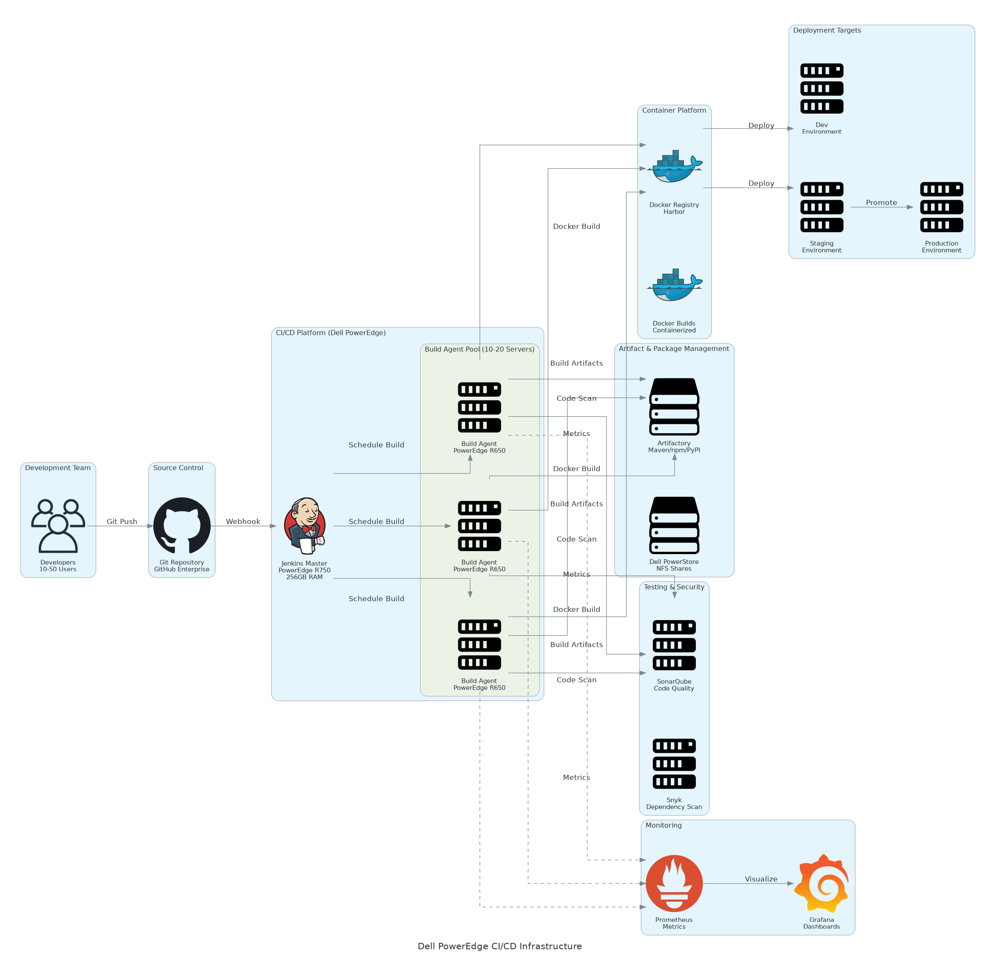

# Executive Summary

This Statement of Work (SOW) defines the scope, deliverables, roles, and terms for implementing Dell Precision AI Workstation Infrastructure for [Client Name]. This engagement will deliver on-premises AI/ML computing infrastructure through Dell Precision 7960 workstations with NVIDIA RTX A6000 GPUs and PowerScale shared storage to reduce cloud GPU costs by 60-70% and achieve data sovereignty.

**Project Duration:** 6 weeks

---

---

# Background & Objectives

## Current State

[Client Name] currently spends approximately $58,000/month on cloud GPU instances (AWS p4d.24xlarge) for AI/ML model training across 10 data scientists. Key challenges include:
- **High Cloud Costs:** $693K annual spend on cloud GPU compute creating budget pressure
- **Data Transfer Bottlenecks:** Multi-terabyte datasets taking hours to transfer to/from cloud storage
- **Data Sovereignty Concerns:** Sensitive training data required to remain on-premises for compliance
- **Limited GPU Memory:** Cloud instance limits preventing training of larger models
- **Productivity Loss:** Dataset download waits and network latency reducing data scientist productivity

## Business Objectives

The following objectives define the key business outcomes this engagement will deliver:

- **Reduce Cloud Costs:** Eliminate cloud GPU spend through on-premises Dell Precision workstations with RTX A6000 GPUs achieving 60-70% cost reduction vs AWS p4d baseline
- **Improve Training Performance:** Reduce model training time by 50% through local NVMe storage eliminating dataset transfer latency and providing dedicated 48GB GPU memory per workstation
- **Enable Data Sovereignty:** Keep all AI training datasets on-premises to meet compliance requirements and eliminate cloud data residency concerns
- **Increase Productivity:** Provide dedicated high-performance workstations allowing data scientists to iterate faster and train larger models without cloud quota limitations
- **Support Team Growth:** Establish scalable on-premises infrastructure supporting current 10-person team with capacity for future expansion to 25+ data scientists
- **Foundation for AI Platform:** Build foundation for expanding AI infrastructure to support distributed training and MLOps capabilities

## Success Metrics

The following metrics will be used to measure project success:

- 60%+ reduction in AI infrastructure costs within 12 months (vs cloud baseline)
- 50% reduction in model training time (vs current cloud performance)
- 100% data sovereignty compliance (all datasets on-premises)
- 95%+ GPU utilization across workstation fleet
- 10 data scientists fully equipped and trained within 6 weeks
- ROI payback within 3-6 months

---

---

# Scope of Work

## In Scope
The following services and deliverables are included in this SOW:
- AI workload assessment and infrastructure sizing
- Dell Precision workstation and PowerScale NAS procurement coordination
- Data center infrastructure validation (power, cooling, network)
- Hardware installation and OS/GPU driver configuration
- ML framework stack setup (PyTorch, TensorFlow, CUDA)
- Shared storage configuration and dataset migration
- Performance benchmarking and validation
- User and administrator training
- Knowledge transfer and documentation

### Scope Parameters

This engagement is sized based on the following parameters:

<!-- BEGIN SCOPE_PARAMETERS_TABLE -->
<!-- TABLE_CONFIG: widths=[25, 35, 40] -->
| Category | Parameter | Scope |
|----------|-----------|-------|
| Solution Scope | Number of Developers | 50 developers with CI/CD access |
| Solution Scope | Build Agents | 8 Dell PowerEdge R650 build servers |
| Integration | CI/CD Platform | GitLab Premium self-hosted |
| Integration | Artifact Repository | JFrog Artifactory Pro |
| User Base | Build Volume | 5000 builds per day |
| User Base | Pipeline Complexity | Multi-stage pipelines with tests |
| Data Volume | Artifact Storage | 20TB artifact capacity |
| Data Volume | Build Artifacts | Maven npm Docker images |
| Technical Environment | Build Agent OS | Ubuntu 22.04 LTS with Docker |
| Technical Environment | Current CI/CD | GitHub Actions cloud runners |
| Technical Environment | Container Platform | Docker Enterprise with registry |
| Security & Compliance | Code Sensitivity | Proprietary source code |
| Security & Compliance | Authentication | SSO with SAML integration |
| Performance | Build Queue Time | <5 minute average queue time |
| Performance | Build Duration | 15 minute average build time |
| Environment | Deployment Strategy | Phased migration by team |
<!-- END SCOPE_PARAMETERS_TABLE -->

Table: Engagement Scope Parameters

*Note: Changes to these parameters may require scope adjustment and additional investment.*

## Out of Scope
These items are not in scope unless added via change control:
- Rack cabinets and PDU procurement (client responsibility)
- Electrical infrastructure upgrades or circuit installation
- Network switch procurement (only configuration included)
- Custom ML model development or algorithm optimization
- Data center facilities management
- Managed services beyond 6-week engagement

## Activities

### Phase 1 – Planning & Procurement (Weeks 1-2)

During this initial phase, the team will finalize specifications and coordinate hardware procurement.

Key activities:
- Review AI workload requirements and validate GPU sizing
- Confirm power, cooling, and rack space availability
- Submit Dell hardware purchase order (workstations, GPUs, storage)
- Prepare data center space and network cabling
- Plan dataset migration from cloud to PowerScale NAS
- Develop implementation timeline and resource schedule

**Deliverable:** Implementation Plan & Hardware Order Confirmation

### Phase 2 – Deployment & Configuration (Weeks 3-4)

In this phase, hardware is installed and core infrastructure is configured.

Key activities:
- Dell ProDeploy rack installation and cabling
- Ubuntu 22.04 LTS installation on all workstations
- NVIDIA driver, CUDA 12.2, and cuDNN installation
- PowerScale NAS configuration with NFS shares
- 10GbE network configuration and validation
- ML framework installation (PyTorch, TensorFlow, Jupyter)
- Datadog monitoring agent deployment

**Deliverable:** Configured AI Infrastructure

### Phase 3 – Validation & Training (Weeks 5-6)

The solution undergoes performance validation and team training.

Key activities:
- GPU benchmark testing (PyTorch/TensorFlow performance)
- Storage throughput validation (NVMe and PowerScale)
- Sample model training end-to-end testing
- Dataset migration from AWS S3 to PowerScale
- 2-day hands-on training: CUDA optimization and GPU profiling
- Administrator training: Linux, GPU drivers, PowerScale management
- Production go-live with first real-world training workloads

**Deliverable:** Performance Validation Report & Training Materials

---

# Deliverables & Timeline

## Deliverables

The following table summarizes the key deliverables for this engagement:

<!-- TABLE_CONFIG: widths=[8, 40, 12, 20, 20] -->
| # | Deliverable | Type | Due Date | Acceptance By |
|---|-------------|------|----------|---------------|
| 1 | Implementation Plan | Document | Week 2 | Client IT Lead |
| 2 | Configured AI Infrastructure | Infrastructure | Week 4 | Technical Lead |
| 3 | Performance Validation Report | Document | Week 6 | Data Science Lead |
| 4 | Training Materials & Runbooks | Document | Week 6 | Client Team |
| 5 | As-Built Documentation | Document | Week 6 | IT Operations |

## Project Milestones

The following milestones represent key checkpoints throughout the project lifecycle:

<!-- TABLE_CONFIG: widths=[20, 55, 25] -->
| Milestone | Description | Target Date |
|-----------|-------------|-------------|
| M1 - Hardware Ordered | Dell purchase order submitted | Week 2 |
| M2 - Hardware Delivered | All equipment on-site | Week 3 |
| M3 - Infrastructure Configured | Workstations and storage operational | Week 4 |
| M4 - Validation Complete | Performance benchmarks passed | Week 5 |
| M5 - Training Complete | Team trained and productive | Week 6 |

---

# Roles & Responsibilities

## Client Responsibilities

The Client is responsible for the following:

- Provide data center space with adequate power and cooling
- Install rack cabinets and PDUs (if rack-mount configuration)
- Provide 10GbE network infrastructure and VLAN configuration
- Assign technical lead and team for implementation support
- Provide representative training datasets for validation
- Approve hardware specifications and purchase order
- Participate in knowledge transfer and training sessions

## Vendor Responsibilities

The Vendor is responsible for the following:

- Coordinate Dell hardware procurement and delivery
- Install and configure Ubuntu, CUDA, and ML frameworks
- Configure PowerScale NAS with NFS shares and permissions
- Benchmark GPU and storage performance
- Migrate sample datasets from cloud to PowerScale
- Conduct training workshops for users and administrators
- Deliver documentation and operational runbooks
- Provide 6-week implementation support

---

# Architecture & Design

## Solution Architecture

The Dell Precision AI Workstation infrastructure consists of three layers:

**Workstation Compute Layer:**
- 10x Dell Precision 7960 Tower workstations
- Dual Intel Xeon Gold 6430 processors (64 cores total)
- 512GB DDR5 RAM for large-scale preprocessing
- 4TB NVMe SSD achieving 7000MB/s read performance
- NVIDIA RTX A6000 48GB GPU with 10752 CUDA cores
- Ubuntu 22.04 LTS with CUDA 12.2 and cuDNN
- PyTorch, TensorFlow, Jupyter Lab, VS Code

**Shared Storage Layer:**
- Dell PowerScale F600 NAS appliance
- 100TB usable capacity for team dataset repository
- NFS/SMB file sharing with user quotas
- 10GbE network connectivity for high-speed access

**Monitoring & Management:**
- Datadog infrastructure monitoring
- GPU utilization and temperature tracking
- Storage capacity and performance metrics
- Centralized logging for troubleshooting

## Network Design

The network architecture includes the following components:

- 10GbE network fabric connecting workstations to PowerScale NAS
- Dedicated storage VLAN for dataset traffic isolation
- 1GbE management network for out-of-band access
- Firewall rules for SSH access and monitoring agents

## Data Flow

Data flows through the solution as follows:

1. Data scientists access workstations via SSH or remote desktop
2. Training datasets stored centrally on PowerScale NAS (NFS mounts)
3. Dataset loaded from PowerScale to local NVMe for training
4. GPU executes training workload with CUDA acceleration
5. Model checkpoints saved to PowerScale for team sharing
6. Datadog collects GPU metrics and performance telemetry

---

# Security & Compliance

## Access Control

Access control measures include:

- SSH key-based authentication for workstation access
- LDAP/Active Directory integration for centralized user management
- Sudo access restricted to administrators
- File-level permissions on PowerScale NAS shares

## Data Protection

Data protection measures include:

- Encryption at rest: LUKS encryption on workstation NVMe drives
- Encryption in transit: TLS for all network communication
- PowerScale snapshots for data recovery
- No sensitive data transmitted to cloud services

## Compliance

Compliance requirements and controls include:

- Data sovereignty: All training data remains on-premises
- Audit logging: SSH access logs and file access audit trail
- Patch management: Monthly security updates for Ubuntu and NVIDIA drivers

---

# Testing & Validation

## Performance Testing

Performance testing validates system behavior under load:

- **GPU Benchmark:** PyTorch and TensorFlow training performance vs specifications
- **Storage Throughput:** NVMe local storage and PowerScale NAS read/write speeds
- **Network Bandwidth:** 10GbE connectivity validation between workstations and storage
- **End-to-End Training:** Sample model training with representative datasets

## Acceptance Criteria

The following acceptance criteria will be used to validate deliverables:

- GPU utilization achieves 80%+ during training workloads
- Local NVMe storage achieves 7000MB/s+ read performance
- PowerScale NAS achieves 1GB/s+ aggregate throughput
- All 10 workstations operational with CUDA and ML frameworks
- Sample model training completes successfully
- Users trained and able to execute training workloads independently

---

# Handover & Support

## Knowledge Transfer

Knowledge transfer ensures the Client team can effectively operate the solution:

- 2-day hands-on training workshop for data scientists
  - CUDA optimization techniques
  - Distributed training best practices
  - GPU profiling and performance tuning
- 1-day administrator training
  - Ubuntu and GPU driver management
  - PowerScale NAS administration
  - Datadog monitoring and alerting

## Documentation

The following documentation will be provided:

- Solution architecture diagram
- Installation and configuration runbooks
- GPU optimization best practices guide
- Troubleshooting procedures
- PowerScale backup and recovery procedures

## Support Period

Post-implementation support is defined as follows:

- 6-week hypercare support during initial deployment
- Email and phone support during business hours
- Remote troubleshooting for technical issues
- Escalation to Dell ProSupport for hardware failures

## Post-Implementation
After the 6-week engagement:
- Client IT team assumes operational responsibility
- Dell ProSupport Plus provides 24x7 hardware support
- Vendor available for additional consulting as needed
- Recommended quarterly performance reviews

---

# Investment Summary

## Total Investment

The following table provides a comprehensive overview of the total investment required for this engagement:

<!-- BEGIN COST_SUMMARY_TABLE -->
<!-- TABLE_CONFIG: widths=[25, 15, 15, 15, 12, 12, 15] -->
| Cost Category | Year 1 List | AWS/Partner Credits | Year 1 Net | Year 2 | Year 3 | 3-Year Total |
|---------------|-------------|---------------------|------------|--------|--------|--------------|
| Professional Services | $0 | $0 | $0 | $0 | $0 | $0 |
| Net Investment After Savings | $338,140 | ($149,400) | $188,740 | ($88,400) | ($88,400) | $11,940 |
| Software Licenses | $48 | $500 | $0 | $48 | $500 | $48 |
| Support & Maintenance | $12 | $500 | $0 | $12 | $500 | $12 |
| **TOTAL INVESTMENT** | **$338,415** | **($297,160)** | **$39,340** | **($237,525)** | **($236,160)** | **($434,345)** |
<!-- END COST_SUMMARY_TABLE -->

Table: Total Investment Summary

## Professional Services Breakdown

Professional services cost: $34,000 (after $4,000 Dell ProDeploy credit)

*Detailed breakdown available in Level of Effort estimate.*

## Payment Terms

Payment terms for this engagement are as follows:

- 25% upon SOW signature
- 50% upon hardware delivery (Week 3)
- 25% upon final acceptance (Week 6)

---

# Terms & Conditions

## Change Management
Changes to scope, timeline, or deliverables require written change order approved by both parties. Changes may impact timeline and investment.

## Assumptions

This engagement is based on the following assumptions:

- Client provides data center space with adequate power and cooling
- Client network infrastructure supports 10GbE connectivity
- Dell hardware delivered within 2-3 weeks of purchase order
- Client team available for implementation coordination and training
- Representative training datasets provided for validation

## Client Obligations

The Client is obligated to provide the following:

- Timely decision-making and approvals
- Access to facilities and systems
- Availability of technical resources
- Hardware purchase order approval within 1 week

## Risk Factors

The following risk factors have been identified:

- Hardware delivery delays may impact timeline
- Power or cooling constraints may require facility upgrades
- Network infrastructure limitations may reduce performance
- Dataset migration may take longer for multi-terabyte volumes

## Warranty

Warranty terms for this engagement:

- Dell ProSupport Plus provides hardware warranty and support
- Professional services guaranteed for 30 days post-acceptance
- Software configuration supported during 6-week hypercare period

---

# Sign-Off

## Acceptance

This Statement of Work is agreed upon by the authorized representatives below:

**Client:**

Name: ________________________________
Title: ________________________________
Signature: ____________________________
Date: _________________________________

**Vendor:**

Name: ________________________________
Title: ________________________________
Signature: ____________________________
Date: _________________________________

---

**Document Control:**
- Version: 1.0
- Last Updated: November 22, 2025
- Document ID: OPP-2025-001
