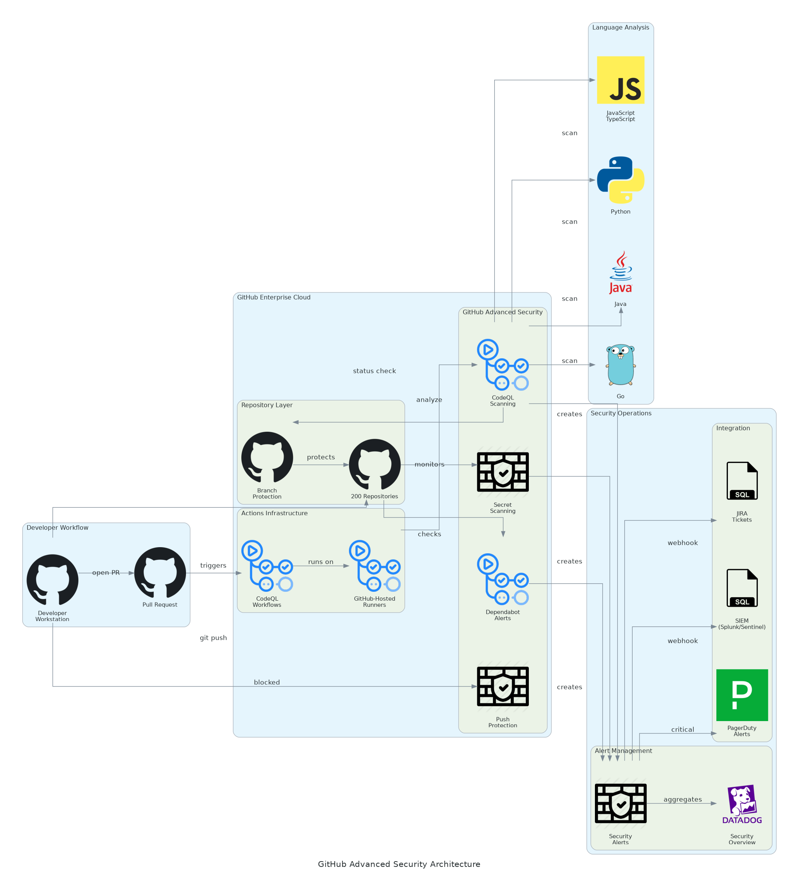

# Executive Summary

This document provides the comprehensive technical design for the GitHub Advanced Security (GHAS) implementation. It covers the target-state architecture leveraging CodeQL for static analysis, secret scanning with push protection, and Dependabot for dependency vulnerability management. The solution integrates with enterprise SIEM systems (Splunk/Azure Sentinel) and issue tracking platforms (JIRA/ServiceNow) to deliver automated DevSecOps workflows.

## Purpose

Define the technical architecture and design specifications that will guide the implementation team through deployment, configuration, and validation of the application security platform on GitHub Enterprise Cloud.

## Scope

**In-scope:**
- GitHub Enterprise Cloud organization setup with SAML SSO
- GitHub Advanced Security licensing and enablement for 200 repositories
- CodeQL code scanning for 5 languages (JavaScript, Python, Java, C#, Go)
- Secret scanning with push protection organization-wide
- Dependabot vulnerability alerts and security updates
- Custom CodeQL query development (15 organization-specific rules)
- SIEM integration via webhooks (Splunk, Azure Sentinel)
- Issue tracking integration (JIRA, ServiceNow)
- Security policy enforcement and branch protection rules
- Security champion program and developer training

**Out-of-scope:**
- End-user training delivery (covered in Training Plan)
- Ongoing support procedures (covered in Operations Runbook)
- Self-hosted GitHub Enterprise Server deployment
- C/C++ language scanning (Phase 2 consideration)

## Assumptions & Constraints

The following assumptions underpin the design and must be validated during implementation.

- GitHub Enterprise Cloud licensing secured for 100 users
- GitHub Advanced Security licensing for 80 active committers
- Corporate SAML identity provider available for SSO integration
- Network access to GitHub.com from developer workstations
- SIEM platform (Splunk or Azure Sentinel) available for webhook integration
- Development teams can allocate time for security champion training

## References

This document should be read in conjunction with the following related materials.

- Statement of Work (SOW)
- Discovery Questionnaire responses
- GitHub Advanced Security documentation
- CodeQL query reference documentation

# Business Context

This section establishes the business drivers, success criteria, and compliance requirements that shape the technical design decisions.

## Business Drivers

The solution addresses the following key business objectives identified during discovery.

- **Shift Left Security:** Detect vulnerabilities during development, not after deployment
- **Developer Productivity:** Integrate security into existing workflows without disruption
- **Secret Protection:** Prevent credential leaks through automated blocking
- **Compliance Automation:** Automate evidence collection for SOC 2, PCI-DSS audits
- **Risk Reduction:** Reduce application security incidents by 70%+

## Workload Criticality & SLA Expectations

The following service level targets define the operational requirements for the production environment and guide configuration decisions.

<!-- TABLE_CONFIG: widths=[25, 25, 25, 25] -->
| Metric | Target | Measurement | Priority |
|--------|--------|-------------|----------|
| Detection Accuracy | > 95% | Validation against known vulnerabilities | Critical |
| PR Scan Duration | < 15 minutes | GitHub Actions workflow timing | High |
| False Positive Rate | < 10% | Alert review and classification | High |
| Push Protection Latency | < 2 seconds | Git push timing | High |
| SIEM Alert Latency | < 30 seconds | Webhook delivery timing | Medium |
| Platform Availability | 99.9% | GitHub status monitoring | Critical |

## Compliance & Regulatory Factors

The solution must adhere to the following regulatory and compliance requirements.

- SOC 2 Type II compliance for all security controls and audit logging
- PCI-DSS 6.5.x secure coding requirements for applicable repositories
- Audit logging required for all security events and policy changes
- Secret detection and blocking capabilities for credential protection
- Repository access controls aligned with principle of least privilege

## Success Criteria

Project success will be measured against the following criteria at go-live.

- CodeQL enabled on all 200 repositories with 95%+ detection accuracy
- Secret scanning with push protection blocking 100% of known patterns
- Dependabot alerts enabled and security updates automated
- SIEM integration operational with <30 second alert delivery
- Security champions certified across all 8 development teams
- Zero critical vulnerabilities at time of production deployment

# Current-State Assessment

This section documents the existing environment that the solution will integrate with or enhance.

## Application Landscape

The current environment consists of development repositories that will be secured with GHAS.

<!-- TABLE_CONFIG: widths=[25, 30, 25, 20] -->
| Application | Purpose | Technology | Status |
|-------------|---------|------------|--------|
| Manual Code Review | Security assessment | Human reviewers | To be automated |
| Existing Repositories | Application source code | Various languages | Integration point |
| CI/CD Pipelines | Build and deployment | GitHub Actions | Integration point |
| Identity Provider | User authentication | Corporate IdP | Integration point |

## Infrastructure Inventory

The current infrastructure will be augmented with GitHub Advanced Security capabilities.

<!-- TABLE_CONFIG: widths=[20, 15, 35, 30] -->
| Component | Quantity | Specifications | Notes |
|-----------|----------|----------------|-------|
| Repositories | 200 | Various languages | All require GHAS enablement |
| Active Committers | 80 | Unique 90-day committers | GHAS licensing basis |
| GitHub Users | 100 | Enterprise Cloud users | Enterprise license scope |

## Dependencies & Integration Points

The current environment has the following external dependencies that must be considered.

- Existing SAML identity provider for GitHub SSO
- GitHub.com internet connectivity for Enterprise Cloud
- SIEM platform (Splunk/Azure Sentinel) for webhook integration
- Issue tracking system (JIRA/ServiceNow) for ticket creation
- Collaboration platforms (Slack/Teams) for notifications

## Performance Baseline

Current manual security review metrics establish the baseline for improvement targets.

- Average security review time: 2-4 hours per pull request (manual)
- Coverage rate: ~30% of pull requests reviewed for security
- Vulnerability escape rate: 60-70% of issues found post-merge
- Secret incident frequency: 2-3 credential leaks per month
- Remediation time: 120+ days average for known vulnerabilities

# Solution Architecture

The target architecture leverages GitHub Advanced Security services to deliver automated application security with high accuracy, minimal developer friction, and comprehensive audit logging.

## Architecture Principles

The following principles guide all architectural decisions throughout the solution design.

- **Native Integration:** Leverage GitHub-native security features for seamless developer experience
- **Push Protection:** Block secrets at commit time rather than alerting after exposure
- **Automated Remediation:** Enable automated fix PRs through Dependabot security updates
- **Human-in-the-Loop:** Security champion review for complex or ambiguous findings
- **Policy as Code:** Define security policies in repository configuration for versioning
- **Observable by Default:** All security events logged and forwarded to enterprise SIEM

## Architecture Patterns

The solution implements the following architectural patterns to address security and scalability requirements.

- **Primary Pattern:** Event-driven security scanning with PR integration
- **Detection Pattern:** CodeQL semantic analysis for vulnerability detection
- **Protection Pattern:** Push protection for real-time secret blocking
- **Integration Pattern:** Webhooks for SIEM and issue tracking integration
- **Governance Pattern:** Branch protection rules with required security checks

## Component Design

The solution comprises the following logical components, each with specific responsibilities and scaling characteristics.

<!-- TABLE_CONFIG: widths=[18, 25, 22, 18, 17] -->
| Component | Purpose | Technology | Dependencies | Scaling |
|-----------|---------|------------|--------------|---------|
| GitHub Enterprise | Platform hosting | GitHub Enterprise Cloud | SAML IdP | Managed |
| CodeQL Scanning | Static code analysis | CodeQL engine | GitHub Actions | Managed |
| Secret Scanning | Credential detection | Pattern matching + partners | Repository access | Managed |
| Push Protection | Real-time blocking | GitHub platform | Secret scanning | Managed |
| Dependabot | Dependency scanning | Dependabot engine | Repository access | Managed |
| GitHub Actions | CI/CD orchestration | Workflow engine | Compute minutes | Managed |
| Webhooks | Event delivery | HTTPS callbacks | External endpoints | Managed |

## Technology Stack

The technology stack has been selected based on requirements for security detection, developer experience, and enterprise integration.

<!-- TABLE_CONFIG: widths=[25, 35, 40] -->
| Layer | Technology | Rationale |
|-------|------------|-----------|
| Platform | GitHub Enterprise Cloud | Enterprise features, SAML SSO, audit logging |
| Code Scanning | CodeQL | Semantic analysis, multi-language support |
| Secret Scanning | GitHub Secret Scanning | 200+ partner patterns, custom patterns |
| Dependency Scanning | Dependabot | Native GitHub integration, auto-fix PRs |
| CI/CD | GitHub Actions | Native integration, workflow automation |
| Authentication | SAML SSO | Enterprise identity federation |
| Audit Logging | GitHub Audit Log API | Compliance and monitoring |

# Security & Compliance

This section details the security controls, compliance mappings, and governance mechanisms implemented in the solution.

## Identity & Access Management

Access control follows enterprise standards with centralized identity management.

- **Authentication:** SAML 2.0 SSO with corporate identity provider
- **Multi-Factor:** MFA required for all organization members
- **Authorization:** Repository permissions following principle of least privilege
- **Teams:** GitHub Teams aligned with organizational structure
- **Service Accounts:** GitHub Apps with scoped permissions for automation

### Role Definitions

The following roles define access levels within the GitHub organization, following the principle of least privilege.

<!-- TABLE_CONFIG: widths=[20, 40, 40] -->
| Role | Permissions | Scope |
|------|-------------|-------|
| Organization Owner | Full admin access, billing, SSO | Organization-wide |
| Security Admin | Security settings, alert management | Organization-wide |
| Repository Admin | Repository settings, branch protection | Per-repository |
| Developer | Code push, PR creation, alert viewing | Per-repository |
| Security Champion | Alert triage, dismissal rights | Assigned repositories |

## Secrets Management

GitHub secret scanning and push protection provide comprehensive secret management.

- Push protection enabled organization-wide to block secrets before commit
- Partner program integration for 200+ secret types with validity checking
- Custom patterns for organization-specific API keys and tokens
- Secret bypass workflow requiring manager approval
- Historical scanning for detecting secrets in existing commits

## Network Security

Network security leverages GitHub's managed infrastructure with enterprise controls.

- **TLS Encryption:** All GitHub traffic encrypted with TLS 1.2+
- **API Security:** GitHub API access controlled via OAuth/personal access tokens
- **Webhook Security:** HMAC signatures for webhook payload validation
- **IP Allowlisting:** Optional GitHub Actions IP ranges for firewall rules

## Data Protection

Data protection controls ensure code confidentiality and integrity.

- **Encryption at Rest:** GitHub encrypts all repository data at rest
- **Encryption in Transit:** TLS 1.2+ for all communications
- **Access Logging:** Audit log captures all repository access
- **Data Residency:** GitHub Enterprise Cloud data residency options

## Compliance Mappings

The following table maps compliance requirements to specific implementation controls.

<!-- TABLE_CONFIG: widths=[25, 35, 40] -->
| Framework | Requirement | Implementation |
|-----------|-------------|----------------|
| SOC 2 | Access control | SAML SSO, MFA, role-based permissions |
| SOC 2 | Change management | Branch protection, required reviews |
| SOC 2 | Audit trails | GitHub audit log with SIEM integration |
| PCI-DSS 6.5 | Secure coding | CodeQL detection of OWASP Top 10 |
| Internal | Secret protection | Push protection, secret scanning |

## Audit Logging & SIEM Integration

Comprehensive audit logging supports security monitoring and compliance requirements.

- GitHub audit log API for all organization and repository events
- Webhook integration for real-time alert forwarding to SIEM
- Audit log streaming to Amazon S3 or Azure Blob (optional)
- Log retention per GitHub Enterprise Cloud policies (7 days by default)
- SIEM correlation with other security tools via webhook events

# Data Architecture

This section defines the data model, storage strategy, and governance controls for the solution.

## Data Model

### Conceptual Model

The solution manages the following core entities:
- **Repositories:** Source code repositories with security scanning enabled
- **Alerts:** Security vulnerabilities detected by CodeQL, secret scanning, Dependabot
- **Policies:** Security policies and branch protection rules
- **Audit Events:** All security-relevant actions and changes

### Logical Model

The logical data model defines the primary entities and their relationships within the system.

<!-- TABLE_CONFIG: widths=[20, 25, 30, 25] -->
| Entity | Key Attributes | Relationships | Volume |
|--------|----------------|---------------|--------|
| Repository | repo_id, name, visibility, security_enabled | Has many Alerts | 200 |
| Code Scanning Alert | alert_id, rule, severity, state, location | Belongs to Repository | ~500/month |
| Secret Scanning Alert | alert_id, secret_type, state, commit_sha | Belongs to Repository | ~100/month |
| Dependabot Alert | alert_id, package, severity, CVE | Belongs to Repository | ~200/month |
| Audit Event | event_id, action, actor, timestamp | References all entities | ~10K/month |

## Data Flow Design

1. **Code Commit:** Developer pushes code to branch or creates pull request
2. **Push Protection:** Secret scanning evaluates commit for secrets, blocks if detected
3. **PR Creation:** Pull request triggers CodeQL workflow via GitHub Actions
4. **CodeQL Analysis:** Semantic analysis executed with configured query suites
5. **Alert Creation:** Findings create alerts visible in Security tab
6. **Webhook Delivery:** Alerts forwarded to SIEM via configured webhooks
7. **Notification:** Developers notified via PR checks and email
8. **Remediation:** Developer fixes issue and updates pull request
9. **Alert Resolution:** Alert automatically closed when fix merged

## Data Storage Strategy

- **Repository Data:** GitHub-managed encrypted storage
- **Security Alerts:** GitHub Security tab with API access
- **Audit Logs:** GitHub audit log with 7-day hot retention
- **SIEM Archive:** Long-term storage in enterprise SIEM

## Data Governance

Data governance policies ensure proper handling, retention, and quality management.

- **Classification:** Repository visibility (public, internal, private)
- **Retention:** Alerts retained until resolved or dismissed
- **Quality:** False positive tracking via dismissal reason codes
- **Access:** Role-based access to security alerts

# Integration Design

This section documents the integration patterns, APIs, and external system connections.

## External System Integrations

The solution integrates with the following external systems using standardized protocols.

<!-- TABLE_CONFIG: widths=[18, 15, 15, 15, 22, 15] -->
| System | Type | Protocol | Format | Error Handling | SLA |
|--------|------|----------|--------|----------------|-----|
| Splunk | Real-time | Webhook | JSON | Retry queue | 99% |
| Azure Sentinel | Real-time | Webhook | JSON | Retry queue | 99% |
| JIRA | Event-driven | REST API | JSON | Error logging | 99% |
| ServiceNow | Event-driven | REST API | JSON | Error logging | 99% |
| Slack | Event-driven | Webhook | JSON | Best effort | 95% |
| Microsoft Teams | Event-driven | Webhook | JSON | Best effort | 95% |

## API Design

GitHub APIs provide programmatic access to security features.

- **Style:** RESTful with GraphQL option
- **Authentication:** Personal access tokens or GitHub App tokens
- **Rate Limiting:** 5,000 requests/hour for authenticated requests
- **Documentation:** docs.github.com/rest

### API Endpoints

The following REST API endpoints provide programmatic access to security features.

<!-- TABLE_CONFIG: widths=[15, 40, 20, 25] -->
| Method | Endpoint | Auth | Description |
|--------|----------|------|-------------|
| GET | /repos/{owner}/{repo}/code-scanning/alerts | Bearer Token | List code scanning alerts |
| GET | /repos/{owner}/{repo}/secret-scanning/alerts | Bearer Token | List secret scanning alerts |
| GET | /repos/{owner}/{repo}/dependabot/alerts | Bearer Token | List Dependabot alerts |
| PATCH | /repos/{owner}/{repo}/code-scanning/alerts/{id} | Bearer Token | Update alert state |
| GET | /orgs/{org}/audit-log | Bearer Token | Query audit log events |

## Webhook Event Patterns

Webhooks enable real-time integration with enterprise systems.

- **Event Types:** code_scanning_alert, secret_scanning_alert, dependabot_alert
- **Delivery:** HTTPS POST with HMAC signature
- **Retry Policy:** GitHub retries failed deliveries for up to 3 days
- **Payload:** JSON with alert details and repository context

# Infrastructure & Operations

This section covers the infrastructure design, deployment architecture, and operational procedures.

## GitHub Organization Design

The GitHub organization structure provides security and access control boundaries.

- **Organization:** Single GitHub organization for enterprise
- **Teams:** GitHub Teams aligned with development team structure
- **Repositories:** 200 repositories organized by project/domain
- **Settings:** Organization-level security defaults enabled

## Security Scanning Configuration

Scanning configuration provides comprehensive vulnerability detection.

<!-- TABLE_CONFIG: widths=[25, 20, 20, 20, 15] -->
| Component | Configuration | Query Suite | Schedule | Scope |
|-----------|---------------|-------------|----------|-------|
| CodeQL - JavaScript | Enabled | security-extended | PR + daily | All JS/TS repos |
| CodeQL - Python | Enabled | security-extended | PR + daily | All Python repos |
| CodeQL - Java | Enabled | security-extended | PR + daily | All Java repos |
| CodeQL - C# | Enabled | security-extended | PR + daily | All C# repos |
| CodeQL - Go | Enabled | security-extended | PR + daily | All Go repos |
| Secret Scanning | Enabled | Partner + Custom | Real-time | All repos |
| Push Protection | Enabled | All patterns | Real-time | All repos |
| Dependabot Alerts | Enabled | All ecosystems | Daily | All repos |

## High Availability Design

The solution leverages GitHub's managed infrastructure for high availability.

- GitHub Enterprise Cloud 99.9% uptime SLA
- Multi-region GitHub infrastructure
- Automatic failover and disaster recovery
- No customer-managed infrastructure required

## Disaster Recovery

Disaster recovery capabilities are provided by GitHub's managed platform.

- **RPO:** Real-time (GitHub manages replication)
- **RTO:** Minutes (GitHub SLA)
- **Backup:** Git repository cloning for offline backup (optional)
- **DR Site:** GitHub manages multi-region redundancy

## Monitoring & Alerting

Comprehensive monitoring provides visibility across the security platform.

- **Platform Status:** GitHub status page monitoring
- **Security Metrics:** Security Overview dashboard
- **Alert Volume:** CloudWatch/Datadog metrics via webhooks
- **SLA Monitoring:** Detection accuracy and scan duration tracking

### Alert Definitions

The following alerts ensure proactive incident detection and response.

<!-- TABLE_CONFIG: widths=[25, 25, 25, 25] -->
| Alert | Condition | Severity | Response |
|-------|-----------|----------|----------|
| Detection Accuracy Drop | Accuracy < 93% for 1 week | Warning | Review detection patterns |
| Scan Duration Increase | PR scan > 20 min average | Warning | Investigate repository size |
| SIEM Webhook Failures | > 10% delivery failures | Warning | Check SIEM connectivity |
| Critical Vuln Unresolved | Critical alert > 24 hours | Critical | Escalate to security team |
| Push Protection Bypass | Any bypass request | Info | Review bypass justification |

## Logging & Observability

Centralized logging enables security monitoring and troubleshooting.

- GitHub audit log for all organization and repository events
- Webhook delivery logs in GitHub organization settings
- GitHub Actions workflow logs for CodeQL scan details
- SIEM aggregation for cross-platform correlation

## Cost Model

Estimated annual licensing costs based on 100 users and 80 active committers.

<!-- TABLE_CONFIG: widths=[30, 25, 25, 20] -->
| Category | Annual Cost | Optimization | Notes |
|----------|-------------|--------------|-------|
| GitHub Enterprise Cloud | $210,000 | User management | 100 users @ $2,100/user |
| GitHub Advanced Security | $201,600 | Committer tracking | 80 committers @ $2,520 |
| GitHub Actions | $11,700 | Workflow optimization | 50K+ minutes included |
| Third-Party Tools | $20,000 | N/A | Datadog, JIRA integration |
| Support & Maintenance | $67,000 | Optional | Managed services |

**Total Estimated Annual:** $510,300 (required) + $67,000 (optional managed services)

# Implementation Approach

This section outlines the deployment strategy, tooling, and sequencing for the implementation.

## Migration/Deployment Strategy

The deployment strategy minimizes risk through phased rollout with validation gates.

- **Approach:** Pilot-validate-expand with 10 repositories first
- **Pattern:** Phased enablement by team/language
- **Validation:** Detection accuracy testing at each phase gate
- **Rollback:** Repository-level disablement if issues arise

## Sequencing & Wave Planning

The implementation follows a phased approach with clear exit criteria.

<!-- TABLE_CONFIG: widths=[15, 30, 25, 30] -->
| Phase | Activities | Duration | Exit Criteria |
|-------|------------|----------|---------------|
| 1 | Discovery & Assessment | 3 weeks | Repository inventory, language analysis |
| 2 | Pilot (10 repositories) | 3 weeks | 95%+ detection accuracy validated |
| 3 | Expansion (190 repositories) | 10 weeks | All repos enabled, policies enforced |
| 4 | Testing & Validation | 4 weeks | UAT complete, integrations validated |
| 5 | Go-Live & Hypercare | 6 weeks | Production stable, team trained |

**Total Implementation:** ~26 weeks (6 months)

## Tooling & Automation

The following tools provide the automation foundation for GHAS operations.

<!-- TABLE_CONFIG: widths=[25, 35, 40] -->
| Category | Tool | Purpose |
|----------|------|---------|
| Configuration Management | GitHub organization settings | Org-level security defaults |
| CI/CD | GitHub Actions | CodeQL workflow execution |
| Automation | GitHub API / CLI | Bulk repository configuration |
| Monitoring | GitHub Security Overview | Organization security posture |
| Dashboards | Datadog / CloudWatch | Metrics and alerting |

## Cutover Approach

The cutover strategy enables gradual rollout with monitoring.

- **Type:** Phased enablement by repository
- **Duration:** 1-week monitoring per phase
- **Validation:** Detection accuracy and developer impact
- **Decision Point:** Go/no-go 48 hours before each phase

## Rollback Strategy

Rollback procedures are documented for rapid recovery.

- CodeQL workflow disablement per repository
- Push protection bypass for specific patterns
- Dependabot pause at repository level
- Maximum rollback window: Immediate

# Appendices

## Architecture Diagrams

The following diagrams provide visual representation of the solution architecture.

- Solution Architecture Diagram (included in Solution Architecture section)
- Data Flow Diagram
- Integration Architecture Diagram
- Security Controls Diagram

## Naming Conventions

All GitHub resources follow standardized naming conventions.

<!-- TABLE_CONFIG: widths=[25, 35, 40] -->
| Resource Type | Pattern | Example |
|---------------|---------|---------|
| Repository | `{project}-{component}` | `ecommerce-api` |
| Team | `{department}-{function}` | `engineering-backend` |
| Workflow | `{type}-{language}.yml` | `codeql-javascript.yml` |
| Custom Query | `{category}-{pattern}.ql` | `auth-sql-injection.ql` |

## Tagging Standards

Repository topics enable organization and filtering.

<!-- TABLE_CONFIG: widths=[25, 35, 40] -->
| Topic | Required | Example Values |
|-------|----------|----------------|
| language | Yes | javascript, python, java |
| team | Yes | platform, payments, mobile |
| security-tier | Yes | critical, standard, low |
| compliance | No | pci-dss, hipaa, sox |

## Risk Register

The following risks have been identified with corresponding mitigation strategies.

<!-- TABLE_CONFIG: widths=[25, 15, 15, 45] -->
| Risk | Likelihood | Impact | Mitigation |
|------|------------|--------|------------|
| Detection accuracy below target | Medium | High | Iterative tuning, custom queries |
| Developer adoption resistance | Medium | Medium | Champion program, training |
| False positive impact on velocity | Medium | Medium | Tuning, dismiss rules |
| SIEM integration failures | Low | Medium | Retry logic, monitoring |
| Push protection bypass abuse | Low | High | Approval workflow, audit logging |

## Glossary

The following terms and acronyms are used throughout this document.

<!-- TABLE_CONFIG: widths=[25, 75] -->
| Term | Definition |
|------|------------|
| GHAS | GitHub Advanced Security |
| CodeQL | GitHub's semantic code analysis engine |
| SAST | Static Application Security Testing |
| CWE | Common Weakness Enumeration |
| CVE | Common Vulnerabilities and Exposures |
| CVSS | Common Vulnerability Scoring System |
| SSO | Single Sign-On |
| MFA | Multi-Factor Authentication |
| SIEM | Security Information and Event Management |
