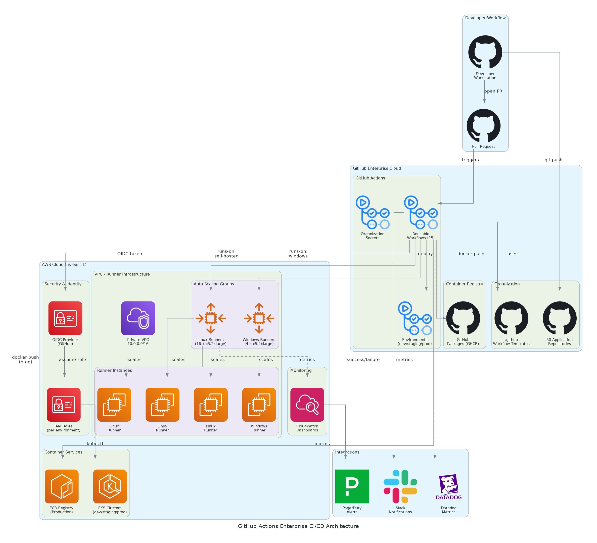

# Executive Summary

This document provides the comprehensive technical design for the GitHub Actions Enterprise CI/CD platform implementation. It covers the target-state architecture leveraging GitHub Enterprise Cloud, self-hosted runners on AWS EC2, OIDC authentication for keyless AWS access, and Kubernetes (EKS) deployment automation. The solution migrates 50 applications from Jenkins to GitHub Actions with reusable workflow templates.

## Purpose

Define the technical architecture and design specifications that will guide the implementation team through deployment, configuration, and validation of the enterprise CI/CD platform on GitHub Enterprise Cloud with self-hosted runner infrastructure.

## Scope

**In-scope:**
- GitHub Enterprise Cloud organization setup and configuration
- Self-hosted runner infrastructure on AWS EC2 (20 runners)
- Auto-scaling runner groups using AWS ASG
- OIDC authentication for keyless AWS deployments
- 15 reusable workflow templates for .NET, Node.js, Python, Docker
- Container registry integration (GitHub Packages, AWS ECR)
- Kubernetes (EKS) deployment automation
- Monitoring integration (Datadog, CloudWatch, PagerDuty)
- Environment protection rules and approval workflows

**Out-of-scope:**
- End-user training delivery (covered in Training Plan)
- Ongoing support procedures (covered in Operations Runbook)
- Self-hosted GitHub Enterprise Server
- Migration of GitLab CI pipelines (separate project)

## Assumptions & Constraints

The following assumptions underpin the design and must be validated during implementation.

- GitHub Enterprise Cloud licensing secured for 100 users
- AWS accounts available for development, staging, and production
- Existing EKS clusters accessible for deployment targets
- Jenkins pipelines documented and available for analysis
- Network connectivity between runners and deployment targets

## References

This document should be read in conjunction with the following related materials.

- Statement of Work (SOW)
- Discovery Questionnaire responses
- GitHub Actions documentation
- AWS IAM OIDC provider documentation

# Business Context

This section establishes the business drivers, success criteria, and compliance requirements that shape the technical design decisions.

## Business Drivers

The solution addresses the following key business objectives identified during discovery.

- **Platform Modernization:** Replace aging Jenkins infrastructure with cloud-native CI/CD
- **Developer Velocity:** Enable daily production deployments with <10 minute pipelines
- **Cost Optimization:** Eliminate $200K+ annual Jenkins infrastructure and maintenance costs
- **Security Improvement:** Remove static AWS credentials with OIDC keyless authentication
- **Standardization:** Establish reusable workflow templates across all development teams

## Workload Criticality & SLA Expectations

The following service level targets define the operational requirements for the production environment and guide configuration decisions.

<!-- TABLE_CONFIG: widths=[25, 25, 25, 25] -->
| Metric | Target | Measurement | Priority |
|--------|--------|-------------|----------|
| Pipeline Duration | < 10 minutes | Workflow completion time | Critical |
| Deployment Success Rate | > 95% | Successful deployments / total | Critical |
| Platform Availability | 99.9% | GitHub + runner uptime | High |
| Concurrent Build Capacity | 25+ builds | Simultaneous workflow runs | High |
| Queue Wait Time | < 30 seconds | Job queue to execution start | Medium |
| Runner Utilization | 60-80% | Active time / available time | Medium |

## Compliance & Regulatory Factors

The solution must adhere to the following regulatory and compliance requirements.

- SOC 2 Type II compliance for all CI/CD platform operations
- No static credentials in workflows (OIDC required)
- Audit logging for all deployment activities
- Environment protection rules for production deployments
- Secrets management via GitHub Actions encrypted secrets

## Success Criteria

Project success will be measured against the following criteria at go-live.

- All 50 applications migrated from Jenkins to GitHub Actions
- Average pipeline duration under 10 minutes
- 95%+ deployment success rate achieved
- Jenkins infrastructure fully decommissioned
- 15 reusable workflow templates operational
- DevOps and developer training completed (95%+ attendance)

# Current-State Assessment

This section documents the existing environment that the solution will integrate with or enhance.

## Application Landscape

The current environment consists of development applications requiring CI/CD migration.

<!-- TABLE_CONFIG: widths=[25, 30, 25, 20] -->
| Application Type | Technology | Count | Migration Complexity |
|------------------|------------|-------|----------------------|
| .NET Core | C# .NET 6+ | 18 | Medium |
| .NET Framework | C# .NET 4.8 | 8 | High (Windows) |
| Node.js | TypeScript/JS | 12 | Low |
| Python | Python 3.x | 7 | Low |
| Docker/Container | Multi-language | 5 | Medium |

## Infrastructure Inventory

The current Jenkins infrastructure being replaced.

<!-- TABLE_CONFIG: widths=[20, 15, 35, 30] -->
| Component | Quantity | Specifications | Notes |
|-----------|----------|----------------|-------|
| Jenkins Master | 1 | c5.xlarge EC2 | To be decommissioned |
| Jenkins Agents | 20 | c5.2xlarge EC2 | To be replaced with GHA runners |
| Jenkins Storage | 500GB | EBS gp3 | To be decommissioned |
| Jenkins Maintenance | N/A | ~$40K/year | Labor cost eliminated |

## Dependencies & Integration Points

The current environment has the following external dependencies that must be considered.

- AWS accounts (dev, staging, production) with IAM access
- EKS clusters for Kubernetes deployments
- GitHub Enterprise Cloud organization
- Container registries (ECR, GitHub Packages)
- Monitoring platforms (Datadog, CloudWatch)
- Notification services (Slack, PagerDuty)

## Performance Baseline

Current Jenkins metrics establish the baseline for improvement targets.

- Average pipeline duration: 45 minutes
- Deployment success rate: 70%
- Deployments per week: 7
- Concurrent build capacity: 10 jobs
- Build queue wait time: 5-10 minutes

# Solution Architecture

The target architecture leverages GitHub Actions with self-hosted runners to deliver high-performance CI/CD with keyless AWS authentication and Kubernetes deployment automation.

## Architecture Principles

The following principles guide all architectural decisions throughout the solution design.

- **Self-Hosted Runners:** Cost-optimized runners in customer VPC for performance and security
- **Reusable Workflows:** Standardized templates reduce duplication and ensure consistency
- **Keyless Authentication:** OIDC eliminates static credentials from all workflows
- **Environment Protection:** Approval gates ensure controlled production deployments
- **Infrastructure as Code:** Terraform manages all runner infrastructure
- **Observable by Default:** All workflows and runners emit metrics to monitoring platforms

## Architecture Patterns

The solution implements the following architectural patterns to address CI/CD requirements.

- **Primary Pattern:** GitHub-native CI/CD with self-hosted execution
- **Compute Pattern:** Auto-scaling runner groups for elastic capacity
- **Auth Pattern:** OIDC federation for AWS service access
- **Deploy Pattern:** GitOps with environment-based promotion
- **Caching Pattern:** Dependency and Docker layer caching for speed

## Component Design

The solution comprises the following logical components, each with specific responsibilities and scaling characteristics.

<!-- TABLE_CONFIG: widths=[18, 25, 22, 18, 17] -->
| Component | Purpose | Technology | Dependencies | Scaling |
|-----------|---------|------------|--------------|---------|
| GitHub Enterprise | CI/CD platform | GitHub Enterprise Cloud | License | Managed |
| Linux Runners | Build execution | EC2 c5.2xlarge Ubuntu | AWS ASG | Auto-scale |
| Windows Runners | .NET Framework builds | EC2 c5.2xlarge Server 2022 | AWS ASG | Auto-scale |
| OIDC Provider | Keyless AWS auth | AWS IAM OIDC | GitHub | Managed |
| GitHub Packages | Container registry | GHCR | GitHub | Managed |
| AWS ECR | Production images | ECR | AWS | Managed |
| EKS Clusters | Deployment targets | Kubernetes 1.28+ | AWS | Managed |

## Technology Stack

The technology stack has been selected based on requirements for performance, cost optimization, and enterprise integration.

<!-- TABLE_CONFIG: widths=[25, 35, 40] -->
| Layer | Technology | Rationale |
|-------|------------|-----------|
| CI/CD Platform | GitHub Enterprise Cloud | Native Git integration, enterprise features |
| Compute | EC2 c5.2xlarge instances | 8 vCPU, 16GB RAM for builds |
| Container Runtime | Docker with BuildKit | Layer caching, multi-stage builds |
| Infrastructure | Terraform 1.5+ | Infrastructure as code, state management |
| Container Registry | GitHub Packages + AWS ECR | Development and production separation |
| Kubernetes | AWS EKS 1.28+ | Managed Kubernetes for deployments |
| Monitoring | Datadog + CloudWatch | APM and infrastructure monitoring |

# Security & Compliance

This section details the security controls, compliance mappings, and governance mechanisms implemented in the solution.

## Identity & Access Management

Access control follows enterprise standards with OIDC-based service authentication.

- **GitHub Authentication:** SAML SSO with corporate identity provider
- **AWS Authentication:** OIDC provider for keyless credential exchange
- **Runner Registration:** Organization-level runner tokens
- **Secrets Management:** GitHub Actions encrypted secrets per environment

### Role Definitions

The following roles define access levels within the GitHub organization.

<!-- TABLE_CONFIG: widths=[20, 40, 40] -->
| Role | Permissions | Scope |
|------|-------------|-------|
| Organization Owner | Full admin access, billing, runner management | Organization-wide |
| DevOps Admin | Runner configuration, workflow management | Organization-wide |
| Repository Admin | Repository settings, secrets, environments | Per-repository |
| Developer | Code push, PR creation, workflow viewing | Per-repository |
| Approver | Production deployment approval | Environment-specific |

## Secrets Management

Secrets are managed using GitHub Actions encrypted secrets with environment scoping.

- Organization-level secrets for shared credentials (Datadog, PagerDuty)
- Repository-level secrets for application-specific configuration
- Environment-level secrets for deployment credentials
- No static AWS credentials (OIDC used exclusively)
- Secret rotation supported via GitHub API

## Network Security

Network security leverages AWS VPC for runner isolation.

- **Runner VPC:** Runners deployed in private subnets
- **Security Groups:** Outbound-only access to GitHub and deployment targets
- **NAT Gateway:** Internet access for package downloads
- **VPC Endpoints:** Direct AWS service access without internet
- **No Inbound Access:** Runners initiate all connections

## Data Protection

Data protection controls ensure code and artifact confidentiality.

- **TLS Encryption:** All GitHub and AWS traffic encrypted in transit
- **Storage Encryption:** EBS volumes encrypted at rest
- **Artifact Handling:** Temporary storage, automatic cleanup
- **Log Masking:** Secrets masked in workflow logs

## Compliance Mappings

The following table maps compliance requirements to specific implementation controls.

<!-- TABLE_CONFIG: widths=[25, 35, 40] -->
| Framework | Requirement | Implementation |
|-----------|-------------|----------------|
| SOC 2 | Access control | SAML SSO, OIDC, environment protection |
| SOC 2 | Change management | PR-based workflows, approval gates |
| SOC 2 | Audit trails | GitHub audit log, CloudWatch logs |
| Internal | No static credentials | OIDC for all AWS access |
| Internal | Approval workflows | Environment protection rules |

## Audit Logging & Monitoring

Comprehensive audit logging supports security monitoring and compliance.

- GitHub audit log for organization and repository events
- CloudWatch logs for runner activity and workflow execution
- Datadog APM for workflow performance metrics
- PagerDuty integration for critical alert escalation

# Data Architecture

This section defines the data model, storage strategy, and governance controls for the solution.

## Data Model

### Conceptual Model

The solution manages the following core entities:
- **Workflows:** YAML-defined CI/CD pipelines
- **Runs:** Workflow execution instances with logs and artifacts
- **Runners:** Self-hosted compute instances for job execution
- **Environments:** Deployment target configurations with protection rules
- **Artifacts:** Build outputs and deployment packages

### Logical Model

The logical data model defines the primary entities and their relationships.

<!-- TABLE_CONFIG: widths=[20, 25, 30, 25] -->
| Entity | Key Attributes | Relationships | Volume |
|--------|----------------|---------------|--------|
| Repository | repo_id, name, workflows | Has many Workflows | 50 |
| Workflow Run | run_id, status, duration, logs | Belongs to Repository | ~200/day |
| Runner | runner_id, os, labels, status | Belongs to Organization | 20 |
| Environment | env_id, name, protection_rules | Belongs to Repository | 150 (3 per repo) |
| Artifact | artifact_id, name, size, expires | Belongs to Workflow Run | ~200/day |

## Data Flow Design

1. **Code Push:** Developer pushes code to repository branch
2. **Workflow Trigger:** GitHub triggers workflow based on event
3. **Job Queue:** Jobs queued for runner assignment
4. **Runner Execution:** Self-hosted runner executes job steps
5. **Artifact Upload:** Build artifacts uploaded to GitHub storage
6. **Container Push:** Docker images pushed to registry
7. **Deployment:** Application deployed to target environment
8. **Metrics:** Performance metrics sent to monitoring platform

## Data Storage Strategy

- **Workflow Logs:** GitHub-managed storage, 90-day retention
- **Build Artifacts:** GitHub artifact storage, 7-day retention
- **Container Images:** GitHub Packages (90 days), ECR (production, unlimited)
- **Runner Logs:** CloudWatch Logs, 30-day retention
- **Metrics:** Datadog, 15-month retention

## Data Governance

Data governance policies ensure proper handling and retention.

- **Classification:** Workflows and logs as internal/confidential
- **Retention:** Configurable per artifact type and environment
- **Backup:** Git repositories backed up via standard git cloning
- **Cleanup:** Automated artifact and image lifecycle policies

# Integration Design

This section documents the integration patterns, APIs, and external system connections.

## External System Integrations

The solution integrates with the following external systems.

<!-- TABLE_CONFIG: widths=[18, 15, 15, 15, 22, 15] -->
| System | Type | Protocol | Format | Error Handling | SLA |
|--------|------|----------|--------|----------------|-----|
| AWS (OIDC) | Real-time | HTTPS | JSON | Token refresh | 99.9% |
| AWS ECR | Real-time | Docker | OCI | Retry logic | 99.9% |
| AWS EKS | Real-time | HTTPS | K8s API | Retry with backoff | 99.9% |
| Datadog | Real-time | HTTPS | JSON | Queue/retry | 99% |
| Slack | Event-driven | Webhook | JSON | Best effort | 95% |
| PagerDuty | Event-driven | HTTPS | JSON | Retry | 99% |

## API Design

GitHub APIs provide programmatic access to CI/CD features.

- **Style:** RESTful with GraphQL option
- **Authentication:** Personal access tokens or GitHub App tokens
- **Rate Limiting:** 5,000 requests/hour for authenticated requests
- **Documentation:** docs.github.com/rest

### API Endpoints

The following REST API endpoints provide workflow management.

<!-- TABLE_CONFIG: widths=[15, 40, 20, 25] -->
| Method | Endpoint | Auth | Description |
|--------|----------|------|-------------|
| GET | /repos/{owner}/{repo}/actions/runs | Bearer Token | List workflow runs |
| POST | /repos/{owner}/{repo}/actions/workflows/{id}/dispatches | Bearer Token | Trigger workflow |
| GET | /repos/{owner}/{repo}/actions/artifacts | Bearer Token | List artifacts |
| DELETE | /repos/{owner}/{repo}/actions/runs/{id} | Bearer Token | Delete workflow run |
| GET | /orgs/{org}/actions/runners | Bearer Token | List organization runners |

## OIDC Integration Pattern

GitHub OIDC enables keyless AWS authentication.

- **Provider:** token.actions.githubusercontent.com
- **Audience:** sts.amazonaws.com
- **Subject Claim:** repo:{org}/{repo}:environment:{env}
- **Token Lifetime:** 1 hour maximum
- **Role Assumption:** IAM roles per repository/environment

# Infrastructure & Operations

This section covers the infrastructure design, deployment architecture, and operational procedures.

## Self-Hosted Runner Infrastructure

Runner infrastructure provides elastic compute for workflow execution.

<!-- TABLE_CONFIG: widths=[25, 20, 20, 20, 15] -->
| Component | Linux Fleet | Windows Fleet | Total | Notes |
|-----------|-------------|---------------|-------|-------|
| Instance Type | c5.2xlarge | c5.2xlarge | - | 8 vCPU, 16GB RAM |
| Instance Count | 16 | 4 | 20 | Default capacity |
| ASG Minimum | 8 | 2 | 10 | Always-on runners |
| ASG Maximum | 24 | 6 | 30 | Peak capacity |
| OS | Ubuntu 22.04 | Server 2022 | - | Custom AMIs |

## Auto-Scaling Configuration

Auto-scaling provides elastic capacity based on queue depth.

<!-- TABLE_CONFIG: widths=[30, 30, 40] -->
| Parameter | Value | Rationale |
|-----------|-------|-----------|
| Scale-Up Trigger | Queue depth > 5 jobs | Respond to build demand |
| Scale-Up Increment | +2 instances | Gradual scale |
| Scale-Down Trigger | 15 minutes idle | Cost optimization |
| Scale-Down Decrement | -1 instance | Gradual reduction |
| Health Check | GitHub API runner status | Verify runner registered |
| Cooldown Period | 5 minutes | Prevent thrashing |

## High Availability Design

The solution provides high availability through multi-AZ deployment.

- Runners distributed across 2+ availability zones
- ASG automatically replaces unhealthy instances
- GitHub Actions handles job retry for failed runners
- No single point of failure in runner infrastructure

## Disaster Recovery

Disaster recovery capabilities for CI/CD infrastructure.

- **RPO:** Zero (all workflows stored in Git)
- **RTO:** < 4 hours (Terraform rebuild)
- **Backup:** Infrastructure as code in version control
- **Recovery:** Terraform apply rebuilds all infrastructure

## Monitoring & Alerting

Comprehensive monitoring provides visibility across the CI/CD platform.

- **GitHub Status:** github.com/status monitoring
- **Runner Health:** CloudWatch metrics + Datadog
- **Workflow Metrics:** Datadog APM integration
- **Cost Monitoring:** AWS Cost Explorer + CloudWatch Billing

### Alert Definitions

The following alerts ensure proactive incident detection.

<!-- TABLE_CONFIG: widths=[25, 25, 25, 25] -->
| Alert | Condition | Severity | Response |
|-------|-----------|----------|----------|
| Pipeline Duration High | > 15 minutes average | Warning | Review slow workflows |
| Runner Utilization High | > 90% for 30 minutes | Warning | Scale up runners |
| Runner Offline | Runner unregistered > 5 min | Critical | ASG replacement |
| Deployment Failure | Prod deployment failed | Critical | PagerDuty escalation |
| Build Queue Backlog | > 20 queued jobs | Warning | Scale up runners |

## Cost Model

Estimated monthly costs for CI/CD infrastructure.

<!-- TABLE_CONFIG: widths=[30, 25, 25, 20] -->
| Category | Monthly Cost | Annual Cost | Optimization |
|----------|--------------|-------------|--------------|
| EC2 Runners (20x c5.2xlarge) | $5,000 | $60,000 | Reserved instances |
| EBS Storage | $500 | $6,000 | GP3 volumes |
| NAT Gateway | $300 | $3,600 | VPC endpoints |
| Data Transfer | $200 | $2,400 | Regional optimization |
| GitHub Enterprise | $17,670 | $212,040 | License optimization |
| Datadog | $1,500 | $18,000 | Custom metrics |
| **Total** | **$25,170** | **$302,040** | |

*Note: Jenkins elimination saves $200K+/year*

# Implementation Approach

This section outlines the deployment strategy, tooling, and sequencing for the implementation.

## Migration Strategy

The deployment strategy minimizes risk through phased migration with validation gates.

- **Approach:** Pilot-validate-expand with 10 applications first
- **Pattern:** Technology stack-based migration waves
- **Validation:** Performance testing at each phase gate
- **Parallel:** Jenkins and Actions run in parallel during migration

## Sequencing & Wave Planning

The implementation follows a phased approach with clear exit criteria.

<!-- TABLE_CONFIG: widths=[15, 30, 25, 30] -->
| Phase | Activities | Duration | Exit Criteria |
|-------|------------|----------|---------------|
| 1 | Discovery & Assessment | 3 weeks | Pipeline inventory, runner sizing |
| 2 | Infrastructure Build | 3 weeks | Runners operational, OIDC configured |
| 3 | Pilot (10 apps) | 3 weeks | <10 min pipelines, 95%+ success |
| 4 | Workflow Library | 2 weeks | 15 templates deployed |
| 5 | Migration Waves | 6 weeks | All 50 apps migrated |
| 6 | Testing & Validation | 3 weeks | UAT complete, performance validated |
| 7 | Go-Live & Hypercare | 6 weeks | Production stable, Jenkins retired |

**Total Implementation:** ~26 weeks (6 months)

## Tooling & Automation

The following tools provide the automation foundation for CI/CD operations.

<!-- TABLE_CONFIG: widths=[25, 35, 40] -->
| Category | Tool | Purpose |
|----------|------|---------|
| Infrastructure | Terraform 1.5+ | Runner infrastructure as code |
| Configuration | GitHub CLI (gh) | Organization and repo configuration |
| Automation | Python scripts | Bulk workflow deployment |
| Monitoring | Datadog | Workflow and runner metrics |
| Alerting | PagerDuty | Critical incident escalation |

## Cutover Approach

The cutover strategy enables parallel operation during migration.

- **Type:** Gradual migration with parallel operation
- **Duration:** 2-week parallel period per application
- **Validation:** Success rate and duration comparison
- **Decision Point:** Jenkins retirement after all apps migrated

## Rollback Strategy

Rollback procedures are documented for rapid recovery.

- Jenkins pipelines preserved during migration
- Rollback: Re-enable Jenkins pipeline for specific application
- Runner infrastructure: Terraform destroy and rebuild
- Maximum rollback window: 30 days post-migration

# Appendices

## Architecture Diagrams

The following diagrams provide visual representation of the solution architecture.

- Solution Architecture Diagram (included in Solution Architecture section)
- Runner Infrastructure Diagram
- OIDC Authentication Flow Diagram
- Deployment Pipeline Diagram

## Naming Conventions

All resources follow standardized naming conventions.

<!-- TABLE_CONFIG: widths=[25, 35, 40] -->
| Resource Type | Pattern | Example |
|---------------|---------|---------|
| Workflow File | `{action}-{stack}.yml` | `build-deploy-dotnet.yml` |
| Runner AMI | `gha-runner-{os}-{version}` | `gha-runner-ubuntu-22.04-v1.0` |
| ASG | `gha-runners-{os}-asg` | `gha-runners-linux-asg` |
| IAM Role | `github-actions-{env}-deploy` | `github-actions-prod-deploy` |
| Environment | `{env}` | `production` |

## Tagging Standards

AWS resources follow consistent tagging standards.

<!-- TABLE_CONFIG: widths=[25, 35, 40] -->
| Tag | Required | Example Values |
|-----|----------|----------------|
| Project | Yes | github-actions-cicd |
| Environment | Yes | production, staging, development |
| Owner | Yes | devops-team |
| CostCenter | Yes | engineering-devops |
| ManagedBy | Yes | terraform |

## Risk Register

The following risks have been identified with corresponding mitigation strategies.

<!-- TABLE_CONFIG: widths=[25, 15, 15, 45] -->
| Risk | Likelihood | Impact | Mitigation |
|------|------------|--------|------------|
| Pipeline performance below target | Medium | High | Self-hosted runners, caching, parallel jobs |
| Migration complexity for Windows apps | Medium | Medium | Dedicated Windows runners, Framework support |
| Developer adoption resistance | Low | Medium | Training, reusable templates, champion program |
| Runner capacity constraints | Low | High | Auto-scaling, capacity monitoring |
| OIDC configuration complexity | Medium | Medium | Documented patterns, validation testing |

## Glossary

The following terms and acronyms are used throughout this document.

<!-- TABLE_CONFIG: widths=[25, 75] -->
| Term | Definition |
|------|------------|
| GHA | GitHub Actions |
| OIDC | OpenID Connect |
| ASG | Auto Scaling Group |
| ECR | Elastic Container Registry |
| EKS | Elastic Kubernetes Service |
| GHCR | GitHub Container Registry |
| CI/CD | Continuous Integration / Continuous Deployment |
| IaC | Infrastructure as Code |
