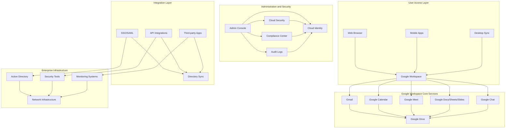

# Google Workspace - Solution Design Template

## Document Information
**Solution**: Google Workspace Enterprise Platform  
**Version**: 1.0  
**Date**: January 2025  
**Audience**: Solutions Architects, IT Decision Makers, Business Stakeholders  

---

## 1. Executive Summary

### 1.1 Solution Overview
Google Workspace provides a comprehensive cloud-based productivity and collaboration platform that transforms how organizations communicate, collaborate, and conduct business. This solution design addresses [CLIENT_NAME]'s requirements for modern workplace productivity, remote collaboration, enhanced security, and organizational agility.

### 1.2 Key Business Drivers
- **Digital Transformation**: Enable modern, cloud-first workplace capabilities
- **Remote Work Excellence**: Support hybrid and distributed workforce
- **Collaboration Enhancement**: Improve team productivity and communication
- **Cost Optimization**: Reduce IT infrastructure and operational overhead
- **Security and Compliance**: Enterprise-grade security and data protection
- **Innovation Acceleration**: Leverage AI and machine learning capabilities

### 1.3 Solution Benefits
- Unified collaboration platform with real-time editing and sharing
- Enterprise-grade security with zero-trust architecture
- Seamless mobile and remote work capabilities
- Advanced AI-powered features for productivity enhancement
- Comprehensive administrative controls and compliance tools
- Extensive third-party integrations and custom development platform

---

## 2. Current State Assessment

### 2.1 Existing Technology Landscape
```yaml
current_systems:
  email_platform:
    system: [Microsoft Exchange/Lotus Notes/Other]
    version: [VERSION]
    user_count: [TOTAL_USERS]
    storage_usage: [GB_PER_USER]
    annual_cost: [COST_USD]
    
  file_sharing:
    primary_system: [SharePoint/File Servers/Dropbox]
    storage_capacity: [TB_TOTAL]
    active_users: [USER_COUNT]
    sync_solutions: [Third-party tools]
    annual_cost: [COST_USD]
    
  communication_tools:
    video_conferencing: [Zoom/Teams/WebEx]
    instant_messaging: [Slack/Teams/Skype]
    phone_system: [Traditional PBX/VoIP]
    annual_licensing: [TOTAL_COST]
    
  productivity_suite:
    office_suite: [Microsoft Office/LibreOffice]
    licensing_model: [Perpetual/Subscription]
    version_management: [Manual/Automated]
    annual_cost: [COST_USD]
```

### 2.2 Infrastructure and IT Operations
| **Component** | **Current State** | **Challenges** | **Impact** |
|---------------|-------------------|----------------|------------|
| Email Infrastructure | [On-premises/Hybrid/Cloud] | [Maintenance overhead] | [High IT support costs] |
| File Storage | [Local servers/NAS/SAN] | [Capacity limitations] | [User productivity impact] |
| Backup Systems | [Tape/Disk/Cloud] | [Complexity and cost] | [Recovery time objectives] |
| Security Tools | [Multiple point solutions] | [Integration challenges] | [Security gaps] |
| Mobile Device Management | [BYOD challenges] | [Policy enforcement] | [Security and compliance] |

### 2.3 User Experience and Productivity
```yaml
user_productivity_assessment:
  collaboration_challenges:
    - version_control_issues: "Multiple file versions and conflicts"
    - access_limitations: "Difficulty accessing files remotely"
    - meeting_inefficiency: "Poor video quality and connectivity"
    - mobile_experience: "Limited mobile productivity capabilities"
    
  current_workflows:
    document_creation: [Manual processes and templates]
    review_approval: [Email-based workflows]
    project_collaboration: [Fragmented tool usage]
    knowledge_sharing: [Siloed information storage]
    
  pain_points:
    - slow_file_access: "Network latency and VPN issues"
    - poor_search: "Difficulty finding information and documents"
    - limited_mobility: "Reduced productivity when remote"
    - security_concerns: "Data loss and unauthorized access"
```

### 2.4 Compliance and Security Requirements
```yaml
regulatory_compliance:
  frameworks:
    - hipaa: [Healthcare data protection]
    - gdpr: [EU data privacy regulation]
    - sox: [Financial reporting compliance]
    - iso_27001: [Information security management]
    
  data_governance:
    data_classification: [Public/Internal/Confidential/Restricted]
    retention_policies: [Legal hold and archival requirements]
    geographic_restrictions: [Data residency requirements]
    audit_requirements: [Compliance reporting and monitoring]
    
  security_controls:
    access_management: [Multi-factor authentication requirements]
    encryption_standards: [Data at rest and in transit]
    endpoint_security: [Device management and protection]
    network_security: [Perimeter and internal controls]
```

---

## 3. Target Architecture

### 3.1 High-Level Solution Architecture



### 3.2 Google Workspace Edition Selection

#### 3.2.1 Edition Comparison
```yaml
workspace_editions:
  business_starter:
    price_per_user_month: 6
    storage_per_user: "30 GB"
    features:
      - gmail_custom_domain: true
      - meet_participants: 100
      - drive_docs_sheets_slides: true
      - calendar: true
      - chat: true
      - standard_support: true
    recommended_for: "Small businesses, basic needs"
    
  business_standard:
    price_per_user_month: 12
    storage_per_user: "2 TB"
    features:
      - all_starter_features: true
      - meet_participants: 150
      - meet_recording: true
      - shared_drives: true
      - vault_basic: true
      - endpoint_management: true
    recommended_for: "Growing businesses, standard requirements"
    
  business_plus:
    price_per_user_month: 18
    storage_per_user: "5 TB"
    features:
      - all_standard_features: true
      - meet_participants: 250
      - vault_advanced: true
      - cloud_search: true
      - enhanced_security: true
      - compliance_controls: true
    recommended_for: "Large teams, enhanced security needs"
    
  enterprise:
    price_per_user_month: 25
    storage_per_user: "Unlimited*"
    features:
      - all_plus_features: true
      - meet_participants: 250
      - advanced_security_center: true
      - data_regions: true
      - audit_logs: true
      - advanced_endpoint_management: true
    recommended_for: "Enterprise organizations, maximum features"
```

#### 3.2.2 Recommended Configuration
```yaml
recommended_deployment:
  primary_edition: "Business Standard"
  user_distribution:
    business_standard: [MAJORITY_OF_USERS]
    business_plus: [SECURITY_SENSITIVE_USERS]
    enterprise: [EXECUTIVES_AND_COMPLIANCE_USERS]
  
  rationale:
    - cost_efficiency: "Balance of features and cost"
    - feature_coverage: "Meets 80% of user requirements"
    - scalability: "Easy upgrade path for additional features"
    - security_compliance: "Adequate for most organizational needs"
```

### 3.3 Identity and Access Management

#### 3.3.1 Cloud Identity Configuration
```yaml
cloud_identity_design:
  identity_source: "Google Cloud Directory Sync (GCDS)"
  primary_directory: "Microsoft Active Directory"
  sync_frequency: "Every 15 minutes"
  
  organizational_units:
    - name: "Executives"
      policies: "Enhanced security, unlimited storage"
    - name: "Sales Team"
      policies: "Standard security, CRM integrations"
    - name: "Engineering"
      policies: "Developer tools, advanced collaboration"
    - name: "HR Department"
      policies: "Confidential data access, compliance controls"
    - name: "Contractors"
      policies: "Limited access, time-based restrictions"
  
  authentication_methods:
    primary: "SAML SSO with Active Directory"
    secondary: "Google 2-Step Verification"
    backup: "Security keys for administrators"
    
  password_policies:
    minimum_length: 12
    complexity_requirements: true
    expiration_period: "90 days"
    reuse_prevention: "Last 12 passwords"
```

#### 3.3.2 Single Sign-On (SSO) Integration
```yaml
sso_configuration:
  identity_provider: "Microsoft ADFS / Azure AD"
  protocol: "SAML 2.0"
  attributes_mapping:
    - email: "mail"
    - first_name: "givenName"
    - last_name: "sn"
    - department: "department"
    - title: "title"
    
  conditional_access:
    location_based: "Block access from restricted countries"
    device_based: "Require managed devices for sensitive data"
    time_based: "Business hours access for contractors"
    risk_based: "Additional verification for suspicious activity"
```

### 3.4 Security Architecture

#### 3.4.1 Data Protection and Classification
```yaml
data_protection_framework:
  classification_labels:
    - public: "No restrictions, publicly shareable"
    - internal: "Company internal use only"
    - confidential: "Restricted access, business sensitive"
    - restricted: "Highest security, legal/financial data"
    
  protection_controls:
    encryption:
      data_at_rest: "Google-managed encryption keys"
      data_in_transit: "TLS 1.3 encryption"
      customer_managed_keys: "For restricted data categories"
      
    access_controls:
      drive_sharing: "Organizational limits and warnings"
      external_sharing: "Admin approval for confidential data"
      link_sharing: "Restrictions based on classification"
      
    dlp_policies:
      credit_card_numbers: "Block sharing and external access"
      ssn_detection: "Alert administrators and restrict"
      financial_data: "Audit all access and modifications"
```

#### 3.4.2 Advanced Security Features
```yaml
security_controls:
  advanced_protection:
    context_aware_access: "Device, location, and behavior analysis"
    security_center: "Centralized security monitoring"
    investigation_tool: "Advanced threat investigation"
    
  endpoint_management:
    mobile_device_management: "Corporate and BYOD device policies"
    app_management: "Approved app catalog and restrictions"
    device_encryption: "Mandatory encryption for corporate data"
    remote_wipe: "Selective or full device wipe capabilities"
    
  threat_protection:
    gmail_security: "Advanced phishing and malware protection"
    safe_browsing: "Web threat protection in Chrome"
    attachment_scanning: "Real-time malware detection"
    suspicious_login_detection: "Behavioral analysis and alerting"
```

### 3.5 Compliance and Governance

#### 3.5.1 Google Vault Configuration
```yaml
vault_configuration:
  retention_policies:
    email_retention:
      standard_users: "7 years"
      executives: "10 years"
      legal_department: "Indefinite hold"
      
    drive_retention:
      project_files: "5 years after completion"
      financial_records: "10 years"
      hr_records: "Employee lifetime + 7 years"
      
  legal_hold_procedures:
    litigation_hold: "Automatic preservation for legal matters"
    investigation_hold: "HR and compliance investigations"
    regulatory_hold: "Industry-specific requirements"
    
  search_and_export:
    authorized_users: "Legal team and designated administrators"
    audit_trail: "All search and export activities logged"
    data_formats: "Native format preservation for legal review"
```

#### 3.5.2 Audit and Reporting
```yaml
audit_framework:
  activity_reporting:
    admin_activities: "Configuration changes and user management"
    user_activities: "Login patterns and data access"
    sharing_activities: "External sharing and collaboration"
    security_events: "Failed logins and policy violations"
    
  compliance_reporting:
    scheduled_reports: "Weekly security summaries"
    real_time_alerts: "Critical security events"
    custom_dashboards: "Executive and compliance officer views"
    api_integration: "SIEM and security tool integration"
```

---

## 4. Migration Strategy

### 4.1 Migration Planning

#### 4.1.1 Migration Phases
```yaml
migration_phases:
  phase_1_preparation:
    duration: "4-6 weeks"
    activities:
      - inventory_assessment: "Complete user and data inventory"
      - pilot_group_selection: "Identify 50-100 pilot users"
      - technical_setup: "Domain verification and basic configuration"
      - training_preparation: "Develop training materials and schedule"
      
  phase_2_pilot:
    duration: "2-4 weeks"
    activities:
      - pilot_migration: "Migrate pilot group users and data"
      - feedback_collection: "Gather user experience feedback"
      - issue_resolution: "Address technical and usability issues"
      - process_refinement: "Optimize migration procedures"
      
  phase_3_rollout:
    duration: "8-12 weeks"
    activities:
      - department_waves: "Migrate by department or business unit"
      - progressive_deployment: "Gradual user onboarding"
      - support_scaling: "Increase help desk and training capacity"
      - monitoring_optimization: "Continuous process improvement"
      
  phase_4_completion:
    duration: "2-4 weeks"
    activities:
      - final_migrations: "Complete remaining users and edge cases"
      - legacy_decommission: "Shut down old systems safely"
      - knowledge_transfer: "Full handover to internal teams"
      - success_measurement: "Validate ROI and success metrics"
```

#### 4.1.2 Data Migration Strategy
```yaml
data_migration_plan:
  email_migration:
    tool: "Google Workspace Migration for Exchange (GWME)"
    scope: "All emails, calendar, and contacts"
    batch_size: "100-200 users per batch"
    timing: "Weekend migrations to minimize impact"
    
  file_migration:
    shared_drives: "Google Drive File Stream bulk migration"
    personal_files: "User-driven migration with assistance"
    legacy_archives: "Selective migration based on access patterns"
    
  application_data:
    crm_integration: "Salesforce to Google Workspace sync"
    hr_systems: "BambooHR integration with Google Directory"
    project_management: "Asana/Monday.com Google Drive integration"
```

### 4.2 Change Management

#### 4.2.1 User Adoption Strategy
```yaml
adoption_strategy:
  communication_plan:
    executive_sponsorship: "C-level champions and messaging"
    regular_updates: "Weekly progress and success stories"
    success_showcases: "Highlight productivity improvements"
    
  training_program:
    role_based_training:
      end_users: "4-hour Google Workspace fundamentals"
      power_users: "8-hour advanced features and collaboration"
      administrators: "16-hour technical administration"
      
    delivery_methods:
      instructor_led: "In-person and virtual sessions"
      self_paced: "Online learning modules and videos"
      peer_to_peer: "Champion network and mentoring"
      just_in_time: "Contextual help and tooltips"
      
  support_framework:
    help_desk: "Extended hours during transition"
    champions_network: "Department ambassadors and experts"
    documentation: "Custom quick reference guides"
    feedback_loops: "Regular user satisfaction surveys"
```

#### 4.2.2 Success Metrics and KPIs
```yaml
success_metrics:
  adoption_metrics:
    user_activation: "Users who complete initial setup"
    feature_utilization: "Usage of core Workspace features"
    collaboration_patterns: "Sharing and real-time editing activity"
    mobile_adoption: "Mobile app usage and engagement"
    
  productivity_metrics:
    meeting_efficiency: "Reduction in meeting preparation time"
    document_collaboration: "Real-time editing sessions"
    search_effectiveness: "Successful information retrieval"
    workflow_automation: "Time savings from automated processes"
    
  business_metrics:
    cost_reduction: "IT infrastructure and licensing savings"
    employee_satisfaction: "User experience and productivity scores"
    business_agility: "Speed of project delivery and decision-making"
    innovation_metrics: "New digital workflow adoption"
```

---

## 5. Integration Architecture

### 5.1 Enterprise Application Integration

#### 5.1.1 CRM Integration
```yaml
salesforce_integration:
  integration_type: "Native Salesforce for Google Workspace"
  features:
    - gmail_integration: "Email sync and tracking"
    - calendar_sync: "Meeting and appointment management"
    - drive_attachment: "Proposal and contract management"
    - meet_integration: "Client meeting scheduling and recording"
    
  data_flow:
    bidirectional_sync: "Contact and opportunity information"
    activity_tracking: "Email and meeting engagement"
    document_linking: "Proposal and contract association"
    
  security_considerations:
    oauth_authentication: "Secure API access"
    data_encryption: "End-to-end encryption"
    access_controls: "Role-based CRM data access"
```

#### 5.1.2 HR Systems Integration
```yaml
hr_integration:
  primary_system: "BambooHR / Workday / SuccessFactors"
  integration_methods:
    - directory_sync: "Automated user provisioning and deprovisioning"
    - org_chart_sync: "Organizational structure updates"
    - employee_data: "Profile information and department changes"
    
  workflows:
    new_hire_provisioning: "Automatic account creation and access"
    role_changes: "Access updates based on position changes"
    termination_process: "Account suspension and data retention"
    
  compliance_features:
    audit_trail: "All HR-initiated changes logged"
    data_privacy: "PII protection and access controls"
    retention_policies: "Employee data lifecycle management"
```

#### 5.1.3 Financial Systems Integration
```yaml
erp_integration:
  systems: "SAP / Oracle / NetSuite"
  integration_points:
    expense_reporting: "Google Sheets integration for expense tracking"
    budget_planning: "Collaborative budget development"
    financial_reporting: "Automated report generation and distribution"
    
  security_measures:
    financial_data_classification: "Restricted access and encryption"
    segregation_of_duties: "Approval workflows and controls"
    audit_compliance: "SOX compliance reporting"
```

### 5.2 Productivity and Collaboration Integrations

#### 5.2.1 Project Management Integration
```yaml
project_management_tools:
  asana_integration:
    google_drive: "Project file management and sharing"
    calendar_sync: "Task deadlines and milestone tracking"
    gmail_integration: "Task creation from emails"
    
  monday_com_integration:
    board_collaboration: "Real-time project board updates"
    file_attachments: "Direct Drive file linking"
    notification_sync: "Project updates via Gmail and Chat"
    
  custom_integration:
    apps_script: "Custom workflow automation"
    api_connections: "Third-party tool connectivity"
    data_synchronization: "Cross-platform data consistency"
```

#### 5.2.2 Communication Platform Integration
```yaml
communication_integration:
  slack_migration:
    chat_transition: "Migrate team conversations to Google Chat"
    channel_mapping: "Convert Slack channels to Chat spaces"
    integration_retention: "Maintain critical Slack integrations"
    
  microsoft_teams_coexistence:
    selective_migration: "Department-by-department transition"
    meeting_consolidation: "Standardize on Google Meet"
    file_system_integration: "Drive as primary file repository"
```

---

## 6. Technical Implementation

### 6.1 Domain and DNS Configuration

#### 6.1.1 Domain Setup
```yaml
domain_configuration:
  primary_domain: "company.com"
  alias_domains:
    - legacy_domain: "oldcompany.com"
    - regional_domains: "company.co.uk, company.de"
    
  dns_records:
    mx_records:
      - priority: 1
        value: "ASPMX.L.GOOGLE.COM"
      - priority: 5
        value: "ALT1.ASPMX.L.GOOGLE.COM"
      - priority: 5
        value: "ALT2.ASPMX.L.GOOGLE.COM"
      - priority: 10
        value: "ALT3.ASPMX.L.GOOGLE.COM"
      - priority: 10
        value: "ALT4.ASPMX.L.GOOGLE.COM"
        
    verification_records:
      - type: "TXT"
        value: "google-site-verification=ABC123..."
        
    spf_record:
      - type: "TXT"
        value: "v=spf1 include:_spf.google.com ~all"
        
    dkim_record:
      - type: "TXT"
        selector: "google._domainkey"
        value: "k=rsa; p=MIIBIjANBgkqhki..."
```

#### 6.1.2 Email Routing Configuration
```yaml
email_routing:
  transition_strategy: "Dual delivery during migration"
  routing_rules:
    migrated_users: "Direct to Google Workspace"
    pending_users: "Route to legacy system"
    shared_mailboxes: "Gradual migration approach"
    
  spam_filtering:
    google_filtering: "Primary spam and malware protection"
    additional_filtering: "Proofpoint/Mimecast integration if required"
    
  email_security:
    dmarc_policy: "Gradual enforcement (none -> quarantine -> reject)"
    encryption: "TLS enforcement for email transport"
    dlp_integration: "Data loss prevention policies"
```

### 6.2 Network and Connectivity

#### 6.2.1 Bandwidth Planning
```yaml
bandwidth_requirements:
  per_user_estimates:
    light_usage: "1-2 Mbps (email, documents)"
    standard_usage: "3-5 Mbps (video calls, file sync)"
    heavy_usage: "5-10 Mbps (video editing, large files)"
    
  site_calculations:
    headquarters_1000_users: "2-5 Gbps recommended"
    branch_office_100_users: "200-500 Mbps recommended"
    remote_workers: "25 Mbps minimum per user"
    
  optimization_strategies:
    drive_file_stream: "On-demand file access to reduce bandwidth"
    meet_quality_settings: "Adaptive quality based on connection"
    offline_capabilities: "Reduced dependency on constant connectivity"
```

#### 6.2.2 Network Optimization
```yaml
network_optimization:
  google_peering:
    direct_peering: "If available and cost-effective"
    cdn_utilization: "Google Global Load Balancer benefits"
    regional_optimization: "Closest Google data center routing"
    
  qos_configuration:
    video_conferencing: "High priority for Meet traffic"
    file_synchronization: "Medium priority for Drive sync"
    email_delivery: "Standard priority for Gmail"
    
  firewall_configuration:
    required_ports:
      - https: "443 (primary)"
      - imaps: "993 (Gmail clients)"
      - smtp: "587 (email sending)"
      - pop3s: "995 (if required)"
    
    ip_whitelisting:
      google_ip_ranges: "Dynamic Google IP ranges"
      security_considerations: "Regular updates required"
```

---

## 7. Cost Analysis and Optimization

### 7.1 Total Cost of Ownership (TCO)

#### 7.1.1 Licensing Costs (Annual)
```yaml
licensing_costs:
  workspace_standard:
    users: [NUMBER_OF_USERS]
    cost_per_user: 144  # $12/month
    annual_cost: [USERS * 144]
    
  additional_services:
    google_voice: [VOICE_USERS * 180]  # $15/month
    cloud_identity_premium: [PREMIUM_USERS * 72]  # $6/month
    chronicle_security: [SECURITY_USERS * 60]  # $5/month
    
  total_annual_licensing: [CALCULATED_TOTAL]
```

#### 7.1.2 Implementation Costs (One-time)
```yaml
implementation_costs:
  professional_services:
    migration_services: 150000
    change_management: 200000
    training_delivery: 100000
    custom_integrations: 75000
    
  internal_resources:
    project_management: 100000  # Internal PM costs
    it_staff_time: 200000       # Implementation effort
    business_user_time: 150000  # Training and transition
    
  technology_costs:
    migration_tools: 25000      # Third-party migration utilities
    training_materials: 15000   # Custom training development
    temporary_licenses: 30000   # Overlap period licensing
    
  total_implementation: 1045000
```

#### 7.1.3 Ongoing Operational Costs
```yaml
operational_costs:
  reduced_infrastructure:
    email_server_elimination: -240000   # Savings
    file_server_reduction: -120000      # Reduced capacity needs
    backup_system_savings: -80000       # Less backup infrastructure
    
  reduced_it_support:
    help_desk_reduction: -150000        # Less support needed
    server_administration: -180000      # No email server management
    software_updates: -50000            # Automatic updates
    
  additional_costs:
    bandwidth_increase: 60000           # Higher internet usage
    security_monitoring: 40000          # Enhanced security tools
    compliance_tools: 25000             # Additional compliance features
    
  net_annual_savings: -655000  # Net operational savings
```

### 7.2 Cost Optimization Strategies

#### 7.2.1 License Optimization
```yaml
license_optimization:
  edition_tiering:
    business_starter: "Basic users with minimal storage needs"
    business_standard: "Standard business users (80% of organization)"
    business_plus: "Power users and security-sensitive roles"
    enterprise: "Executives and compliance-required users"
    
  feature_utilization:
    storage_analysis: "Right-size storage based on actual usage"
    feature_audit: "Ensure paid features are actively used"
    seasonal_adjustments: "Scale licenses for temporary workers"
    
  cost_monitoring:
    monthly_reviews: "Regular license utilization analysis"
    automated_alerts: "Unused license identification"
    optimization_recommendations: "Quarterly cost optimization reviews"
```

#### 7.2.2 Infrastructure Savings
```yaml
infrastructure_optimization:
  server_decommissioning:
    email_servers: "Complete elimination of Exchange servers"
    file_servers: "Significant reduction in file server capacity"
    backup_infrastructure: "Reduced backup storage and systems"
    
  cloud_migration_benefits:
    capital_expenditure_elimination: "No hardware refresh cycles"
    operational_expenditure_reduction: "Lower maintenance and support"
    scalability_improvements: "Pay-as-you-grow model"
    
  energy_and_facilities:
    power_consumption: "Reduced data center power usage"
    cooling_requirements: "Lower HVAC costs"
    space_utilization: "Freed rack space for other uses"
```

---

## 8. Security and Compliance Implementation

### 8.1 Security Control Framework

#### 8.1.1 Identity and Access Controls
```yaml
iam_implementation:
  authentication_layers:
    primary_authentication: "SAML SSO with corporate identity provider"
    multi_factor_authentication: "Google 2-Step Verification"
    risk_based_authentication: "Suspicious activity detection"
    
  authorization_framework:
    role_based_access: "Organizational unit-based permissions"
    attribute_based_access: "Context-aware access decisions"
    just_in_time_access: "Temporary elevated permissions"
    
  session_management:
    session_timeout: "8 hours for standard users, 4 hours for admins"
    concurrent_session_limits: "Maximum 5 active sessions"
    device_registration: "Trusted device management"
```

#### 8.1.2 Data Protection Controls
```yaml
data_protection_implementation:
  classification_enforcement:
    automated_classification: "Content-based labeling"
    user_applied_labels: "Manual classification options"
    inheritance_rules: "Child document classification"
    
  access_controls:
    sharing_restrictions: "Default internal-only sharing"
    external_sharing_controls: "Admin approval for external access"
    link_expiration: "Time-limited sharing links"
    
  encryption_implementation:
    customer_managed_keys: "For highest sensitivity data"
    client_side_encryption: "For restricted data categories"
    key_rotation: "Automated key rotation policies"
```

### 8.2 Compliance Framework

#### 8.2.1 Regulatory Compliance
```yaml
compliance_implementation:
  gdpr_compliance:
    data_subject_rights: "Automated data export and deletion"
    consent_management: "Explicit consent tracking"
    data_processing_records: "Activity logging and reporting"
    breach_notification: "Automated incident response"
    
  hipaa_compliance:
    baa_execution: "Business Associate Agreement with Google"
    phi_protection: "Healthcare data classification and controls"
    access_logging: "Comprehensive audit trails"
    risk_assessments: "Regular security evaluations"
    
  sox_compliance:
    financial_data_controls: "Restricted access to financial information"
    segregation_of_duties: "Approval workflow implementation"
    audit_trail: "Complete activity logging"
    change_management: "Controlled configuration changes"
```

#### 8.2.2 Industry Standards
```yaml
standards_compliance:
  iso_27001:
    information_security_management: "Comprehensive security program"
    risk_management: "Regular risk assessments and mitigation"
    incident_management: "Structured incident response procedures"
    business_continuity: "Disaster recovery and business continuity planning"
    
  nist_framework:
    identify: "Asset inventory and risk assessment"
    protect: "Security controls and training"
    detect: "Monitoring and threat detection"
    respond: "Incident response procedures"
    recover: "Recovery planning and procedures"
```

---

## 9. Monitoring and Analytics

### 9.1 Usage Analytics and Reporting

#### 9.1.1 Administrative Reporting
```yaml
admin_reporting:
  user_activity_reports:
    login_patterns: "User authentication and access patterns"
    application_usage: "Feature utilization across Workspace apps"
    collaboration_metrics: "Sharing and real-time editing activity"
    mobile_usage: "Mobile app engagement and productivity"
    
  security_reports:
    failed_authentication: "Suspicious login attempts"
    sharing_violations: "External sharing policy violations"
    device_compliance: "Managed device compliance status"
    data_loss_events: "DLP policy violations and incidents"
    
  compliance_reports:
    audit_logs: "Administrative and user activity logs"
    data_governance: "Data classification and retention compliance"
    access_reviews: "Periodic access certification reports"
    privacy_impact: "Data processing and privacy compliance"
```

#### 9.1.2 Business Intelligence Integration
```yaml
bi_integration:
  data_export_methods:
    admin_sdk_api: "Programmatic access to usage data"
    google_analytics: "Workspace usage analytics"
    bigquery_export: "Large-scale data analysis"
    
  custom_dashboards:
    executive_dashboard: "High-level usage and ROI metrics"
    it_operations_dashboard: "Technical performance and issues"
    security_dashboard: "Security posture and incident tracking"
    compliance_dashboard: "Regulatory compliance status"
    
  alerting_framework:
    threshold_based_alerts: "Usage anomaly detection"
    security_incident_alerts: "Real-time security notifications"
    compliance_violations: "Regulatory compliance alerts"
    performance_degradation: "Service availability monitoring"
```

### 9.2 Performance Monitoring

#### 9.2.1 Service Level Monitoring
```yaml
sla_monitoring:
  availability_targets:
    gmail: "99.9% uptime SLA"
    drive: "99.9% uptime SLA"
    meet: "99.9% uptime SLA"
    admin_console: "99.9% uptime SLA"
    
  performance_metrics:
    email_delivery_time: "< 5 seconds average"
    file_sync_performance: "< 30 seconds for small files"
    meeting_join_time: "< 10 seconds average"
    search_response_time: "< 2 seconds average"
    
  incident_response:
    detection_methods: "Automated monitoring and user reports"
    escalation_procedures: "Google support and internal processes"
    communication_plan: "User notification and status updates"
    post_incident_review: "Root cause analysis and improvement"
```

---

## 10. Success Metrics and KPIs

### 10.1 Technical Metrics
```yaml
technical_kpis:
  system_performance:
    service_availability: "> 99.9%"
    email_delivery_success: "> 99.5%"
    file_sync_reliability: "> 99%"
    meeting_connection_success: "> 95%"
    
  security_metrics:
    authentication_success_rate: "> 99%"
    malware_detection_rate: "100% of known threats"
    phishing_prevention_rate: "> 99%"
    data_loss_incidents: "Zero tolerance"
    
  compliance_metrics:
    audit_compliance_score: "> 95%"
    data_governance_compliance: "100%"
    regulatory_violations: "Zero incidents"
    privacy_compliance_rate: "100%"
```

### 10.2 Business Metrics
```yaml
business_kpis:
  productivity_metrics:
    document_collaboration_increase: "> 300%"
    meeting_efficiency_improvement: "> 25%"
    mobile_productivity_increase: "> 200%"
    search_efficiency_improvement: "> 400%"
    
  cost_metrics:
    it_infrastructure_cost_reduction: "> 40%"
    support_cost_reduction: "> 50%"
    total_cost_of_ownership_improvement: "> 30%"
    
  user_satisfaction:
    user_adoption_rate: "> 95%"
    user_satisfaction_score: "> 85%"
    support_ticket_reduction: "> 60%"
    training_completion_rate: "> 90%"
```

---

## 11. Risk Assessment and Mitigation

### 11.1 Implementation Risks

| **Risk Category** | **Risk Description** | **Probability** | **Impact** | **Mitigation Strategy** |
|-------------------|---------------------|-----------------|------------|------------------------|
| User Adoption | Resistance to change and new workflows | Medium | High | Comprehensive change management and training program |
| Data Migration | Potential data loss or corruption | Low | Critical | Multiple backup strategies and validation procedures |
| Integration Issues | Third-party application compatibility | Medium | Medium | Thorough integration testing and fallback procedures |
| Security Gaps | Potential security vulnerabilities during transition | Low | High | Phased security implementation and monitoring |
| Performance Issues | Service degradation or connectivity problems | Low | Medium | Network optimization and capacity planning |

### 11.2 Operational Risks

| **Risk Category** | **Risk Description** | **Probability** | **Impact** | **Mitigation Strategy** |
|-------------------|---------------------|-----------------|------------|------------------------|
| Service Outages | Google service availability issues | Low | High | Business continuity planning and offline capabilities |
| Compliance Violations | Regulatory or policy compliance failures | Low | Critical | Comprehensive compliance framework and monitoring |
| Data Breach | Unauthorized access to sensitive information | Low | Critical | Multi-layered security controls and incident response |
| Vendor Lock-in | Dependency on Google services and formats | Medium | Medium | Data portability planning and format standardization |

---

## 12. Conclusion and Next Steps

### 12.1 Solution Summary
The Google Workspace solution design provides a comprehensive roadmap for digital workplace transformation, delivering:

- **Enhanced Productivity**: Modern collaboration tools with real-time editing and AI-powered features
- **Improved Security**: Enterprise-grade security with zero-trust architecture and compliance controls
- **Cost Optimization**: Significant reduction in IT infrastructure and operational costs
- **Business Agility**: Support for remote work and distributed teams with mobile-first design
- **Scalable Platform**: Cloud-native solution that grows with organizational needs

### 12.2 Critical Success Factors
1. **Executive Sponsorship**: Strong leadership commitment and change advocacy
2. **Comprehensive Change Management**: User-centric approach to adoption and training
3. **Phased Implementation**: Gradual rollout with pilot validation and feedback incorporation
4. **Technical Excellence**: Proper migration planning and integration testing
5. **Continuous Optimization**: Ongoing monitoring and improvement processes

### 12.3 Recommended Next Steps
1. **Stakeholder Alignment**: Secure executive approval and project funding
2. **Detailed Project Planning**: Develop comprehensive implementation timeline and resource allocation
3. **Pilot Program Setup**: Select pilot user groups and prepare test environment
4. **Migration Preparation**: Complete technical setup and data migration planning
5. **Training Program Development**: Create role-based training materials and delivery schedule

---

**Document Version**: 1.0  
**Last Updated**: January 2025  
**Prepared By**: Google Workspace Solutions Team  
**Reviewed By**: [Technical Architecture Committee]  
**Approved By**: [Client IT Leadership]

---

*This solution design should be customized based on specific organizational requirements, existing technology landscape, and business objectives. Regular reviews and updates should be conducted throughout the implementation process to ensure alignment with changing needs and emerging best practices.*