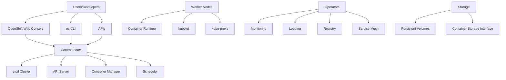

# IBM OpenShift Container Platform - Delivery Package

## Overview

This delivery package contains all the resources, documentation, and scripts needed to successfully deploy and operate IBM OpenShift Container Platform in enterprise environments. The solution provides enterprise-grade Kubernetes with integrated developer tools and multi-cloud capabilities.

## Package Contents

### 📋 Documentation
- **[Implementation Guide](./implementation-guide.md)** - Step-by-step deployment instructions
- **[Configuration Templates](./configuration-templates.md)** - Reusable configuration examples
- **[Operations Runbook](./operations-runbook.md)** - Day-to-day operational procedures
- **[Testing Procedures](./testing-procedures.md)** - Comprehensive testing framework
- **[Training Materials](./training-materials.md)** - Educational resources and curricula

### 🛠️ Scripts and Automation
- **[Scripts Directory](./scripts/)** - Deployment and management scripts
  - **Terraform** - Infrastructure as code templates
  - **Ansible** - Configuration management playbooks
  - **Bash** - Utility and deployment scripts
  - **PowerShell** - Windows-specific automation
  - **Python** - Custom tools and integrations

### ⚙️ Configuration Files
- **[Config Directory](./configs/)** - Platform configuration files
  - OpenShift cluster configurations
  - Network policies and security contexts
  - Monitoring and logging configurations
  - Integration templates

### 📁 Project Structure

```
delivery/
├── README.md                          # This file
├── implementation-guide.md            # Deployment guide
├── configuration-templates.md         # Configuration examples
├── operations-runbook.md              # Operations procedures
├── testing-procedures.md              # Testing framework
├── training-materials.md              # Training resources
├── configs/                           # Configuration files
│   ├── cluster/                       # Cluster configurations
│   ├── networking/                    # Network configurations
│   ├── security/                      # Security policies
│   └── monitoring/                    # Monitoring setup
├── scripts/                           # Automation scripts
│   ├── README.md                      # Scripts documentation
│   ├── terraform/                     # Infrastructure as code
│   ├── ansible/                       # Configuration management
│   ├── bash/                          # Shell scripts
│   ├── powershell/                    # Windows automation
│   └── python/                        # Python utilities
└── docs/                              # Additional documentation
    ├── architecture.md                # Architecture overview
    ├── prerequisites.md               # Prerequisites
    └── troubleshooting.md             # Troubleshooting guide
```

## Solution Overview

### Key Features
- **Enterprise Kubernetes**: Production-ready Kubernetes with enterprise security and compliance
- **Developer Experience**: Integrated CI/CD, source-to-image builds, and developer tools
- **Hybrid Cloud**: Consistent platform across on-premises, public cloud, and edge environments
- **Operator Ecosystem**: Automated application lifecycle management with Kubernetes operators
- **Built-in Monitoring**: Integrated Prometheus, Grafana, and Elasticsearch for observability

### Supported Platforms
- **AWS** - Elastic Kubernetes Service (EKS) and EC2
- **Microsoft Azure** - Azure Kubernetes Service (AKS) and Virtual Machines
- **Google Cloud Platform** - Google Kubernetes Engine (GKE) and Compute Engine
- **IBM Cloud** - Red Hat OpenShift on IBM Cloud
- **VMware vSphere** - On-premises virtualized infrastructure
- **Bare Metal** - Physical server deployments

### Architecture Components



## Getting Started

### Prerequisites

#### System Requirements
- **Control Plane Nodes**: 3 nodes minimum (4 vCPU, 16GB RAM, 100GB storage each)
- **Worker Nodes**: 3+ nodes minimum (8 vCPU, 32GB RAM, 200GB storage each)
- **Infrastructure Nodes**: 3 nodes recommended (4 vCPU, 16GB RAM, 100GB storage each)
- **Network**: Layer 3 connectivity between all nodes
- **Storage**: Persistent storage solution (NFS, Ceph, AWS EBS, etc.)

#### Software Requirements
- **Red Hat Enterprise Linux 8.x** or **RHEL CoreOS**
- **Container Runtime**: CRI-O (included)
- **DNS**: Corporate DNS resolution
- **Load Balancer**: External load balancer for API and ingress
- **Firewall**: Appropriate ports open between nodes

#### Access Requirements
- **Red Hat Subscription** with OpenShift entitlements
- **Pull Secret** from Red Hat Customer Portal
- **Administrative Access** to target infrastructure
- **DNS Control** for cluster domain configuration
- **Certificate Authority** access for custom certificates (optional)

### Quick Start Guide

#### 1. Environment Preparation
```bash
# Download and review the implementation guide
cat implementation-guide.md

# Set up environment variables
export CLUSTER_NAME="openshift-prod"
export BASE_DOMAIN="company.com"
export PULL_SECRET_FILE="path/to/pull-secret.json"

# Verify prerequisites
./scripts/bash/verify-prerequisites.sh
```

#### 2. Infrastructure Deployment
```bash
# Deploy infrastructure (if using IaaS)
cd scripts/terraform/
terraform init
terraform plan -var-file="openshift.tfvars"
terraform apply

# Or use cloud-specific scripts
./scripts/bash/deploy-aws.sh
./scripts/bash/deploy-azure.sh
./scripts/bash/deploy-gcp.sh
```

#### 3. OpenShift Installation
```bash
# Generate install configuration
./scripts/bash/generate-install-config.sh

# Deploy the cluster
./scripts/bash/install-openshift.sh

# Monitor installation progress
./scripts/bash/monitor-installation.sh
```

#### 4. Post-Installation Configuration
```bash
# Configure authentication
./scripts/bash/setup-authentication.sh

# Install operators
./scripts/bash/install-operators.sh

# Configure monitoring and logging
./scripts/bash/setup-monitoring.sh
./scripts/bash/setup-logging.sh
```

#### 5. Validation and Testing
```bash
# Run validation tests
./scripts/bash/run-tests.sh

# Perform health checks
./scripts/bash/health-check.sh

# Load test the cluster
./scripts/bash/load-test.sh
```

## Deployment Scenarios

### 1. AWS Deployment
**Use Case**: Public cloud deployment with AWS services integration
- **Infrastructure**: EC2 instances with EBS storage
- **Networking**: VPC with public/private subnets
- **Load Balancing**: Application Load Balancer (ALB)
- **Storage**: AWS EBS CSI driver for persistent storage

### 2. Azure Deployment
**Use Case**: Microsoft Azure cloud deployment
- **Infrastructure**: Azure Virtual Machines with managed disks
- **Networking**: Virtual Network with subnets
- **Load Balancing**: Azure Load Balancer
- **Storage**: Azure Disk CSI driver

### 3. On-Premises VMware
**Use Case**: Private cloud on VMware vSphere
- **Infrastructure**: vSphere Virtual Machines
- **Networking**: Distributed Virtual Switch
- **Load Balancing**: F5 BigIP or HAProxy
- **Storage**: vSphere CSI driver

### 4. Bare Metal
**Use Case**: High-performance computing on physical servers
- **Infrastructure**: Physical servers with IPMI/Redfish
- **Networking**: Physical switches and VLANs
- **Load Balancing**: Hardware load balancers
- **Storage**: Local storage or external SAN

### 5. Hybrid/Multi-Cloud
**Use Case**: Spanning multiple cloud providers and on-premises
- **Management**: Red Hat Advanced Cluster Management
- **Networking**: Multi-cluster service mesh
- **Storage**: Multi-zone persistent volumes
- **Security**: Consistent security policies across clusters

## Key Use Cases

### Application Modernization
- **Legacy Application Migration**: Containerize existing applications
- **Microservices Architecture**: Break monoliths into microservices
- **API Management**: Expose services through API gateways
- **Service Mesh**: Implement Istio for service-to-service communication

### CI/CD and DevOps
- **Source-to-Image (S2I)**: Build container images from source code
- **Pipeline Integration**: Jenkins, Tekton, or GitLab CI/CD
- **GitOps**: ArgoCD for continuous deployment
- **Security Scanning**: Integrated vulnerability scanning

### Data and Analytics
- **Stateful Applications**: Database and analytics workloads
- **Big Data**: Apache Kafka, Spark, and Hadoop on OpenShift
- **AI/ML**: Model training and inference workloads
- **Data Pipelines**: ETL and data processing workflows

### Edge Computing
- **Remote Locations**: Lightweight clusters at edge sites
- **IoT Integration**: Process data from IoT devices
- **Content Delivery**: Cache and serve content closer to users
- **Offline Capabilities**: Function without constant connectivity

## Support and Resources

### Documentation
- **Official Documentation**: [OpenShift Documentation](https://docs.openshift.com/)
- **Architecture Guides**: [Reference Architectures](https://access.redhat.com/documentation/en-us/reference_architectures/)
- **Best Practices**: [OpenShift Best Practices](https://docs.openshift.com/container-platform/latest/welcome/index.html)

### Community Resources
- **OpenShift Commons**: [commons.openshift.org](https://commons.openshift.org/)
- **Red Hat Developer**: [developers.redhat.com/openshift](https://developers.redhat.com/products/openshift)
- **GitHub**: [OpenShift Origin](https://github.com/openshift/origin)

### Training and Certification
- **Red Hat Training**: [DO180, DO280, DO380](https://www.redhat.com/en/services/training/all-courses-exams)
- **OpenShift Certification**: [Red Hat Certified Specialist in OpenShift](https://www.redhat.com/en/services/certification)
- **Hands-on Labs**: [Red Hat Demo Platform](https://demo.redhat.com/)

### Professional Services
- **IBM Red Hat Services**: Implementation, migration, and optimization services
- **Red Hat Consulting**: Architecture design and best practices guidance
- **Partner Ecosystem**: Certified partner solutions and integrations

## License and Support

### Licensing
- **OpenShift Container Platform**: Commercial license with Red Hat support
- **Red Hat Enterprise Linux**: RHEL subscription included
- **Operator Ecosystem**: Access to certified operators and content

### Support Channels
- **Red Hat Customer Portal**: [access.redhat.com](https://access.redhat.com/)
- **24/7 Support**: Available with premium subscriptions
- **Knowledge Base**: Extensive documentation and troubleshooting guides
- **Community Support**: Stack Overflow, Reddit, and forums

## Contributing and Feedback

We welcome contributions and feedback to improve this delivery package:

### Reporting Issues
- **Documentation Issues**: Submit issues for documentation improvements
- **Script Bugs**: Report problems with automation scripts
- **Feature Requests**: Suggest new features or enhancements

### Contributing
- **Fork and Pull Request**: Submit improvements via pull requests
- **Testing**: Help test scripts and procedures in different environments
- **Documentation**: Improve and expand documentation

### Feedback Channels
- **Email**: [openshift-delivery@ibm.com](mailto:openshift-delivery@ibm.com)
- **Slack**: Join our internal Slack workspace
- **Meetings**: Participate in monthly review meetings

---

## Version Information

**Package Version**: 4.14  
**Last Updated**: January 2025  
**Compatibility**: OpenShift 4.12+  
**Author**: IBM Red Hat Services  
**Maintainer**: [OpenShift Delivery Team](mailto:openshift-delivery@ibm.com)

## Changelog

### Version 4.14 (January 2025)
- Updated for OpenShift 4.14 compatibility
- Added multi-cloud deployment scenarios
- Enhanced security configurations
- Improved monitoring and observability setup

### Version 4.13 (October 2024)
- Added edge computing deployment options
- Enhanced CI/CD integration templates
- Updated operator ecosystem documentation
- Improved troubleshooting procedures

### Version 4.12 (July 2024)
- Initial package version
- Core deployment scripts and documentation
- Basic configuration templates
- Standard operational procedures