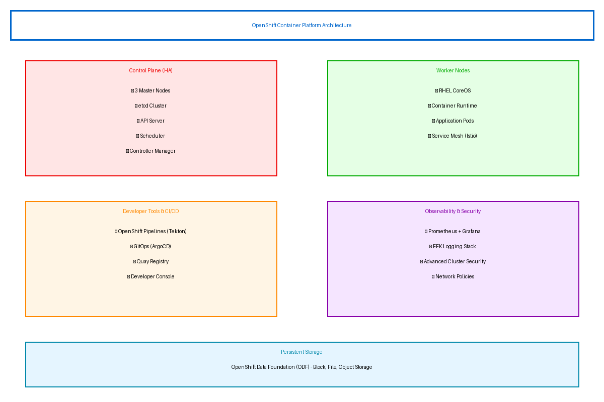

# Executive Summary

This document provides the comprehensive technical design for the Red Hat OpenShift Container Platform implementation. It covers the target-state architecture, security controls, data design, integration patterns, and implementation approach required for successful deployment of an enterprise Kubernetes platform.

## Purpose

Define the technical architecture and design specifications that will guide the implementation team through deployment, configuration, and validation of the OpenShift Container Platform for containerized application workloads.

## Scope

**In-scope:**
- OpenShift Container Platform 4.14 cluster deployment (6 nodes)
- Developer tools including CI/CD pipelines and GitOps
- Monitoring and logging stack (Prometheus, Grafana, EFK)
- Container registry (Quay) with vulnerability scanning
- Service mesh (Istio) for microservices
- Integration with corporate Active Directory/LDAP

**Out-of-scope:**
- End-user application development (covered in developer training)
- Multi-cluster management (Phase 2 consideration)
- Bare metal deployment (VMware-based implementation)

## Assumptions & Constraints

The following assumptions underpin the design and must be validated during implementation.

- VMware vSphere 7.0+ infrastructure available with sufficient capacity
- Network connectivity between OpenShift cluster and corporate AD/LDAP
- DNS zone delegation for cluster subdomain (*.apps.cluster.example.com)
- Red Hat subscription entitlements active with Platform Plus licensing
- 4-hour RTO, 1-hour RPO requirements for disaster recovery

## References

This document should be read in conjunction with the following related materials.

- Statement of Work (SOW) - Project scope and commercial terms
- Red Hat OpenShift 4.14 Documentation
- Client security standards and compliance requirements
- VMware infrastructure specifications

# Business Context

This section establishes the business drivers, success criteria, and compliance requirements that shape the technical design decisions.

## Business Drivers

The solution addresses the following key business objectives identified during discovery.

- **Developer Productivity:** Enable self-service deployments reducing time from 2 weeks to 4 hours
- **Operational Efficiency:** Reduce infrastructure operations overhead by 50% (2.5 FTEs)
- **Resource Optimization:** Improve infrastructure utilization from 15-20% to 50-60%
- **Deployment Frequency:** Increase deployment frequency 10x through automation
- **Standardization:** Establish consistent containerization patterns across applications

## Workload Criticality & SLA Expectations

The following service level targets define the operational requirements for the production environment and guide infrastructure sizing decisions.

<!-- TABLE_CONFIG: widths=[25, 25, 25, 25] -->
| Metric | Target | Measurement | Priority |
|--------|--------|-------------|----------|
| Platform Availability | 99.5% | OpenShift cluster uptime | Critical |
| API Response Time | < 500ms | p95 latency for API calls | High |
| Pod Startup Time | < 45 seconds | Container ready state | High |
| RTO | 4 hours | Disaster recovery testing | Critical |
| RPO | 1 hour | Backup verification | Critical |

## Compliance & Regulatory Factors

The solution must adhere to the following regulatory and compliance requirements.

- Security policies enforced via Pod Security Admission (restricted profile)
- Network policies required for all production namespaces
- Audit logging enabled for all API operations
- Encryption at rest for etcd and persistent volumes
- TLS 1.2+ required for all communications

## Success Criteria

Project success will be measured against the following criteria at go-live.

- All 10 pilot applications containerized and deployed
- 50 developers onboarded with self-service capabilities
- CI/CD pipelines operational with < 15 minute build times
- Monitoring dashboards displaying cluster and application metrics
- Operations team trained and capable of independent platform management

# Current-State Assessment

This section documents the existing environment that the OpenShift platform will integrate with and modernize.

## Application Landscape

The current environment consists of VM-based applications that will be containerized and migrated to OpenShift.

<!-- TABLE_CONFIG: widths=[25, 30, 25, 20] -->
| Application | Purpose | Technology | Migration Status |
|-------------|---------|------------|------------------|
| Inventory API | Product inventory management | Java Spring Boot | Pilot candidate |
| Order Service | Order processing | Node.js | Pilot candidate |
| Customer Portal | Customer self-service | React frontend | Pilot candidate |
| Reporting Service | Business analytics | Python Flask | Phase 1 |
| Legacy CRM | Customer relationship | .NET Framework | Integration only |

## Infrastructure Inventory

The current infrastructure consists of the following VMware components that will host the OpenShift cluster.

<!-- TABLE_CONFIG: widths=[20, 15, 35, 30] -->
| Component | Quantity | Specifications | Notes |
|-----------|----------|----------------|-------|
| ESXi Hosts | 4 | 32 cores, 512GB RAM each | OpenShift cluster hosting |
| vCenter | 1 | Version 7.0 Update 3 | Cluster management |
| Storage | 1 | 100TB NVMe SAN | vSAN or external array |
| Network | 2 | 10Gbps switches | Redundant connectivity |

## Dependencies & Integration Points

The current environment has the following external dependencies that must be integrated with OpenShift.

- Active Directory for user authentication (LDAP over TLS)
- Corporate DNS for cluster name resolution
- NTP servers for time synchronization
- SMTP relay for alert notifications
- PagerDuty for incident management

## Network Topology

Current network architecture includes:
- Corporate network with 10.0.0.0/8 address space
- Dedicated VLAN for OpenShift cluster (10.100.0.0/24)
- Firewall rules for external access
- Load balancer for API and application ingress

## Security Posture

The current security controls provide a baseline that will be enhanced with OpenShift security features.

- Perimeter firewall with IPS/IDS
- Active Directory for centralized authentication
- Vulnerability scanning for VMs
- Annual penetration testing
- Security awareness training program

## Performance Baseline

Current application performance metrics establish the baseline for containerized deployment comparison.

- Average response time: 800ms (target improvement to 500ms)
- Peak concurrent users: 200
- Daily deployment frequency: Weekly (target: daily or more)
- VM utilization: 15-20% average

# Solution Architecture

The target architecture leverages Red Hat OpenShift Container Platform to deliver an enterprise Kubernetes platform with integrated developer tools, security, and observability.

## Architecture Principles

The following principles guide all architectural decisions throughout the solution design.

- **Cloud-Native Design:** Leverage containerization and Kubernetes orchestration
- **Security by Design:** Implement pod security, network policies, and RBAC from day one
- **GitOps First:** All deployments via ArgoCD from Git repositories
- **Infrastructure as Code:** Cluster configuration managed via Ansible and operators
- **Observability:** Comprehensive monitoring, logging, and tracing

## Architecture Patterns

The solution implements the following architectural patterns to address scalability and reliability requirements.

- **Primary Pattern:** Container orchestration with Kubernetes
- **Storage Pattern:** Software-defined storage via OpenShift Data Foundation
- **Network Pattern:** OVN-Kubernetes with network policies
- **Deployment Pattern:** GitOps continuous delivery with ArgoCD

## Component Design

The solution comprises the following logical components, each with specific responsibilities and scaling characteristics.

<!-- TABLE_CONFIG: widths=[18, 25, 22, 18, 17] -->
| Component | Purpose | Technology | Dependencies | Scaling |
|-----------|---------|------------|--------------|---------|
| Control Plane | Cluster management and API | OpenShift Master | etcd, DNS | 3 nodes (HA) |
| Worker Nodes | Application workloads | OpenShift Worker | Control Plane | Horizontal |
| Storage | Persistent volumes | OpenShift Data Foundation | Worker nodes | Horizontal |
| Registry | Container images | Quay | Storage | Managed |
| Monitoring | Metrics and alerting | Prometheus/Grafana | Storage | Managed |
| Logging | Log aggregation | EFK Stack | Storage | Managed |
| Service Mesh | Service-to-service | Istio | Worker nodes | Per-app |
| GitOps | Continuous delivery | ArgoCD | Git repo | Managed |

## Technology Stack

The technology stack has been selected based on requirements for enterprise support, scalability, and alignment with organizational standards.

<!-- TABLE_CONFIG: widths=[25, 35, 40] -->
| Layer | Technology | Rationale |
|-------|------------|-----------|
| Platform | OpenShift Container Platform 4.14 | Enterprise Kubernetes with support |
| Compute | VMware vSphere 7.0 | Existing infrastructure investment |
| Storage | OpenShift Data Foundation | Integrated software-defined storage |
| Network | OVN-Kubernetes | Cloud-native networking with policy support |
| Monitoring | Prometheus + Grafana | Industry-standard observability |
| Logging | Elasticsearch + Fluentd + Kibana | Centralized log aggregation |
| CI/CD | OpenShift Pipelines (Tekton) | Cloud-native CI/CD |
| GitOps | ArgoCD | Declarative GitOps delivery |
| Registry | Quay | Enterprise registry with scanning |

# Security & Compliance

This section details the security controls, compliance mappings, and governance mechanisms implemented in the solution.

## Identity & Access Management

Access control follows a role-based model with centralized identity management via corporate Active Directory.

- **Authentication:** LDAP integration with corporate AD for user authentication
- **Authorization:** Kubernetes RBAC with group mapping from AD
- **MFA:** Required for cluster-admin access via corporate SSO
- **Service Accounts:** Managed via OpenShift with automatic token rotation

### Role Definitions

The following roles define access levels within the system, following the principle of least privilege.

<!-- TABLE_CONFIG: widths=[20, 40, 40] -->
| Role | Permissions | Scope |
|------|-------------|-------|
| cluster-admin | Full cluster access | All namespaces and resources |
| namespace-admin | Full namespace access | Assigned namespaces only |
| developer | Deploy and manage apps | Development namespaces |
| viewer | Read-only access | Specified namespaces |

## Secrets Management

All sensitive credentials are managed through OpenShift secrets with encryption at rest.

- Secrets stored in etcd with AES-256 encryption
- External secrets operator for HashiCorp Vault integration (optional)
- Automatic credential rotation for service accounts
- No secrets in Git repositories (sealed secrets for GitOps)

## Network Security

Network security implements defense-in-depth with multiple layers of protection.

- **Segmentation:** Namespace isolation with network policies
- **Default Deny:** Egress and ingress policies required for production
- **WAF:** Application-level protection via OpenShift Service Mesh
- **mTLS:** Service-to-service encryption via Istio

## Data Protection

Data protection controls ensure confidentiality and integrity throughout the data lifecycle.

- **Encryption at Rest:** etcd encryption enabled; PV encryption via storage class
- **Encryption in Transit:** TLS 1.2+ for all API and application traffic
- **Image Scanning:** Quay vulnerability scanning for all images
- **Runtime Security:** StackRox/ACS for runtime threat detection

## Compliance Mappings

The following table maps compliance requirements to specific implementation controls.

<!-- TABLE_CONFIG: widths=[25, 35, 40] -->
| Framework | Requirement | Implementation |
|-----------|-------------|----------------|
| CIS Benchmark | Kubernetes hardening | OpenShift compliance operator |
| SOC 2 | Access control | RBAC, audit logging, MFA |
| NIST 800-53 | Security controls | Pod security admission, network policies |
| Internal Policy | Container security | Image scanning, pod security standards |

## Audit Logging & SIEM Integration

Comprehensive audit logging supports security monitoring and compliance requirements.

- Kubernetes API audit logging enabled (all operations)
- Node and container logs aggregated via EFK
- Log retention: 7 days hot, 90 days cold storage
- Integration with corporate SIEM via log forwarding

# Data Architecture

This section defines the persistent storage strategy, data protection approach, and governance controls for containerized workloads.

## Data Model

### Conceptual Model

The solution manages the following data categories:
- **Application Data:** Persistent volumes for stateful applications
- **Configuration Data:** ConfigMaps and Secrets for app configuration
- **Platform Data:** etcd cluster state, metrics, logs
- **Container Images:** Stored in Quay registry

### Storage Classes

Multiple storage classes are configured for different workload requirements.

<!-- TABLE_CONFIG: widths=[25, 25, 25, 25] -->
| Storage Class | Backend | Use Case | IOPS |
|---------------|---------|----------|------|
| ocs-storagecluster-ceph-rbd | ODF Block | Databases, stateful apps | High |
| ocs-storagecluster-cephfs | ODF File | Shared file access | Medium |
| ocs-storagecluster-ceph-rgw | ODF Object | Object storage | Medium |
| thin (default) | VMware vSAN | General purpose | Standard |

## Data Flow Design

1. **Build Phase:** Source code pulled from Git, built into container image
2. **Scan Phase:** Image scanned for vulnerabilities before registry push
3. **Deploy Phase:** ArgoCD syncs manifests, Kubernetes schedules pods
4. **Runtime:** Application accesses persistent storage via PVCs
5. **Observability:** Metrics to Prometheus, logs to Elasticsearch

## Data Protection Strategy

Data protection follows a layered approach for both platform and application data.

- **etcd Backup:** Automated daily backups to external storage
- **PV Snapshots:** Volume snapshots for application data
- **Registry Backup:** Quay storage replicated to secondary location
- **Disaster Recovery:** Documented procedures for cluster restoration

## Data Governance

Data governance policies ensure proper handling, retention, and quality management.

- **Classification:** Standard Kubernetes labels for data sensitivity
- **Retention:** Configurable per application via PV policies
- **Quality:** Application-level responsibility with platform support
- **Access:** Namespace-scoped RBAC for data isolation

# Integration Design

This section documents the integration patterns, APIs, and external system connections.

## External System Integrations

The solution integrates with the following external systems using standardized protocols.

<!-- TABLE_CONFIG: widths=[18, 15, 15, 15, 22, 15] -->
| System | Type | Protocol | Format | Error Handling | SLA |
|--------|------|----------|--------|----------------|-----|
| Active Directory | Real-time | LDAPS | LDAP | Retry with backoff | 99.9% |
| Git Repository | Real-time | HTTPS | Git | Webhook retry | 99.9% |
| PagerDuty | Real-time | REST | JSON | Queue and retry | 99.5% |
| Container Registry | Real-time | HTTPS | OCI | Pull retry | 99.9% |

## API Design

OpenShift provides comprehensive APIs for cluster and application management.

- **Kubernetes API:** Standard k8s API for resource management
- **OpenShift API:** Extended API for routes, builds, projects
- **Prometheus API:** Metrics query and alerting
- **ArgoCD API:** GitOps application management

### Key API Endpoints

<!-- TABLE_CONFIG: widths=[15, 30, 20, 35] -->
| Method | Endpoint | Auth | Description |
|--------|----------|------|-------------|
| GET | /apis/apps/v1/deployments | Bearer | List deployments |
| POST | /apis/route.openshift.io/v1/routes | Bearer | Create route |
| GET | /api/v1/prometheus/query | Bearer | Query metrics |
| POST | /api/v1/applications | Bearer | ArgoCD sync |

## Authentication & SSO Flows

Single sign-on provides seamless authentication across OpenShift and integrated tools.

- LDAP OAuth provider configured for OpenShift console
- LDAP group sync maps AD groups to OpenShift groups
- Automated group membership updates (hourly sync)
- Token-based authentication for API access

## Messaging & Event Patterns

Event-driven patterns for CI/CD and operational workflows.

- **Git Webhooks:** Trigger pipelines on code push
- **Alertmanager:** Route alerts to PagerDuty/Slack
- **Kubernetes Events:** Cluster events for monitoring
- **ArgoCD Notifications:** Deployment status updates

# Infrastructure & Operations

This section covers the infrastructure design, deployment architecture, and operational procedures.

## Network Design

The cluster network architecture provides isolation and security through segmentation.

- **Cluster CIDR:** 10.100.0.0/24 (external access)
- **Pod Network:** 10.128.0.0/14 (OVN-Kubernetes)
- **Service Network:** 172.30.0.0/16 (internal services)
- **DNS:** Cluster DNS with corporate DNS integration

## Compute Sizing

Node sizing has been determined based on workload requirements and Red Hat recommendations.

<!-- TABLE_CONFIG: widths=[25, 20, 20, 20, 15] -->
| Component | Instance Type | vCPU | Memory | Count |
|-----------|---------------|------|--------|-------|
| Control Plane | Large VM | 8 | 32 GB | 3 |
| Worker Node | XLarge VM | 16 | 64 GB | 3 |
| Infrastructure | Large VM | 8 | 32 GB | 0 (co-located) |

## High Availability Design

The solution eliminates single points of failure through redundancy at every tier.

- Control plane: 3 nodes with etcd cluster
- Worker nodes: 3+ nodes with pod anti-affinity
- Storage: ODF with 3-way replication
- Load balancer: External LB for API and ingress
- DNS: Multiple DNS servers for resolution

## Disaster Recovery

Disaster recovery capabilities ensure business continuity in the event of cluster failure.

- **RPO:** 1 hour (daily etcd backups + continuous replication)
- **RTO:** 4 hours (documented recovery procedures)
- **Backup:** Daily automated etcd snapshots
- **Recovery:** Restore procedures documented and tested

## Monitoring & Alerting

Comprehensive monitoring provides visibility across infrastructure, applications, and business metrics.

- **Infrastructure:** Node CPU, memory, disk, network metrics
- **Platform:** etcd health, API latency, pod scheduling
- **Application:** Response times, error rates, throughput
- **Alerting:** PagerDuty integration with escalation policies

### Alert Definitions

The following alerts have been configured to ensure proactive incident detection and response.

<!-- TABLE_CONFIG: widths=[25, 25, 25, 25] -->
| Alert | Condition | Severity | Response |
|-------|-----------|----------|----------|
| NodeNotReady | Node status != Ready for 5 min | Critical | Page on-call |
| PodCrashLooping | Restart count > 5 in 10 min | Warning | Investigate |
| etcdHighLatency | p99 latency > 150ms | Warning | Check storage |
| ClusterCPUHigh | Cluster CPU > 80% for 15 min | Warning | Scale workers |

## Logging & Observability

Centralized logging and distributed tracing enable rapid troubleshooting and analysis.

- EFK stack for log aggregation (7-day retention)
- Prometheus for metrics (15-day retention)
- Jaeger for distributed tracing (Istio integration)
- Custom Grafana dashboards for each team

## Cost Model

The estimated infrastructure costs are based on production workload requirements.

<!-- TABLE_CONFIG: widths=[30, 25, 25, 20] -->
| Category | Year 1 Cost | Optimization | Notes |
|----------|-------------|--------------|-------|
| Hardware | $159,000 | One-time | 6-node cluster |
| Software | $116,800 | Annual | OpenShift Platform Plus |
| Services | $90,000 | One-time | Implementation |
| Support | $52,900 | Annual | Red Hat Premium |

# Implementation Approach

This section outlines the deployment strategy, tooling, and sequencing for the implementation.

## Deployment Strategy

The deployment strategy minimizes risk through phased rollout with validation gates.

- **Approach:** Phased deployment with pilot applications first
- **Pattern:** GitOps deployment via ArgoCD
- **Validation:** Testing at each phase gate
- **Rollback:** ArgoCD rollback to previous sync

## Sequencing & Wave Planning

The implementation follows a phased approach with clear exit criteria.

<!-- TABLE_CONFIG: widths=[15, 30, 25, 30] -->
| Phase | Activities | Duration | Exit Criteria |
|-------|------------|----------|---------------|
| 1 | Foundation (cluster, RBAC, monitoring) | 8 weeks | Cluster operational |
| 2 | DevTools (pipelines, GitOps, registry) | 3 weeks | CI/CD active |
| 3 | Migration (pilot apps) | 6 weeks | 10 apps deployed |
| 4 | Enablement (training, hypercare) | 7 weeks | Team certified |

## Tooling & Automation

The following tools provide the automation foundation for cluster deployment and operations.

<!-- TABLE_CONFIG: widths=[25, 35, 40] -->
| Category | Tool | Purpose |
|----------|------|---------|
| Cluster Install | openshift-install | IPI deployment |
| Configuration | Ansible | Cluster post-configuration |
| GitOps | ArgoCD | Application deployment |
| CI/CD | OpenShift Pipelines | Build and test automation |
| Registry | Quay | Image storage and scanning |

## Cutover Approach

The cutover strategy balances risk mitigation with project timeline requirements.

- **Type:** Phased cutover with VM standby
- **Duration:** 2-week parallel run for pilot apps
- **Validation:** Daily reconciliation of functionality
- **Decision Point:** Go/no-go 48 hours before VM decommission

## Downtime Expectations

Service availability impacts during implementation have been minimized.

- **Planned Downtime:** None for initial deployment (greenfield)
- **Migration Impact:** Application-by-application with minimal disruption
- **Mitigation:** Blue-green deployment pattern for migrations

## Rollback Strategy

Rollback procedures are documented and tested to enable rapid recovery.

- ArgoCD rollback to previous application version
- Helm rollback for platform components
- etcd restore for cluster-level issues
- VM infrastructure available during transition period

# Appendices

## Architecture Diagrams

The following diagrams provide visual representation of the solution architecture.

- Solution Architecture Diagram (included in Solution Architecture section)
- Network Topology Diagram
- CI/CD Pipeline Flow Diagram
- Security Architecture Diagram

## Naming Conventions

All OpenShift resources follow standardized naming conventions.

<!-- TABLE_CONFIG: widths=[25, 35, 40] -->
| Resource Type | Pattern | Example |
|---------------|---------|---------|
| Namespace | `{team}-{app}-{env}` | `platform-inventory-prod` |
| Deployment | `{app}-{component}` | `inventory-api` |
| Service | `{app}-{component}-svc` | `inventory-api-svc` |
| ConfigMap | `{app}-config` | `inventory-config` |
| Secret | `{app}-secrets` | `inventory-secrets` |

## Tagging Standards

Resource labeling enables organization, cost tracking, and operational automation.

<!-- TABLE_CONFIG: widths=[25, 35, 40] -->
| Label | Required | Example Values |
|-------|----------|----------------|
| app.kubernetes.io/name | Yes | inventory-api |
| app.kubernetes.io/component | Yes | backend, frontend |
| app.kubernetes.io/part-of | Yes | inventory-system |
| environment | Yes | dev, staging, prod |
| team | Yes | platform, devops |

## Risk Register

The following risks have been identified during the design phase with corresponding mitigation strategies.

<!-- TABLE_CONFIG: widths=[25, 15, 15, 45] -->
| Risk | Likelihood | Impact | Mitigation |
|------|------------|--------|------------|
| AD/LDAP integration complexity | Medium | High | Red Hat consulting engagement, early testing |
| Application containerization issues | Medium | Medium | Pilot with simple apps, phased approach |
| Storage performance | Low | High | ODF sizing validation, performance testing |
| Developer adoption | Medium | Medium | Training investment, GitOps patterns |
| Resource contention | Low | Medium | Resource quotas, capacity planning |

## Glossary

The following terms and acronyms are used throughout this document.

<!-- TABLE_CONFIG: widths=[25, 75] -->
| Term | Definition |
|------|------------|
| ArgoCD | GitOps continuous delivery tool for Kubernetes |
| etcd | Distributed key-value store for Kubernetes cluster state |
| GitOps | Operational framework using Git as source of truth |
| HPA | Horizontal Pod Autoscaler |
| OCP | OpenShift Container Platform |
| ODF | OpenShift Data Foundation (software-defined storage) |
| OVN | Open Virtual Network (Kubernetes network plugin) |
| PV | Persistent Volume |
| PVC | Persistent Volume Claim |
| RBAC | Role-Based Access Control |
| SCC | Security Context Constraints (OpenShift-specific) |
| Tekton | Cloud-native CI/CD framework (OpenShift Pipelines) |
