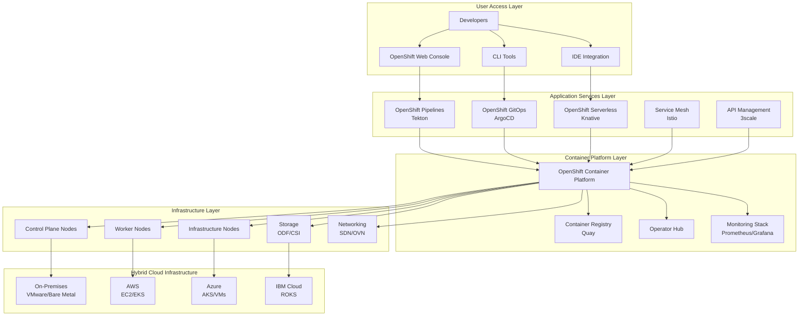

# IBM Red Hat OpenShift Container Platform - Solution Design Template

## Document Information
**Solution**: IBM Red Hat OpenShift Container Platform  
**Version**: 4.14  
**Date**: January 2025  
**Audience**: Solutions Architects, Technical Decision Makers, Platform Engineers  

---

## 1. Executive Summary

### 1.1 Solution Overview
IBM Red Hat OpenShift Container Platform provides a comprehensive enterprise Kubernetes platform that accelerates application development, deployment, and operations across hybrid cloud environments. This solution design addresses [CLIENT_NAME]'s requirements for container orchestration, developer productivity, operational efficiency, and multi-cloud portability.

### 1.2 Key Business Drivers
- **Developer Productivity**: Enable self-service platform with 70% faster deployment cycles
- **Operational Efficiency**: Reduce infrastructure management overhead by 60%
- **Application Modernization**: Accelerate containerization and microservices adoption
- **Hybrid Cloud Strategy**: Consistent platform across on-premises and public cloud
- **Innovation Acceleration**: Enable DevOps practices and continuous delivery

### 1.3 Solution Benefits
- Enterprise-grade Kubernetes with built-in security and operations
- Integrated CI/CD pipelines and developer tools
- Multi-cloud portability and hybrid cloud management
- Comprehensive observability and monitoring stack
- Extensive ecosystem of certified operators and integrations

---

## 2. Current State Assessment

### 2.1 Application Portfolio Analysis
```yaml
application_inventory:
  total_applications: [TO_BE_DETERMINED]
  application_types:
    web_applications: [PERCENTAGE]
    apis_microservices: [PERCENTAGE]  
    batch_processing: [PERCENTAGE]
    databases: [PERCENTAGE]
    legacy_monoliths: [PERCENTAGE]
  
  current_platforms:
    virtual_machines: [COUNT]
    bare_metal_servers: [COUNT]
    existing_containers: [COUNT]
    serverless_functions: [COUNT]
  
  modernization_readiness:
    ready_for_containers: [PERCENTAGE]
    requires_refactoring: [PERCENTAGE]
    legacy_dependencies: [PERCENTAGE]
    cloud_native: [PERCENTAGE]
```

### 2.2 Infrastructure Landscape
| **Component** | **Current State** | **Utilization** | **Challenges** |
|---------------|-------------------|-----------------|----------------|
| Compute Resources | [VM_COUNT] VMs | [UTILIZATION_%] | [SPECIFIC_ISSUES] |
| Storage Systems | [STORAGE_CAPACITY] | [UTILIZATION_%] | [STORAGE_CHALLENGES] |
| Network Infrastructure | [NETWORK_SETUP] | [BANDWIDTH_USAGE] | [NETWORK_ISSUES] |
| Load Balancers | [LB_TYPE_COUNT] | [TRAFFIC_LOAD] | [LOAD_BALANCER_ISSUES] |

### 2.3 Development and Operations Assessment
```yaml
# Development Practices
development_current_state:
  deployment_frequency: [MONTHLY/WEEKLY/DAILY]
  deployment_duration: [HOURS/DAYS]
  deployment_success_rate: [PERCENTAGE]
  environment_provisioning_time: [HOURS/DAYS]
  testing_automation_level: [PERCENTAGE]
  
# Operations Maturity
operations_current_state:
  monitoring_coverage: [PERCENTAGE]
  incident_response_time: [MINUTES/HOURS]
  backup_recovery_automation: [MANUAL/SEMI/AUTOMATED]
  security_scanning_frequency: [WEEKLY/MONTHLY]
  compliance_automation_level: [PERCENTAGE]
```

### 2.4 Technology Stack Inventory
- **Operating Systems**: [LINUX_DISTROS, WINDOWS_VERSIONS]
- **Container Runtime**: [DOCKER, CONTAINERD, CRIO_STATUS]
- **Orchestration**: [KUBERNETES_VERSION, DOCKER_SWARM, NONE]
- **CI/CD Tools**: [JENKINS, GITLAB_CI, AZURE_DEVOPS, GITHUB_ACTIONS]
- **Monitoring Stack**: [PROMETHEUS, GRAFANA, ELK_STACK, COMMERCIAL_TOOLS]
- **Security Tools**: [VULNERABILITY_SCANNERS, POLICY_ENGINES]

---

## 3. Target Architecture

### 3.1 High-Level Architecture



### 3.2 Cluster Architecture Design

#### 3.2.1 Multi-Cluster Strategy
```yaml
cluster_architecture:
  production_clusters:
    - name: prod-us-east
      purpose: Production workloads - US East
      nodes:
        control_plane: 3
        worker: 6
        infra: 3
      zones:
        - us-east-1a
        - us-east-1b  
        - us-east-1c
    
    - name: prod-us-west
      purpose: Production workloads - US West
      nodes:
        control_plane: 3
        worker: 6
        infra: 3
      zones:
        - us-west-2a
        - us-west-2b
        - us-west-2c
  
  non_production_clusters:
    - name: dev-shared
      purpose: Development and testing
      nodes:
        control_plane: 3
        worker: 4
        infra: 2
    
    - name: staging
      purpose: Pre-production validation  
      nodes:
        control_plane: 3
        worker: 4
        infra: 2
```

#### 3.2.2 Node Specifications
```yaml
node_specifications:
  control_plane_nodes:
    instance_type: m5.2xlarge
    cpu: 8 vCPU
    memory: 32 GB
    storage:
      root_volume: 200 GB (gp3)
      etcd_volume: 100 GB (io2)
    
  worker_nodes:
    instance_type: m5.4xlarge
    cpu: 16 vCPU
    memory: 64 GB
    storage:
      root_volume: 500 GB (gp3)
      container_storage: 200 GB (gp3)
    
  infrastructure_nodes:
    instance_type: m5.2xlarge
    cpu: 8 vCPU
    memory: 32 GB
    storage:
      root_volume: 200 GB (gp3)
      registry_storage: 500 GB (gp3)
```

### 3.3 Networking Architecture

#### 3.3.1 Network Design
```yaml
networking_configuration:
  cluster_network:
    cidr: "10.128.0.0/14"
    host_prefix: 23
    network_type: "OVNKubernetes"
  
  service_network:
    cidr: "172.30.0.0/16"
  
  ingress_configuration:
    type: "OpenShift Route"
    load_balancer: "Application Load Balancer"
    ssl_termination: "edge"
    wildcard_certificate: true
  
  network_policies:
    default_policy: "deny-all"
    microsegmentation: enabled
    namespace_isolation: true
```

#### 3.3.2 Security and Connectivity
```yaml
network_security:
  firewall_rules:
    control_plane:
      - port: 6443 # Kubernetes API
        source: "authorized_networks"
      - port: 22623 # Machine Config Server
        source: "cluster_network"
    
    worker_nodes:
      - port: 80,443 # Application traffic
        source: "load_balancer"
      - port: 10250 # kubelet
        source: "control_plane"
    
    infrastructure:
      - port: 5000 # Internal registry
        source: "cluster_network"
      - port: 9090,3000 # Monitoring
        source: "monitoring_network"
```

### 3.4 Storage Architecture

#### 3.4.1 Storage Classes
```yaml
storage_classes:
  - name: gp3-csi
    provisioner: ebs.csi.aws.com
    parameters:
      type: gp3
      iops: "3000"
      throughput: "125"
      encrypted: "true"
    use_cases:
      - General purpose applications
      - Development environments
    
  - name: io2-csi
    provisioner: ebs.csi.aws.com
    parameters:
      type: io2
      iops: "10000"
      encrypted: "true"
    use_cases:
      - High-performance databases
      - Low-latency applications
    
  - name: efs-csi
    provisioner: efs.csi.aws.com
    parameters:
      provisioningMode: efs-utils
      fileSystemPolicy: iam
    use_cases:
      - Shared storage
      - Multi-pod access
    
  - name: ocs-storagecluster-ceph-rbd
    provisioner: openshift-storage.rbd.csi.ceph.com
    parameters:
      clusterID: openshift-storage
      pool: ocs-storagecluster-cephblockpool
    use_cases:
      - Container-native storage
      - Block storage with replication
```

#### 3.4.2 OpenShift Data Foundation (ODF)
```yaml
ods_configuration:
  deployment_mode: "Internal"
  storage_nodes: 3
  storage_device_sets:
    - name: ocs-deviceset
      count: 1
      replica: 3
      resources:
        limits:
          cpu: "2"
          memory: "5Gi"
        requests:
          cpu: "1"  
          memory: "5Gi"
      placement: {}
      preparePlacement: {}
      dataPVCTemplate:
        spec:
          accessModes:
            - ReadWriteOnce
          resources:
            requests:
              storage: 2Ti
          storageClassName: gp3-csi
          volumeMode: Block
```

---

## 4. Application Architecture Patterns

### 4.1 Microservices Architecture
```yaml
microservices_pattern:
  service_architecture:
    frontend_services:
      - web_ui: React/Angular SPA
      - mobile_api: RESTful API gateway
      - cdn_integration: Static asset delivery
    
    backend_services:
      - user_service: User management and authentication
      - product_service: Product catalog and inventory
      - order_service: Order processing and fulfillment
      - payment_service: Payment processing
      - notification_service: Email/SMS notifications
    
    data_services:
      - user_database: PostgreSQL cluster
      - product_database: MongoDB cluster  
      - cache_layer: Redis cluster
      - message_broker: Apache Kafka
  
  service_mesh_integration:
    istio_configuration:
      - mutual_tls: enabled
      - traffic_management: canary deployments
      - observability: distributed tracing
      - security_policies: service-to-service auth
```

### 4.2 Event-Driven Architecture
```yaml
event_driven_pattern:
  event_streaming:
    kafka_cluster:
      brokers: 3
      replication_factor: 3
      topics:
        - user_events
        - order_events  
        - inventory_events
        - payment_events
    
  event_processing:
    streaming_applications:
      - fraud_detection: Real-time transaction analysis
      - recommendation_engine: User behavior analysis
      - inventory_management: Stock level monitoring
    
  integration_patterns:
    - event_sourcing: Order state management
    - saga_pattern: Distributed transaction handling
    - cqrs: Command/Query responsibility separation
```

### 4.3 Serverless Architecture
```yaml
serverless_pattern:
  knative_serving:
    functions:
      - image_processing: On-demand image transformation
      - report_generation: Scheduled report creation
      - webhook_handlers: External system integrations
    
  knative_eventing:
    event_sources:
      - kafka_source: Stream processing triggers
      - api_server_source: Kubernetes event triggers
      - github_source: CI/CD webhook triggers
    
  auto_scaling:
    scale_to_zero: enabled
    concurrency_limit: 100
    scale_up_delay: 2s
    scale_down_delay: 30s
```

---

## 5. Security Architecture

### 5.1 Security Framework
```yaml
security_architecture:
  authentication:
    identity_providers:
      - name: corporate_ldap
        type: LDAP
        url: "ldaps://ldap.company.com:636"
        bind_dn: "CN=openshift,OU=service,DC=company,DC=com"
      
      - name: github_oauth
        type: GitHub
        hostname: "github.company.com"
        organizations: ["company-dev", "company-ops"]
    
  authorization:
    rbac_model: "Attribute-Based Access Control"
    cluster_roles:
      - cluster-admin: Full cluster access
      - platform-admin: Platform management
      - developer: Application deployment
      - viewer: Read-only access
    
  pod_security:
    security_context_constraints:
      - name: restricted-v2
        description: "Most restrictive SCC"
        allow_privileged_container: false
        run_as_user: MustRunAsNonRoot
        se_linux_context: MustRunAs
        fs_group: MustRunAs
```

### 5.2 Network Security
```yaml
network_security_policies:
  default_deny_all:
    pod_selector: {}
    policy_types:
      - Ingress
      - Egress
  
  allow_ingress_from_lb:
    pod_selector:
      matchLabels:
        app: web-frontend
    ingress:
      - from:
          - namespaceSelector:
              matchLabels:
                name: openshift-ingress
        ports:
          - protocol: TCP
            port: 8080
  
  allow_database_access:
    pod_selector:
      matchLabels:
        app: api-backend
    egress:
      - to:
          - podSelector:
              matchLabels:
                app: database
        ports:
          - protocol: TCP
            port: 5432
```

### 5.3 Image Security
```yaml
image_security:
  image_scanning:
    scanner: "Red Hat Advanced Cluster Security"
    scan_frequency: "On push and daily"
    vulnerability_thresholds:
      critical: 0
      high: 2
      medium: 10
    
  image_signing:
    signing_tool: "Cosign"
    key_management: "HashiCorp Vault"
    policy_enforcement: "Gatekeeper"
    
  registry_security:
    internal_registry:
      authentication: "OpenShift OAuth"
      authorization: "RBAC"
      encryption: "TLS 1.3"
    
    external_registries:
      - name: "Red Hat Registry"
        url: "registry.redhat.io"
        authentication: "Service Account"
      - name: "Company Registry"
        url: "registry.company.com"
        authentication: "OAuth2"
```

---

## 6. CI/CD Architecture

### 6.1 OpenShift Pipelines (Tekton)
```yaml
pipeline_architecture:
  pipeline_components:
    triggers:
      - git_webhook: GitHub/GitLab push events
      - image_update: New base image notifications
      - schedule: Time-based pipeline execution
    
    tasks:
      - git_clone: Source code checkout
      - unit_tests: Automated testing
      - security_scan: Code and dependency scanning
      - build_image: Container image creation
      - image_scan: Container vulnerability scanning
      - deploy_dev: Development environment deployment
      - integration_tests: End-to-end testing
      - deploy_staging: Staging environment deployment
      - approval_gate: Manual approval process
      - deploy_production: Production deployment
    
  pipeline_templates:
    web_application_pipeline:
      stages:
        - source: Git checkout and validation
        - build: Maven/NPM build and test
        - package: Container image creation
        - security: Security scanning and compliance
        - deploy: Multi-environment deployment
    
    microservice_pipeline:
      stages:
        - source: Multi-repo checkout
        - build: Service-specific builds
        - test: Unit and integration tests
        - package: Service container images
        - deploy: Service mesh deployment
```

### 6.2 GitOps with OpenShift GitOps (ArgoCD)
```yaml
gitops_architecture:
  repository_structure:
    application_repos:
      - web_frontend: "github.com/company/web-frontend"
      - api_services: "github.com/company/api-services"
      - database_services: "github.com/company/database-services"
    
    config_repos:
      - cluster_config: "github.com/company/openshift-config"
      - app_deployments: "github.com/company/k8s-deployments"
      - helm_charts: "github.com/company/helm-charts"
    
  argocd_configuration:
    application_sets:
      - name: microservices
        generator: git
        template:
          source:
            repoURL: "{{repo}}"
            path: "k8s/{{environment}}"
          destination:
            server: "{{cluster}}"
            namespace: "{{name}}-{{environment}}"
    
    sync_policies:
      development:
        automated: true
        prune: true
        self_heal: true
      
      production:
        automated: false
        manual_approval: required
        sync_options:
          - CreateNamespace=true
          - ApplyOutOfSyncOnly=true
```

---

## 7. Observability Architecture

### 7.1 Monitoring Stack
```yaml
monitoring_architecture:
  prometheus_configuration:
    retention_period: "30d"
    storage_class: "gp3-csi"
    storage_size: "500Gi"
    
    metric_sources:
      - kubernetes_metrics: Node and pod metrics
      - application_metrics: Custom business metrics
      - infrastructure_metrics: Hardware and network
      - security_metrics: Security events and violations
    
  grafana_dashboards:
    infrastructure_dashboards:
      - cluster_overview: Resource utilization and health
      - node_details: Individual node performance
      - storage_metrics: Persistent volume usage
      - network_performance: Traffic and latency metrics
    
    application_dashboards:
      - application_overview: Service health and SLA
      - api_performance: Request rates and latencies
      - error_tracking: Error rates and debugging
      - business_metrics: Custom KPIs and metrics
```

### 7.2 Logging Architecture
```yaml
logging_architecture:
  openshift_logging:
    log_store: "Elasticsearch"
    log_collection: "Fluentd"
    log_visualization: "Kibana"
    
    retention_policies:
      application_logs: "14d"
      infrastructure_logs: "30d"
      audit_logs: "90d"
    
  log_forwarding:
    external_systems:
      - splunk_enterprise: Security and compliance logs
      - elk_stack: Application and infrastructure logs
      - siem_integration: Security event correlation
    
  structured_logging:
    log_format: "JSON"
    correlation_ids: "Distributed tracing"
    log_levels: "DEBUG, INFO, WARN, ERROR, FATAL"
```

### 7.3 Distributed Tracing
```yaml
tracing_architecture:
  jaeger_configuration:
    deployment_strategy: "Production"
    storage_backend: "Elasticsearch"
    sampling_rate: "0.1"
    
    trace_collection:
      - http_requests: API and service calls
      - database_queries: SQL and NoSQL operations
      - message_queues: Kafka and messaging
      - external_services: Third-party integrations
    
  service_mesh_integration:
    automatic_instrumentation: true
    traffic_routing: "Blue-green and canary"
    security_policies: "mTLS enforcement"
```

---

## 8. Disaster Recovery and Business Continuity

### 8.1 Backup Strategy
```yaml
backup_architecture:
  etcd_backup:
    frequency: "Every 4 hours"
    retention: "30 days"
    storage_location: "S3 cross-region"
    encryption: "AES-256"
    
  application_backup:
    tool: "Velero"
    schedule:
      - full_backup: "Daily at 2 AM"
      - incremental: "Every 4 hours"
    
    backup_scope:
      - persistent_volumes: "All application data"
      - kubernetes_resources: "Deployments, services, secrets"
      - custom_resources: "Operators and CRDs"
    
  database_backup:
    postgresql:
      method: "pg_dump with WAL archiving"
      frequency: "Continuous WAL + daily full"
      retention: "30 days"
    
    mongodb:
      method: "mongodump with oplog"
      frequency: "Every 6 hours"
      retention: "14 days"
```

### 8.2 Multi-Region Architecture
```yaml
multi_region_setup:
  primary_region: "us-east-1"
  secondary_region: "us-west-2"
  
  replication_strategy:
    database_replication:
      - postgresql: "Streaming replication"
      - mongodb: "Replica set across regions"
      - redis: "Cross-region clustering"
    
    storage_replication:
      - persistent_volumes: "Cross-region snapshots"
      - container_images: "Multi-region registry"
      - backup_data: "Cross-region S3 replication"
    
  failover_procedures:
    rto_target: "4 hours"
    rpo_target: "1 hour"
    automation_level: "Semi-automated with approval"
```

---

## 9. Integration Architecture

### 9.1 External System Integration
```yaml
integration_patterns:
  api_management:
    tool: "Red Hat 3scale"
    endpoints:
      - internal_apis: OpenShift service exposure
      - external_apis: Partner and vendor integrations
      - legacy_systems: Mainframe and ERP connectivity
    
    security:
      - authentication: "OAuth2, API Keys, mTLS"
      - rate_limiting: "Per API and consumer"
      - monitoring: "Request tracking and analytics"
  
  message_integration:
    kafka_ecosystem:
      - kafka_connect: Database and system connectors
      - schema_registry: Event schema management
      - kafka_streams: Real-time processing
    
    integration_patterns:
      - event_sourcing: Order and transaction logs
      - saga_pattern: Distributed transactions
      - outbox_pattern: Reliable event publishing
```

### 9.2 Cloud Service Integration
```yaml
cloud_integrations:
  aws_services:
    - rds: "Managed database services"
    - s3: "Object storage for backups and assets"
    - iam: "Cross-service authentication"
    - route53: "DNS and traffic management"
    - cloudwatch: "External monitoring integration"
  
  azure_services:
    - azure_ad: "Identity provider integration"
    - cosmos_db: "NoSQL database services"
    - storage_accounts: "Backup and archive storage"
    - key_vault: "Secrets management"
  
  saas_integrations:
    - salesforce: "CRM data synchronization"
    - serviceNow: "ITSM workflow integration"
    - slack: "Notification and alerting"
    - github: "Source code and CI/CD"
```

---

## 10. Cost Optimization Strategy

### 10.1 Resource Optimization
```yaml
cost_optimization:
  cluster_optimization:
    node_rightsizing:
      - cpu_utilization_target: "70-80%"
      - memory_utilization_target: "75-85%"
      - monitoring_period: "30 days"
    
    auto_scaling:
      - cluster_autoscaler: "Node count optimization"
      - vertical_pod_autoscaler: "Pod resource optimization"
      - horizontal_pod_autoscaler: "Replica count optimization"
  
  storage_optimization:
    storage_tiering:
      - hot_data: "High-performance SSDs"
      - warm_data: "General purpose SSDs"
      - cold_data: "Archive storage"
    
    lifecycle_management:
      - snapshot_retention: "Automated cleanup"
      - unused_volume_detection: "Monthly audits"
      - storage_class_optimization: "Cost-performance analysis"
  
  application_optimization:
    resource_requests_limits:
      - cpu_requests: "Based on 95th percentile usage"
      - memory_requests: "Based on maximum observed"
      - quality_of_service: "Burstable for efficiency"
```

### 10.2 Operational Cost Management
```yaml
operational_costs:
  automation_benefits:
    - manual_operations_reduction: "80%"
    - deployment_cycle_acceleration: "70%"
    - incident_response_improvement: "60%"
    - infrastructure_utilization_increase: "40%"
  
  licensing_optimization:
    - red_hat_subscription_management: "Right-sized subscriptions"
    - third_party_tool_consolidation: "Reduced tooling complexity"
    - open_source_adoption: "Where strategically appropriate"
  
  cloud_cost_optimization:
    - reserved_instances: "For predictable workloads"
    - spot_instances: "For batch processing"
    - resource_scheduling: "Off-peak resource usage"
```

---

## 11. Implementation Roadmap

### 11.1 Phase 1: Foundation (Months 1-3)
```yaml
foundation_phase:
  infrastructure_deployment:
    - week_1_2: "OpenShift cluster installation"
    - week_3_4: "Basic networking and security setup"
    - week_5_6: "Storage configuration and testing"
    - week_7_8: "Initial monitoring and logging setup"
    - week_9_12: "Platform hardening and documentation"
  
  deliverables:
    - production_ready_clusters: 2
    - development_environments: 1
    - basic_ci_cd_pipeline: 1
    - platform_documentation: "Complete"
    - team_training_completion: "75%"
```

### 11.2 Phase 2: Application Migration (Months 4-8)
```yaml
migration_phase:
  application_modernization:
    - month_4: "Pilot application containerization"
    - month_5: "CI/CD pipeline implementation"
    - month_6: "Additional application migrations"
    - month_7: "Performance testing and optimization"
    - month_8: "Production deployment and validation"
  
  deliverables:
    - containerized_applications: 15
    - automated_pipelines: 10
    - monitoring_dashboards: "Complete"
    - developer_self_service: "Enabled"
    - security_policies: "Implemented"
```

### 11.3 Phase 3: Advanced Features (Months 9-12)
```yaml
advanced_phase:
  platform_enhancement:
    - month_9: "Service mesh deployment"
    - month_10: "Advanced security features"
    - month_11: "Multi-cluster management"
    - month_12: "Cost optimization and governance"
  
  deliverables:
    - service_mesh_enabled: true
    - advanced_security_policies: "Implemented"
    - multi_cluster_management: "Enabled"
    - cost_optimization_framework: "Operational"
    - center_of_excellence: "Established"
```

---

## 12. Success Metrics and KPIs

### 12.1 Technical Metrics
```yaml
technical_kpis:
  platform_performance:
    - cluster_availability: ">99.9%"
    - pod_startup_time: "<30 seconds"
    - deployment_success_rate: ">95%"
    - resource_utilization: "70-85%"
  
  development_productivity:
    - deployment_frequency: "Daily to multiple times daily"
    - lead_time_for_changes: "<2 hours"
    - mean_time_to_recovery: "<1 hour"
    - change_failure_rate: "<5%"
  
  security_metrics:
    - security_scan_coverage: "100%"
    - critical_vulnerabilities: "0 in production"
    - compliance_audit_score: ">95%"
    - incident_response_time: "<15 minutes"
```

### 12.2 Business Metrics
```yaml
business_kpis:
  cost_optimization:
    - infrastructure_cost_reduction: "40-60%"
    - operational_overhead_reduction: "50-70%"
    - total_cost_of_ownership: "30% reduction"
  
  time_to_market:
    - application_delivery_speed: "70% improvement"
    - feature_release_frequency: "300% increase"
    - environment_provisioning: "95% time reduction"
  
  quality_metrics:
    - application_availability: ">99.9%"
    - customer_satisfaction: ">90%"
    - developer_satisfaction: ">85%"
```

---

## 13. Risk Assessment and Mitigation

### 13.1 Technical Risks
| **Risk** | **Probability** | **Impact** | **Mitigation Strategy** |
|----------|-----------------|------------|------------------------|
| Application compatibility issues | Medium | High | Comprehensive application assessment and containerization testing |
| Performance degradation | Low | High | Performance testing and monitoring implementation |
| Security vulnerabilities | Medium | Critical | Multi-layered security approach with automated scanning |
| Data loss during migration | Low | Critical | Comprehensive backup strategy and migration testing |

### 13.2 Business Risks
| **Risk** | **Probability** | **Impact** | **Mitigation Strategy** |
|----------|-----------------|------------|------------------------|
| User adoption resistance | Medium | Medium | Change management program and training |
| Budget overruns | Medium | High | Phased implementation with clear milestones |
| Timeline delays | High | Medium | Agile methodology with regular checkpoints |
| Skills shortage | High | Medium | Training programs and professional services |

### 13.3 Mitigation Strategies
```yaml
risk_mitigation:
  technical_mitigation:
    - proof_of_concept: "Validate approach with pilot applications"
    - testing_strategy: "Comprehensive testing at each phase"
    - rollback_procedures: "Well-defined rollback plans"
    - monitoring_alerts: "Proactive issue detection"
  
  business_mitigation:
    - change_management: "Structured adoption program"
    - training_program: "Comprehensive skill development"
    - stakeholder_engagement: "Regular communication and updates"
    - vendor_support: "Professional services and support contracts"
```

---

## 14. Conclusion and Recommendations

### 14.1 Solution Benefits Summary
- **Developer Productivity**: 70% faster application delivery through self-service platform
- **Operational Efficiency**: 60% reduction in infrastructure management overhead
- **Cost Optimization**: 40-60% infrastructure cost reduction through improved utilization
- **Innovation Acceleration**: Modern platform enabling DevOps and cloud-native practices
- **Risk Mitigation**: Enhanced security posture and compliance automation

### 14.2 Key Success Factors
1. **Executive Sponsorship**: Strong leadership support and clear vision
2. **Skilled Team**: Dedicated platform team with OpenShift expertise
3. **Incremental Approach**: Phased implementation with regular value delivery
4. **Change Management**: Comprehensive user adoption and training program
5. **Continuous Improvement**: Regular optimization and enhancement cycles

### 14.3 Next Steps
1. **Stakeholder Approval**: Secure business case approval and funding
2. **Team Assembly**: Form cross-functional implementation team
3. **Detailed Planning**: Develop detailed project plan and timeline
4. **Pilot Preparation**: Select and prepare pilot applications for migration
5. **Infrastructure Preparation**: Begin infrastructure provisioning and setup

---

**Document Version**: 4.14  
**Last Updated**: January 2025  
**Prepared By**: IBM Red Hat Services Solutions Architecture Team  
**Reviewed By**: [Technical Review Committee]  
**Approved By**: [Client Technical Leadership]

---

*This solution design template should be customized based on specific client requirements, infrastructure constraints, and business objectives. Regular updates should be made throughout the implementation process to reflect actual configurations and lessons learned.*