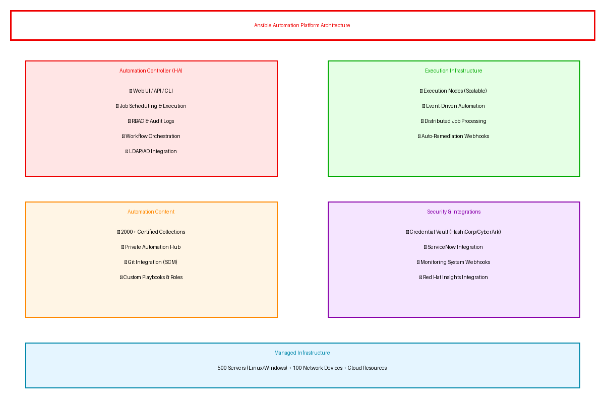

# Executive Summary

This document provides the comprehensive technical design for the Red Hat Ansible Automation Platform implementation. It covers the target-state architecture, security controls, data design, integration patterns, and implementation approach required for successful deployment managing 500 servers and 100 network devices with 100 custom automation playbooks.

## Purpose

Define the technical architecture and design specifications that will guide the implementation team through deployment, configuration, and validation of the Ansible Automation Platform solution.

## Scope

**In-scope:**
- Ansible Automation Controller HA cluster deployment
- Execution node infrastructure for distributed job processing
- Private Automation Hub for content management
- LDAP/AD integration for SSO and RBAC
- HashiCorp Vault integration for credential management
- ServiceNow integration for ticket-driven automation
- Event-driven automation for monitoring webhooks
- 100 custom playbooks for server and network automation

**Out-of-scope:**
- End-user training (covered in Implementation Guide)
- Ongoing support procedures (covered in Operations Runbook)
- Red Hat subscription procurement (direct client relationship)

## Assumptions & Constraints

The following assumptions underpin the design and must be validated during implementation.

- AWS/Azure cloud account with appropriate permissions established
- Network connectivity between automation platform and managed infrastructure available
- Security team has approved the proposed architecture
- 4-hour RTO, 1-hour RPO requirements apply
- SSH/WinRM access available to all 500 servers
- API access available to all 100 network devices

## References

This document should be read in conjunction with the following related materials.

- Statement of Work (SOW)
- Discovery Questionnaire responses
- Red Hat Ansible Automation Platform documentation
- Client security and compliance standards

# Business Context

This section establishes the business drivers, success criteria, and compliance requirements that shape the technical design decisions.

## Business Drivers

The solution addresses the following key business objectives identified during discovery.

- **Operational Efficiency:** Eliminate 90% of manual configuration tasks through automation
- **Configuration Consistency:** Achieve zero configuration drift across 500 servers and 100 network devices
- **Accelerated Operations:** Reduce network change time from 2 days to 30 minutes
- **Cost Reduction:** Realize $400K annual labor cost savings from eliminated manual work

## Workload Criticality & SLA Expectations

The following service level targets define the operational requirements for the production environment and guide infrastructure sizing decisions.

<!-- TABLE_CONFIG: widths=[25, 25, 25, 25] -->
| Metric | Target | Measurement | Priority |
|--------|--------|-------------|----------|
| Platform Availability | 99.5% | Uptime monitoring | Critical |
| Job Success Rate | 99.5% | Execution metrics | Critical |
| RTO | 4 hours | DR testing | Critical |
| RPO | 1 hour | Backup verification | Critical |

## Compliance & Regulatory Factors

The solution must adhere to the following regulatory and compliance requirements.

- SOC 2 Type II compliance required for automation platform and credential handling
- ISO 27001 alignment for information security management
- Audit logging required for all automation executions and administrative actions
- Encryption at rest and in transit mandatory for all credentials

## Success Criteria

Project success will be measured against the following criteria at go-live.

- All 100 automation playbooks developed, tested, and operational
- 500 servers and 100 network devices managed through automation
- ServiceNow integration operational for ticket-driven workflows
- Event-driven auto-remediation functioning for monitoring alerts
- Operations team trained and capable of independent platform management

# Current-State Assessment

This section documents the existing environment that the solution will integrate with or replace.

## Application Landscape

The current environment consists of manual processes that will be automated by the Ansible platform.

<!-- TABLE_CONFIG: widths=[25, 30, 25, 20] -->
| Application | Purpose | Technology | Status |
|-------------|---------|------------|--------|
| Manual Server Config | Server provisioning | SSH/RDP manual | To be automated |
| Manual Network Config | Network device changes | CLI manual | To be automated |
| ServiceNow ITSM | Ticket management | ServiceNow | Integration point |
| HashiCorp Vault | Secret management | Vault Enterprise | Integration point |

## Infrastructure Inventory

The current infrastructure consists of the following components that will be managed by Ansible automation.

<!-- TABLE_CONFIG: widths=[20, 15, 35, 30] -->
| Component | Quantity | Specifications | Notes |
|-----------|----------|----------------|-------|
| Linux Servers | 350 | RHEL/Ubuntu mixed | SSH access required |
| Windows Servers | 150 | Windows Server 2019/2022 | WinRM access required |
| Network Devices | 100 | Cisco/Juniper/Arista | API/CLI access required |

## Dependencies & Integration Points

The current environment has the following external dependencies that must be considered during implementation.

- Active Directory/LDAP for user authentication and team mapping
- HashiCorp Vault for credential storage and rotation
- ServiceNow for ITSM ticket-driven automation triggers
- Monitoring systems (Datadog/Splunk) for event-driven automation
- Git repository for playbook version control

## Network Topology

Current network topology requires automation platform connectivity to:
- Corporate network for server management (SSH port 22, WinRM port 5986)
- Network management VLAN for device automation (SSH, NETCONF, REST APIs)
- Internet egress for cloud provider API access
- VPN connectivity for on-premises infrastructure (if applicable)

## Security Posture

The current security controls provide a baseline that will be enhanced in the target architecture.

- Perimeter firewall with IDS/IPS for network segmentation
- CyberArk/Vault for privileged credential management
- Annual penetration testing and vulnerability scanning
- Security awareness training program for operations staff

## Performance Baseline

Current manual process metrics establish the baseline for automation improvement targets.

- Server configuration time: 4-8 hours manual effort per server
- Network change implementation: 2-day maintenance windows
- Configuration drift incidents: 30% of support tickets
- Daily administrative tasks: 20 hours of manual effort

# Solution Architecture

The target architecture leverages Red Hat Ansible Automation Platform to deliver enterprise-grade IT automation with high availability, scalability, and security.

## Architecture Principles

The following principles guide all architectural decisions throughout the solution design.

- **Centralized Control:** Single pane of glass for all automation operations
- **Distributed Execution:** Scalable execution nodes for parallel job processing
- **Security by Design:** Defense in depth with external credential management
- **Infrastructure as Code:** All automation content version-controlled in Git
- **Event-Driven:** Reactive automation triggered by monitoring and ITSM events

## Architecture Patterns

The solution implements the following architectural patterns to address scalability and reliability requirements.

- **Primary Pattern:** Centralized controller with distributed execution mesh
- **Data Pattern:** PostgreSQL database for job history and platform state
- **Integration Pattern:** Webhook-based event triggers with REST API callbacks
- **Deployment Pattern:** HA cluster with load-balanced controller access

## Component Design

The solution comprises the following logical components, each with specific responsibilities and scaling characteristics.

<!-- TABLE_CONFIG: widths=[18, 25, 22, 18, 17] -->
| Component | Purpose | Technology | Dependencies | Scaling |
|-----------|---------|------------|--------------|---------|
| Automation Controller | Job orchestration and UI | AAP Controller | PostgreSQL | HA Cluster |
| Execution Nodes | Playbook execution | AAP Execution | Controller | Horizontal |
| Automation Hub | Content repository | AAP Hub | None | Single |
| PostgreSQL | Platform database | PostgreSQL 13 | None | HA Replica |
| Load Balancer | Controller access | AWS ALB/Azure LB | Controller | Managed |

## Technology Stack

The technology stack has been selected based on requirements for scalability, maintainability, and alignment with Red Hat best practices.

<!-- TABLE_CONFIG: widths=[25, 35, 40] -->
| Layer | Technology | Rationale |
|-------|------------|-----------|
| Automation Controller | Red Hat AAP Controller | Enterprise automation orchestration |
| Execution | AAP Execution Nodes | Scalable distributed job processing |
| Content | Private Automation Hub | Organization playbook and collection management |
| Database | PostgreSQL 13 HA | High availability with automated backups |
| Monitoring | Datadog/Splunk | Integrated metrics and job analytics |

# Security & Compliance

This section details the security controls, compliance mappings, and governance mechanisms implemented in the solution.

## Identity & Access Management

Access control follows a role-based model with centralized identity management.

- **Authentication:** LDAP/AD integration for Single Sign-On
- **Authorization:** RBAC with Teams, Organizations, and granular permissions
- **MFA:** Required for all administrative access
- **Service Accounts:** Managed credentials with Vault integration for rotation

### Role Definitions

The following roles define access levels within the system, following the principle of least privilege.

<!-- TABLE_CONFIG: widths=[20, 40, 40] -->
| Role | Permissions | Scope |
|------|-------------|-------|
| Administrator | Full platform access | All resources |
| Operator | Job execution and monitoring | Assigned inventories |
| Developer | Playbook development and testing | Non-production |
| Approver | Workflow approval authority | Assigned workflows |
| Auditor | Read-only access | All environments |

## Secrets Management

All sensitive credentials are managed through HashiCorp Vault integration.

- HashiCorp Vault for all machine credentials and API tokens
- Automatic rotation for database and service credentials
- Credential lookup at runtime without exposure in playbooks
- No secrets stored in Git repositories or platform database

## Network Security

Network security implements defense-in-depth with multiple layers of protection.

- **Segmentation:** Controller and execution nodes in private subnets
- **Firewall:** Security groups with deny-by-default rules
- **Encryption:** TLS 1.2+ for all API and web UI communication
- **Access Control:** SSH/WinRM restricted to execution nodes only

## Data Protection

Data protection controls ensure confidentiality and integrity throughout the data lifecycle.

- **Encryption at Rest:** AES-256 for PostgreSQL database and backups
- **Encryption in Transit:** TLS 1.3 for all platform communications
- **Credential Protection:** Vault-managed secrets with audit logging
- **Log Protection:** Credential values masked in all job output

## Compliance Mappings

The following table maps compliance requirements to specific implementation controls.

<!-- TABLE_CONFIG: widths=[25, 35, 40] -->
| Framework | Requirement | Implementation |
|-----------|-------------|----------------|
| SOC 2 | Access control | RBAC, LDAP SSO, audit logging |
| SOC 2 | Encryption | AES-256 at rest, TLS 1.3 in transit |
| ISO 27001 | Change management | Git version control, approval workflows |
| ISO 27001 | Audit trail | Activity stream logging for all operations |

## Audit Logging & SIEM Integration

Comprehensive audit logging supports security monitoring and compliance requirements.

- All authentication events logged with user context
- Job executions captured with full playbook output
- Administrative actions logged with before/after state
- Log retention: 90 days in platform, forwarded to SIEM

# Data Architecture

This section defines the data model, storage strategy, and governance controls for the solution.

## Data Model

### Conceptual Model

The solution manages the following core entities:
- **Inventories:** Managed hosts and groups with variables
- **Credentials:** Machine and cloud credentials for automation
- **Projects:** Git repositories containing playbook content
- **Job Templates:** Reusable automation configurations
- **Workflows:** Multi-step automation orchestrations

### Logical Model

The logical data model defines the primary entities and their relationships within the system.

<!-- TABLE_CONFIG: widths=[20, 25, 30, 25] -->
| Entity | Key Attributes | Relationships | Volume |
|--------|----------------|---------------|--------|
| Host | hostname, variables | Belongs to Inventory | 600 |
| Job | template, status, output | References Template | 10K/month |
| Credential | name, type, inputs | Used by Templates | 50 |
| Project | name, scm_url, branch | Contains Playbooks | 10 |

## Data Flow Design

1. **Job Request:** User or webhook triggers job template execution
2. **Credential Lookup:** Vault credentials retrieved at runtime
3. **Execution:** Playbook runs on execution node against inventory
4. **Logging:** Job output streamed to controller and stored
5. **Notification:** Status callbacks to ServiceNow and monitoring

## Data Migration Strategy

No data migration required for greenfield Ansible platform deployment.

- **Inventory Population:** Dynamic sync from cloud providers and CMDBs
- **Playbook Import:** Git repository sync for automation content
- **Credential Setup:** Manual configuration with Vault integration

## Data Governance

Data governance policies ensure proper handling, retention, and quality management.

- **Classification:** Job output may contain sensitive data - masked by default
- **Retention:** 90 days for job history, 1 year for audit logs
- **Quality:** Playbook linting and testing before production use
- **Access:** RBAC controls on all platform data

# Integration Design

This section documents the integration patterns, APIs, and external system connections.

## External System Integrations

The solution integrates with the following external systems using standardized protocols and error handling.

<!-- TABLE_CONFIG: widths=[18, 15, 15, 15, 22, 15] -->
| System | Type | Protocol | Format | Error Handling | SLA |
|--------|------|----------|--------|----------------|-----|
| ServiceNow | Real-time | REST | JSON | Retry with backoff | 99.9% |
| HashiCorp Vault | Real-time | REST | JSON | Circuit breaker | 99.99% |
| LDAP/AD | Real-time | LDAPS | LDAP | Failover to cache | 99.9% |
| Git Repository | On-demand | HTTPS/SSH | Git | Retry on sync | 99.5% |

## API Design

Ansible Controller provides REST API for programmatic access and integration.

- **Style:** RESTful with OpenAPI 3.0 specification
- **Versioning:** URL path versioning (/api/v2/)
- **Authentication:** OAuth 2.0 bearer tokens
- **Rate Limiting:** Configurable per-client limits

### API Endpoints

The following REST API endpoints provide programmatic access to core platform functionality.

<!-- TABLE_CONFIG: widths=[15, 30, 20, 35] -->
| Method | Endpoint | Auth | Description |
|--------|----------|------|-------------|
| GET | /api/v2/job_templates/ | Bearer | List job templates |
| POST | /api/v2/job_templates/{id}/launch/ | Bearer | Launch job from template |
| GET | /api/v2/jobs/{id}/ | Bearer | Get job execution status |
| POST | /api/v2/workflow_job_templates/{id}/launch/ | Bearer | Launch workflow |

## Authentication & SSO Flows

Single sign-on provides seamless authentication across all solution components.

- LDAP/AD integration with enterprise identity provider
- OAuth 2.0 for API access and external integrations
- Token-based authentication for ServiceNow webhooks
- Service account authentication for automated processes

## Messaging & Event Patterns

Event-driven automation enables reactive operations based on external triggers.

- **Webhook Receiver:** HTTP endpoints for ServiceNow and monitoring triggers
- **Event-Driven Ansible:** Rulebooks for automated event processing
- **Notification Templates:** Callbacks to external systems on job completion
- **Retry Policy:** Configurable retry with exponential backoff

# Infrastructure & Operations

This section covers the infrastructure design, deployment architecture, and operational procedures.

## Network Design

The virtual network architecture provides isolation and security through segmentation.

- **VPC CIDR:** 10.100.0.0/16
- **Controller Subnet:** 10.100.1.0/24 (private)
- **Execution Subnet:** 10.100.2.0/24 (private)
- **Database Subnet:** 10.100.3.0/24 (private)

## Compute Sizing

Instance sizing has been determined based on Red Hat recommendations and anticipated workload requirements.

<!-- TABLE_CONFIG: widths=[25, 20, 20, 20, 15] -->
| Component | Instance Type | vCPU | Memory | Count |
|-----------|---------------|------|--------|-------|
| Controller | m5.2xlarge | 8 | 16 GB | 2 (HA) |
| Execution Node | m5.2xlarge | 8 | 16 GB | 4 |
| PostgreSQL | db.r5.large | 2 | 16 GB | 2 (HA) |
| Automation Hub | m5.xlarge | 4 | 8 GB | 1 |

## High Availability Design

The solution eliminates single points of failure through redundancy at every tier.

- Multi-availability zone deployment for all tiers
- Automated failover for controller HA cluster
- PostgreSQL streaming replication with automatic promotion
- Load balancer health checks with automatic instance removal

## Disaster Recovery

Disaster recovery capabilities ensure business continuity in the event of regional failure.

- **RPO:** 1 hour (continuous database replication)
- **RTO:** 4 hours (automated recovery procedures)
- **Backup:** Daily full database backup, hourly transaction logs
- **DR Site:** Warm standby capability with documented procedures

## Monitoring & Alerting

Comprehensive monitoring provides visibility across infrastructure, platform, and automation metrics.

- **Infrastructure:** CPU, memory, disk, network metrics
- **Platform:** Job queue depth, execution times, success rates
- **Business:** Automation KPIs, time savings, cost avoidance
- **Alerting:** PagerDuty integration with escalation policies

### Alert Definitions

The following alerts have been configured to ensure proactive incident detection and response.

<!-- TABLE_CONFIG: widths=[25, 25, 25, 25] -->
| Alert | Condition | Severity | Response |
|-------|-----------|----------|----------|
| Job Queue Backlog | > 50 jobs for 10 min | Warning | Add execution nodes |
| Job Failure Rate | > 5% for 15 min | Critical | Page on-call |
| Controller Unavailable | Health check fail | Critical | HA failover |
| Database Latency | > 100ms p95 | Warning | Investigate |

## Logging & Observability

Centralized logging and monitoring enable rapid troubleshooting and analysis.

- Centralized log aggregation in Splunk/Datadog
- Job output searchable with 90-day retention
- Custom dashboards for automation KPIs
- Distributed tracing for complex workflows

## Cost Model

The estimated monthly infrastructure costs are based on production workload requirements.

<!-- TABLE_CONFIG: widths=[30, 25, 25, 20] -->
| Category | Monthly Estimate | Optimization | Savings |
|----------|------------------|--------------|---------|
| Compute | $1,800 | Reserved instances | 30% |
| Database | $300 | Reserved capacity | 25% |
| Storage | $100 | Lifecycle policies | 20% |
| Networking | $50 | NAT optimization | 15% |

# Implementation Approach

This section outlines the deployment strategy, tooling, and sequencing for the implementation.

## Migration/Deployment Strategy

The deployment strategy minimizes risk through phased rollout with validation gates.

- **Approach:** Phased deployment with pilot automation
- **Pattern:** Progressive automation enablement by risk category
- **Validation:** Testing at each phase gate before proceeding
- **Rollback:** Documented procedures for each automation category

## Sequencing & Wave Planning

The implementation follows a phased approach with clear exit criteria to ensure quality and minimize risk.

<!-- TABLE_CONFIG: widths=[15, 30, 25, 30] -->
| Phase | Activities | Duration | Exit Criteria |
|-------|------------|----------|---------------|
| 1 | Platform deployment and HA configuration | 2 weeks | Platform operational |
| 2 | Integration setup (LDAP, Vault, ServiceNow) | 2 weeks | Integrations validated |
| 3 | Playbook development (100 playbooks) | 8 weeks | All playbooks tested |
| 4 | Testing and UAT | 2 weeks | UAT sign-off |
| 5 | Production rollout and hypercare | 4 weeks | Stable operations |

## Tooling & Automation

The following tools provide the automation foundation for platform deployment and operations.

<!-- TABLE_CONFIG: widths=[25, 35, 40] -->
| Category | Tool | Purpose |
|----------|------|---------|
| Infrastructure as Code | Terraform | Cloud resource provisioning |
| Platform Deployment | Ansible installer | AAP installation and configuration |
| Playbook Testing | Molecule, ansible-lint | Automation content validation |
| Version Control | Git (GitHub/GitLab) | Playbook source management |
| Secrets Management | HashiCorp Vault | Credential storage and rotation |

## Cutover Approach

The cutover strategy balances risk mitigation with project timeline requirements.

- **Type:** Progressive automation enablement
- **Duration:** 4-week phased rollout
- **Validation:** Daily monitoring and success rate tracking
- **Decision Point:** Category-by-category approval before expansion

## Downtime Expectations

Service availability impacts during implementation have been minimized through careful planning.

- **Planned Downtime:** None - new platform deployment
- **Unplanned Downtime:** Target < 2 hours MTTR with HA cluster
- **Mitigation:** HA deployment, documented rollback procedures

## Rollback Strategy

Rollback procedures are documented and tested to enable rapid recovery if issues arise.

- Playbook disablement for specific automation categories
- Revert to manual processes during investigation
- Platform rollback via Terraform state (infrastructure)
- Maximum rollback window: Immediate for playbook disablement

# Appendices

## Architecture Diagrams

The following diagrams provide visual representation of the solution architecture.

- Solution Architecture Diagram (included in Solution Architecture section)
- Network Topology Diagram
- Integration Flow Diagram
- Security Architecture Diagram

## Naming Conventions

All platform resources follow standardized naming conventions to ensure consistency.

<!-- TABLE_CONFIG: widths=[25, 35, 40] -->
| Resource Type | Pattern | Example |
|---------------|---------|---------|
| Organization | `{company}-{function}` | `acme-infrastructure` |
| Team | `{org}-{role}` | `acme-infrastructure-operators` |
| Project | `{category}-playbooks` | `server-playbooks` |
| Job Template | `{action}-{target}` | `configure-linux-baseline` |

## Tagging Standards

Resource tagging enables cost allocation, operational automation, and compliance reporting.

<!-- TABLE_CONFIG: widths=[25, 35, 40] -->
| Tag | Required | Example Values |
|-----|----------|----------------|
| Environment | Yes | dev, prod |
| Application | Yes | ansible-platform |
| Owner | Yes | platform-team |
| CostCenter | Yes | IT-AUTOMATION |
| ManagedBy | Yes | terraform |

## Risk Register

The following risks have been identified during the design phase with corresponding mitigation strategies.

<!-- TABLE_CONFIG: widths=[25, 15, 15, 45] -->
| Risk | Likelihood | Impact | Mitigation |
|------|------------|--------|------------|
| Credential exposure | Low | Critical | Vault integration, no secrets in Git |
| Platform unavailability | Low | High | HA cluster, automated failover |
| Playbook failure | Medium | Medium | Testing, check mode, rollback procedures |
| Integration failure | Medium | Medium | Circuit breakers, retry logic, monitoring |

## Glossary

The following terms and acronyms are used throughout this document.

<!-- TABLE_CONFIG: widths=[25, 75] -->
| Term | Definition |
|------|------------|
| AAP | Ansible Automation Platform |
| Controller | Ansible Automation Controller (formerly Tower) |
| Execution Node | Distributed node for running playbook jobs |
| Inventory | Collection of managed hosts and groups |
| Playbook | YAML file defining automation tasks |
| RBAC | Role-Based Access Control |
| Vault | HashiCorp Vault for secrets management |
