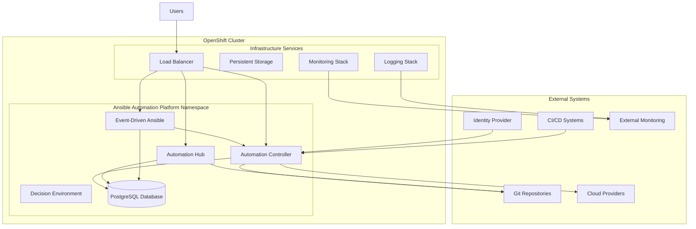

# IBM Ansible Automation Platform - Architecture Overview

## Executive Summary

IBM Ansible Automation Platform provides enterprise-grade automation capabilities through a comprehensive architecture designed for scale, security, and operational excellence. This document outlines the technical architecture, component interactions, and deployment patterns for successful implementation.

## High-Level Architecture

### Platform Components



## Core Components Architecture

### 1. Automation Controller

#### Component Overview
The Automation Controller serves as the central nervous system for automation workflows, providing job scheduling, execution, and management capabilities.

#### Technical Specifications
```yaml
Component: Automation Controller
Replicas: 3 (High Availability)
Resources:
  CPU: 2-4 cores per replica
  Memory: 8-16GB per replica
  Storage: 50GB persistent storage
Database: PostgreSQL (shared)
High Availability: Active-Active with load balancing
```

#### Architecture Details
- **Web Service**: REST API and web interface
- **Task Manager**: Job execution and workflow orchestration
- **Dispatcher**: Job distribution and scheduling
- **Callback Receiver**: Job result collection and processing
- **Periodic Task Manager**: Scheduled job execution

#### Data Flow
1. Users submit jobs through Web UI or API
2. Task Manager validates and queues jobs
3. Dispatcher assigns jobs to available execution nodes
4. Jobs execute on target infrastructure
5. Results flow back through Callback Receiver
6. Status updates stored in PostgreSQL database

### 2. Automation Hub

#### Component Overview
Automation Hub provides a private repository for Ansible content, execution environments, and certified collections.

#### Technical Specifications
```yaml
Component: Automation Hub
Replicas: 2 (High Availability)
Resources:
  CPU: 1-2 cores per replica
  Memory: 4-8GB per replica  
  Storage: 100GB persistent storage (RWX)
Database: PostgreSQL (shared)
Content Storage: Distributed file storage
```

#### Architecture Details
- **Web Service**: Collection and EE management interface
- **Pulp Services**: Content management and distribution
- **Registry**: Container registry for execution environments
- **Content Approval**: Workflow and governance
- **Sync Services**: External content synchronization

### 3. Event-Driven Ansible (EDA)

#### Component Overview
EDA enables reactive automation based on infrastructure events and external triggers.

#### Technical Specifications
```yaml
Component: Event-Driven Ansible
Replicas: 2 (High Availability)
Resources:
  CPU: 1-2 cores per replica
  Memory: 2-4GB per replica
  Storage: 20GB persistent storage
Database: PostgreSQL (shared)
Event Processing: Real-time stream processing
```

#### Architecture Details
- **Event Router**: Event ingestion and routing
- **Rule Engine**: Event matching and decision logic
- **Activation Manager**: Rulebook activation and lifecycle
- **Worker Processes**: Event processing and automation execution
- **Integration Services**: External system connectors

## Infrastructure Architecture

### 1. OpenShift Platform Layer

#### Cluster Architecture
```yaml
OpenShift Cluster:
  Control Plane: 3 nodes (HA)
  Worker Nodes: 6+ nodes (scalable)
  Infrastructure Nodes: 3 nodes (logging, monitoring, registry)

Node Specifications:
  Control Plane:
    CPU: 4 vCPU
    Memory: 16GB RAM
    Storage: 100GB
  Worker Nodes:
    CPU: 8 vCPU  
    Memory: 32GB RAM
    Storage: 200GB
  Infrastructure Nodes:
    CPU: 4 vCPU
    Memory: 16GB RAM
    Storage: 100GB
```

#### Namespace Architecture
- **ansible-automation**: Main application namespace
- **ansible-automation-operator**: Operator and CRDs
- **monitoring**: Monitoring stack components
- **logging**: Centralized logging infrastructure

### 2. Storage Architecture

#### Storage Classes and Requirements
```yaml
Storage Classes:
  fast-ssd (gp3):
    Use Case: Database, high-performance workloads
    Access Mode: ReadWriteOnce
    Performance: 3000 IOPS baseline
    
  standard (gp2):
    Use Case: General purpose storage
    Access Mode: ReadWriteOnce/ReadWriteMany
    Performance: 1000 IOPS baseline
    
  shared-storage (EFS):
    Use Case: Shared content, projects
    Access Mode: ReadWriteMany
    Performance: General purpose
```

#### Persistent Volume Allocation
```yaml
Automation Controller:
  Database: 100GB (fast-ssd)
  Projects: 50GB (shared-storage)
  Logs: 20GB (standard)

Automation Hub:
  Database: 50GB (fast-ssd)
  Content: 100GB (shared-storage)
  Registry: 200GB (standard)

Event-Driven Ansible:
  Database: 20GB (fast-ssd)
  Activation Data: 10GB (standard)
```

### 3. Network Architecture

#### Network Topology
```yaml
Network Configuration:
  Cluster Network: 10.128.0.0/14
  Service Network: 172.30.0.0/16
  Host Prefix: 23

Ingress Configuration:
  Type: OpenShift Routes
  TLS Termination: Edge
  Load Balancer: AWS Application Load Balancer
  
Security Groups:
  Application: 80/443 inbound, all outbound
  Database: 5432 from application SG only
  Monitoring: 9090-9093 from monitoring namespace
```

#### DNS and Service Discovery
- **Internal DNS**: Kubernetes DNS for service discovery
- **External DNS**: Route53 integration for public endpoints
- **Service Mesh**: Optional Istio integration for advanced networking

## Security Architecture

### 1. Authentication and Authorization

#### Identity and Access Management
```yaml
Authentication:
  Primary: SAML 2.0 SSO integration
  Secondary: OpenID Connect
  Fallback: Local user accounts (emergency only)
  
Authorization:
  Model: Role-Based Access Control (RBAC)
  Granularity: Organization, Project, Job Template level
  Integration: External directory services (LDAP/AD)
```

#### RBAC Model
```yaml
Platform Roles:
  - Platform Administrator: Full system access
  - Organization Administrator: Org-specific full access
  - Project Administrator: Project-specific management
  - Job Operator: Execute jobs and workflows
  - Job Auditor: Read-only access to job data

Permission Matrix:
  Resources: Organizations, Projects, Job Templates, Credentials
  Actions: Create, Read, Update, Delete, Execute, Approve
  Inheritance: Organization → Project → Job Template
```

### 2. Data Security

#### Encryption Strategy
```yaml
Encryption at Rest:
  Database: AES-256 encryption
  Storage Volumes: EBS encryption with KMS
  Secrets: Kubernetes secrets encryption
  Backups: Encrypted S3 storage

Encryption in Transit:
  Internal: TLS 1.3 for all inter-service communication
  External: TLS 1.3 for all client connections
  API: HTTPS only with certificate pinning
  Database: SSL/TLS encrypted connections
```

#### Certificate Management
```yaml
Certificate Authority: Enterprise CA or Let's Encrypt
Certificate Lifecycle:
  - Automated provisioning
  - Rotation every 90 days
  - Monitoring and alerting
  - Emergency renewal procedures

Certificate Types:
  - TLS certificates for web services
  - Client certificates for service-to-service
  - Code signing certificates for content
```

### 3. Network Security

#### Network Policies
```yaml
Default Deny: All traffic denied by default
Allow Rules:
  - Ingress from OpenShift router
  - Database access from app pods only
  - DNS resolution allowed
  - HTTPS outbound for external APIs
  - Monitoring scraping permitted

Segmentation:
  - Application tier isolation
  - Database tier restriction
  - Monitoring namespace separation
```

## Integration Architecture

### 1. Source Control Integration

#### Git Integration Patterns
```yaml
Supported Platforms:
  - GitHub Enterprise
  - GitLab (on-premises/SaaS)
  - Bitbucket Server/Cloud
  - Azure DevOps Git

Integration Methods:
  - SSH key authentication
  - Personal access tokens
  - OAuth/SAML authentication
  - Webhook notifications

Content Synchronization:
  - Automatic project sync
  - Manual project updates
  - Branch-based environments
  - Tag-based releases
```

### 2. CI/CD Integration

#### Pipeline Integration Points
```yaml
Integration Patterns:
  - Webhook-triggered deployments
  - API-driven job execution
  - Pipeline stage automation
  - Approval workflow integration

Supported Platforms:
  - Jenkins (on-premises/cloud)
  - Azure DevOps Pipelines
  - GitLab CI/CD
  - GitHub Actions
  - Tekton Pipelines
```

### 3. Cloud Provider Integration

#### Multi-Cloud Architecture
```yaml
AWS Integration:
  - EC2 instance management
  - S3 storage operations
  - RDS database automation
  - CloudFormation templates
  - IAM role assumption

Azure Integration:
  - Virtual Machine management
  - Storage Account operations
  - Azure SQL automation
  - ARM template deployment
  - Service Principal authentication

GCP Integration:
  - Compute Engine management
  - Cloud Storage operations
  - Cloud SQL automation
  - Deployment Manager templates
  - Service Account authentication
```

## Monitoring and Observability Architecture

### 1. Metrics Collection

#### Prometheus Integration
```yaml
Metrics Sources:
  - Platform components (Controller, Hub, EDA)
  - OpenShift cluster metrics
  - Application performance metrics
  - Business KPI metrics

Collection Strategy:
  - ServiceMonitor for automated discovery
  - Custom metrics endpoints
  - External metrics federation
  - Long-term storage (Thanos)

Retention Policy:
  - Real-time: 7 days in Prometheus
  - Historical: 90 days in long-term storage
  - Aggregated: 1 year retention
```

#### Key Performance Indicators
```yaml
Technical KPIs:
  - Platform availability (99.9% target)
  - Job success rate (95% target)
  - API response time (<5 seconds)
  - Resource utilization (70-80%)

Business KPIs:
  - Deployment frequency
  - Lead time for changes
  - Change failure rate
  - Recovery time objective
```

### 2. Logging Architecture

#### Centralized Logging
```yaml
Log Sources:
  - Application logs (structured JSON)
  - Audit logs (security events)
  - System logs (OpenShift/Kubernetes)
  - Access logs (ingress/API)

Log Pipeline:
  - Collection: Fluentd/Fluent Bit
  - Processing: OpenShift Logging Operator
  - Storage: Elasticsearch cluster
  - Visualization: Kibana dashboards
  - Alerting: ElastAlert integration

Retention Policy:
  - Application logs: 30 days
  - Audit logs: 1 year
  - System logs: 14 days
  - Archive: S3 long-term storage
```

### 3. Alerting Strategy

#### Alert Categories
```yaml
Critical Alerts:
  - Platform component failures
  - Database connectivity issues
  - Security event detection
  - Resource exhaustion

Warning Alerts:
  - Performance degradation
  - High resource utilization
  - Failed automation jobs
  - Certificate expiration

Notification Channels:
  - PagerDuty for critical alerts
  - Slack for team notifications
  - Email for stakeholder updates
  - ITSM integration for tickets
```

## Disaster Recovery Architecture

### 1. Backup Strategy

#### Data Protection
```yaml
Database Backups:
  - Full backup: Daily at 2 AM
  - Incremental: Every 6 hours
  - Point-in-time recovery: 24-hour window
  - Storage: Encrypted S3 with versioning

Application Data:
  - Project content: Daily sync to S3
  - Configuration: GitOps repository
  - Secrets: Sealed secrets in Git
  - Custom content: Automated export

Infrastructure:
  - Terraform state: S3 backend with locking
  - OpenShift configuration: GitOps approach
  - Persistent volumes: EBS snapshots
  - Container images: Multi-region registry
```

### 2. Recovery Procedures

#### Recovery Time Objectives (RTO)
```yaml
Platform Recovery:
  - Target RTO: 4 hours
  - Database restoration: 2 hours
  - Application deployment: 1 hour
  - Validation and testing: 1 hour

Data Recovery:
  - Target RPO: 6 hours
  - Database point-in-time: Any point within 24 hours
  - File restoration: Last daily backup
  - Configuration: Git repository state
```

#### Multi-Region Strategy
```yaml
Primary Region: us-east-1 (Production)
Secondary Region: us-west-2 (DR)

Replication Strategy:
  - Database: Cross-region automated backups
  - Storage: S3 cross-region replication
  - Container Images: Multi-region registry
  - DNS: Route53 health check failover
```

## Scalability and Performance

### 1. Horizontal Scaling

#### Auto-scaling Configuration
```yaml
Automation Controller:
  - Min replicas: 3
  - Max replicas: 10
  - CPU threshold: 70%
  - Memory threshold: 80%
  - Scale-up: 2 replicas per trigger
  - Scale-down: 1 replica per 5 minutes

Automation Hub:
  - Min replicas: 2
  - Max replicas: 5
  - CPU threshold: 75%
  - Memory threshold: 85%
  - Content-based scaling

Worker Nodes:
  - Cluster Autoscaler enabled
  - Node groups: 2-20 nodes
  - Scale triggers: Pod pending time
  - Instance types: m5.large to m5.4xlarge
```

### 2. Performance Optimization

#### Database Optimization
```yaml
PostgreSQL Configuration:
  - Connection pooling: pgBouncer
  - Read replicas: 2 instances
  - Connection limit: 200 concurrent
  - Query optimization: Automated VACUUM
  - Index management: Automated maintenance

Performance Tuning:
  - shared_buffers: 25% of RAM
  - effective_cache_size: 75% of RAM
  - work_mem: 4MB per connection
  - maintenance_work_mem: 2GB
```

#### Application Optimization
```yaml
Caching Strategy:
  - Redis for session storage
  - Content delivery via CDN
  - Static asset caching
  - API response caching

Resource Limits:
  - CPU requests/limits defined
  - Memory requests/limits defined
  - Quality of Service: Guaranteed
  - Resource quotas per namespace
```

## Compliance and Governance

### 1. Regulatory Compliance

#### Compliance Frameworks
```yaml
Supported Standards:
  - SOC 2 Type II
  - ISO 27001
  - PCI DSS
  - HIPAA
  - GDPR
  - NIST Cybersecurity Framework

Implementation:
  - Policy as Code enforcement
  - Automated compliance scanning
  - Continuous monitoring
  - Regular audit preparation
  - Evidence collection automation
```

### 2. Governance Model

#### Change Management
```yaml
Change Categories:
  - Emergency: Immediate deployment allowed
  - Standard: Change board approval required
  - Normal: Team lead approval sufficient
  - Automated: Pre-approved standard changes

Approval Workflow:
  - Code review: Peer review required
  - Security review: Automated scanning
  - Performance review: Load testing
  - Business approval: Stakeholder sign-off
```

## Conclusion

This architecture provides a robust, scalable, and secure foundation for enterprise automation with IBM Ansible Automation Platform. The design emphasizes high availability, security, and operational excellence while maintaining flexibility for future growth and integration requirements.

For implementation guidance, refer to the accompanying implementation guide and configuration templates. For specific customization requirements, engage with IBM Red Hat Services for professional consulting and support.