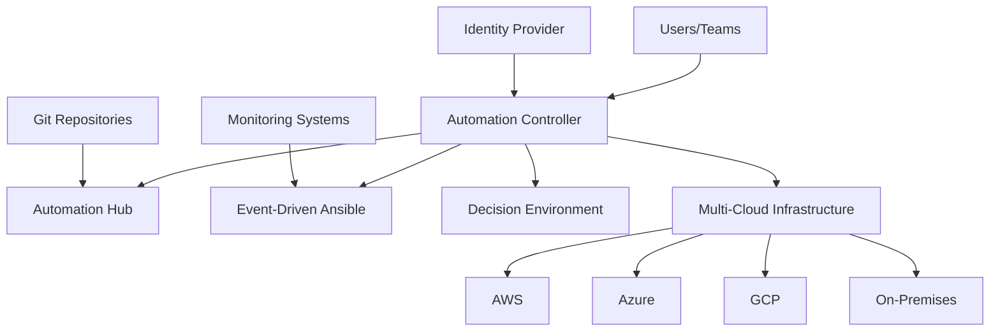

# IBM Ansible Automation Platform - Solution Design Template

## 1. Executive Summary

### 1.1 Solution Overview
IBM Ansible Automation Platform provides enterprise-grade automation capabilities for DevOps teams, enabling standardized, secure, and scalable infrastructure and application management across hybrid cloud environments. This solution design addresses [CUSTOMER_NAME]'s requirements for operational automation, compliance management, and multi-cloud orchestration.

### 1.2 Key Business Drivers
- **Operational Efficiency**: Reduce manual tasks by 80-90% through automation
- **Compliance Automation**: Achieve 95%+ compliance audit success rate
- **Cost Optimization**: Generate $850,000+ annual operational savings
- **Risk Mitigation**: Eliminate configuration drift and human errors

### 1.3 Solution Benefits
- Enterprise-grade automation at scale
- Multi-cloud and hybrid cloud support
- Role-based access control and governance
- Real-time monitoring and analytics
- Integration with existing toolchains

## 2. Current State Assessment

### 2.1 Infrastructure Inventory
```yaml
# Infrastructure Components
physical_servers: [TO_BE_DETERMINED]
virtual_machines: [TO_BE_DETERMINED]
cloud_instances:
  aws: [TO_BE_DETERMINED]
  azure: [TO_BE_DETERMINED]
  gcp: [TO_BE_DETERMINED]
container_platforms:
  openshift: [TO_BE_DETERMINED]
  kubernetes: [TO_BE_DETERMINED]
```

### 2.2 Current Automation Landscape
| **Tool/Platform** | **Usage** | **Coverage** | **Issues** |
|------------------|-----------|--------------|------------|
| [EXISTING_TOOL_1] | [DESCRIPTION] | [PERCENTAGE] | [LIMITATIONS] |
| [EXISTING_TOOL_2] | [DESCRIPTION] | [PERCENTAGE] | [LIMITATIONS] |
| [EXISTING_TOOL_3] | [DESCRIPTION] | [PERCENTAGE] | [LIMITATIONS] |

### 2.3 Pain Points Analysis
- **Manual Processes**: [SPECIFIC_EXAMPLES]
- **Inconsistent Configurations**: [IMPACT_ASSESSMENT]
- **Compliance Gaps**: [REGULATORY_REQUIREMENTS]
- **Skills Shortage**: [TEAM_CAPABILITIES]
- **Tool Fragmentation**: [INTEGRATION_CHALLENGES]

## 3. Target State Architecture

### 3.1 High-Level Architecture



### 3.2 Component Details

#### 3.2.1 Automation Controller
- **Purpose**: Central management and execution of automation workflows
- **Deployment**: High availability configuration with 3 replicas
- **Features**: 
  - Workflow orchestration and job scheduling
  - Role-based access control (RBAC)
  - REST API for integration
  - Comprehensive audit logging

#### 3.2.2 Automation Hub
- **Purpose**: Private repository for Ansible collections and execution environments
- **Deployment**: 2 replicas for redundancy
- **Features**:
  - Curated automation content
  - Execution environment management
  - Content lifecycle management
  - Security scanning and approval workflows

#### 3.2.3 Event-Driven Ansible
- **Purpose**: Reactive automation based on infrastructure events
- **Deployment**: 2 replicas with event processing
- **Features**:
  - Real-time event processing
  - Rule-based automation triggers
  - Integration with monitoring systems
  - Automated incident response

#### 3.2.4 Decision Environment
- **Purpose**: Policy-based automation governance
- **Features**:
  - Compliance policy enforcement
  - Approval workflows
  - Risk assessment and validation
  - Audit trail maintenance

### 3.3 Integration Architecture

#### 3.3.1 Identity and Access Management
```yaml
identity_providers:
  - type: SAML
    provider: [CUSTOMER_IDP]
    configuration:
      entity_id: "https://aap.[CUSTOMER_DOMAIN]"
      sso_url: "[IDP_SSO_URL]"
      certificate: "[IDP_CERTIFICATE]"
  
  - type: LDAP
    provider: Active Directory
    configuration:
      server_uri: "[LDAP_SERVER]"
      bind_dn: "[SERVICE_ACCOUNT]"
      user_search: "[USER_SEARCH_BASE]"
```

#### 3.3.2 Source Control Integration
```yaml
git_integrations:
  - name: Enterprise Git
    type: [GitHub Enterprise/GitLab/Bitbucket]
    url: "[GIT_SERVER_URL]"
    authentication: SSH Key
    webhook_support: true
    branch_protection: true
```

#### 3.3.3 CI/CD Pipeline Integration
```yaml
cicd_integrations:
  - name: [CICD_PLATFORM]
    type: [Jenkins/Azure DevOps/GitLab CI]
    integration_method: API/Webhook
    use_cases:
      - Infrastructure provisioning
      - Application deployment
      - Configuration management
      - Testing automation
```

## 4. Deployment Design

### 4.1 Platform Architecture

#### 4.1.1 OpenShift Cluster Specifications
```yaml
openshift_cluster:
  version: "4.14+"
  nodes:
    control_plane: 3
    worker_nodes: 6
    infra_nodes: 3
  node_specifications:
    control_plane:
      cpu: 4 vCPU
      memory: 16GB RAM
      storage: 100GB
    worker_nodes:
      cpu: 8 vCPU
      memory: 32GB RAM
      storage: 200GB
```

#### 4.1.2 Storage Requirements
```yaml
storage_classes:
  - name: fast-ssd
    type: gp3
    provisioner: kubernetes.io/aws-ebs
    use_case: Database and high-performance workloads
  
  - name: standard
    type: gp2
    provisioner: kubernetes.io/aws-ebs
    use_case: General purpose storage

persistent_volumes:
  automation_controller:
    size: 50Gi
    storage_class: fast-ssd
    access_mode: ReadWriteOnce
  
  automation_hub:
    size: 100Gi
    storage_class: standard
    access_mode: ReadWriteMany
  
  postgresql:
    size: 100Gi
    storage_class: fast-ssd
    access_mode: ReadWriteOnce
```

### 4.2 Network Design

#### 4.2.1 Network Segmentation
```yaml
network_configuration:
  cluster_network: "10.128.0.0/14"
  service_network: "172.30.0.0/16"
  host_prefix: 23
  
  ingress:
    type: OpenShift Routes
    tls_termination: edge
    certificates: "Custom CA certificates"
  
  load_balancer:
    type: Application Load Balancer
    health_checks: enabled
    ssl_termination: true
```

#### 4.2.2 Security Groups and Firewall Rules
```yaml
security_groups:
  automation_controller:
    inbound:
      - port: 443
        protocol: HTTPS
        source: "[ALLOWED_CIDRS]"
      - port: 80
        protocol: HTTP
        source: "[ALLOWED_CIDRS]"
    outbound:
      - port: "all"
        protocol: "all"
        destination: "0.0.0.0/0"
  
  database:
    inbound:
      - port: 5432
        protocol: TCP
        source: "automation_controller_sg"
    outbound: []
```

### 4.3 High Availability and Disaster Recovery

#### 4.3.1 High Availability Configuration
```yaml
high_availability:
  automation_controller:
    replicas: 3
    anti_affinity: true
    health_checks:
      readiness_probe: "/api/v2/ping/"
      liveness_probe: "/api/v2/ping/"
    
  automation_hub:
    replicas: 2
    storage_replication: true
    
  database:
    type: PostgreSQL HA
    replicas: 3
    backup_schedule: "daily"
    point_in_time_recovery: true
```

#### 4.3.2 Disaster Recovery Strategy
```yaml
disaster_recovery:
  backup_strategy:
    frequency: daily
    retention: 30 days
    storage_location: "[S3_BUCKET/AZURE_BLOB]"
    encryption: enabled
  
  recovery_objectives:
    rto: 4 hours  # Recovery Time Objective
    rpo: 24 hours # Recovery Point Objective
  
  testing_schedule:
    full_dr_test: quarterly
    partial_test: monthly
    backup_verification: weekly
```

## 5. Security Design

### 5.1 Security Framework

#### 5.1.1 Authentication and Authorization
```yaml
authentication:
  primary_method: SAML SSO
  fallback_method: Local accounts (emergency only)
  session_timeout: 8 hours
  multi_factor_authentication: required

authorization:
  model: Role-Based Access Control (RBAC)
  principle: Least privilege
  roles:
    - Platform Admin
    - Organization Admin
    - Project Admin
    - Job Operator
    - Job Auditor
```

#### 5.1.2 Encryption and Certificate Management
```yaml
encryption:
  data_at_rest:
    database: AES-256
    storage_volumes: AES-256
    secrets: Kubernetes secrets encryption
  
  data_in_transit:
    internal_communication: TLS 1.3
    external_access: TLS 1.3
    api_endpoints: HTTPS only
  
certificate_management:
  ca_authority: "[CUSTOMER_CA]"
  certificate_rotation: automated
  monitoring: certificate expiration alerts
```

### 5.2 Compliance and Governance

#### 5.2.1 Compliance Framework
```yaml
compliance_requirements:
  frameworks:
    - SOC 2 Type II
    - ISO 27001
    - [ADDITIONAL_FRAMEWORKS]
  
  controls:
    - Access control and user management
    - Data encryption and protection
    - Audit logging and monitoring
    - Change management and approval
    - Incident response and reporting
```

#### 5.2.2 Audit and Monitoring
```yaml
audit_configuration:
  log_retention: 1 year
  log_destinations:
    - Local storage
    - SIEM integration ([CUSTOMER_SIEM])
    - Cloud logging service
  
  monitored_events:
    - User authentication and authorization
    - Job execution and failures
    - Configuration changes
    - API access and usage
    - System and application events
```

## 6. Integration Specifications

### 6.1 Enterprise Systems Integration

#### 6.1.1 ITSM Integration
```yaml
itsm_integration:
  platform: [ServiceNow/BMC Remedy/JIRA Service Desk]
  integration_method: REST API
  use_cases:
    - Automated ticket creation for failed jobs
    - Change request workflow integration
    - Incident escalation and notification
    - Approval workflows for critical changes
  
  configuration:
    endpoint: "[ITSM_API_ENDPOINT]"
    authentication: OAuth 2.0
    webhook_support: bidirectional
```

#### 6.1.2 Monitoring and Observability
```yaml
monitoring_integration:
  platforms:
    - name: [Prometheus/Grafana]
      type: Metrics collection
      integration: ServiceMonitor
    
    - name: [Splunk/ELK Stack]
      type: Log aggregation
      integration: Log forwarding
    
    - name: [New Relic/Datadog]
      type: APM
      integration: Agent deployment
  
  dashboards:
    - Platform health and performance
    - Job execution statistics
    - Resource utilization
    - Security and compliance metrics
```

### 6.2 Cloud Platform Integration

#### 6.2.1 Multi-Cloud Connectivity
```yaml
cloud_integrations:
  aws:
    authentication: IAM roles
    services:
      - EC2 (compute management)
      - S3 (storage operations)
      - RDS (database automation)
      - CloudFormation (infrastructure as code)
  
  azure:
    authentication: Service principal
    services:
      - Virtual Machines
      - Storage Accounts
      - Azure SQL Database
      - ARM Templates
  
  gcp:
    authentication: Service account
    services:
      - Compute Engine
      - Cloud Storage
      - Cloud SQL
      - Deployment Manager
```

## 7. Implementation Plan

### 7.1 Phase 1: Foundation (Weeks 1-4)

#### 7.1.1 Infrastructure Setup
- **Week 1-2**: OpenShift cluster deployment and configuration
- **Week 3**: Ansible Automation Platform operator installation
- **Week 4**: Basic platform configuration and testing

#### 7.1.2 Core Configuration
```yaml
phase_1_deliverables:
  - OpenShift cluster with AAP operator
  - Automation Controller basic configuration
  - PostgreSQL database setup
  - Initial user and organization creation
  - Basic networking and ingress configuration
```

### 7.2 Phase 2: Integration and Automation (Weeks 5-8)

#### 7.2.1 Integration Implementation
- **Week 5**: Identity provider integration and RBAC setup
- **Week 6**: Source control and CI/CD integration
- **Week 7**: Monitoring and logging integration
- **Week 8**: Initial automation content development

#### 7.2.2 Pilot Use Cases
```yaml
pilot_automation:
  - Server patching automation
  - Application deployment workflows
  - Configuration compliance checking
  - Basic infrastructure provisioning
```

### 7.3 Phase 3: Production Deployment (Weeks 9-12)

#### 7.3.1 Production Preparation
- **Week 9**: Security hardening and compliance validation
- **Week 10**: High availability configuration and testing
- **Week 11**: Disaster recovery setup and testing
- **Week 12**: Production cutover and validation

#### 7.3.2 Go-Live Activities
```yaml
production_deployment:
  - Production environment validation
  - User training and onboarding
  - Operational runbook creation
  - Support process establishment
  - Success metrics baseline
```

## 8. Operating Model

### 8.1 Team Structure and Responsibilities

#### 8.1.1 Platform Team
```yaml
platform_team:
  role: Platform Administration and Management
  responsibilities:
    - Platform maintenance and updates
    - User and organization management
    - Security and compliance oversight
    - Integration management
  
  required_skills:
    - OpenShift administration
    - Ansible expertise
    - Security and compliance knowledge
    - DevOps practices
```

#### 8.1.2 Automation Development Team
```yaml
automation_team:
  role: Automation Content Development
  responsibilities:
    - Playbook and workflow development
    - Content testing and validation
    - Documentation and training materials
    - Best practices and standards
  
  required_skills:
    - Ansible playbook development
    - Infrastructure as code
    - Testing and validation
    - Git and CI/CD processes
```

### 8.2 Governance Model

#### 8.2.1 Change Management
```yaml
change_management:
  approval_process:
    - Development environment: Self-service
    - Staging environment: Team lead approval
    - Production environment: Change board approval
  
  automation_standards:
    - Code review requirements
    - Testing and validation criteria
    - Documentation standards
    - Security and compliance checks
```

#### 8.2.2 Performance Monitoring
```yaml
performance_metrics:
  technical_kpis:
    - Platform availability (99.9% target)
    - Job success rate (95% target)
    - Performance response time (<5 seconds)
    - Resource utilization (70-80% target)
  
  business_kpis:
    - Deployment frequency (weekly to daily)
    - Lead time reduction (50% improvement)
    - Change failure rate (<5%)
    - Recovery time (4 hours target)
```

## 9. Cost Analysis

### 9.1 Implementation Costs

#### 9.1.1 Year 1 Investment
```yaml
year_1_costs:
  aap_licenses: $150,000
  professional_services: $200,000
  infrastructure: $100,000
  training: $75,000
  total: $525,000
```

#### 9.1.2 Annual Recurring Costs
```yaml
recurring_costs:
  aap_licenses: $150,000
  infrastructure: $20,000
  support: $50,000
  training: $25,000
  total: $245,000
```

### 9.2 Total Cost of Ownership (3 Years)
```yaml
tco_analysis:
  total_investment: $1,015,000
  total_benefits: $2,550,000
  net_present_value: $1,535,000
  roi_percentage: 247%
  payback_period: 7.4 months
```

## 10. Success Criteria and Metrics

### 10.1 Technical Success Metrics
```yaml
technical_metrics:
  platform_performance:
    availability: ">99.9%"
    response_time: "<5 seconds"
    job_success_rate: ">95%"
    concurrent_jobs: ">50"
  
  automation_coverage:
    infrastructure_automation: ">80%"
    deployment_automation: ">90%"
    compliance_automation: ">95%"
    incident_automation: ">70%"
```

### 10.2 Business Success Metrics
```yaml
business_metrics:
  operational_efficiency:
    deployment_time_reduction: ">90%"
    incident_resolution_time: ">80%"
    configuration_drift_elimination: ">95%"
    manual_task_reduction: ">85%"
  
  financial_impact:
    annual_cost_savings: ">$850,000"
    productivity_improvement: ">60%"
    error_reduction: ">90%"
    compliance_improvement: ">95%"
```

## 11. Risk Assessment and Mitigation

### 11.1 Technical Risks
```yaml
technical_risks:
  - risk: Integration complexity with legacy systems
    probability: Medium
    impact: High
    mitigation: Phased integration approach with dedicated integration team
  
  - risk: Performance issues under high load
    probability: Low
    impact: Medium
    mitigation: Load testing and capacity planning during implementation
  
  - risk: Security vulnerabilities in automation content
    probability: Medium
    impact: High
    mitigation: Security scanning, code review, and testing processes
```

### 11.2 Business Risks
```yaml
business_risks:
  - risk: Change management and user adoption
    probability: Medium
    impact: High
    mitigation: Comprehensive training, change management, and user engagement
  
  - risk: Skills shortage and knowledge transfer
    probability: High
    impact: Medium
    mitigation: Training programs, documentation, and knowledge sharing
  
  - risk: Budget constraints and scope creep
    probability: Medium
    impact: Medium
    mitigation: Clear scope definition, change control, and regular reviews
```

## 12. Next Steps and Recommendations

### 12.1 Immediate Actions (Next 30 Days)
1. **Stakeholder Alignment**: Secure executive sponsorship and project governance
2. **Technical Assessment**: Conduct detailed infrastructure and integration assessment
3. **Team Formation**: Identify and assign project team members and responsibilities
4. **Planning**: Finalize implementation plan, timeline, and success criteria

### 12.2 Short-term Activities (30-90 Days)
1. **Procurement**: Complete platform licensing and professional services contracting
2. **Environment Preparation**: Set up development and staging environments
3. **Integration Planning**: Detailed integration design and testing plans
4. **Training**: Begin team training and certification programs

### 12.3 Implementation Readiness
1. **Technical Prerequisites**: Ensure all infrastructure and access requirements are met
2. **Organizational Readiness**: Confirm change management and communication plans
3. **Success Metrics**: Establish baseline measurements and monitoring capabilities
4. **Risk Mitigation**: Implement risk mitigation strategies and contingency plans

---

**Document Version**: 1.0  
**Last Updated**: [DATE]  
**Prepared By**: IBM Red Hat Services  
**Approved By**: [CUSTOMER_STAKEHOLDER]