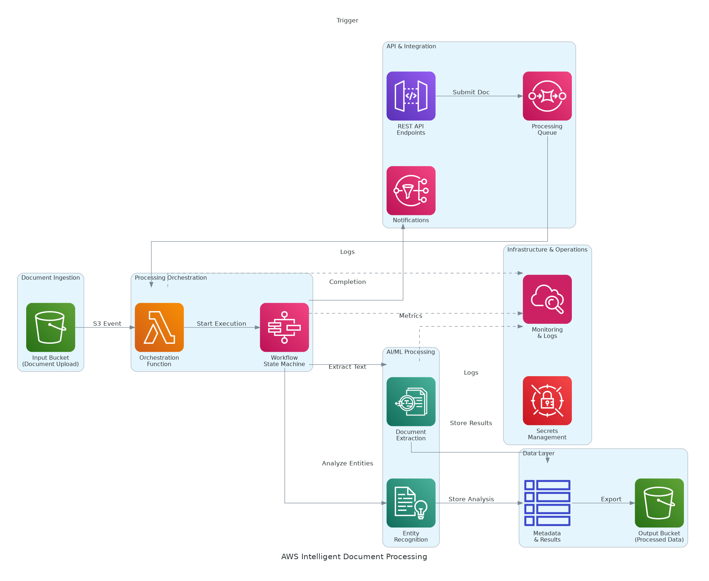

# NVIDIA DGX SuperPOD Architecture Diagram

## Overview
This directory should contain the architecture diagram for the NVIDIA DGX SuperPOD AI Infrastructure solution.

## Required Diagram: architecture-diagram

### Components to Include

#### GPU Compute Layer
- **DGX H100 Systems** (8 systems)
  - Label: "8x NVIDIA DGX H100"
  - Details: "64x H100 80GB GPUs (8 per system)"
  - Subcomponents: GPU Memory (5.12 TB aggregate), Dual AMD EPYC CPUs, 2 TB RAM per system

#### High-Speed Networking
- **InfiniBand Fabric**
  - Label: "NVIDIA Quantum-2 InfiniBand"
  - Details: "400 Gbps fabric, 4 switches"
  - Purpose: Multi-node distributed training, GPU-to-GPU communication
  - Bandwidth: 3.2 Tbps bisection bandwidth

#### Storage Infrastructure
- **NVIDIA Base Command Storage**
  - Label: "1 PB NVMe All-Flash Storage"
  - Details: "14 GB/s throughput, parallel file system"
  - Purpose: Training datasets, model checkpoints, intermediate results

#### Management & Orchestration
- **Base Command Manager**
  - Label: "NVIDIA Base Command Manager"
  - Details: "Cluster management, job scheduling, resource allocation"
  - Features: Multi-user support, quota management, monitoring

#### Software Stack
- **NGC Containers**
  - Label: "NGC GPU-Accelerated Containers"
  - Details: "PyTorch, TensorFlow, RAPIDS, Triton Inference Server"
  - Source: NVIDIA GPU Cloud catalog

- **NVIDIA AI Enterprise**
  - Label: "NVIDIA AI Enterprise Suite"
  - Details: "CUDA, TensorRT, cuDNN, NCCL libraries"
  - Licensing: 64 GPU licenses

#### External Connections
- **Data Sources**
  - Training data ingestion from enterprise data lakes
  - Model checkpointing to object storage
  - Integration with MLOps platforms

- **User Access**
  - SSH access for data scientists
  - Jupyter notebook servers
  - VS Code remote development

### Architecture Flow

1. **Data Ingestion**
   - Training datasets → Base Command Storage → DGX H100 Systems

2. **Distributed Training**
   - Job submission → Base Command Manager → Resource allocation
   - Multi-node training → InfiniBand fabric → GPU-to-GPU communication
   - Model checkpointing → Storage cluster

3. **Model Output**
   - Trained models → Model registry
   - Inference deployment → Production infrastructure

### Visual Layout Recommendations

```
┌─────────────────────────────────────────────────────────────────────┐
│                         Management Layer                             │
│  ┌──────────────────────────────────────────────────────────────┐   │
│  │         NVIDIA Base Command Manager                          │   │
│  │  (Job Scheduling, Resource Allocation, Monitoring)           │   │
│  └──────────────────────────────────────────────────────────────┘   │
└─────────────────────────────────────────────────────────────────────┘
                                   │
                                   ▼
┌─────────────────────────────────────────────────────────────────────┐
│                        GPU Compute Layer                             │
│  ┌──────────┐  ┌──────────┐  ┌──────────┐  ┌──────────┐            │
│  │ DGX H100 │  │ DGX H100 │  │ DGX H100 │  │ DGX H100 │  (x8)      │
│  │ 8x H100  │  │ 8x H100  │  │ 8x H100  │  │ 8x H100  │            │
│  └──────────┘  └──────────┘  └──────────┘  └──────────┘            │
│           64 GPUs Total • 32 petaFLOPS • 5.12 TB GPU Memory         │
└─────────────────────────────────────────────────────────────────────┘
                                   │
                   ┌───────────────┼───────────────┐
                   ▼                               ▼
┌───────────────────────────────────┐  ┌──────────────────────────────┐
│   InfiniBand Network Fabric       │  │    Storage Infrastructure    │
│  NVIDIA Quantum-2 400 Gbps        │  │   NVIDIA Base Command        │
│  3.2 Tbps Bisection Bandwidth     │  │   1 PB NVMe All-Flash        │
│  Multi-Node Training Optimization │  │   14 GB/s Throughput         │
└───────────────────────────────────┘  └──────────────────────────────┘
                                   │
                                   ▼
┌─────────────────────────────────────────────────────────────────────┐
│                        Software Stack                                │
│  ┌──────────────┐  ┌──────────────┐  ┌─────────────────────────┐   │
│  │ NGC          │  │ NVIDIA AI    │  │ AI Frameworks           │   │
│  │ Containers   │  │ Enterprise   │  │ PyTorch, TensorFlow,    │   │
│  │              │  │              │  │ JAX, RAPIDS             │   │
│  └──────────────┘  └──────────────┘  └─────────────────────────┘   │
└─────────────────────────────────────────────────────────────────────┘
                                   │
                                   ▼
┌─────────────────────────────────────────────────────────────────────┐
│                      External Integrations                           │
│  • Data Scientists (SSH, Jupyter, VS Code)                           │
│  • MLOps Platforms (MLflow, Weights & Biases)                        │
│  • Enterprise Data Lake (Training Datasets)                          │
│  • Production Inference Infrastructure                               │
└─────────────────────────────────────────────────────────────────────┘
```

### NVIDIA Icon Requirements

When creating the diagram in Draw.io or similar tools:

1. **Use NVIDIA Brand Colors:**
   - NVIDIA Green: #76B900
   - Black: #000000
   - White: #FFFFFF
   - Gray: #808080

2. **Component Representations:**
   - DGX Systems: Use server rack icons with GPU symbols
   - InfiniBand: Use high-speed network topology icons
   - Storage: Use storage array icons
   - Software: Use container/cloud icons

3. **Typography:**
   - Font: Arial or Helvetica (sans-serif)
   - Component labels: Bold, 14-16pt
   - Details: Regular, 10-12pt

### Export Settings

When exporting the diagram to PNG:
- **Resolution:** 300 DPI minimum
- **Format:** PNG with transparent background
- **Dimensions:** Minimum 2400x1600 pixels
- **File name:** `architecture-diagram.png`
- **Border:** 10px padding around diagram

### Files to Create

1. **architecture-diagram.drawio** - Source file for manual editing
2. **architecture-diagram.png** - Exported PNG for documentation

### Integration with Documentation

The architecture diagram is referenced in:
- `presales/raw/solution-briefing.md` (Slide 4: Solution Overview)
- Solution README files
- Technical documentation

Path in markdown:
```markdown

```

## Creating the Diagram

### Option 1: Draw.io Desktop (Recommended for NVIDIA)

1. **Download Draw.io:**
   - https://github.com/jgraph/drawio-desktop/releases

2. **Create New Diagram:**
   - Open Draw.io
   - Create new diagram
   - Select "Blank Diagram"

3. **Add Shapes:**
   - Use basic shapes (rectangles, cylinders, clouds)
   - Add NVIDIA green accents (#76B900)
   - Group related components

4. **Save and Export:**
   - Save as `architecture-diagram.drawio`
   - Export as PNG (300 DPI)
   - Save PNG as `architecture-diagram.png`

### Option 2: Other Tools

- **Lucidchart:** Professional diagramming with NVIDIA shapes
- **Microsoft Visio:** Enterprise diagramming tool
- **diagrams.net:** Web-based alternative to Draw.io desktop

## Notes

- Focus on GPU compute architecture and high-speed networking
- Emphasize InfiniBand fabric for multi-node training
- Highlight massive scale (64 GPUs, 32 petaFLOPS)
- Show integration with NVIDIA software ecosystem
- Include data flow from ingestion to trained models
