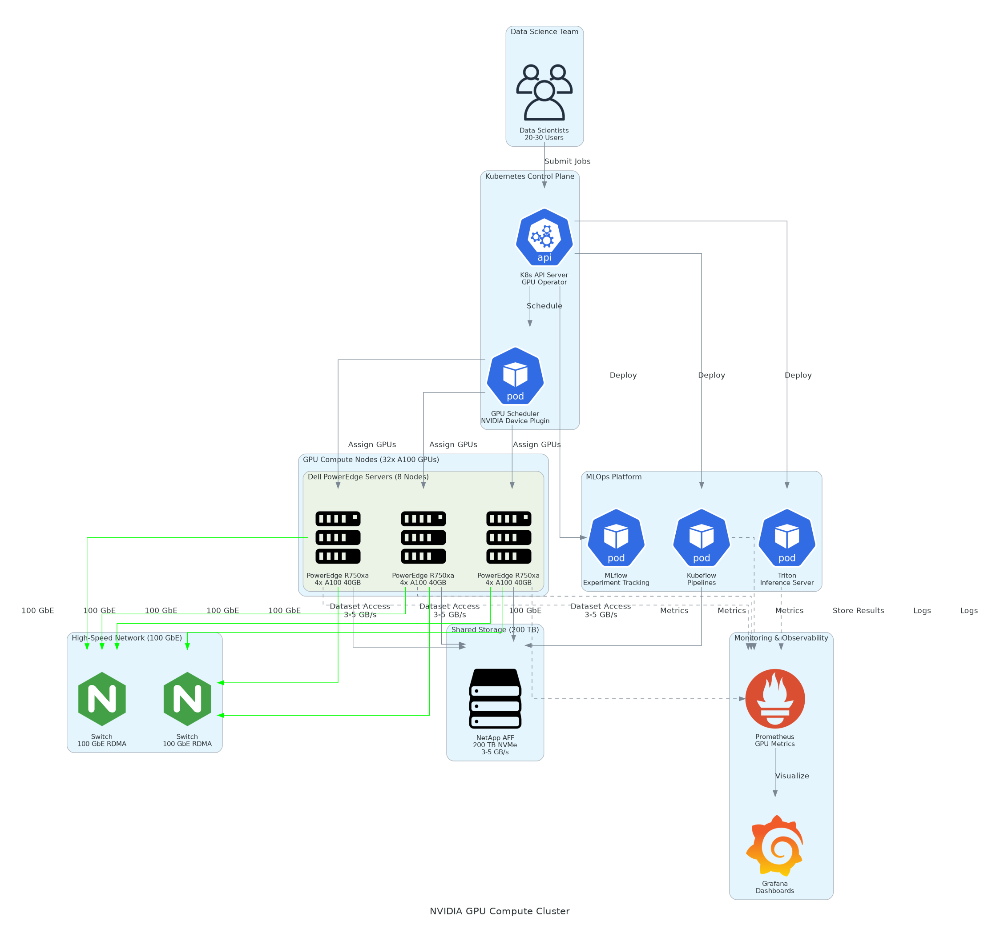

# Executive Summary

This document provides the comprehensive technical design for the NVIDIA GPU Compute Cluster with Kubernetes implementation. It covers the target-state architecture for an 8-server GPU cluster with 32 A100 40GB GPUs, 100 GbE RoCE networking, 200 TB NetApp storage, and Kubernetes orchestration with NVIDIA GPU Operator, Kubeflow, MLflow, and Triton.

## Purpose

Define the technical architecture and design specifications that will guide the implementation team through deployment, configuration, and validation of the enterprise GPU compute cluster for AI/ML workloads.

## Scope

**In-scope:**
- 8x Dell R750xa servers with 32 NVIDIA A100 40GB GPUs
- 100 GbE networking with RoCE for distributed training
- 200 TB NetApp AFF NVMe storage cluster
- Kubernetes with NVIDIA GPU Operator and time-slicing
- Kubeflow for ML pipelines, MLflow for experiment tracking
- Triton Inference Server for model serving
- JupyterHub for interactive data science

**Out-of-scope:**
- Custom ML model development
- Ongoing managed services
- Phase 2 expansion to 64+ GPUs

## Assumptions & Constraints

- Datacenter has power and cooling capacity for 8 GPU servers
- 100 GbE network infrastructure available
- 20+ data scientists will use the platform
- 99.5% uptime SLA requirement

## References

- Statement of Work (SOW)
- NVIDIA GPU Operator documentation
- Kubernetes best practices for GPU scheduling
- Kubeflow and MLflow documentation

# Business Context

## Business Drivers

- **Training Acceleration:** Reduce AI model training time by 10x vs CPU baseline
- **Cost Optimization:** Replace $480K annual cloud GPU spend with owned infrastructure
- **GPU Utilization:** Achieve 80%+ utilization through Kubernetes scheduling
- **MLOps Platform:** Standardize ML workflows with Kubeflow, MLflow, Triton

## Workload Criticality & SLA Expectations

<!-- TABLE_CONFIG: widths=[25, 25, 25, 25] -->
| Metric | Target | Measurement | Priority |
|--------|--------|-------------|----------|
| Cluster Availability | 99.5% | Kubernetes monitoring | Critical |
| GPU Utilization | 80%+ | DCGM metrics | High |
| Training Performance | 10x vs CPU | Benchmark validation | Critical |
| Inference Latency | <50ms p99 | Triton metrics | High |

## Compliance & Regulatory Factors

- LDAP/AD integration for centralized user management
- Kubernetes RBAC for namespace isolation
- Network policies for traffic segmentation

## Success Criteria

- 32 A100 GPUs operational with Kubernetes scheduling
- GPU Operator managing drivers and device plugin
- Kubeflow pipelines executing with GPU resources
- Triton serving 50+ production models

# Current-State Assessment

## Application Landscape

<!-- TABLE_CONFIG: widths=[25, 30, 25, 20] -->
| Application | Purpose | Technology | Status |
|-------------|---------|------------|--------|
| Cloud GPU Instances | AI training | AWS p3.8xlarge | To be replaced |
| JupyterHub | Interactive dev | Cloud-hosted | To be migrated |
| MLflow | Experiment tracking | On-premises | Integration point |

## Infrastructure Inventory

<!-- TABLE_CONFIG: widths=[20, 15, 35, 30] -->
| Component | Quantity | Specifications | Notes |
|-----------|----------|----------------|-------|
| GPU Servers | 8 | Dell R750xa with 4x A100 | New deployment |
| Network | 2 | 100 GbE switches | RoCE enabled |
| Storage | 1 | NetApp AFF 200 TB | NVMe all-flash |

## Dependencies & Integration Points

- Corporate LDAP/AD for authentication
- DNS and NTP servers
- Existing MLflow instance

## Network Topology

- Management Network: 25 GbE for SSH and monitoring
- GPU Network: 100 GbE RoCE for NCCL and distributed training
- Storage Network: 100 GbE for NFS mounts

## Performance Baseline

- Cloud GPU training: Limited by spot availability and cost
- Target: 10x acceleration with dedicated on-premises cluster

# Solution Architecture

The following diagram illustrates the target-state architecture for the GPU compute cluster, showing the relationship between compute nodes, Kubernetes orchestration, storage, and the MLOps platform components.

## Architecture Principles

- **Performance:** Optimize for GPU utilization and training throughput
- **Scalability:** Design for future expansion to 64+ GPUs
- **Reliability:** HA control plane, workload rescheduling on failure
- **Security:** RBAC, network policies, namespace isolation

## Architecture Patterns

- Kubernetes-native GPU scheduling with device plugin
- MLOps pipeline pattern with Kubeflow
- Model serving with Triton Inference Server

## Component Design

<!-- TABLE_CONFIG: widths=[18, 25, 22, 18, 17] -->
| Component | Purpose | Technology | Dependencies | Scaling |
|-----------|---------|------------|--------------|---------|
| GPU Servers | AI compute | Dell R750xa | Power, cooling | Horizontal |
| Kubernetes | Orchestration | K8s 1.28 | All servers | Control plane HA |
| GPU Operator | Driver management | NVIDIA Operator | Kubernetes | Per-node |
| Kubeflow | ML pipelines | Kubeflow 1.8 | Kubernetes | Horizontal |
| MLflow | Experiment tracking | MLflow 2.9 | Storage | Vertical |
| Triton | Model serving | Triton 24.01 | GPU nodes | Horizontal |

## Technology Stack

<!-- TABLE_CONFIG: widths=[25, 35, 40] -->
| Layer | Technology | Rationale |
|-------|------------|-----------|
| Compute | A100 40GB | Industry-standard AI accelerator |
| Orchestration | Kubernetes | Cloud-native GPU scheduling |
| ML Platform | Kubeflow + MLflow | End-to-end ML lifecycle |
| Inference | Triton | High-performance model serving |

# Security & Compliance

## Identity & Access Management

- LDAP/AD integration for user authentication
- Kubernetes RBAC for namespace access control
- JupyterHub OAuth for single sign-on

### Role Definitions

<!-- TABLE_CONFIG: widths=[20, 40, 40] -->
| Role | Permissions | Scope |
|------|-------------|-------|
| Cluster Admin | Full cluster access | All namespaces |
| Data Scientist | GPU pod creation | Assigned namespace |
| ML Engineer | Pipeline management | Kubeflow namespace |

## Secrets Management

- Kubernetes secrets for credentials
- External secrets operator integration

## Network Security

- Calico network policies for namespace isolation
- No external access to GPU network

## Data Protection

- NFS permissions for dataset access control
- Model artifacts stored on shared storage

## Compliance Mappings

<!-- TABLE_CONFIG: widths=[25, 35, 40] -->
| Requirement | Control | Implementation |
|-------------|---------|----------------|
| Access Control | Kubernetes RBAC | Namespace isolation |
| Audit Logging | Kubernetes audit | API server logging |

## Audit Logging & SIEM Integration

- Kubernetes API audit logs
- DCGM events for GPU monitoring

# Data Architecture

## Data Model

### Conceptual Model

- Training datasets on shared storage
- Model checkpoints for fault tolerance
- MLflow artifacts for experiment tracking

### Logical Model

<!-- TABLE_CONFIG: widths=[20, 25, 30, 25] -->
| Data Type | Location | Access Pattern | Retention |
|-----------|----------|----------------|-----------|
| Datasets | /shared/datasets | Read-heavy | Permanent |
| Checkpoints | /shared/checkpoints | Write-heavy | 30 days |
| Models | /shared/models | Read-heavy | Permanent |

## Data Flow Design

1. Data loaded from /shared/datasets
2. Training runs on GPU pods
3. Checkpoints saved periodically
4. Final model stored in MLflow

## Data Migration Strategy

- Datasets copied from cloud storage
- Checksum validation for integrity

## Data Governance

- LDAP group-based access control
- Project-based dataset organization

# Integration Design

## External System Integrations

<!-- TABLE_CONFIG: widths=[18, 15, 15, 15, 22, 15] -->
| System | Type | Protocol | Format | Error Handling | SLA |
|--------|------|----------|--------|----------------|-----|
| LDAP/AD | Real-time | LDAP | Binary | Retry | 99.9% |
| MLflow | Real-time | HTTP | JSON | Circuit breaker | 99.5% |

## API Design

- kubectl for cluster management
- Kubeflow SDK for pipeline submission
- MLflow tracking API for experiments
- Triton HTTP/gRPC for inference

### API Endpoints

<!-- TABLE_CONFIG: widths=[15, 30, 20, 35] -->
| Method | Endpoint | Auth | Description |
|--------|----------|------|-------------|
| HTTPS | kubeflow.internal | OIDC | ML pipeline access |
| HTTPS | mlflow.internal | LDAP | Experiment tracking |
| HTTPS | triton.internal | API Key | Model inference |

## Authentication & SSO Flows

- LDAP authentication for all services
- Kubernetes service accounts for workloads

## Messaging & Event Patterns

- Kubernetes events for workload status
- Prometheus alerting for thresholds

# Infrastructure & Operations

## Network Design

- Management VLAN: 10.100.0.0/24
- GPU/Storage VLAN: 10.200.0.0/24 (RoCE enabled)

## Compute Sizing

<!-- TABLE_CONFIG: widths=[25, 20, 20, 20, 15] -->
| Component | Specification | Per Server | Total | Count |
|-----------|---------------|------------|-------|-------|
| GPUs | A100 40GB | 4 | 32 | 8 servers |
| GPU Memory | HBM2e | 160 GB | 1.28 TB | 8 servers |
| System RAM | DDR4 | 1 TB | 8 TB | 8 servers |

## High Availability Design

- 3-node Kubernetes control plane
- Pod rescheduling on node failure
- Redundant network connections

## Disaster Recovery

- Daily etcd backups
- Storage snapshots

## Monitoring & Alerting

- DCGM for GPU metrics
- Prometheus + Grafana dashboards
- Alertmanager for notifications

### Alert Definitions

<!-- TABLE_CONFIG: widths=[25, 25, 25, 25] -->
| Alert | Condition | Severity | Response |
|-------|-----------|----------|----------|
| GPU Temp High | >80°C | Warning | Check cooling |
| Node Down | Unreachable 5m | Critical | Investigate |

## Logging & Observability

- Centralized logging with Elasticsearch
- Kubernetes events and pod logs

## Cost Model

<!-- TABLE_CONFIG: widths=[30, 25, 25, 20] -->
| Category | Year 1 | Annual Operating | Notes |
|----------|--------|------------------|-------|
| Hardware | $840,000 | - | Servers, GPUs, network |
| Storage | $180,000 | $20,000 | NetApp AFF |
| Software | $96,000 | $96,000 | NVIDIA AI Enterprise |
| Services | $84,000 | - | Implementation |
| **Total** | **$1,200,000** | **$116,000** | |

# Implementation Approach

## Migration/Deployment Strategy

- Phased deployment with Kubernetes first
- GPU Operator installation after cluster ready
- MLOps stack after GPU scheduling validated

## Sequencing & Wave Planning

<!-- TABLE_CONFIG: widths=[15, 30, 25, 30] -->
| Phase | Activities | Duration | Exit Criteria |
|-------|------------|----------|---------------|
| Discovery | Requirements, design | 3 weeks | Design approved |
| Infrastructure | Servers, network, storage | 4 weeks | Hardware ready |
| Kubernetes | K8s, GPU Operator, MLOps | 4 weeks | Platform operational |
| Testing | Validation, UAT | 2 weeks | Tests passing |
| Hypercare | Production support | 3 weeks | Team self-sufficient |

## Tooling & Automation

<!-- TABLE_CONFIG: widths=[25, 35, 40] -->
| Category | Tool | Purpose |
|----------|------|---------|
| IaC | Ansible | Server configuration |
| K8s Deploy | Helm | Application deployment |
| Monitoring | Prometheus | Metrics collection |

## Cutover Approach

- Phased user migration from cloud
- Parallel operation during transition

## Downtime Expectations

- Planned: 4-hour maintenance windows
- Unplanned: <4 hour MTTR target

## Rollback Strategy

- Cloud resources maintained during hypercare
- Kubernetes rollback for failed deployments

# Appendices

## Architecture Diagrams

- Solution Architecture (included above)
- Network Topology Diagram
- Kubernetes Cluster Diagram

## Naming Conventions

<!-- TABLE_CONFIG: widths=[25, 35, 40] -->
| Resource Type | Pattern | Example |
|---------------|---------|---------|
| GPU Servers | gpu-node-{nn} | gpu-node-01 |
| Namespaces | {team}-{env} | ds-team-prod |
| PVCs | {app}-data | training-data |

## Tagging Standards

<!-- TABLE_CONFIG: widths=[25, 35, 40] -->
| Tag | Required | Example |
|-----|----------|---------|
| Team | Yes | data-science |
| Project | Yes | model-training |

## Risk Register

<!-- TABLE_CONFIG: widths=[25, 15, 15, 45] -->
| Risk | Likelihood | Impact | Mitigation |
|------|------------|--------|------------|
| GPU driver issues | Medium | High | GPU Operator manages |
| Network bottleneck | Low | Medium | RoCE validated |
| Storage performance | Low | Medium | NVMe all-flash |

## Glossary

<!-- TABLE_CONFIG: widths=[25, 75] -->
| Term | Definition |
|------|------------|
| A100 | NVIDIA Ampere architecture GPU |
| GPU Operator | NVIDIA Kubernetes operator for GPU management |
| RoCE | RDMA over Converged Ethernet |
| Kubeflow | ML pipeline orchestration platform |
