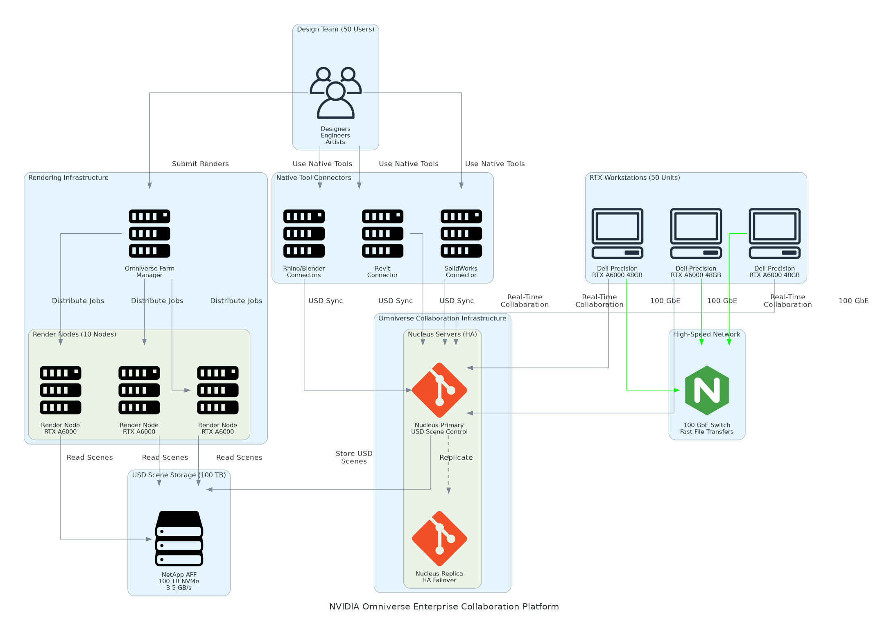

# NVIDIA Omniverse Enterprise Architecture Diagram

## Overview
This directory should contain the architecture diagram for the NVIDIA Omniverse Enterprise Collaboration Platform solution.

## Required Diagram: architecture-diagram

### Components to Include

#### User Workstations
- **Dell Precision 7960 Workstations** (50 workstations)
  - Label: "50x Dell Precision RTX Workstations"
  - Details: "NVIDIA RTX A6000 48GB per workstation"
  - Specs: Intel Xeon W, 64GB RAM, 2TB NVMe

#### Collaboration Infrastructure
- **Omniverse Nucleus Servers** (2 servers for HA)
  - Label: "Omniverse Nucleus Cluster"
  - Details: "Primary + Replica for High Availability"
  - Purpose: USD scene storage, version control, real-time sync

#### Design Tool Connectors
- **CAD/BIM Tools**
  - Revit connector
  - SolidWorks connector
  - Rhino connector

- **Content Creation Tools**
  - Blender connector
  - Maya connector
  - 3ds Max connector

- **Real-Time Engines**
  - Unreal Engine connector
  - Unity connector

#### Storage Infrastructure
- **NetApp AFF A400**
  - Label: "NetApp 100 TB NVMe Storage"
  - Details: "USD scenes, models, textures, caches"
  - Performance: 3-5 GB/s throughput for scene sync

#### Rendering Infrastructure
- **Omniverse Farm** (10 rendering nodes)
  - Label: "Omniverse Farm Rendering Cluster"
  - Details: "10x RTX A6000 nodes for batch rendering"
  - Purpose: Overnight production renders, batch jobs

#### Networking
- **100 GbE Network**
  - Label: "100 GbE Ethernet Fabric"
  - Details: "Fast file transfers, real-time scene sync"
  - Mellanox switches for high bandwidth

#### Software Platform
- **Omniverse Enterprise**
  - Label: "NVIDIA Omniverse Enterprise Platform"
  - Details: "50 user licenses, USD collaboration"
  - Features: Real-time sync, version control, multi-user editing

- **RTX Rendering**
  - Label: "RTX Real-Time Ray Tracing"
  - Details: "Interactive photorealistic rendering"
  - Technology: NVIDIA RTX, OptiX, MDL materials

#### Optional Components
- **Omniverse Streaming**
  - Label: "Cloud Streaming (Optional)"
  - Details: "Remote access for distributed teams"

- **PhysX Simulation**
  - Label: "PhysX Physics Engine"
  - Details: "Real-time physics for digital twins"

### Architecture Flow

1. **Design Workflow**
   - Designer → Native CAD tool (Revit/SolidWorks) → Omniverse Connector
   - Connector → USD conversion → Nucleus server → Real-time sync
   - Other users → See changes instantly in their native tools

2. **Collaboration**
   - Multiple users → Same USD scene → Different tools
   - Real-time updates → Version control → Branch/merge workflows

3. **Rendering**
   - Interactive: Workstation RTX → Real-time ray tracing
   - Batch: Omniverse Farm → Production quality renders

### Visual Layout Recommendations

```
┌─────────────────────────────────────────────────────────────────────┐
│                     Design Team Workstations                         │
│  ┌──────────┐  ┌──────────┐  ┌──────────┐  ┌──────────┐            │
│  │ Revit    │  │SolidWorks│  │  Rhino   │  │ Blender  │  (x50)     │
│  │ RTX A6000│  │ RTX A6000│  │ RTX A6000│  │ RTX A6000│            │
│  └────┬─────┘  └────┬─────┘  └────┬─────┘  └────┬─────┘            │
│       │             │              │             │                   │
│       └─────────────┼──────────────┼─────────────┘                   │
│                     │              │                                 │
│              ┌──────▼──────────────▼──────┐                          │
│              │ Omniverse Connectors       │                          │
│              │ (USD Translation Layer)    │                          │
│              └──────┬─────────────────────┘                          │
└─────────────────────┼───────────────────────────────────────────────┘
                      │
                      ▼
┌─────────────────────────────────────────────────────────────────────┐
│                  Omniverse Collaboration Layer                       │
│  ┌───────────────────────────────────────────────────────────────┐  │
│  │              Omniverse Nucleus Server Cluster                  │  │
│  │  ┌─────────────────────┐    ┌─────────────────────┐           │  │
│  │  │  Primary Server     │◄──►│   Replica Server    │           │  │
│  │  │  (Active)           │    │   (High Availability)│           │  │
│  │  └─────────────────────┘    └─────────────────────┘           │  │
│  │                                                                 │  │
│  │  Features:                                                      │  │
│  │  • USD Scene Storage & Version Control                         │  │
│  │  • Real-Time Multi-User Sync                                   │  │
│  │  • Git-Like Branching & Merging                                │  │
│  │  • Access Control & Permissions                                │  │
│  └───────────────────────────────────────────────────────────────┘  │
└─────────────────────────────────────────────────────────────────────┘
                      │
      ┌───────────────┼───────────────┐
      ▼                               ▼
┌──────────────────────────┐  ┌──────────────────────────────────────┐
│ Storage Infrastructure   │  │    Rendering Infrastructure          │
│  NetApp AFF A400         │  │    Omniverse Farm                    │
│  100 TB NVMe All-Flash   │  │    10x RTX A6000 Nodes               │
│  3-5 GB/s Throughput     │  │    Batch Production Rendering        │
│                          │  │    Overnight Jobs                    │
│  • USD Scenes            │  └──────────────────────────────────────┘
│  • 3D Models & Assets    │
│  • Textures & Materials  │
│  • Render Caches         │
└──────────────────────────┘
                      │
                      ▼
┌─────────────────────────────────────────────────────────────────────┐
│                      100 GbE Network Fabric                          │
│  Fast File Transfers • Real-Time Scene Sync • Low Latency           │
└─────────────────────────────────────────────────────────────────────┘
                      │
                      ▼
┌─────────────────────────────────────────────────────────────────────┐
│                   Visualization & Output                             │
│  ┌──────────────┐  ┌──────────────┐  ┌─────────────────────────┐   │
│  │ RTX Real-Time│  │ VR           │  │ Marketing               │   │
│  │ Ray Tracing  │  │ Walkthroughs │  │ Visualizations          │   │
│  └──────────────┘  └──────────────┘  └─────────────────────────┘   │
└─────────────────────────────────────────────────────────────────────┘
                      │
                      ▼
┌─────────────────────────────────────────────────────────────────────┐
│                   Optional Cloud Services                            │
│  • Omniverse Streaming (Remote Access)                              │
│  • PhysX Simulation (Digital Twins)                                 │
│  • Client Presentation (View-Only Access)                           │
└─────────────────────────────────────────────────────────────────────┘
```

### NVIDIA Icon Requirements

When creating the diagram in Draw.io or similar tools:

1. **Use NVIDIA Brand Colors:**
   - NVIDIA Green: #76B900
   - Omniverse Purple: #8A3FFC
   - Black: #000000
   - White: #FFFFFF
   - Gray: #808080

2. **Component Representations:**
   - Workstations: Desktop/laptop icons with RTX badge
   - Nucleus Servers: Server cluster icons with USD symbol
   - Connectors: Plugin/integration icons
   - Storage: Storage array icons
   - Rendering Farm: GPU cluster icons

3. **Typography:**
   - Font: Arial or Helvetica (sans-serif)
   - Component labels: Bold, 14-16pt
   - Details: Regular, 10-12pt

4. **Visual Elements:**
   - Use arrows to show USD data flow
   - Show real-time sync with bidirectional arrows
   - Highlight multi-user collaboration with icons

### Export Settings

When exporting the diagram to PNG:
- **Resolution:** 300 DPI minimum
- **Format:** PNG with transparent background
- **Dimensions:** Minimum 2400x1600 pixels
- **File name:** `architecture-diagram.png`
- **Border:** 10px padding around diagram

### Files to Create

1. **architecture-diagram.drawio** - Source file for manual editing
2. **architecture-diagram.png** - Exported PNG for documentation

### Integration with Documentation

The architecture diagram is referenced in:
- `presales/raw/solution-briefing.md` (Slide 4: Solution Overview)
- Solution README files
- Technical documentation

Path in markdown:
```markdown

```

## Creating the Diagram

### Option 1: Draw.io Desktop (Recommended)

1. **Download Draw.io:**
   - https://github.com/jgraph/drawio-desktop/releases

2. **Create New Diagram:**
   - Open Draw.io
   - Create new diagram
   - Select "Blank Diagram"

3. **Add Components:**
   - Workstations at top (design tools)
   - Nucleus cluster in center
   - Storage and rendering infrastructure below
   - Connect with labeled arrows showing USD flow

4. **Styling:**
   - Use NVIDIA green (#76B900) for key components
   - Use Omniverse purple (#8A3FFC) for collaboration elements
   - Clear labels for all components

5. **Save and Export:**
   - Save as `architecture-diagram.drawio`
   - Export as PNG (300 DPI)
   - Save PNG as `architecture-diagram.png`

### Option 2: Other Tools

- **Lucidchart:** Professional diagramming
- **Microsoft Visio:** Enterprise diagramming tool
- **diagrams.net:** Web-based alternative

## Special Considerations for Omniverse

1. **Emphasize Real-Time Collaboration:**
   - Show multiple users working simultaneously
   - Bidirectional arrows for real-time sync
   - Version control branch/merge visualization

2. **USD as Central Format:**
   - Highlight Universal Scene Description (USD)
   - Show connectors translating native formats to USD
   - Demonstrate multi-tool interoperability

3. **RTX Acceleration:**
   - Show RTX ray tracing at workstation level
   - Highlight rendering farm for batch jobs
   - Demonstrate interactive vs. production rendering

4. **Collaboration Workflows:**
   - Architect in Revit → USD scene
   - Lighting designer in Unreal → Same USD scene
   - Marketing in Blender → Same USD scene
   - All see each other's changes in real-time

## Notes

- Focus on collaboration and real-time sync capabilities
- Emphasize multi-tool interoperability via USD
- Highlight RTX rendering performance
- Show Nucleus as central collaboration hub
- Include rendering farm for batch production work
- Demonstrate workstation-centric architecture
