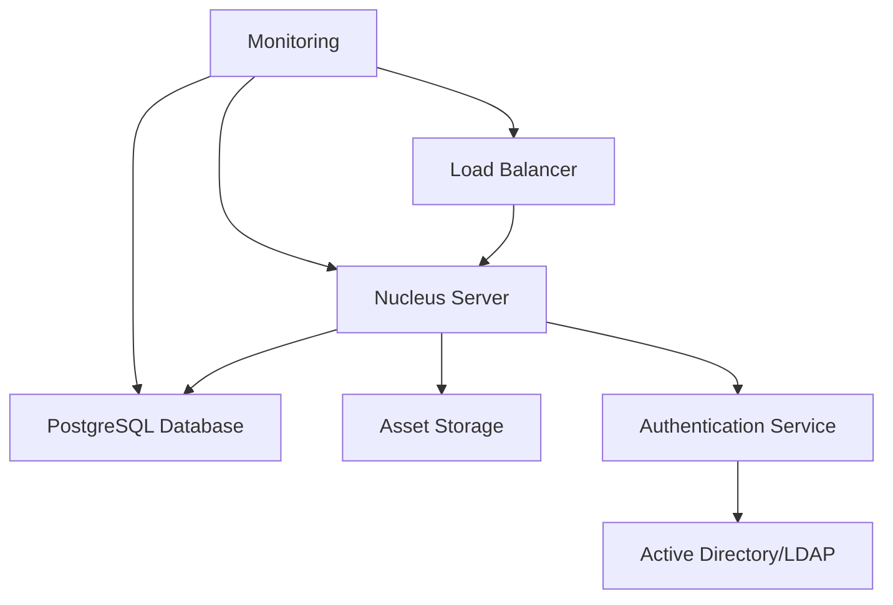

# NVIDIA Omniverse Enterprise Operations Runbook

## Overview

This operations runbook provides comprehensive procedures for the day-to-day management, monitoring, and maintenance of NVIDIA Omniverse Enterprise infrastructure. It includes routine operational tasks, emergency procedures, and best practices for maintaining optimal system performance and availability.

## System Overview

### Architecture Summary
- **Nucleus Server**: Central collaboration hub managing USD assets and user sessions
- **Client Applications**: Workstation-based creative tools and viewers
- **Supporting Infrastructure**: Load balancers, storage systems, and network components
- **Security Layer**: Authentication services, firewalls, and monitoring systems

### Key Service Dependencies


## Daily Operations

### Morning System Health Check

**1. Service Status Verification**
```bash
#!/bin/bash
# Daily health check script - run at 8:00 AM

echo "=== Omniverse Daily Health Check ===" 
date

# Check Nucleus services
systemctl status nucleus-server
systemctl status nucleus-navigator
systemctl status nucleus-discovery

# Check database
systemctl status postgresql
sudo -u postgres psql -c "SELECT version();"

# Check load balancer
curl -I https://omniverse.company.com/health

# Check storage availability
df -h /mnt/omniverse-storage
```

**2. Performance Metrics Review**
```bash
# Check system resources
echo "=== System Resources ==="
free -h
df -h
uptime

# Check network connectivity
echo "=== Network Status ==="
ping -c 3 omniverse-primary.company.com
ping -c 3 omniverse-backup.company.com

# Monitor active user sessions
echo "=== Active Sessions ==="
curl -H "Authorization: Bearer $ADMIN_TOKEN" \
     "https://omniverse.company.com/api/v1/sessions" | jq .
```

**3. Log Analysis**
```bash
# Check for critical errors in last 24 hours
journalctl --since "24 hours ago" --priority=err

# Review Nucleus server logs
tail -50 /opt/ove/nucleus/logs/nucleus-server.log | grep ERROR

# Database log review
tail -50 /var/log/postgresql/postgresql-15-main.log | grep -i error
```

### User Session Management

**Active Session Monitoring**
```bash
# List all active sessions
nucleus-admin session list

# Get session details
nucleus-admin session info --session-id <session-id>

# Monitor collaboration sessions
curl -H "Authorization: Bearer $API_TOKEN" \
     "https://nucleus-server/api/v1/sessions?status=active" | \
     jq '.sessions[] | {id: .id, users: .users, project: .project}'
```

**Session Performance Optimization**
```bash
# Check session resource usage
nucleus-admin session stats --detailed

# Identify high-bandwidth sessions
netstat -i | awk 'NR>2 {print $1, $10}' | sort -k2 -nr

# Clean up abandoned sessions (idle > 2 hours)
nucleus-admin session cleanup --idle-timeout 7200
```

## Weekly Operations

### System Maintenance

**Sunday Maintenance Window (2:00 AM - 6:00 AM)**

**1. Database Maintenance**
```sql
-- Database vacuum and reindex (PostgreSQL)
VACUUM ANALYZE;
REINDEX DATABASE nucleus;

-- Update table statistics
ANALYZE;

-- Check database size and growth
SELECT 
    schemaname,
    tablename,
    pg_size_pretty(pg_total_relation_size(schemaname||'.'||tablename)) as size
FROM pg_tables 
WHERE schemaname = 'public' 
ORDER BY pg_total_relation_size(schemaname||'.'||tablename) DESC;
```

**2. Storage Cleanup**
```bash
#!/bin/bash
# Weekly storage maintenance

# Clean up temporary files
find /tmp -name "*.usd_tmp" -mtime +7 -delete
find /var/cache/nucleus -type f -mtime +30 -delete

# Archive old logs
find /opt/ove/nucleus/logs -name "*.log.*" -mtime +30 -gzip
find /var/log/nginx -name "*.log.*" -mtime +30 -delete

# Clean up orphaned asset files
nucleus-admin assets cleanup --orphaned --confirm

# Storage space report
echo "=== Storage Space Report ==="
df -h | grep -E "(omniverse|nucleus)"
du -sh /opt/ove/nucleus/data/*
```

**3. Security Updates**
```bash
# Update system packages (Ubuntu/Debian)
apt update && apt list --upgradable

# Update NVIDIA drivers (if newer version available)
ubuntu-drivers devices
nvidia-smi

# Check for Omniverse updates
nucleus-admin version check
curl -s https://api.nvidia.com/omniverse/updates | jq .
```

### Performance Analysis

**Weekly Performance Report**
```python
#!/usr/bin/env python3
# Weekly performance report generator

import json
import requests
from datetime import datetime, timedelta

def generate_weekly_report():
    end_time = datetime.now()
    start_time = end_time - timedelta(days=7)
    
    report = {
        "period": f"{start_time.strftime('%Y-%m-%d')} to {end_time.strftime('%Y-%m-%d')}",
        "metrics": {}
    }
    
    # Get system metrics from monitoring API
    metrics = requests.get(
        f"https://monitoring.company.com/api/v1/query_range",
        params={
            "query": "nucleus_active_sessions",
            "start": start_time.isoformat(),
            "end": end_time.isoformat(),
            "step": "1h"
        }
    ).json()
    
    # Generate summary
    report["metrics"]["avg_sessions"] = calculate_average(metrics)
    report["metrics"]["peak_sessions"] = calculate_peak(metrics)
    report["metrics"]["system_uptime"] = get_uptime()
    
    # Save report
    with open(f"omniverse-report-{start_time.strftime('%Y%m%d')}.json", "w") as f:
        json.dump(report, f, indent=2)

if __name__ == "__main__":
    generate_weekly_report()
```

## Monthly Operations

### Capacity Planning

**Monthly Capacity Review**
```bash
#!/bin/bash
# Monthly capacity planning report

echo "=== Monthly Capacity Planning Report ==="
echo "Report Date: $(date)"
echo

# Storage growth analysis
echo "=== Storage Growth ==="
du -sh /opt/ove/nucleus/data/projects/* | sort -hr | head -20

# Database size trend
echo "=== Database Growth ==="
sudo -u postgres psql -c "
SELECT 
    date_trunc('month', created_at) as month,
    count(*) as new_assets,
    pg_size_pretty(sum(file_size)) as storage_used
FROM assets 
GROUP BY date_trunc('month', created_at) 
ORDER BY month DESC 
LIMIT 12;"

# User activity analysis
echo "=== User Activity Trends ==="
curl -H "Authorization: Bearer $API_TOKEN" \
     "https://nucleus-server/api/v1/analytics/users/monthly" | jq .
```

**Resource Scaling Recommendations**
```python
#!/usr/bin/env python3
import psutil
import json
from datetime import datetime

def capacity_analysis():
    # CPU utilization trend
    cpu_percent = psutil.cpu_percent(interval=60)
    
    # Memory usage
    memory = psutil.virtual_memory()
    
    # Disk usage
    disk = psutil.disk_usage('/opt/ove/nucleus')
    
    # Network I/O
    network = psutil.net_io_counters()
    
    recommendations = []
    
    if cpu_percent > 80:
        recommendations.append("Consider CPU upgrade or load balancing")
    
    if memory.percent > 85:
        recommendations.append("Memory upgrade recommended")
    
    if disk.percent > 80:
        recommendations.append("Storage expansion required soon")
    
    report = {
        "timestamp": datetime.now().isoformat(),
        "current_usage": {
            "cpu_percent": cpu_percent,
            "memory_percent": memory.percent,
            "disk_percent": disk.percent
        },
        "recommendations": recommendations
    }
    
    print(json.dumps(report, indent=2))

if __name__ == "__main__":
    capacity_analysis()
```

### Security Auditing

**Monthly Security Assessment**
```bash
#!/bin/bash
# Monthly security audit

echo "=== Monthly Security Audit ==="
date

# Check for failed authentication attempts
echo "=== Failed Authentication Analysis ==="
journalctl --since "1 month ago" | grep "authentication failed" | wc -l

# Review user access permissions
echo "=== User Access Review ==="
nucleus-admin users list --inactive-days 30

# SSL certificate expiry check
echo "=== Certificate Expiry Check ==="
echo | openssl s_client -servername omniverse.company.com \
                        -connect omniverse.company.com:443 2>/dev/null | \
       openssl x509 -noout -dates

# Security scan summary
echo "=== Security Scan Results ==="
nmap -sS -O omniverse.company.com | grep -E "(open|filtered)"

# Vulnerability assessment
echo "=== System Updates Available ==="
apt list --upgradable | grep -i security
```

## Emergency Procedures

### Service Recovery

**Nucleus Server Failure**
```bash
#!/bin/bash
# Emergency Nucleus server recovery procedure

echo "=== Nucleus Server Recovery Procedure ==="
echo "Initiated at: $(date)"

# Step 1: Check service status
systemctl status nucleus-server

# Step 2: Attempt service restart
echo "Attempting service restart..."
systemctl restart nucleus-server
sleep 30

# Step 3: Verify database connectivity
echo "Checking database connectivity..."
sudo -u postgres psql -c "SELECT 1;" > /dev/null
if [ $? -eq 0 ]; then
    echo "Database connection: OK"
else
    echo "Database connection: FAILED - initiating database recovery"
    systemctl restart postgresql
fi

# Step 4: Check disk space
echo "Checking disk space..."
DISK_USAGE=$(df /opt/ove/nucleus | tail -1 | awk '{print $5}' | sed 's/%//')
if [ $DISK_USAGE -gt 90 ]; then
    echo "CRITICAL: Disk space at ${DISK_USAGE}%"
    # Emergency cleanup
    find /opt/ove/nucleus/logs -name "*.log.*" -mtime +1 -delete
fi

# Step 5: Health check
sleep 60
curl -f https://omniverse.company.com/health || echo "Health check failed"

echo "Recovery procedure completed at: $(date)"
```

**Database Recovery**
```bash
#!/bin/bash
# Emergency database recovery

echo "=== Database Recovery Procedure ==="

# Check PostgreSQL status
if ! systemctl is-active --quiet postgresql; then
    echo "Starting PostgreSQL service..."
    systemctl start postgresql
    sleep 30
fi

# Verify database integrity
echo "Checking database integrity..."
sudo -u postgres pg_dump nucleus > /dev/null
if [ $? -ne 0 ]; then
    echo "Database corruption detected - initiating repair"
    sudo -u postgres reindexdb nucleus
    sudo -u postgres vacuumdb --analyze nucleus
fi

# Restore from backup if necessary
if ! sudo -u postgres psql nucleus -c "SELECT 1;" > /dev/null; then
    echo "Database unrecoverable - restoring from latest backup"
    ./restore-database-backup.sh
fi
```

### Failover Procedures

**Primary to Secondary Site Failover**
```bash
#!/bin/bash
# Production failover procedure

echo "=== PRODUCTION FAILOVER INITIATED ==="
echo "Time: $(date)"
echo "Operator: $USER"

# Step 1: Notify stakeholders
curl -X POST https://alerts.company.com/api/notifications \
     -d '{"message": "Omniverse failover initiated", "severity": "critical"}'

# Step 2: Stop primary services gracefully
echo "Stopping primary site services..."
systemctl stop nucleus-server
systemctl stop nginx

# Step 3: Promote secondary database
echo "Promoting secondary database..."
ssh nucleus-secondary "sudo -u postgres pg_promote /var/lib/postgresql/15/main/"

# Step 4: Update DNS records
echo "Updating DNS records..."
./update-dns-failover.sh

# Step 5: Start secondary services
echo "Starting secondary site services..."
ssh nucleus-secondary "systemctl start nucleus-server"
ssh nucleus-secondary "systemctl start nginx"

# Step 6: Verify failover success
echo "Verifying failover..."
sleep 60
curl -f https://omniverse.company.com/health && echo "Failover successful"

echo "=== FAILOVER COMPLETED at $(date) ==="
```

## Monitoring and Alerting

### Key Metrics to Monitor

**System Health Metrics**
```yaml
# Prometheus monitoring configuration
groups:
- name: omniverse_alerts
  rules:
  - alert: NucleusServerDown
    expr: up{job="nucleus"} == 0
    for: 1m
    annotations:
      summary: "Nucleus server is down"

  - alert: HighCPUUsage
    expr: cpu_usage_percent > 90
    for: 5m
    annotations:
      summary: "High CPU usage on {{ $labels.instance }}"

  - alert: DatabaseConnectionFailure
    expr: postgres_up == 0
    for: 30s
    annotations:
      summary: "Database connection failed"

  - alert: StorageSpaceLow
    expr: disk_usage_percent > 85
    for: 5m
    annotations:
      summary: "Storage space low on {{ $labels.mountpoint }}"
```

**Custom Monitoring Scripts**
```python
#!/usr/bin/env python3
# Custom monitoring script for Omniverse metrics

import requests
import psutil
import json
import time
from datetime import datetime

def collect_metrics():
    metrics = {
        "timestamp": datetime.now().isoformat(),
        "system": {
            "cpu_percent": psutil.cpu_percent(),
            "memory_percent": psutil.virtual_memory().percent,
            "disk_usage": psutil.disk_usage('/').percent
        }
    }
    
    try:
        # Check Nucleus API health
        response = requests.get('https://nucleus-server/health', timeout=10)
        metrics["nucleus"] = {
            "status": "healthy" if response.status_code == 200 else "unhealthy",
            "response_time": response.elapsed.total_seconds()
        }
        
        # Get active sessions
        sessions_response = requests.get('https://nucleus-server/api/v1/sessions')
        metrics["sessions"] = {
            "active_count": len(sessions_response.json().get('sessions', []))
        }
        
    except Exception as e:
        metrics["nucleus"] = {"status": "error", "error": str(e)}
    
    # Send metrics to monitoring system
    requests.post('http://monitoring-server:8086/write', 
                 data=f"omniverse_metrics {json.dumps(metrics)}")
    
    return metrics

if __name__ == "__main__":
    while True:
        metrics = collect_metrics()
        print(f"Collected metrics: {metrics['timestamp']}")
        time.sleep(60)  # Collect every minute
```

## Backup and Recovery

### Automated Backup Procedures

**Daily Database Backup**
```bash
#!/bin/bash
# Daily database backup script - run at 2:00 AM

DATE=$(date +%Y%m%d_%H%M%S)
BACKUP_DIR="/backup/nucleus-db"
RETENTION_DAYS=30

echo "Starting database backup: $DATE"

# Create backup directory
mkdir -p $BACKUP_DIR

# Perform database dump
sudo -u postgres pg_dump nucleus | gzip > \
    "$BACKUP_DIR/nucleus_backup_$DATE.sql.gz"

# Verify backup integrity
gunzip -t "$BACKUP_DIR/nucleus_backup_$DATE.sql.gz"
if [ $? -eq 0 ]; then
    echo "Database backup completed successfully: $DATE"
else
    echo "ERROR: Database backup verification failed: $DATE"
    exit 1
fi

# Clean up old backups
find $BACKUP_DIR -name "nucleus_backup_*.sql.gz" -mtime +$RETENTION_DAYS -delete

# Upload to cloud storage (optional)
aws s3 cp "$BACKUP_DIR/nucleus_backup_$DATE.sql.gz" \
         "s3://company-backups/omniverse/database/"

echo "Database backup procedure completed: $DATE"
```

**Asset Storage Backup**
```bash
#!/bin/bash
# Weekly asset storage backup - run Sundays at 1:00 AM

DATE=$(date +%Y%m%d)
SOURCE="/opt/ove/nucleus/data"
BACKUP_DIR="/backup/nucleus-assets"
RETENTION_WEEKS=8

echo "Starting asset backup: $DATE"

# Create incremental backup using rsync
rsync -av --link-dest="$BACKUP_DIR/latest" \
      "$SOURCE/" "$BACKUP_DIR/backup-$DATE/"

# Update latest symlink
rm -f "$BACKUP_DIR/latest"
ln -s "backup-$DATE" "$BACKUP_DIR/latest"

# Clean up old backups
find $BACKUP_DIR -maxdepth 1 -name "backup-*" -mtime +$(($RETENTION_WEEKS * 7)) \
     -exec rm -rf {} \;

echo "Asset backup completed: $DATE"
```

### Disaster Recovery Testing

**Monthly DR Test Procedure**
```bash
#!/bin/bash
# Monthly disaster recovery test

echo "=== Disaster Recovery Test ==="
echo "Test Date: $(date)"

# Test 1: Database restore
echo "Testing database restore..."
sudo -u postgres dropdb nucleus_test
sudo -u postgres createdb nucleus_test
gunzip -c /backup/nucleus-db/latest.sql.gz | \
    sudo -u postgres psql nucleus_test

# Test 2: Asset restore
echo "Testing asset restore..."
mkdir -p /tmp/dr-test
rsync -av /backup/nucleus-assets/latest/ /tmp/dr-test/

# Test 3: Service startup
echo "Testing service startup..."
docker run -d --name nucleus-test \
    -v /tmp/dr-test:/data \
    nvidia/omniverse-nucleus:latest

# Cleanup
sleep 30
docker stop nucleus-test
docker rm nucleus-test
rm -rf /tmp/dr-test
sudo -u postgres dropdb nucleus_test

echo "DR test completed successfully"
```

## Change Management

### Deployment Procedures

**Production Deployment Checklist**
```markdown
# Pre-Deployment Checklist
- [ ] Change request approved by stakeholders
- [ ] Backup verification completed
- [ ] Maintenance window scheduled and communicated
- [ ] Rollback plan prepared and tested
- [ ] Monitoring alerts configured for deployment
- [ ] Team notifications sent

# Deployment Steps
- [ ] Put system in maintenance mode
- [ ] Stop application services
- [ ] Deploy new software version
- [ ] Run database migrations (if required)
- [ ] Update configuration files
- [ ] Start services in dependency order
- [ ] Perform smoke tests
- [ ] Monitor system health for 30 minutes
- [ ] Remove maintenance mode

# Post-Deployment
- [ ] Verify all functionality working
- [ ] Check performance metrics
- [ ] Confirm user access restored
- [ ] Document any issues encountered
- [ ] Send completion notification
```

**Rollback Procedure**
```bash
#!/bin/bash
# Emergency rollback procedure

echo "=== EMERGENCY ROLLBACK INITIATED ==="
echo "Time: $(date)"

# Stop current services
systemctl stop nucleus-server
systemctl stop nginx

# Restore previous version
tar -xzf /backup/previous-version.tar.gz -C /opt/ove/

# Restore database if schema changed
if [ "$DB_ROLLBACK_REQUIRED" = "true" ]; then
    sudo -u postgres dropdb nucleus
    sudo -u postgres createdb nucleus
    gunzip -c /backup/nucleus-db/pre-deployment.sql.gz | \
        sudo -u postgres psql nucleus
fi

# Restart services
systemctl start nucleus-server
systemctl start nginx

# Verify rollback success
sleep 60
curl -f https://omniverse.company.com/health && \
    echo "ROLLBACK SUCCESSFUL" || echo "ROLLBACK FAILED"

echo "=== ROLLBACK COMPLETED at $(date) ==="
```

This comprehensive operations runbook provides the foundation for maintaining a robust, high-performance NVIDIA Omniverse Enterprise deployment with proper monitoring, backup, and recovery procedures.